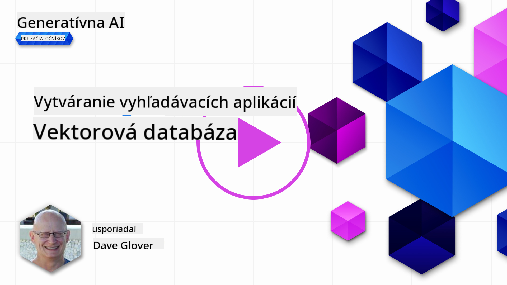
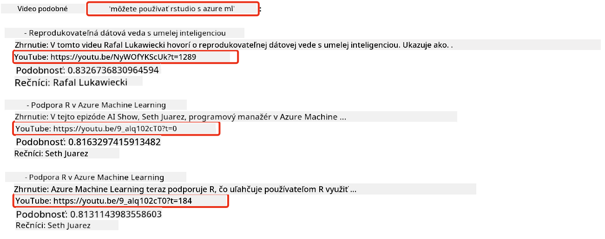
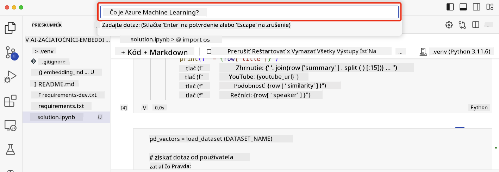

<!--
CO_OP_TRANSLATOR_METADATA:
{
  "original_hash": "d46aad0917a1a342d613e2c13d457da5",
  "translation_date": "2025-07-09T13:01:39+00:00",
  "source_file": "08-building-search-applications/README.md",
  "language_code": "sk"
}
-->
# Vytváranie vyhľadávacích aplikácií

[](https://aka.ms/gen-ai-lesson8-gh?WT.mc_id=academic-105485-koreyst)

> > _Kliknite na obrázok vyššie pre zobrazenie videa k tejto lekcii_

Veľké jazykové modely (LLM) nie sú len o chatbotoch a generovaní textu. Pomocou Embeddings je možné vytvárať aj vyhľadávacie aplikácie. Embeddings sú číselné reprezentácie dát, známe aj ako vektory, ktoré sa dajú použiť na sémantické vyhľadávanie dát.

V tejto lekcii si vytvoríte vyhľadávaciu aplikáciu pre náš vzdelávací startup. Náš startup je nezisková organizácia, ktorá poskytuje bezplatné vzdelávanie študentom v rozvojových krajinách. Máme veľké množstvo YouTube videí, ktoré študenti môžu využiť na učenie o AI. Startup chce vytvoriť vyhľadávaciu aplikáciu, ktorá umožní študentom vyhľadávať YouTube video zadaním otázky.

Napríklad študent môže zadať „Čo sú Jupyter Notebooky?“ alebo „Čo je Azure ML“ a vyhľadávacia aplikácia vráti zoznam YouTube videí relevantných k otázke, a ešte lepšie, aplikácia vráti odkaz na čas vo videu, kde sa nachádza odpoveď na otázku.

## Úvod

V tejto lekcii sa naučíme:

- Sémantické vs kľúčové slová vo vyhľadávaní.
- Čo sú Textové Embeddings.
- Vytvorenie indexu Textových Embeddings.
- Vyhľadávanie v indexe Textových Embeddings.

## Ciele učenia

Po dokončení tejto lekcie budete vedieť:

- Rozlíšiť sémantické a kľúčové vyhľadávanie.
- Vysvetliť, čo sú Textové Embeddings.
- Vytvoriť aplikáciu využívajúcu Embeddings na vyhľadávanie dát.

## Prečo vytvárať vyhľadávaciu aplikáciu?

Vytvorenie vyhľadávacej aplikácie vám pomôže pochopiť, ako používať Embeddings na vyhľadávanie dát. Tiež sa naučíte, ako vytvoriť aplikáciu, ktorú môžu študenti použiť na rýchle nájdenie informácií.

Lekcia obsahuje Embedding index pre prepisy videí z YouTube kanála Microsoft [AI Show](https://www.youtube.com/playlist?list=PLlrxD0HtieHi0mwteKBOfEeOYf0LJU4O1). AI Show je YouTube kanál, ktorý vás učí o AI a strojovom učení. Embedding index obsahuje Embeddings pre každý prepis videí až do októbra 2023. Tento index použijete na vytvorenie vyhľadávacej aplikácie pre náš startup. Aplikácia vráti odkaz na čas vo videu, kde sa nachádza odpoveď na otázku. Je to skvelý spôsob, ako študenti rýchlo nájdu potrebné informácie.

Nižšie je príklad sémantického dopytu na otázku „môžete použiť rstudio s azure ml?“. Pozrite si URL YouTube, uvidíte, že obsahuje časový údaj, ktorý vás zavedie na miesto vo videu, kde je odpoveď na otázku.



## Čo je sémantické vyhľadávanie?

Možno sa pýtate, čo je sémantické vyhľadávanie? Sémantické vyhľadávanie je technika, ktorá využíva význam slov v dopyte na vrátenie relevantných výsledkov.

Tu je príklad sémantického vyhľadávania. Predstavte si, že chcete kúpiť auto a zadáte dopyt „moje vysnívané auto“. Sémantické vyhľadávanie chápe, že nespíte o aute, ale hľadáte svoje ideálne auto. Chápe váš zámer a vráti relevantné výsledky. Alternatívou je vyhľadávanie podľa kľúčových slov, ktoré by doslovne hľadalo sny o autách a často by vrátilo nerelevantné výsledky.

## Čo sú Textové Embeddings?

[Textové embeddings](https://en.wikipedia.org/wiki/Word_embedding?WT.mc_id=academic-105485-koreyst) sú technika reprezentácie textu používaná v [spracovaní prirodzeného jazyka](https://en.wikipedia.org/wiki/Natural_language_processing?WT.mc_id=academic-105485-koreyst). Textové embeddings sú sémantické číselné reprezentácie textu. Embeddings sa používajú na reprezentáciu dát tak, aby ich stroj ľahko pochopil. Existuje mnoho modelov na tvorbu textových embeddings, v tejto lekcii sa zameriame na generovanie embeddings pomocou OpenAI Embedding Modelu.

Tu je príklad, predstavte si, že nasledujúci text je z prepisu jedného z dielov na YouTube kanáli AI Show:

```text
Today we are going to learn about Azure Machine Learning.
```

Text by sme poslali do OpenAI Embedding API, ktoré by vrátilo embedding pozostávajúci z 1536 čísel, teda vektor. Každé číslo vo vektore reprezentuje iný aspekt textu. Pre stručnosť uvádzame prvých 10 čísel vo vektore.

```python
[-0.006655829958617687, 0.0026128944009542465, 0.008792596869170666, -0.02446001023054123, -0.008540431968867779, 0.022071078419685364, -0.010703742504119873, 0.003311325330287218, -0.011632772162556648, -0.02187200076878071, ...]
```

## Ako sa vytvára Embedding index?

Embedding index pre túto lekciu bol vytvorený sériou Python skriptov. Skripty spolu s inštrukciami nájdete v [README](./scripts/README.md?WT.mc_id=academic-105485-koreyst) v priečinku `scripts` pre túto lekciu. Na dokončenie lekcie nemusíte tieto skripty spúšťať, pretože Embedding index je už pripravený.

Skripty vykonávajú tieto operácie:

1. Stiahne sa prepis každého YouTube videa z playlistu [AI Show](https://www.youtube.com/playlist?list=PLlrxD0HtieHi0mwteKBOfEeOYf0LJU4O1).
2. Pomocou [OpenAI Functions](https://learn.microsoft.com/azure/ai-services/openai/how-to/function-calling?WT.mc_id=academic-105485-koreyst) sa pokúsi získať meno rečníka z prvých 3 minút prepisu videa. Meno rečníka sa uloží do Embedding indexu s názvom `embedding_index_3m.json`.
3. Text prepisu sa rozdelí na **3-minútové textové segmenty**. Segmenty majú približne 20 slov prekryv s nasledujúcim segmentom, aby sa embedding segmentu nepretrhol a poskytol lepší kontext pre vyhľadávanie.
4. Každý textový segment sa pošle do OpenAI Chat API na zhrnutie do 60 slov. Zhrnutie sa tiež uloží do Embedding indexu `embedding_index_3m.json`.
5. Nakoniec sa text segmentu pošle do OpenAI Embedding API. Embedding API vráti vektor s 1536 číslami, ktoré reprezentujú sémantický význam segmentu. Segment spolu s OpenAI embedding vektorom sa uloží do Embedding indexu `embedding_index_3m.json`.

### Vektorové databázy

Pre jednoduchosť lekcie je Embedding index uložený v JSON súbore s názvom `embedding_index_3m.json` a načítaný do Pandas DataFrame. V produkcii by však bol Embedding index uložený vo vektorovej databáze, ako napríklad [Azure Cognitive Search](https://learn.microsoft.com/training/modules/improve-search-results-vector-search?WT.mc_id=academic-105485-koreyst), [Redis](https://cookbook.openai.com/examples/vector_databases/redis/readme?WT.mc_id=academic-105485-koreyst), [Pinecone](https://cookbook.openai.com/examples/vector_databases/pinecone/readme?WT.mc_id=academic-105485-koreyst), [Weaviate](https://cookbook.openai.com/examples/vector_databases/weaviate/readme?WT.mc_id=academic-105485-koreyst) a ďalšie.

## Pochopenie kosínovej podobnosti

Naučili sme sa o textových embeddings, ďalším krokom je naučiť sa, ako ich použiť na vyhľadávanie dát a konkrétne nájsť najpodobnejšie embeddings k danému dopytu pomocou kosínovej podobnosti.

### Čo je kosínová podobnosť?

Kosínová podobnosť je mierou podobnosti medzi dvoma vektormi, často označovaná aj ako `vyhľadávanie najbližšieho suseda`. Na vykonanie vyhľadávania podľa kosínovej podobnosti je potrebné _vektorovať_ text dopytu pomocou OpenAI Embedding API. Potom sa vypočíta _kosínová podobnosť_ medzi vektorom dopytu a každým vektorom v Embedding indexe. Pamätajte, že Embedding index obsahuje vektor pre každý textový segment prepisu YouTube videa. Nakoniec sa výsledky zoradia podľa kosínovej podobnosti a textové segmenty s najvyššou kosínovou podobnosťou sú najpodobnejšie dopytu.

Z matematického hľadiska kosínová podobnosť meria kosínus uhla medzi dvoma vektormi premietnutými v mnohorozmernom priestore. Toto meranie je užitočné, pretože ak sú dva dokumenty vzdialené podľa Euklidovskej vzdialenosti kvôli veľkosti, môžu mať stále menší uhol medzi sebou a teda vyššiu kosínovú podobnosť. Pre viac informácií o rovnicach kosínovej podobnosti pozrite [Kosínová podobnosť](https://en.wikipedia.org/wiki/Cosine_similarity?WT.mc_id=academic-105485-koreyst).

## Vytvorenie vašej prvej vyhľadávacej aplikácie

Teraz sa naučíme, ako vytvoriť vyhľadávaciu aplikáciu pomocou Embeddings. Aplikácia umožní študentom vyhľadávať video zadaním otázky. Aplikácia vráti zoznam videí relevantných k otázke a tiež odkaz na čas vo videu, kde sa nachádza odpoveď.

Toto riešenie bolo vytvorené a testované na Windows 11, macOS a Ubuntu 22.04 s použitím Python 3.10 alebo novšieho. Python si môžete stiahnuť z [python.org](https://www.python.org/downloads/?WT.mc_id=academic-105485-koreyst).

## Zadanie – vytvorenie vyhľadávacej aplikácie pre študentov

Na začiatku lekcie sme predstavili náš startup. Teraz je čas umožniť študentom vytvoriť vyhľadávaciu aplikáciu pre ich hodnotenia.

V tomto zadaní vytvoríte Azure OpenAI služby, ktoré sa použijú na vytvorenie vyhľadávacej aplikácie. Vytvoríte nasledujúce Azure OpenAI služby. Na dokončenie zadania budete potrebovať Azure predplatné.

### Spustenie Azure Cloud Shell

1. Prihláste sa do [Azure portálu](https://portal.azure.com/?WT.mc_id=academic-105485-koreyst).
2. Vyberte ikonu Cloud Shell v pravom hornom rohu Azure portálu.
3. Vyberte **Bash** ako typ prostredia.

#### Vytvorenie skupiny zdrojov

> Pre tieto inštrukcie používame skupinu zdrojov s názvom „semantic-video-search“ v regióne East US.
> Môžete zmeniť názov skupiny zdrojov, ale pri zmene lokality zdrojov
> skontrolujte [tabuľku dostupnosti modelov](https://aka.ms/oai/models?WT.mc_id=academic-105485-koreyst).

```shell
az group create --name semantic-video-search --location eastus
```

#### Vytvorenie Azure OpenAI Service zdroja

V Azure Cloud Shell spustite nasledujúci príkaz na vytvorenie Azure OpenAI Service zdroja.

```shell
az cognitiveservices account create --name semantic-video-openai --resource-group semantic-video-search \
    --location eastus --kind OpenAI --sku s0
```

#### Získanie endpointu a kľúčov pre použitie v aplikácii

V Azure Cloud Shell spustite nasledujúce príkazy na získanie endpointu a kľúčov pre Azure OpenAI Service zdroj.

```shell
az cognitiveservices account show --name semantic-video-openai \
   --resource-group  semantic-video-search | jq -r .properties.endpoint
az cognitiveservices account keys list --name semantic-video-openai \
   --resource-group semantic-video-search | jq -r .key1
```

#### Nasadenie OpenAI Embedding modelu

V Azure Cloud Shell spustite nasledujúci príkaz na nasadenie OpenAI Embedding modelu.

```shell
az cognitiveservices account deployment create \
    --name semantic-video-openai \
    --resource-group  semantic-video-search \
    --deployment-name text-embedding-ada-002 \
    --model-name text-embedding-ada-002 \
    --model-version "2"  \
    --model-format OpenAI \
    --sku-capacity 100 --sku-name "Standard"
```

## Riešenie

Otvorte [riešiteľský notebook](../../../08-building-search-applications/python/aoai-solution.ipynb) v GitHub Codespaces a riaďte sa inštrukciami v Jupyter Notebooku.

Po spustení notebooku budete vyzvaní na zadanie dopytu. Vstupné pole bude vyzerať takto:



## Výborná práca! Pokračujte v učení

Po dokončení tejto lekcie si pozrite našu [kolekciu Generatívnej AI](https://aka.ms/genai-collection?WT.mc_id=academic-105485-koreyst) a pokračujte v rozširovaní svojich znalostí o generatívnej AI!

Prejdite na Lekciu 9, kde sa pozrieme na to, ako [vytvárať aplikácie na generovanie obrázkov](../09-building-image-applications/README.md?WT.mc_id=academic-105485-koreyst)!

**Vyhlásenie o zodpovednosti**:  
Tento dokument bol preložený pomocou AI prekladateľskej služby [Co-op Translator](https://github.com/Azure/co-op-translator). Aj keď sa snažíme o presnosť, prosím, majte na pamäti, že automatizované preklady môžu obsahovať chyby alebo nepresnosti. Originálny dokument v jeho pôvodnom jazyku by mal byť považovaný za autoritatívny zdroj. Pre kritické informácie sa odporúča profesionálny ľudský preklad. Nie sme zodpovední za akékoľvek nedorozumenia alebo nesprávne interpretácie vyplývajúce z použitia tohto prekladu.