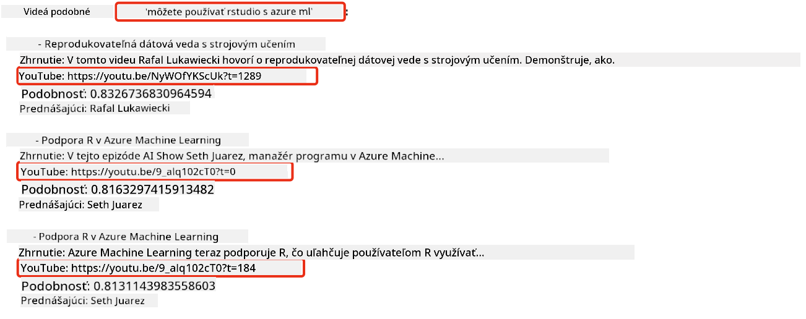
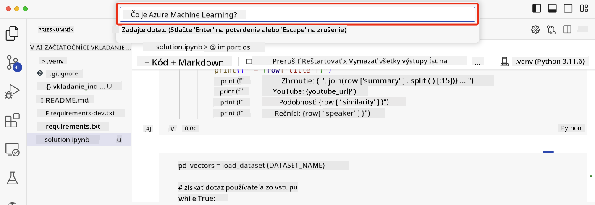

<!--
CO_OP_TRANSLATOR_METADATA:
{
  "original_hash": "d46aad0917a1a342d613e2c13d457da5",
  "translation_date": "2025-05-19T18:41:52+00:00",
  "source_file": "08-building-search-applications/README.md",
  "language_code": "sk"
}
-->
# Vytváranie vyhľadávacích aplikácií

[](https://aka.ms/gen-ai-lesson8-gh?WT.mc_id=academic-105485-koreyst)

> > _Kliknite na obrázok vyššie a pozrite si video k tejto lekcii_

Veľké jazykové modely (LLM) ponúkajú viac než len chatboty a generovanie textu. Je možné vytvárať vyhľadávacie aplikácie pomocou vektorových reprezentácií známych ako Embeddings. Tieto číselné reprezentácie dát sa dajú použiť na sémantické vyhľadávanie.

V tejto lekcii si vytvoríte vyhľadávaciu aplikáciu pre náš vzdelávací startup. Náš startup je nezisková organizácia, ktorá poskytuje bezplatné vzdelanie študentom v rozvojových krajinách. Máme veľké množstvo YouTube videí, ktoré študenti môžu použiť na učenie sa o AI. Chceme vytvoriť vyhľadávaciu aplikáciu, ktorá umožní študentom vyhľadať YouTube video zadaním otázky.

Napríklad, študent môže zadať 'Čo sú Jupyter Notebooks?' alebo 'Čo je Azure ML' a vyhľadávacia aplikácia vráti zoznam YouTube videí, ktoré sú relevantné k otázke, a ešte lepšie, aplikácia vráti odkaz na miesto vo videu, kde sa nachádza odpoveď na otázku.

## Úvod

V tejto lekcii sa budeme venovať:

- Sémantickému vs. Kľúčovému vyhľadávaniu.
- Čo sú Textové Embeddings.
- Vytváranie Indexu Textových Embeddings.
- Vyhľadávanie v Indexe Textových Embeddings.

## Ciele učenia

Po dokončení tejto lekcie budete schopní:

- Rozlíšiť medzi sémantickým a kľúčovým vyhľadávaním.
- Vysvetliť, čo sú Textové Embeddings.
- Vytvoriť aplikáciu využívajúcu Embeddings na vyhľadávanie dát.

## Prečo vytvárať vyhľadávaciu aplikáciu?

Vytváranie vyhľadávacej aplikácie vám pomôže pochopiť, ako používať Embeddings na vyhľadávanie dát. Naučíte sa tiež, ako vytvoriť vyhľadávaciu aplikáciu, ktorú môžu študenti použiť na rýchle vyhľadanie informácií.

Lekcia obsahuje Embedding Index prepisov YouTube videí z kanála Microsoft [AI Show](https://www.youtube.com/playlist?list=PLlrxD0HtieHi0mwteKBOfEeOYf0LJU4O1). AI Show je YouTube kanál, ktorý vás učí o AI a strojovom učení. Embedding Index obsahuje Embeddings pre každý z prepisov YouTube videí až do októbra 2023. Použijete Embedding Index na vytvorenie vyhľadávacej aplikácie pre náš startup. Vyhľadávacia aplikácia vráti odkaz na miesto vo videu, kde sa nachádza odpoveď na otázku. Toto je skvelý spôsob, ako študenti môžu rýchlo nájsť potrebné informácie.

Nasleduje príklad sémantického dopytu pre otázku 'môžete použiť rstudio s azure ml?'. Pozrite si YouTube URL, uvidíte, že URL obsahuje časovú značku, ktorá vás zavedie na miesto vo videu, kde sa nachádza odpoveď na otázku.



## Čo je sémantické vyhľadávanie?

Možno sa teraz pýtate, čo je sémantické vyhľadávanie? Sémantické vyhľadávanie je technika vyhľadávania, ktorá používa sémantiku, alebo význam slov v dopyte, na vrátenie relevantných výsledkov.

Tu je príklad sémantického vyhľadávania. Povedzme, že chcete kúpiť auto, mohli by ste hľadať 'moje vysnívané auto', sémantické vyhľadávanie chápe, že nehľadáte `dreaming` auto, ale skôr chcete kúpiť svoje `ideal` auto. Sémantické vyhľadávanie chápe váš zámer a vráti relevantné výsledky. Alternatívou je `keyword search`, ktoré by doslovne hľadalo sny o autách a často by vrátilo irelevantné výsledky.

## Čo sú Textové Embeddings?

[Textové embeddings](https://en.wikipedia.org/wiki/Word_embedding?WT.mc_id=academic-105485-koreyst) sú technika reprezentácie textu používaná v [spracovaní prirodzeného jazyka](https://en.wikipedia.org/wiki/Natural_language_processing?WT.mc_id=academic-105485-koreyst). Textové embeddings sú sémantické číselné reprezentácie textu. Embeddings sa používajú na reprezentáciu dát spôsobom, ktorý je pre stroj ľahko pochopiteľný. Existuje mnoho modelov na vytváranie textových embeddings, v tejto lekcii sa zameriame na generovanie embeddings pomocou OpenAI Embedding Modelu.

Tu je príklad, predstavte si nasledujúci text v prepise z jednej z epizód na YouTube kanáli AI Show:

```text
Today we are going to learn about Azure Machine Learning.
```

Text by sme poslali do OpenAI Embedding API a vrátilo by sa nasledujúce embedding pozostávajúce z 1536 čísel, teda vektor. Každé číslo vo vektore predstavuje iný aspekt textu. Pre stručnosť, tu sú prvé 10 čísla vo vektore.

```python
[-0.006655829958617687, 0.0026128944009542465, 0.008792596869170666, -0.02446001023054123, -0.008540431968867779, 0.022071078419685364, -0.010703742504119873, 0.003311325330287218, -0.011632772162556648, -0.02187200076878071, ...]
```

## Ako sa vytvára Embedding index?

Embedding index pre túto lekciu bol vytvorený pomocou série Python skriptov. Nájdete ich spolu s inštrukciami v [README](./scripts/README.md?WT.mc_id=academic-105485-koreyst) v priečinku 'scripts' pre túto lekciu. Tieto skripty nemusíte spúšťať, aby ste dokončili túto lekciu, pretože Embedding Index je pre vás pripravený.

Skripty vykonávajú nasledujúce operácie:

1. Stiahne sa prepis pre každé YouTube video v zozname [AI Show](https://www.youtube.com/playlist?list=PLlrxD0HtieHi0mwteKBOfEeOYf0LJU4O1).
2. Pomocou [OpenAI funkcií](https://learn.microsoft.com/azure/ai-services/openai/how-to/function-calling?WT.mc_id=academic-105485-koreyst) sa pokúša extrahovať meno rečníka z prvých 3 minút prepisu YouTube. Meno rečníka pre každé video je uložené v Embedding Indexe s názvom `embedding_index_3m.json`.
3. Text prepisu je potom rozdelený na **3-minútové textové segmenty**. Segment obsahuje asi 20 slov prekrývajúcich sa s nasledujúcim segmentom, aby sa zabezpečilo, že Embedding pre segment nie je prerušený a aby sa poskytol lepší kontext pre vyhľadávanie.
4. Každý textový segment je potom odoslaný do OpenAI Chat API na zhrnutie textu do 60 slov. Zhrnutie je tiež uložené v Embedding Indexe `embedding_index_3m.json`.
5. Nakoniec je text segmentu odoslaný do OpenAI Embedding API. Embedding API vráti vektor 1536 čísel, ktoré predstavujú sémantický význam segmentu. Segment spolu s OpenAI Embedding vektorom je uložený v Embedding Indexe `embedding_index_3m.json`.

### Vektorové databázy

Pre jednoduchosť lekcie je Embedding Index uložený v JSON súbore s názvom `embedding_index_3m.json` a načítaný do Pandas DataFrame. V produkcii by však Embedding Index bol uložený vo vektorovej databáze, ako je [Azure Cognitive Search](https://learn.microsoft.com/training/modules/improve-search-results-vector-search?WT.mc_id=academic-105485-koreyst), [Redis](https://cookbook.openai.com/examples/vector_databases/redis/readme?WT.mc_id=academic-105485-koreyst), [Pinecone](https://cookbook.openai.com/examples/vector_databases/pinecone/readme?WT.mc_id=academic-105485-koreyst), [Weaviate](https://cookbook.openai.com/examples/vector_databases/weaviate/readme?WT.mc_id=academic-105485-koreyst), a ďalšie.

## Pochopenie kosínovej podobnosti

Naučili sme sa o textových embeddings, ďalším krokom je naučiť sa, ako používať textové embeddings na vyhľadávanie dát a konkrétne nájsť najpodobnejšie embeddings k danému dopytu pomocou kosínovej podobnosti.

### Čo je kosínová podobnosť?

Kosínová podobnosť je mierou podobnosti medzi dvoma vektormi, často sa o nej hovorí ako o `nearest neighbor search`. Na vykonanie vyhľadávania pomocou kosínovej podobnosti je potrebné _vektorizovať_ text _dopytu_ pomocou OpenAI Embedding API. Potom vypočítať _kosínovú podobnosť_ medzi vektorom dopytu a každým vektorom v Embedding Indexe. Pamätajte, že Embedding Index má vektor pre každý textový segment prepisu YouTube. Nakoniec výsledky zoradíme podľa kosínovej podobnosti a textové segmenty s najvyššou kosínovou podobnosťou sú najpodobnejšie k dopytu.

Z matematického hľadiska kosínová podobnosť meria kosínus uhla medzi dvoma vektormi premietnutými v viacrozmernom priestore. Toto meranie je užitočné, pretože ak sú dva dokumenty vzdialené podľa euklidovskej vzdialenosti kvôli veľkosti, môžu mať stále menší uhol medzi nimi a teda vyššiu kosínovú podobnosť. Pre viac informácií o rovniciach kosínovej podobnosti si pozrite [Kosínová podobnosť](https://en.wikipedia.org/wiki/Cosine_similarity?WT.mc_id=academic-105485-koreyst).

## Vytváranie vašej prvej vyhľadávacej aplikácie

Ďalej sa naučíme, ako vytvoriť vyhľadávaciu aplikáciu pomocou Embeddings. Vyhľadávacia aplikácia umožní študentom vyhľadávať video zadaním otázky. Vyhľadávacia aplikácia vráti zoznam videí, ktoré sú relevantné k otázke. Vyhľadávacia aplikácia tiež vráti odkaz na miesto vo videu, kde sa nachádza odpoveď na otázku.

Toto riešenie bolo vytvorené a testované na Windows 11, macOS a Ubuntu 22.04 pomocou Pythonu 3.10 alebo novšieho. Môžete si stiahnuť Python z [python.org](https://www.python.org/downloads/?WT.mc_id=academic-105485-koreyst).

## Zadanie - vytváranie vyhľadávacej aplikácie, umožnenie študentom

Na začiatku tejto lekcie sme predstavili náš startup. Teraz je čas umožniť študentom vytvoriť vyhľadávaciu aplikáciu pre ich úlohy.

V tomto zadaní vytvoríte Azure OpenAI služby, ktoré sa budú používať na vytváranie vyhľadávacej aplikácie. Vytvoríte nasledujúce Azure OpenAI služby. Na dokončenie tohto zadania budete potrebovať Azure predplatné.

### Spustite Azure Cloud Shell

1. Prihláste sa do [Azure portálu](https://portal.azure.com/?WT.mc_id=academic-105485-koreyst).
2. Vyberte ikonu Cloud Shell v pravom hornom rohu Azure portálu.
3. Vyberte **Bash** pre typ prostredia.

#### Vytvorte skupinu zdrojov

> Pre tieto inštrukcie používame skupinu zdrojov s názvom "semantic-video-search" vo východnej časti USA.
> Môžete zmeniť názov skupiny zdrojov, ale pri zmene umiestnenia zdrojov,
> skontrolujte [tabuľku dostupnosti modelov](https://aka.ms/oai/models?WT.mc_id=academic-105485-koreyst).

```shell
az group create --name semantic-video-search --location eastus
```

#### Vytvorte zdroj Azure OpenAI Service

Z Azure Cloud Shell spustite nasledujúci príkaz na vytvorenie zdroja Azure OpenAI Service.

```shell
az cognitiveservices account create --name semantic-video-openai --resource-group semantic-video-search \
    --location eastus --kind OpenAI --sku s0
```

#### Získajte koncový bod a kľúče pre použitie v tejto aplikácii

Z Azure Cloud Shell spustite nasledujúce príkazy na získanie koncového bodu a kľúčov pre zdroj Azure OpenAI Service.

```shell
az cognitiveservices account show --name semantic-video-openai \
   --resource-group  semantic-video-search | jq -r .properties.endpoint
az cognitiveservices account keys list --name semantic-video-openai \
   --resource-group semantic-video-search | jq -r .key1
```

#### Nasadiť OpenAI Embedding model

Z Azure Cloud Shell spustite nasledujúci príkaz na nasadenie OpenAI Embedding modelu.

```shell
az cognitiveservices account deployment create \
    --name semantic-video-openai \
    --resource-group  semantic-video-search \
    --deployment-name text-embedding-ada-002 \
    --model-name text-embedding-ada-002 \
    --model-version "2"  \
    --model-format OpenAI \
    --sku-capacity 100 --sku-name "Standard"
```

## Riešenie

Otvorte [riešenie v Jupyter Notebooku](../../../08-building-search-applications/python/aoai-solution.ipynb) v GitHub Codespaces a postupujte podľa inštrukcií v Jupyter Notebooku.

Keď spustíte notebook, budete vyzvaní na zadanie dopytu. Vstupné pole bude vyzerať takto:



## Skvelá práca! Pokračujte vo svojom učení

Po dokončení tejto lekcie si pozrite našu [kolekciu učenia Generatívnej AI](https://aka.ms/genai-collection?WT.mc_id=academic-105485-koreyst) a pokračujte vo zvyšovaní svojich vedomostí o Generatívnej AI!

Prejdite na Lekciu 9, kde sa pozrieme na to, ako [vytvárať aplikácie na generovanie obrázkov](../09-building-image-applications/README.md?WT.mc_id=academic-105485-koreyst)!

**Upozornenie**:  
Tento dokument bol preložený pomocou AI prekladateľskej služby [Co-op Translator](https://github.com/Azure/co-op-translator). Aj keď sa snažíme o presnosť, upozorňujeme, že automatizované preklady môžu obsahovať chyby alebo nepresnosti. Pôvodný dokument v jeho rodnom jazyku by mal byť považovaný za autoritatívny zdroj. Pre kritické informácie sa odporúča profesionálny ľudský preklad. Nezodpovedáme za žiadne nedorozumenia alebo nesprávne interpretácie vyplývajúce z použitia tohto prekladu.