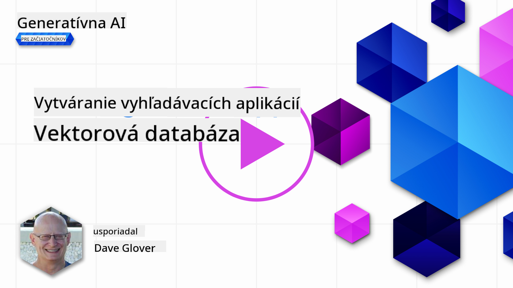
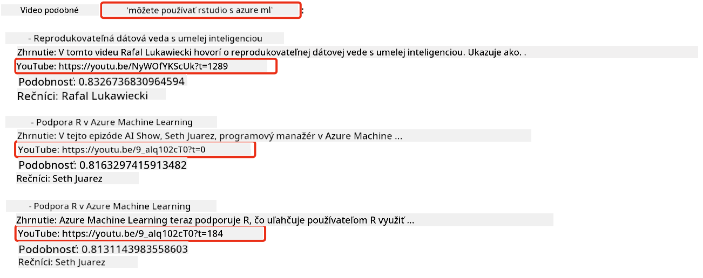
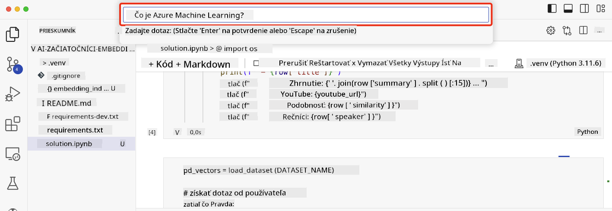

<!--
CO_OP_TRANSLATOR_METADATA:
{
  "original_hash": "d46aad0917a1a342d613e2c13d457da5",
  "translation_date": "2025-06-25T16:41:44+00:00",
  "source_file": "08-building-search-applications/README.md",
  "language_code": "sk"
}
-->
# Vytváranie vyhľadávacích aplikácií

[](https://aka.ms/gen-ai-lesson8-gh?WT.mc_id=academic-105485-koreyst)

> > _Kliknite na obrázok vyššie, aby ste si pozreli video tejto lekcie_

LLM sú viac než len chatboty a generovanie textu. Je tiež možné vytvárať vyhľadávacie aplikácie pomocou Embeddings. Embeddings sú číselné reprezentácie údajov, známe aj ako vektory, a môžu sa použiť na sémantické vyhľadávanie údajov.

V tejto lekcii vytvoríte vyhľadávaciu aplikáciu pre náš vzdelávací startup. Náš startup je nezisková organizácia, ktorá poskytuje bezplatné vzdelanie študentom v rozvojových krajinách. Máme veľké množstvo videí na YouTube, ktoré môžu študenti použiť na učenie sa o AI. Chceme vytvoriť vyhľadávaciu aplikáciu, ktorá umožní študentom vyhľadávať videá na YouTube zadaním otázky.

Napríklad, študent môže zadať 'Čo sú Jupyter Notebooks?' alebo 'Čo je Azure ML' a vyhľadávacia aplikácia vráti zoznam videí na YouTube, ktoré sú relevantné k otázke, a ešte lepšie, vyhľadávacia aplikácia vráti odkaz na miesto vo videu, kde sa nachádza odpoveď na otázku.

## Úvod

V tejto lekcii pokryjeme:

- Sémantické vs. kľúčové vyhľadávanie.
- Čo sú Text Embeddings.
- Vytváranie indexu Text Embeddings.
- Vyhľadávanie v indexe Text Embeddings.

## Ciele učenia

Po dokončení tejto lekcie budete schopní:

- Rozpoznať rozdiel medzi sémantickým a kľúčovým vyhľadávaním.
- Vysvetliť, čo sú Text Embeddings.
- Vytvoriť aplikáciu používajúcu Embeddings na vyhľadávanie údajov.

## Prečo vytvárať vyhľadávaciu aplikáciu?

Vytvorenie vyhľadávacej aplikácie vám pomôže pochopiť, ako používať Embeddings na vyhľadávanie údajov. Tiež sa naučíte, ako vytvoriť vyhľadávaciu aplikáciu, ktorú môžu študenti použiť na rýchle nájdenie informácií.

Lekcia obsahuje Embedding Index pre prepisy YouTube kanála Microsoft [AI Show](https://www.youtube.com/playlist?list=PLlrxD0HtieHi0mwteKBOfEeOYf0LJU4O1). AI Show je YouTube kanál, ktorý vás učí o AI a strojovom učení. Embedding Index obsahuje Embeddings pre každý z prepisov YouTube až do októbra 2023. Použijete Embedding Index na vytvorenie vyhľadávacej aplikácie pre náš startup. Vyhľadávacia aplikácia vráti odkaz na miesto vo videu, kde sa nachádza odpoveď na otázku. Toto je skvelý spôsob, ako študenti môžu rýchlo nájsť potrebné informácie.

Nasleduje príklad sémantického dotazu pre otázku 'môžete používať rstudio s azure ml?'. Pozrite si URL na YouTube, uvidíte, že URL obsahuje časovú pečiatku, ktorá vás zavedie na miesto vo videu, kde sa nachádza odpoveď na otázku.



## Čo je sémantické vyhľadávanie?

Možno sa teraz pýtate, čo je sémantické vyhľadávanie? Sémantické vyhľadávanie je technika vyhľadávania, ktorá používa sémantiku alebo význam slov v dotaze na vrátenie relevantných výsledkov.

Tu je príklad sémantického vyhľadávania. Povedzme, že chcete kúpiť auto, môžete hľadať 'moje vysnívané auto', sémantické vyhľadávanie rozumie, že nehovoríte o aute, ale skôr hľadáte svoje vysnívané auto. Sémantické vyhľadávanie rozumie vášmu úmyslu a vráti relevantné výsledky. Alternatívou je doslovné vyhľadávanie snov o autách, ktoré často vracia irelevantné výsledky.

## Čo sú Text Embeddings?

[Textové embeddings](https://en.wikipedia.org/wiki/Word_embedding?WT.mc_id=academic-105485-koreyst) sú technikou reprezentácie textu používanou v [spracovaní prirodzeného jazyka](https://en.wikipedia.org/wiki/Natural_language_processing?WT.mc_id=academic-105485-koreyst). Textové embeddings sú sémantické číselné reprezentácie textu. Embeddings sa používajú na reprezentáciu údajov spôsobom, ktorý je ľahko pochopiteľný pre stroj. Existuje mnoho modelov na vytváranie textových embeddings, v tejto lekcii sa zameriame na generovanie embeddings pomocou OpenAI Embedding Model.

Tu je príklad, predstavte si nasledujúci text v prepisu jednej z epizód na YouTube kanáli AI Show:

```text
Today we are going to learn about Azure Machine Learning.
```

Text by sme poslali do OpenAI Embedding API a to by vrátilo nasledujúce embedding pozostávajúce z 1536 čísel, známych ako vektor. Každé číslo vo vektore predstavuje iný aspekt textu. Pre stručnosť, tu sú prvé 10 čísel vo vektore.

```python
[-0.006655829958617687, 0.0026128944009542465, 0.008792596869170666, -0.02446001023054123, -0.008540431968867779, 0.022071078419685364, -0.010703742504119873, 0.003311325330287218, -0.011632772162556648, -0.02187200076878071, ...]
```

## Ako je vytvorený Embedding index?

Embedding index pre túto lekciu bol vytvorený sériou Python skriptov. Skripty spolu s inštrukciami nájdete v [README](./scripts/README.md?WT.mc_id=academic-105485-koreyst) v priečinku 'scripts' pre túto lekciu. Nemusíte spúšťať tieto skripty na dokončenie tejto lekcie, pretože Embedding Index je poskytnutý.

Skripty vykonávajú nasledujúce operácie:

1. Prepis pre každé video na YouTube v zozname skladieb [AI Show](https://www.youtube.com/playlist?list=PLlrxD0HtieHi0mwteKBOfEeOYf0LJU4O1) je stiahnutý.
2. Pomocou [OpenAI Functions](https://learn.microsoft.com/azure/ai-services/openai/how-to/function-calling?WT.mc_id=academic-105485-koreyst) sa pokúša extrahovať meno rečníka z prvých 3 minút prepisu YouTube. Meno rečníka pre každé video je uložené v Embedding Index s názvom `embedding_index_3m.json`.
3. Prepis textu je potom rozdelený na **3 minútové textové segmenty**. Segment obsahuje približne 20 slov prekrývajúcich sa z nasledujúceho segmentu, aby sa zabezpečilo, že Embedding pre segment nie je prerušený a poskytuje lepší kontext vyhľadávania.
4. Každý textový segment je potom odoslaný do OpenAI Chat API, aby sa text zhrnul do 60 slov. Zhrnutie je tiež uložené v Embedding Index `embedding_index_3m.json`.
5. Nakoniec je text segmentu odoslaný do OpenAI Embedding API. Embedding API vráti vektor 1536 čísel, ktoré reprezentujú sémantický význam segmentu. Segment spolu s OpenAI Embedding vektorom je uložený v Embedding Index `embedding_index_3m.json`.

### Vektorové databázy

Pre zjednodušenie lekcie je Embedding Index uložený v JSON súbore s názvom `embedding_index_3m.json` a načítaný do Pandas DataFrame. V produkcii by však bol Embedding Index uložený vo vektorovej databáze, ako je [Azure Cognitive Search](https://learn.microsoft.com/training/modules/improve-search-results-vector-search?WT.mc_id=academic-105485-koreyst), [Redis](https://cookbook.openai.com/examples/vector_databases/redis/readme?WT.mc_id=academic-105485-koreyst), [Pinecone](https://cookbook.openai.com/examples/vector_databases/pinecone/readme?WT.mc_id=academic-105485-koreyst), [Weaviate](https://cookbook.openai.com/examples/vector_databases/weaviate/readme?WT.mc_id=academic-105485-koreyst), aby sme spomenuli len niekoľko.

## Pochopenie kosínovej podobnosti

Naučili sme sa o textových embeddings, ďalším krokom je naučiť sa, ako používať textové embeddings na vyhľadávanie údajov a konkrétne nájsť najpodobnejšie embeddings k danému dotazu pomocou kosínovej podobnosti.

### Čo je kosínová podobnosť?

Kosínová podobnosť je mierou podobnosti medzi dvoma vektormi, často sa označuje ako `nearest neighbor search`. Na vykonanie vyhľadávania pomocou kosínovej podobnosti je potrebné _vektorizovať_ text _dotazu_ pomocou OpenAI Embedding API. Potom vypočítať _kosínovú podobnosť_ medzi vektorom dotazu a každým vektorom v Embedding Index. Pamätajte, Embedding Index má vektor pre každý textový segment prepisu YouTube. Nakoniec zoradiť výsledky podľa kosínovej podobnosti a textové segmenty s najvyššou kosínovou podobnosťou sú najpodobnejšie dotazu.

Z matematického hľadiska kosínová podobnosť meria kosínus uhla medzi dvoma vektormi premietanými v viacrozmernom priestore. Toto meranie je užitočné, pretože ak sú dva dokumenty ďaleko od seba podľa Euklidovej vzdialenosti kvôli veľkosti, stále môžu mať menší uhol medzi nimi a teda vyššiu kosínovú podobnosť. Pre viac informácií o rovnicach kosínovej podobnosti si pozrite [Kosínová podobnosť](https://en.wikipedia.org/wiki/Cosine_similarity?WT.mc_id=academic-105485-koreyst).

## Vytvorenie vašej prvej vyhľadávacej aplikácie

Ďalej sa naučíme, ako vytvoriť vyhľadávaciu aplikáciu pomocou Embeddings. Vyhľadávacia aplikácia umožní študentom vyhľadávať video zadaním otázky. Vyhľadávacia aplikácia vráti zoznam videí, ktoré sú relevantné k otázke. Vyhľadávacia aplikácia tiež vráti odkaz na miesto vo videu, kde sa nachádza odpoveď na otázku.

Toto riešenie bolo vytvorené a testované na Windows 11, macOS a Ubuntu 22.04 pomocou Python 3.10 alebo novšieho. Python si môžete stiahnuť z [python.org](https://www.python.org/downloads/?WT.mc_id=academic-105485-koreyst).

## Zadanie - vytvorenie vyhľadávacej aplikácie, aby sme umožnili študentom

Náš startup sme predstavili na začiatku tejto lekcie. Teraz je čas umožniť študentom vytvoriť vyhľadávaciu aplikáciu pre ich hodnotenia.

V tomto zadaní vytvoríte Azure OpenAI Services, ktoré budú použité na vytvorenie vyhľadávacej aplikácie. Vytvoríte nasledujúce Azure OpenAI Services. Na dokončenie tohto zadania budete potrebovať predplatné Azure.

### Spustenie Azure Cloud Shell

1. Prihláste sa do [Azure portálu](https://portal.azure.com/?WT.mc_id=academic-105485-koreyst).
2. Vyberte ikonu Cloud Shell v pravom hornom rohu Azure portálu.
3. Vyberte **Bash** pre typ prostredia.

#### Vytvorenie skupiny zdrojov

> Pre tieto pokyny používame skupinu zdrojov s názvom "semantic-video-search" vo východných USA.
> Môžete zmeniť názov skupiny zdrojov, ale pri zmene umiestnenia zdrojov
> skontrolujte [tabuľku dostupnosti modelov](https://aka.ms/oai/models?WT.mc_id=academic-105485-koreyst).

```shell
az group create --name semantic-video-search --location eastus
```

#### Vytvorenie zdroja Azure OpenAI Service

Z Azure Cloud Shell spustite nasledujúci príkaz na vytvorenie zdroja Azure OpenAI Service.

```shell
az cognitiveservices account create --name semantic-video-openai --resource-group semantic-video-search \
    --location eastus --kind OpenAI --sku s0
```

#### Získanie koncového bodu a kľúčov pre použitie v tejto aplikácii

Z Azure Cloud Shell spustite nasledujúce príkazy na získanie koncového bodu a kľúčov pre zdroj Azure OpenAI Service.

```shell
az cognitiveservices account show --name semantic-video-openai \
   --resource-group  semantic-video-search | jq -r .properties.endpoint
az cognitiveservices account keys list --name semantic-video-openai \
   --resource-group semantic-video-search | jq -r .key1
```

#### Nasadenie OpenAI Embedding modelu

Z Azure Cloud Shell spustite nasledujúci príkaz na nasadenie OpenAI Embedding modelu.

```shell
az cognitiveservices account deployment create \
    --name semantic-video-openai \
    --resource-group  semantic-video-search \
    --deployment-name text-embedding-ada-002 \
    --model-name text-embedding-ada-002 \
    --model-version "2"  \
    --model-format OpenAI \
    --sku-capacity 100 --sku-name "Standard"
```

## Riešenie

Otvorte [riešenie notebooku](../../../08-building-search-applications/python/aoai-solution.ipynb) v GitHub Codespaces a postupujte podľa pokynov v Jupyter Notebooku.

Keď spustíte notebook, budete vyzvaní zadať dotaz. Vstupné pole bude vyzerať takto:



## Skvelá práca! Pokračujte vo svojom učení

Po dokončení tejto lekcie si pozrite našu [kolekciu učenia o generatívnej AI](https://aka.ms/genai-collection?WT.mc_id=academic-105485-koreyst), aby ste naďalej zvyšovali svoje znalosti o generatívnej AI!

Prejdite na Lekciu 9, kde sa pozrieme na to, ako [vytvárať aplikácie na generovanie obrázkov](../09-building-image-applications/README.md?WT.mc_id=academic-105485-koreyst)!

**Upozornenie**:  
Tento dokument bol preložený pomocou AI prekladateľskej služby [Co-op Translator](https://github.com/Azure/co-op-translator). Hoci sa snažíme o presnosť, prosím, berte na vedomie, že automatizované preklady môžu obsahovať chyby alebo nepresnosti. Pôvodný dokument v jeho rodnom jazyku by mal byť považovaný za autoritatívny zdroj. Pre kritické informácie sa odporúča profesionálny ľudský preklad. Nie sme zodpovední za akékoľvek nedorozumenia alebo nesprávne interpretácie vzniknuté z používania tohto prekladu.