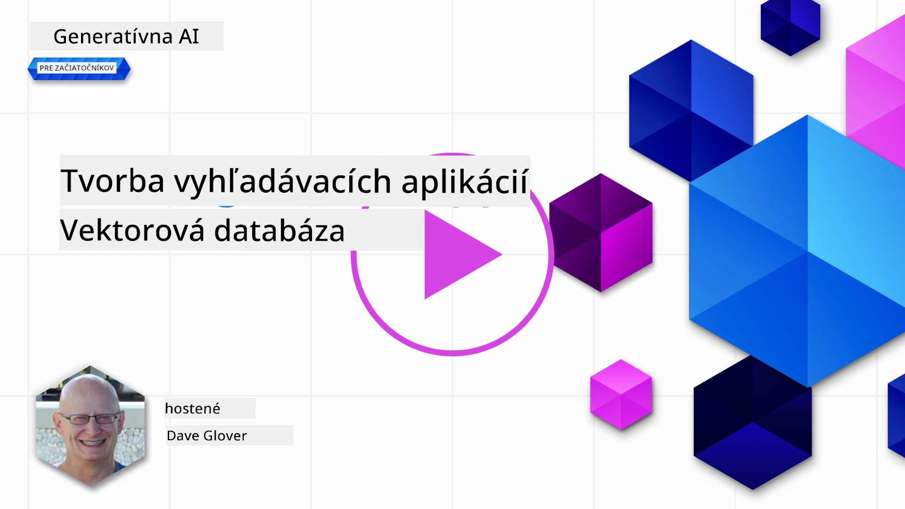
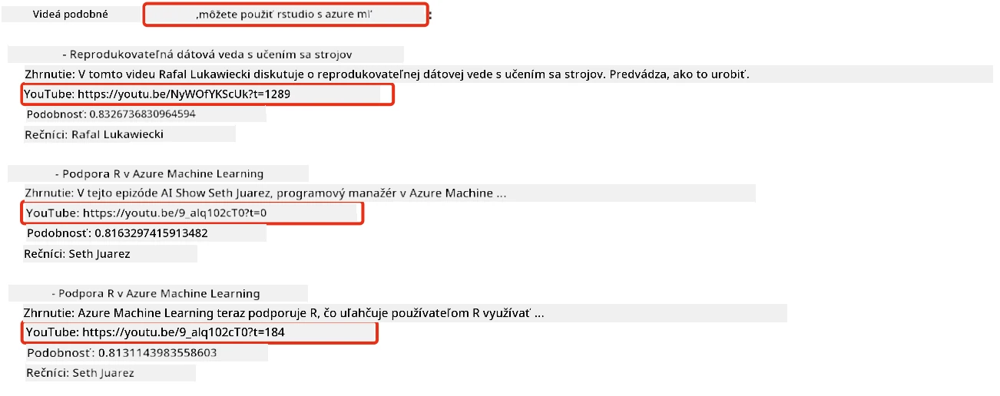
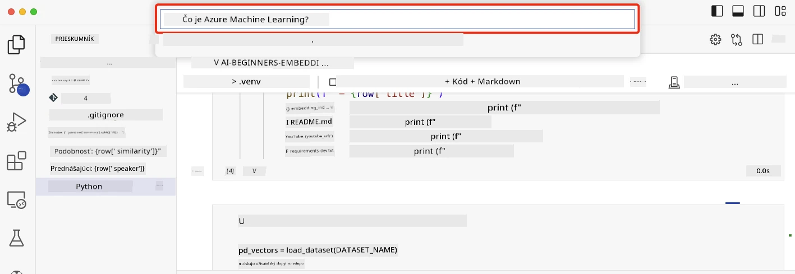

# Budovanie vyhľadávacích aplikácií

[](https://youtu.be/W0-nzXjOjr0?si=GcsqiTTvd7RKbo7V)

> > _Kliknite na obrázok vyššie pre zobrazenie videa tejto lekcie_

LLM (veľké jazykové modely) nie sú iba o chatbotov a generovaní textu. Pomocou embeddingov je možné vytvárať aj vyhľadávacie aplikácie. Embeddingy sú číselné reprezentácie dát, známe aj ako vektory, ktoré možno použiť na sémantické vyhľadávanie dát.

V tejto lekcii si vytvoríte vyhľadávaciu aplikáciu pre náš startup v oblasti vzdelávania. Náš startup je nezisková organizácia poskytujúca bezplatné vzdelávanie študentom v rozvojových krajinách. Máme množstvo videí na YouTube, ktoré študenti môžu použiť na učenie sa o AI. Náš startup chce vytvoriť vyhľadávaciu aplikáciu, ktorá umožní študentom hľadať YouTube video zadaním otázky.

Napríklad študent môže napísať 'Čo sú Jupyter Notebooks?' alebo 'Čo je Azure ML' a vyhľadávacia aplikácia vráti zoznam videí na YouTube, ktoré sú relevantné k otázke, a ešte lepšie, aplikácia vráti odkaz na čas vo videu, kde sa nachádza odpoveď na otázku.

## Úvod

V tejto lekcii sa naučíme:

- Rozdiel medzi sémantickým a kľúčovým vyhľadávaním.
- Čo sú textové embeddingy.
- Vytvorenie indexu textových embeddingov.
- Vyhľadávanie v indexe textových embeddingov.

## Ciele učenia

Po dokončení tejto lekcie budete schopní:

- Rozlíšiť sémantické a kľúčové vyhľadávanie.
- Vysvetliť, čo sú textové embeddingy.
- Vytvoriť aplikáciu používajúcu embeddingy na vyhľadávanie dát.

## Prečo vytvárať vyhľadávaciu aplikáciu?

Vytvorenie vyhľadávacej aplikácie vám pomôže pochopiť, ako používať embeddingy na vyhľadávanie dát. Tiež sa naučíte, ako vytvoriť vyhľadávaciu aplikáciu, ktorú študenti môžu použiť na rýchle nájdenie informácií.

Lekcia obsahuje embeddingový index YouTube prepisov zo série Microsoft [AI Show](https://www.youtube.com/playlist?list=PLlrxD0HtieHi0mwteKBOfEeOYf0LJU4O1). AI Show je YouTube kanál, ktorý vás učí o AI a strojovom učení. Embeddingový index obsahuje embeddingy pre každý prepis YouTube videí až do októbra 2023. Použijete tento embeddingový index na vytvorenie vyhľadávacej aplikácie pre náš startup. Vyhľadávacia aplikácia vráti odkaz na čas vo videu, kde sa nachádza odpoveď na otázku. Je to skvelý spôsob, ako študenti môžu rýchlo nájsť potrebné informácie.

Nasleduje príklad sémantickej otázky 'môžete použiť rstudio s azure ml?'. Pozrite si URL YouTube, uvidíte, že URL obsahuje časový údaj ktorý vás presunie na čas vo videu, kde sa nachádza odpoveď na otázku.



## Čo je sémantické vyhľadávanie?

Možno sa pýtate, čo je sémantické vyhľadávanie? Sémantické vyhľadávanie je technika vyhľadávania, ktorá používa sémantiku, teda význam slov v dotaze, aby vrátila relevantné výsledky.

Tu je príklad sémantického vyhľadávania. Ak hľadáte kúpu auta, môžete zadať dotaz 'moje vysnívané auto'. Sémantické vyhľadávanie rozumie tomu, že nespíte o aute, ale hľadáte vaše ideálne auto. Sémantické vyhľadávanie chápe váš zámer a vracia relevantné výsledky. Alternatívou je `kľúčové vyhľadávanie`, ktoré by doslovne hľadalo slovo 'sny' o autách a často by vracalo nerelevantné výsledky.

## Čo sú textové embeddingy?

[Textové embeddingy](https://en.wikipedia.org/wiki/Word_embedding?WT.mc_id=academic-105485-koreyst) sú technika reprezentácie textu používaná v [spracovaní prirodzeného jazyka](https://en.wikipedia.org/wiki/Natural_language_processing?WT.mc_id=academic-105485-koreyst). Textové embeddingy sú sémantické číselné reprezentácie textu. Embeddingy sa používajú na reprezentáciu dát spôsobom, ktorý je pre stroj ľahko pochopiteľný. Existuje mnoho modelov na tvorbu textových embeddingov, v tejto lekcii sa zameriame na generovanie embeddingov pomocou OpenAI Embedding Modelu.

Tu je príklad, predstavte si, že nasledujúci text je z prepisu jedného z dielov na AI Show YouTube kanáli:

```text
Today we are going to learn about Azure Machine Learning.
```

Text by sme poslali do OpenAI Embedding API, ktoré by vrátilo nasledujúci embedding pozostávajúci zo 1536 čísel, tzv. vektor. Každé číslo vo vektore predstavuje rôzny aspekt textu. Pre stručnosť tu sú prvých 10 čísel vo vektore.

```python
[-0.006655829958617687, 0.0026128944009542465, 0.008792596869170666, -0.02446001023054123, -0.008540431968867779, 0.022071078419685364, -0.010703742504119873, 0.003311325330287218, -0.011632772162556648, -0.02187200076878071, ...]
```

## Ako sa vytvára embeddingový index?

Embeddingový index pre túto lekciu bol vytvorený sériou Python skriptov. Skripty spolu s inštrukciami nájdete v [README](./scripts/README.md?WT.mc_id=academic-105485-koreyst) v priečinku `scripts` tejto lekcie. Nemusíte tieto skripty spúšťať, aby ste túto lekciu dokončili, pretože embeddingový index je poskytnutý.

Skripty vykonávajú nasledujúce operácie:

1. Stiahnuť prepis pre každé YouTube video z playlistu [AI Show](https://www.youtube.com/playlist?list=PLlrxD0HtieHi0mwteKBOfEeOYf0LJU4O1).
2. Pomocou [OpenAI funkcií](https://learn.microsoft.com/azure/ai-foundry/openai/how-to/function-calling?WT.mc_id=academic-105485-koreyst) sa pokúsi extrahovať meno rečníka z prvých 3 minút YouTube prepisu. Meno rečníka každého videa sa uloží do embeddingového indexu `embedding_index_3m.json`.
3. Prepis textu sa následne rozdelí do **textových segmentov po 3 minúty**. Segment obsahuje približne 20 slov z ďalšieho segmentu, aby embedding segmentu nebol prerušený a aby poskytoval lepší kontext vyhľadávania.
4. Každý textový segment sa potom posiela do OpenAI Chat API, ktoré zhrnie text do 60 slov. Tento súhrn sa tiež uloží do embeddingového indexu `embedding_index_3m.json`.
5. Nakoniec sa text segmentu pošle do OpenAI Embedding API. Embedding API vráti vektor so 1536 číslami, ktoré reprezentujú sémantický význam segmentu. Segment spolu s OpenAI embeddingovým vektorom sa uloží do embeddingového indexu `embedding_index_3m.json`.

### Vektorové databázy

Pre jednoduchosť lekcie je embeddingový index uložený v JSON súbore `embedding_index_3m.json` a načítaný do Pandas DataFrame. Avšak v produkcii by embeddingový index bol uložený vo vektorovej databáze, ako sú [Azure Cognitive Search](https://learn.microsoft.com/training/modules/improve-search-results-vector-search?WT.mc_id=academic-105485-koreyst), [Redis](https://cookbook.openai.com/examples/vector_databases/redis/readme?WT.mc_id=academic-105485-koreyst), [Pinecone](https://cookbook.openai.com/examples/vector_databases/pinecone/readme?WT.mc_id=academic-105485-koreyst), [Weaviate](https://cookbook.openai.com/examples/vector_databases/weaviate/readme?WT.mc_id=academic-105485-koreyst) a ďalšie.

## Pochopenie kosínovej podobnosti

Naučili sme sa o textových embeddingoch, ďalším krokom je naučiť sa, ako použiť textové embeddingy na vyhľadávanie dát a konkrétne nájsť najpodobnejšie embeddingy k zadanému dotazu pomocou kosínovej podobnosti.

### Čo je kosínová podobnosť?

Kosínová podobnosť je mierou podobnosti medzi dvoma vektormi, často označovaná aj ako `vyhľadávanie najbližších susedov`. Na vykonanie vyhľadávania pomocou kosínovej podobnosti musíte najprv _vektorovať_ _dotazový_ text pomocou OpenAI Embedding API. Potom vypočítať _kosínovú podobnosť_ medzi vektorom dotazu a každým vektorom v embeddingovom indexe. Pamätajte, že embeddingový index obsahuje vektor pre každý segment textu z YouTube prepisov. Nakoniec výsledky zoradíte podľa kosínovej podobnosti a textové segmenty s najvyššou hodnotou sú najpodobnejšie dotazu.

Z matematického hľadiska kosínová podobnosť meria kosínus uhla medzi dvoma vektormi premietnutými v mnohorozmernom priestore. Toto meranie je prínosné, pretože aj keď sú dva dokumenty vzdialené podľa Euklidovskej vzdialenosti kvôli veľkosti, môžu mať menší uhol medzi sebou a teda vyššiu kosínovú podobnosť. Pre viac informácií o rovnicach kosínovej podobnosti pozrite [Kosínová podobnosť](https://en.wikipedia.org/wiki/Cosine_similarity?WT.mc_id=academic-105485-koreyst).

## Vytvorenie vašej prvej vyhľadávacej aplikácie

Ďalej sa naučíme, ako vytvoriť vyhľadávaciu aplikáciu pomocou embeddingov. Vyhľadávacia aplikácia umožní študentom vyhľadať video zadaním otázky. Aplikácia vráti zoznam relevantných videí na danú otázku a taktiež odkaz na čas vo videu, kde je odpoveď na otázku.

Toto riešenie bolo vyvinuté a testované na Windows 11, macOS a Ubuntu 22.04 s použitím Python 3.10 alebo novšieho. Python môžete stiahnuť z [python.org](https://www.python.org/downloads/?WT.mc_id=academic-105485-koreyst).

## Zadanie - vytvorenie vyhľadávacej aplikácie pre študentov

Na začiatku lekcie sme predstavili náš startup. Teraz je čas umožniť študentom vytvoriť vyhľadávaciu aplikáciu pre ich hodnotenia.

V tomto zadaní vytvoríte Azure OpenAI služby, ktoré budú použité na vytvorenie vyhľadávacej aplikácie. Vytvoríte nasledujúce Azure OpenAI služby. Na dokončenie zadania budete potrebovať Azure predplatné.

### Spustite Azure Cloud Shell

1. Prihláste sa do [Azure portálu](https://portal.azure.com/?WT.mc_id=academic-105485-koreyst).
2. Vyberte ikonu Cloud Shell v pravom hornom rohu Azure portálu.
3. Vyberte **Bash** ako typ prostredia.

#### Vytvorenie skupiny prostriedkov

> Pre tieto pokyny používame skupinu prostriedkov nazvanú "semantic-video-search" v regióne East US.
> Môžete zmeniť názov skupiny prostriedkov, ale pri zmene lokality pre prostriedky,
> skontrolujte [tabuľku dostupnosti modelov](https://aka.ms/oai/models?WT.mc_id=academic-105485-koreyst).

```shell
az group create --name semantic-video-search --location eastus
```

#### Vytvorenie Azure OpenAI Service prostriedku

V Azure Cloud Shell spustite nasledujúci príkaz na vytvorenie Azure OpenAI Service prostriedku.

```shell
az cognitiveservices account create --name semantic-video-openai --resource-group semantic-video-search \
    --location eastus --kind OpenAI --sku s0
```

#### Získanie koncového bodu a kľúčov pre použitie v aplikácii

V Azure Cloud Shell spustite nasledujúce príkazy na získanie koncového bodu a kľúčov pre Azure OpenAI Service prostriedok.

```shell
az cognitiveservices account show --name semantic-video-openai \
   --resource-group  semantic-video-search | jq -r .properties.endpoint
az cognitiveservices account keys list --name semantic-video-openai \
   --resource-group semantic-video-search | jq -r .key1
```

#### Nasadenie OpenAI Embedding modelu

V Azure Cloud Shell spustite nasledujúci príkaz na nasadenie OpenAI Embedding modelu.

```shell
az cognitiveservices account deployment create \
    --name semantic-video-openai \
    --resource-group  semantic-video-search \
    --deployment-name text-embedding-ada-002 \
    --model-name text-embedding-ada-002 \
    --model-version "2"  \
    --model-format OpenAI \
    --sku-capacity 100 --sku-name "Standard"
```

## Riešenie

Otvorte [riešiteľský notebook](./python/aoai-solution.ipynb?WT.mc_id=academic-105485-koreyst) v GitHub Codespaces a riaďte sa inštrukciami v Jupyter Notebooku.

Po spustení notebooku budete vyzvaní na zadanie dotazu. Vstupné pole bude vyzerať takto:



## Výborná práca! Pokračujte vo vzdelávaní

Po dokončení tejto lekcie si pozrite našu [kolekciu vzdelávania o generatívnej AI](https://aka.ms/genai-collection?WT.mc_id=academic-105485-koreyst), aby ste pokračovali vo zvyšovaní svojich znalostí o generatívnej AI!

Prejdite na Lekciu 9, kde si ukážeme, ako [vytvárať aplikácie na generovanie obrázkov](../09-building-image-applications/README.md?WT.mc_id=academic-105485-koreyst)!

---

<!-- CO-OP TRANSLATOR DISCLAIMER START -->
**Vyhlásenie o zodpovednosti**:
Tento dokument bol preložený pomocou AI prekladateľskej služby [Co-op Translator](https://github.com/Azure/co-op-translator). Hoci sa snažíme o presnosť, vezmite prosím na vedomie, že automatické preklady môžu obsahovať chyby alebo nepresnosti. Pôvodný dokument v jeho natívnom jazyku by mal byť považovaný za autoritatívny zdroj. Pre kritické informácie sa odporúča profesionálny ľudský preklad. Nie sme zodpovední za žiadne nedorozumenia alebo nesprávne interpretácie vyplývajúce z použitia tohto prekladu.
<!-- CO-OP TRANSLATOR DISCLAIMER END -->