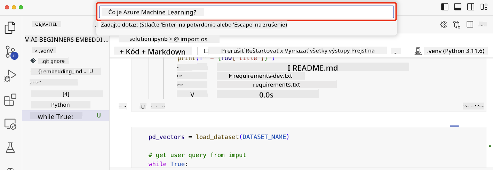

<!--
CO_OP_TRANSLATOR_METADATA:
{
  "original_hash": "58953c08b8ba7073b836d4270ea0fe86",
  "translation_date": "2025-10-17T21:53:49+00:00",
  "source_file": "08-building-search-applications/README.md",
  "language_code": "sk"
}
-->
# Vytváranie aplikácií na vyhľadávanie

[](https://youtu.be/W0-nzXjOjr0?si=GcsqiTTvd7RKbo7V)

> > _Kliknite na obrázok vyššie, aby ste si pozreli video k tejto lekcii_

LLM (veľké jazykové modely) nie sú len o chatbotoch a generovaní textu. Je možné vytvárať aj aplikácie na vyhľadávanie pomocou vektorových reprezentácií (Embeddings). Embeddings sú číselné reprezentácie dát, známe aj ako vektory, a môžu byť použité na sémantické vyhľadávanie dát.

V tejto lekcii budete vytvárať aplikáciu na vyhľadávanie pre náš vzdelávací startup. Náš startup je nezisková organizácia, ktorá poskytuje bezplatné vzdelávanie študentom v rozvojových krajinách. Máme veľké množstvo YouTube videí, ktoré študenti môžu použiť na učenie sa o AI. Náš startup chce vytvoriť aplikáciu na vyhľadávanie, ktorá umožní študentom vyhľadávať YouTube video zadaním otázky.

Napríklad, študent môže zadať otázku ako 'Čo sú Jupyter Notebooks?' alebo 'Čo je Azure ML?' a aplikácia na vyhľadávanie vráti zoznam YouTube videí, ktoré sú relevantné k otázke. Ešte lepšie, aplikácia na vyhľadávanie vráti odkaz na miesto vo videu, kde sa nachádza odpoveď na otázku.

## Úvod

V tejto lekcii sa budeme venovať:

- Rozdielu medzi sémantickým a kľúčovým vyhľadávaním.
- Čo sú textové embeddings.
- Vytváraniu indexu textových embeddings.
- Vyhľadávaniu v indexe textových embeddings.

## Ciele učenia

Po dokončení tejto lekcie budete schopní:

- Rozlíšiť sémantické vyhľadávanie od kľúčového vyhľadávania.
- Vysvetliť, čo sú textové embeddings.
- Vytvoriť aplikáciu na vyhľadávanie dát pomocou embeddings.

## Prečo vytvárať aplikáciu na vyhľadávanie?

Vytvorenie aplikácie na vyhľadávanie vám pomôže pochopiť, ako používať embeddings na vyhľadávanie dát. Naučíte sa tiež, ako vytvoriť aplikáciu na vyhľadávanie, ktorú môžu študenti použiť na rýchle nájdenie informácií.

Lekcia obsahuje index embeddings pre prepisy YouTube videí z kanála Microsoft [AI Show](https://www.youtube.com/playlist?list=PLlrxD0HtieHi0mwteKBOfEeOYf0LJU4O1). AI Show je YouTube kanál, ktorý vás učí o AI a strojovom učení. Index embeddings obsahuje embeddings pre každý prepis YouTube videí až do októbra 2023. Použijete tento index embeddings na vytvorenie aplikácie na vyhľadávanie pre náš startup. Aplikácia na vyhľadávanie vráti odkaz na miesto vo videu, kde sa nachádza odpoveď na otázku. Toto je skvelý spôsob, ako študenti môžu rýchlo nájsť potrebné informácie.

Nasleduje príklad sémantického dotazu na otázku 'môžete použiť rstudio s azure ml?'. Pozrite si URL YouTube, uvidíte, že URL obsahuje časovú značku, ktorá vás zavedie na miesto vo videu, kde sa nachádza odpoveď na otázku.


## Čo je sémantické vyhľadávanie?

Možno sa pýtate, čo je sémantické vyhľadávanie? Sémantické vyhľadávanie je technika vyhľadávania, ktorá používa význam slov v dotaze na vrátenie relevantných výsledkov.

Tu je príklad sémantického vyhľadávania. Povedzme, že chcete kúpiť auto, môžete vyhľadávať 'moje vysnívané auto'. Sémantické vyhľadávanie chápe, že nehľadáte `sny` o aute, ale skôr hľadáte svoje `ideálne` auto. Sémantické vyhľadávanie chápe váš zámer a vráti relevantné výsledky. Alternatívou je `kľúčové vyhľadávanie`, ktoré by doslovne hľadalo sny o autách a často vrátilo nerelevantné výsledky.

## Čo sú textové embeddings?

[Textové embeddings](https://en.wikipedia.org/wiki/Word_embedding?WT.mc_id=academic-105485-koreyst) sú technika reprezentácie textu používaná v [spracovaní prirodzeného jazyka](https://en.wikipedia.org/wiki/Natural_language_processing?WT.mc_id=academic-105485-koreyst). Textové embeddings sú sémantické číselné reprezentácie textu. Embeddings sa používajú na reprezentáciu dát spôsobom, ktorý je pre stroj ľahko pochopiteľný. Existuje mnoho modelov na vytváranie textových embeddings, v tejto lekcii sa zameriame na generovanie embeddings pomocou modelu OpenAI Embedding.

Tu je príklad, predstavte si nasledujúci text v prepise jednej z epizód na YouTube kanáli AI Show:

```text
Today we are going to learn about Azure Machine Learning.
```

Text by sme odoslali do OpenAI Embedding API a vrátil by sa nasledujúci embedding pozostávajúci z 1536 čísel, známych ako vektor. Každé číslo vo vektore predstavuje iný aspekt textu. Pre stručnosť uvádzame prvých 10 čísel vo vektore.

```python
[-0.006655829958617687, 0.0026128944009542465, 0.008792596869170666, -0.02446001023054123, -0.008540431968867779, 0.022071078419685364, -0.010703742504119873, 0.003311325330287218, -0.011632772162556648, -0.02187200076878071, ...]
```

## Ako sa vytvára index embeddings?

Index embeddings pre túto lekciu bol vytvorený pomocou série Python skriptov. Skripty spolu s pokynmi nájdete v [README](./scripts/README.md?WT.mc_id=academic-105485-koreyst) v priečinku 'scripts' pre túto lekciu. Na dokončenie tejto lekcie nemusíte spúšťať tieto skripty, pretože index embeddings je pre vás pripravený.

Skripty vykonávajú nasledujúce operácie:

1. Prepis každého YouTube videa v zozname [AI Show](https://www.youtube.com/playlist?list=PLlrxD0HtieHi0mwteKBOfEeOYf0LJU4O1) sa stiahne.
2. Pomocou [OpenAI Functions](https://learn.microsoft.com/azure/ai-services/openai/how-to/function-calling?WT.mc_id=academic-105485-koreyst) sa pokúsi extrahovať meno rečníka z prvých 3 minút prepisu YouTube. Meno rečníka pre každé video sa uloží do indexu embeddings s názvom `embedding_index_3m.json`.
3. Text prepisu sa potom rozdelí na **3-minútové textové segmenty**. Segment obsahuje približne 20 slov, ktoré sa prekrývajú s nasledujúcim segmentom, aby sa zabezpečilo, že embedding segmentu nebude prerušený a aby poskytoval lepší kontext vyhľadávania.
4. Každý textový segment sa potom odošle do OpenAI Chat API, aby sa text zhrnul do 60 slov. Zhrnutie sa tiež uloží do indexu embeddings `embedding_index_3m.json`.
5. Nakoniec sa text segmentu odošle do OpenAI Embedding API. Embedding API vráti vektor 1536 čísel, ktoré reprezentujú sémantický význam segmentu. Segment spolu s OpenAI embedding vektorom sa uloží do indexu embeddings `embedding_index_3m.json`.

### Vektorové databázy

Pre zjednodušenie lekcie je index embeddings uložený v JSON súbore s názvom `embedding_index_3m.json` a načítaný do Pandas DataFrame. Avšak v produkcii by bol index embeddings uložený vo vektorovej databáze, ako napríklad [Azure Cognitive Search](https://learn.microsoft.com/training/modules/improve-search-results-vector-search?WT.mc_id=academic-105485-koreyst), [Redis](https://cookbook.openai.com/examples/vector_databases/redis/readme?WT.mc_id=academic-105485-koreyst), [Pinecone](https://cookbook.openai.com/examples/vector_databases/pinecone/readme?WT.mc_id=academic-105485-koreyst), [Weaviate](https://cookbook.openai.com/examples/vector_databases/weaviate/readme?WT.mc_id=academic-105485-koreyst), a ďalšie.

## Pochopenie kosínovej podobnosti

Už sme sa naučili o textových embeddings, ďalším krokom je naučiť sa, ako používať textové embeddings na vyhľadávanie dát, a konkrétne, ako nájsť najpodobnejšie embeddings k danému dotazu pomocou kosínovej podobnosti.

### Čo je kosínová podobnosť?

Kosínová podobnosť je mierou podobnosti medzi dvoma vektormi, často sa označuje ako `vyhľadávanie najbližšieho suseda`. Na vykonanie vyhľadávania pomocou kosínovej podobnosti je potrebné _vektorizovať_ text dotazu pomocou OpenAI Embedding API. Potom vypočítať _kosínovú podobnosť_ medzi vektorom dotazu a každým vektorom v indexe embeddings. Pamätajte, že index embeddings má vektor pre každý textový segment prepisu YouTube. Nakoniec zoradiť výsledky podľa kosínovej podobnosti a textové segmenty s najvyššou kosínovou podobnosťou sú najpodobnejšie dotazu.

Z matematického hľadiska kosínová podobnosť meria kosínus uhla medzi dvoma vektormi premietnutými v multidimenzionálnom priestore. Toto meranie je užitočné, pretože ak sú dva dokumenty vzdialené podľa euklidovskej vzdialenosti kvôli veľkosti, môžu mať stále menší uhol medzi nimi a teda vyššiu kosínovú podobnosť. Pre viac informácií o rovniciach kosínovej podobnosti si pozrite [Kosínová podobnosť](https://en.wikipedia.org/wiki/Cosine_similarity?WT.mc_id=academic-105485-koreyst).

## Vytvorenie vašej prvej aplikácie na vyhľadávanie

Ďalej sa naučíme, ako vytvoriť aplikáciu na vyhľadávanie pomocou embeddings. Aplikácia na vyhľadávanie umožní študentom vyhľadávať video zadaním otázky. Aplikácia na vyhľadávanie vráti zoznam videí, ktoré sú relevantné k otázke. Aplikácia na vyhľadávanie tiež vráti odkaz na miesto vo videu, kde sa nachádza odpoveď na otázku.

Toto riešenie bolo vytvorené a testované na Windows 11, macOS a Ubuntu 22.04 pomocou Pythonu 3.10 alebo novšieho. Python si môžete stiahnuť z [python.org](https://www.python.org/downloads/?WT.mc_id=academic-105485-koreyst).

## Úloha - vytvorenie aplikácie na vyhľadávanie pre študentov

Na začiatku tejto lekcie sme predstavili náš startup. Teraz je čas umožniť študentom vytvoriť aplikáciu na vyhľadávanie pre ich úlohy.

V tejto úlohe vytvoríte služby Azure OpenAI, ktoré budú použité na vytvorenie aplikácie na vyhľadávanie. Vytvoríte nasledujúce služby Azure OpenAI. Na dokončenie tejto úlohy budete potrebovať predplatné Azure.

### Spustenie Azure Cloud Shell

1. Prihláste sa do [Azure portálu](https://portal.azure.com/?WT.mc_id=academic-105485-koreyst).
2. Vyberte ikonu Cloud Shell v pravom hornom rohu Azure portálu.
3. Vyberte **Bash** ako typ prostredia.

#### Vytvorenie skupiny zdrojov

> Pre tieto pokyny používame skupinu zdrojov s názvom "semantic-video-search" vo východných USA.
> Môžete zmeniť názov skupiny zdrojov, ale pri zmene umiestnenia zdrojov si overte [tabuľku dostupnosti modelov](https://aka.ms/oai/models?WT.mc_id=academic-105485-koreyst).

```shell
az group create --name semantic-video-search --location eastus
```

#### Vytvorenie zdroja služby Azure OpenAI

Z Azure Cloud Shell spustite nasledujúci príkaz na vytvorenie zdroja služby Azure OpenAI.

```shell
az cognitiveservices account create --name semantic-video-openai --resource-group semantic-video-search \
    --location eastus --kind OpenAI --sku s0
```

#### Získanie koncového bodu a kľúčov na použitie v tejto aplikácii

Z Azure Cloud Shell spustite nasledujúce príkazy na získanie koncového bodu a kľúčov pre zdroj služby Azure OpenAI.

```shell
az cognitiveservices account show --name semantic-video-openai \
   --resource-group  semantic-video-search | jq -r .properties.endpoint
az cognitiveservices account keys list --name semantic-video-openai \
   --resource-group semantic-video-search | jq -r .key1
```

#### Nasadenie modelu OpenAI Embedding

Z Azure Cloud Shell spustite nasledujúci príkaz na nasadenie modelu OpenAI Embedding.

```shell
az cognitiveservices account deployment create \
    --name semantic-video-openai \
    --resource-group  semantic-video-search \
    --deployment-name text-embedding-ada-002 \
    --model-name text-embedding-ada-002 \
    --model-version "2"  \
    --model-format OpenAI \
    --sku-capacity 100 --sku-name "Standard"
```

## Riešenie

Otvorte [notebook s riešením](./python/aoai-solution.ipynb?WT.mc_id=academic-105485-koreyst) v GitHub Codespaces a postupujte podľa pokynov v Jupyter Notebooku.

Keď spustíte notebook, budete vyzvaní na zadanie dotazu. Vstupné pole bude vyzerať takto:



## Skvelá práca! Pokračujte vo svojom vzdelávaní

Po dokončení tejto lekcie si pozrite našu [zbierku vzdelávania o generatívnej AI](https://aka.ms/genai-collection?WT.mc_id=academic-105485-koreyst), aby ste si rozšírili svoje vedomosti o generatívnej AI!

Prejdite na lekciu 9, kde sa pozrieme na to, ako [vytvárať aplikácie na generovanie obrázkov](../09-building-image-applications/README.md?WT.mc_id=academic-105485-koreyst)!

---

**Zrieknutie sa zodpovednosti**:  
Tento dokument bol preložený pomocou služby AI prekladu [Co-op Translator](https://github.com/Azure/co-op-translator). Aj keď sa snažíme o presnosť, prosím, berte na vedomie, že automatizované preklady môžu obsahovať chyby alebo nepresnosti. Pôvodný dokument v jeho pôvodnom jazyku by mal byť považovaný za autoritatívny zdroj. Pre kritické informácie sa odporúča profesionálny ľudský preklad. Nenesieme zodpovednosť za akékoľvek nedorozumenia alebo nesprávne interpretácie vyplývajúce z použitia tohto prekladu.