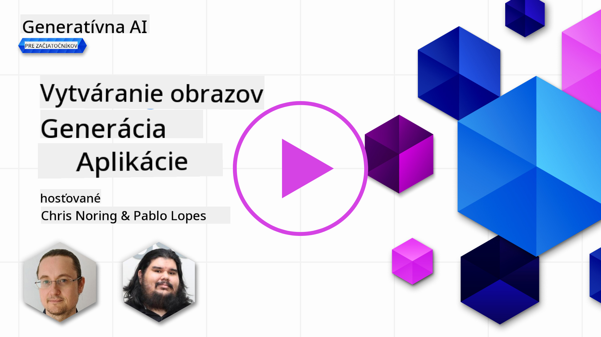

<!--
CO_OP_TRANSLATOR_METADATA:
{
  "original_hash": "1a7fd0f95f9eb673b79da47c0814f4d4",
  "translation_date": "2025-07-09T13:32:52+00:00",
  "source_file": "09-building-image-applications/README.md",
  "language_code": "sk"
}
-->
# Tvorba aplikácií na generovanie obrázkov

[](https://aka.ms/gen-ai-lesson9-gh?WT.mc_id=academic-105485-koreyst)

LLM nie sú len o generovaní textu. Je tiež možné generovať obrázky na základe textových popisov. Použitie obrázkov ako modality môže byť veľmi užitočné v mnohých oblastiach, od MedTech, architektúry, turizmu, vývoja hier a ďalších. V tejto kapitole sa pozrieme na dva najpopulárnejšie modely na generovanie obrázkov, DALL-E a Midjourney.

## Úvod

V tejto lekcii sa budeme venovať:

- Generovaniu obrázkov a prečo je užitočné.
- DALL-E a Midjourney, čo sú zač a ako fungujú.
- Ako vytvoriť aplikáciu na generovanie obrázkov.

## Ciele učenia

Po dokončení tejto lekcie budete schopní:

- Vytvoriť aplikáciu na generovanie obrázkov.
- Definovať hranice pre vašu aplikáciu pomocou metapromptov.
- Pracovať s DALL-E a Midjourney.

## Prečo vytvárať aplikáciu na generovanie obrázkov?

Aplikácie na generovanie obrázkov sú skvelým spôsobom, ako preskúmať možnosti Generatívnej AI. Môžu sa použiť napríklad na:

- **Úpravu a syntézu obrázkov**. Môžete generovať obrázky pre rôzne použitia, ako je úprava obrázkov alebo ich syntéza.

- **Použitie v rôznych odvetviach**. Môžu sa tiež využiť na generovanie obrázkov pre rôzne odvetvia ako MedTech, turizmus, vývoj hier a ďalšie.

## Scenár: Edu4All

V rámci tejto lekcie budeme pokračovať v práci s naším startupom Edu4All. Študenti budú vytvárať obrázky pre svoje hodnotenia, aké obrázky to budú, záleží na nich – môžu to byť ilustrácie k vlastnej rozprávke, vytvoriť novú postavu pre svoj príbeh alebo im pomôcť vizualizovať ich nápady a koncepty.

Tu je príklad, čo by študenti Edu4All mohli vytvoriť, ak pracujú v triede na pamiatkach:


pomocou promptu

> "Pes vedľa Eiffelovej veže v rannom slnečnom svetle"

## Čo je DALL-E a Midjourney?

[DALL-E](https://openai.com/dall-e-2?WT.mc_id=academic-105485-koreyst) a [Midjourney](https://www.midjourney.com/?WT.mc_id=academic-105485-koreyst) sú dva z najpopulárnejších modelov na generovanie obrázkov, ktoré umožňujú používať prompt na generovanie obrázkov.

### DALL-E

Začnime s DALL-E, čo je model Generatívnej AI, ktorý generuje obrázky z textových popisov.

> [DALL-E je kombináciou dvoch modelov, CLIP a diffused attention](https://towardsdatascience.com/openais-dall-e-and-clip-101-a-brief-introduction-3a4367280d4e?WT.mc_id=academic-105485-koreyst).

- **CLIP** je model, ktorý vytvára embeddingy, teda číselné reprezentácie dát, z obrázkov a textu.

- **Diffused attention** je model, ktorý generuje obrázky z embeddingov. DALL-E je trénovaný na dátovej sade obrázkov a textov a môže sa použiť na generovanie obrázkov z textových popisov. Napríklad DALL-E môže vytvoriť obrázok mačky v klobúku alebo psa s mohavkom.

### Midjourney

Midjourney funguje podobne ako DALL-E, generuje obrázky z textových promptov. Midjourney tiež umožňuje generovať obrázky na základe promptov ako „mačka v klobúku“ alebo „pes s mohavkom“.


_Obrázok z Wikipédie, vygenerovaný Midjourney_

## Ako fungujú DALL-E a Midjourney

Najprv [DALL-E](https://arxiv.org/pdf/2102.12092.pdf?WT.mc_id=academic-105485-koreyst). DALL-E je model Generatívnej AI založený na architektúre transformeru s _autoregresívnym transformerom_.

_Autoregresívny transformer_ definuje, ako model generuje obrázky z textových popisov – generuje jeden pixel po druhom a potom používa už vygenerované pixely na generovanie ďalšieho. Prechádza viacerými vrstvami v neurónovej sieti, až kým nie je obrázok kompletný.

Týmto procesom DALL-E ovláda atribúty, objekty, charakteristiky a ďalšie prvky v generovanom obrázku. DALL-E 2 a 3 však poskytujú ešte väčšiu kontrolu nad generovaným obrázkom.

## Vytvorenie vašej prvej aplikácie na generovanie obrázkov

Čo je potrebné na vytvorenie aplikácie na generovanie obrázkov? Budete potrebovať tieto knižnice:

- **python-dotenv**, odporúča sa použiť túto knižnicu na uchovávanie tajomstiev v súbore _.env_ mimo kódu.
- **openai**, táto knižnica slúži na komunikáciu s OpenAI API.
- **pillow**, na prácu s obrázkami v Pythone.
- **requests**, na vykonávanie HTTP požiadaviek.

1. Vytvorte súbor _.env_ s nasledujúcim obsahom:

   ```text
   AZURE_OPENAI_ENDPOINT=<your endpoint>
   AZURE_OPENAI_API_KEY=<your key>
   ```

   Túto informáciu nájdete v Azure Portáli pre váš zdroj v sekcii „Keys and Endpoint“.

1. Zozbierajte vyššie uvedené knižnice do súboru _requirements.txt_ takto:

   ```text
   python-dotenv
   openai
   pillow
   requests
   ```

1. Ďalej vytvorte virtuálne prostredie a nainštalujte knižnice:

   ```bash
   python3 -m venv venv
   source venv/bin/activate
   pip install -r requirements.txt
   ```

   Pre Windows použite tieto príkazy na vytvorenie a aktiváciu virtuálneho prostredia:

   ```bash
   python3 -m venv venv
   venv\Scripts\activate.bat
   ```

1. Pridajte nasledujúci kód do súboru _app.py_:

   ```python
   import openai
   import os
   import requests
   from PIL import Image
   import dotenv

   # import dotenv
   dotenv.load_dotenv()

   # Get endpoint and key from environment variables
   openai.api_base = os.environ['AZURE_OPENAI_ENDPOINT']
   openai.api_key = os.environ['AZURE_OPENAI_API_KEY']

   # Assign the API version (DALL-E is currently supported for the 2023-06-01-preview API version only)
   openai.api_version = '2023-06-01-preview'
   openai.api_type = 'azure'


   try:
       # Create an image by using the image generation API
       generation_response = openai.Image.create(
           prompt='Bunny on horse, holding a lollipop, on a foggy meadow where it grows daffodils',    # Enter your prompt text here
           size='1024x1024',
           n=2,
           temperature=0,
       )
       # Set the directory for the stored image
       image_dir = os.path.join(os.curdir, 'images')

       # If the directory doesn't exist, create it
       if not os.path.isdir(image_dir):
           os.mkdir(image_dir)

       # Initialize the image path (note the filetype should be png)
       image_path = os.path.join(image_dir, 'generated-image.png')

       # Retrieve the generated image
       image_url = generation_response["data"][0]["url"]  # extract image URL from response
       generated_image = requests.get(image_url).content  # download the image
       with open(image_path, "wb") as image_file:
           image_file.write(generated_image)

       # Display the image in the default image viewer
       image = Image.open(image_path)
       image.show()

   # catch exceptions
   except openai.InvalidRequestError as err:
       print(err)

   ```

Vysvetlime si tento kód:

- Najprv importujeme potrebné knižnice, vrátane OpenAI, dotenv, requests a Pillow.

  ```python
  import openai
  import os
  import requests
  from PIL import Image
  import dotenv
  ```

- Potom načítame premenné prostredia zo súboru _.env_.

  ```python
  # import dotenv
  dotenv.load_dotenv()
  ```

- Následne nastavíme endpoint, kľúč pre OpenAI API, verziu a typ.

  ```python
  # Get endpoint and key from environment variables
  openai.api_base = os.environ['AZURE_OPENAI_ENDPOINT']
  openai.api_key = os.environ['AZURE_OPENAI_API_KEY']

  # add version and type, Azure specific
  openai.api_version = '2023-06-01-preview'
  openai.api_type = 'azure'
  ```

- Ďalej generujeme obrázok:

  ```python
  # Create an image by using the image generation API
  generation_response = openai.Image.create(
      prompt='Bunny on horse, holding a lollipop, on a foggy meadow where it grows daffodils',    # Enter your prompt text here
      size='1024x1024',
      n=2,
      temperature=0,
  )
  ```

  Tento kód vráti JSON objekt obsahujúci URL vygenerovaného obrázka. Túto URL môžeme použiť na stiahnutie obrázka a uloženie do súboru.

- Nakoniec otvoríme obrázok a zobrazíme ho pomocou štandardného prehliadača obrázkov:

  ```python
  image = Image.open(image_path)
  image.show()
  ```

### Podrobnejšie o generovaní obrázka

Pozrime sa podrobnejšie na kód, ktorý generuje obrázok:

```python
generation_response = openai.Image.create(
        prompt='Bunny on horse, holding a lollipop, on a foggy meadow where it grows daffodils',    # Enter your prompt text here
        size='1024x1024',
        n=2,
        temperature=0,
    )
```

- **prompt** je textový prompt použitý na generovanie obrázka. V tomto prípade používame prompt „Zajko na koni, drží lízatko, na hmlistej lúke, kde rastú narcisy“.
- **size** je veľkosť generovaného obrázka. Tu generujeme obrázok s rozmermi 1024x1024 pixelov.
- **n** je počet generovaných obrázkov. V tomto prípade generujeme dva obrázky.
- **temperature** je parameter, ktorý ovláda náhodnosť výstupu modelu Generatívnej AI. Hodnota je medzi 0 a 1, kde 0 znamená deterministický výstup a 1 náhodný výstup. Predvolená hodnota je 0.7.

Existuje ešte viac možností, čo s obrázkami robiť, o čom si povieme v ďalšej časti.

## Ďalšie možnosti generovania obrázkov

Doteraz ste videli, ako sme pomocou pár riadkov v Pythone vygenerovali obrázok. Existuje však viac možností, čo s obrázkami robiť.

Môžete tiež:

- **Upravovať obrázky**. Poskytnutím existujúceho obrázka, masky a promptu môžete obrázok zmeniť. Napríklad môžete pridať niečo do určitej časti obrázka. Predstavte si náš obrázok so zajkom, môžete mu pridať klobúk. Ako na to? Poskytnete obrázok, masku (ktorá určuje časť obrázka na zmenu) a textový prompt, ktorý popisuje, čo sa má urobiť.

  ```python
  response = openai.Image.create_edit(
    image=open("base_image.png", "rb"),
    mask=open("mask.png", "rb"),
    prompt="An image of a rabbit with a hat on its head.",
    n=1,
    size="1024x1024"
  )
  image_url = response['data'][0]['url']
  ```

  Základný obrázok by obsahoval len zajka, ale finálny obrázok by mal klobúk na zajkovi.

- **Vytvárať variácie**. Ide o to, že vezmete existujúci obrázok a požiadate o vytvorenie jeho variácií. Na vytvorenie variácie poskytnete obrázok a textový prompt a použijete kód takto:

  ```python
  response = openai.Image.create_variation(
    image=open("bunny-lollipop.png", "rb"),
    n=1,
    size="1024x1024"
  )
  image_url = response['data'][0]['url']
  ```

  > Poznámka: toto je podporované iba v OpenAI

## Temperature

Temperature je parameter, ktorý ovláda náhodnosť výstupu modelu Generatívnej AI. Hodnota je medzi 0 a 1, kde 0 znamená deterministický výstup a 1 náhodný výstup. Predvolená hodnota je 0.7.

Pozrime sa na príklad, ako temperature funguje, keď spustíme tento prompt dvakrát:

> Prompt: "Zajko na koni, drží lízatko, na hmlistej lúke, kde rastú narcisy"


Teraz spustíme ten istý prompt znova, aby sme videli, že nedostaneme rovnaký obrázok dvakrát:


Ako vidíte, obrázky sú podobné, ale nie rovnaké. Skúsme zmeniť hodnotu temperature na 0.1 a pozrime sa, čo sa stane:

```python
 generation_response = openai.Image.create(
        prompt='Bunny on horse, holding a lollipop, on a foggy meadow where it grows daffodils',    # Enter your prompt text here
        size='1024x1024',
        n=2
    )
```

### Zmena temperature

Skúsme teda urobiť odpoveď viac deterministickou. Z dvoch vygenerovaných obrázkov vidíme, že na prvom je zajko a na druhom kôň, takže obrázky sa výrazne líšia.

Zmeňme preto náš kód a nastavme temperature na 0, takto:

```python
generation_response = openai.Image.create(
        prompt='Bunny on horse, holding a lollipop, on a foggy meadow where it grows daffodils',    # Enter your prompt text here
        size='1024x1024',
        n=2,
        temperature=0
    )
```

Keď teraz spustíte tento kód, dostanete tieto dva obrázky:

- 
- 

Tu jasne vidíte, že obrázky sú si oveľa podobnejšie.

## Ako definovať hranice pre vašu aplikáciu pomocou metapromptov

S našou ukážkou už vieme generovať obrázky pre našich klientov. Potrebujeme však nastaviť hranice pre našu aplikáciu.

Napríklad nechceme generovať obrázky, ktoré nie sú vhodné do práce alebo pre deti.

To môžeme dosiahnuť pomocou _metapromptov_. Metaprompt sú textové prompt, ktoré slúžia na kontrolu výstupu modelu Generatívnej AI. Môžeme ich použiť na zabezpečenie, že generované obrázky sú vhodné do práce alebo pre deti.

### Ako to funguje?

Ako teda metaprompt fungujú?

Metaprompt sú textové prompt, ktoré sa používajú na kontrolu výstupu modelu Generatívnej AI, umiestňujú sa pred hlavný textový prompt a slúžia na riadenie výstupu modelu. Sú zabudované v aplikáciách na kontrolu výstupu modelu. Vstupný prompt a metaprompt sú tak zabalené do jedného textového promptu.

Príklad metapromptu by mohol vyzerať takto:

```text
You are an assistant designer that creates images for children.

The image needs to be safe for work and appropriate for children.

The image needs to be in color.

The image needs to be in landscape orientation.

The image needs to be in a 16:9 aspect ratio.

Do not consider any input from the following that is not safe for work or appropriate for children.

(Input)

```

Teraz si ukážeme, ako môžeme metaprompt použiť v našej ukážke.

```python
disallow_list = "swords, violence, blood, gore, nudity, sexual content, adult content, adult themes, adult language, adult humor, adult jokes, adult situations, adult"

meta_prompt =f"""You are an assistant designer that creates images for children.

The image needs to be safe for work and appropriate for children.

The image needs to be in color.

The image needs to be in landscape orientation.

The image needs to be in a 16:9 aspect ratio.

Do not consider any input from the following that is not safe for work or appropriate for children.
{disallow_list}
"""

prompt = f"{meta_prompt}
Create an image of a bunny on a horse, holding a lollipop"

# TODO add request to generate image
```

Z vyššie uvedeného promptu vidíte, že všetky generované obrázky zohľadňujú metaprompt.

## Zadanie – umožnime študentom tvoriť

Na začiatku lekcie sme predstavili Edu4All. Teraz je čas umožniť študentom generovať obrázky pre ich hodnotenia.

Študenti budú vytvárať obrázky pre svoje hodnotenia obsahujúce pamiatky, aké pamiatky to budú, záleží na nich. Študenti sú vyzvaní použiť svoju kreativitu a umiestniť tieto pamiatky do rôznych kontextov.

## Riešenie

Tu je jedno možné riešenie:

```python
import openai
import os
import requests
from PIL import Image
import dotenv

# import dotenv
dotenv.load_dotenv()

# Get endpoint and key from environment variables
openai.api_base = "<replace with endpoint>"
openai.api_key = "<replace with api key>"

# Assign the API version (DALL-E is currently supported for the 2023-06-01-preview API version only)
openai.api_version = '2023-06-01-preview'
openai.api_type = 'azure'

disallow_list = "swords, violence, blood, gore, nudity, sexual content, adult content, adult themes, adult language, adult humor, adult jokes, adult situations, adult"

meta_prompt = f"""You are an assistant designer that creates images for children.

The image needs to be safe for work and appropriate for children.

The image needs to be in color.

The image needs to be in landscape orientation.

The image needs to be in a 16:9 aspect ratio.

Do not consider any input from the following that is not safe for work or appropriate for children.
{disallow_list}"""

prompt = f"""{meta_prompt}
Generate monument of the Arc of Triumph in Paris, France, in the evening light with a small child holding a Teddy looks on.
""""

try:
    # Create an image by using the image generation API
    generation_response = openai.Image.create(
        prompt=prompt,    # Enter your prompt text here
        size='1024x1024',
        n=2,
        temperature=0,
    )
    # Set the directory for the stored image
    image_dir = os.path.join(os.curdir, 'images')

    # If the directory doesn't exist, create it
    if not os.path.isdir(image_dir):
        os.mkdir(image_dir)

    # Initialize the image path (note the filetype should be png)
    image_path = os.path.join(image_dir, 'generated-image.png')

    # Retrieve the generated image
    image_url = generation_response["data"][0]["url"]  # extract image URL from response
    generated_image = requests.get(image_url).content  # download the image
    with open(image_path, "wb") as image_file:
        image_file.write(generated_image)

    # Display the image in the default image viewer
    image = Image.open(image_path)
    image.show()

# catch exceptions
except openai.InvalidRequestError as err:
    print(err)
```

## Výborná práca! Pokračujte v učení

Po dokončení tejto lekcie si pozrite našu [kolekciu Generatívnej AI](https://aka.ms/genai-collection?WT.mc_id=academic-105485-koreyst), aby ste si ďalej rozširovali vedomosti o Generatívnej AI!

Prejdite na Lekciu 10, kde sa pozrieme na to, ako [vytvárať AI aplikácie s nízkym kódom](../10-building-low-code-ai-applications/README.md?WT.mc_id=academic-105485-koreyst)

**Vyhlásenie o zodpovednosti**:  
Tento dokument bol preložený pomocou AI prekladateľskej služby [Co-op Translator](https://github.com/Azure/co-op-translator). Hoci sa snažíme o presnosť, prosím, majte na pamäti, že automatizované preklady môžu obsahovať chyby alebo nepresnosti. Originálny dokument v jeho pôvodnom jazyku by mal byť považovaný za autoritatívny zdroj. Pre kritické informácie sa odporúča profesionálny ľudský preklad. Nie sme zodpovední za akékoľvek nedorozumenia alebo nesprávne interpretácie vyplývajúce z použitia tohto prekladu.