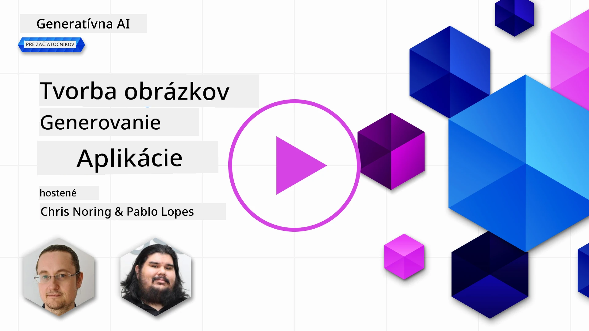

# Tvorba aplikácií na generovanie obrázkov

[](https://youtu.be/B5VP0_J7cs8?si=5P3L5o7F_uS_QcG9)

LLM modely nie sú len na generovanie textu. Je tiež možné generovať obrázky z textových popisov. Mať obrázky ako modalitu môže byť veľmi užitočné v mnohých oblastiach od MedTech, architektúry, turizmu, vývoja hier a ďalších. V tejto kapitole sa pozrieme na dva najpopulárnejšie modely generovania obrázkov, DALL-E a Midjourney.

## Úvod

V tejto lekcii pokryjeme:

- Generovanie obrázkov a prečo je užitočné.
- DALL-E a Midjourney, čo sú zač a ako fungujú.
- Ako by ste postavili aplikáciu na generovanie obrázkov.

## Ciele učenia sa

Po dokončení tejto lekcie budete schopní:

- Vybudovať aplikáciu na generovanie obrázkov.
- Definovať hranice vašej aplikácie pomocou metapromptov.
- Pracovať s DALL-E a Midjourney.

## Prečo stavať aplikáciu na generovanie obrázkov?

Aplikácie na generovanie obrázkov sú skvelý spôsob, ako preskúmať schopnosti Generatívnej AI. Môžu byť použité napríklad na:

- **Úpravu a syntézu obrázkov**. Môžete generovať obrázky pre rôzne účely, ako je úprava obrázkov a syntéza obrázkov.

- **Použitie v rôznych odvetviach**. Môžu sa tiež použiť na generovanie obrázkov pre rôzne odvetvia, ako je Medtech, Turizmus, Vývoj hier a ďalšie.

## Scenár: Edu4All

V rámci tejto lekcie budeme pokračovať v práci s naším startupom Edu4All. Študenti budú vytvárať obrázky pre svoje hodnotenia, aké obrázky to budú, záleží na študentoch, ale môžu to byť ilustrácie k ich vlastnej rozprávke, vytvoriť novú postavu pre svoj príbeh alebo im pomôcť vizualizovať ich nápady a koncepty.

Tu je príklad, čo by študenti Edu4All mohli vytvoriť, ak pracujú v triede na pamiatkach:


pomocou promptu ako

> "Pes vedľa Eiffelovej veže v rannom slnečnom svetle"

## Čo je DALL-E a Midjourney?

[DALL-E](https://openai.com/dall-e-2?WT.mc_id=academic-105485-koreyst) a [Midjourney](https://www.midjourney.com/?WT.mc_id=academic-105485-koreyst) sú dva z najpopulárnejších modelov generovania obrázkov, ktoré umožňujú použiť prompty na generovanie obrázkov.

### DALL-E

Začnime s DALL-E, ktorý je generatívny AI model generujúci obrázky z textových popisov.

> [DALL-E je kombináciou dvoch modelov, CLIP a rozptýlenej pozornosti](https://towardsdatascience.com/openais-dall-e-and-clip-101-a-brief-introduction-3a4367280d4e?WT.mc_id=academic-105485-koreyst).

- **CLIP** je model, ktorý generuje embeddingy, čo sú numerické reprezentácie dát, z obrázkov a textu.

- **Rozptýlená pozornosť** je model, ktorý generuje obrázky z embeddingov. DALL-E je trénovaný na datasete obrázkov a textov a môže byť použitý na generovanie obrázkov z textových popisov. Napríklad, DALL-E môže vytvoriť obrázky mačky v klobúku alebo psa s mohawkom.

### Midjourney

Midjourney funguje podobne ako DALL-E, generuje obrázky z textových promptov. Midjourney sa tiež používa na generovanie obrázkov pomocou promptov ako “mačka v klobúku” alebo “pes s mohawkom”.


_Zdroj obrázku Wikipedia, obrázok vytvorený Midjourney_

## Ako fungujú DALL-E a Midjourney

Najprv [DALL-E](https://arxiv.org/pdf/2102.12092.pdf?WT.mc_id=academic-105485-koreyst). DALL-E je generatívny AI model založený na architektúre transformer s _autoregresívnym transformerom_.

_Autoregresívny transformer_ definuje, ako model generuje obrázky z textových popisov, generuje jeden pixel za druhým a potom používa vygenerované pixely na vygenerovanie ďalšieho pixelu. Prechádza viacerými vrstvami v neurónovej sieti, až kým obrázok nie je dokončený.

Týmto procesom DALL-E ovláda atribúty, objekty, charakteristiky a viac v obrázku, ktorý generuje. Avšak, DALL-E 2 a 3 majú väčšiu kontrolu nad generovaným obrázkom.

## Budovanie vašej prvej aplikácie na generovanie obrázkov

Čo teda potrebujete na vybudovanie aplikácie na generovanie obrázkov? Potrebujete nasledujúce knižnice:

- **python-dotenv**, odporúča sa použiť túto knižnicu na uloženie vašich tajomstiev do súboru _.env_ mimo kódu.
- **openai**, táto knižnica sa používa na interakciu s OpenAI API.
- **pillow**, na prácu s obrázkami v Pythone.
- **requests**, na pomoc pri vykonávaní HTTP požiadaviek.

## Vytvorenie a nasadenie modelu Azure OpenAI

Ak ste to ešte nespravili, postupujte podľa pokynov na [Microsoft Learn](https://learn.microsoft.com/azure/ai-foundry/openai/how-to/create-resource?pivots=web-portal&WT.mc_id=academic-105485-koreyst),
aby ste vytvorili Azure OpenAI zdroj a model. Vyberte **gpt-image-1** ako model (aktuálny generatívny model obrázkov Azure OpenAI; DALL-E 3 je starší a už nie je dostupný pre nové nasadenia).

## Vytvorte aplikáciu

1. Vytvorte súbor _.env_ s nasledujúcim obsahom:

   ```text
   AZURE_OPENAI_ENDPOINT=<your endpoint>
   AZURE_OPENAI_API_KEY=<your key>
   AZURE_OPENAI_DEPLOYMENT="gpt-image-1"
   ```

   Nájdete tieto informácie v Azure OpenAI Foundry Portáli vo vašom zdroji v sekcii "Deployments".

1. Zozbierajte vyššie uvedené knižnice do súboru nazvaného _requirements.txt_ takto:

   ```text
   python-dotenv
   openai
   pillow
   requests
   ```

1. Ďalej vytvorte virtuálne prostredie a nainštalujte knižnice:

   ```bash
   python3 -m venv venv
   source venv/bin/activate
   pip install -r requirements.txt
   ```

   Pre Windows použite nasledujúce príkazy na vytvorenie a aktivovanie virtuálneho prostredia:

   ```bash
   python3 -m venv venv
   venv\Scripts\activate.bat
   ```

1. Pridajte nasledovný kód do súboru nazvaného _app.py_:

    ```python
    import openai
    import os
    import requests
    from PIL import Image
    import dotenv
    from openai import OpenAI, AzureOpenAI
    
    # import dotenv
    dotenv.load_dotenv()
    
    # nakonfigurujte klienta služby Azure OpenAI
    client = AzureOpenAI(
      azure_endpoint = os.environ["AZURE_OPENAI_ENDPOINT"],
      api_key=os.environ['AZURE_OPENAI_API_KEY'],
      api_version = "2024-10-21"
      )
    try:
        # Vytvorte obrázok pomocou API na generovanie obrázkov
        generation_response = client.images.generate(
                                prompt='Bunny on horse, holding a lollipop, on a foggy meadow where it grows daffodils',
                                size='1024x1024', n=1,
                                model=os.environ['AZURE_OPENAI_DEPLOYMENT']
                              )

        # Nastavte adresár pre uložený obrázok
        image_dir = os.path.join(os.curdir, 'images')

        # Ak adresár neexistuje, vytvorte ho
        if not os.path.isdir(image_dir):
            os.mkdir(image_dir)

        # Inicializujte cestu k obrázku (uvážte, že typ súboru by mal byť png)
        image_path = os.path.join(image_dir, 'generated-image.png')

        # Získajte vygenerovaný obrázok
        image_url = generation_response.data[0].url  # extrahujte URL obrázka z odpovede
        generated_image = requests.get(image_url).content  # stiahnite obrázok
        with open(image_path, "wb") as image_file:
            image_file.write(generated_image)

        # Zobrazte obrázok v predvolený prehliadači obrázkov
        image = Image.open(image_path)
        image.show()

    # zachyťte výnimky
    except openai.BadRequestError as err:
        print(err)
   ```

Vysvetlime si tento kód:

- Najprv importujeme potrebné knižnice, vrátane OpenAI knižnice, dotenv knižnice, requests knižnice a Pillow knižnice.

  ```python
  import openai
  import os
  import requests
  from PIL import Image
  import dotenv
  ```

- Ďalej načítame environmentálne premenné zo súboru _.env_.

  ```python
  # importovať dotenv
  dotenv.load_dotenv()
  ```

- Potom nakonfigurujeme Azure OpenAI službu klienta

  ```python
  # Získajte koncový bod a kľúč z premenných prostredia
  client = AzureOpenAI(
      azure_endpoint = os.environ["AZURE_OPENAI_ENDPOINT"],
      api_key=os.environ['AZURE_OPENAI_API_KEY'],
      api_version = "2024-10-21"
      )
  ```

- Následne generujeme obrázok:

  ```python
  # Vytvorte obrázok pomocou rozhrania API na generovanie obrázkov
  generation_response = client.images.generate(
                        prompt='Bunny on horse, holding a lollipop, on a foggy meadow where it grows daffodils',
                        size='1024x1024', n=1,
                        model=os.environ['AZURE_OPENAI_DEPLOYMENT']
                      )
  ```

  Vyššie uvedený kód odpovedá JSON objektom, ktorý obsahuje URL adresu vygenerovaného obrázka. Túto URL môžeme použiť na stiahnutie obrázka a uloženie do súboru.

- Nakoniec otvoríme obrázok a použijeme štandardný prehliadač obrázkov na jeho zobrazenie:

  ```python
  image = Image.open(image_path)
  image.show()
  ```

### Viac detailov o generovaní obrázka

Pozrime sa detailnejšie na kód, ktorý generuje obrázok:

   ```python
     generation_response = client.images.generate(
                               prompt='Bunny on horse, holding a lollipop, on a foggy meadow where it grows daffodils',
                               size='1024x1024', n=1,
                               model=os.environ['AZURE_OPENAI_DEPLOYMENT']
                           )
   ```

- **prompt** je textový prompt, ktorý sa používa na generovanie obrázka. V tomto prípade používame prompt "Zajko na koni, drží lízanku, na hmlistej lúke, kde rastú narcisky".
- **size** je veľkosť obrázka, ktorý sa generuje. V tomto prípade generujeme obrázok veľkosti 1024x1024 pixelov.
- **n** je počet generovaných obrázkov. V tomto prípade generujeme dva obrázky.
- **temperature** je parameter, ktorý ovláda náhodnosť výstupu generatívneho AI modelu. Hodnota je medzi 0 a 1, kde 0 znamená, že výstup je deterministický a 1 znamená, že výstup je náhodný. Predvolená hodnota je 0.7.

Existuje viac možností, čo môžete s obrázkami robiť, ktoré pokryjeme v ďalšej časti.

## Ďalšie schopnosti generovania obrázkov

Doteraz ste videli, ako sme mohli vygenerovať obrázok s pár riadkami v Pythone. Avšak, existuje viac možností, čo môžete s obrázkami robiť.

Môžete tiež:

- **Upravovať obrázky**. Poskytnutím existujúceho obrázka, masky a promptu môžete obrázok upraviť. Napríklad môžete niečo pridať do časti obrázka. Predstavte si náš obrázok zajka, môžete mu pridať klobúk. Toto spravíte tým, že poskytnete obrázok, masku (identifikujúcu časť obrázka na úpravu) a textový prompt, ktorý popisuje, čo má byť urobené.
> Poznámka: toto nie je podporované v DALL-E 3.
 
Tu je príklad použitia GPT Image:

   ```python
   response = client.images.edit(
       model="gpt-image-1",
       image=open("sunlit_lounge.png", "rb"),
       mask=open("mask.png", "rb"),
       prompt="A sunlit indoor lounge area with a pool containing a flamingo"
   )
   image_url = response.data[0].url
   ```

  Základný obrázok by obsahoval len salónik s bazénom, ale finálny obrázok by už mal plameniaka:

<div style="display: flex; justify-content: space-between; align-items: center; margin: 20px 0;">
  
  
  
</div>


- **Vytváranie variácií**. Ide o to, že vezmete existujúci obrázok a požiadate o vytvorenie variácií. Na vytvorenie variácie poskytnete obrázok a textový prompt a kód takto:

  ```python
  response = client.images.create_variation(
    image=open("bunny-lollipop.png", "rb"),
    n=1,
    size="1024x1024"
  )
  image_url = response.data[0].url
  ```

  > Poznámka, toto je podporované len v modeli OpenAI DALL-E 2, nie v gpt-image-1

## Teplota (Temperature)

Teplota je parameter, ktorý ovláda náhodnosť výstupu generatívneho AI modelu. Hodnota teploty je medzi 0 a 1, kde 0 znamená, že výstup je deterministický a 1 znamená, že výstup je náhodný. Predvolená hodnota je 0.7.

Pozrime sa na príklad, ako teplota funguje, keď spustíme tento prompt dvakrát:

> Prompt : "Zajko na koni, drží lízanku, na hmlistej lúke, kde rastú narcisky"


Teraz spustíme ten istý prompt znova, aby sme videli, že nedostaneme rovnaký obrázok dvakrát:


Ako vidíte, obrázky sú podobné, ale nie rovnaké. Skúsme zmeniť hodnotu teploty na 0.1 a pozrime sa, čo sa stane:

```python
 generation_response = client.images.generate(
        prompt='Bunny on horse, holding a lollipop, on a foggy meadow where it grows daffodils',    # Zadajte svoj text výzvy tu
        size='1024x1024',
        n=2
    )
```

### Zmena teploty

Skúsme teda urobiť odpoveď viac deterministickou. Z dvoch vygenerovaných obrázkov vidíme, že na prvom je zajko a na druhom kôň, takže obrázky sa značne líšia.

Preto zmeníme náš kód a nastavíme teplotu na 0, takto:

```python
generation_response = client.images.generate(
        prompt='Bunny on horse, holding a lollipop, on a foggy meadow where it grows daffodils',    # Sem zadajte svoj text výzvy
        size='1024x1024',
        n=2,
        temperature=0
    )
```

Keď teraz spustíte tento kód, dostanete tieto dva obrázky:

- 
- 

Tu jasne vidíte, že si obrázky viac podobajú.

## Ako definovať hranice pre vašu aplikáciu pomocou metapromptov

S našou ukážkou môžeme už generovať obrázky pre našich klientov. Avšak, potrebujeme si vytvoriť určité hranice pre našu aplikáciu.

Napríklad nechceme generovať obrázky, ktoré nie sú vhodné na pracovisko alebo ktoré nie sú primerané pre deti.

Môžeme to spraviť pomocou _metapromptov_. Metaprompt sú textové prompty, ktoré sa používajú na kontrolu výstupu generatívneho AI modelu. Napríklad môžeme použiť metaprompt na kontrolu výstupu a zabezpečiť, že generované obrázky sú vhodné pre pracovisko alebo primerané pre deti.

### Ako to funguje?

Ako teda metaprompty fungujú?

Metaprompt sú textové prompty, ktoré sa používajú na kontrolu výstupu generatívneho AI modelu, sú umiestnené pred textovým promptom a slúžia na kontrolu výstupu modelu a sú zabalené do aplikácií na kontrolu výstupu modelu. Spojením vstupu promptu a metapromptu do jedného textového promptu.

Jedným príkladom metapromptu môže byť nasledujúce:

```text
You are an assistant designer that creates images for children.

The image needs to be safe for work and appropriate for children.

The image needs to be in color.

The image needs to be in landscape orientation.

The image needs to be in a 16:9 aspect ratio.

Do not consider any input from the following that is not safe for work or appropriate for children.

(Input)

```

Teraz sa pozrime, ako môžeme použiť metaprompt vo našej ukážke.

```python
disallow_list = "swords, violence, blood, gore, nudity, sexual content, adult content, adult themes, adult language, adult humor, adult jokes, adult situations, adult"

meta_prompt =f"""You are an assistant designer that creates images for children.

The image needs to be safe for work and appropriate for children.

The image needs to be in color.

The image needs to be in landscape orientation.

The image needs to be in a 16:9 aspect ratio.

Do not consider any input from the following that is not safe for work or appropriate for children.
{disallow_list}
"""

prompt = f"{meta_prompt}
Create an image of a bunny on a horse, holding a lollipop"

# TODO pridať požiadavku na generovanie obrázka
```

Z vyššie uvedeného promptu vidíte, že všetky vytvorené obrázky zohľadňujú metaprompt.

## Zadanie - poďme povoliť študentom

Na začiatku tejto lekcie sme predstavili Edu4All. Teraz je čas umožniť študentom generovať obrázky pre ich hodnotenia.


Študenti vytvoria obrázky pre svoje hodnotenia, ktoré budú obsahovať pamiatky, presne ktoré pamiatky závisí od študentov. Študenti sú vyzvaní, aby pri tejto úlohe použili svoju kreativitu a umiestnili tieto pamiatky do rôznych kontextov.

## Riešenie

Tu je jedno možné riešenie:

```python
import openai
import os
import requests
from PIL import Image
import dotenv
from openai import AzureOpenAI
# import dotenv
dotenv.load_dotenv()

# Získať endpoint a kľúč z environmentálnych premenných
client = AzureOpenAI(
  azure_endpoint = os.environ["AZURE_OPENAI_ENDPOINT"],
  api_key=os.environ['AZURE_OPENAI_API_KEY'],
  api_version = "2024-10-21"
  )


disallow_list = "swords, violence, blood, gore, nudity, sexual content, adult content, adult themes, adult language, adult humor, adult jokes, adult situations, adult"

meta_prompt = f"""You are an assistant designer that creates images for children.

The image needs to be safe for work and appropriate for children.

The image needs to be in color.

The image needs to be in landscape orientation.

The image needs to be in a 16:9 aspect ratio.

Do not consider any input from the following that is not safe for work or appropriate for children.
{disallow_list}
"""

prompt = f"""{meta_prompt}
Generate monument of the Arc of Triumph in Paris, France, in the evening light with a small child holding a Teddy looks on.
"""

try:
    # Vytvoriť obrázok pomocou API na generovanie obrázkov
    generation_response = client.images.generate(
        prompt=prompt,    # Sem zadajte svoj textový prompt
        size='1024x1024',
        n=1,
    )
    # Nastaviť adresár pre uložený obrázok
    image_dir = os.path.join(os.curdir, 'images')

    # Ak adresár neexistuje, vytvoriť ho
    if not os.path.isdir(image_dir):
        os.mkdir(image_dir)

    # Inicializovať cestu k obrázku (poznámka: formát súboru by mal byť png)
    image_path = os.path.join(image_dir, 'generated-image.png')

    # Získať vygenerovaný obrázok
    image_url = generation_response.data[0].url  # extrahovať URL obrázka z odpovede
    generated_image = requests.get(image_url).content  # stiahnuť obrázok
    with open(image_path, "wb") as image_file:
        image_file.write(generated_image)

    # Zobraziť obrázok v predvolenom prehliadači obrázkov
    image = Image.open(image_path)
    image.show()

# zachytiť výnimky
except openai.BadRequestError as err:
    print(err)
```

## Skvelá práca! Pokračujte vo svojom učení

Po dokončení tejto lekcie si pozrite našu [kolekciu učenia o generatívnej umelej inteligencii](https://aka.ms/genai-collection?WT.mc_id=academic-105485-koreyst), aby ste naďalej zvyšovali svoje znalosti o generatívnej umelej inteligencii!

Prejdite na Lekciu 10, kde sa pozrieme na to, ako [vytvárať AI aplikácie s nízkokódovým prístupom](../10-building-low-code-ai-applications/README.md?WT.mc_id=academic-105485-koreyst)

---

<!-- CO-OP TRANSLATOR DISCLAIMER START -->
**Vyhlásenie o zodpovednosti**:
Tento dokument bol preložený pomocou AI prekladateľskej služby [Co-op Translator](https://github.com/Azure/co-op-translator). Hoci sa snažíme o presnosť, vezmite prosím na vedomie, že automatické preklady môžu obsahovať chyby alebo nepresnosti. Pôvodný dokument v jeho natívnom jazyku by mal byť považovaný za autoritatívny zdroj. Pre kritické informácie sa odporúča profesionálny ľudský preklad. Nie sme zodpovední za žiadne nedorozumenia alebo nesprávne interpretácie vyplývajúce z použitia tohto prekladu.
<!-- CO-OP TRANSLATOR DISCLAIMER END -->