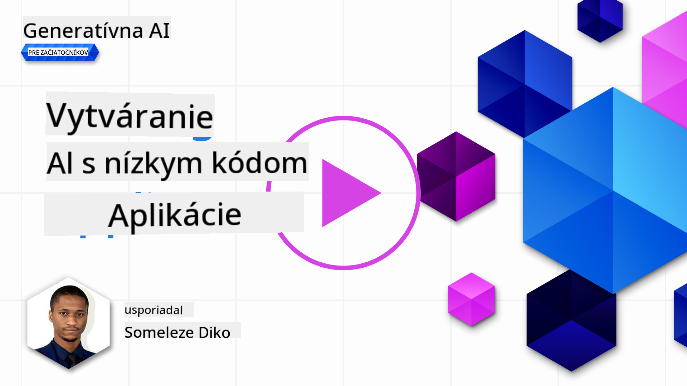
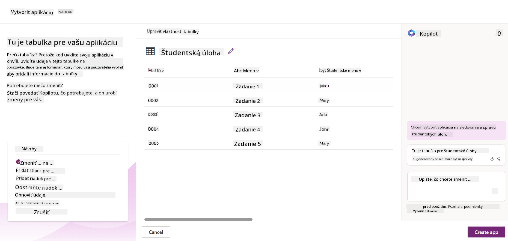
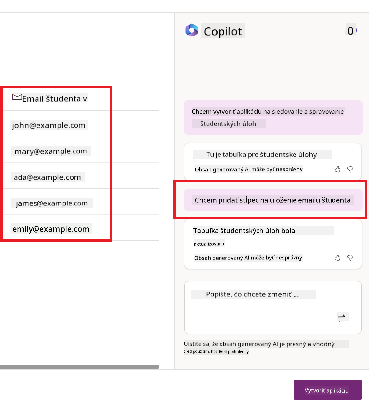

<!--
CO_OP_TRANSLATOR_METADATA:
{
  "original_hash": "f5ff3b6204a695a117d6f452403c95f7",
  "translation_date": "2025-05-19T21:03:50+00:00",
  "source_file": "10-building-low-code-ai-applications/README.md",
  "language_code": "sk"
}
-->
# Vytváranie aplikácií s umelou inteligenciou s nízkym kódom

> _(Kliknite na obrázok vyššie a pozrite si video z tejto lekcie)_

## Úvod

Teraz, keď sme sa naučili, ako vytvárať aplikácie generujúce obrázky, poďme sa porozprávať o nízkom kóde. Generatívna AI môže byť použitá v rôznych oblastiach vrátane nízkeho kódu, ale čo je to nízky kód a ako do neho môžeme pridať AI?

Vytváranie aplikácií a riešení sa stalo jednoduchším pre tradičných vývojárov aj ne-vývojárov vďaka využitiu platforiem pre vývoj s nízkym kódom. Platformy pre vývoj s nízkym kódom umožňujú vytvárať aplikácie a riešenia s minimálnym alebo žiadnym kódom. To sa dosahuje poskytnutím vizuálneho prostredia na vývoj, ktoré umožňuje ťahať a púšťať komponenty na vytváranie aplikácií a riešení. To umožňuje vytvárať aplikácie a riešenia rýchlejšie a s menšími zdrojmi. V tejto lekcii sa podrobne venujeme tomu, ako používať nízky kód a ako zlepšiť vývoj s nízkym kódom pomocou AI na Power Platform.

Power Platform poskytuje organizáciám príležitosť posilniť svoje tímy, aby si mohli vytvárať vlastné riešenia prostredníctvom intuitívneho prostredia s nízkym kódom alebo bez kódu. Toto prostredie pomáha zjednodušiť proces vytvárania riešení. S Power Platform môžu byť riešenia vytvorené za dni alebo týždne namiesto mesiacov alebo rokov. Power Platform sa skladá z piatich kľúčových produktov: Power Apps, Power Automate, Power BI, Power Pages a Copilot Studio.

Táto lekcia pokrýva:

- Úvod do generatívnej AI na Power Platform
- Úvod do Copilot a ako ho používať
- Používanie generatívnej AI na vytváranie aplikácií a tokov na Power Platform
- Porozumenie AI modelom na Power Platform s AI Builder

## Ciele učenia

Na konci tejto lekcie budete schopní:

- Pochopiť, ako funguje Copilot na Power Platform.

- Vytvoriť aplikáciu na sledovanie študentských úloh pre náš vzdelávací startup.

- Vytvoriť tok spracovania faktúr, ktorý využíva AI na extrakciu informácií z faktúr.

- Použiť osvedčené postupy pri používaní modelu GPT AI na vytváranie textu.

Nástroje a technológie, ktoré budete používať v tejto lekcii, sú:

- **Power Apps**, pre aplikáciu na sledovanie študentských úloh, ktorá poskytuje prostredie s nízkym kódom na vývoj aplikácií na sledovanie, správu a interakciu s dátami.

- **Dataverse**, na ukladanie dát pre aplikáciu na sledovanie študentských úloh, kde Dataverse poskytne platformu s nízkym kódom na ukladanie dát aplikácie.

- **Power Automate**, pre tok spracovania faktúr, kde budete mať prostredie s nízkym kódom na vývoj pracovných tokov na automatizáciu procesu spracovania faktúr.

- **AI Builder**, pre AI model spracovania faktúr, kde budete používať predpripravené AI modely na spracovanie faktúr pre náš startup.

## Generatívna AI na Power Platform

Zlepšenie vývoja a aplikácií s nízkym kódom pomocou generatívnej AI je kľúčovou oblasťou pre Power Platform. Cieľom je umožniť každému vytvárať aplikácie, stránky, dashboardy a automatizovať procesy s AI, _bez potreby akýchkoľvek znalostí dátovej vedy_. Tento cieľ sa dosahuje integráciou generatívnej AI do skúsenosti vývoja s nízkym kódom na Power Platform vo forme Copilot a AI Builder.

### Ako to funguje?

Copilot je AI asistent, ktorý vám umožňuje vytvárať riešenia na Power Platform opisom vašich požiadaviek v sérii konverzačných krokov pomocou prirodzeného jazyka. Môžete napríklad inštruovať vášho AI asistenta, aby uviedol, aké polia vaša aplikácia použije, a on vytvorí aplikáciu aj základný dátový model alebo môžete špecifikovať, ako nastaviť tok v Power Automate.

Môžete používať funkcie riadené Copilotom ako funkciu vo vašich obrazovkách aplikácií, aby ste umožnili používateľom objavovať informácie prostredníctvom konverzačných interakcií.

AI Builder je schopnosť AI s nízkym kódom dostupná na Power Platform, ktorá vám umožňuje používať AI modely na automatizáciu procesov a predpovedanie výsledkov. S AI Builder môžete priniesť AI do vašich aplikácií a tokov, ktoré sa pripájajú k vašim dátam v Dataverse alebo v rôznych cloudových zdrojoch dát, ako sú SharePoint, OneDrive alebo Azure.

Copilot je dostupný vo všetkých produktoch Power Platform: Power Apps, Power Automate, Power BI, Power Pages a Power Virtual Agents. AI Builder je dostupný v Power Apps a Power Automate. V tejto lekcii sa zameriame na to, ako používať Copilot a AI Builder v Power Apps a Power Automate na vytvorenie riešenia pre náš vzdelávací startup.

### Copilot v Power Apps

Ako súčasť Power Platform, Power Apps poskytuje prostredie s nízkym kódom na vývoj aplikácií na sledovanie, správu a interakciu s dátami. Je to súbor služieb na vývoj aplikácií s škálovateľnou dátovou platformou a schopnosťou pripojiť sa k cloudovým službám a dátam na mieste. Power Apps umožňuje vytvárať aplikácie, ktoré bežia na prehliadačoch, tabletoch a telefónoch, a môžu byť zdieľané s kolegami. Power Apps uľahčuje používateľom vývoj aplikácií jednoduchým rozhraním, takže každý obchodný používateľ alebo profesionálny vývojár môže vytvárať vlastné aplikácie. Skúsenosť s vývojom aplikácií je tiež zlepšená generatívnou AI prostredníctvom Copilot.

Funkcia AI asistenta Copilot v Power Apps vám umožňuje opísať, aký typ aplikácie potrebujete a aké informácie chcete, aby vaša aplikácia sledovala, zhromažďovala alebo zobrazovala. Copilot potom generuje responzívnu Canvas aplikáciu na základe vášho opisu. Potom môžete aplikáciu prispôsobiť, aby vyhovovala vašim potrebám. AI Copilot tiež generuje a navrhuje tabuľku Dataverse s poľami, ktoré potrebujete na uloženie dát, ktoré chcete sledovať, a niektoré vzorové dáta. Pozrieme sa na to, čo je Dataverse a ako ho môžete používať v Power Apps v tejto lekcii neskôr. Potom môžete tabuľku prispôsobiť, aby vyhovovala vašim potrebám pomocou funkcie AI Copilot asistenta prostredníctvom konverzačných krokov. Táto funkcia je dostupná priamo z domovskej obrazovky Power Apps.

### Copilot v Power Automate

Ako súčasť Power Platform, Power Automate umožňuje používateľom vytvárať automatizované pracovné toky medzi aplikáciami a službami. Pomáha automatizovať opakujúce sa obchodné procesy, ako sú komunikácia, zber dát a schvaľovanie rozhodnutí. Jeho jednoduché rozhranie umožňuje používateľom s každou technickou kompetenciou (od začiatočníkov po skúsených vývojárov) automatizovať pracovné úlohy. Skúsenosť s vývojom pracovných tokov je tiež zlepšená generatívnou AI prostredníctvom Copilot.

Funkcia AI asistenta Copilot v Power Automate vám umožňuje opísať, aký typ toku potrebujete a aké akcie chcete, aby váš tok vykonával. Copilot potom generuje tok na základe vášho opisu. Potom môžete tok prispôsobiť, aby vyhovoval vašim potrebám. AI Copilot tiež generuje a navrhuje akcie, ktoré potrebujete na vykonanie úlohy, ktorú chcete automatizovať. Pozrieme sa na to, čo sú toky a ako ich môžete používať v Power Automate v tejto lekcii neskôr. Potom môžete akcie prispôsobiť, aby vyhovovali vašim potrebám pomocou funkcie AI Copilot asistenta prostredníctvom konverzačných krokov. Táto funkcia je dostupná priamo z domovskej obrazovky Power Automate.

## Úloha: Spravujte študentské úlohy a faktúry pre náš startup pomocou Copilot

Náš startup poskytuje online kurzy študentom. Startup rýchlo rástol a teraz má problémy udržať krok s dopytom po svojich kurzoch. Startup vás najal ako vývojára Power Platform, aby ste im pomohli vytvoriť riešenie s nízkym kódom na správu študentských úloh a faktúr. Ich riešenie by malo byť schopné pomôcť im sledovať a spravovať študentské úlohy prostredníctvom aplikácie a automatizovať proces spracovania faktúr prostredníctvom pracovného toku. Boli ste požiadaní, aby ste použili generatívnu AI na vývoj riešenia.

Keď začínate používať Copilot, môžete použiť [Power Platform Copilot Prompt Library](https://github.com/pnp/powerplatform-prompts?WT.mc_id=academic-109639-somelezediko) na začiatok s promptmi. Táto knižnica obsahuje zoznam promptov, ktoré môžete použiť na vytváranie aplikácií a tokov pomocou Copilot. Môžete tiež použiť prompty v knižnici, aby ste získali predstavu o tom, ako opísať vaše požiadavky Copilotovi.

### Vytvorte aplikáciu na sledovanie študentských úloh pre náš startup

Vzdelávací pracovníci v našom startupe majú problémy so sledovaním študentských úloh. Používali tabuľku na sledovanie úloh, ale to sa stalo ťažko zvládnuteľným, keď sa počet študentov zvýšil. Požiadali vás, aby ste vytvorili aplikáciu, ktorá im pomôže sledovať a spravovať študentské úlohy. Aplikácia by mala umožniť pridávanie nových úloh, prezeranie úloh, aktualizáciu úloh a mazanie úloh. Aplikácia by mala tiež umožniť vzdelávacím pracovníkom a študentom prezerať úlohy, ktoré boli ohodnotené a ktoré neboli ohodnotené.

Aplikáciu vytvoríte pomocou Copilot v Power Apps podľa nasledujúcich krokov:

1. Prejdite na domovskú obrazovku [Power Apps](https://make.powerapps.com?WT.mc_id=academic-105485-koreyst).

1. Použite textovú oblasť na domovskej obrazovke na opis aplikácie, ktorú chcete vytvoriť. Napríklad, **_Chcem vytvoriť aplikáciu na sledovanie a správu študentských úloh_**. Kliknite na tlačidlo **Send** na odoslanie promptu AI Copilotovi.

1. AI Copilot navrhne tabuľku Dataverse s poľami, ktoré potrebujete na uloženie dát, ktoré chcete sledovať, a niektoré vzorové dáta. Potom môžete tabuľku prispôsobiť, aby vyhovovala vašim potrebám pomocou funkcie AI Copilot asistenta prostredníctvom konverzačných krokov.

   > **Dôležité**: Dataverse je základná dátová platforma pre Power Platform. Je to platforma s nízkym kódom na ukladanie dát aplikácie. Je to plne spravovaná služba, ktorá bezpečne ukladá dáta v Microsoft Cloud a je poskytovaná v rámci vášho prostredia Power Platform. Prichádza s vstavanými schopnosťami správy dát, ako je klasifikácia dát, sledovanie pôvodu dát, jemne-grainovaná kontrola prístupu a viac. Viac o Dataverse sa môžete dozvedieť [tu](https://docs.microsoft.com/powerapps/maker/data-platform/data-platform-intro?WT.mc_id=academic-109639-somelezediko).

   

1. Vzdelávací pracovníci chcú posielať e-maily študentom, ktorí odovzdali svoje úlohy, aby ich informovali o pokroku ich úloh. Môžete použiť Copilot na pridanie nového poľa do tabuľky na uloženie e-mailu študenta. Napríklad môžete použiť nasledujúci prompt na pridanie nového poľa do tabuľky: **_Chcem pridať stĺpec na uloženie e-mailu študenta_**. Kliknite na tlačidlo **Send** na odoslanie promptu AI Copilotovi.

1. AI Copilot vygeneruje nové pole a potom ho môžete prispôsobiť, aby vyhovovalo vašim potrebám.

1. Keď skončíte s tabuľkou, kliknite na tlačidlo **Create app** na vytvorenie aplikácie.

1. AI Copilot vygeneruje responzívnu Canvas aplikáciu na základe vášho opisu. Potom môžete aplikáciu prispôsobiť, aby vyhovovala vašim potrebám.

1. Aby vzdelávací pracovníci mohli posielať e-maily študentom, môžete použiť Copilot na pridanie novej obrazovky do aplikácie. Napríklad môžete použiť nasledujúci prompt na pridanie novej obrazovky do aplikácie: **_Chcem pridať obrazovku na posielanie e-mailov študentom_**. Kliknite na tlačidlo **Send** na odoslanie promptu AI Copilotovi.

1. AI Copilot vygeneruje novú obrazovku a potom ju môžete prispôsobiť, aby vyhovovala vašim potrebám.

1. Keď skončíte s aplikáciou, kliknite na tlačidlo **Save** na uloženie aplikácie.

1. Ak chcete aplikáciu zdieľať s vzdelávacími pracovníkmi, kliknite na tlačidlo **Share** a potom znova kliknite na tlačidlo **Share**. Potom môžete aplikáciu zdieľať s vzdelávacími pracovníkmi zadaním ich e-mailových adries.

> **Vaša domáca úloha**: Aplikácia, ktorú ste práve vytvorili, je dobrý začiatok, ale môže byť vylepšená. S funkciou e-mailu môžu vzdelávací pracovníci posielať e-maily študentom len manuálne tým, že musia zadávať ich e-maily. Môžete použiť Copilot na vytvorenie automatizácie, ktorá umožní vzdelávacím pracovníkom posielať e-maily študentom automaticky, keď odovzdajú svoje úlohy? Vaša nápoveda je, že s správnym promptom môžete použiť Copilot v Power Automate na vytvorenie tohto.

### Vytvorte tabuľku informácií o faktúrach pre náš startup

Finančný tím nášho startupu má problémy so sledovaním faktúr. Používali tabuľku na sledovanie faktúr, ale to sa stalo ťažko zvládnuteľným, keď sa počet faktúr zvýšil. Požiadali vás, aby ste vytvorili tabuľku, ktorá im pomôže ukladať, sledovať a spravovať informácie o faktúrach, ktoré dostali. Tabuľka by mala byť použitá na vytvorenie automatizácie, ktorá extrahuje všetky informácie o faktúrach a ukladá ich do tabuľky. Tabuľka by mala tiež umožniť finančnému tímu prezerať faktúry, ktoré boli zaplatené a ktoré neboli zaplatené.

Power Platform má základnú dátovú platformu nazvanú Dataverse, ktorá vám umožňuje ukladať dáta pre vaše aplikácie a riešenia. Dat
- **Analýza sentimentu**: Tento model detekuje pozitívny, negatívny, neutrálny alebo zmiešaný sentiment v texte.
- **Čítačka vizitiek**: Tento model extrahuje informácie z vizitiek.
- **Rozpoznávanie textu**: Tento model extrahuje text z obrázkov.
- **Detekcia objektov**: Tento model detekuje a extrahuje objekty z obrázkov.
- **Spracovanie dokumentov**: Tento model extrahuje informácie z formulárov.
- **Spracovanie faktúr**: Tento model extrahuje informácie z faktúr.

S vlastnými AI modelmi môžete priniesť svoj vlastný model do AI Builderu, aby fungoval ako akýkoľvek vlastný model AI Builderu, čo vám umožní trénovať model pomocou vlastných údajov. Tieto modely môžete použiť na automatizáciu procesov a predikciu výsledkov v Power Apps aj Power Automate. Pri používaní vlastného modelu sa však vzťahujú určité obmedzenia. Viac o týchto [obmedzeniach](https://learn.microsoft.com/ai-builder/byo-model#limitations?WT.mc_id=academic-105485-koreyst).

## Zadanie #2 - Vytvorte tok spracovania faktúr pre náš startup

Finančný tím má problémy so spracovaním faktúr. Používali tabuľku na sledovanie faktúr, ale s nárastom počtu faktúr sa to stalo ťažko zvládnuteľné. Požiadali vás, aby ste vytvorili pracovný tok, ktorý im pomôže spracovať faktúry pomocou AI. Pracovný tok by im mal umožniť extrahovať informácie z faktúr a uložiť tieto informácie do tabuľky v Dataverse. Pracovný tok by im tiež mal umožniť odoslať e-mail finančnému tímu s extrahovanými informáciami.

Teraz, keď viete, čo je AI Builder a prečo by ste ho mali používať, pozrime sa, ako môžete použiť model AI na spracovanie faktúr v AI Builderi, ktorý sme už spomínali, na vytvorenie pracovného toku, ktorý pomôže finančnému tímu spracovať faktúry.

Ak chcete vytvoriť pracovný tok, ktorý pomôže finančnému tímu spracovať faktúry pomocou modelu AI na spracovanie faktúr v AI Builderi, postupujte podľa nasledujúcich krokov:

1. Prejdite na domovskú obrazovku [Power Automate](https://make.powerautomate.com?WT.mc_id=academic-105485-koreyst).
2. Použite textovú oblasť na domovskej obrazovke na opísanie pracovného toku, ktorý chcete vytvoriť. Napríklad, **_Spracovať faktúru, keď dorazí do mojej schránky_**. Kliknite na tlačidlo **Odoslať** a pošlite výzvu AI Copilotovi.
3. AI Copilot navrhne kroky, ktoré potrebujete na vykonanie úlohy, ktorú chcete automatizovať. Môžete kliknúť na tlačidlo **Ďalej** a prejsť na ďalšie kroky.
4. V ďalšom kroku vás Power Automate vyzve, aby ste nastavili potrebné pripojenia pre tok. Keď skončíte, kliknite na tlačidlo **Vytvoriť tok** na vytvorenie toku.
5. AI Copilot vygeneruje tok a potom ho môžete prispôsobiť podľa svojich potrieb.
6. Aktualizujte spúšťač toku a nastavte **Priečinok** na priečinok, kde budú faktúry uložené. Napríklad môžete nastaviť priečinok na **Doručená pošta**. Kliknite na **Zobraziť rozšírené možnosti** a nastavte **Iba s prílohami** na **Áno**. To zabezpečí, že tok sa spustí iba vtedy, keď bude do priečinka prijatý e-mail s prílohou.
7. Odstráňte nasledujúce akcie z toku: **HTML na text**, **Zložiť**, **Zložiť 2**, **Zložiť 3** a **Zložiť 4**, pretože ich nebudete používať.
8. Odstráňte akciu **Podmienka** z toku, pretože ju nebudete používať. Malo by to vyzerať ako na nasledujúcom obrázku:
9. Kliknite na tlačidlo **Pridať akciu** a vyhľadajte **Dataverse**. Vyberte akciu **Pridať nový riadok**.
10. Na akcii **Extrahovať informácie z faktúr** aktualizujte **Súbor faktúry**, aby ukazoval na **Obsah prílohy** z e-mailu. To zabezpečí, že tok extrahuje informácie z prílohy faktúry.
11. Vyberte **Tabuľku**, ktorú ste vytvorili skôr. Napríklad môžete vybrať tabuľku **Informácie o faktúre**. Vyberte dynamický obsah z predchádzajúcej akcie na vyplnenie nasledujúcich polí:
    - ID
    - Suma
    - Dátum
    - Meno
    - Stav
    - Nastavte **Stav** na **Čakajúci**.
    - E-mail dodávateľa
    - Použite dynamický obsah **Od** z akcie **Keď príde nový e-mail**.
12. Keď dokončíte tok, kliknite na tlačidlo **Uložiť** na uloženie toku. Tok potom môžete otestovať odoslaním e-mailu s faktúrou do priečinka, ktorý ste špecifikovali v spúšťači.

> **Vaša úloha**: Tok, ktorý ste práve vytvorili, je dobrým začiatkom, teraz musíte premýšľať o tom, ako môžete vytvoriť automatizáciu, ktorá umožní nášmu finančnému tímu odoslať e-mail dodávateľovi, aby ho informoval o aktuálnom stave jeho faktúry. Vaša nápoveda: tok sa musí spustiť, keď sa zmení stav faktúry.

## Použitie modelu AI na generovanie textu v Power Automate

Model na vytváranie textu s GPT v AI Builderi vám umožňuje generovať text na základe výzvy a je poháňaný službou Microsoft Azure OpenAI. S touto funkciou môžete integrovať technológiu GPT (Generative Pre-Trained Transformer) do svojich aplikácií a tokov na vytváranie rôznych automatizovaných tokov a inteligentných aplikácií.

GPT modely prechádzajú rozsiahlym tréningom na veľkom množstve dát, čo im umožňuje produkovať text, ktorý sa blíži ľudskému jazyku, keď sú im poskytnuté výzvy. Keď sú integrované s automatizáciou pracovných tokov, AI modely ako GPT môžu byť využité na zefektívnenie a automatizáciu širokého spektra úloh.

Napríklad môžete vytvárať toky na automatické generovanie textu pre rôzne prípady použitia, ako sú: návrhy e-mailov, popisy produktov a ďalšie. Model môžete tiež použiť na generovanie textu pre rôzne aplikácie, ako sú chatboty a aplikácie zákazníckeho servisu, ktoré umožňujú agentom zákazníckeho servisu efektívne a účinne reagovať na otázky zákazníkov.

Ak sa chcete naučiť, ako používať tento AI model v Power Automate, prejdite cez modul [Pridanie inteligencie s AI Builder a GPT](https://learn.microsoft.com/training/modules/ai-builder-text-generation/?WT.mc_id=academic-109639-somelezediko).

## Skvelá práca! Pokračujte vo svojom učení

Po dokončení tejto lekcie si pozrite našu [Generatívnu AI učebnú kolekciu](https://aka.ms/genai-collection?WT.mc_id=academic-105485-koreyst), aby ste pokračovali v zvyšovaní svojich znalostí o generatívnej AI!

Prejdite na Lekciu 11, kde sa pozrieme na to, ako [integrovať generatívnu AI s volaním funkcií](../11-integrating-with-function-calling/README.md?WT.mc_id=academic-105485-koreyst)!

**Zrieknutie sa zodpovednosti**:  
Tento dokument bol preložený pomocou služby AI prekladu [Co-op Translator](https://github.com/Azure/co-op-translator). Aj keď sa snažíme o presnosť, upozorňujeme, že automatické preklady môžu obsahovať chyby alebo nepresnosti. Pôvodný dokument v jeho rodnom jazyku by mal byť považovaný za autoritatívny zdroj. Pre kritické informácie sa odporúča profesionálny ľudský preklad. Nie sme zodpovední za žiadne nedorozumenia alebo nesprávne interpretácie vyplývajúce z použitia tohto prekladu.