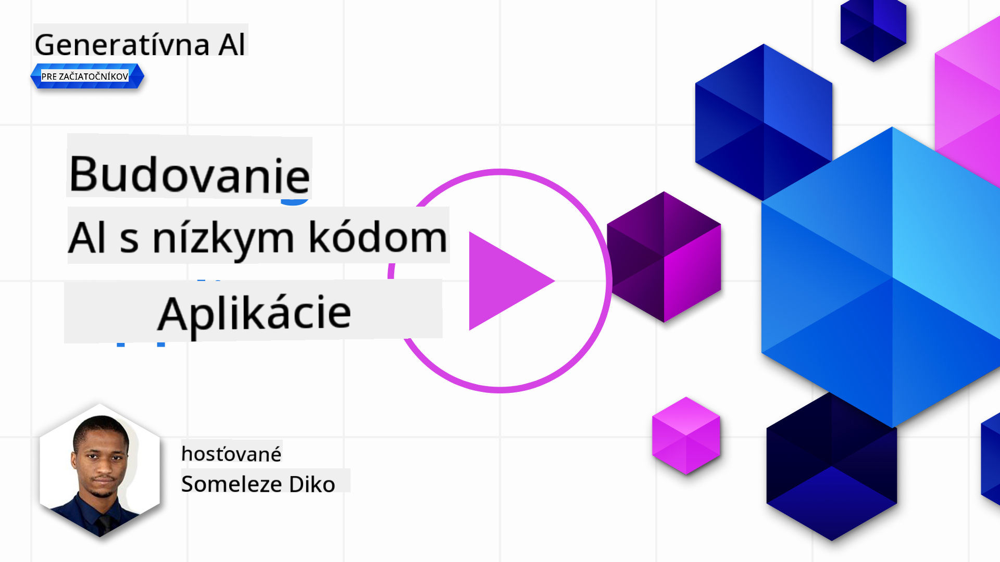
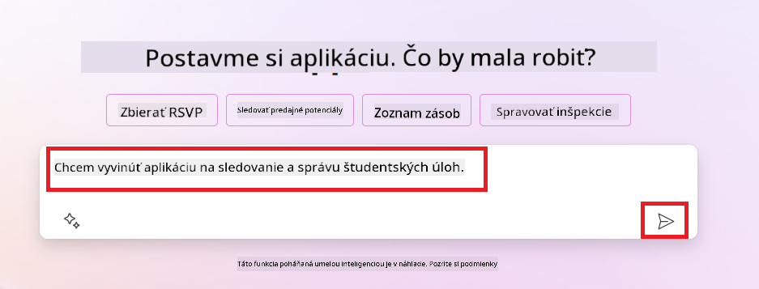
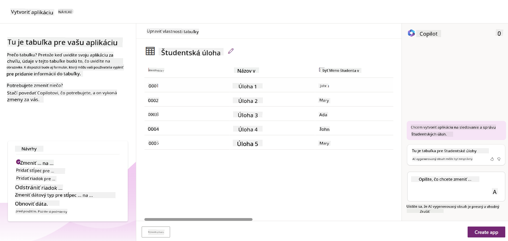
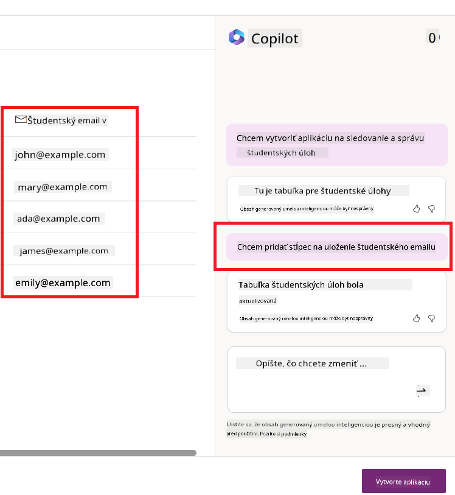
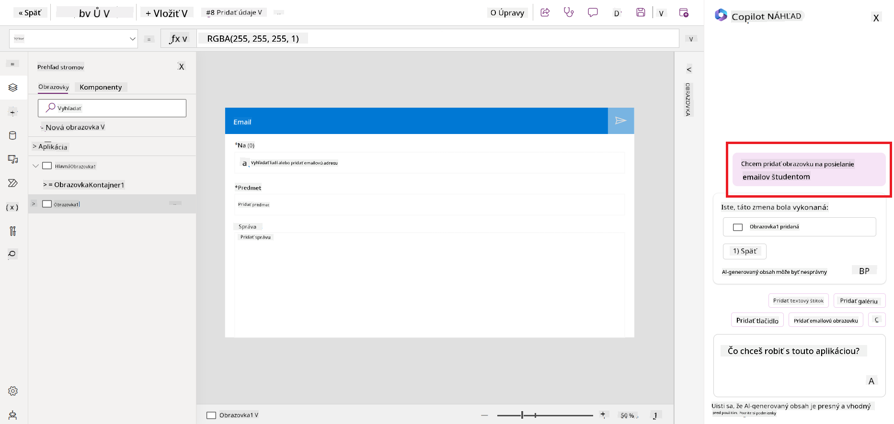
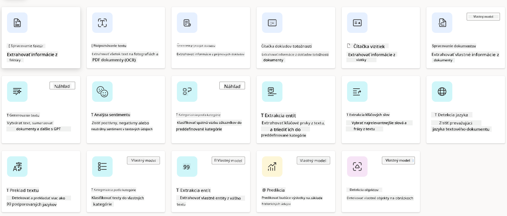
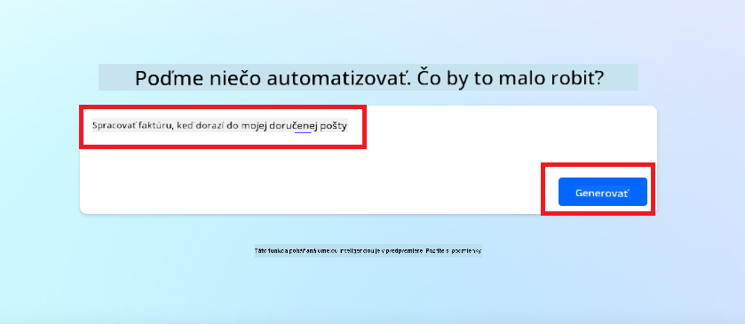
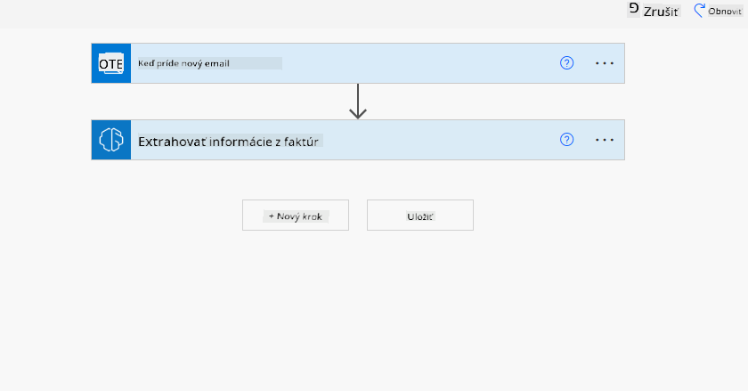
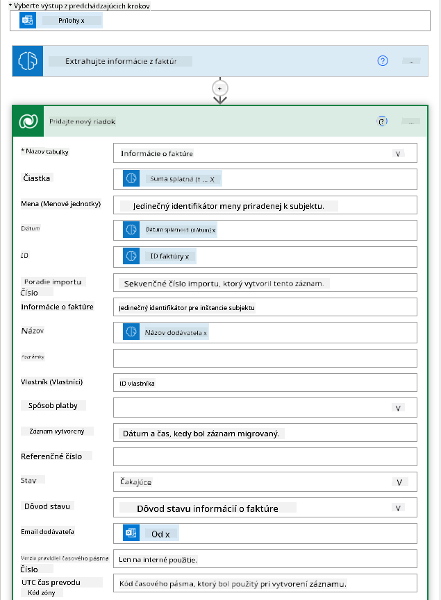
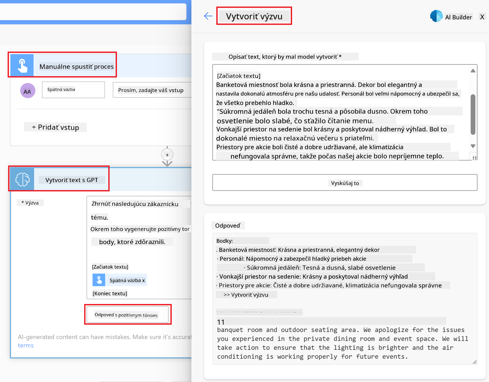

<!--
CO_OP_TRANSLATOR_METADATA:
{
  "original_hash": "f5ff3b6204a695a117d6f452403c95f7",
  "translation_date": "2025-06-25T19:21:43+00:00",
  "source_file": "10-building-low-code-ai-applications/README.md",
  "language_code": "sk"
}
-->
# Budovanie Low Code AI Aplikácií

> _(Kliknite na obrázok vyššie pre zobrazenie videa tejto lekcie)_

## Úvod

Teraz, keď sme sa naučili, ako vytvárať aplikácie na generovanie obrázkov, poďme sa porozprávať o low code. Generatívna AI môže byť použitá v rôznych oblastiach vrátane low code, ale čo je to low code a ako k nemu môžeme pridať AI?

Vytváranie aplikácií a riešení sa stalo jednoduchším pre tradičných vývojárov aj ne-vývojárov prostredníctvom Low Code Development Platforiem. Tieto platformy umožňujú vytvárať aplikácie a riešenia s minimálnym alebo žiadnym kódom. To sa dosahuje poskytovaním vizuálneho vývojového prostredia, ktoré umožňuje presúvanie komponentov na vytváranie aplikácií a riešení. To umožňuje vytvárať aplikácie a riešenia rýchlejšie a s menšími zdrojmi. V tejto lekcii sa podrobne pozrieme na to, ako používať Low Code a ako vylepšiť vývoj low code s AI pomocou Power Platform.

Power Platform poskytuje organizáciám možnosť posilniť svoje tímy, aby si vytvárali vlastné riešenia prostredníctvom intuitívneho low-code alebo no-code prostredia. Toto prostredie pomáha zjednodušiť proces budovania riešení. S Power Platform môžu byť riešenia vytvorené za dni alebo týždne namiesto mesiacov alebo rokov. Power Platform pozostáva z piatich kľúčových produktov: Power Apps, Power Automate, Power BI, Power Pages a Copilot Studio.

Táto lekcia pokrýva:

- Úvod do Generatívnej AI v Power Platform
- Úvod do Copilot a ako ho používať
- Používanie Generatívnej AI na budovanie aplikácií a tokov v Power Platform
- Pochopenie AI Modelov v Power Platform s AI Builder

## Ciele učenia

Na konci tejto lekcie budete schopní:

- Pochopiť, ako funguje Copilot v Power Platform.

- Vytvoriť aplikáciu na sledovanie úloh študentov pre náš vzdelávací startup.

- Vytvoriť tok na spracovanie faktúr, ktorý používa AI na extrakciu informácií z faktúr.

- Aplikovať najlepšie praktiky pri používaní modelu Create Text s GPT AI.

Nástroje a technológie, ktoré budete používať v tejto lekcii sú:

- **Power Apps**, pre aplikáciu na sledovanie úloh študentov, ktorá poskytuje low-code vývojové prostredie na budovanie aplikácií na sledovanie, správu a interakciu s dátami.

- **Dataverse**, na ukladanie dát pre aplikáciu na sledovanie úloh študentov, kde Dataverse poskytne low-code dátovú platformu na ukladanie dát aplikácie.

- **Power Automate**, pre tok na spracovanie faktúr, kde budete mať low-code vývojové prostredie na budovanie workflowov na automatizáciu procesu spracovania faktúr.

- **AI Builder**, pre model AI na spracovanie faktúr, kde použijete predpripravené AI modely na spracovanie faktúr pre náš startup.

## Generatívna AI v Power Platform

Zlepšenie low-code vývoja a aplikácií s generatívnou AI je kľúčovou oblasťou pre Power Platform. Cieľom je umožniť každému vytvárať AI poháňané aplikácie, stránky, dashboardy a automatizovať procesy s AI, _bez nutnosti akejkoľvek odbornosti v oblasti dátovej vedy_. Tento cieľ sa dosahuje integráciou generatívnej AI do low-code vývojového prostredia v Power Platform vo forme Copilot a AI Builder.

### Ako to funguje?

Copilot je AI asistent, ktorý vám umožňuje vytvárať riešenia v Power Platform opisovaním vašich požiadaviek v sérii konverzačných krokov pomocou prirodzeného jazyka. Môžete napríklad inštruovať svojho AI asistenta, aby uviedol, aké polia vaša aplikácia použije a on vytvorí aplikáciu aj podkladový dátový model, alebo môžete špecifikovať, ako nastaviť tok v Power Automate.

Funkcionality riadené Copilotom môžete použiť ako funkciu na obrazovkách vašej aplikácie, aby ste umožnili používateľom odhaliť poznatky prostredníctvom konverzačných interakcií.

AI Builder je low-code AI schopnosť dostupná v Power Platform, ktorá vám umožňuje používať AI modely na automatizáciu procesov a predpovedanie výsledkov. S AI Builder môžete priniesť AI do vašich aplikácií a tokov, ktoré sa pripájajú k vašim dátam v Dataverse alebo v rôznych cloudových dátových zdrojoch, ako sú SharePoint, OneDrive alebo Azure.

Copilot je dostupný vo všetkých produktoch Power Platform: Power Apps, Power Automate, Power BI, Power Pages a Power Virtual Agents. AI Builder je dostupný v Power Apps a Power Automate. V tejto lekcii sa zameriame na to, ako používať Copilot a AI Builder v Power Apps a Power Automate na vytvorenie riešenia pre náš vzdelávací startup.

### Copilot v Power Apps

Ako súčasť Power Platform, Power Apps poskytuje low-code vývojové prostredie na vytváranie aplikácií na sledovanie, správu a interakciu s dátami. Je to súbor služieb na vývoj aplikácií s rozšíriteľnou dátovou platformou a schopnosťou pripojiť sa k cloudovým službám a on-premises dátam. Power Apps umožňuje vytvárať aplikácie, ktoré bežia v prehliadačoch, tabletoch a telefónoch a môžu byť zdieľané s kolegami. Power Apps uľahčuje používateľom vývoj aplikácií jednoduchým rozhraním, takže každý obchodný používateľ alebo profesionálny vývojár môže vytvárať vlastné aplikácie. Skúsenosť s vývojom aplikácií je tiež vylepšená s Generatívnou AI prostredníctvom Copilot.

Funkcia AI asistenta Copilot v Power Apps vám umožňuje opísať, aký druh aplikácie potrebujete a aké informácie chcete, aby vaša aplikácia sledovala, zbierala alebo zobrazovala. Copilot potom vygeneruje responzívnu Canvas aplikáciu na základe vášho popisu. Môžete potom aplikáciu prispôsobiť podľa svojich potrieb. AI Copilot tiež generuje a navrhuje Dataverse tabuľku s poľami, ktoré potrebujete na ukladanie dát, ktoré chcete sledovať, a niektoré vzorové dáta. Pozrieme sa na to, čo je Dataverse a ako ho môžete použiť v Power Apps v tejto lekcii neskôr. Môžete potom tabuľku prispôsobiť podľa svojich potrieb pomocou funkcie AI Copilot asistenta prostredníctvom konverzačných krokov. Táto funkcia je ľahko dostupná z domovskej obrazovky Power Apps.

### Copilot v Power Automate

Ako súčasť Power Platform, Power Automate umožňuje používateľom vytvárať automatizované workflowy medzi aplikáciami a službami. Pomáha automatizovať opakujúce sa obchodné procesy, ako sú komunikácia, zbieranie dát a schvaľovanie rozhodnutí. Jeho jednoduché rozhranie umožňuje používateľom s rôznou technickou kompetenciou (od začiatočníkov po skúsených vývojárov) automatizovať pracovné úlohy. Skúsenosť s vývojom workflowov je tiež vylepšená s Generatívnou AI prostredníctvom Copilot.

Funkcia AI asistenta Copilot v Power Automate vám umožňuje opísať, aký druh toku potrebujete a aké akcie chcete, aby váš tok vykonal. Copilot potom vygeneruje tok na základe vášho popisu. Môžete potom tok prispôsobiť podľa svojich potrieb. AI Copilot tiež generuje a navrhuje akcie, ktoré potrebujete na vykonanie úlohy, ktorú chcete automatizovať. Pozrieme sa na to, čo sú toky a ako ich môžete použiť v Power Automate v tejto lekcii neskôr. Môžete potom akcie prispôsobiť podľa svojich potrieb pomocou funkcie AI Copilot asistenta prostredníctvom konverzačných krokov. Táto funkcia je ľahko dostupná z domovskej obrazovky Power Automate.

## Úloha: Správa úloh študentov a faktúr pre náš startup pomocou Copilot

Náš startup poskytuje online kurzy pre študentov. Startup rýchlo rástol a teraz má problémy s udržaním krokov s dopytom po svojich kurzoch. Startup vás najal ako Power Platform vývojára, aby ste im pomohli vytvoriť low code riešenie, ktoré im pomôže spravovať úlohy študentov a faktúry. Ich riešenie by malo byť schopné pomôcť im sledovať a spravovať úlohy študentov prostredníctvom aplikácie a automatizovať proces spracovania faktúr prostredníctvom workflowu. Boli ste požiadaní použiť Generatívnu AI na vývoj riešenia.

Keď začínate s používaním Copilot, môžete použiť [Power Platform Copilot Prompt Library](https://github.com/pnp/powerplatform-prompts?WT.mc_id=academic-109639-somelezediko) na začiatok s promptmi. Táto knižnica obsahuje zoznam promptov, ktoré môžete použiť na vytváranie aplikácií a tokov s Copilot. Môžete tiež použiť prompty v knižnici, aby ste získali predstavu o tom, ako opísať vaše požiadavky Copilot.

### Vytvorte aplikáciu na sledovanie úloh študentov pre náš startup

Vychovávatelia v našom startupe majú problémy so sledovaním úloh študentov. Používali tabuľku na sledovanie úloh, ale to sa stalo ťažko spravovateľným, pretože počet študentov sa zvýšil. Požiadali vás, aby ste vytvorili aplikáciu, ktorá im pomôže sledovať a spravovať úlohy študentov. Aplikácia by im mala umožniť pridávať nové úlohy, zobraziť úlohy, aktualizovať úlohy a mazať úlohy. Aplikácia by mala tiež umožniť vychovávateľom a študentom zobraziť úlohy, ktoré boli ohodnotené a tie, ktoré neboli ohodnotené.

Aplikáciu vytvoríte pomocou Copilot v Power Apps podľa nasledujúcich krokov:

1. Prejdite na domovskú obrazovku [Power Apps](https://make.powerapps.com?WT.mc_id=academic-105485-koreyst).

1. Použite textové pole na domovskej obrazovke na opísanie aplikácie, ktorú chcete vytvoriť. Napríklad, **_Chcem vytvoriť aplikáciu na sledovanie a spravovanie úloh študentov_**. Kliknite na tlačidlo **Odoslať**, aby ste poslali prompt AI Copilot.

1. AI Copilot navrhne Dataverse tabuľku s poľami, ktoré potrebujete na ukladanie dát, ktoré chcete sledovať, a niektoré vzorové dáta. Môžete potom tabuľku prispôsobiť podľa svojich potrieb pomocou funkcie AI Copilot asistenta prostredníctvom konverzačných krokov.

   > **Dôležité**: Dataverse je základná dátová platforma pre Power Platform. Je to low-code dátová platforma na ukladanie dát aplikácie. Je to plne spravovaná služba, ktorá bezpečne ukladá dáta v Microsoft Cloude a je provisionovaná vo vašom Power Platform prostredí. Prichádza s vstavanými možnosťami správy dát, ako sú klasifikácia dát, sledovanie pôvodu dát, jemnozrnná kontrola prístupu a ďalšie. Viac o Dataverse sa môžete dozvedieť [tu](https://docs.microsoft.com/powerapps/maker/data-platform/data-platform-intro?WT.mc_id=academic-109639-somelezediko).

   

1. Vychovávatelia chcú posielať e-maily študentom, ktorí odovzdali svoje úlohy, aby ich informovali o priebehu ich úloh. Môžete použiť Copilot na pridanie nového poľa do tabuľky na ukladanie e-mailu študenta. Napríklad, môžete použiť nasledujúci prompt na pridanie nového poľa do tabuľky: **_Chcem pridať stĺpec na ukladanie e-mailu študenta_**. Kliknite na tlačidlo **Odoslať**, aby ste poslali prompt AI Copilot.

1. AI Copilot vygeneruje nové pole a môžete potom pole prispôsobiť podľa svojich potrieb.

1. Keď ste hotoví s tabuľkou, kliknite na tlačidlo **Vytvoriť aplikáciu**, aby ste vytvorili aplikáciu.

1. AI Copilot vygeneruje responzívnu Canvas aplikáciu na základe vášho popisu. Môžete potom aplikáciu prispôsobiť podľa svojich potrieb.

1. Aby vychovávatelia mohli posielať e-maily študentom, môžete použiť Copilot na pridanie novej obrazovky do aplikácie. Napríklad, môžete použiť nasledujúci prompt na pridanie novej obrazovky do aplikácie: **_Chcem pridať obrazovku na posielanie e-mailov študentom_**. Kliknite na tlačidlo **Odoslať**, aby ste poslali prompt AI Copilot.

1. AI Copilot vygeneruje novú obrazovku a môžete potom obrazovku prispôsobiť podľa svojich potrieb.

1. Keď ste hotoví s aplikáciou, kliknite na tlačidlo **Uložiť**, aby ste aplikáciu uložili.

1. Ak chcete aplikáciu zdieľať s vychovávateľmi, kliknite na tlačidlo **Zdieľať** a potom znova kliknite na tlačidlo **Zdieľať**. Môžete potom aplikáciu zdieľať s vychovávateľmi zadaním ich e-mailových adries.

> **Vaša domáca úloha**: Aplikácia, ktorú ste práve vytvorili, je dobrý začiatok, ale môže byť vylepšená. S funkciou e-mailu môžu vychovávatelia posielať e-maily študentom iba manuálne tým, že musia zadať ich e-maily. Môžete použiť Copilot na vytvorenie automatizácie, ktorá umožní vychovávateľom posielať e-maily študentom automaticky, keď odovzdajú svoje úlohy? Vaša nápoveda je, že s vhodným promptom môžete použiť Copilot v Power Automate na vytvorenie tohto.

### Vytvorte tabuľku s informáciami o faktúrach pre náš startup

Finančný tím nášho startupu má problémy so sledovaním faktúr. Používali tabuľku na sledovanie faktúr, ale to sa stalo ťažko spravovateľným, pretože počet faktúr sa zvýšil. Požiadali vás, aby ste vytvorili tabuľku, ktorá im pomôže ukladať, sledovať a spravovať informácie o faktúrach, ktoré dostali. Tabuľka by mala byť použitá na vytvorenie automatizácie, ktorá extrahuje všetky informácie o faktúrach a ukladá ich do tabuľky. Tabuľka by mala tiež umožniť finančnému tímu zobraziť faktúry, ktoré boli zaplatené a tie, ktoré neboli zaplatené.

Power Platform má základnú dátovú platformu nazývanú Dataverse, ktorá umožňuje ukladať dáta pre vaše aplikácie a riešenia. Dataverse poskytuje low-code dátovú platformu na ukladanie dát aplikácie. Je to plne spravovaná služba, ktorá bezpečne ukladá dáta v Microsoft Cloude a je provisionovaná vo vašom Power Platform prostredí. Prichádza s vstavanými možnosťami správy dát, ako sú klasifikácia dát, sledovanie pôvodu dát, jemnozrnná kontrola prístupu a ďalšie. Viac o [Dat
a text. - **Analýza sentimentu**: Tento model detekuje pozitívny, negatívny, neutrálny alebo zmiešaný sentiment v texte. - **Čítačka vizitiek**: Tento model extrahuje informácie z vizitiek. - **Rozpoznávanie textu**: Tento model extrahuje text z obrázkov. - **Detekcia objektov**: Tento model detekuje a extrahuje objekty z obrázkov. - **Spracovanie dokumentov**: Tento model extrahuje informácie z formulárov. - **Spracovanie faktúr**: Tento model extrahuje informácie z faktúr. S vlastnými AI modelmi môžete priniesť svoj vlastný model do AI Buildera, aby mohol fungovať ako akýkoľvek vlastný model AI Buildera, čo vám umožní trénovať model pomocou vlastných údajov. Tieto modely môžete použiť na automatizáciu procesov a predikciu výsledkov v Power Apps aj Power Automate. Pri používaní vlastného modelu sa uplatňujú určité obmedzenia. Viac o týchto [obmedzeniach](https://learn.microsoft.com/ai-builder/byo-model#limitations?WT.mc_id=academic-105485-koreyst). 

## Zadanie č. 2 - Vytvorte tok spracovania faktúr pre náš startup

Finančný tím mal problémy so spracovaním faktúr. Používali tabuľku na sledovanie faktúr, ale to sa stalo ťažko zvládnuteľným, keďže počet faktúr sa zvýšil. Požiadali vás, aby ste vytvorili pracovný tok, ktorý im pomôže spracovať faktúry pomocou AI. Pracovný tok by im mal umožniť extrahovať informácie z faktúr a uložiť ich do tabuľky Dataverse. Pracovný tok by im mal tiež umožniť poslať email finančnému tímu s extrahovanými informáciami. Teraz, keď viete, čo je AI Builder a prečo by ste ho mali používať, pozrime sa, ako môžete použiť model spracovania faktúr v AI Builderi, ktorý sme už spomínali, na vytvorenie pracovného toku, ktorý pomôže finančnému tímu spracovať faktúry.

Na vytvorenie pracovného toku, ktorý pomôže finančnému tímu spracovať faktúry pomocou modelu spracovania faktúr v AI Builderi, postupujte podľa nasledujúcich krokov:

1. Prejdite na domovskú obrazovku [Power Automate](https://make.powerautomate.com?WT.mc_id=academic-105485-koreyst).
2. Použite textové pole na domovskej obrazovke na opísanie pracovného toku, ktorý chcete vytvoriť. Napríklad, **_Spracuj faktúru, keď príde do mojej schránky_**. Kliknite na tlačidlo **Odoslať** na odoslanie výzvy AI Copilotovi. 
3. AI Copilot navrhne akcie, ktoré potrebujete na vykonanie úlohy, ktorú chcete automatizovať. Môžete kliknúť na tlačidlo **Ďalej** a prejsť na ďalšie kroky.
4. V ďalšom kroku vás Power Automate vyzve, aby ste nastavili potrebné pripojenia pre tok. Keď skončíte, kliknite na tlačidlo **Vytvoriť tok** na vytvorenie toku.
5. AI Copilot vygeneruje tok a potom ho môžete prispôsobiť podľa svojich potrieb.
6. Aktualizujte spúšťač toku a nastavte **Priečinok** na priečinok, kde budú faktúry uložené. Napríklad môžete nastaviť priečinok na **Doručená pošta**. Kliknite na **Zobraziť rozšírené možnosti** a nastavte **Iba s prílohami** na **Áno**. To zabezpečí, že tok sa spustí iba vtedy, keď sa v priečinku prijme email s prílohou.
7. Odstráňte nasledujúce akcie z toku: **HTML na text**, **Compose**, **Compose 2**, **Compose 3** a **Compose 4**, pretože ich nebudete používať.
8. Odstráňte akciu **Podmienka** z toku, pretože ju nebudete používať. Malo by to vyzerať ako na nasledujúcom snímku obrazovky: 
9. Kliknite na tlačidlo **Pridať akciu** a vyhľadajte **Dataverse**. Vyberte akciu **Pridať nový riadok**.
10. Na akcii **Extrahovať informácie z faktúr** aktualizujte **Súbor faktúry** tak, aby ukazoval na **Obsah prílohy** z emailu. To zabezpečí, že tok extrahuje informácie z prílohy faktúry.
11. Vyberte **Tabuľku**, ktorú ste vytvorili skôr. Napríklad môžete vybrať tabuľku **Informácie o faktúre**. Vyberte dynamický obsah z predchádzajúcej akcie na vyplnenie nasledujúcich polí:
    - ID
    - Suma
    - Dátum
    - Názov
    - Stav
    - Nastavte **Stav** na **Čakajúce**.
    - Email dodávateľa
    - Použite dynamický obsah **Od** z spúšťača **Keď príde nový email**. 
12. Keď skončíte s tokom, kliknite na tlačidlo **Uložiť** na uloženie toku. Potom môžete tok otestovať odoslaním emailu s faktúrou do priečinka, ktorý ste špecifikovali v spúšťači.

> **Vaša domáca úloha**: Tok, ktorý ste práve vytvorili, je dobrý začiatok, teraz musíte premýšľať o tom, ako môžete vytvoriť automatizáciu, ktorá umožní nášmu finančnému tímu poslať email dodávateľovi, aby ho informovali o aktuálnom stave ich faktúry. Vaša nápoveda: tok musí bežať, keď sa zmení stav faktúry.

## Použitie AI modelu generovania textu v Power Automate

Model Vytvoriť text s GPT v AI Builderi vám umožňuje generovať text na základe výzvy a je poháňaný službou Microsoft Azure OpenAI. S touto schopnosťou môžete začleniť technológiu GPT (Generative Pre-Trained Transformer) do svojich aplikácií a tokov na vytváranie rôznych automatizovaných tokov a aplikácií s vhľadom.

Modely GPT prechádzajú rozsiahlym tréningom na obrovských množstvách dát, čo im umožňuje produkovať text, ktorý sa veľmi podobá ľudskému jazyku, keď je poskytnutá výzva. Keď sú integrované s automatizáciou pracovného toku, AI modely ako GPT môžu byť využité na zefektívnenie a automatizáciu širokého spektra úloh.

Napríklad môžete vytvoriť toky na automatické generovanie textu pre rôzne prípady použitia, ako sú: návrhy emailov, popisy produktov a ďalšie. Môžete tiež použiť model na generovanie textu pre rôzne aplikácie, ako sú chatboty a aplikácie zákazníckeho servisu, ktoré umožňujú agentom zákazníckeho servisu efektívne a účinne reagovať na otázky zákazníkov.

Ak sa chcete naučiť, ako používať tento AI model v Power Automate, prejdite cez modul [Pridajte inteligenciu s AI Builderom a GPT](https://learn.microsoft.com/training/modules/ai-builder-text-generation/?WT.mc_id=academic-109639-somelezediko).

## Skvelá práca! Pokračujte vo svojom vzdelávaní

Po dokončení tejto lekcie si pozrite našu [kolekciu učenia o generatívnej AI](https://aka.ms/genai-collection?WT.mc_id=academic-105485-koreyst), aby ste pokračovali vo zvyšovaní svojich znalostí o generatívnej AI!

Prejdite na Lekciu 11, kde sa pozrieme na to, ako [integrovať generatívnu AI s volaním funkcií](../11-integrating-with-function-calling/README.md?WT.mc_id=academic-105485-koreyst)!

**Upozornenie**:  
Tento dokument bol preložený pomocou služby AI prekladu [Co-op Translator](https://github.com/Azure/co-op-translator). Hoci sa snažíme o presnosť, uvedomte si, že automatizované preklady môžu obsahovať chyby alebo nepresnosti. Pôvodný dokument v jeho rodnom jazyku by mal byť považovaný za autoritatívny zdroj. Pre kritické informácie sa odporúča profesionálny ľudský preklad. Nie sme zodpovední za akékoľvek nedorozumenia alebo nesprávne interpretácie vyplývajúce z použitia tohto prekladu.