# Tvorba aplikácií AI s nízkym kódom

> _(Kliknite na obrázok vyššie pre zobrazenie videa tejto lekcie)_

## Úvod

Teraz, keď sme sa naučili, ako vytvárať aplikácie na generovanie obrázkov, poďme si povedať niečo o nízkom kóde. Generatívna AI sa dá použiť v rôznych oblastiach vrátane nízkeho kódu, ale čo je to nízky kód a ako k nemu môžeme pridať AI?

Vývoj aplikácií a riešení sa stal jednoduchším pre tradičných vývojárov aj nevývojárov vďaka použitiu platforiem na vývoj s nízkym kódom (Low Code Development Platforms). Platformy na vývoj s nízkym kódom umožňujú vytvárať aplikácie a riešenia s minimálnym alebo žiadnym kódom. Dosahuje sa to poskytovaním vizuálneho vývojového prostredia, ktoré umožňuje presúvať komponenty pomocou drag and drop na vytvorenie aplikácií a riešení. To umožňuje vytvárať aplikácie a riešenia rýchlejšie a s menšími zdrojmi. V tejto lekcii sa podrobne pozrieme na použitie nízkeho kódu a na to, ako vylepšiť vývoj s nízkym kódom pomocou AI v Power Platform.

Power Platform poskytuje organizáciám príležitosť posilniť ich tímy tak, aby si mohli vytvárať vlastné riešenia pomocou intuitívneho prostredia s nízkym alebo žiadnym kódom. Toto prostredie pomáha zjednodušiť proces tvorby riešení. S Power Platform je možné riešenia vytvoriť za dni alebo týždne namiesto mesiacov či rokov. Power Platform pozostáva z piatich kľúčových produktov: Power Apps, Power Automate, Power BI, Power Pages a Copilot Studio.

Táto lekcia obsahuje:

- Úvod do generatívnej AI v Power Platform
- Úvod do Copilota a ako ho používať
- Použitie generatívnej AI na tvorbu aplikácií a tokov v Power Platform
- Pochopenie AI modelov v Power Platform s AI Builder
- Tvorba inteligentných asistentov s Microsoft Copilot Studio

## Ciele učenia

Na konci tejto lekcie budete vedieť:

- Pochopiť, ako Copilot funguje v Power Platform.

- Vytvoriť aplikáciu na sledovanie študentských úloh pre naše vzdelávacie startup.

- Vytvoriť tok spracovania faktúr, ktorý využíva AI na extrakciu informácií z faktúr.

- Použiť najlepšie postupy pri používaní AI modelu Vytvoriť text s GPT.

- Pochopiť, čo je Microsoft Copilot Studio a ako s ním vytvárať inteligentných asistentov.

Nástroje a technológie, ktoré budete používať v tejto lekcii, sú:

- **Power Apps**, na aplikáciu Student Assignment Tracker, ktorá poskytuje vývojové prostredie s nízkym kódom na tvorbu aplikácií na sledovanie, správu a interakciu s dátami.

- **Dataverse**, na ukladanie dát pre aplikáciu Student Assignment Tracker, kde Dataverse poskytuje platformu s nízkym kódom na ukladanie údajov aplikácie.

- **Power Automate**, na tok spracovania faktúr, kde budete mať prostredie s nízkym kódom na tvorbu pracovných tokov na automatizáciu procesu spracovania faktúr.

- **AI Builder**, na AI model spracovania faktúr, kde využijete predpripravené AI modely na spracovanie faktúr pre náš startup.

## Generatívna AI v Power Platform

Vylepšovanie vývoja s nízkym kódom a aplikácií pomocou generatívnej AI je kľúčovou oblasťou zamerania pre Power Platform. Cieľom je umožniť každému vytvárať aplikácie, stránky, dashboardy s AI a automatizovať procesy s AI, _bez potreby odborných znalostí z oblasti dátovej vedy_. Tento cieľ sa dosahuje integráciou generatívnej AI do vývojového prostredia s nízkym kódom v Power Platform vo forme Copilota a AI Buildera.

### Ako to funguje?

Copilot je AI asistent, ktorý vám umožňuje tvoriť riešenia Power Platform opisom vašich požiadaviek v sérii konverzačných krokov v prirodzenom jazyku. Môžete napríklad povedať svojmu AI asistentovi, ktoré polia vaša aplikácia použije, a on vytvorí aplikáciu aj podkladový dátový model, alebo môžete špecifikovať, ako nastaviť tok vo Power Automate.

Funkcionality riadené Copilotom môžete použiť ako funkciu na obrazovkách vašich aplikácií, aby používatelia mohli objavovať poznatky cez konverzačnú interakciu.

AI Builder je schopnosť AI s nízkym kódom dostupná v Power Platform, ktorá vám umožňuje používať AI modely na automatizáciu procesov a predpovedanie výsledkov. S AI Builderom môžete priviesť AI do svojich aplikácií a tokov, ktoré sa pripájajú k vašim údajom v Dataverse alebo v rôznych cloudových dátových zdrojoch, ako je SharePoint, OneDrive alebo Azure.

Copilot je dostupný vo všetkých produktoch Power Platform: Power Apps, Power Automate, Power BI, Power Pages a Copilot Studio (predtým Power Virtual Agents). AI Builder je dostupný v Power Apps a Power Automate. V tejto lekcii sa zameriame na to, ako použiť Copilota a AI Buildera v Power Apps a Power Automate na vytvorenie riešenia pre náš vzdelávací startup.

### Copilot v Power Apps

Power Apps je súčasťou Power Platform a poskytuje vývojové prostredie s nízkym kódom na tvorbu aplikácií na sledovanie, správu a interakciu s dátami. Je to súbor služieb na vývoj aplikácií so škálovateľnou dátovou platformou a možnosťou pripojenia k cloudovým službám a lokálnym dátam. Power Apps umožňuje vytvárať aplikácie, ktoré bežia v prehliadačoch, na tabletoch a telefónoch a môžu sa zdieľať s kolegami. Power Apps umožňuje užívateľom jednoducho začať vývoj aplikácií prostredníctvom jednoduchého rozhrania, takže každý obchodný používateľ alebo profesionálny vývojár môže vytvárať vlastné aplikácie. Vývoj aplikácií je tiež vylepšený generatívnou AI cez Copilota.

Funkcia AI asistenta Copilot v Power Apps vám umožňuje opísať, aký typ aplikácie potrebujete a aké informácie má aplikácia sledovať, zhromažďovať alebo zobrazovať. Copilot potom na základe vášho opisu vygeneruje responzívnu Canvas aplikáciu. Aplikáciu môžete následne prispôsobiť vašim potrebám. AI Copilot tiež vygeneruje a navrhne tabuľku Dataverse s poliami, ktoré potrebujete na uloženie údajov, ktoré chcete sledovať, vrátane niektorých vzorových dát. V tejto lekcii sa neskôr pozrieme na to, čo je Dataverse a ako ho môžete použiť v Power Apps. Tabuľku potom môžete pomocou funkcie asistenta AI Copilot prispôsobiť vašim potrebám cez konverzačné kroky. Táto funkcia je pripravená na použitie priamo z úvodnej obrazovky Power Apps.

### Copilot v Power Automate

Power Automate je súčasťou Power Platform a umožňuje používateľom vytvárať automatizované toky medzi aplikáciami a službami. Pomáha automatizovať opakujúce sa obchodné procesy, ako je komunikácia, zber dát a schvaľovanie rozhodnutí. Jeho jednoduché rozhranie umožňuje používateľom s rôznymi technickými zručnosťami (od začiatočníkov po skúsených vývojárov) automatizovať pracovné úlohy. Vývoj tokov pracovných procesov je tiež vylepšený generatívnou AI cez Copilota.

Funkcia AI asistenta Copilot v Power Automate vám umožňuje opísať, aký typ toku potrebujete a aké akcie má váš tok vykonávať. Copilot potom na základe vášho opisu vytvorí tok. Následne môžete tok prispôsobiť vašim potrebám. AI Copilot tiež vygeneruje a navrhne akcie, ktoré potrebujete na vykonanie úlohy, ktorú chcete automatizovať. V tejto lekcii sa neskôr pozrieme na to, čo sú toky a ako ich používať v Power Automate. Potom môžete akcie prispôsobiť pomocou asistenta AI Copilot cez konverzačné kroky. Táto funkcia je dostupná priamo z domovskej obrazovky Power Automate.

## Tvorba inteligentných asistentov s Microsoft Copilot Studio

[Microsoft Copilot Studio](https://learn.microsoft.com/microsoft-copilot-studio/fundamentals-what-is-copilot-studio?WT.mc_id=academic-105485-koreyst) (predtým Power Virtual Agents) je platforma s nízkym kódom v Power Platform na tvorbu **AI asistentov** — konverzačných copilotov, ktorí môžu odpovedať na otázky, vykonávať akcie a automatizovať úlohy za vašich používateľov. Podobne ako zvyšok Power Platform, týchto asistentov vytvárate vo vizuálnom prostredí orientovanom na prirodzený jazyk: opíšete, čo chcete, aby asistent robil, a Copilot Studio pomáha štruktúrovať jeho inštrukcie, vedomosti a akcie.

Pre náš vzdelávací startup môžete vytvoriť asistenta, ktorý odpovedá študentom na otázky o kurzoch, kontroluje termíny úloh a dokonca posiela emaily lektorovi — a to všetko bez písania kódu.

Tu sú niektoré z najnovších funkcií, ktoré robia Copilot Studio výkonným:

- **Generatívne odpovede z vašich znalostí**. Namiesto manuálneho tvorenia každej konverzácie môžete pripojiť **zdroje znalostí** — verejné webstránky, SharePoint, OneDrive, Dataverse, nahrané súbory alebo podnikové dáta cez konektory — a asistent z nich generuje podložené odpovede.

- **Generatívna orchestrácia**. Namiesto neflexibilných štartovacích fráz asistent využíva AI na pochopenie požiadavky a dynamicky rozhoduje, ktoré vedomosti, témy a akcie skombinovať na jej splnenie, vrátane spojenia viacerých krokov.

- **Akcie a konektory**. Asistenti môžu *vykonávať* úlohy, nielen chatovať. Môžete im prideliť akcie podporované viac ako 1500 predpripravenými konektormi Power Platform, tokmi Power Automate, vlastnými REST API, promptmi alebo servermi **Model Context Protocol (MCP)**.

- **Autonómni asistenti**. Asistenti nie sú obmedzení na reagovanie v chatovom okne. môžete vytvárať **autonómnych asistentov**, ktorí sa spúšťajú na udalosti — ako nový email, nový záznam v Dataverse alebo nahratie súboru — a potom konajú na pozadí na dokončenie úlohy.

- **Orchestrácia viacerých asistentov**. Asistenti môžu volať iných asistentov. Asistent z Copilot Studio môže odovzdať úlohu alebo byť rozšírený ďalšími asistentmi, vrátane asistentov publikovaných v Microsoft 365 Copilot a asistentov vytvorených v Microsoft Foundry.

- **Výber modelu**. Okrem vstavaných modelov môžete priniesť modely z katalógu modelov Microsoft Foundry, aby ste prispôsobili, ako váš asistent uvažuje a odpovedá.

- **Publikovanie kdekoľvek**. Po vytvorení možno asistenta publikovať na viacerých kanáloch — Microsoft Teams, Microsoft 365 Copilot, webstránku alebo vlastnú aplikáciu a ďalšie — so zabezpečením, overovaním a analýzami riadenými cez administráciu Power Platform.

Svojho prvého asistenta môžete začať vytvárať na [copilotstudio.microsoft.com](https://copilotstudio.microsoft.com?WT.mc_id=academic-105485-koreyst) a dozvedieť sa viac v [dokumentácii Microsoft Copilot Studio](https://learn.microsoft.com/microsoft-copilot-studio/?WT.mc_id=academic-105485-koreyst).

## Zadanie: Spravujte študentské úlohy a faktúry pre náš startup pomocou Copilota

Náš startup poskytuje online kurzy študentom. Startup rástol rýchlo a teraz má problém držať krok s dopytom po svojich kurzoch. Najal vás ako vývojára Power Platform, aby ste im pomohli vytvoriť riešenie s nízkym kódom na správu študentských úloh a faktúr. Ich riešenie by malo umožniť sledovať a spravovať študentské úlohy cez aplikáciu a automatizovať proces spracovania faktúr pomocou pracovného toku. Požiadali vás, aby ste na vývoj riešenia použili generatívnu AI.

Keď začínate používať Copilota, môžete využiť [Power Platform Copilot Prompt Library](https://github.com/pnp/powerplatform-prompts?WT.mc_id=academic-109639-somelezediko) pre inšpiráciu na promptovanie. Táto knižnica obsahuje zoznam promptov, ktoré môžete použiť na tvorbu aplikácií a tokov s Copilotom. Môžete ju použiť aj na predstavu, ako opísať svoje požiadavky Copilotovi.

### Vytvorte aplikáciu na sledovanie študentských úloh pre náš startup

Učitelia v našom startupe mali ťažkosti so sledovaním študentských úloh. Používali tabuľku na sledovanie úloh, ale to bolo náročné na správu, keďže počet študentov vzrástol. Požiadali vás, aby ste vytvorili aplikáciu, ktorá im pomôže sledovať a spravovať študentské úlohy. Aplikácia by mala umožniť pridávať nové úlohy, prezerať ich, aktualizovať a mazať. Mala by tiež umožniť učiteľom a študentom pozerať úlohy, ktoré boli hodnotené, a tie, ktoré ešte neboli hodnotené.

Aplikáciu vytvoríte pomocou Copilota v Power Apps podľa nasledujúcich krokov:

1. Prejdite na [Power Apps](https://make.powerapps.com?WT.mc_id=academic-105485-koreyst) úvodnú obrazovku.

1. Použite textové pole na úvodnej obrazovke na opis aplikácie, ktorú chcete vytvoriť. Napríklad, **_Chcem vytvoriť aplikáciu na sledovanie a správu študentských úloh_**. Kliknite na tlačidlo **Odoslať** pre poslanie promptu AI Copilotovi.

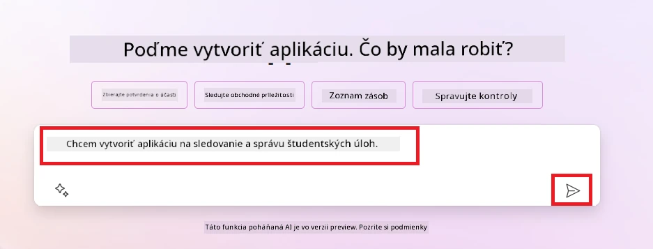

1. AI Copilot navrhne tabuľku Dataverse s poliami, ktoré potrebujete na uloženie údajov, ktoré chcete sledovať, vrátane nejakých vzorových dát. Tabuľku môžete potom prispôsobiť podľa svojich potrieb pomocou asistenta AI Copilot cez konverzačné kroky.

   > **Dôležité**: Dataverse je podkladová dátová platforma pre Power Platform. Je to dátová platforma s nízkym kódom na ukladanie údajov aplikácie. Je to plne spravovaná služba, ktorá bezpečne ukladá dáta v Microsoft Cloud a je poskytovaná v rámci vášho prostredia Power Platform. Obsahuje zabudované schopnosti správy dát, ako klasifikácia, dátová stopa, riadenie prístupu s jemnými oprávneniami a ďalšie. Viac sa o Dataverse môžete dozvedieť [tu](https://learn.microsoft.com/power-apps/maker/data-platform/data-platform-intro?WT.mc_id=academic-109639-somelezediko).

   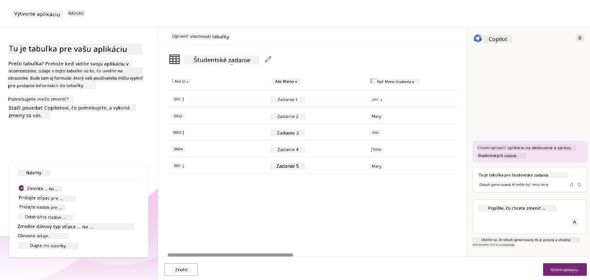

1. Učitelia chcú posielať emaily študentom, ktorí odovzdali úlohy, aby ich informovali o pokroku. Môžete použiť Copilota na pridanie nového poľa do tabuľky na uloženie emailu študenta. Napríklad môžete použiť nasledujúci prompt: **_Chcem pridať stĺpec na uloženie emailu študenta_**. Kliknite na tlačidlo **Odoslať**, aby ste poslali prompt AI Copilotovi.

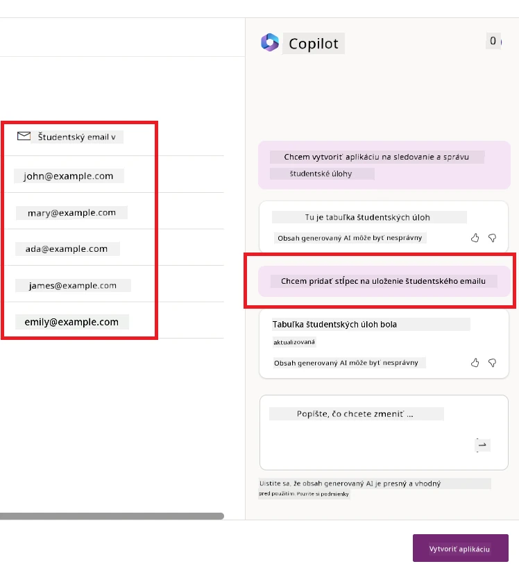

1. AI Copilot vygeneruje nové pole a potom ho môžete prispôsobiť vašim potrebám.

1. Keď dokončíte tabuľku, kliknite na tlačidlo **Vytvoriť aplikáciu** pre vytvorenie aplikácie.

1. AI Copilot vygeneruje responzívnu aplikáciu Canvas na základe vášho popisu. Potom môžete aplikáciu prispôsobiť podľa svojich potrieb.

1. Pre učiteľov, ktorí chcú posielať e-maily študentom, môžete použiť Copilot na pridanie novej obrazovky do aplikácie. Napríklad, môžete použiť nasledujúcu výzvu na pridanie novej obrazovky do aplikácie: **_Chcem pridať obrazovku na odosielanie e-mailov študentom_**. Kliknite na tlačidlo **Odoslať**, aby ste poslali výzvu AI Copilotovi.

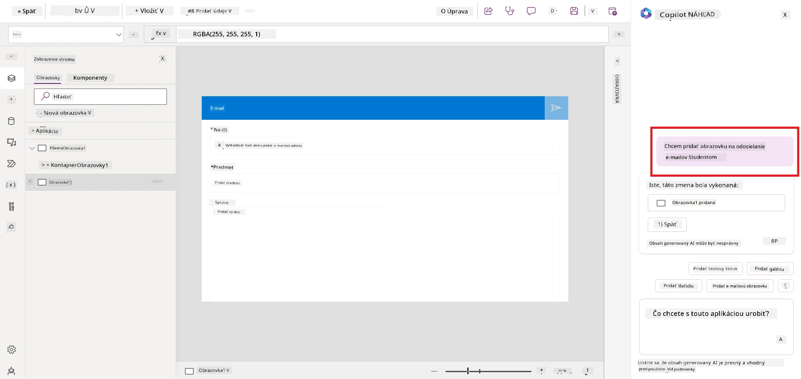

1. AI Copilot vygeneruje novú obrazovku, ktorú si potom môžete prispôsobiť podľa svojich potrieb.

1. Keď aplikáciu dokončíte, kliknite na tlačidlo **Uložiť** na uloženie aplikácie.

1. Pre zdieľanie aplikácie s učiteľmi kliknite na tlačidlo **Zdieľať**, potom znova na tlačidlo **Zdieľať**. Potom môžete aplikáciu zdieľať s učiteľmi zadaním ich e-mailových adries.

> **Vaša úloha**: Aplikácia, ktorú ste práve vytvorili, je dobrým začiatkom, no dá sa vylepšiť. Funkcia e-mailu umožňuje učiteľom posielať e-maily študentom len manuálne, keď musia písať ich e-maily. Môžete použiť Copilot na vytvorenie automatizácie, ktorá umožní učiteľom automaticky odosielať e-maily študentom pri odoslaní ich úloh? Nápoveda: so správnou výzvou môžete použiť Copilot v Power Automate na vytvorenie tohto riešenia.

### Vytvorenie tabuľky informácií o faktúrach pre náš startup

Finančný tím nášho startupu mal problémy so sledovaním faktúr. Používali tabuľku na sledovanie faktúr, ale s rastúcim počtom faktúr sa to stalo ťažko spravovateľné. Požiadali vás, aby ste vytvorili tabuľku, ktorá im pomôže ukladať, sledovať a spravovať informácie o prijatých faktúrach. Tabuľka by sa mala použiť na vytvorenie automatizácie, ktorá vyťaží všetky informácie o faktúrach a uloží ich do tabuľky. Tabuľka by tiež mala umožniť finančnému tímu zobraziť faktúry, ktoré boli zaplatené, a tie, ktoré nezaplatili.

Power Platform obsahuje základnú dátovú platformu nazvanú Dataverse, ktorá umožňuje ukladať dáta pre vaše aplikácie a riešenia. Dataverse poskytuje nízkokódovú dátovú platformu na ukladanie dát aplikácie. Ide o plne spravovanú službu, ktorá bezpečne ukladá dáta v Microsoft Cloude a je poskytovaná v rámci vášho prostredia Power Platform. Disponuje zabudovanými funkciami správy dát, ako je klasifikácia dát, sledovanie pôvodu dát, jemné riadenie prístupu a ďalšie. Viac sa o Dataverse dozviete [tu](https://learn.microsoft.com/power-apps/maker/data-platform/data-platform-intro?WT.mc_id=academic-109639-somelezediko).

Prečo by sme mali použiť Dataverse pre náš startup? Štandardné a vlastné tabuľky v Dataverse poskytujú bezpečné a cloudové úložisko pre vaše dáta. Tabuľky umožňujú ukladať rôzne typy dát, podobne ako by ste použili viac pracovných hárkov v jednom Excelovom zošite. Môžete používať tabuľky na uchovávanie dát špecifických pre vašu organizáciu alebo obchodné potreby. Niektoré výhody, ktoré náš startup z používania Dataverse získa, zahŕňajú, ale nie sú obmedzené na:

- **Jednoduchá správa**: Metadata aj dáta sú uložené v cloude, takže sa nemusíte starať o detaily ich uloženia či správy. Môžete sa sústrediť na tvorbu svojich aplikácií a riešení.

- **Bezpečné**: Dataverse poskytuje bezpečné cloudové úložisko pre vaše dáta. Môžete kontrolovať, kto má prístup k dátam vo vašich tabuľkách a ako k nim môžu pristupovať pomocou riadenia prístupu na základe rolí.

- **Bohaté metadata**: Typy dát a vzťahy sa používajú priamo v Power Apps.

- **Logika a validácia**: Môžete použiť obchodné pravidlá, vypočítané polia a validačné pravidlá na uplatnenie obchodnej logiky a zachovanie presnosti dát.

Teraz, keď viete, čo je Dataverse a prečo ho používať, pozrime sa, ako môžete použiť Copilot na vytvorenie tabuľky v Dataverse, ktorá splní požiadavky finančného tímu.

> **Poznámka** : Túto tabuľku použijete v ďalšej časti pre vytvorenie automatizácie, ktorá vyťaží všetky informácie o faktúrach a uloží ich do tabuľky.

Pre vytvorenie tabuľky v Dataverse pomocou Copilota postupujte podľa nasledujúcich krokov:

1. Prejdite na domovskú obrazovku [Power Apps](https://make.powerapps.com?WT.mc_id=academic-105485-koreyst).

2. V ľavom navigačnom paneli vyberte **Tabuľky**, potom kliknite na **Popísať novú tabuľku**.

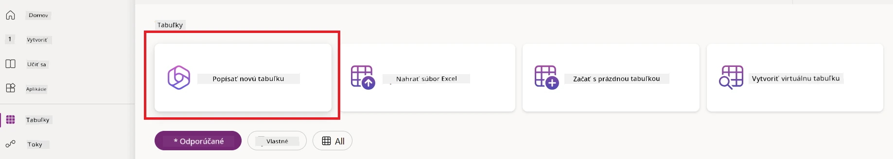

1. Na obrazovke **Popísať novú tabuľku** použite textové pole na popis tabuľky, ktorú chcete vytvoriť. Napríklad, **_Chcem vytvoriť tabuľku na uloženie informácií o faktúrach_**. Kliknite na tlačidlo **Odoslať** a pošlite výzvu AI Copilotovi.

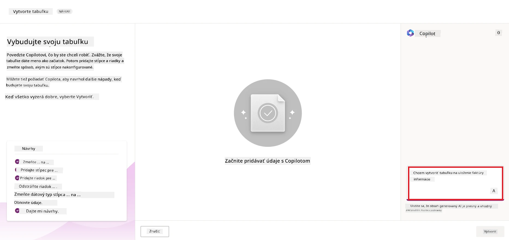

1. AI Copilot navrhne tabuľku Dataverse s políčkami, ktoré potrebujete na uloženie dát, ktoré chcete sledovať, a s ukážkovými dátami. Potom môžete tabuľku prispôsobiť podľa svojich potrieb pomocou asistenta AI Copilota v konverzačných krokoch.

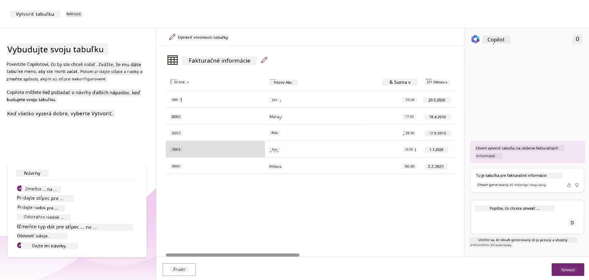

1. Finančný tím chce poslať e-mail dodávateľovi, aby ho informoval o aktuálnom stave ich faktúry. Môžete použiť Copilot na pridanie nového políčka do tabuľky na uloženie e-mailu dodávateľa. Napríklad, použite nasledujúcu výzvu na pridanie nového políčka: **_Chcem pridať stĺpec na uloženie e-mailu dodávateľa_**. Kliknite na tlačidlo **Odoslať**, aby ste poslali výzvu AI Copilotovi.

1. AI Copilot vygeneruje nové políčko, ktoré si potom môžete prispôsobiť podľa svojich potrieb.

1. Keď dokončíte tabuľku, kliknite na tlačidlo **Vytvoriť** pre vytvorenie tabuľky.

## AI modely v Power Platform s AI Builder

AI Builder je nízkokódová AI funkcia dostupná v Power Platform, ktorá vám umožňuje používať AI modely na automatizáciu procesov a predikciu výsledkov. Pomocou AI Builder môžete do svojich aplikácií a tokov, ktoré sa pripájajú k dátam v Dataverse alebo rôznym cloudovým zdrojom dát, ako sú SharePoint, OneDrive alebo Azure, priniesť umelú inteligenciu.

## Predpripravené AI modely vs vlastné AI modely

AI Builder poskytuje dva typy AI modelov: predpripravené a vlastné AI modely. Predpripravené AI modely sú hotové modely vytrénované Microsoftom a dostupné v Power Platform. Pomáhajú vám pridať inteligenciu do vašich aplikácií a tokov bez nutnosti zbierať dáta, potom vytvárať, trénovať a publikovať vlastné modely. Tieto modely môžete použiť na automatizáciu procesov a predikciu výsledkov.

Niektoré z predpripravených AI modelov dostupných v Power Platform zahŕňajú:

- **Extrahovanie kľúčových fráz**: Tento model vyťaží kľúčové frázy z textu.
- **Detekcia jazyka**: Tento model detekuje jazyk textu.
- **Analýza sentimentu**: Tento model detekuje pozitívny, negatívny, neutrálny alebo zmiešaný sentiment v texte.
- **Čítač vizitiek**: Tento model vyťaží informácie z vizitiek.
- **Rozpoznávanie textu**: Tento model vyťaží text z obrázkov.
- **Detekcia objektov**: Tento model detekuje a vyťaží objekty z obrázkov.
- **Spracovanie dokumentov**: Tento model vyťaží informácie z formulárov.
- **Spracovanie faktúr**: Tento model vyťaží informácie z faktúr.

S vlastnými AI modelmi môžete do AI Builder priniesť svoj vlastný model, ktorý bude fungovať ako ktorýkoľvek vlastný AI model v AI Builder, čo vám umožní trénovať model pomocou vlastných dát. Tieto modely môžete použiť na automatizáciu procesov a predikciu výsledkov v Power Apps aj Power Automate. Pri používaní vlastného modelu platia určité obmedzenia. Prečítajte si viac o týchto [obmedzeniach](https://learn.microsoft.com/ai-builder/byo-model#limitations?WT.mc_id=academic-105485-koreyst).

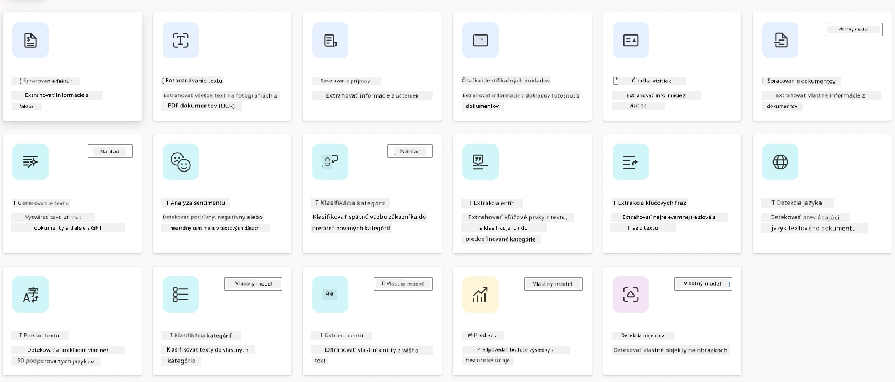

## Úloha č. 2 - Vytvorenie toku spracovania faktúr pre náš startup

Finančný tím mal problémy so spracovaním faktúr. Používali tabuľku na sledovanie faktúr, no s rastúcim množstvom faktúr sa to stalo ťažko spravovateľné. Požiadali vás, aby ste vytvorili pracovný tok, ktorý im pomôže spracovávať faktúry pomocou AI. Tok by mal umožniť vyťažiť informácie z faktúr a uložiť ich do tabuľky Dataverse. Tiež by mal umožniť odosielanie e-mailu finančnému tímu s vyťaženými informáciami.

Teraz, keď viete, čo je AI Builder a prečo ho používať, pozrime sa, ako môžete použiť AI model spracovania faktúr v AI Builder, ktorý sme už spomenuli, na vytvorenie toku, ktorý pomôže finančnému tímu spracovávať faktúry.

Pre vytvorenie pracovného toku, ktorý pomôže finančnému tímu spracovávať faktúry pomocou AI modelu spracovania faktúr v AI Builder, postupujte podľa krokov nižšie:

1. Prejdite na domovskú obrazovku [Power Automate](https://make.powerautomate.com?WT.mc_id=academic-105485-koreyst).

2. Použite textové pole na domovskej obrazovke na popis toku, ktorý chcete vytvoriť. Napríklad, **_Spracovať faktúru, keď príde do mojej poštovej schránky_**. Kliknite na tlačidlo **Odoslať** na odoslanie výzvy AI Copilotovi.

   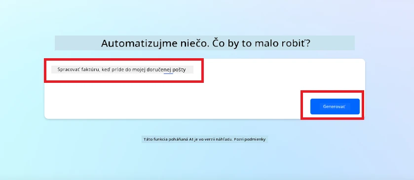

3. AI Copilot navrhne akcie, ktoré musíte vykonať na automatizáciu požadovanej úlohy. Môžete kliknúť na tlačidlo **Ďalej** a prejsť ďalšími krokmi.

4. V ďalšom kroku vás Power Automate vyzve na nastavenie potrebných pripojení pre tok. Keď skončíte, kliknite na tlačidlo **Vytvoriť tok** na vytvorenie toku.

5. AI Copilot vygeneruje tok, ktorý si potom môžete prispôsobiť podľa svojich potrieb.

6. Aktualizujte spúšťač toku a nastavte **Zložku** na zložku, kde budú faktúry ukladané. Napríklad, môžete nastaviť zložku na **Doručená pošta**. Kliknite na **Zobraziť rozšírené možnosti** a nastavte **Len s prílohami** na **Áno**. To zabezpečí, že tok sa spustí len pri prijatí e-mailu s prílohou v danej zložke.

7. Odstráňte z toku nasledujúce akcie: **HTML na text**, **Zložiť**, **Zložiť 2**, **Zložiť 3** a **Zložiť 4**, pretože ich nebudete používať.

8. Odstráňte akciu **Podmienka** z toku, pretože ju nebudete používať. Tok by mal vyzerať podľa nasledujúcej snímky obrazovky:

   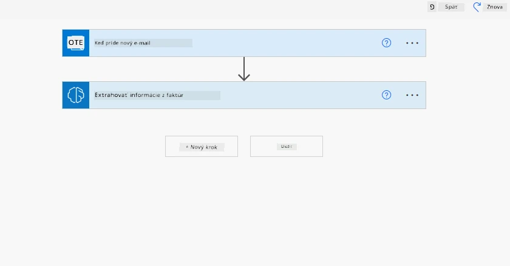

9. Kliknite na tlačidlo **Pridať akciu** a vyhľadajte **Dataverse**. Vyberte akciu **Pridať nový riadok**.

10. V akcii **Vyťažiť informácie z faktúr** aktualizujte parameter **Súbor faktúry** tak, aby odkazoval na **Obsah prílohy** e-mailu. To zabezpečí, že tok vyťaží informácie z prílohy faktúry.

11. Vyberte tabuľku, ktorú ste vytvorili skôr. Napríklad, môžete vybrať tabuľku **Informácie o faktúrach**. Použite dynamický obsah z predchádzajúcej akcie na vyplnenie nasledujúcich polí:

    - ID
    - Suma
    - Dátum
    - Názov
    - Stav - Nastavte **Stav** na **Čakajúce**.
    - E-mail dodávateľa - Použite dynamický obsah **Od** zo spúšťača **Keď príde nový e-mail**.

    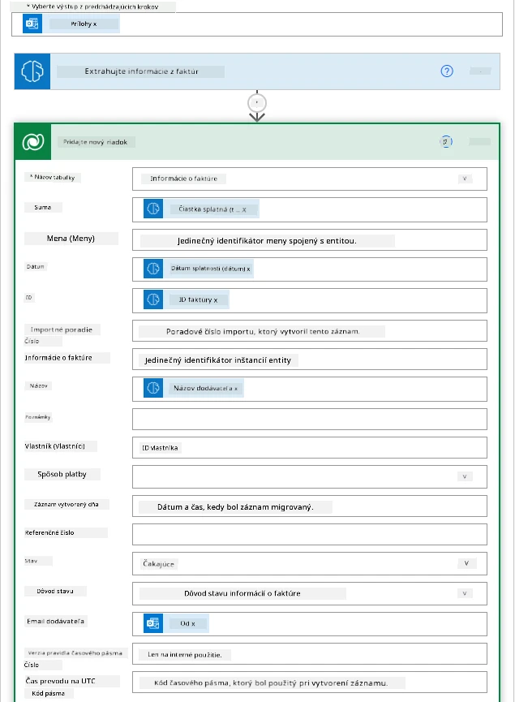

12. Keď skončíte s tokom, kliknite na tlačidlo **Uložiť** na uloženie toku. Tok môžete otestovať odoslaním e-mailu s faktúrou do zložky, ktorú ste zadali v spúšťači.

> **Vaša úloha**: Tok, ktorý ste práve vytvorili, je dobrý začiatok, teraz musíte rozmýšľať, ako vytvoriť automatizáciu, ktorá umožní nášmu finančnému tímu poslať e-mail dodávateľovi s informáciou o aktuálnom stave jeho faktúry. Nápoveda: tok musí bežať, keď sa zmení stav faktúry.

## Použitie AI modelu na generovanie textu v Power Automate

AI model Create Text with GPT v AI Builder vám umožňuje generovať text na základe výzvy a je poháňaný službou Microsoft Azure OpenAI. Vďaka tejto funkcii môžete do svojich aplikácií a tokov začleniť technológiu GPT (Generative Pre-Trained Transformer) na tvorbu rôznych automatizovaných tokov a informatívnych aplikácií.

GPT modely sú rozsiahle trénované na veľkom množstve dát, čo im umožňuje produkovať text, ktorý veľmi pripomína ľudský jazyk pri zadaní výzvy. Po integrácii s automatizáciou pracovných tokov je možné AI modely ako GPT použiť na zjednodušenie a automatizáciu širokej škály úloh.

Napríklad môžete vytvárať toky na automatické generovanie textu pre rôzne použitia, ako sú návrhy e-mailov, popisy produktov a ďalšie. Model môžete tiež použiť na generovanie textu pre rôzne aplikácie, ako sú chatboty a aplikácie zákazníckej podpory, ktoré umožňujú agentom zákazníckej podpory efektívne a účinne odpovedať na dotazy zákazníkov.

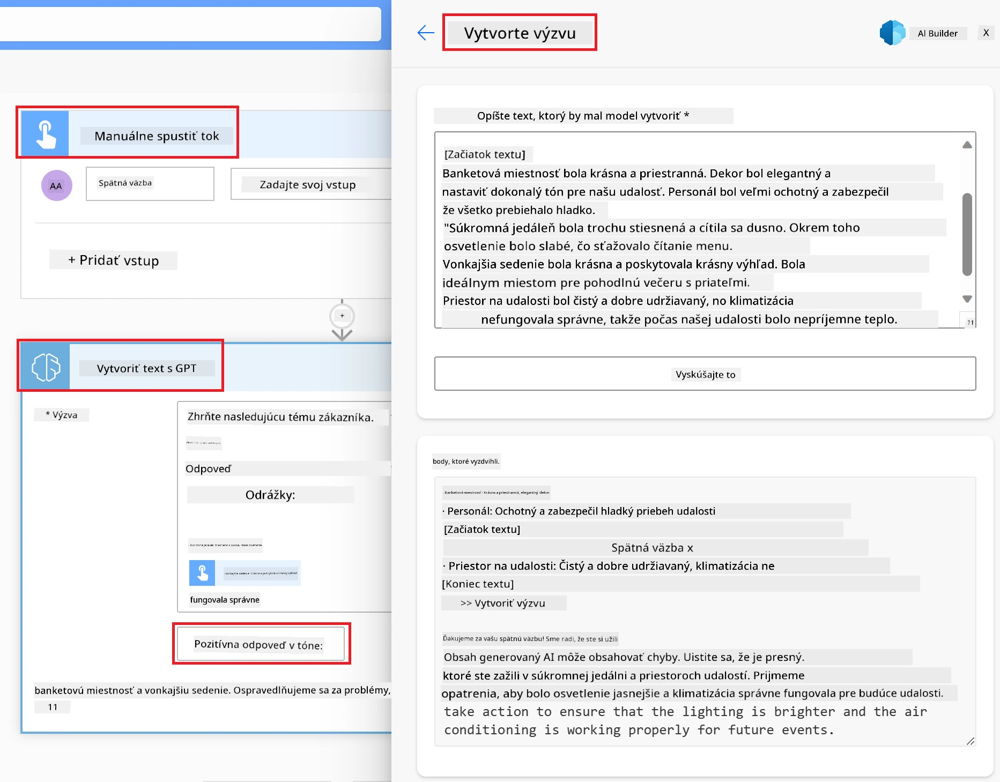

Ak sa chcete naučiť, ako používať tento AI model v Power Automate, prejdite si modul [Pridajte inteligenciu s AI Builder a GPT](https://learn.microsoft.com/training/modules/ai-builder-text-generation/?WT.mc_id=academic-109639-somelezediko).

## Skvelá práca! Pokračujte vo vzdelávaní

Po dokončení tejto lekcie si pozrite našu [kolekciu učenia Generatívnej AI](https://aka.ms/genai-collection?WT.mc_id=academic-105485-koreyst), aby ste si mohli naďalej zvyšovať vedomosti o Generatívnej AI!

Chcete si prispôsobiť a vyťažiť viac z Copilota? Preskúmajte [Úžasný Copilot](https://github.com/github/awesome-copilot?WT.mc_id=academic-105485-koreyst) — komunitou prispievaná kolekcia inštrukcií, agentov, zručností a konfigurácií, ktoré vám pomôžu čo najlepšie využiť GitHub Copilot.

Prejdite na lekciu 11, kde sa pozrieme, ako [integrovať Generatívnu AI s volaním funkcií](../11-integrating-with-function-calling/README.md?WT.mc_id=academic-105485-koreyst)!

---

<!-- CO-OP TRANSLATOR DISCLAIMER START -->
**Vyhlásenie o zodpovednosti**:
Tento dokument bol preložený pomocou AI prekladateľskej služby [Co-op Translator](https://github.com/Azure/co-op-translator). Hoci sa snažíme o presnosť, vezmite prosím na vedomie, že automatické preklady môžu obsahovať chyby alebo nepresnosti. Pôvodný dokument v jeho natívnom jazyku by mal byť považovaný za autoritatívny zdroj. Pre kritické informácie sa odporúča profesionálny ľudský preklad. Nie sme zodpovední za žiadne nedorozumenia alebo nesprávne interpretácie vyplývajúce z použitia tohto prekladu.
<!-- CO-OP TRANSLATOR DISCLAIMER END -->