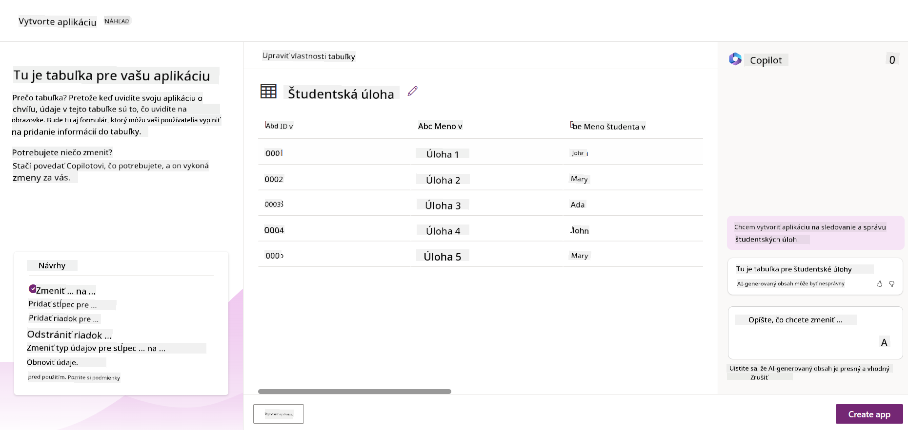
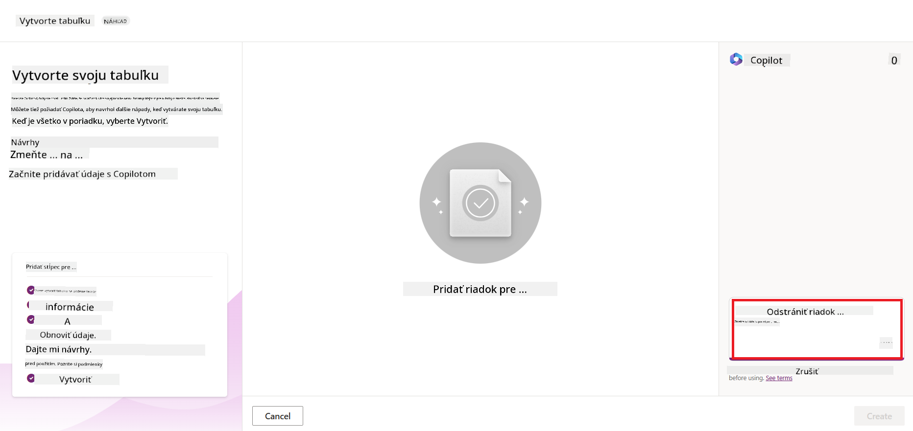
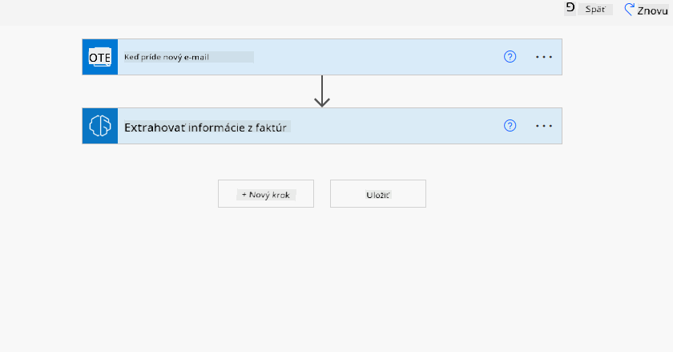

<!--
CO_OP_TRANSLATOR_METADATA:
{
  "original_hash": "846ac8e3b7dcfb697d3309fec05f0fea",
  "translation_date": "2025-10-17T21:57:29+00:00",
  "source_file": "10-building-low-code-ai-applications/README.md",
  "language_code": "sk"
}
-->
# Vytváranie AI aplikácií s nízkym kódom

> _(Kliknite na obrázok vyššie, aby ste si pozreli video k tejto lekcii)_

## Úvod

Teraz, keď sme sa naučili, ako vytvárať aplikácie na generovanie obrázkov, poďme sa porozprávať o nízkom kóde. Generatívna AI môže byť použitá v rôznych oblastiach vrátane nízkeho kódu, ale čo je to nízky kód a ako do neho môžeme pridať AI?

Vytváranie aplikácií a riešení sa stalo jednoduchším pre tradičných vývojárov aj neprogramátorov vďaka platformám na vývoj s nízkym kódom. Platformy na vývoj s nízkym kódom umožňujú vytvárať aplikácie a riešenia s minimálnym alebo žiadnym kódom. To sa dosahuje poskytovaním vizuálneho vývojového prostredia, ktoré umožňuje ťahať a púšťať komponenty na vytváranie aplikácií a riešení. To umožňuje rýchlejšie a efektívnejšie vytváranie aplikácií a riešení. V tejto lekcii sa podrobne pozrieme na to, ako používať nízky kód a ako zlepšiť vývoj s nízkym kódom pomocou AI v Power Platform.

Power Platform poskytuje organizáciám možnosť posilniť svoje tímy, aby si mohli vytvárať vlastné riešenia prostredníctvom intuitívneho prostredia s nízkym alebo žiadnym kódom. Toto prostredie pomáha zjednodušiť proces vytvárania riešení. S Power Platform je možné vytvárať riešenia v priebehu dní alebo týždňov namiesto mesiacov či rokov. Power Platform pozostáva z piatich kľúčových produktov: Power Apps, Power Automate, Power BI, Power Pages a Copilot Studio.

Táto lekcia pokrýva:

- Úvod do generatívnej AI v Power Platform
- Úvod do Copilot a jeho použitia
- Použitie generatívnej AI na vytváranie aplikácií a tokov v Power Platform
- Pochopenie AI modelov v Power Platform s AI Builder

## Ciele učenia

Na konci tejto lekcie budete schopní:

- Pochopiť, ako funguje Copilot v Power Platform.

- Vytvoriť aplikáciu na sledovanie študentských úloh pre náš vzdelávací startup.

- Vytvoriť tok na spracovanie faktúr, ktorý používa AI na extrahovanie informácií z faktúr.

- Použiť najlepšie postupy pri používaní modelu Create Text s GPT AI.

Nástroje a technológie, ktoré budete v tejto lekcii používať, sú:

- **Power Apps**, na aplikáciu na sledovanie študentských úloh, ktorá poskytuje prostredie s nízkym kódom na vytváranie aplikácií na sledovanie, správu a interakciu s dátami.

- **Dataverse**, na ukladanie dát pre aplikáciu na sledovanie študentských úloh, kde Dataverse poskytne platformu s nízkym kódom na ukladanie dát aplikácie.

- **Power Automate**, na tok spracovania faktúr, kde budete mať prostredie s nízkym kódom na vytváranie pracovných tokov na automatizáciu procesu spracovania faktúr.

- **AI Builder**, na AI model spracovania faktúr, kde použijete predpripravené AI modely na spracovanie faktúr pre náš startup.

## Generatívna AI v Power Platform

Zlepšenie vývoja a aplikácií s nízkym kódom pomocou generatívnej AI je kľúčovou oblasťou záujmu Power Platform. Cieľom je umožniť každému vytvárať aplikácie, weby, dashboardy a automatizovať procesy s AI, _bez potreby odborných znalostí v oblasti dátovej vedy_. Tento cieľ sa dosahuje integráciou generatívnej AI do vývojového prostredia s nízkym kódom v Power Platform vo forme Copilot a AI Builder.

### Ako to funguje?

Copilot je AI asistent, ktorý vám umožňuje vytvárať riešenia v Power Platform tým, že popíšete svoje požiadavky v sérii konverzačných krokov pomocou prirodzeného jazyka. Môžete napríklad inštruovať svojho AI asistenta, aby uviedol, aké polia bude vaša aplikácia používať, a on vytvorí aplikáciu aj podkladový dátový model, alebo môžete špecifikovať, ako nastaviť tok v Power Automate.

Funkcie riadené Copilotom môžete použiť ako funkciu vo svojich obrazovkách aplikácie, aby ste umožnili používateľom odhaliť poznatky prostredníctvom konverzačných interakcií.

AI Builder je schopnosť AI s nízkym kódom dostupná v Power Platform, ktorá vám umožňuje používať AI modely na automatizáciu procesov a predpovedanie výsledkov. S AI Builder môžete priniesť AI do svojich aplikácií a tokov, ktoré sa pripájajú k vašim dátam v Dataverse alebo v rôznych cloudových dátových zdrojoch, ako sú SharePoint, OneDrive alebo Azure.

Copilot je dostupný vo všetkých produktoch Power Platform: Power Apps, Power Automate, Power BI, Power Pages a Power Virtual Agents. AI Builder je dostupný v Power Apps a Power Automate. V tejto lekcii sa zameriame na to, ako používať Copilot a AI Builder v Power Apps a Power Automate na vytvorenie riešenia pre náš vzdelávací startup.

### Copilot v Power Apps

Ako súčasť Power Platform poskytuje Power Apps prostredie s nízkym kódom na vytváranie aplikácií na sledovanie, správu a interakciu s dátami. Je to súbor služieb na vývoj aplikácií s rozšíriteľnou dátovou platformou a schopnosťou pripojiť sa k cloudovým službám a dátam na mieste. Power Apps umožňuje vytvárať aplikácie, ktoré fungujú v prehliadačoch, tabletoch a telefónoch, a môžu byť zdieľané s kolegami. Power Apps uľahčuje používateľom vývoj aplikácií prostredníctvom jednoduchého rozhrania, takže každý obchodný používateľ alebo profesionálny vývojár môže vytvárať vlastné aplikácie. Skúsenosť s vývojom aplikácií je tiež zlepšená generatívnou AI prostredníctvom Copilot.

Funkcia AI asistenta Copilot v Power Apps vám umožňuje popísať, aký typ aplikácie potrebujete a aké informácie chcete, aby vaša aplikácia sledovala, zhromažďovala alebo zobrazovala. Copilot potom na základe vášho popisu vygeneruje responzívnu Canvas aplikáciu. Následne môžete aplikáciu prispôsobiť podľa svojich potrieb. AI Copilot tiež generuje a navrhuje Dataverse tabuľku s poliami, ktoré potrebujete na ukladanie dát, ktoré chcete sledovať, a niektoré vzorové dáta. Neskôr v tejto lekcii sa pozrieme na to, čo je Dataverse a ako ho môžete používať v Power Apps. Tabuľku môžete potom prispôsobiť podľa svojich potrieb pomocou funkcie AI Copilot asistenta prostredníctvom konverzačných krokov. Táto funkcia je dostupná priamo z domovskej obrazovky Power Apps.

### Copilot v Power Automate

Ako súčasť Power Platform umožňuje Power Automate používateľom vytvárať automatizované pracovné toky medzi aplikáciami a službami. Pomáha automatizovať opakujúce sa obchodné procesy, ako sú komunikácia, zhromažďovanie dát a schvaľovanie rozhodnutí. Jeho jednoduché rozhranie umožňuje používateľom s rôznou technickou kompetenciou (od začiatočníkov po skúsených vývojárov) automatizovať pracovné úlohy. Skúsenosť s vývojom pracovných tokov je tiež zlepšená generatívnou AI prostredníctvom Copilot.

Funkcia AI asistenta Copilot v Power Automate vám umožňuje popísať, aký typ toku potrebujete a aké akcie chcete, aby váš tok vykonával. Copilot potom na základe vášho popisu vygeneruje tok. Následne môžete tok prispôsobiť podľa svojich potrieb. AI Copilot tiež generuje a navrhuje akcie, ktoré potrebujete na vykonanie úlohy, ktorú chcete automatizovať. Neskôr v tejto lekcii sa pozrieme na to, čo sú toky a ako ich môžete používať v Power Automate. Akcie môžete potom prispôsobiť podľa svojich potrieb pomocou funkcie AI Copilot asistenta prostredníctvom konverzačných krokov. Táto funkcia je dostupná priamo z domovskej obrazovky Power Automate.

## Úloha: Správa študentských úloh a faktúr pre náš startup pomocou Copilot

Náš startup poskytuje online kurzy študentom. Startup rýchlo rastie a teraz má problémy s uspokojením dopytu po svojich kurzoch. Startup vás najal ako vývojára Power Platform, aby ste im pomohli vytvoriť riešenie s nízkym kódom na správu študentských úloh a faktúr. Riešenie by malo umožniť sledovať a spravovať študentské úlohy prostredníctvom aplikácie a automatizovať proces spracovania faktúr prostredníctvom pracovného toku. Boli ste požiadaní, aby ste na vývoj riešenia použili generatívnu AI.

Keď začínate používať Copilot, môžete použiť [Power Platform Copilot Prompt Library](https://github.com/pnp/powerplatform-prompts?WT.mc_id=academic-109639-somelezediko), aby ste začali s promptami. Táto knižnica obsahuje zoznam promptov, ktoré môžete použiť na vytváranie aplikácií a tokov pomocou Copilot. Môžete tiež použiť prompty v knižnici, aby ste získali predstavu o tom, ako popísať svoje požiadavky Copilotovi.

### Vytvorenie aplikácie na sledovanie študentských úloh pre náš startup

Učitelia v našom startupe majú problémy so sledovaním študentských úloh. Používali tabuľku na sledovanie úloh, ale to sa stalo ťažko zvládnuteľné, keď sa zvýšil počet študentov. Požiadali vás, aby ste vytvorili aplikáciu, ktorá im pomôže sledovať a spravovať študentské úlohy. Aplikácia by im mala umožniť pridávať nové úlohy, prezerať úlohy, aktualizovať úlohy a mazať úlohy. Aplikácia by tiež mala umožniť učiteľom a študentom prezerať úlohy, ktoré boli ohodnotené, a tie, ktoré ešte neboli ohodnotené.

Aplikáciu vytvoríte pomocou Copilot v Power Apps podľa nasledujúcich krokov:

1. Prejdite na domovskú obrazovku [Power Apps](https://make.powerapps.com?WT.mc_id=academic-105485-koreyst).

1. Použite textové pole na domovskej obrazovke na popísanie aplikácie, ktorú chcete vytvoriť. Napríklad: **_Chcem vytvoriť aplikáciu na sledovanie a správu študentských úloh_**. Kliknite na tlačidlo **Send**, aby ste odoslali prompt AI Copilotovi.

1. AI Copilot navrhne Dataverse tabuľku s poliami, ktoré potrebujete na ukladanie dát, ktoré chcete sledovať, a niektoré vzorové dáta. Tabuľku môžete potom prispôsobiť podľa svojich potrieb pomocou funkcie AI Copilot asistenta prostredníctvom konverzačných krokov.

   > **Dôležité**: Dataverse je podkladová dátová platforma pre Power Platform. Je to platforma s nízkym kódom na ukladanie dát aplikácie. Je to plne spravovaná služba, ktorá bezpečne ukladá dáta v Microsoft Cloud a je poskytovaná v rámci vášho prostredia Power Platform. Má zabudované schopnosti správy dát, ako je klasifikácia dát, sledovanie pôvodu dát, jemne odstupňovaná kontrola prístupu a ďalšie. Viac o Dataverse sa môžete dozvedieť [tu](https://docs.microsoft.com/powerapps/maker/data-platform/data-platform-intro?WT.mc_id=academic-109639-somelezediko).

   

1. Učitelia chcú posielať e-maily študentom, ktorí odovzdali svoje úlohy, aby ich informovali o pokroku ich úloh. Môžete použiť Copilot na pridanie nového poľa do tabuľky na ukladanie e-mailu študenta. Napríklad môžete použiť nasledujúci prompt na pridanie nového poľa do tabuľky: **_Chcem pridať stĺpec na ukladanie e-mailu študenta_**. Kliknite na tlačidlo **Send**, aby ste odoslali prompt AI Copilotovi.

1. AI Copilot vygeneruje nové pole a môžete ho potom prispôsobiť podľa svojich potrieb.

1. Keď budete hotoví s tabuľkou, kliknite na tlačidlo **Create app**, aby ste vytvorili aplikáciu.

1. AI Copilot vygeneruje responzívnu Canvas aplikáciu na základe vášho popisu. Aplikáciu môžete potom prispôsobiť podľa svojich potrieb.

1. Aby učitelia mohli posielať e-maily študentom, môžete použiť Copilot na pridanie novej obrazovky do aplikácie. Napríklad môžete použiť nasledujúci prompt na pridanie novej obrazovky do aplikácie: **_Chcem pridať obrazovku na posielanie e-mailov študentom_**. Kliknite na tlačidlo **Send**, aby ste odoslali prompt AI Copilotovi.

1. AI Copilot vygeneruje novú obrazovku a môžete ju potom prispôsobiť podľa svojich potrieb.

1. Keď budete hotoví s aplikáciou, kliknite na tlačidlo **Save**, aby ste aplikáciu uložili.

1. Ak chcete aplikáciu zdieľať s učiteľmi, kliknite na tlačidlo **Share** a potom znova kliknite na tlačidlo **Share**. Aplikáciu môžete potom zdieľať s učiteľmi zadaním ich e-mailových adries.

> **Vaša domáca úloha**: Aplikácia, ktorú ste práve vytvorili, je dobrý začiatok, ale môže byť vylepšená. S funkciou e-mailu môžu učitelia posielať e-maily študentom iba manuálne tým, že musia zadávať ich e-maily. Môžete použiť Copilot na vytvorenie automatizácie, ktorá umožní učiteľom posielať e-maily študentom automaticky, keď odovzdajú svoje úlohy? Vaša nápoveda je, že s vhodným promptom môžete použiť Copilot v Power Automate na vytvorenie tohto.

### Vytvorenie tabuľky informácií o faktúrach pre náš startup

Finančný tím nášho startupu má problémy so sledovaním faktúr. Používali tabuľku na sledovanie faktúr, ale to sa stalo ťažko zvládnuteľné, keď sa zvýšil počet faktúr. Požiadali vás, aby ste vytvorili tabuľku, ktorá im pomôže ukladať, sledovať a spravovať informácie o prijatých faktúrach. Tabuľka by mala byť použitá na vytvorenie automatizácie, ktorá extrahuje všetky informácie o faktúrach a uloží ich do tabuľky. Tabuľka by tiež mala umožniť finančnému tímu prezerať faktúry, ktoré boli zaplatené, a tie, ktoré neboli zaplatené.

Power Platform má podkladovú dátovú platformu nazývanú Dataverse, ktorá vám umožňuje ukladať dáta pre vaše aplikácie a riešenia. Dataverse poskytuje platformu s nízkym kódom na ukladanie dát aplikácie. Je to plne spravovaná služba, ktorá bezpečne ukladá dáta v Microsoft Cloud a je poskytovaná v rámci
Prečo by sme mali používať Dataverse pre náš startup? Štandardné a vlastné tabuľky v Dataverse poskytujú bezpečné a cloudové úložisko pre vaše dáta. Tabuľky vám umožňujú ukladať rôzne typy dát, podobne ako by ste používali viacero pracovných hárkov v jednom Excelovom súbore. Tabuľky môžete použiť na ukladanie dát, ktoré sú špecifické pre potreby vašej organizácie alebo podnikania. Niektoré z výhod, ktoré náš startup získa používaním Dataverse, zahŕňajú, ale nie sú obmedzené na:

- **Jednoduchá správa**: Metadáta aj dáta sú uložené v cloude, takže sa nemusíte starať o detaily, ako sú uložené alebo spravované. Môžete sa sústrediť na vytváranie aplikácií a riešení.

- **Bezpečnosť**: Dataverse poskytuje bezpečné a cloudové úložisko pre vaše dáta. Môžete kontrolovať, kto má prístup k dátam vo vašich tabuľkách a ako k nim môže pristupovať pomocou bezpečnosti založenej na rolách.

- **Bohaté metadáta**: Typy dát a vzťahy sa používajú priamo v Power Apps.

- **Logika a validácia**: Môžete používať obchodné pravidlá, vypočítané polia a validačné pravidlá na presadzovanie obchodnej logiky a udržiavanie presnosti dát.

Teraz, keď viete, čo je Dataverse a prečo by ste ho mali používať, pozrime sa, ako môžete použiť Copilot na vytvorenie tabuľky v Dataverse, ktorá splní požiadavky nášho finančného tímu.

> **Note**: Túto tabuľku použijete v ďalšej časti na vytvorenie automatizácie, ktorá extrahuje všetky informácie o faktúrach a uloží ich do tabuľky.

Na vytvorenie tabuľky v Dataverse pomocou Copilot postupujte podľa nasledujúcich krokov:

1. Prejdite na domovskú obrazovku [Power Apps](https://make.powerapps.com?WT.mc_id=academic-105485-koreyst).

2. Na navigačnom paneli vľavo vyberte **Tables** a potom kliknite na **Describe the new Table**.

3. Na obrazovke **Describe the new Table** použite textové pole na opísanie tabuľky, ktorú chcete vytvoriť. Napríklad: **_Chcem vytvoriť tabuľku na ukladanie informácií o faktúrach_**. Kliknite na tlačidlo **Send**, aby ste odoslali požiadavku AI Copilotovi.

4. AI Copilot navrhne tabuľku Dataverse s poliami, ktoré potrebujete na ukladanie dát, ktoré chcete sledovať, a niektorými vzorovými dátami. Potom môžete tabuľku prispôsobiť podľa svojich potrieb pomocou asistenta AI Copilot prostredníctvom konverzačných krokov.

5. Finančný tím chce poslať e-mail dodávateľovi, aby ho informoval o aktuálnom stave jeho faktúry. Môžete použiť Copilot na pridanie nového poľa do tabuľky na uloženie e-mailu dodávateľa. Napríklad môžete použiť nasledujúcu požiadavku na pridanie nového poľa do tabuľky: **_Chcem pridať stĺpec na uloženie e-mailu dodávateľa_**. Kliknite na tlačidlo **Send**, aby ste odoslali požiadavku AI Copilotovi.

6. AI Copilot vygeneruje nové pole a potom ho môžete prispôsobiť podľa svojich potrieb.

7. Keď budete s tabuľkou hotoví, kliknite na tlačidlo **Create**, aby ste tabuľku vytvorili.

## AI modely v Power Platform s AI Builder

AI Builder je nízkokódová AI schopnosť dostupná v Power Platform, ktorá vám umožňuje používať AI modely na automatizáciu procesov a predpovedanie výsledkov. S AI Builder môžete priniesť AI do svojich aplikácií a tokov, ktoré sa pripájajú k vašim dátam v Dataverse alebo v rôznych cloudových dátových zdrojoch, ako sú SharePoint, OneDrive alebo Azure.

## Predpripravené AI modely vs Vlastné AI modely

AI Builder poskytuje dva typy AI modelov: Predpripravené AI modely a Vlastné AI modely. Predpripravené AI modely sú pripravené na použitie a sú trénované spoločnosťou Microsoft, dostupné v Power Platform. Pomáhajú vám pridať inteligenciu do vašich aplikácií a tokov bez potreby zhromažďovania dát a následného vytvárania, trénovania a publikovania vlastných modelov. Tieto modely môžete použiť na automatizáciu procesov a predpovedanie výsledkov.

Niektoré z predpripravených AI modelov dostupných v Power Platform zahŕňajú:

- **Extrahovanie kľúčových fráz**: Tento model extrahuje kľúčové frázy z textu.
- **Detekcia jazyka**: Tento model detekuje jazyk textu.
- **Analýza sentimentu**: Tento model detekuje pozitívny, negatívny, neutrálny alebo zmiešaný sentiment v texte.
- **Čítačka vizitiek**: Tento model extrahuje informácie z vizitiek.
- **Rozpoznávanie textu**: Tento model extrahuje text z obrázkov.
- **Detekcia objektov**: Tento model detekuje a extrahuje objekty z obrázkov.
- **Spracovanie dokumentov**: Tento model extrahuje informácie z formulárov.
- **Spracovanie faktúr**: Tento model extrahuje informácie z faktúr.

S vlastnými AI modelmi môžete priniesť svoj vlastný model do AI Builder, aby mohol fungovať ako akýkoľvek vlastný model AI Builder, čo vám umožní trénovať model pomocou vlastných dát. Tieto modely môžete použiť na automatizáciu procesov a predpovedanie výsledkov v Power Apps aj Power Automate. Pri používaní vlastného modelu platia určité obmedzenia. Viac o týchto [obmedzeniach](https://learn.microsoft.com/ai-builder/byo-model#limitations?WT.mc_id=academic-105485-koreyst).

## Úloha č. 2 - Vytvorte tok na spracovanie faktúr pre náš startup

Finančný tím má problémy so spracovaním faktúr. Používali tabuľku na sledovanie faktúr, ale to sa stalo ťažko zvládnuteľné, keď sa počet faktúr zvýšil. Požiadali vás, aby ste vytvorili pracovný tok, ktorý im pomôže spracovať faktúry pomocou AI. Tok by mal umožniť extrahovanie informácií z faktúr a ich uloženie do tabuľky Dataverse. Tok by mal tiež umožniť odoslanie e-mailu finančnému tímu s extrahovanými informáciami.

Teraz, keď viete, čo je AI Builder a prečo by ste ho mali používať, pozrime sa, ako môžete použiť AI model na spracovanie faktúr v AI Builder, ktorý sme spomenuli skôr, na vytvorenie pracovného toku, ktorý pomôže finančnému tímu spracovať faktúry.

Na vytvorenie pracovného toku, ktorý pomôže finančnému tímu spracovať faktúry pomocou AI modelu na spracovanie faktúr v AI Builder, postupujte podľa nasledujúcich krokov:

1. Prejdite na domovskú obrazovku [Power Automate](https://make.powerautomate.com?WT.mc_id=academic-105485-koreyst).

2. Použite textové pole na domovskej obrazovke na opísanie pracovného toku, ktorý chcete vytvoriť. Napríklad: **_Spracovať faktúru, keď dorazí do mojej schránky_**. Kliknite na tlačidlo **Send**, aby ste odoslali požiadavku AI Copilotovi.

   

3. AI Copilot navrhne akcie, ktoré potrebujete na vykonanie úlohy, ktorú chcete automatizovať. Môžete kliknúť na tlačidlo **Next**, aby ste prešli na ďalšie kroky.

4. V ďalšom kroku vás Power Automate vyzve na nastavenie pripojení potrebných pre tok. Keď budete hotoví, kliknite na tlačidlo **Create flow**, aby ste tok vytvorili.

5. AI Copilot vygeneruje tok a potom ho môžete prispôsobiť podľa svojich potrieb.

6. Aktualizujte spúšťač toku a nastavte **Folder** na priečinok, kde budú faktúry uložené. Napríklad môžete nastaviť priečinok na **Inbox**. Kliknite na **Show advanced options** a nastavte **Only with Attachments** na **Yes**. Tým sa zabezpečí, že tok sa spustí iba vtedy, keď do priečinka dorazí e-mail s prílohou.

7. Odstráňte nasledujúce akcie z toku: **HTML to text**, **Compose**, **Compose 2**, **Compose 3** a **Compose 4**, pretože ich nebudete používať.

8. Odstráňte akciu **Condition** z toku, pretože ju nebudete používať. Tok by mal vyzerať ako na nasledujúcom obrázku:

   

9. Kliknite na tlačidlo **Add an action** a vyhľadajte **Dataverse**. Vyberte akciu **Add a new row**.

10. Na akcii **Extract Information from invoices** aktualizujte **Invoice File**, aby ukazoval na **Attachment Content** z e-mailu. Tým sa zabezpečí, že tok extrahuje informácie z prílohy faktúry.

11. Vyberte **Table**, ktorú ste vytvorili skôr. Napríklad môžete vybrať tabuľku **Invoice Information**. Vyberte dynamický obsah z predchádzajúcej akcie na vyplnenie nasledujúcich polí:

    - ID
    - Amount
    - Date
    - Name
    - Status - Nastavte **Status** na **Pending**.
    - Supplier Email - Použite dynamický obsah **From** zo spúšťača **When a new email arrives**.

    

12. Keď budete hotoví s tokom, kliknite na tlačidlo **Save**, aby ste tok uložili. Potom môžete tok otestovať odoslaním e-mailu s faktúrou do priečinka, ktorý ste špecifikovali v spúšťači.

> **Vaša domáca úloha**: Tok, ktorý ste práve vytvorili, je dobrý začiatok, teraz musíte premýšľať o tom, ako môžete vytvoriť automatizáciu, ktorá umožní nášmu finančnému tímu odoslať e-mail dodávateľovi, aby ho informoval o aktuálnom stave jeho faktúry. Vaša nápoveda: tok sa musí spustiť, keď sa zmení stav faktúry.

## Použitie AI modelu na generovanie textu v Power Automate

AI model Create Text with GPT v AI Builder umožňuje generovať text na základe požiadavky a je poháňaný službou Microsoft Azure OpenAI. S touto schopnosťou môžete integrovať technológiu GPT (Generative Pre-Trained Transformer) do svojich aplikácií a tokov na vytváranie rôznych automatizovaných tokov a aplikácií s užitočnými informáciami.

GPT modely prechádzajú rozsiahlym tréningom na obrovskom množstve dát, čo im umožňuje produkovať text, ktorý sa veľmi podobá ľudskému jazyku, keď im poskytnete požiadavku. Keď sa integrujú s automatizáciou pracovných tokov, AI modely ako GPT môžu byť využité na zjednodušenie a automatizáciu širokej škály úloh.

Napríklad môžete vytvárať toky na automatické generovanie textu pre rôzne účely, ako sú: návrhy e-mailov, popisy produktov a ďalšie. Model môžete tiež použiť na generovanie textu pre rôzne aplikácie, ako sú chatboty a aplikácie zákazníckeho servisu, ktoré umožňujú agentom zákazníckeho servisu efektívne a účinne reagovať na otázky zákazníkov.

Ak sa chcete naučiť, ako používať tento AI model v Power Automate, prejdite cez modul [Add intelligence with AI Builder and GPT](https://learn.microsoft.com/training/modules/ai-builder-text-generation/?WT.mc_id=academic-109639-somelezediko).

## Skvelá práca! Pokračujte vo svojom vzdelávaní

Po dokončení tejto lekcie si pozrite našu [Generative AI Learning collection](https://aka.ms/genai-collection?WT.mc_id=academic-105485-koreyst), aby ste si naďalej rozširovali svoje vedomosti o generatívnej AI!

Prejdite na lekciu 11, kde sa pozrieme na to, ako [integrovať generatívnu AI s volaním funkcií](../11-integrating-with-function-calling/README.md?WT.mc_id=academic-105485-koreyst)!

---

**Zrieknutie sa zodpovednosti**:  
Tento dokument bol preložený pomocou služby AI prekladu [Co-op Translator](https://github.com/Azure/co-op-translator). Hoci sa snažíme o presnosť, prosím, berte na vedomie, že automatizované preklady môžu obsahovať chyby alebo nepresnosti. Pôvodný dokument v jeho rodnom jazyku by mal byť považovaný za autoritatívny zdroj. Pre kritické informácie sa odporúča profesionálny ľudský preklad. Nenesieme zodpovednosť za akékoľvek nedorozumenia alebo nesprávne interpretácie vyplývajúce z použitia tohto prekladu.