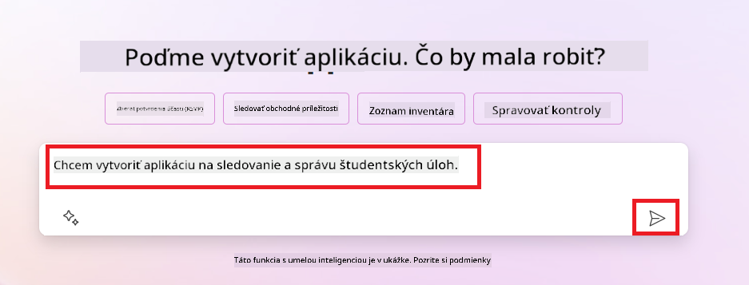
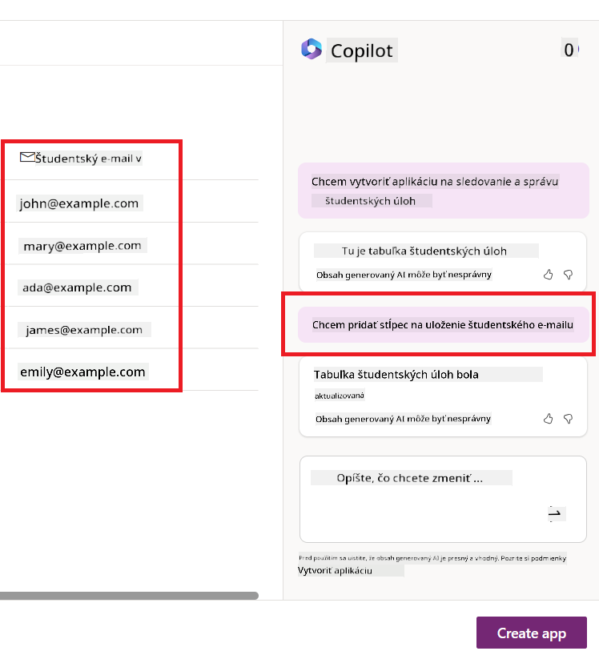
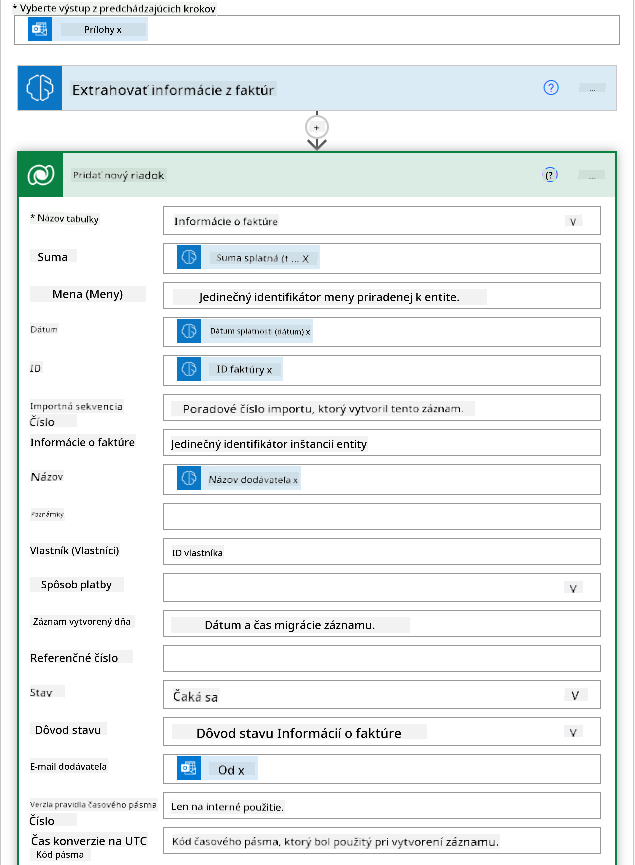
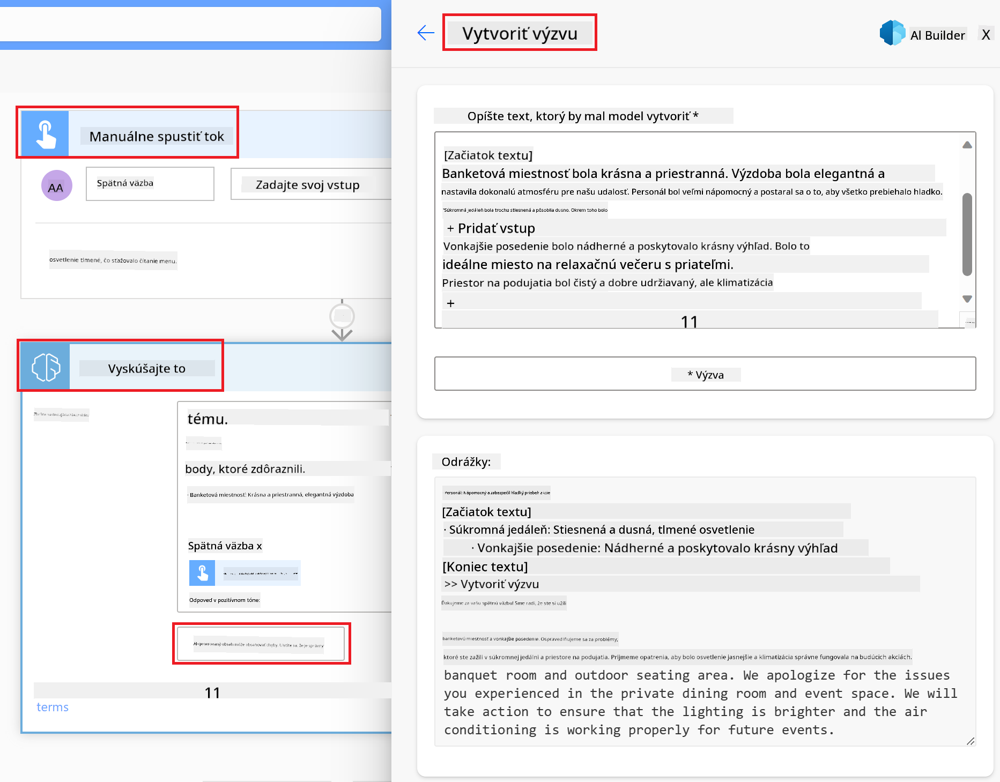

<!--
CO_OP_TRANSLATOR_METADATA:
{
  "original_hash": "f5ff3b6204a695a117d6f452403c95f7",
  "translation_date": "2025-07-09T14:12:30+00:00",
  "source_file": "10-building-low-code-ai-applications/README.md",
  "language_code": "sk"
}
-->
# Tvorba Low Code AI aplikácií

> _(Kliknite na obrázok vyššie pre zobrazenie videa k tejto lekcii)_

## Úvod

Keď sme sa už naučili, ako vytvárať aplikácie na generovanie obrázkov, poďme sa porozprávať o low code. Generatívna AI môže byť využitá v rôznych oblastiach vrátane low code, ale čo vlastne low code znamená a ako do neho môžeme pridať AI?

Tvorba aplikácií a riešení sa stala jednoduchšou pre tradičných vývojárov aj neprogramátorov vďaka Low Code Development Platformám. Low Code Development Platformy umožňujú vytvárať aplikácie a riešenia s minimálnym alebo žiadnym kódom. Dosahuje sa to poskytovaním vizuálneho vývojového prostredia, kde môžete jednoducho presúvať komponenty a tak vytvárať aplikácie a riešenia. To umožňuje rýchlejšiu tvorbu aplikácií s menšími nákladmi. V tejto lekcii sa podrobne pozrieme na to, ako používať Low Code a ako ho vylepšiť pomocou AI s využitím Power Platform.

Power Platform poskytuje organizáciám možnosť posilniť ich tímy, aby si mohli sami vytvárať riešenia v intuitívnom low-code alebo no-code prostredí. Toto prostredie zjednodušuje proces tvorby riešení. S Power Platform je možné riešenia vytvoriť za dni alebo týždne namiesto mesiacov či rokov. Power Platform pozostáva z piatich hlavných produktov: Power Apps, Power Automate, Power BI, Power Pages a Copilot Studio.

Táto lekcia zahŕňa:

- Úvod do Generatívnej AI v Power Platform
- Úvod do Copilota a jeho použitia
- Použitie Generatívnej AI na tvorbu aplikácií a tokov v Power Platform
- Pochopenie AI modelov v Power Platform s AI Builder

## Ciele učenia

Na konci tejto lekcie budete vedieť:

- Pochopiť, ako Copilot funguje v Power Platform.

- Vytvoriť aplikáciu na sledovanie študentských úloh pre naše vzdelávacie startup.

- Vytvoriť tok na spracovanie faktúr, ktorý využíva AI na extrakciu informácií z faktúr.

- Použiť osvedčené postupy pri používaní Create Text s GPT AI modelom.

Nástroje a technológie, ktoré v tejto lekcii použijete, sú:

- **Power Apps**, pre aplikáciu na sledovanie študentských úloh, ktorá poskytuje low-code vývojové prostredie na tvorbu aplikácií na sledovanie, správu a interakciu s dátami.

- **Dataverse**, na ukladanie dát pre aplikáciu na sledovanie študentských úloh, kde Dataverse poskytne low-code dátovú platformu na ukladanie dát aplikácie.

- **Power Automate**, pre tok spracovania faktúr, kde budete mať low-code vývojové prostredie na tvorbu pracovných tokov na automatizáciu procesu spracovania faktúr.

- **AI Builder**, pre AI model spracovania faktúr, kde použijete predpripravené AI modely na spracovanie faktúr pre náš startup.

## Generatívna AI v Power Platform

Vylepšenie low-code vývoja a aplikácií pomocou generatívnej AI je kľúčovou oblasťou zamerania Power Platform. Cieľom je umožniť každému vytvárať aplikácie, weby, dashboardy a automatizovať procesy s AI, _bez potreby znalostí dátovej vedy_. Tento cieľ sa dosahuje integráciou generatívnej AI do low-code vývojového prostredia Power Platform vo forme Copilota a AI Buildera.

### Ako to funguje?

Copilot je AI asistent, ktorý vám umožní vytvárať riešenia v Power Platform tým, že popíšete svoje požiadavky v sérii konverzačných krokov v prirodzenom jazyku. Môžete napríklad povedať asistentovi, aké polia má vaša aplikácia používať, a on vytvorí aplikáciu aj základný dátový model, alebo môžete špecifikovať, ako nastaviť tok v Power Automate.

Funkcie riadené Copilotom môžete použiť ako súčasť obrazoviek vašich aplikácií, aby používatelia mohli cez konverzačné interakcie objavovať nové poznatky.

AI Builder je low-code AI nástroj dostupný v Power Platform, ktorý vám umožňuje používať AI modely na automatizáciu procesov a predikciu výsledkov. S AI Builderom môžete priniesť AI do svojich aplikácií a tokov, ktoré sa pripájajú k dátam v Dataverse alebo v rôznych cloudových dátových zdrojoch, ako sú SharePoint, OneDrive alebo Azure.

Copilot je dostupný vo všetkých produktoch Power Platform: Power Apps, Power Automate, Power BI, Power Pages a Power Virtual Agents. AI Builder je dostupný v Power Apps a Power Automate. V tejto lekcii sa zameriame na použitie Copilota a AI Buildera v Power Apps a Power Automate na vytvorenie riešenia pre náš vzdelávací startup.

### Copilot v Power Apps

Power Apps, ako súčasť Power Platform, poskytuje low-code vývojové prostredie na tvorbu aplikácií na sledovanie, správu a interakciu s dátami. Je to súbor služieb na vývoj aplikácií s škálovateľnou dátovou platformou a možnosťou pripojenia k cloudovým službám a lokálnym dátam. Power Apps umožňuje vytvárať aplikácie, ktoré bežia v prehliadačoch, na tabletoch a telefónoch, a ktoré je možné zdieľať s kolegami. Power Apps uľahčuje používateľom vstup do vývoja aplikácií jednoduchým rozhraním, takže každý obchodný používateľ alebo skúsený vývojár môže vytvárať vlastné aplikácie. Vývoj aplikácií je navyše vylepšený generatívnou AI cez Copilota.

Funkcia AI asistenta Copilot v Power Apps vám umožňuje popísať, aký typ aplikácie potrebujete a aké informácie má vaša aplikácia sledovať, zbierať alebo zobrazovať. Copilot potom na základe vášho popisu vygeneruje responzívnu Canvas aplikáciu. Túto aplikáciu môžete následne prispôsobiť podľa svojich potrieb. AI Copilot tiež vygeneruje a navrhne Dataverse tabuľku s poliami, ktoré potrebujete na uloženie sledovaných dát, vrátane ukážkových dát. V tejto lekcii si neskôr vysvetlíme, čo je Dataverse a ako ho môžete v Power Apps používať. Tabuľku potom môžete prispôsobiť podľa svojich potrieb pomocou AI Copilot asistenta cez konverzačné kroky. Táto funkcia je dostupná priamo z domovskej obrazovky Power Apps.

### Copilot v Power Automate

Power Automate, ako súčasť Power Platform, umožňuje používateľom vytvárať automatizované pracovné toky medzi aplikáciami a službami. Pomáha automatizovať opakujúce sa obchodné procesy, ako je komunikácia, zber dát a schvaľovanie rozhodnutí. Jeho jednoduché rozhranie umožňuje používateľom s rôznou technickou úrovňou (od začiatočníkov po skúsených vývojárov) automatizovať pracovné úlohy. Vývoj pracovných tokov je tiež vylepšený generatívnou AI cez Copilota.

Funkcia AI asistenta Copilot v Power Automate vám umožňuje popísať, aký tok potrebujete a aké akcie má vykonať. Copilot potom na základe vášho popisu vygeneruje tok. Tok môžete následne prispôsobiť podľa svojich potrieb. AI Copilot tiež vygeneruje a navrhne akcie, ktoré potrebujete na vykonanie úlohy, ktorú chcete automatizovať. V tejto lekcii si neskôr vysvetlíme, čo sú to toky a ako ich môžete v Power Automate používať. Akcie potom môžete prispôsobiť podľa svojich potrieb pomocou AI Copilot asistenta cez konverzačné kroky. Táto funkcia je dostupná priamo z domovskej obrazovky Power Automate.

## Zadanie: Správa študentských úloh a faktúr pre náš startup pomocou Copilota

Náš startup poskytuje online kurzy študentom. Startup rýchlo rástol a teraz má problém držať krok s dopytom po svojich kurzoch. Najali vás ako vývojára Power Platform, aby ste im pomohli vytvoriť low code riešenie na správu študentských úloh a faktúr. Ich riešenie by malo umožniť sledovať a spravovať študentské úlohy cez aplikáciu a automatizovať proces spracovania faktúr cez pracovný tok. Boli ste požiadaní použiť Generatívnu AI na vývoj tohto riešenia.

Keď začínate používať Copilota, môžete využiť [Power Platform Copilot Prompt Library](https://github.com/pnp/powerplatform-prompts?WT.mc_id=academic-109639-somelezediko), ktorá obsahuje zoznam promptov, ktoré môžete použiť na tvorbu aplikácií a tokov s Copilotom. Tieto prompt môžete použiť aj na inšpiráciu, ako popísať svoje požiadavky Copilotovi.

### Vytvorte aplikáciu na sledovanie študentských úloh pre náš startup

Učitelia v našom startupe mali problém sledovať študentské úlohy. Používali tabuľku na sledovanie úloh, ale s rastúcim počtom študentov sa to stalo ťažko spravovateľné. Požiadali vás, aby ste vytvorili aplikáciu, ktorá im pomôže sledovať a spravovať študentské úlohy. Aplikácia by mala umožniť pridávať nové úlohy, prezerať ich, aktualizovať a mazať. Mala by tiež umožniť učiteľom a študentom vidieť, ktoré úlohy boli ohodnotené a ktoré nie.

Aplikáciu vytvoríte pomocou Copilota v Power Apps podľa nasledujúcich krokov:

1. Prejdite na [Power Apps](https://make.powerapps.com?WT.mc_id=academic-105485-koreyst) domovskú obrazovku.

1. Použite textové pole na domovskej obrazovke na popis aplikácie, ktorú chcete vytvoriť. Napríklad: **_Chcem vytvoriť aplikáciu na sledovanie a správu študentských úloh_**. Kliknite na tlačidlo **Odoslať** pre odoslanie promptu AI Copilotovi.

1. AI Copilot navrhne Dataverse tabuľku s poliami, ktoré potrebujete na uloženie sledovaných dát, vrátane ukážkových dát. Tabuľku môžete následne prispôsobiť podľa svojich potrieb pomocou AI Copilot asistenta cez konverzačné kroky.

   > **Dôležité**: Dataverse je základná dátová platforma pre Power Platform. Je to low-code dátová platforma na ukladanie dát aplikácie. Je to plne spravovaná služba, ktorá bezpečne ukladá dáta v Microsoft Cloude a je nasadená vo vašom Power Platform prostredí. Obsahuje vstavané funkcie správy dát, ako je klasifikácia dát, sledovanie pôvodu dát, detailná kontrola prístupu a ďalšie. Viac o Dataverse sa dozviete [tu](https://docs.microsoft.com/powerapps/maker/data-platform/data-platform-intro?WT.mc_id=academic-109639-somelezediko).

   

1. Učitelia chcú posielať emaily študentom, ktorí odovzdali svoje úlohy, aby ich informovali o priebehu hodnotenia. Môžete použiť Copilota na pridanie nového poľa do tabuľky na uloženie emailu študenta. Napríklad použite prompt: **_Chcem pridať stĺpec na uloženie emailu študenta_**. Kliknite na tlačidlo **Odoslať** pre odoslanie promptu AI Copilotovi.

1. AI Copilot vygeneruje nové pole, ktoré môžete následne prispôsobiť podľa svojich potrieb.

1. Keď dokončíte tabuľku, kliknite na tlačidlo **Vytvoriť aplikáciu**.

1. AI Copilot vygeneruje responzívnu Canvas aplikáciu na základe vášho popisu. Aplikáciu môžete následne prispôsobiť podľa svojich potrieb.

1. Pre možnosť posielať emaily študentom môžete použiť Copilota na pridanie novej obrazovky do aplikácie. Napríklad použite prompt: **_Chcem pridať obrazovku na posielanie emailov študentom_**. Kliknite na tlačidlo **Odoslať**.

1. AI Copilot vygeneruje novú obrazovku, ktorú môžete prispôsobiť podľa svojich potrieb.

1. Keď dokončíte aplikáciu, kliknite na tlačidlo **Uložiť**.

1. Na zdieľanie aplikácie s učiteľmi kliknite na tlačidlo **Zdieľať** a potom znova na **Zdieľať**. Aplikáciu môžete zdieľať zadaním ich emailových adries.

> **Domáca úloha**: Aplikácia, ktorú ste práve vytvorili, je dobrý začiatok, ale dá sa vylepšiť. Pri funkcii emailov môžu učitelia posielať emaily študentom len manuálne, keď musia písať ich emaily. Dokážete použiť Copilota na vytvorenie automatizácie, ktorá umožní učiteľom posielať emaily študentom automaticky, keď odovzdajú úlohy? Nápoveda: so správnym promptom môžete použiť Copilota v Power Automate na vytvorenie tohto.

### Vytvorte tabuľku informácií o faktúrach pre náš startup

Finančný tím nášho startupu mal problém sledovať faktúry. Používali tabuľku na sledovanie faktúr, ale s rastúcim počtom faktúr sa to stalo ťažko spravovateľné. Požiadali vás, aby ste vytvorili tabuľku, ktorá im pomôže ukladať, sledovať a spravovať informácie o prijatých faktúrach. Tabuľka by mala slúžiť na vytvorenie automatizácie, ktorá extrahuje všetky informácie z faktúr a uloží ich do tabuľky. Tabuľka by tiež mala umožniť finančnému tímu vidieť, ktoré faktúry boli zaplatené a ktoré nie.

Power Platform má základnú dátovú platformu nazvanú Dataverse, ktorá umožňuje ukladať dáta pre vaše aplikácie a riešenia. Dataverse poskytuje low-code dátovú platformu na ukladanie dát aplikácie. Je to plne spravovaná služba, ktorá bezpečne ukladá dáta v Microsoft Cloude a je nasadená vo vašom Power Platform prostredí. Obsahuje vstavané funkcie správy dát, ako je klasifikácia dát, sledovanie pôvodu dát, detailná kontrola prístupu a ďalšie. Viac o Dataverse sa dozviete [tu](https://docs.microsoft.com/powerapps/maker/data-platform/data-platform-intro?WT.mc_id=academic-109639-somelezediko).

Prečo by sme mali používať Dataverse pre náš startup? Štandardné a vlastné tabuľky v Dataverse poskytujú bezpečné a cloudové úložisko pre vaše dáta. Tabuľky vám umožňujú ukladať rôzne typy dát, podobne ako keď používate viacero hárkov v jednom Excel súbore. Tabuľky môžete použiť na ukladanie dát špecifických pre vašu organizáciu alebo obchodné potreby. Niektoré z výhod, ktoré náš startup z používania Dataverse získa, zahŕňajú, ale nie sú obmedzené na:
- **Jednoduché na správu**: Metadata aj dáta sú uložené v cloude, takže sa nemusíte starať o detaily ich ukladania alebo správy. Môžete sa sústrediť na tvorbu svojich aplikácií a riešení.

- **Bezpečné**: Dataverse poskytuje bezpečné a cloudové úložisko pre vaše dáta. Môžete kontrolovať, kto má prístup k údajom v tabuľkách a ako k nim pristupuje pomocou bezpečnosti založenej na rolách.

- **Bohaté metadata**: Dátové typy a vzťahy sa používajú priamo v Power Apps.

- **Logika a validácia**: Môžete použiť obchodné pravidlá, vypočítané polia a validačné pravidlá na presadzovanie obchodnej logiky a udržiavanie presnosti dát.

Teraz, keď viete, čo je Dataverse a prečo ho používať, pozrime sa, ako môžete využiť Copilot na vytvorenie tabuľky v Dataverse, ktorá splní požiadavky nášho finančného tímu.

> **Note** : Túto tabuľku použijete v ďalšej časti na vytvorenie automatizácie, ktorá vyextrahuje všetky informácie o faktúrach a uloží ich do tabuľky.

Na vytvorenie tabuľky v Dataverse pomocou Copilota postupujte podľa nasledujúcich krokov:

1. Prejdite na domovskú obrazovku [Power Apps](https://make.powerapps.com?WT.mc_id=academic-105485-koreyst).

2. V ľavom navigačnom paneli vyberte **Tables** a potom kliknite na **Describe the new Table**.

3. Na obrazovke **Describe the new Table** použite textové pole na popis tabuľky, ktorú chcete vytvoriť. Napríklad **_Chcem vytvoriť tabuľku na uloženie informácií o faktúrach_**. Kliknite na tlačidlo **Send** pre odoslanie požiadavky AI Copilotovi.

4. AI Copilot navrhne tabuľku Dataverse s poľami, ktoré potrebujete na uloženie sledovaných údajov, a niektoré ukážkové dáta. Tabuľku potom môžete prispôsobiť podľa svojich potrieb pomocou asistenta AI Copilota cez konverzačné kroky.

5. Finančný tím chce poslať e-mail dodávateľovi, aby ho informoval o aktuálnom stave jeho faktúry. Môžete použiť Copilota na pridanie nového poľa do tabuľky na uloženie e-mailu dodávateľa. Napríklad môžete použiť nasledujúci príkaz: **_Chcem pridať stĺpec na uloženie e-mailu dodávateľa_**. Kliknite na tlačidlo **Send** pre odoslanie požiadavky AI Copilotovi.

6. AI Copilot vygeneruje nové pole, ktoré potom môžete prispôsobiť podľa svojich potrieb.

7. Keď dokončíte prácu s tabuľkou, kliknite na tlačidlo **Create** na jej vytvorenie.

## AI modely v Power Platform s AI Builder

AI Builder je nízkokódová AI funkcia dostupná v Power Platform, ktorá vám umožňuje používať AI modely na automatizáciu procesov a predpovedanie výsledkov. S AI Builderom môžete priniesť AI do svojich aplikácií a tokov, ktoré sa pripájajú k vašim dátam v Dataverse alebo v rôznych cloudových dátových zdrojoch, ako sú SharePoint, OneDrive alebo Azure.

## Predpripravené AI modely vs vlastné AI modely

AI Builder ponúka dva typy AI modelov: Predpripravené AI modely a Vlastné AI modely. Predpripravené AI modely sú hotové modely, ktoré sú vytrénované spoločnosťou Microsoft a dostupné v Power Platform. Pomáhajú vám pridať inteligenciu do vašich aplikácií a tokov bez potreby zhromažďovať dáta, stavať, trénovať a publikovať vlastné modely. Tieto modely môžete použiť na automatizáciu procesov a predpovedanie výsledkov.

Niektoré z predpripravených AI modelov dostupných v Power Platform zahŕňajú:

- **Key Phrase Extraction**: Tento model vyťahuje kľúčové frázy z textu.
- **Language Detection**: Tento model rozpoznáva jazyk textu.
- **Sentiment Analysis**: Tento model rozpoznáva pozitívny, negatívny, neutrálny alebo zmiešaný sentiment v texte.
- **Business Card Reader**: Tento model vyťahuje informácie z vizitiek.
- **Text Recognition**: Tento model vyťahuje text z obrázkov.
- **Object Detection**: Tento model deteguje a vyťahuje objekty z obrázkov.
- **Document processing**: Tento model vyťahuje informácie z formulárov.
- **Invoice Processing**: Tento model vyťahuje informácie z faktúr.

S vlastnými AI modelmi môžete do AI Buildera priniesť svoj vlastný model, ktorý bude fungovať ako akýkoľvek vlastný model AI Buildera, umožňujúc vám trénovať model pomocou vlastných dát. Tieto modely môžete použiť na automatizáciu procesov a predpovedanie výsledkov v Power Apps aj Power Automate. Pri používaní vlastného modelu platia určité obmedzenia. Viac o nich sa dozviete v [týchto obmedzeniach](https://learn.microsoft.com/ai-builder/byo-model#limitations?WT.mc_id=academic-105485-koreyst).

## Zadanie č. 2 - Vytvorte tok na spracovanie faktúr pre náš startup

Finančný tím mal problémy so spracovaním faktúr. Používali tabuľku na sledovanie faktúr, no s rastúcim počtom faktúr sa to stalo ťažko spravovateľné. Požiadali vás, aby ste vytvorili pracovný tok, ktorý im pomôže spracovávať faktúry pomocou AI. Tok by mal umožniť vyťažiť informácie z faktúr a uložiť ich do tabuľky Dataverse. Tok by mal tiež umožniť poslať e-mail finančnému tímu s vyťaženými informáciami.

Teraz, keď viete, čo je AI Builder a prečo ho používať, pozrime sa, ako môžete použiť AI model Invoice Processing v AI Builderi, ktorý sme si už predstavili, na vytvorenie pracovného toku, ktorý pomôže finančnému tímu spracovávať faktúry.

Na vytvorenie pracovného toku, ktorý pomôže finančnému tímu spracovávať faktúry pomocou AI modelu Invoice Processing v AI Builderi, postupujte podľa nasledujúcich krokov:

1. Prejdite na domovskú obrazovku [Power Automate](https://make.powerautomate.com?WT.mc_id=academic-105485-koreyst).

2. Použite textové pole na domovskej obrazovke na popis pracovného toku, ktorý chcete vytvoriť. Napríklad **_Spracovať faktúru, keď dorazí do mojej schránky_**. Kliknite na tlačidlo **Send** pre odoslanie požiadavky AI Copilotovi.

   

3. AI Copilot navrhne akcie, ktoré potrebujete na vykonanie úlohy, ktorú chcete automatizovať. Môžete kliknúť na tlačidlo **Next** a prejsť ďalšími krokmi.

4. V ďalšom kroku vás Power Automate vyzve na nastavenie pripojení potrebných pre tok. Po dokončení kliknite na tlačidlo **Create flow** na vytvorenie toku.

5. AI Copilot vygeneruje tok, ktorý potom môžete prispôsobiť podľa svojich potrieb.

6. Aktualizujte spúšťač toku a nastavte **Folder** na priečinok, kde budú faktúry uložené. Napríklad môžete nastaviť priečinok na **Inbox**. Kliknite na **Show advanced options** a nastavte **Only with Attachments** na **Yes**. Tým zabezpečíte, že tok sa spustí len vtedy, keď príde e-mail s prílohou do tohto priečinka.

7. Odstráňte z toku nasledujúce akcie: **HTML to text**, **Compose**, **Compose 2**, **Compose 3** a **Compose 4**, pretože ich nebudete používať.

8. Odstráňte akciu **Condition** z toku, pretože ju nebudete používať. Tok by mal vyzerať ako na nasledujúcom obrázku:

   

9. Kliknite na tlačidlo **Add an action** a vyhľadajte **Dataverse**. Vyberte akciu **Add a new row**.

10. V akcii **Extract Information from invoices** aktualizujte pole **Invoice File** tak, aby ukazovalo na **Attachment Content** z e-mailu. Tým zabezpečíte, že tok vyextrahuje informácie z prílohy faktúry.

11. Vyberte tabuľku, ktorú ste vytvorili skôr. Napríklad môžete vybrať tabuľku **Invoice Information**. Použite dynamický obsah z predchádzajúcej akcie na vyplnenie nasledujúcich polí:

    - ID
    - Amount
    - Date
    - Name
    - Status - Nastavte **Status** na **Pending**.
    - Supplier Email - Použite dynamický obsah **From** zo spúšťača **When a new email arrives**.

    

12. Keď dokončíte prácu s tokom, kliknite na tlačidlo **Save** na uloženie toku. Tok môžete otestovať odoslaním e-mailu s faktúrou do priečinka, ktorý ste nastavili v spúšťači.

> **Vaša domáca úloha**: Tok, ktorý ste práve vytvorili, je dobrý začiatok, teraz premýšľajte, ako vytvoriť automatizáciu, ktorá umožní nášmu finančnému tímu poslať e-mail dodávateľovi s aktuálnym stavom jeho faktúry. Nápoveda: tok musí bežať, keď sa zmení stav faktúry.

## Použitie AI modelu na generovanie textu v Power Automate

AI model Create Text with GPT v AI Builderi vám umožňuje generovať text na základe zadaného promptu a je poháňaný službou Microsoft Azure OpenAI Service. Vďaka tejto funkcii môžete do svojich aplikácií a tokov začleniť technológiu GPT (Generative Pre-Trained Transformer) a vytvárať rôzne automatizované toky a aplikácie s prehľadmi.

Modely GPT prechádzajú rozsiahlym tréningom na veľkých množstvách dát, čo im umožňuje produkovať text, ktorý veľmi pripomína ľudský jazyk, keď dostanú prompt. Pri integrácii s automatizáciou pracovných tokov môžu byť AI modely ako GPT využité na zjednodušenie a automatizáciu širokej škály úloh.

Napríklad môžete vytvárať toky, ktoré automaticky generujú text pre rôzne použitia, ako sú návrhy e-mailov, popisy produktov a ďalšie. Model môžete tiež použiť na generovanie textu pre rôzne aplikácie, ako sú chatboty a aplikácie zákazníckej podpory, ktoré umožňujú agentom efektívne a rýchlo reagovať na požiadavky zákazníkov.

Ak sa chcete naučiť, ako používať tento AI model v Power Automate, prejdite si modul [Add intelligence with AI Builder and GPT](https://learn.microsoft.com/training/modules/ai-builder-text-generation/?WT.mc_id=academic-109639-somelezediko).

## Skvelá práca! Pokračujte v učení

Po dokončení tejto lekcie si pozrite našu [kolekciu Generative AI Learning](https://aka.ms/genai-collection?WT.mc_id=academic-105485-koreyst), aby ste si ďalej rozširovali vedomosti o generatívnej AI!

Prejdite na Lekciu 11, kde sa pozrieme na to, ako [integrovať Generative AI s Function Calling](../11-integrating-with-function-calling/README.md?WT.mc_id=academic-105485-koreyst)!

**Vyhlásenie o zodpovednosti**:  
Tento dokument bol preložený pomocou AI prekladateľskej služby [Co-op Translator](https://github.com/Azure/co-op-translator). Hoci sa snažíme o presnosť, prosím, majte na pamäti, že automatizované preklady môžu obsahovať chyby alebo nepresnosti. Originálny dokument v jeho pôvodnom jazyku by mal byť považovaný za autoritatívny zdroj. Pre kritické informácie sa odporúča profesionálny ľudský preklad. Nie sme zodpovední za akékoľvek nedorozumenia alebo nesprávne interpretácie vyplývajúce z použitia tohto prekladu.