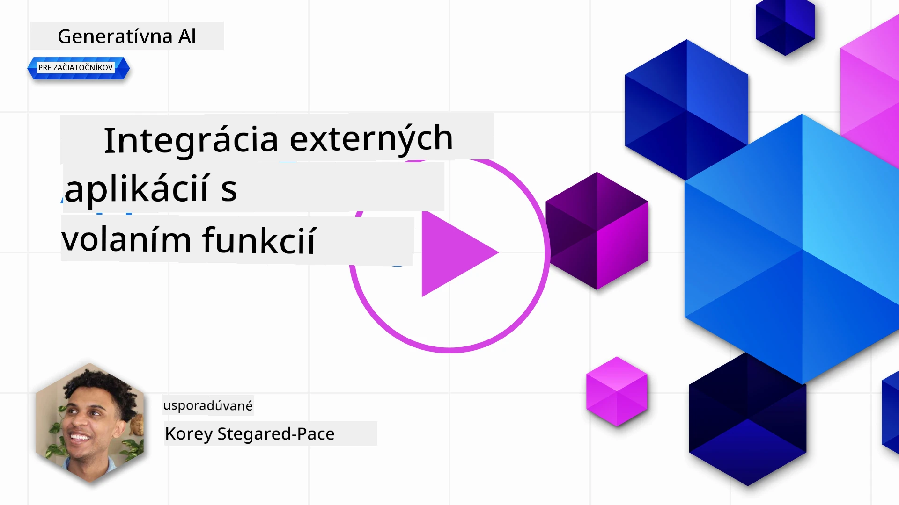
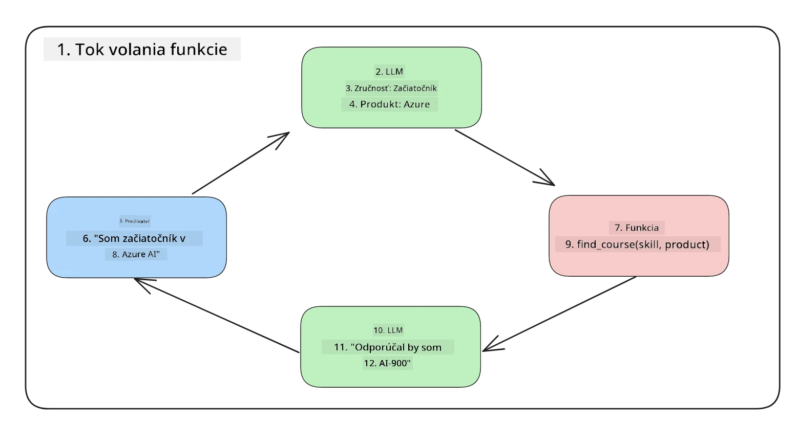
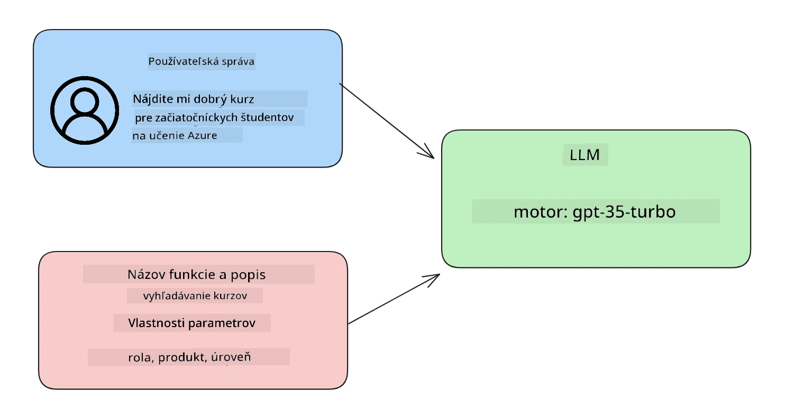

# Integrácia s volaním funkcií

[](https://youtu.be/DgUdCLX8qYQ?si=f1ouQU5HQx6F8Gl2)

Doteraz ste sa v predchádzajúcich lekciách naučili celkom dosť. Môžeme sa však ďalej zlepšovať. Niektoré veci môžeme vyriešiť tak, aby sme získali konzistentnejší formát odpovede, čo uľahčí prácu s odpoveďou v ďalšom spracovaní. Tiež môžeme chcieť pridať údaje z iných zdrojov, aby sme našu aplikáciu ešte viac obohatili.

Vyššie spomenuté problémy sú tým, čo sa táto kapitola snaží riešiť.

## Úvod

Táto lekcia pokryje:

- Vysvetlenie, čo je volanie funkcií a na čo sa používa.
- Vytvorenie volania funkcie pomocou Azure OpenAI.
- Ako integrovať volanie funkcie do aplikácie.

## Výučbové ciele

Na konci tejto lekcie budete schopní:

- Vysvetliť účel používania volania funkcií.
- Nastaviť volanie funkcie pomocou služby Azure OpenAI.
- Navrhnúť efektívne volania funkcií pre prípad použitia vo vašej aplikácii.

## Scenár: Zlepšovanie nášho chatbota pomocou funkcií

Pre túto lekciu chceme vytvoriť funkciu pre našu vzdelávaciu startupovú platformu, ktorá umožní používateľom využiť chatbota na vyhľadávanie technických kurzov. Odporučíme kurzy, ktoré zodpovedajú ich úrovni znalostí, aktuálnej pozícii a technológii záujmu.

Na dokončenie tohto scenára použijeme kombináciu:

- `Azure OpenAI` na vytvorenie chatovacieho zážitku pre používateľa.
- `Microsoft Learn Catalog API` na pomoc používateľom nájsť kurzy podľa požiadaviek.
- `Volanie funkcií` na spracovanie dotazu používateľa a odoslanie ho do funkcie na vykonanie API požiadavky.

Na začiatok sa pozrime, prečo by sme vlastne chceli používať volanie funkcií:

## Prečo volanie funkcií

Pred volaním funkcií boli odpovede z LLM neštruktúrované a nekonzistentné. Vývojári museli písať zložité validačné kódy, aby zabezpečili správnu manipuláciu s každou verziou odpovede. Používatelia nemohli získať odpovede na otázky ako "Aké je aktuálne počasie v Štokholme?". Je to preto, že modely boli limitované dátami, na ktorých boli trénované.

Volanie funkcií je funkcia služby Azure OpenAI, ktorá prekonáva nasledujúce obmedzenia:

- **Konzistentný formát odpovede**. Ak môžeme lepšie kontrolovať formát odpovede, ľahšie integrovať odpoveď do dalších systémov.
- **Externé údaje**. Schopnosť použiť údaje z iných zdrojov aplikácie v kontexte chatu.

## Ilustrácia problému na scenári

> Odporúčame vám použiť [vložený notebook](./python/aoai-assignment.ipynb?WT.mc_id=academic-105485-koreyst), ak chcete spustiť nasledujúci scenár. Môžete si však len prečítať, pretože sa snažíme ilustrovať problém, kde funkcie môžu pomôcť vyriešiť problém.

Pozrime sa na príklad, ktorý ilustruje problém s formátom odpovede:

Predpokladajme, že chceme vytvoriť databázu študentských údajov, aby sme im mohli navrhnúť správny kurz. Nižšie máme dva popisy študentov, ktoré sú veľmi podobné v údajoch, ktoré obsahujú.

1. Vytvorte pripojenie k nášmu zdroju Azure OpenAI:

   ```python
   import os
   import json
   from openai import OpenAI
   from dotenv import load_dotenv
   load_dotenv()

   # API odpovedí je poskytované z Azure OpenAI (Microsoft Foundry) v1
   # koncového bodu, takže ukazujeme klienta OpenAI na <your-endpoint>/openai/v1/.
   endpoint = os.environ['AZURE_OPENAI_ENDPOINT']
   client = OpenAI(
   api_key=os.environ['AZURE_OPENAI_API_KEY'],
   base_url=f"{endpoint.rstrip('/')}/openai/v1/",
   )

   deployment=os.environ['AZURE_OPENAI_DEPLOYMENT']
   ```

   Nižšie je kód v Pythone na nastavenie nášho pripojenia k Azure OpenAI. Keďže používame koncový bod v1, potrebujeme len nastaviť `api_key` a `base_url` (nie je potrebné `api_version`).

1. Vytvorenie dvoch popisov študentov pomocou premenných `student_1_description` a `student_2_description`.

   ```python
   student_1_description="Emily Johnson is a sophomore majoring in computer science at Duke University. She has a 3.7 GPA. Emily is an active member of the university's Chess Club and Debate Team. She hopes to pursue a career in software engineering after graduating."

   student_2_description = "Michael Lee is a sophomore majoring in computer science at Stanford University. He has a 3.8 GPA. Michael is known for his programming skills and is an active member of the university's Robotics Club. He hopes to pursue a career in artificial intelligence after finishing his studies."
   ```

   Chceme odoslať vyššie popisy študentov do LLM, aby sme dáta vyparsovali. Tieto dáta potom môžu byť použité v našej aplikácii, odoslané do API alebo uložené do databázy.

1. Vytvorme dva identické prompt-y, v ktorých inštruujeme LLM, aké informácie nás zaujímajú:

   ```python
   prompt1 = f'''
   Please extract the following information from the given text and return it as a JSON object:

   name
   major
   school
   grades
   club

   This is the body of text to extract the information from:
   {student_1_description}
   '''

   prompt2 = f'''
   Please extract the following information from the given text and return it as a JSON object:

   name
   major
   school
   grades
   club

   This is the body of text to extract the information from:
   {student_2_description}
   '''
   ```

   Vyššie prompt-y inštruujú LLM, aby extrahoval informácie a vrátil odpoveď v JSON formáte.

1. Po nastavení promptov a pripojenia k Azure OpenAI teraz odosielame prompt-y do LLM použitím `client.responses.create`. Prompt ukladáme do premennej `input` a priraďujeme rolu `user`. To má imitovať správu od používateľa pre chatbota.

   ```python
   # odpoveď z prvého promptu
   openai_response1 = client.responses.create(
   model=deployment,
   input = [{'role': 'user', 'content': prompt1}],
   store=False,
   )
   openai_response1.output_text

   # odpoveď z druhého promptu
   openai_response2 = client.responses.create(
   model=deployment,
   input = [{'role': 'user', 'content': prompt2}],
   store=False,
   )
   openai_response2.output_text
   ```

Teraz môžeme odoslať obe požiadavky do LLM a preskúmať odpoveď, ktorú dostaneme, pomocou prístupu ako `openai_response1.output_text`.

1. Nakoniec môžeme odpoveď konvertovať do JSON formátu zavolaním `json.loads`:

   ```python
   # Načítanie odpovede ako JSON objektu
   json_response1 = json.loads(openai_response1.output_text)
   json_response1
   ```

   Odpoveď 1:

   ```json
   {
     "name": "Emily Johnson",
     "major": "computer science",
     "school": "Duke University",
     "grades": "3.7",
     "club": "Chess Club"
   }
   ```

   Odpoveď 2:

   ```json
   {
     "name": "Michael Lee",
     "major": "computer science",
     "school": "Stanford University",
     "grades": "3.8 GPA",
     "club": "Robotics Club"
   }
   ```

   Aj keď sú prompt-y rovnaké a popisy podobné, vidíme, že hodnoty v atribúte `Grades` sú naformátované rôzne, napríklad môžeme dostať formát `3.7` alebo `3.7 GPA`.

   Tento výsledok je preto, že LLM spracováva neštruktúrované dáta vo forme písomného promptu a tiež neštruktúrovane vracia dáta. Potrebujeme mať štruktúrovaný formát, aby sme vedeli, čo očakávať pri ukladaní alebo používaní týchto dát.

Ako teda vyriešiť problém s formátovaním? Použitím volania funkcií môžeme zabezpečiť, že dostaneme späť štruktúrované dáta. Pri volaní funkcií LLM v skutočnosti nevolá ani nespúšťa žiadne funkcie. Namiesto toho vytvoríme štruktúru, ktorú má LLM dodržiavať pri odpovediach. Táto štruktúrovaná odpoveď nám pomáha určiť, ktorú funkciu máme v aplikácii spustiť.



Potom môžeme vziať, čo funkcia vrátila, a odoslať to späť LLM. LLM následne odpovie v prirodzenom jazyku na dotaz používateľa.

## Prípad použitia použitia volania funkcií

Existuje mnoho rôznych prípadov použitia, kde volania funkcií môžu zlepšiť vašu aplikáciu, napríklad:

- **Volanie externých nástrojov**. Chatboti sú výborní v poskytovaní odpovedí na otázky od používateľov. Použitím volania funkcií môžu chatboti využiť správy od používateľov na dokončenie určitých úloh. Napríklad študent môže požiadať chatbota: "Pošli e-mail môjmu inštruktorovi, že potrebujem viac pomoci s týmto predmetom". Toto môže byť volanie funkcie `send_email(to: string, body: string)`

- **Tvorba API alebo databázových dopytov**. Používatelia môžu vyhľadávať informácie v prirodzenom jazyku, ktoré sa konvertujú na formátovaný dopyt alebo API požiadavku. Napríklad učiteľ môže požiadať: "Kto sú študenti, ktorí dokončili poslednú úlohu", čo môže volať funkciu nazvanú `get_completed(student_name: string, assignment: int, current_status: string)`

- **Vytváranie štruktúrovaných dát**. Používatelia môžu zobrať blok textu alebo CSV a použiť LLM na extrakciu dôležitých informácií. Napríklad študent môže previesť článok z Wikipédie o mierových dohodách na vytvorenie AI flashkariet. Toto môže byť realizované použitím funkcie `get_important_facts(agreement_name: string, date_signed: string, parties_involved: list)`

## Vytvorenie vášho prvého volania funkcie

Proces vytvorenia volania funkcie zahŕňa 3 hlavné kroky:

1. **Volanie** Responses API so zoznamom vašich funkcií (nástrojov) a správou používateľa.
2. **Čítanie** odpovede modelu na vykonanie akcie, t.j. vykonanie funkcie alebo API volania.
3. **Vykonanie** ďalšieho volania Responses API s odpoveďou z vašej funkcie, aby sme túto informáciu použili na vytvorenie odpovede pre používateľa.



### Krok 1 - vytvorenie správ

Prvým krokom je vytvoriť správu používateľa. Táto môže byť dynamicky priradená napríklad hodnotou z textového vstupu, alebo jej môžete priradiť hodnotu tu. Ak pracujete s API Responses prvýkrát, musíme definovať `role` a `content` správy.

`role` môže byť `system` (vytvára pravidlá), `assistant` (model) alebo `user` (koncový používateľ). Pre volanie funkcií ju nastavíme na `user` a pridáme príklad otázky.

```python
messages= [ {"role": "user", "content": "Find me a good course for a beginner student to learn Azure."} ]
```

Priradením rôznych rolí je pre LLM jasné, či niečo hovorí systém alebo používateľ, čo pomáha budovať históriu konverzácie, na ktorú sa LLM môže odvolávať.

### Krok 2 - vytvorenie funkcií

Ďalej definujeme funkciu a jej parametre. Použijeme tu len jednu funkciu nazvanú `search_courses`, ale môžete vytvoriť viac funkcií.

> **Dôležité** : Funkcie sú zahrnuté v systémovej správe pre LLM a zaberajú toky tokenov, ktoré máte dostupné.

Nižšie vytvárame funkcie ako pole položiek. Každá položka je nástroj v plochom formáte Responses API s vlastnosťami `type`, `name`, `description` a `parameters`:

```python
functions = [
   {
      "type":"function",
      "name":"search_courses",
      "description":"Retrieves courses from the search index based on the parameters provided",
      "parameters":{
         "type":"object",
         "properties":{
            "role":{
               "type":"string",
               "description":"The role of the learner (i.e. developer, data scientist, student, etc.)"
            },
            "product":{
               "type":"string",
               "description":"The product that the lesson is covering (i.e. Azure, Power BI, etc.)"
            },
            "level":{
               "type":"string",
               "description":"The level of experience the learner has prior to taking the course (i.e. beginner, intermediate, advanced)"
            }
         },
         "required":[
            "role"
         ]
      }
   }
]
```

Popíšme si detailnejšie jednotlivé časti funkcie:

- `name` - Názov funkcie, ktorú chceme volať.
- `description` - Popis ako funkcia funguje. Tu je dôležité byť špecifický a jasný.
- `parameters` - Zoznam hodnôt a formát, ktoré očakávame od modelu v odpovedi. Pole parametrov obsahuje položky s nasledovnými vlastnosťami:
  1.  `type` - Dátový typ vlastností, v ktorom budú uložené.
  1.  `properties` - Zoznam špecifických hodnôt, ktoré model použije vo svojej odpovedi.
      1. `name` - Kľúč je názov vlastnosti, ktorú model použije vo formátovanej odpovedi, napríklad `product`.
      1. `type` - Dátový typ tejto vlastnosti, napríklad `string`.
      1. `description` - Popis danej vlastnosti.

Je tu tiež nepovinná vlastnosť `required` - požadovaná vlastnosť pre dokončenie volania funkcie.

### Krok 3 - vykonanie volania funkcie

Po definovaní funkcie ju musíme zahrnúť do volania Responses API. Robíme to pridaním `tools` do požiadavky. V tomto prípade `tools=functions`.

Je tiež možné nastaviť `tool_choice` na `auto`. Znamená to, že necháme LLM rozhodnúť, ktorá funkcia sa volá na základe správy používateľa namiesto, aby sme ju explicitne určili.

Nižšie je kód, kde voláme `client.responses.create`, všimnite si, že nastavujeme `tools=functions` a `tool_choice="auto"`, čím dávame LLM možnosť rozhodnúť, kedy volať funkcie, ktoré mu poskytneme:

```python
response = client.responses.create(model=deployment,
                                        input=messages,
                                        tools=functions,
                                        tool_choice="auto",
                                        store=False)

print(response.output)
```

Odpoveď teraz obsahuje položku `function_call` v `response.output`, ktorá vyzerá nasledovne:

```json
{
  "type": "function_call",
  "name": "search_courses",
  "call_id": "call_abc123",
  "arguments": "{\n  \"role\": \"student\",\n  \"product\": \"Azure\",\n  \"level\": \"beginner\"\n}"
}
```

Tu vidíme, ako bola funkcia `search_courses` volaná a s akými argumentmi, ktoré sú uvedené vo vlastnosti `arguments` v JSON odpovedi.

Záver je, že LLM dokázal nájsť dáta na zaplnenie argumentov funkcie, pretože ich extrahoval z hodnoty, ktorá bola poskytnutá parametru `input` v volaní Responses API. Nižšie je pripomienka hodnoty `messages`:

```python
messages= [ {"role": "user", "content": "Find me a good course for a beginner student to learn Azure."} ]
```

Ako vidíte, `student`, `Azure` a `beginner` boli extrahované zo `messages` a nastavené ako vstup do funkcie. Používanie funkcií týmto spôsobom je skvelý spôsob, ako extrahovať informácie z promptu, ale aj ako poskytnúť štruktúru LLM a mať znovupoužiteľnú funkcionalitu.

Teraz sa pozrime, ako môžeme toto použiť v našej aplikácii.

## Integrácia volaní funkcií do aplikácie

Po otestovaní formátovanej odpovede z LLM môžeme túto integrovať do aplikácie.

### Riadenie toku

Pre integráciu do našej aplikácie urobme nasledovné kroky:

1. Najprv spravme volanie na OpenAI služby a extrahujme položky volania funkcie z odpovede `output`.

   ```python
   response_items = response.output
   tool_calls = [item for item in response_items if item.type == "function_call"]
   ```

1. Teraz definujeme funkciu, ktorá zavolá Microsoft Learn API na získanie zoznamu kurzov:

   ```python
   import requests

   def search_courses(role, product, level):
     url = "https://learn.microsoft.com/api/catalog/"
     params = {
        "role": role,
        "product": product,
        "level": level
     }
     response = requests.get(url, params=params)
     modules = response.json()["modules"]
     results = []
     for module in modules[:5]:
        title = module["title"]
        url = module["url"]
        results.append({"title": title, "url": url})
     return str(results)
   ```

   Všimnite si, že teraz vytvárame skutočnú Python funkciu mapujúcu sa na názvy funkcií definované v premennej `functions`. Tiež vykonávame skutočné externé API volania, aby sme získali potrebné dáta. V tomto prípade sa dopytujeme Microsoft Learn API na vyhľadávanie vzdelávacích modulov.

Dobre, vytvorili sme premennú `functions` a zodpovedajúcu Python funkciu, ako teda oznámime LLM, ako tieto dve spojiť, aby sa naša Python funkcia volala?

1. Aby sme zistili, či potrebujeme zavolať Python funkciu, musíme prezrieť odpoveď LLM a overiť, či obsahuje položku `function_call`, a zavolať uvedenú funkciu. Nižšie je ukážka, ako túto kontrolu vykonať:

   ```python
   # Skontrolujte, či model chce zavolať funkciu
   if tool_calls:
    for tool_call in tool_calls:
     print("Recommended Function call:")
     print(tool_call.name)
     print()

     # Zavolajte funkciu.
     function_name = tool_call.name

     available_functions = {
             "search_courses": search_courses,
     }
     function_to_call = available_functions[function_name]

     function_args = json.loads(tool_call.arguments)
     function_response = function_to_call(**function_args)

     print("Output of function call:")
     print(function_response)
     print(type(function_response))

     # Pridajte volanie funkcie a jeho výsledok späť do konverzácie.
     # Položka function_call modelu musí byť pridaná pred jeho výstup.
     messages.append(tool_call)  # položka function_call asistenta
     messages.append( # výsledok funkcie
         {
             "type": "function_call_output",
             "call_id": tool_call.call_id,
             "output": function_response,
         }
     )
   ```

   Tieto tri riadky zabezpečia extrakciu názvu funkcie, argumentov a vykonanie volania:

   ```python
   function_to_call = available_functions[function_name]

   function_args = json.loads(tool_call.arguments)
   function_response = function_to_call(**function_args)
   ```

   Nižšie je výstup spustenia nášho kódu:

   **Výstup**

   ```Recommended Function call:
   {
     "name": "search_courses",
     "arguments": "{\n  \"role\": \"student\",\n  \"product\": \"Azure\",\n  \"level\": \"beginner\"\n}"
   }

   Output of function call:
   [{'title': 'Describe concepts of cryptography', 'url': 'https://learn.microsoft.com/training/modules/describe-concepts-of-cryptography/?
   WT.mc_id=api_CatalogApi'}, {'title': 'Introduction to audio classification with TensorFlow', 'url': 'https://learn.microsoft.com/en-
   us/training/modules/intro-audio-classification-tensorflow/?WT.mc_id=api_CatalogApi'}, {'title': 'Design a Performant Data Model in Azure SQL
   Database with Azure Data Studio', 'url': 'https://learn.microsoft.com/training/modules/design-a-data-model-with-ads/?
   WT.mc_id=api_CatalogApi'}, {'title': 'Getting started with the Microsoft Cloud Adoption Framework for Azure', 'url':
   'https://learn.microsoft.com/training/modules/cloud-adoption-framework-getting-started/?WT.mc_id=api_CatalogApi'}, {'title': 'Set up the
   Rust development environment', 'url': 'https://learn.microsoft.com/training/modules/rust-set-up-environment/?WT.mc_id=api_CatalogApi'}]
   <class 'str'>
   ```

1. Teraz odosielame aktualizovanú správu `messages` do LLM, aby sme mohli dostať odpoveď v prirodzenom jazyku namiesto API JSON formátu.

   ```python
   print("Messages in next request:")
   print(messages)
   print()

   second_response = client.responses.create(
      input=messages,
      model=deployment,
      tool_choice="auto",
      tools=functions,
      temperature=0,
      store=False,
         )  # získať novú odpoveď od modelu, kde môže vidieť odpoveď funkcie


   print(second_response.output_text)
   ```

   **Výstup**

   ```text
   I found some good courses for beginner students to learn Azure:

   1. [Describe concepts of cryptography](https://learn.microsoft.com/training/modules/describe-concepts-of-cryptography/?WT.mc_id=api_CatalogApi)
   2. [Introduction to audio classification with TensorFlow](https://learn.microsoft.com/training/modules/intro-audio-classification-tensorflow/?WT.mc_id=api_CatalogApi)
   3. [Design a Performant Data Model in Azure SQL Database with Azure Data Studio](https://learn.microsoft.com/training/modules/design-a-data-model-with-ads/?WT.mc_id=api_CatalogApi)
   4. [Getting started with the Microsoft Cloud Adoption Framework for Azure](https://learn.microsoft.com/training/modules/cloud-adoption-framework-getting-started/?WT.mc_id=api_CatalogApi)
   5. [Set up the Rust development environment](https://learn.microsoft.com/training/modules/rust-set-up-environment/?WT.mc_id=api_CatalogApi)

   You can click on the links to access the courses.
   ```

## Zadanie

Ak chcete pokračovať v učení Azure OpenAI funkcií volania, môžete vytvoriť:

- Viac parametrov funkcie, ktoré môžu pomôcť študentom nájsť viac kurzov.

- Vytvorte ďalší volanie funkcie, ktoré od používateľa získa viac informácií, napríklad jeho materinský jazyk
- Vytvorte spracovanie chýb, keď volanie funkcie a/alebo volanie API nevráti žiadne vhodné kurzy

Tip: Postupujte podľa stránky [Learn API reference documentation](https://learn.microsoft.com/training/support/catalog-api-developer-reference?WT.mc_id=academic-105485-koreyst), kde uvidíte, ako a kde sú tieto údaje dostupné.

## Skvelá práca! Pokračujte v ceste

Po dokončení tejto lekcie si pozrite našu [kolekciu Generative AI Learning](https://aka.ms/genai-collection?WT.mc_id=academic-105485-koreyst), aby ste naďalej rozširovali svoje znalosti o generatívnej umelej inteligencii!

Prejdite na lekciu 12, kde sa pozrieme na to, ako [navrhnúť UX pre AI aplikácie](../12-designing-ux-for-ai-applications/README.md?WT.mc_id=academic-105485-koreyst)!

---

<!-- CO-OP TRANSLATOR DISCLAIMER START -->
**Vyhlásenie o zodpovednosti**:
Tento dokument bol preložený pomocou AI prekladateľskej služby [Co-op Translator](https://github.com/Azure/co-op-translator). Hoci sa snažíme o presnosť, vezmite prosím na vedomie, že automatické preklady môžu obsahovať chyby alebo nepresnosti. Pôvodný dokument v jeho natívnom jazyku by mal byť považovaný za autoritatívny zdroj. Pre kritické informácie sa odporúča profesionálny ľudský preklad. Nie sme zodpovední za žiadne nedorozumenia alebo nesprávne interpretácie vyplývajúce z použitia tohto prekladu.
<!-- CO-OP TRANSLATOR DISCLAIMER END -->