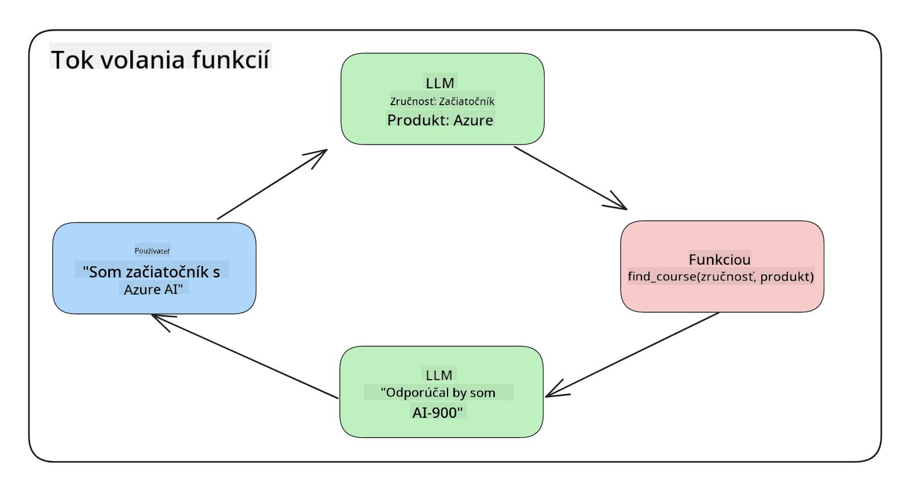

<!--
CO_OP_TRANSLATOR_METADATA:
{
  "original_hash": "77a48a201447be19aa7560706d6f93a0",
  "translation_date": "2025-07-09T14:42:24+00:00",
  "source_file": "11-integrating-with-function-calling/README.md",
  "language_code": "sk"
}
-->
# Integrácia s volaním funkcií

[](https://aka.ms/gen-ai-lesson11-gh?WT.mc_id=academic-105485-koreyst)

Doteraz ste sa v predchádzajúcich lekciách naučili dosť veľa. Napriek tomu sa môžeme ešte zlepšiť. Niektoré veci, ktoré môžeme riešiť, sú ako zabezpečiť konzistentnejší formát odpovede, aby sa s ňou dalo jednoduchšie pracovať v ďalších častiach aplikácie. Tiež môžeme chcieť pridať dáta z iných zdrojov, aby sme našu aplikáciu ešte viac obohatili.

Vyššie spomenuté problémy sú tým, čomu sa táto kapitola venuje.

## Úvod

V tejto lekcii sa naučíte:

- Vysvetliť, čo je volanie funkcií a na čo sa používa.
- Vytvoriť volanie funkcie pomocou Azure OpenAI.
- Ako integrovať volanie funkcie do aplikácie.

## Ciele učenia

Na konci tejto lekcie budete vedieť:

- Vysvetliť účel používania volania funkcií.
- Nastaviť volanie funkcie pomocou Azure OpenAI Service.
- Navrhnúť efektívne volania funkcií pre váš prípad použitia aplikácie.

## Scenár: Vylepšenie nášho chatbota pomocou funkcií

Pre túto lekciu chceme vytvoriť funkciu pre náš vzdelávací startup, ktorá umožní používateľom vyhľadávať technické kurzy pomocou chatbota. Budeme odporúčať kurzy, ktoré zodpovedajú ich úrovni zručností, aktuálnej pozícii a technológii, o ktorú majú záujem.

Na dokončenie tohto scenára použijeme kombináciu:

- `Azure OpenAI` na vytvorenie chatovacieho zážitku pre používateľa.
- `Microsoft Learn Catalog API` na pomoc používateľom nájsť kurzy podľa ich požiadaviek.
- `Function Calling` na spracovanie používateľovej otázky a odoslanie jej do funkcie, ktorá vykoná API požiadavku.

Na začiatok sa pozrime, prečo by sme vôbec chceli používať volanie funkcií:

## Prečo volanie funkcií

Pred volaním funkcií boli odpovede z LLM neštruktúrované a nekonzistentné. Vývojári museli písať zložité validačné kódy, aby zvládli všetky možné varianty odpovedí. Používatelia nemohli dostať odpovede na otázky ako „Aké je aktuálne počasie v Štokholme?“. Dôvodom bolo, že modely boli obmedzené na dáta, na ktorých boli trénované.

Volanie funkcií je funkcia Azure OpenAI Service, ktorá pomáha prekonať tieto obmedzenia:

- **Konzistentný formát odpovede**. Ak môžeme lepšie kontrolovať formát odpovede, môžeme ju jednoduchšie integrovať do ďalších systémov.
- **Externé dáta**. Možnosť použiť dáta z iných zdrojov aplikácie v kontexte chatu.

## Ilustrácia problému na príklade

> Odporúčame použiť [priložený notebook](python/aoai-assignment.ipynb), ak chcete spustiť nižšie uvedený scenár. Môžete si ho však aj len prečítať, keďže sa snažíme ukázať problém, ktorý volania funkcií pomáhajú riešiť.

Pozrime sa na príklad, ktorý ilustruje problém s formátom odpovede:

Povedzme, že chceme vytvoriť databázu študentských údajov, aby sme im mohli odporučiť správny kurz. Nižšie máme dva popisy študentov, ktoré sú si veľmi podobné v údajoch, ktoré obsahujú.

1. Vytvorte pripojenie k nášmu Azure OpenAI zdroju:

   ```python
   import os
   import json
   from openai import AzureOpenAI
   from dotenv import load_dotenv
   load_dotenv()

   client = AzureOpenAI(
   api_key=os.environ['AZURE_OPENAI_API_KEY'],  # this is also the default, it can be omitted
   api_version = "2023-07-01-preview"
   )

   deployment=os.environ['AZURE_OPENAI_DEPLOYMENT']
   ```

   Nižšie je Python kód na konfiguráciu pripojenia k Azure OpenAI, kde nastavujeme `api_type`, `api_base`, `api_version` a `api_key`.

1. Vytvorenie dvoch popisov študentov pomocou premenných `student_1_description` a `student_2_description`.

   ```python
   student_1_description="Emily Johnson is a sophomore majoring in computer science at Duke University. She has a 3.7 GPA. Emily is an active member of the university's Chess Club and Debate Team. She hopes to pursue a career in software engineering after graduating."

   student_2_description = "Michael Lee is a sophomore majoring in computer science at Stanford University. He has a 3.8 GPA. Michael is known for his programming skills and is an active member of the university's Robotics Club. He hopes to pursue a career in artificial intelligence after finishing his studies."
   ```

   Chceme poslať tieto popisy študentov do LLM, aby sme z nich vyparsovali údaje. Tieto údaje môžu byť neskôr použité v našej aplikácii, odoslané do API alebo uložené v databáze.

1. Vytvorme dva identické prompt-y, v ktorých inštruujeme LLM, aké informácie nás zaujímajú:

   ```python
   prompt1 = f'''
   Please extract the following information from the given text and return it as a JSON object:

   name
   major
   school
   grades
   club

   This is the body of text to extract the information from:
   {student_1_description}
   '''

   prompt2 = f'''
   Please extract the following information from the given text and return it as a JSON object:

   name
   major
   school
   grades
   club

   This is the body of text to extract the information from:
   {student_2_description}
   '''
   ```

   Vyššie uvedené prompt-y inštruujú LLM, aby extrahoval informácie a vrátil odpoveď vo formáte JSON.

1. Po nastavení promptov a pripojenia k Azure OpenAI teraz odošleme prompt-y do LLM pomocou `openai.ChatCompletion`. Prompt uložíme do premennej `messages` a priradíme rolu `user`. Toto simuluje správu od používateľa napísanú do chatbota.

   ```python
   # response from prompt one
   openai_response1 = client.chat.completions.create(
   model=deployment,
   messages = [{'role': 'user', 'content': prompt1}]
   )
   openai_response1.choices[0].message.content

   # response from prompt two
   openai_response2 = client.chat.completions.create(
   model=deployment,
   messages = [{'role': 'user', 'content': prompt2}]
   )
   openai_response2.choices[0].message.content
   ```

Teraz môžeme odoslať obe požiadavky do LLM a skontrolovať odpoveď, ktorú dostaneme, takto: `openai_response1['choices'][0]['message']['content']`.

1. Nakoniec môžeme odpoveď previesť do formátu JSON pomocou `json.loads`:

   ```python
   # Loading the response as a JSON object
   json_response1 = json.loads(openai_response1.choices[0].message.content)
   json_response1
   ```

   Odpoveď 1:

   ```json
   {
     "name": "Emily Johnson",
     "major": "computer science",
     "school": "Duke University",
     "grades": "3.7",
     "club": "Chess Club"
   }
   ```

   Odpoveď 2:

   ```json
   {
     "name": "Michael Lee",
     "major": "computer science",
     "school": "Stanford University",
     "grades": "3.8 GPA",
     "club": "Robotics Club"
   }
   ```

   Aj keď sú prompt-y rovnaké a popisy podobné, vidíme, že hodnoty vlastnosti `Grades` sú formátované rôzne, napríklad niekedy dostaneme formát `3.7` alebo `3.7 GPA`.

   Tento výsledok je spôsobený tým, že LLM spracováva neštruktúrované dáta vo forme napísaného promptu a vracia tiež neštruktúrované dáta. Potrebujeme mať štruktúrovaný formát, aby sme vedeli, čo očakávať pri ukladaní alebo používaní týchto dát.

Ako teda vyriešiť problém s formátovaním? Použitím volania funkcií môžeme zabezpečiť, že dostaneme späť štruktúrované dáta. Pri volaní funkcií LLM v skutočnosti nevolá ani nevykonáva žiadne funkcie. Namiesto toho vytvoríme štruktúru, ktorú má LLM dodržiavať vo svojich odpovediach. Tieto štruktúrované odpovede potom použijeme na rozhodnutie, ktorú funkciu v aplikácii spustiť.



Výsledok z funkcie môžeme následne poslať späť do LLM. LLM potom odpovie prirodzeným jazykom na otázku používateľa.

## Prípady použitia volania funkcií

Existuje mnoho rôznych prípadov, kde volania funkcií môžu zlepšiť vašu aplikáciu, napríklad:

- **Volanie externých nástrojov**. Chatboti sú skvelí na poskytovanie odpovedí na otázky používateľov. Použitím volania funkcií môžu chatboti využiť správy od používateľov na vykonanie určitých úloh. Napríklad študent môže požiadať chatbota: „Pošli e-mail môjmu lektorovi, že potrebujem viac pomoci s týmto predmetom.“ Toto môže vyvolať volanie funkcie `send_email(to: string, body: string)`.

- **Vytváranie API alebo databázových dotazov**. Používatelia môžu nájsť informácie pomocou prirodzeného jazyka, ktorý sa premení na formátovaný dotaz alebo API požiadavku. Príkladom môže byť učiteľ, ktorý sa pýta: „Kto sú študenti, ktorí dokončili poslednú úlohu?“, čo môže vyvolať funkciu `get_completed(student_name: string, assignment: int, current_status: string)`.

- **Vytváranie štruktúrovaných dát**. Používatelia môžu vziať blok textu alebo CSV a použiť LLM na extrakciu dôležitých informácií. Napríklad študent môže previesť článok z Wikipédie o mierových dohodách na AI flashkarty. Toto sa dá urobiť pomocou funkcie `get_important_facts(agreement_name: string, date_signed: string, parties_involved: list)`.

## Vytvorenie vášho prvého volania funkcie

Proces vytvorenia volania funkcie zahŕňa 3 hlavné kroky:

1. **Volanie** Chat Completions API so zoznamom vašich funkcií a správou od používateľa.
2. **Čítanie** odpovede modelu na vykonanie akcie, napríklad spustenie funkcie alebo API volania.
3. **Vytvorenie** ďalšieho volania na Chat Completions API s odpoveďou z vašej funkcie, aby ste použili tieto informácie na vytvorenie odpovede pre používateľa.


### Krok 1 - vytvorenie správ

Prvým krokom je vytvoriť správu od používateľa. Tá môže byť dynamicky priradená z hodnoty textového vstupu alebo môžete priradiť hodnotu priamo tu. Ak pracujete s Chat Completions API prvýkrát, musíme definovať `role` a `content` správy.

`role` môže byť `system` (nastavenie pravidiel), `assistant` (model) alebo `user` (koncový používateľ). Pre volanie funkcií priradíme rolu `user` a uvedieme príklad otázky.

```python
messages= [ {"role": "user", "content": "Find me a good course for a beginner student to learn Azure."} ]
```

Priradením rôznych rolí je pre LLM jasné, či hovorí systém alebo používateľ, čo pomáha budovať históriu konverzácie, na ktorú sa LLM môže odvolávať.

### Krok 2 - vytvorenie funkcií

Ďalej definujeme funkciu a jej parametre. Použijeme len jednu funkciu s názvom `search_courses`, ale môžete vytvoriť viacero funkcií.

> **Dôležité** : Funkcie sú zahrnuté v systémovej správe pre LLM a započítavajú sa do dostupného počtu tokenov.

Nižšie vytvoríme funkcie ako pole položiek. Každá položka je funkcia a má vlastnosti `name`, `description` a `parameters`:

```python
functions = [
   {
      "name":"search_courses",
      "description":"Retrieves courses from the search index based on the parameters provided",
      "parameters":{
         "type":"object",
         "properties":{
            "role":{
               "type":"string",
               "description":"The role of the learner (i.e. developer, data scientist, student, etc.)"
            },
            "product":{
               "type":"string",
               "description":"The product that the lesson is covering (i.e. Azure, Power BI, etc.)"
            },
            "level":{
               "type":"string",
               "description":"The level of experience the learner has prior to taking the course (i.e. beginner, intermediate, advanced)"
            }
         },
         "required":[
            "role"
         ]
      }
   }
]
```

Podrobnejší popis jednotlivých vlastností funkcie:

- `name` - Názov funkcie, ktorú chceme volať.
- `description` - Popis, ako funkcia funguje. Tu je dôležité byť konkrétny a jasný.
- `parameters` - Zoznam hodnôt a formát, ktorý chcete, aby model vo svojej odpovedi použil. Pole `parameters` obsahuje položky s nasledujúcimi vlastnosťami:
  1. `type` - Dátový typ, v ktorom budú vlastnosti uložené.
  2. `properties` - Zoznam konkrétnych hodnôt, ktoré model použije vo svojej odpovedi.
      1. `name` - Kľúč je názov vlastnosti, ktorú model použije vo formátovanej odpovedi, napríklad `product`.
      2. `type` - Dátový typ tejto vlastnosti, napríklad `string`.
      3. `description` - Popis konkrétnej vlastnosti.

Existuje aj voliteľná vlastnosť `required` - povinná vlastnosť pre úspešné volanie funkcie.

### Krok 3 - vykonanie volania funkcie

Po definovaní funkcie ju musíme zahrnúť do volania Chat Completion API. Urobíme to pridaním `functions` do požiadavky, v tomto prípade `functions=functions`.

Je tu tiež možnosť nastaviť `function_call` na `auto`. To znamená, že necháme LLM rozhodnúť, ktorú funkciu volať na základe správy používateľa, namiesto toho, aby sme to určovali my.

Nižšie je kód, kde voláme `ChatCompletion.create`, všimnite si, že nastavujeme `functions=functions` a `function_call="auto"`, čím dávame LLM možnosť rozhodnúť, kedy volať poskytnuté funkcie:

```python
response = client.chat.completions.create(model=deployment,
                                        messages=messages,
                                        functions=functions,
                                        function_call="auto")

print(response.choices[0].message)
```

Odpoveď, ktorú dostaneme, vyzerá takto:

```json
{
  "role": "assistant",
  "function_call": {
    "name": "search_courses",
    "arguments": "{\n  \"role\": \"student\",\n  \"product\": \"Azure\",\n  \"level\": \"beginner\"\n}"
  }
}
```

Vidíme, že bola zavolaná funkcia `search_courses` a s akými argumentmi, ktoré sú uvedené vo vlastnosti `arguments` v JSON odpovedi.

Záver je, že LLM dokázal nájsť dáta, ktoré zodpovedajú argumentom funkcie, keď ich extrahoval z hodnoty `messages` v požiadavke na chat completion. Nižšie je pripomienka hodnoty `messages`:

```python
messages= [ {"role": "user", "content": "Find me a good course for a beginner student to learn Azure."} ]
```

Ako vidíte, `student`, `Azure` a `beginner` boli extrahované z `messages` a použité ako vstup do funkcie. Používanie funkcií týmto spôsobom je skvelý spôsob, ako extrahovať informácie z promptu, ale aj ako poskytnúť štruktúru LLM a mať opakovane použiteľnú funkcionalitu.

Teraz sa pozrime, ako to môžeme použiť v našej aplikácii.

## Integrácia volaní funkcií do aplikácie

Po otestovaní formátovanej odpovede z LLM môžeme túto funkcionalitu integrovať do aplikácie.

### Riadenie toku

Na integráciu do aplikácie vykonáme tieto kroky:

1. Najprv zavoláme OpenAI služby a uložíme správu do premennej `response_message`.

   ```python
   response_message = response.choices[0].message
   ```

1. Teraz definujeme funkciu, ktorá zavolá Microsoft Learn API a získa zoznam kurzov:

   ```python
   import requests

   def search_courses(role, product, level):
     url = "https://learn.microsoft.com/api/catalog/"
     params = {
        "role": role,
        "product": product,
        "level": level
     }
     response = requests.get(url, params=params)
     modules = response.json()["modules"]
     results = []
     for module in modules[:5]:
        title = module["title"]
        url = module["url"]
        results.append({"title": title, "url": url})
     return str(results)
   ```

   Všimnite si, že teraz vytvárame skutočnú Python funkciu, ktorá zodpovedá názvom funkcií uvedených v premennej `functions`. Tiež vykonávame reálne externé API volania na získanie potrebných dát. V tomto prípade voláme Microsoft Learn API na vyhľadávanie školiacich modulov.

Takže sme vytvorili premennú `functions` a zodpovedajúcu Python funkciu, ako však LLM povedať, ako tieto dve prepojiť, aby sa naša Python funkcia zavolala?

1. Aby sme zistili, či je potrebné zavolať Python funkciu, musíme sa pozrieť do odpovede LLM a skontrolovať, či obsahuje `function_call`, a potom zavolať príslušnú funkciu. Tu je, ako to môžete urobiť:

   ```python
   # Check if the model wants to call a function
   if response_message.function_call.name:
    print("Recommended Function call:")
    print(response_message.function_call.name)
    print()

    # Call the function.
    function_name = response_message.function_call.name

    available_functions = {
            "search_courses": search_courses,
    }
    function_to_call = available_functions[function_name]

    function_args = json.loads(response_message.function_call.arguments)
    function_response = function_to_call(**function_args)

    print("Output of function call:")
    print(function_response)
    print(type(function_response))


    # Add the assistant response and function response to the messages
    messages.append( # adding assistant response to messages
        {
            "role": response_message.role,
            "function_call": {
                "name": function_name,
                "arguments": response_message.function_call.arguments,
            },
            "content": None
        }
    )
    messages.append( # adding function response to messages
        {
            "role": "function",
            "name": function_name,
            "content":function_response,
        }
    )
   ```

   Tieto tri riadky zabezpečia extrakciu názvu funkcie, argumentov a vykonanie volania:

   ```python
   function_to_call = available_functions[function_name]

   function_args = json.loads(response_message.function_call.arguments)
   function_response = function_to_call(**function_args)
   ```

   Nižšie je výstup z behu nášho kódu:

   **Výstup**

   ```Recommended Function call:
   {
     "name": "search_courses",
     "arguments": "{\n  \"role\": \"student\",\n  \"product\": \"Azure\",\n  \"level\": \"beginner\"\n}"
   }

   Output of function call:
   [{'title': 'Describe concepts of cryptography', 'url': 'https://learn.microsoft.com/training/modules/describe-concepts-of-cryptography/?
   WT.mc_id=api_CatalogApi'}, {'title': 'Introduction to audio classification with TensorFlow', 'url': 'https://learn.microsoft.com/en-
   us/training/modules/intro-audio-classification-tensorflow/?WT.mc_id=api_CatalogApi'}, {'title': 'Design a Performant Data Model in Azure SQL
   Database with Azure Data Studio', 'url': 'https://learn.microsoft.com/training/modules/design-a-data-model-with-ads/?
   WT.mc_id=api_CatalogApi'}, {'title': 'Getting started with the Microsoft Cloud Adoption Framework for Azure', 'url':
   'https://learn.microsoft.com/training/modules/cloud-adoption-framework-getting-started/?WT.mc_id=api_CatalogApi'}, {'title': 'Set up the
   Rust development environment', 'url': 'https://learn.microsoft.com/training/modules/rust-set-up-environment/?WT.mc_id=api_CatalogApi'}]
   <class 'str'>
   ```

1. Teraz pošleme aktualizovanú správu `messages` späť do LLM, aby sme dostali odpoveď v prirodzenom jazyku namiesto JSON formátu z API.

   ```python
   print("Messages in next request:")
   print(messages)
   print()

   second_response = client.chat.completions.create(
      messages=messages,
      model=deployment,
      function_call="auto",
      functions=functions,
      temperature=0
         )  # get a new response from GPT where it can see the function response


   print(second_response.choices[0].message)
   ```

   **Výstup**

   ```python
   {
     "role": "assistant",
     "content": "I found some good courses for beginner students to learn Azure:\n\n1. [Describe concepts of cryptography] (https://learn.microsoft.com/training/modules/describe-concepts-of-cryptography/?WT.mc_id=api_CatalogApi)\n2. [Introduction to audio classification with TensorFlow](https://learn.microsoft.com/training/modules/intro-audio-classification-tensorflow/?WT.mc_id=api_CatalogApi)\n3. [Design a Performant Data Model in Azure SQL Database with Azure Data Studio](https://learn.microsoft.com/training/modules/design-a-data-model-with-ads/?WT.mc_id=api_CatalogApi)\n4. [Getting started with the Microsoft Cloud Adoption Framework for Azure](https://learn.microsoft.com/training/modules/cloud-adoption-framework-getting-started/?WT.mc_id=api_CatalogApi)\n5. [Set up the Rust development environment](https://learn.microsoft.com/training/modules/rust-set-up-environment/?WT.mc_id=api_CatalogApi)\n\nYou can click on the links to access the courses."
   }

   ```

## Zadanie

Na pokračovanie vo vašom učení o Azure OpenAI Function Calling môžete vytvoriť:

- Viac parametrov funkcie, ktoré môžu pomôcť študentom nájsť viac kurzov.
- Vytvoriť ďalšie volanie funkcie, ktoré získa viac informácií od študenta, napríklad jeho materinský jazyk.
- Vytvoriť spracovanie chýb, keď volanie funkcie a/alebo API nevráti žiadne vhodné kurzy.
## Skvelá práca! Pokračujte v ceste

Po dokončení tejto lekcie si pozrite našu [kolekciu Generatívneho AI učenia](https://aka.ms/genai-collection?WT.mc_id=academic-105485-koreyst), aby ste naďalej rozvíjali svoje znalosti o Generatívnom AI!

Prejdite na Lekciu 12, kde sa pozrieme na to, ako [navrhovať UX pre AI aplikácie](../12-designing-ux-for-ai-applications/README.md?WT.mc_id=academic-105485-koreyst)!

**Vyhlásenie o zodpovednosti**:  
Tento dokument bol preložený pomocou AI prekladateľskej služby [Co-op Translator](https://github.com/Azure/co-op-translator). Aj keď sa snažíme o presnosť, prosím, majte na pamäti, že automatizované preklady môžu obsahovať chyby alebo nepresnosti. Originálny dokument v jeho pôvodnom jazyku by mal byť považovaný za autoritatívny zdroj. Pre kritické informácie sa odporúča profesionálny ľudský preklad. Nie sme zodpovední za akékoľvek nedorozumenia alebo nesprávne interpretácie vyplývajúce z použitia tohto prekladu.