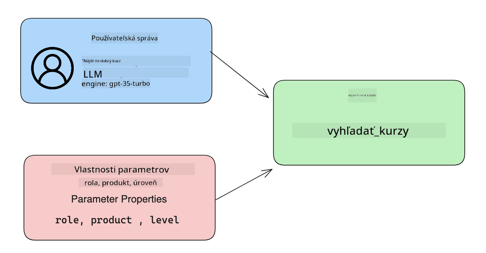

<!--
CO_OP_TRANSLATOR_METADATA:
{
  "original_hash": "f6f84f9ef2d066cd25850cab93580a50",
  "translation_date": "2025-10-17T21:54:12+00:00",
  "source_file": "11-integrating-with-function-calling/README.md",
  "language_code": "sk"
}
-->
# Integrácia s volaním funkcií

[](https://youtu.be/DgUdCLX8qYQ?si=f1ouQU5HQx6F8Gl2)

V predchádzajúcich lekciách ste sa už naučili pomerne veľa. Napriek tomu sa môžeme ešte zlepšiť. Niektoré veci, ktoré môžeme riešiť, zahŕňajú získanie konzistentnejšieho formátu odpovedí, aby sa s nimi dalo ľahšie pracovať v ďalších krokoch. Tiež by sme mohli chcieť pridať údaje z iných zdrojov na ďalšie obohatenie našej aplikácie.

Vyššie uvedené problémy sú predmetom tejto kapitoly.

## Úvod

Táto lekcia pokryje:

- Vysvetlenie, čo je volanie funkcií a aké sú jeho použitia.
- Vytvorenie volania funkcie pomocou Azure OpenAI.
- Ako integrovať volanie funkcie do aplikácie.

## Ciele učenia

Na konci tejto lekcie budete schopní:

- Vysvetliť účel používania volania funkcií.
- Nastaviť volanie funkcie pomocou služby Azure OpenAI.
- Navrhnúť efektívne volania funkcií pre potreby vašej aplikácie.

## Scenár: Zlepšenie nášho chatbotu pomocou funkcií

V tejto lekcii chceme vytvoriť funkciu pre náš startup v oblasti vzdelávania, ktorá umožní používateľom používať chatbot na vyhľadávanie technických kurzov. Budeme odporúčať kurzy, ktoré zodpovedajú ich úrovni zručností, aktuálnej pozícii a technológii, o ktorú majú záujem.

Na dokončenie tohto scenára použijeme kombináciu:

- `Azure OpenAI` na vytvorenie chatovacieho zážitku pre používateľa.
- `Microsoft Learn Catalog API` na pomoc používateľom pri vyhľadávaní kurzov na základe ich požiadaviek.
- `Volanie funkcií` na spracovanie používateľského dotazu a jeho odoslanie do funkcie na vykonanie API požiadavky.

Na začiatok sa pozrime, prečo by sme vôbec chceli používať volanie funkcií:

## Prečo volanie funkcií

Pred volaním funkcií boli odpovede z LLM neštruktúrované a nekonzistentné. Vývojári museli písať zložité validačné kódy, aby zabezpečili, že dokážu spracovať každú variáciu odpovede. Používatelia nemohli dostať odpovede ako "Aké je aktuálne počasie v Štokholme?". To je preto, že modely boli obmedzené na čas, kedy boli údaje trénované.

Volanie funkcií je funkcia služby Azure OpenAI, ktorá prekonáva nasledujúce obmedzenia:

- **Konzistentný formát odpovedí**. Ak dokážeme lepšie kontrolovať formát odpovedí, môžeme ich ľahšie integrovať do ďalších systémov.
- **Externé údaje**. Možnosť používať údaje z iných zdrojov aplikácie v kontexte chatu.

## Ilustrácia problému prostredníctvom scenára

> Odporúčame vám použiť [priložený notebook](./python/aoai-assignment.ipynb?WT.mc_id=academic-105485-koreyst), ak chcete spustiť nižšie uvedený scenár. Môžete tiež len čítať ďalej, pretože sa snažíme ilustrovať problém, kde funkcie môžu pomôcť pri jeho riešení.

Pozrime sa na príklad, ktorý ilustruje problém s formátom odpovedí:

Povedzme, že chceme vytvoriť databázu údajov o študentoch, aby sme im mohli odporučiť správny kurz. Nižšie máme dva popisy študentov, ktoré sú veľmi podobné v údajoch, ktoré obsahujú.

1. Vytvorte pripojenie k nášmu zdroju Azure OpenAI:

   ```python
   import os
   import json
   from openai import AzureOpenAI
   from dotenv import load_dotenv
   load_dotenv()

   client = AzureOpenAI(
   api_key=os.environ['AZURE_OPENAI_API_KEY'],  # this is also the default, it can be omitted
   api_version = "2023-07-01-preview"
   )

   deployment=os.environ['AZURE_OPENAI_DEPLOYMENT']
   ```

   Nižšie je uvedený Python kód na konfiguráciu nášho pripojenia k Azure OpenAI, kde nastavujeme `api_type`, `api_base`, `api_version` a `api_key`.

1. Vytvorenie dvoch popisov študentov pomocou premenných `student_1_description` a `student_2_description`.

   ```python
   student_1_description="Emily Johnson is a sophomore majoring in computer science at Duke University. She has a 3.7 GPA. Emily is an active member of the university's Chess Club and Debate Team. She hopes to pursue a career in software engineering after graduating."

   student_2_description = "Michael Lee is a sophomore majoring in computer science at Stanford University. He has a 3.8 GPA. Michael is known for his programming skills and is an active member of the university's Robotics Club. He hopes to pursue a career in artificial intelligence after finishing his studies."
   ```

   Chceme poslať vyššie uvedené popisy študentov do LLM na analýzu údajov. Tieto údaje môžu byť neskôr použité v našej aplikácii a odoslané do API alebo uložené v databáze.

1. Vytvorme dva identické výzvy, v ktorých inštruujeme LLM, aké informácie nás zaujímajú:

   ```python
   prompt1 = f'''
   Please extract the following information from the given text and return it as a JSON object:

   name
   major
   school
   grades
   club

   This is the body of text to extract the information from:
   {student_1_description}
   '''

   prompt2 = f'''
   Please extract the following information from the given text and return it as a JSON object:

   name
   major
   school
   grades
   club

   This is the body of text to extract the information from:
   {student_2_description}
   '''
   ```

   Vyššie uvedené výzvy inštruujú LLM, aby extrahoval informácie a vrátil odpoveď vo formáte JSON.

1. Po nastavení výziev a pripojenia k Azure OpenAI teraz pošleme výzvy do LLM pomocou `openai.ChatCompletion`. Výzvu uložíme do premennej `messages` a priradíme rolu `user`. Toto simuluje správu od používateľa napísanú chatbotu.

   ```python
   # response from prompt one
   openai_response1 = client.chat.completions.create(
   model=deployment,
   messages = [{'role': 'user', 'content': prompt1}]
   )
   openai_response1.choices[0].message.content

   # response from prompt two
   openai_response2 = client.chat.completions.create(
   model=deployment,
   messages = [{'role': 'user', 'content': prompt2}]
   )
   openai_response2.choices[0].message.content
   ```

Teraz môžeme poslať obe požiadavky do LLM a preskúmať odpoveď, ktorú dostaneme, nájdením ako `openai_response1['choices'][0]['message']['content']`.

1. Nakoniec môžeme odpoveď konvertovať do formátu JSON pomocou volania `json.loads`:

   ```python
   # Loading the response as a JSON object
   json_response1 = json.loads(openai_response1.choices[0].message.content)
   json_response1
   ```

   Odpoveď 1:

   ```json
   {
     "name": "Emily Johnson",
     "major": "computer science",
     "school": "Duke University",
     "grades": "3.7",
     "club": "Chess Club"
   }
   ```

   Odpoveď 2:

   ```json
   {
     "name": "Michael Lee",
     "major": "computer science",
     "school": "Stanford University",
     "grades": "3.8 GPA",
     "club": "Robotics Club"
   }
   ```

   Aj keď sú výzvy rovnaké a popisy sú podobné, vidíme hodnoty vlastnosti `Grades` formátované odlišne, napríklad vo formáte `3.7` alebo `3.7 GPA`.

   Tento výsledok je spôsobený tým, že LLM prijíma neštruktúrované údaje vo forme písomnej výzvy a vracia tiež neštruktúrované údaje. Potrebujeme mať štruktúrovaný formát, aby sme vedeli, čo očakávať pri ukladaní alebo používaní týchto údajov.

Ako teda vyriešiť problém s formátovaním? Použitím volania funkcií môžeme zabezpečiť, že dostaneme späť štruktúrované údaje. Pri použití volania funkcií LLM vlastne nevolá ani nespúšťa žiadne funkcie. Namiesto toho vytvárame štruktúru, ktorú LLM dodržiava pri svojich odpovediach. Potom používame tieto štruktúrované odpovede na určenie, akú funkciu spustiť v našich aplikáciách.


Potom môžeme vziať to, čo sa vráti z funkcie, a poslať to späť do LLM. LLM potom odpovie pomocou prirodzeného jazyka na zodpovedanie používateľského dotazu.

## Použitie volania funkcií

Existuje mnoho rôznych spôsobov použitia volania funkcií, ktoré môžu zlepšiť vašu aplikáciu, napríklad:

- **Volanie externých nástrojov**. Chatboty sú skvelé na poskytovanie odpovedí na otázky používateľov. Použitím volania funkcií môžu chatboty používať správy od používateľov na vykonanie určitých úloh. Napríklad študent môže požiadať chatbot: "Pošli e-mail môjmu inštruktorovi, že potrebujem viac pomoci s touto témou". To môže vykonať volanie funkcie `send_email(to: string, body: string)`.

- **Vytváranie API alebo databázových dotazov**. Používatelia môžu nájsť informácie pomocou prirodzeného jazyka, ktorý sa konvertuje na formátovaný dotaz alebo API požiadavku. Príkladom môže byť učiteľ, ktorý sa pýta: "Ktorí študenti dokončili poslednú úlohu", čo by mohlo zavolať funkciu `get_completed(student_name: string, assignment: int, current_status: string)`.

- **Vytváranie štruktúrovaných údajov**. Používatelia môžu vziať blok textu alebo CSV a použiť LLM na extrahovanie dôležitých informácií z neho. Napríklad študent môže konvertovať článok z Wikipédie o mierových dohodách na vytvorenie AI kartičiek. To sa dá urobiť pomocou funkcie `get_important_facts(agreement_name: string, date_signed: string, parties_involved: list)`.

## Vytvorenie prvého volania funkcie

Proces vytvorenia volania funkcie zahŕňa 3 hlavné kroky:

1. **Volanie** API Chat Completions s zoznamom vašich funkcií a správou od používateľa.
2. **Čítanie** odpovede modelu na vykonanie akcie, napr. vykonanie funkcie alebo API požiadavky.
3. **Vykonanie** ďalšieho volania API Chat Completions s odpoveďou z vašej funkcie na použitie týchto informácií na vytvorenie odpovede pre používateľa.



### Krok 1 - vytvorenie správ

Prvým krokom je vytvorenie správy od používateľa. Táto správa môže byť dynamicky priradená z hodnoty textového vstupu alebo ju môžete priradiť tu. Ak je to váš prvýkrát, čo pracujete s API Chat Completions, musíme definovať `role` a `content` správy.

`Role` môže byť buď `system` (vytváranie pravidiel), `assistant` (model) alebo `user` (koncový používateľ). Pre volanie funkcií to priradíme ako `user` a uvedieme príklad otázky.

```python
messages= [ {"role": "user", "content": "Find me a good course for a beginner student to learn Azure."} ]
```

Priradením rôznych rolí je jasné pre LLM, či niečo hovorí systém alebo používateľ, čo pomáha budovať históriu konverzácie, na ktorej môže LLM stavať.

### Krok 2 - vytvorenie funkcií

Ďalej definujeme funkciu a parametre tejto funkcie. Použijeme len jednu funkciu nazvanú `search_courses`, ale môžete vytvoriť viacero funkcií.

> **Dôležité**: Funkcie sú zahrnuté v systémovej správe pre LLM a budú zahrnuté do dostupného počtu tokenov, ktoré máte k dispozícii.

Nižšie vytvárame funkcie ako pole položiek. Každá položka je funkcia a má vlastnosti `name`, `description` a `parameters`:

```python
functions = [
   {
      "name":"search_courses",
      "description":"Retrieves courses from the search index based on the parameters provided",
      "parameters":{
         "type":"object",
         "properties":{
            "role":{
               "type":"string",
               "description":"The role of the learner (i.e. developer, data scientist, student, etc.)"
            },
            "product":{
               "type":"string",
               "description":"The product that the lesson is covering (i.e. Azure, Power BI, etc.)"
            },
            "level":{
               "type":"string",
               "description":"The level of experience the learner has prior to taking the course (i.e. beginner, intermediate, advanced)"
            }
         },
         "required":[
            "role"
         ]
      }
   }
]
```

Podrobnejšie popíšeme každú inštanciu funkcie nižšie:

- `name` - Názov funkcie, ktorú chceme zavolať.
- `description` - Popis, ako funkcia funguje. Tu je dôležité byť konkrétny a jasný.
- `parameters` - Zoznam hodnôt a formát, ktorý chcete, aby model produkoval vo svojej odpovedi. Pole parametrov pozostáva z položiek, kde položky majú nasledujúce vlastnosti:
  1.  `type` - Typ údajov, v ktorých budú vlastnosti uložené.
  1.  `properties` - Zoznam konkrétnych hodnôt, ktoré model použije pre svoju odpoveď.
      1. `name` - Kľúč je názov vlastnosti, ktorú model použije vo svojej formátovanej odpovedi, napríklad `product`.
      1. `type` - Typ údajov tejto vlastnosti, napríklad `string`.
      1. `description` - Popis konkrétnej vlastnosti.

Existuje aj voliteľná vlastnosť `required` - povinná vlastnosť pre dokončenie volania funkcie.

### Krok 3 - vykonanie volania funkcie

Po definovaní funkcie ju teraz musíme zahrnúť do volania API Chat Completion. Urobíme to pridaním `functions` do požiadavky. V tomto prípade `functions=functions`.

Existuje tiež možnosť nastaviť `function_call` na `auto`. To znamená, že necháme LLM rozhodnúť, ktorá funkcia by mala byť zavolaná na základe správy od používateľa, namiesto toho, aby sme ju priradili sami.

Tu je nižšie uvedený kód, kde voláme `ChatCompletion.create`, všimnite si, ako nastavujeme `functions=functions` a `function_call="auto"` a tým dávame LLM možnosť rozhodnúť, kedy zavolať poskytnuté funkcie:

```python
response = client.chat.completions.create(model=deployment,
                                        messages=messages,
                                        functions=functions,
                                        function_call="auto")

print(response.choices[0].message)
```

Odpoveď, ktorá sa teraz vracia, vyzerá takto:

```json
{
  "role": "assistant",
  "function_call": {
    "name": "search_courses",
    "arguments": "{\n  \"role\": \"student\",\n  \"product\": \"Azure\",\n  \"level\": \"beginner\"\n}"
  }
}
```

Tu vidíme, ako bola funkcia `search_courses` zavolaná a s akými argumentmi, ako je uvedené vo vlastnosti `arguments` v JSON odpovedi.

Záver je, že LLM dokázal nájsť údaje, ktoré zodpovedajú argumentom funkcie, keď ich extrahoval z hodnoty poskytnutej parametru `messages` vo volaní API Chat Completion. Nižšie je pripomenutie hodnoty `messages`:

```python
messages= [ {"role": "user", "content": "Find me a good course for a beginner student to learn Azure."} ]
```

Ako vidíte, `student`, `Azure` a `beginner` boli extrahované z `messages` a nastavené ako vstup do funkcie. Používanie funkcií týmto spôsobom je skvelý spôsob, ako extrahovať informácie z výzvy, ale tiež poskytnúť štruktúru LLM a mať opakovateľnú funkcionalitu.

Ďalej musíme vidieť, ako to môžeme použiť v našej aplikácii.

## Integrácia volania funkcií do aplikácie

Po otestovaní formátovanej odpovede z LLM môžeme teraz integrovať túto funkciu do našej aplikácie.

### Riadenie toku

Na integráciu tejto funkcie do našej aplikácie postupujeme podľa nasledujúcich krokov:

1. Najprv vykonáme volanie do služieb OpenAI a uložíme správu do premennej nazvanej `response_message`.

   ```python
   response_message = response.choices[0].message
   ```

1. Teraz definujeme funkciu, ktorá zavolá Microsoft Learn API na získanie zoznamu kurzov:

   ```python
   import requests

   def search_courses(role, product, level):
     url = "https://learn.microsoft.com/api/catalog/"
     params = {
        "role": role,
        "product": product,
        "level": level
     }
     response = requests.get(url, params=params)
     modules = response.json()["modules"]
     results = []
     for module in modules[:5]:
        title = module["title"]
        url = module["url"]
        results.append({"title": title, "url": url})
     return str(results)
   ```

   Všimnite si, ako teraz vytvárame skutočnú Python funkciu, ktorá mapuje názvy funkcií predstavené vo variabilnej `functions`. Taktiež vykonávame skutočné externé API volania na získanie potrebných údajov. V tomto prípade sa obraciame na Microsoft Learn API na vyhľadávanie vzdelávacích modulov.

Ok, takže sme vytvorili premenné `functions` a zodpovedajúcu Python funkciu, ako môžeme povedať LLM, ako ich mapovať, aby sa zavolala naša Python funkcia?

1. Aby sme zistili, či potrebujeme zavolať Python funkciu, musíme sa pozrieť do odpovede LLM a zistiť, či `function_call` je jej súčasťou, a zavolať uvedenú funkciu. Tu je uvedené, ako môžete vykonať uvedenú kontrolu nižšie:

   ```python
   # Check if the model wants to call a function
   if response_message.function_call.name:
    print("Recommended Function call:")
    print(response_message.function_call.name)
    print()

    # Call the function.
    function_name = response_message.function_call.name

    available_functions = {
            "search_courses": search_courses,
    }
    function_to_call = available_functions[function_name]

    function_args = json.loads(response_message.function_call.arguments)
    function_response = function_to_call(**function_args)

    print("Output of function call:")
    print(function_response)
    print(type(function_response))


    # Add the assistant response and function response to the messages
    messages.append( # adding assistant response to messages
        {
            "role": response_message.role,
            "function_call": {
                "name": function_name,
                "arguments": response_message.function_call.arguments,
            },
            "content": None
        }
    )
    messages.append( # adding function response to messages
        {
            "role": "function",
            "name": function_name,
            "content":function_response,
        }
    )
   ```

   Tieto tri riadky zabezpečujú, že extrahujeme názov funkcie, argumenty a vykonáme volanie:

   ```python
   function_to_call = available_functions[function_name]

   function_args = json.loads(response_message.function_call.arguments)
   function_response = function_to_call(**function_args)
   ```

   Nižšie je výstup z behu nášho kódu:

   **Výstup**

   ```Recommended Function call:
   {
     "name": "search_courses",
     "arguments": "{\n  \"role\": \"student\",\n  \"product\": \"Azure\",\n  \"level\": \"beginner\"\n}"
   }

   Output of function call:
   [{'title': 'Describe concepts of cryptography', 'url': 'https://learn.microsoft.com/training/modules/describe-concepts-of-cryptography/?
   WT.mc_id=api_CatalogApi'}, {'title': 'Introduction to audio classification with TensorFlow', 'url': 'https://learn.microsoft.com/en-
   us/training/modules/intro-audio-classification-tensorflow/?WT.mc_id=api_CatalogApi'}, {'title': 'Design a Performant Data Model in Azure SQL
   Database with Azure Data Studio', 'url': 'https://learn.microsoft.com/training/modules/design-a-data-model-with-ads/?
   WT.mc_id=api_CatalogApi'}, {'title': 'Getting started with the Microsoft Cloud Adoption Framework for Azure', 'url':
   'https://learn.microsoft.com/training/modules/cloud-adoption-framework-getting-started/?WT.mc_id=api_CatalogApi'}, {'title': 'Set up the
   Rust development environment', 'url': 'https://learn.microsoft.com/training/modules/rust-set-up-environment/?WT.mc_id=api_CatalogApi'}]
   <class 'str'>
   ```

1. Teraz pošleme aktualizovanú správu, `messages`, do LLM, aby sme mohli dostať odpoveď v prirodzenom jazyku namiesto API JSON formátovanej odpovede.

   ```python
   print("Messages in next request:")
   print(messages)
   print()

   second_response = client.chat.completions.create(
      messages=messages,
      model=deployment,
      function_call="auto",
      functions=functions,
      temperature=0
         )  # get a new response from GPT where it can see the function response


   print(second_response.choices[0].message)
   ```

   **Výstup**

   ```python
   {
     "role": "assistant",
     "content": "I found some good courses for beginner students to learn Azure:\n\n1. [Describe concepts of cryptography] (https://learn.microsoft.com/training/modules/describe-concepts-of-cryptography/?WT.mc_id=api_CatalogApi)\n2. [Introduction to audio classification with TensorFlow](https://learn.microsoft.com/training/modules/intro-audio-classification-tensorflow/?WT.mc_id=api_CatalogApi)\n3. [Design a Performant Data Model in Azure SQL Database with Azure Data Studio](https://learn.microsoft.com/training/modules/design-a-data-model-with-ads/?WT.mc_id=api_CatalogApi)\n4. [Getting started with the Microsoft Cloud Adoption Framework for Azure](https://learn.microsoft.com/training/modules/cloud-adoption-framework-getting-started/?WT.mc_id=api_CatalogApi)\n5. [Set up the Rust development environment](https://learn.microsoft.com/training/modules/rust-set-up-environment/?WT.mc_id=api_CatalogApi)\n\nYou can click on the links to access the courses."
   }

   ```

## Zadanie

Na pokračovanie vášho učenia o Azure OpenAI Function Calling môžete vytvoriť:

- Viac parametrov funkcie, ktoré môžu pomôcť študentom nájsť viac kurzov.
- Vytvorte ďalšie volanie funkcie, ktoré zohľadní viac informácií o študentovi, napríklad jeho rodný jazyk.
- Vytvorte spracovanie chýb, keď volanie funkcie a/alebo volanie API nevráti žiadne vhodné kurzy.

Tip: Pozrite si stránku [Learn API referenčná dokumentácia](https://learn.microsoft.com/training/support/catalog-api-developer-reference?WT.mc_id=academic-105485-koreyst), aby ste zistili, ako a kde sú tieto údaje dostupné.

## Skvelá práca! Pokračujte v ceste

Po dokončení tejto lekcie si pozrite našu [kolekciu učenia o generatívnej AI](https://aka.ms/genai-collection?WT.mc_id=academic-105485-koreyst), aby ste pokračovali v rozvíjaní svojich znalostí o generatívnej AI!

Prejdite na Lekciu 12, kde sa pozrieme na to, ako [navrhnúť UX pre AI aplikácie](../12-designing-ux-for-ai-applications/README.md?WT.mc_id=academic-105485-koreyst)!

---

**Zrieknutie sa zodpovednosti**:  
Tento dokument bol preložený pomocou služby AI prekladu [Co-op Translator](https://github.com/Azure/co-op-translator). Hoci sa snažíme o presnosť, prosím, berte na vedomie, že automatizované preklady môžu obsahovať chyby alebo nepresnosti. Pôvodný dokument v jeho rodnom jazyku by mal byť považovaný za autoritatívny zdroj. Pre kritické informácie sa odporúča profesionálny ľudský preklad. Nie sme zodpovední za žiadne nedorozumenia alebo nesprávne interpretácie vyplývajúce z použitia tohto prekladu.