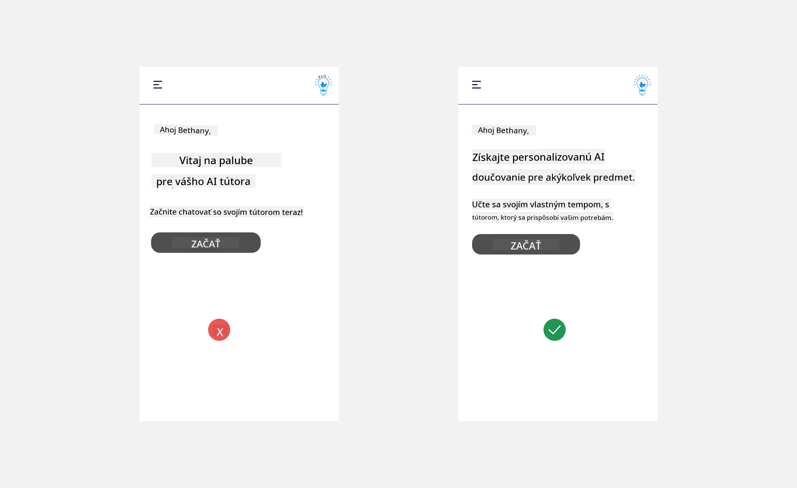
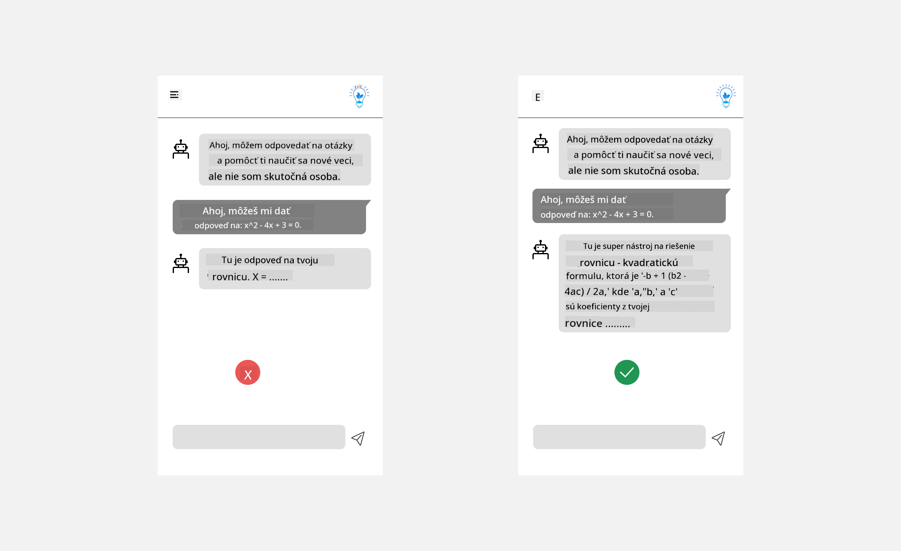
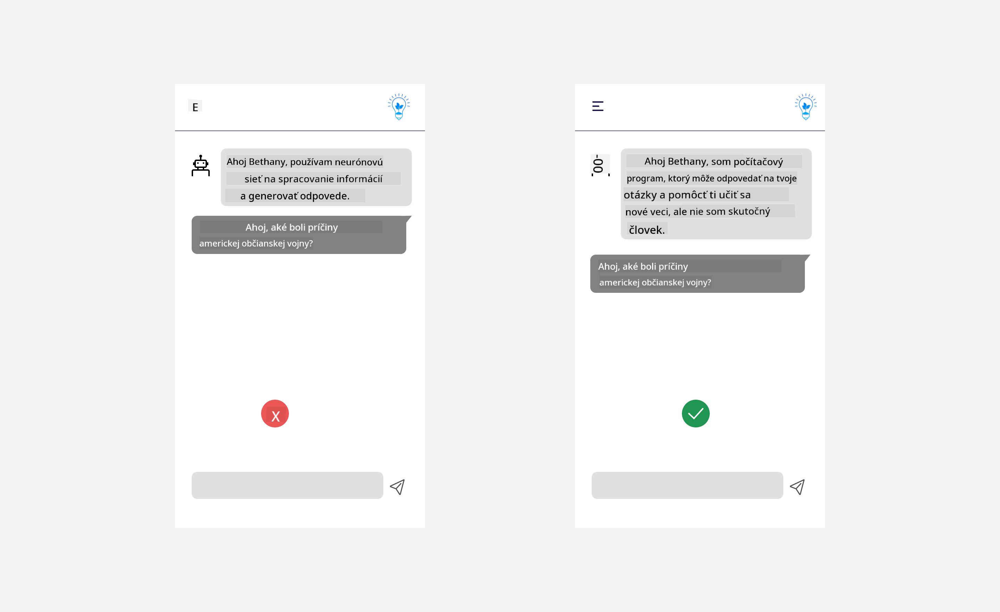
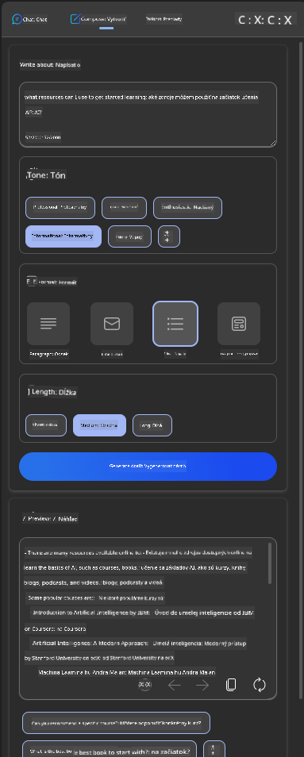
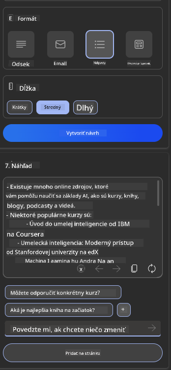
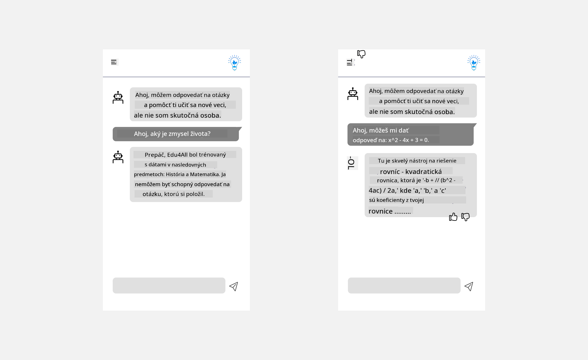

<!--
CO_OP_TRANSLATOR_METADATA:
{
  "original_hash": "ec385b41ee50579025d50cc03bfb3a25",
  "translation_date": "2025-05-19T22:04:51+00:00",
  "source_file": "12-designing-ux-for-ai-applications/README.md",
  "language_code": "sk"
}
-->
# Navrhovanie UX pre AI aplikácie

> _(Kliknite na obrázok vyššie, aby ste si pozreli video tejto lekcie)_

Používateľský zážitok je veľmi dôležitým aspektom pri tvorbe aplikácií. Používatelia musia byť schopní efektívne používať vašu aplikáciu na vykonávanie úloh. Byť efektívny je jedna vec, ale tiež musíte navrhnúť aplikácie tak, aby ich mohli používať všetci, aby boli _prístupné_. Táto kapitola sa zameriava na túto oblasť, aby ste skončili s návrhom aplikácie, ktorú ľudia môžu a chcú používať.

## Úvod

Používateľský zážitok je spôsob, akým používateľ interaguje a používa konkrétny produkt alebo službu, či už je to systém, nástroj alebo dizajn. Pri vývoji AI aplikácií sa vývojári nielen zameriavajú na zabezpečenie efektívneho používateľského zážitku, ale aj na etiku. V tejto lekcii pokrývame, ako vytvárať aplikácie umelej inteligencie (AI), ktoré riešia potreby používateľov.

Lekcia pokryje nasledujúce oblasti:

- Úvod do používateľského zážitku a pochopenie potrieb používateľov
- Navrhovanie AI aplikácií pre dôveru a transparentnosť
- Navrhovanie AI aplikácií pre spoluprácu a spätnú väzbu

## Ciele učenia

Po absolvovaní tejto lekcie budete schopní:

- Pochopiť, ako budovať AI aplikácie, ktoré spĺňajú potreby používateľov.
- Navrhovať AI aplikácie, ktoré podporujú dôveru a spoluprácu.

### Predpoklad

Venujte nejaký čas a prečítajte si viac o [používateľskom zážitku a dizajnovom myslení.](https://learn.microsoft.com/training/modules/ux-design?WT.mc_id=academic-105485-koreyst)

## Úvod do používateľského zážitku a pochopenie potrieb používateľov

V našom fiktívnom vzdelávacom startupe máme dvoch hlavných používateľov, učiteľov a študentov. Každý z týchto dvoch používateľov má jedinečné potreby. Dizajn zameraný na používateľa uprednostňuje používateľa, čím zabezpečuje, že produkty sú relevantné a prospešné pre tých, pre ktorých sú určené.

Aplikácia by mala byť **užitočná, spoľahlivá, prístupná a príjemná**, aby poskytovala dobrý používateľský zážitok.

### Použiteľnosť

Byť užitočný znamená, že aplikácia má funkčnosť, ktorá zodpovedá jej zamýšľanému účelu, ako je automatizácia procesu hodnotenia alebo generovanie kartičiek na opakovanie. Aplikácia, ktorá automatizuje proces hodnotenia, by mala byť schopná presne a efektívne prideľovať skóre študentským prácam na základe vopred stanovených kritérií. Podobne, aplikácia, ktorá generuje kartičky na opakovanie, by mala byť schopná vytvárať relevantné a rozmanité otázky na základe svojich údajov.

### Spoľahlivosť

Byť spoľahlivý znamená, že aplikácia môže vykonávať svoju úlohu konzistentne a bez chýb. Avšak AI, rovnako ako ľudia, nie je dokonalá a môže byť náchylná na chyby. Aplikácie môžu naraziť na chyby alebo neočakávané situácie, ktoré vyžadujú ľudský zásah alebo opravu. Ako riešite chyby? V poslednej časti tejto lekcie pokryjeme, ako sú AI systémy a aplikácie navrhnuté pre spoluprácu a spätnú väzbu.

### Prístupnosť

Byť prístupný znamená rozšíriť používateľský zážitok na používateľov s rôznymi schopnosťami, vrátane tých s postihnutím, aby sa nikto necítil vynechaný. Dodržiavaním zásad a pokynov prístupnosti sa AI riešenia stávajú inkluzívnejšími, použiteľnejšími a prospešnejšími pre všetkých používateľov.

### Príjemnosť

Byť príjemný znamená, že aplikácia je príjemná na používanie. Atraktívny používateľský zážitok môže mať pozitívny vplyv na používateľa, povzbudiť ho, aby sa k aplikácii vrátil, a zvýšiť obchodné príjmy.

Nie každú výzvu je možné vyriešiť pomocou AI. AI prichádza, aby posilnila váš používateľský zážitok, či už automatizáciou manuálnych úloh alebo personalizáciou používateľských zážitkov.

## Navrhovanie AI aplikácií pre dôveru a transparentnosť

Budovanie dôvery je kľúčové pri navrhovaní AI aplikácií. Dôvera zabezpečuje, že používateľ je presvedčený, že aplikácia vykoná prácu, dodá výsledky konzistentne a výsledky sú to, čo používateľ potrebuje. Rizikom v tejto oblasti je nedôvera a prehnaná dôvera. Nedôvera nastáva, keď používateľ má málo alebo žiadnu dôveru v AI systém, čo vedie k tomu, že používateľ vašu aplikáciu odmieta. Prehnaná dôvera nastáva, keď používateľ precení schopnosti AI systému, čo vedie k tomu, že používatelia dôverujú AI systému príliš. Napríklad automatizovaný systém hodnotenia v prípade prehnanej dôvery môže viesť k tomu, že učiteľ nepreverí niektoré z prác, aby sa uistil, že hodnotiaci systém funguje správne. To by mohlo mať za následok nespravodlivé alebo nepresné známky pre študentov alebo zmeškané príležitosti na spätnú väzbu a zlepšenie.

Dva spôsoby, ako zabezpečiť, že dôvera je umiestnená priamo v strede návrhu, sú vysvetliteľnosť a kontrola.

### Vysvetliteľnosť

Keď AI pomáha informovať rozhodnutia, ako je odovzdávanie vedomostí budúcim generáciám, je dôležité, aby učitelia a rodičia pochopili, ako sú rozhodnutia AI urobené. Toto je vysvetliteľnosť - pochopenie toho, ako AI aplikácie robia rozhodnutia. Navrhovanie pre vysvetliteľnosť zahŕňa pridanie detailov príkladov toho, čo AI aplikácia dokáže. Napríklad namiesto "Začnite s AI učiteľom" môže systém použiť: "Zhrňte si poznámky pre ľahšie opakovanie pomocou AI."

Ďalším príkladom je, ako AI používa používateľské a osobné údaje. Napríklad používateľ s personou študent môže mať obmedzenia na základe svojej persony. AI nemusí byť schopná odhaliť odpovede na otázky, ale môže pomôcť používateľovi premýšľať, ako môže vyriešiť problém.

Jednou z posledných kľúčových častí vysvetliteľnosti je zjednodušenie vysvetlení. Študenti a učitelia nemusia byť odborníkmi na AI, preto by vysvetlenia toho, čo aplikácia môže alebo nemôže robiť, mali byť zjednodušené a ľahko pochopiteľné.

### Kontrola

Generatívna AI vytvára spoluprácu medzi AI a používateľom, kde napríklad používateľ môže modifikovať výzvy pre rôzne výsledky. Okrem toho, keď je výstup generovaný, používatelia by mali byť schopní modifikovať výsledky, čím získajú pocit kontroly. Napríklad pri používaní Bingu môžete prispôsobiť svoju výzvu na základe formátu, tónu a dĺžky. Okrem toho môžete pridať zmeny do svojho výstupu a modifikovať výstup, ako je uvedené nižšie:

Ďalšou funkciou v Bingu, ktorá umožňuje používateľovi mať kontrolu nad aplikáciou, je možnosť zapojiť sa a odhlásiť sa z údajov, ktoré AI používa. Pre školskú aplikáciu môže študent chcieť použiť svoje poznámky, ako aj učiteľské zdroje ako materiál na opakovanie.

> Pri navrhovaní AI aplikácií je úmyselnosť kľúčová na zabezpečenie toho, aby používatelia neprehnane dôverovali a nestanovovali nereálne očakávania ohľadom jej schopností. Jedným zo spôsobov, ako to dosiahnuť, je vytvoriť trenie medzi výzvami a výsledkami. Pripomínajúc používateľovi, že toto je AI a nie iný človek.

## Navrhovanie AI aplikácií pre spoluprácu a spätnú väzbu

Ako už bolo spomenuté, generatívna AI vytvára spoluprácu medzi používateľom a AI. Väčšina interakcií je s používateľom, ktorý zadáva výzvu, a AI generuje výstup. Čo ak je výstup nesprávny? Ako aplikácia rieši chyby, ak sa vyskytnú? Obviňuje AI používateľa alebo si dáva čas na vysvetlenie chyby?

AI aplikácie by mali byť postavené tak, aby prijímali a poskytovali spätnú väzbu. To nielen pomáha AI systému zlepšovať sa, ale tiež buduje dôveru s používateľmi. Do návrhu by mal byť zahrnutý spätnoväzbový cyklus, príkladom môže byť jednoduché palec hore alebo dole na výstupe.

Ďalším spôsobom, ako to riešiť, je jasne komunikovať schopnosti a obmedzenia systému. Keď používateľ urobí chybu a požiada o niečo nad rámec schopností AI, malo by existovať aj spôsob, ako to riešiť, ako je uvedené nižšie.

Systémové chyby sú bežné pri aplikáciách, kde používateľ môže potrebovať pomoc s informáciami mimo rozsahu AI alebo aplikácia môže mať limit na to, koľko otázok/predmetov môže používateľ generovať súhrny. Napríklad AI aplikácia vyškolená s údajmi na obmedzených predmetoch, napríklad História a Matematika, nemusí byť schopná riešiť otázky okolo Geografie. Na zmiernenie tohto problému môže AI systém poskytnúť odpoveď ako: "Prepáčte, náš produkt bol vyškolený s údajmi na nasledujúcich predmetoch....., nemôžem odpovedať na otázku, ktorú ste položili."

AI aplikácie nie sú dokonalé, preto sú náchylné robiť chyby. Pri navrhovaní vašich aplikácií by ste mali zabezpečiť, aby ste vytvorili priestor pre spätnú väzbu od používateľov a riešenie chýb spôsobom, ktorý je jednoduchý a ľahko vysvetliteľný.

## Zadanie

Vezmite si akékoľvek AI aplikácie, ktoré ste doteraz vytvorili, a zvážte implementáciu nasledujúcich krokov vo vašej aplikácii:

- **Príjemnosť:** Zvážte, ako môžete urobiť vašu aplikáciu príjemnejšou. Pridávate vysvetlenia všade? Povzbudzujete používateľa, aby skúmal? Ako formulujete svoje chybové správy?

- **Použiteľnosť:** Vytvorte webovú aplikáciu. Uistite sa, že vaša aplikácia je navigovateľná pomocou myši aj klávesnice.

- **Dôvera a transparentnosť:** Neúplne dôverujte AI a jej výstupu, zvážte, ako by ste pridali človeka do procesu na overenie výstupu. Tiež zvážte a implementujte iné spôsoby, ako dosiahnuť dôveru a transparentnosť.

- **Kontrola:** Dajte používateľovi kontrolu nad údajmi, ktoré poskytuje aplikácii. Implementujte spôsob, ako sa používateľ môže zapojiť a odhlásiť sa zo zberu údajov v AI aplikácii.

## Pokračujte vo svojom učení!

Po dokončení tejto lekcie si pozrite našu [zbierku učenia o generatívnej AI](https://aka.ms/genai-collection?WT.mc_id=academic-105485-koreyst), aby ste pokračovali v zvyšovaní svojich znalostí o generatívnej AI!

Prejdite na Lekciu 13, kde sa pozrieme na to, ako [zabezpečiť AI aplikácie](../13-securing-ai-applications/README.md?WT.mc_id=academic-105485-koreyst)!

**Upozornenie**:  
Tento dokument bol preložený pomocou služby prekladania AI [Co-op Translator](https://github.com/Azure/co-op-translator). Aj keď sa snažíme o presnosť, prosím berte na vedomie, že automatizované preklady môžu obsahovať chyby alebo nepresnosti. Pôvodný dokument v jeho rodnom jazyku by mal byť považovaný za autoritatívny zdroj. Pre kritické informácie sa odporúča profesionálny ľudský preklad. Nie sme zodpovední za žiadne nedorozumenia alebo nesprávne interpretácie vyplývajúce z použitia tohto prekladu.