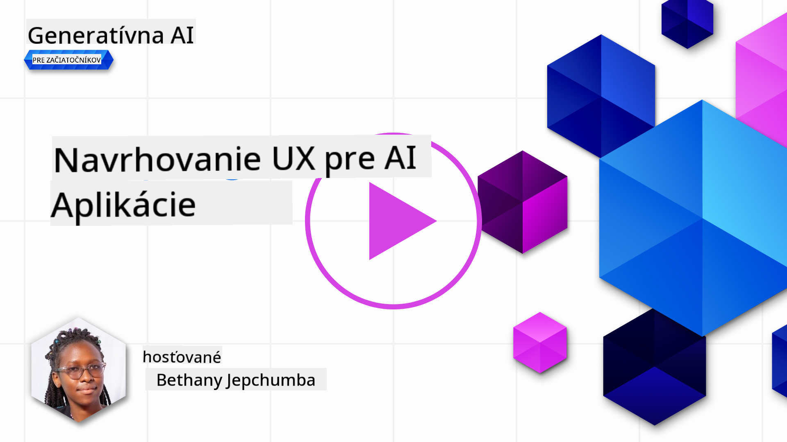
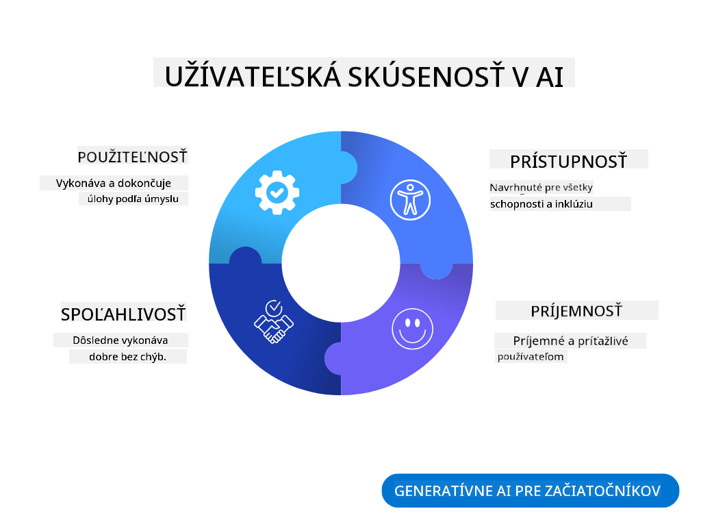
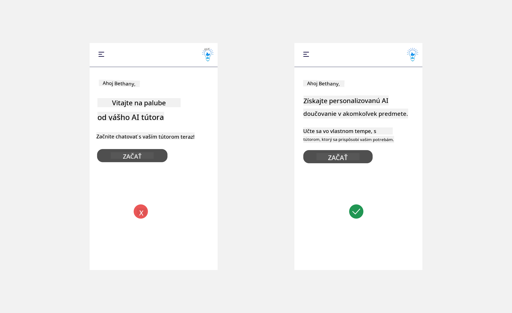
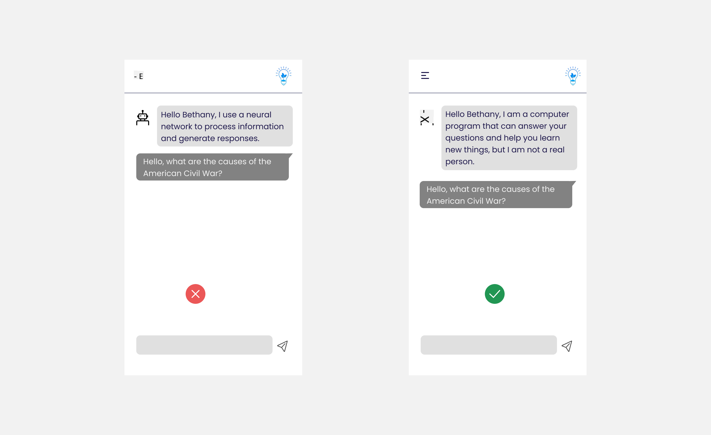
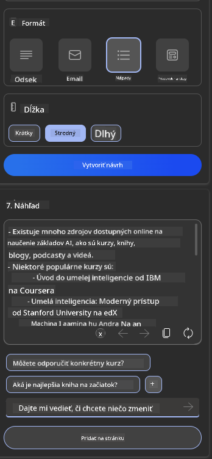

<!--
CO_OP_TRANSLATOR_METADATA:
{
  "original_hash": "ec385b41ee50579025d50cc03bfb3a25",
  "translation_date": "2025-07-09T15:04:13+00:00",
  "source_file": "12-designing-ux-for-ai-applications/README.md",
  "language_code": "sk"
}
-->
# Návrh UX pre AI aplikácie

> _(Kliknite na obrázok vyššie pre zobrazenie videa tejto lekcie)_

Používateľská skúsenosť je veľmi dôležitý aspekt pri tvorbe aplikácií. Používatelia musia byť schopní efektívne používať vašu aplikáciu na vykonávanie úloh. Efektivita je jedna vec, no zároveň musíte navrhovať aplikácie tak, aby ich mohol používať každý, teda aby boli _prístupné_. Táto kapitola sa zameria práve na túto oblasť, aby ste nakoniec navrhli aplikáciu, ktorú ľudia budú chcieť a môcť používať.

## Úvod

Používateľská skúsenosť je spôsob, akým používateľ interaguje a používa konkrétny produkt alebo službu, či už ide o systém, nástroj alebo dizajn. Pri vývoji AI aplikácií sa vývojári zameriavajú nielen na to, aby bola používateľská skúsenosť efektívna, ale aj etická. V tejto lekcii sa venujeme tomu, ako vytvárať aplikácie umelej inteligencie (AI), ktoré zodpovedajú potrebám používateľov.

Lekcia pokryje nasledujúce oblasti:

- Úvod do používateľskej skúsenosti a pochopenie potrieb používateľov
- Návrh AI aplikácií pre dôveru a transparentnosť
- Návrh AI aplikácií pre spoluprácu a spätnú väzbu

## Ciele učenia

Po absolvovaní tejto lekcie budete schopní:

- Pochopiť, ako vytvárať AI aplikácie, ktoré spĺňajú potreby používateľov.
- Navrhovať AI aplikácie, ktoré podporujú dôveru a spoluprácu.

### Predpoklady

Venujte chvíľu času a prečítajte si viac o [používateľskej skúsenosti a design thinkingu.](https://learn.microsoft.com/training/modules/ux-design?WT.mc_id=academic-105485-koreyst)

## Úvod do používateľskej skúsenosti a pochopenie potrieb používateľov

V našom fiktívnom vzdelávacom startupe máme dvoch hlavných používateľov – učiteľov a študentov. Každý z nich má jedinečné potreby. Dizajn zameraný na používateľa kladie používateľa na prvé miesto a zabezpečuje, že produkty sú relevantné a prospešné pre tých, pre ktorých sú určené.

Aplikácia by mala byť **užitočná, spoľahlivá, prístupná a príjemná**, aby poskytla dobrú používateľskú skúsenosť.

### Použiteľnosť

Byť užitočný znamená, že aplikácia má funkcie, ktoré zodpovedajú jej účelu, napríklad automatizácia hodnotenia alebo generovanie kartičiek na opakovanie učiva. Aplikácia, ktorá automatizuje hodnotenie, by mala byť schopná presne a efektívne priraďovať známky na základe vopred definovaných kritérií. Podobne aplikácia generujúca kartičky na opakovanie by mala vytvárať relevantné a rôznorodé otázky na základe svojich dát.

### Spoľahlivosť

Byť spoľahlivý znamená, že aplikácia dokáže svoju úlohu vykonávať konzistentne a bez chýb. Avšak AI, rovnako ako ľudia, nie je dokonalá a môže robiť chyby. Aplikácie môžu naraziť na chyby alebo neočakávané situácie, ktoré vyžadujú ľudský zásah alebo opravu. Ako riešite chyby? V poslednej časti tejto lekcie sa budeme venovať tomu, ako sú AI systémy a aplikácie navrhnuté pre spoluprácu a spätnú väzbu.

### Prístupnosť

Byť prístupný znamená rozšíriť používateľskú skúsenosť aj na používateľov s rôznymi schopnosťami, vrátane osôb so zdravotným postihnutím, aby nikto nebol vylúčený. Dodržiavaním zásad a odporúčaní pre prístupnosť sa AI riešenia stávajú inkluzívnejšími, použiteľnejšími a prospešnejšími pre všetkých používateľov.

### Príjemnosť

Byť príjemný znamená, že používanie aplikácie je zábavné a pohodlné. Pútavá používateľská skúsenosť môže mať pozitívny vplyv na používateľa, povzbudzujúc ho k opakovanému používaniu aplikácie a zvyšujúc tak príjmy firmy.

Nie každý problém sa dá vyriešiť pomocou AI. AI slúži na doplnenie používateľskej skúsenosti, či už automatizáciou manuálnych úloh alebo personalizáciou používateľských zážitkov.

## Návrh AI aplikácií pre dôveru a transparentnosť

Budovanie dôvery je kľúčové pri navrhovaní AI aplikácií. Dôvera zabezpečuje, že používateľ má istotu, že aplikácia splní úlohu, poskytne konzistentné výsledky a výsledky budú zodpovedať jeho potrebám. Rizikom v tejto oblasti je nedôvera a prílišná dôvera. Nedôvera nastáva, keď používateľ nemá alebo má len malú dôveru v AI systém, čo vedie k odmietnutiu aplikácie. Prílišná dôvera nastáva, keď používateľ precení schopnosti AI systému, čo vedie k nadmernému spoliehaniu sa na AI. Napríklad v prípade automatizovaného hodnotenia môže prílišná dôvera viesť k tomu, že učiteľ neprekontroluje niektoré práce, aby sa uistil, že hodnotiaci systém funguje správne. To môže mať za následok nespravodlivé alebo nepresné známky pre študentov alebo stratené príležitosti na spätnú väzbu a zlepšenie.

Dva spôsoby, ako zabezpečiť, aby dôvera bola v centre dizajnu, sú vysvetliteľnosť a kontrola.

### Vysvetliteľnosť

Keď AI pomáha pri rozhodovaní, napríklad pri odovzdávaní vedomostí budúcim generáciám, je pre učiteľov a rodičov kľúčové pochopiť, ako AI rozhodnutia vznikajú. To je vysvetliteľnosť – pochopenie, ako AI aplikácie prijímajú rozhodnutia. Návrh pre vysvetliteľnosť zahŕňa pridávanie príkladov toho, čo AI aplikácia dokáže. Napríklad namiesto „Začnite s AI učiteľom“ môže systém použiť: „Zhrňte si poznámky pre jednoduchšie opakovanie pomocou AI.“

Ďalším príkladom je, ako AI využíva používateľské a osobné údaje. Napríklad používateľ s personou študenta môže mať obmedzenia založené na svojej persone. AI nemusí byť schopná odhaliť odpovede na otázky, ale môže pomôcť používateľa viesť k tomu, aby sám premýšľal, ako problém vyriešiť.

Poslednou kľúčovou súčasťou vysvetliteľnosti je zjednodušenie vysvetlení. Študenti a učitelia nemusia byť odborníkmi na AI, preto by vysvetlenia o tom, čo aplikácia dokáže alebo nedokáže, mali byť jednoduché a ľahko pochopiteľné.

### Kontrola

Generatívna AI vytvára spoluprácu medzi AI a používateľom, kde napríklad používateľ môže upravovať vstupy pre rôzne výsledky. Okrem toho, keď je výstup vygenerovaný, používatelia by mali mať možnosť výsledky upravovať, čo im dáva pocit kontroly. Napríklad pri používaní Bing môžete prispôsobiť svoj vstup podľa formátu, tónu a dĺžky. Okrem toho môžete pridať zmeny do výstupu a upraviť ho, ako je to znázornené nižšie:

Ďalšou funkciou v Bingu, ktorá umožňuje používateľovi mať kontrolu nad aplikáciou, je možnosť zapnúť alebo vypnúť používanie údajov AI. Pre školskú aplikáciu môže študent chcieť použiť svoje poznámky aj učiteľské zdroje ako materiál na opakovanie.

> Pri navrhovaní AI aplikácií je zámernosť kľúčová, aby používatelia neprejavovali prílišnú dôveru a nekladli nereálne očakávania na schopnosti AI. Jedným zo spôsobov, ako to dosiahnuť, je vytvoriť určitý odpor medzi vstupmi a výsledkami. Pripomínať používateľovi, že ide o AI a nie o iného človeka.

## Návrh AI aplikácií pre spoluprácu a spätnú väzbu

Ako už bolo spomenuté, generatívna AI vytvára spoluprácu medzi používateľom a AI. Väčšina interakcií spočíva v tom, že používateľ zadá vstup a AI vygeneruje výstup. Čo ak je výstup nesprávny? Ako aplikácia rieši chyby, ak nastanú? Obviňuje AI používateľa alebo si nájde čas na vysvetlenie chyby?

AI aplikácie by mali byť navrhnuté tak, aby prijímali a poskytovali spätnú väzbu. To nielen pomáha AI systému zlepšovať sa, ale aj buduje dôveru používateľov. V dizajne by mala byť zahrnutá spätná väzba, napríklad jednoduché palce hore alebo dole k výstupu.

Ďalším spôsobom, ako to riešiť, je jasne komunikovať schopnosti a obmedzenia systému. Keď používateľ urobí chybu a požaduje niečo, čo AI nedokáže, mala by existovať možnosť, ako to riešiť, ako je to znázornené nižšie.

Chyby systému sú bežné v aplikáciách, kde používateľ môže potrebovať pomoc s informáciami mimo rozsahu AI alebo aplikácia môže mať limit na počet otázok alebo predmetov, pre ktoré môže generovať zhrnutia. Napríklad AI aplikácia trénovaná na obmedzených predmetoch, napríklad dejepis a matematika, nemusí vedieť odpovedať na otázky z geografie. Na zmiernenie tohto problému môže AI systém odpovedať napríklad: „Ospravedlňujeme sa, náš produkt bol trénovaný na nasledujúcich predmetoch..., na vašu otázku nemôžem odpovedať.“

AI aplikácie nie sú dokonalé, preto budú robiť chyby. Pri navrhovaní aplikácií by ste mali zabezpečiť priestor pre spätnú väzbu od používateľov a riešenie chýb spôsobom, ktorý je jednoduchý a ľahko vysvetliteľný.

## Zadanie

Vyberte si akékoľvek AI aplikácie, ktoré ste doteraz vytvorili, a zvážte implementáciu nasledujúcich krokov vo vašej aplikácii:

- **Príjemnosť:** Zamyslite sa, ako môžete svoju aplikáciu spraviť príjemnejšou. Pridávate všade vysvetlenia? Povzbudzujete používateľa k objavovaniu? Ako formulujete chybové hlásenia?

- **Použiteľnosť:** Pri tvorbe webovej aplikácie sa uistite, že je navigovateľná pomocou myši aj klávesnice.

- **Dôvera a transparentnosť:** Neverte AI a jej výstupom úplne, zvážte, ako by ste do procesu zapojili človeka na overenie výsledkov. Tiež zvážte a implementujte ďalšie spôsoby, ako dosiahnuť dôveru a transparentnosť.

- **Kontrola:** Dajte používateľovi kontrolu nad údajmi, ktoré poskytuje aplikácii. Implementujte možnosť, aby sa používateľ mohol rozhodnúť, či chce alebo nechce zdieľať svoje údaje v AI aplikácii.

## Pokračujte vo svojom učení!

Po dokončení tejto lekcie si pozrite našu [kolekciu Generatívnej AI](https://aka.ms/genai-collection?WT.mc_id=academic-105485-koreyst) a pokračujte v rozširovaní svojich znalostí o generatívnej AI!

Prejdite na Lekciu 13, kde sa pozrieme na to, ako [zabezpečiť AI aplikácie](../13-securing-ai-applications/README.md?WT.mc_id=academic-105485-koreyst)!

**Vyhlásenie o zodpovednosti**:  
Tento dokument bol preložený pomocou AI prekladateľskej služby [Co-op Translator](https://github.com/Azure/co-op-translator). Hoci sa snažíme o presnosť, prosím, majte na pamäti, že automatizované preklady môžu obsahovať chyby alebo nepresnosti. Originálny dokument v jeho pôvodnom jazyku by mal byť považovaný za autoritatívny zdroj. Pre kritické informácie sa odporúča profesionálny ľudský preklad. Nie sme zodpovední za akékoľvek nedorozumenia alebo nesprávne interpretácie vyplývajúce z použitia tohto prekladu.