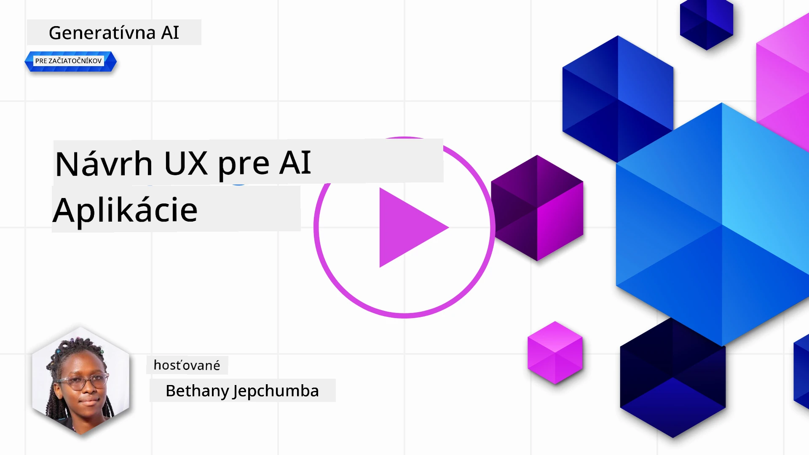
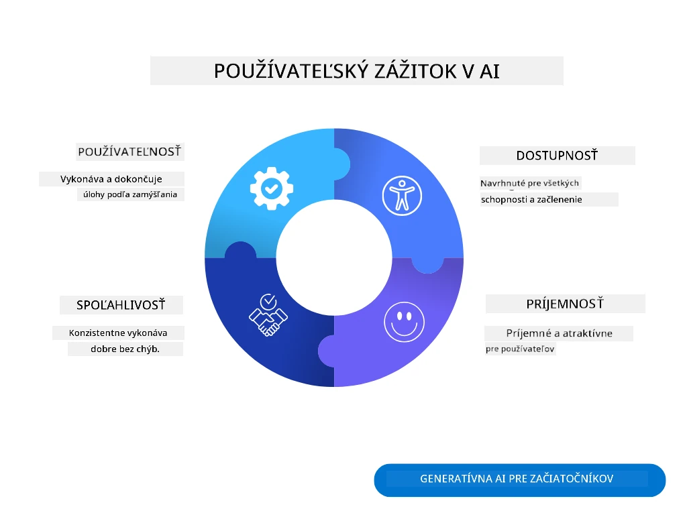
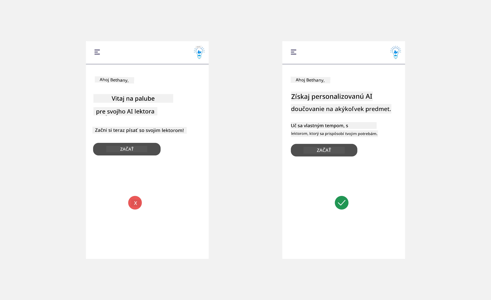
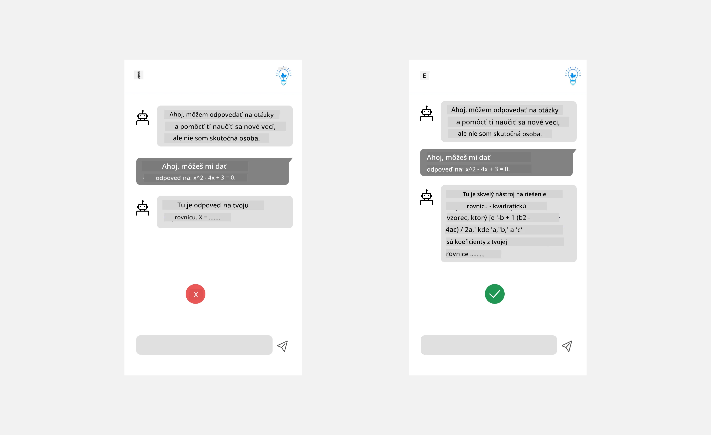
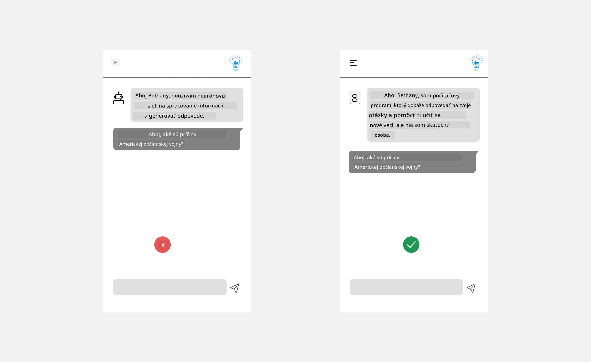
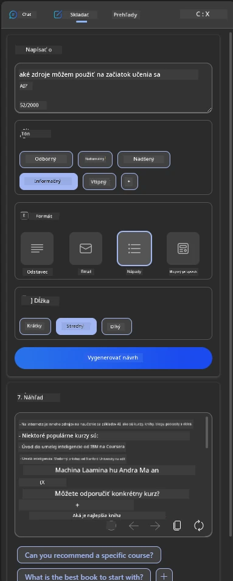
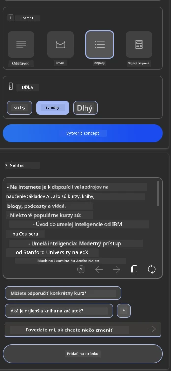
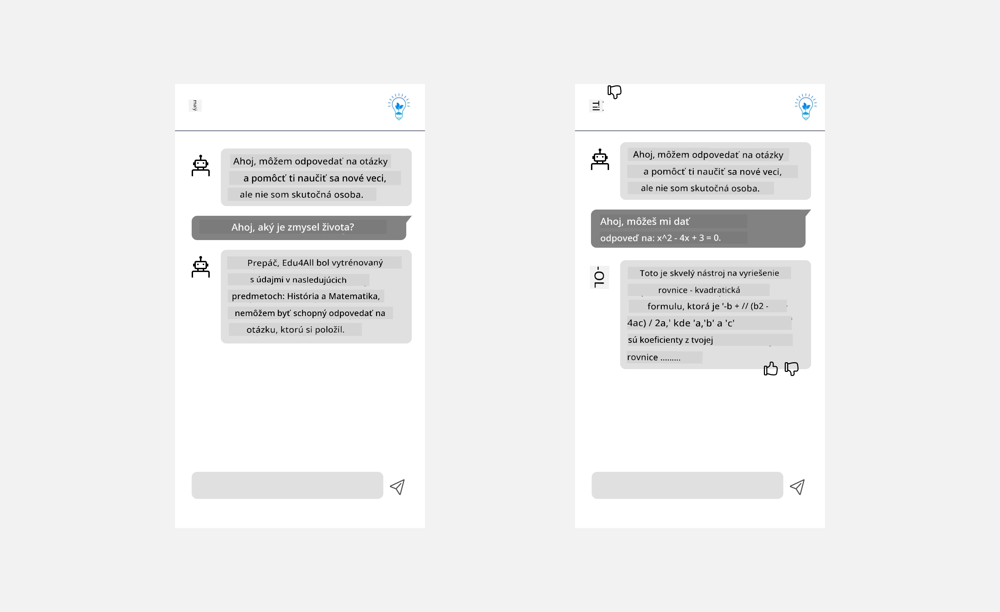

# Návrh UX pre AI aplikácie

> _(Kliknite na obrázok vyššie pre zobrazenie videa k tejto lekcii)_

Používateľská skúsenosť je veľmi dôležitým aspektom pri tvorbe aplikácií. Používatelia musia byť schopní efektívne používať vašu aplikáciu na vykonávanie úloh. Byť efektívny je jedna vec, ale takisto musíte navrhovať aplikácie tak, aby ich mohol používať každý, aby boli _prístupné_. Táto kapitola sa bude zameriavať na túto oblasť, aby ste nakoniec navrhli aplikáciu, ktorú ľudia môžu a chcú používať.

## Úvod

Používateľská skúsenosť je spôsob, akým používateľ interaguje s konkrétnym produktom alebo službou, či už systémom, nástrojom alebo dizajnom. Pri vývoji AI aplikácií sa vývojári nezameriavajú len na to, aby bola používateľská skúsenosť efektívna, ale aj etická. V tejto lekcii preberieme, ako vytvárať aplikácie umelej inteligencie (AI), ktoré riešia potreby používateľov.

Lekcia pokryje nasledujúce oblasti:

- Úvod do používateľskej skúsenosti a porozumenie potrebám používateľov
- Návrh AI aplikácií pre dôveru a transparentnosť
- Návrh AI aplikácií pre spoluprácu a spätnú väzbu

## Vzdelávacie ciele

Po absolvovaní tejto lekcie budete schopní:

- Pochopiť, ako vytvárať AI aplikácie, ktoré splnia potreby používateľov.
- Navrhnúť AI aplikácie, ktoré podporujú dôveru a spoluprácu.

### Predpoklady

Venujte čas a prečítajte si viac o [používateľskej skúsenosti a design thinking.](https://learn.microsoft.com/training/modules/ux-design?WT.mc_id=academic-105485-koreyst)

## Úvod do používateľskej skúsenosti a porozumenia potrebám používateľov

V našom fiktívnom startup-e pre vzdelávanie máme dvoch primárnych používateľov, učiteľov a študentov. Každý z týchto dvoch používateľov má jedinečné potreby. Dizajn zameraný na používateľa dáva prioritu používateľovi a zabezpečuje, že produkty sú relevantné a prínosné pre tých, pre ktorých sú určené.

Aplikácia by mala byť **užitočná, spoľahlivá, prístupná a príjemná**, aby poskytla dobrú používateľskú skúsenosť.

### Použiteľnosť

Byť užitočný znamená, že aplikácia má funkcie, ktoré sú v súlade s jej zamýšľaným účelom, napríklad automatizovanie procesu hodnotenia alebo generovanie kartičiek na opakovanie učiva. Aplikácia, ktorá automatizuje proces hodnotenia, by mala byť schopná presne a efektívne priraďovať hodnotenia študentským prácam na základe preddefinovaných kritérií. Podobne aplikácia generujúca kartičky na opakovanie by mala byť schopná vytvárať relevantné a rôznorodé otázky na základe svojich údajov.

### Spoľahlivosť

Byť spoľahlivý znamená, že aplikácia dokáže svoju úlohu vykonávať konzistentne a bez chýb. Avšak AI, podobne ako ľudia, nie je dokonalá a môže byť náchylná na chyby. Aplikácie môžu naraziť na chyby alebo neočakávané situácie, ktoré vyžadujú zásah alebo opravu človekom. Ako riešite chyby? V poslednej časti tejto lekcie sa budeme venovať tomu, ako sú AI systémy a aplikácie navrhnuté pre spoluprácu a spätnú väzbu.

### Prístupnosť

Byť prístupný znamená rozšíriť používateľskú skúsenosť na používateľov s rôznymi schopnosťami, vrátane osôb so zdravotným postihnutím, čím sa zabezpečí, že nikto nie je vynechaný. Dodržiavaním smerníc a princípov prístupnosti sa AI riešenia stávajú inkluzívnejšími, použiteľnejšími a prospešnejšími pre všetkých používateľov.

### Príjemnosť

Byť príjemný znamená, že aplikácia je zábavná na používanie. Príťažlivá používateľská skúsenosť môže mať pozitívny vplyv na používateľa, povzbudiť ho k opakovanému použitiu aplikácie a zvýšiť príjmy podniku.

Nie každý problém sa dá vyriešiť AI. AI vniká, aby rozšírila vašu používateľskú skúsenosť, či už automatizáciou manuálnych úloh alebo personalizáciou používateľských zážitkov.

## Návrh AI aplikácií pre dôveru a transparentnosť

Budovanie dôvery je kritické pri navrhovaní AI aplikácií. Dôvera zabezpečuje, že používateľ má istotu, že aplikácia vykoná prácu, poskytne výsledky konzistentne a výsledky sú to, čo používateľ potrebuje. Rizikom v tejto oblasti je nedôvera a nadmerná dôvera. Nedôvera nastáva, keď používateľ nemá alebo má veľmi malú dôveru v AI systém, čo vedie k odmietnutiu vašej aplikácie. Nadmerná dôvera nastáva, keď používateľ precení schopnosti AI systému, čo vedie k príliš veľkej dôvere v AI systém. Napríklad pri nadmernej dôvere automatizovaný hodnotiaci systém môže viesť k tomu, že učiteľ neprekontroluje niektoré práce, aby sa uistil, že hodnotiaci systém funguje správne. To by mohlo viesť k nespravodlivým alebo nepresným známkam pre študentov, alebo k zmeškaným príležitostiam na spätnú väzbu a zlepšenie.

Dva spôsoby, ako zabezpečiť, aby dôvera bola umiestnená priamo v centre návrhu, sú vysvetliteľnosť a kontrola.

### Vysvetliteľnosť

Keď AI pomáha pri rozhodovaní, napríklad pri odovzdávaní poznatkov budúcim generáciám, je kritické, aby učitelia a rodičia pochopili, ako AI rozhodnutia vznikajú. Toto je vysvetliteľnosť – pochopenie, ako AI aplikácie prijímajú rozhodnutia. Návrh pre vysvetliteľnosť zahŕňa pridanie detailov, ktoré zdôrazňujú, ako AI dospela k výsledku. Publikum musí byť informované, že výsledok bol vytvorený AI a nie človekom. Napríklad namiesto vety "Začnite teraz chatovať so svojím lektorom" povedzte "Použite AI lektora, ktorý sa prispôsobuje vašim potrebám a pomáha vám učiť sa vlastným tempom."

Ďalším príkladom je, ako AI využíva údaje o používateľovi a osobné údaje. Napríklad používateľ s personou študenta môže mať obmedzenia založené na jeho persone. AI nemusí byť schopná prezradiť odpovede na otázky, ale môže pomôcť viesť používateľa k tomu, ako môže problém vyriešiť.

Poslednou kľúčovou časťou vysvetliteľnosti je zjednodušenie vysvetlení. Študenti a učitelia nemusia byť odborníkmi na AI, preto by vysvetlenia toho, čo aplikácia môže alebo nemôže robiť, mali byť zjednodušené a ľahko pochopiteľné.

### Kontrola

Generatívna AI vytvára spoluprácu medzi AI a používateľom, kde napríklad používateľ môže upravovať výzvy pre rôzne výsledky. Okrem toho, keď je vytvorený výsledok, používatelia by mali byť schopní výsledky upraviť, čo im dáva pocit kontroly. Napríklad pri používaní Microsoft Copilot (predtým Bing Chat) môžete prispôsobiť svoju výzvu na základe formátu, tónu a dĺžky. Tiež môžete do výstupu pridávať zmeny a upravovať výstup, ako je to znázornené nižšie:

Ďalšou funkciou Microsoft Copilot, ktorá umožňuje používateľovi mať kontrolu nad aplikáciou, je možnosť zapnúť a vypnúť používanie údajov AI. Pre školskú aplikáciu by študent mohol chcieť používať svoje poznámky aj učiteľove zdroje ako materiál na opakovanie.

> Pri navrhovaní AI aplikácií je zámernosť kľúčová na zabezpečenie, aby používatelia nemali nadmernú dôveru a nesadali si nereálne očakávania ohľadom schopností AI. Jedným zo spôsobov je vytváranie odporu medzi výzvami a výsledkami, pripomínajúc používateľovi, že toto je AI a nie ďalší človek.

## Návrh AI aplikácií pre spoluprácu a spätnú väzbu

Ako už bolo spomenuté, generatívna AI vytvára spoluprácu medzi používateľom a AI. Väčšina interakcií spočíva v tom, že používateľ zadá požiadavku a AI vygeneruje výstup. Čo ak je výsledok nesprávny? Ako aplikácia rieši chyby, ak nastanú? Obviňuje AI používateľa alebo si dá čas na vysvetlenie chyby?

AI aplikácie by mali byť navrhnuté tak, aby prijímali a dávali spätnú väzbu. Toto nielen pomáha AI systému zlepšovať sa, ale aj buduje dôveru u používateľov. Cyklus spätnej väzby by mal byť súčasťou návrhu, príkladom môže byť jednoduchý palec hore alebo dole na hodnotenie výstupu.

Ďalším spôsobom riešenia je jasne komunikovať schopnosti a obmedzenia systému. Keď používateľ spraví chybu a žiada niečo mimo možností AI, mala by existovať aj možnosť, ako to riešiť, ako je to znázornené nižšie.

Chyby systému sú bežné pri aplikáciách, kde používateľ môže potrebovať pomoc s informáciami mimo rozsahu AI, alebo aplikácia môže mať limit počtu otázok/tém, na ktoré môže používateľ generovať zhrnutia. Napríklad AI aplikácia trénovaná na obmedzených témach, napríklad História a Matematika, nemusí byť schopná spracovať otázky z Geografie. Aby sa tomu predchádzalo, AI systém môže dať odpoveď ako: "Ospravedlňujeme sa, náš produkt bol trénovaný na tieto predmety....., na vašu otázku nedokážem odpovedať."

AI aplikácie nie sú dokonalé, preto sú náchylné robiť chyby. Pri navrhovaní svojich aplikácií by ste mali zabezpečiť priestor pre spätnú väzbu používateľov a zvládanie chýb spôsobom, ktorý je jednoduchý a ľahko vysvetliteľný.

## Zadanie

Zoberte ktorúkoľvek AI aplikáciu, ktorú ste doteraz vytvorili, zvážte implementáciu nasledujúcich krokov vo vašej aplikácii:

- **Príjemnosť:** Zvážte, ako spraviť vašu aplikáciu príjemnejšou. Pridávate vysvetlenia všade? Povzbudzujete používateľa k objavovaniu? Ako formulujete svoje chybové hlásenia?

- **Použiteľnosť:** Budujete webovú aplikáciu. Uistite sa, že vaša aplikácia je ovládateľná myšou aj klávesnicou.

- **Dôvera a transparentnosť:** Nedôverujte AI úplne ani jej výstupom, zvážte, ako pridať človeka do procesu overovania výstupov. Tiež zvážte a implementujte iné spôsoby, ako dosiahnuť dôveru a transparentnosť.

- **Kontrola:** Dajte používateľovi kontrolu nad údajmi, ktoré poskytuje aplikácii. Implementujte spôsob, ako môže používateľ zapnúť alebo vypnúť zber údajov v AI aplikácii.

<!-- ## [Post-lecture quiz](../../../12-designing-ux-for-ai-applications/quiz-url) -->

## Pokračujte vo svojom vzdelávaní!

Po dokončení tejto lekcie si pozrite našu [kolekciu generatívneho AI učenia](https://aka.ms/genai-collection?WT.mc_id=academic-105485-koreyst), aby ste pokračovali v rozvoji svojich poznatkov o generatívnej AI!

Prejdite na lekciu 13, kde sa pozrieme na to, ako [zabezpečiť AI aplikácie](../13-securing-ai-applications/README.md?WT.mc_id=academic-105485-koreyst)!

---

<!-- CO-OP TRANSLATOR DISCLAIMER START -->
**Vyhlásenie o zodpovednosti**:
Tento dokument bol preložený pomocou AI prekladateľskej služby [Co-op Translator](https://github.com/Azure/co-op-translator). Hoci sa snažíme o presnosť, vezmite prosím na vedomie, že automatické preklady môžu obsahovať chyby alebo nepresnosti. Pôvodný dokument v jeho natívnom jazyku by mal byť považovaný za autoritatívny zdroj. Pre kritické informácie sa odporúča profesionálny ľudský preklad. Nie sme zodpovední za žiadne nedorozumenia alebo nesprávne interpretácie vyplývajúce z použitia tohto prekladu.
<!-- CO-OP TRANSLATOR DISCLAIMER END -->