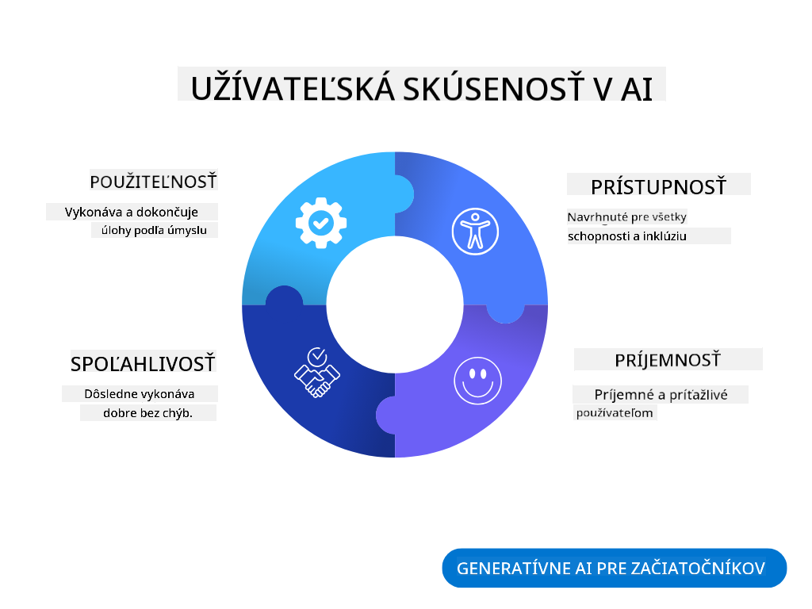
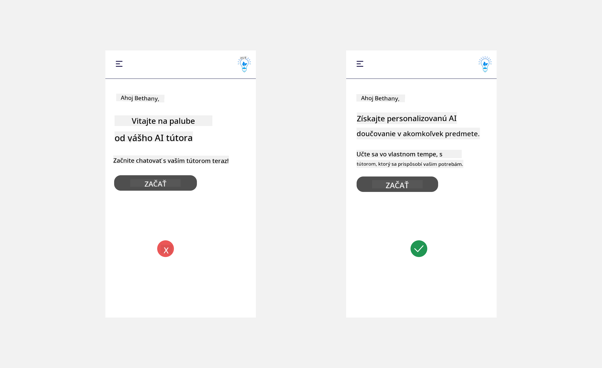
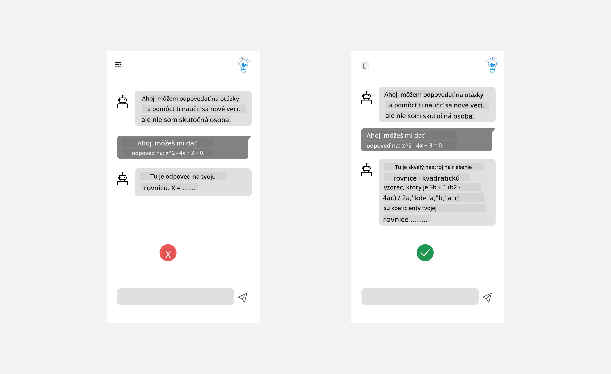
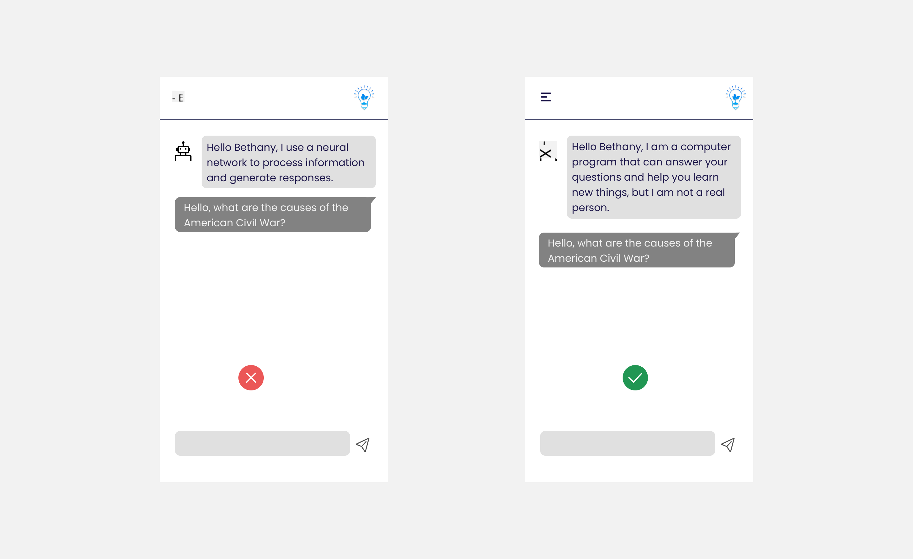
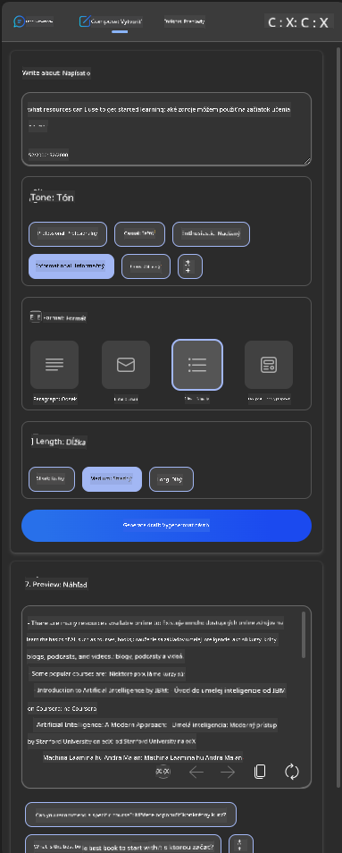
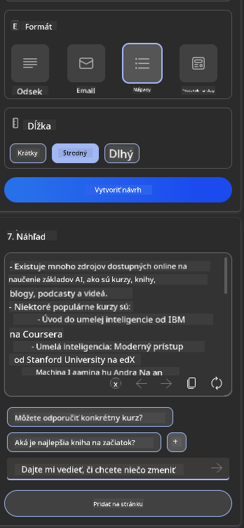
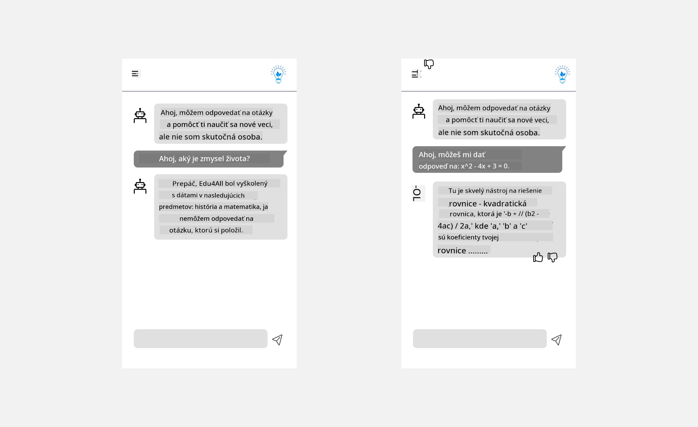

<!--
CO_OP_TRANSLATOR_METADATA:
{
  "original_hash": "ec385b41ee50579025d50cc03bfb3a25",
  "translation_date": "2025-06-25T20:32:34+00:00",
  "source_file": "12-designing-ux-for-ai-applications/README.md",
  "language_code": "sk"
}
-->
# Navrhovanie UX pre AI aplikácie

> _(Kliknite na obrázok vyššie a pozrite si video tejto lekcie)_

Používateľská skúsenosť je veľmi dôležitým aspektom pri vytváraní aplikácií. Používatelia musia byť schopní používať vašu aplikáciu efektívnym spôsobom na vykonávanie úloh. Byť efektívny je jedna vec, ale musíte tiež navrhnúť aplikácie tak, aby ich mohol používať každý, aby boli _prístupné_. Táto kapitola sa zameria na túto oblasť, aby ste nakoniec navrhli aplikáciu, ktorú ľudia môžu a chcú používať.

## Úvod

Používateľská skúsenosť je spôsob, akým používateľ interaguje s konkrétnym produktom alebo službou, či už ide o systém, nástroj alebo dizajn. Pri vývoji AI aplikácií sa vývojári nielen zameriavajú na to, aby bola používateľská skúsenosť efektívna, ale aj etická. V tejto lekcii sa zaoberáme tým, ako vytvárať aplikácie umelej inteligencie (AI), ktoré riešia potreby používateľov.

Lekcia sa bude venovať nasledujúcim oblastiam:

- Úvod do používateľskej skúsenosti a pochopenie potrieb používateľov
- Navrhovanie AI aplikácií pre dôveru a transparentnosť
- Navrhovanie AI aplikácií pre spoluprácu a spätnú väzbu

## Ciele učenia

Po absolvovaní tejto lekcie budete schopní:

- Pochopiť, ako vytvárať AI aplikácie, ktoré spĺňajú potreby používateľov.
- Navrhnúť AI aplikácie, ktoré podporujú dôveru a spoluprácu.

### Predpoklad

Venujte čas a prečítajte si viac o [používateľskej skúsenosti a dizajnovom myslení.](https://learn.microsoft.com/training/modules/ux-design?WT.mc_id=academic-105485-koreyst)

## Úvod do používateľskej skúsenosti a pochopenie potrieb používateľov

V našom fiktívnom vzdelávacom startupe máme dvoch hlavných používateľov, učiteľov a študentov. Každý z týchto používateľov má jedinečné potreby. Dizajn orientovaný na používateľa uprednostňuje používateľa, čím zaisťuje, že produkty sú relevantné a prospešné pre tých, pre ktorých sú určené.

Aplikácia by mala byť **užitočná, spoľahlivá, prístupná a príjemná**, aby poskytovala dobrú používateľskú skúsenosť.

### Použiteľnosť

Byť užitočný znamená, že aplikácia má funkčnosť, ktorá zodpovedá jej zamýšľanému účelu, ako je automatizácia procesu hodnotenia alebo generovanie kartičiek na opakovanie. Aplikácia, ktorá automatizuje proces hodnotenia, by mala byť schopná presne a efektívne priradiť skóre k práci študentov na základe vopred definovaných kritérií. Podobne, aplikácia, ktorá generuje kartičky na opakovanie, by mala byť schopná vytvárať relevantné a rozmanité otázky na základe svojich údajov.

### Spoľahlivosť

Byť spoľahlivý znamená, že aplikácia dokáže vykonávať svoju úlohu konzistentne a bez chýb. Avšak, AI, rovnako ako ľudia, nie je dokonalá a môže byť náchylná na chyby. Aplikácie môžu naraziť na chyby alebo neočakávané situácie, ktoré vyžadujú zásah alebo opravu človeka. Ako riešite chyby? V poslednej časti tejto lekcie sa budeme zaoberať tým, ako sú AI systémy a aplikácie navrhnuté pre spoluprácu a spätnú väzbu.

### Prístupnosť

Byť prístupný znamená rozšíriť používateľskú skúsenosť na používateľov s rôznymi schopnosťami, vrátane tých s postihnutím, aby sa zabezpečilo, že nikto nezostane mimo. Dodržiavaním usmernení a princípov prístupnosti sa AI riešenia stávajú inkluzívnejšími, použiteľnejšími a prospešnejšími pre všetkých používateľov.

### Príjemnosť

Byť príjemný znamená, že aplikácia je zábavná na používanie. Pútavá používateľská skúsenosť môže mať pozitívny vplyv na používateľa, povzbudzujúc ho k návratu do aplikácie a zvyšovaniu obchodného príjmu.

Nie každý problém sa dá vyriešiť pomocou AI. AI prichádza na to, aby zlepšila vašu používateľskú skúsenosť, či už automatizáciou manuálnych úloh alebo personalizáciou používateľských skúseností.

## Navrhovanie AI aplikácií pre dôveru a transparentnosť

Budovanie dôvery je kritické pri navrhovaní AI aplikácií. Dôvera zaisťuje, že používateľ je presvedčený, že aplikácia splní úlohu, konzistentne dodá výsledky a výsledky sú také, aké používateľ potrebuje. Riziko v tejto oblasti je nedôvera a prehnaná dôvera. Nedôvera nastáva, keď používateľ má malú alebo žiadnu dôveru v AI systém, čo vedie k odmietnutiu vašej aplikácie. Prehnaná dôvera nastáva, keď používateľ preceňuje schopnosti AI systému, čo vedie k tomu, že používateľ príliš dôveruje AI systému. Napríklad automatizovaný systém hodnotenia v prípade prehnanej dôvery môže viesť k tomu, že učiteľ neprehliadne niektoré z prác, aby sa uistil, že systém hodnotenia funguje dobre. To by mohlo viesť k nespravodlivým alebo nepresným známkam pre študentov, alebo k zmeškaným príležitostiam na spätnú väzbu a zlepšenie.

Dva spôsoby, ako zabezpečiť, že dôvera je umiestnená priamo v centre dizajnu, sú vysvetliteľnosť a kontrola.

### Vysvetliteľnosť

Keď AI pomáha informovať rozhodnutia, ako je napríklad odovzdávanie znalostí budúcim generáciám, je kritické, aby učitelia a rodičia pochopili, ako sú rozhodnutia AI vykonávané. Toto je vysvetliteľnosť - pochopenie toho, ako AI aplikácie robia rozhodnutia. Navrhovanie pre vysvetliteľnosť zahŕňa pridanie podrobností o príkladoch toho, čo AI aplikácia dokáže. Napríklad namiesto "Začnite s AI učiteľom", systém môže použiť: "Zhrňte svoje poznámky pre jednoduchšie opakovanie pomocou AI."

Ďalším príkladom je, ako AI používa používateľské a osobné údaje. Napríklad používateľ s personou študent môže mať obmedzenia na základe svojej persony. AI nemusí byť schopná odhaliť odpovede na otázky, ale môže pomôcť používateľovi premýšľať o tom, ako môžu vyriešiť problém.

Poslednou kľúčovou časťou vysvetliteľnosti je zjednodušenie vysvetlení. Študenti a učitelia nemusia byť odborníkmi na AI, preto vysvetlenia toho, čo aplikácia môže alebo nemôže robiť, by mali byť zjednodušené a ľahko pochopiteľné.

### Kontrola

Generatívna AI vytvára spoluprácu medzi AI a používateľom, kde napríklad používateľ môže upraviť výzvy pre rôzne výsledky. Okrem toho, keď je generovaný výstup, používatelia by mali byť schopní upraviť výsledky, čo im dáva pocit kontroly. Napríklad pri používaní Bing môžete prispôsobiť svoju výzvu na základe formátu, tónu a dĺžky. Okrem toho môžete pridať zmeny do svojho výstupu a upraviť ho, ako je ukázané nižšie:

Ďalšou funkciou v Bing, ktorá umožňuje používateľovi mať kontrolu nad aplikáciou, je schopnosť zvoliť si, či sa zapojiť alebo odhlásiť z údajov, ktoré AI používa. Pre školskú aplikáciu môže študent chcieť používať svoje poznámky, ako aj zdroje učiteľov ako materiál na opakovanie.

> Pri navrhovaní AI aplikácií je zámernosť kľúčová v zabezpečení, že používatelia nebudú prehnane dôverovať a nastavovať nerealistické očakávania jeho schopností. Jedným zo spôsobov, ako to dosiahnuť, je vytváranie trenia medzi výzvami a výsledkami. Pripomínanie používateľovi, že toto je AI a nie človek

## Navrhovanie AI aplikácií pre spoluprácu a spätnú väzbu

Ako už bolo spomenuté, generatívna AI vytvára spoluprácu medzi používateľom a AI. Väčšina interakcií je s používateľom, ktorý zadáva výzvu a AI generuje výstup. Čo ak je výstup nesprávny? Ako aplikácia rieši chyby, ak sa vyskytnú? Obviňuje AI používateľa alebo si dáva čas na vysvetlenie chyby?

AI aplikácie by mali byť navrhnuté tak, aby prijímali a poskytovali spätnú väzbu. To nielenže pomáha AI systému zlepšovať sa, ale tiež buduje dôveru s používateľmi. Spätná väzba by mala byť zahrnutá v dizajne, príkladom môže byť jednoduché palec hore alebo dole na výstupe.

Ďalším spôsobom, ako to riešiť, je jasne komunikovať schopnosti a obmedzenia systému. Keď používateľ urobí chybu, žiada niečo nad rámec schopností AI, mala by existovať aj cesta, ako to riešiť, ako je ukázané nižšie.

Systémové chyby sú bežné v aplikáciách, kde používateľ môže potrebovať pomoc s informáciami mimo rozsahu AI alebo aplikácia môže mať obmedzenie na to, koľko otázok/predmetov môže používateľ generovať súhrny. Napríklad AI aplikácia vyškolená s údajmi o obmedzených predmetoch, napríklad História a Matematika, nemusí byť schopná riešiť otázky týkajúce sa Geografie. Aby sa tomu zabránilo, AI systém môže dať odpoveď ako: "Prepáčte, náš produkt bol vyškolený s údajmi v nasledujúcich predmetoch....., nemôžem odpovedať na otázku, ktorú ste položili."

AI aplikácie nie sú dokonalé, preto sú náchylné robiť chyby. Pri navrhovaní vašich aplikácií by ste mali zabezpečiť, že vytvoríte priestor pre spätnú väzbu od používateľov a riešenie chýb spôsobom, ktorý je jednoduchý a ľahko vysvetliteľný.

## Zadanie

Vezmite akékoľvek AI aplikácie, ktoré ste doteraz vytvorili, zvážte implementáciu nasledujúcich krokov vo vašej aplikácii:

- **Príjemnosť:** Zvážte, ako môžete urobiť svoju aplikáciu príjemnejšou. Pridávate vysvetlenia všade? Povzbudzujete používateľa k objavovaniu? Ako formulujete svoje chybové správy?

- **Použiteľnosť:** Vytváranie webovej aplikácie. Uistite sa, že vaša aplikácia je navigovateľná pomocou myši aj klávesnice.

- **Dôvera a transparentnosť:** Nezverujte AI úplne a jej výstup, zvážte, ako by ste pridali človeka do procesu na overenie výstupu. Zvážte a implementujte aj iné spôsoby dosiahnutia dôvery a transparentnosti.

- **Kontrola:** Dajte používateľovi kontrolu nad údajmi, ktoré poskytuje aplikácii. Implementujte spôsob, akým sa používateľ môže zapojiť alebo odhlásiť z zberu údajov v AI aplikácii.

## Pokračujte vo svojom učení!

Po dokončení tejto lekcie si pozrite našu [zbierku učenia o generatívnej AI](https://aka.ms/genai-collection?WT.mc_id=academic-105485-koreyst), aby ste pokračovali vo zvyšovaní svojich znalostí o generatívnej AI!

Prejdite na Lekciu 13, kde sa pozrieme na to, ako [zabezpečiť AI aplikácie](../13-securing-ai-applications/README.md?WT.mc_id=academic-105485-koreyst)!

**Upozornenie**:  
Tento dokument bol preložený pomocou služby AI prekladateľa [Co-op Translator](https://github.com/Azure/co-op-translator). Aj keď sa snažíme o presnosť, uvedomte si, že automatizované preklady môžu obsahovať chyby alebo nepresnosti. Pôvodný dokument v jeho rodnom jazyku by sa mal považovať za autoritatívny zdroj. Pre kritické informácie sa odporúča profesionálny ľudský preklad. Nie sme zodpovední za žiadne nedorozumenia alebo nesprávne interpretácie vyplývajúce z použitia tohto prekladu.