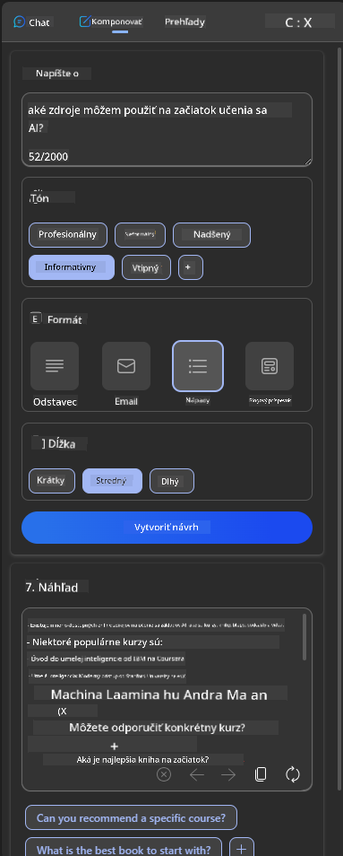

<!--
CO_OP_TRANSLATOR_METADATA:
{
  "original_hash": "747668e4c53d067369f06e9ec2e6313e",
  "translation_date": "2025-08-26T19:10:48+00:00",
  "source_file": "12-designing-ux-for-ai-applications/README.md",
  "language_code": "sk"
}
-->
# Navrhovanie UX pre AI aplikácie

> _(Kliknite na obrázok vyššie a pozrite si video k tejto lekcii)_

Používateľská skúsenosť je veľmi dôležitým aspektom pri tvorbe aplikácií. Používatelia musia vedieť vašu aplikáciu efektívne používať na vykonávanie úloh. Byť efektívny je jedna vec, ale zároveň musíte aplikácie navrhovať tak, aby ich mohol používať každý – teda aby boli _prístupné_. Táto kapitola sa zameriava práve na túto oblasť, aby ste navrhli aplikáciu, ktorú ľudia môžu a chcú používať.

## Úvod

Používateľská skúsenosť je spôsob, akým používateľ interaguje s konkrétnym produktom alebo službou, či už ide o systém, nástroj alebo dizajn. Pri vývoji AI aplikácií sa vývojári nezameriavajú len na efektívnosť používateľskej skúsenosti, ale aj na jej etickosť. V tejto lekcii sa venujeme tomu, ako vytvárať aplikácie umelej inteligencie (AI), ktoré zohľadňujú potreby používateľov.

Lekcia sa venuje týmto oblastiam:

- Úvod do používateľskej skúsenosti a pochopenie potrieb používateľov
- Navrhovanie AI aplikácií pre dôveru a transparentnosť
- Navrhovanie AI aplikácií pre spoluprácu a spätnú väzbu

## Ciele učenia

Po absolvovaní tejto lekcie budete vedieť:

- Pochopiť, ako vytvárať AI aplikácie, ktoré zodpovedajú potrebám používateľov.
- Navrhovať AI aplikácie, ktoré podporujú dôveru a spoluprácu.

### Predpoklad

Venujte chvíľu a prečítajte si viac o [používateľskej skúsenosti a dizajnovom myslení.](https://learn.microsoft.com/training/modules/ux-design?WT.mc_id=academic-105485-koreyst)

## Úvod do používateľskej skúsenosti a pochopenie potrieb používateľov

V našom fiktívnom startupe v oblasti vzdelávania máme dvoch hlavných používateľov – učiteľov a študentov. Každý z nich má svoje špecifické potreby. Dizajn zameraný na používateľa kladie dôraz na to, aby produkty boli relevantné a prínosné pre tých, ktorým sú určené.

Aplikácia by mala byť **užitočná, spoľahlivá, prístupná a príjemná**, aby poskytovala dobrú používateľskú skúsenosť.

### Použiteľnosť

Byť užitočný znamená, že aplikácia má funkcie, ktoré zodpovedajú jej účelu, napríklad automatizácia hodnotenia alebo generovanie kartičiek na opakovanie. Aplikácia, ktorá automatizuje hodnotenie, by mala vedieť presne a efektívne priraďovať body na základe vopred stanovených kritérií. Podobne aplikácia na generovanie kartičiek na opakovanie by mala vedieť vytvárať relevantné a rôznorodé otázky na základe svojich údajov.

### Spoľahlivosť

Byť spoľahlivý znamená, že aplikácia dokáže svoju úlohu vykonávať konzistentne a bez chýb. AI však, rovnako ako ľudia, nie je dokonalá a môže robiť chyby. Aplikácie môžu naraziť na chyby alebo neočakávané situácie, ktoré si vyžadujú zásah alebo opravu človeka. Ako riešiť chyby? V poslednej časti tejto lekcie sa budeme venovať tomu, ako sú AI systémy a aplikácie navrhnuté pre spoluprácu a spätnú väzbu.

### Prístupnosť

Byť prístupný znamená rozšíriť používateľskú skúsenosť aj na ľudí s rôznymi schopnosťami, vrátane osôb so zdravotným znevýhodnením, aby nikto nebol vynechaný. Dodržiavaním zásad a odporúčaní pre prístupnosť sa AI riešenia stávajú inkluzívnejšie, použiteľnejšie a prínosnejšie pre všetkých používateľov.

### Príjemnosť

Byť príjemný znamená, že aplikácia je radosť používať. Príťažlivá používateľská skúsenosť môže pozitívne ovplyvniť používateľa, povzbudiť ho k návratu do aplikácie a zvýšiť príjmy firmy.

Nie každý problém sa dá vyriešiť pomocou AI. AI má za úlohu vylepšiť používateľskú skúsenosť, či už automatizáciou manuálnych úloh alebo personalizáciou zážitku.

## Navrhovanie AI aplikácií pre dôveru a transparentnosť

Budovanie dôvery je kľúčové pri navrhovaní AI aplikácií. Dôvera zabezpečí, že používateľ verí, že aplikácia úlohu zvládne, bude prinášať konzistentné výsledky a tie budú zodpovedať jeho potrebám. Rizikom je nedôvera alebo naopak prehnaná dôvera. Nedôvera nastáva, keď používateľ AI systému neverí, čo vedie k odmietnutiu vašej aplikácie. Prehnaná dôvera nastáva, keď používateľ precení schopnosti AI systému a príliš mu dôveruje. Napríklad pri automatizovanom hodnotení môže učiteľ v prípade prehnanej dôvery prestať kontrolovať niektoré práce, aby sa uistil, že systém hodnotí správne. To môže viesť k nespravodlivým alebo nepresným známkam, prípadne k zmeškaným príležitostiam na spätnú väzbu a zlepšenie.

Dva spôsoby, ako zabezpečiť, že dôvera je v centre dizajnu, sú vysvetliteľnosť a kontrola.

### Vysvetliteľnosť

Keď AI pomáha pri rozhodovaní, napríklad pri vzdelávaní budúcich generácií, je dôležité, aby učitelia a rodičia rozumeli, ako AI rozhodnutia robí. To je vysvetliteľnosť – pochopenie, ako AI aplikácie prichádzajú k svojim rozhodnutiam. Navrhovanie pre vysvetliteľnosť zahŕňa pridanie detailov, ktoré ukazujú, ako AI dospela k výsledku. Publikum musí vedieť, že výstup generovala AI, nie človek. Napríklad namiesto „Začni si teraz písať s lektorom“ povedzte „Použi AI lektora, ktorý sa prispôsobí tvojim potrebám a pomôže ti učiť sa vlastným tempom.“

Ďalším príkladom je spôsob, akým AI používa používateľské a osobné údaje. Napríklad používateľ s personou študenta môže mať obmedzenia podľa svojej role. AI nemusí prezradiť odpovede na otázky, ale môže používateľa naviesť, ako problém vyriešiť.

Dôležitou súčasťou vysvetliteľnosti je aj zjednodušenie vysvetlení. Študenti a učitelia nemusia byť odborníci na AI, preto by vysvetlenia toho, čo aplikácia dokáže alebo nedokáže, mali byť jednoduché a ľahko pochopiteľné.

### Kontrola

Generatívna AI vytvára spoluprácu medzi AI a používateľom, kde napríklad používateľ môže upravovať zadania pre rôzne výsledky. Okrem toho, keď je výstup vygenerovaný, používateľ by mal mať možnosť výsledok upraviť, čím získava pocit kontroly. Napríklad pri používaní Bingu si môžete prispôsobiť zadanie podľa formátu, tónu a dĺžky. Navyše môžete upraviť výstup, ako je to znázornené nižšie:

Ďalšou funkciou v Bingu, ktorá dáva používateľovi kontrolu nad aplikáciou, je možnosť zapnúť alebo vypnúť používanie údajov AI. V školskej aplikácii môže študent chcieť použiť svoje poznámky aj učiteľské materiály na opakovanie.

> Pri navrhovaní AI aplikácií je dôležité zámerne zabrániť tomu, aby používatelia AI preceňovali a mali nerealistické očakávania od jej schopností. Jedným zo spôsobov je vytvoriť určitý odpor medzi zadaním a výsledkom. Pripomínajte používateľovi, že ide o AI, nie o človeka.

## Navrhovanie AI aplikácií pre spoluprácu a spätnú väzbu

Ako už bolo spomenuté, generatívna AI vytvára spoluprácu medzi používateľom a AI. Väčšina interakcií prebieha tak, že používateľ zadá podnet a AI vygeneruje výstup. Čo ak je výstup nesprávny? Ako aplikácia rieši chyby, ak nastanú? Obviňuje AI používateľa alebo si nájde čas na vysvetlenie chyby?

AI aplikácie by mali byť navrhnuté tak, aby vedeli prijímať aj poskytovať spätnú väzbu. To pomáha nielen zlepšovať AI systém, ale aj budovať dôveru používateľov. Do dizajnu by sa mala zahrnúť spätná väzba, napríklad jednoduché hodnotenie palcom hore alebo dole pri výstupe.

Ďalším spôsobom je jasne komunikovať schopnosti a obmedzenia systému. Ak používateľ urobí chybu a žiada niečo, čo AI nedokáže, malo by existovať riešenie, ako je to znázornené nižšie.

Systémové chyby sú bežné v aplikáciách, kde používateľ môže potrebovať informácie mimo rozsahu AI alebo aplikácia môže mať limit na počet otázok/predmetov, z ktorých môže generovať zhrnutia. Napríklad AI aplikácia trénovaná len na obmedzené predmety, napríklad dejepis a matematiku, nemusí vedieť odpovedať na otázky z geografie. Na zmiernenie tohto problému môže AI systém odpovedať napríklad: „Prepáčte, náš produkt bol trénovaný na nasledujúcich predmetoch....., nemôžem odpovedať na vašu otázku.“

AI aplikácie nie sú dokonalé, preto sa chyby môžu vyskytnúť. Pri navrhovaní aplikácií by ste mali zabezpečiť priestor na spätnú väzbu od používateľov a riešenie chýb spôsobom, ktorý je jednoduchý a ľahko vysvetliteľný.

## Zadanie

Vezmite si niektorú AI aplikáciu, ktorú ste doteraz vytvorili, a zvážte implementáciu týchto krokov:

- **Príjemnosť:** Zamyslite sa, ako môžete spraviť svoju aplikáciu príjemnejšou. Pridávate vysvetlenia na správne miesta? Povzbudzujete používateľa k objavovaniu? Ako formulujete chybové hlášky?

- **Použiteľnosť:** Ak vytvárate webovú aplikáciu, uistite sa, že sa v nej dá pohybovať myšou aj klávesnicou.

- **Dôvera a transparentnosť:** Nespoliehajte sa úplne na AI a jej výstupy, zvážte, ako by ste do procesu zapojili človeka na overenie výsledkov. Zamyslite sa aj nad ďalšími spôsobmi, ako dosiahnuť dôveru a transparentnosť.

- **Kontrola:** Dajte používateľovi kontrolu nad údajmi, ktoré poskytuje aplikácii. Implementujte možnosť, aby používateľ mohol súhlasiť alebo nesúhlasiť so zberom údajov v AI aplikácii.

## Pokračujte v učení!

Po absolvovaní tejto lekcie si pozrite našu [kolekciu o generatívnej AI](https://aka.ms/genai-collection?WT.mc_id=academic-105485-koreyst) a rozšírte si vedomosti o generatívnej AI!

Pokračujte na Lekciu 13, kde sa pozrieme na [zabezpečenie AI aplikácií](../13-securing-ai-applications/README.md?WT.mc_id=academic-105485-koreyst)!

---

**Vyhlásenie o zodpovednosti**:  
Tento dokument bol preložený pomocou AI prekladovej služby [Co-op Translator](https://github.com/Azure/co-op-translator). Hoci sa snažíme o presnosť, upozorňujeme, že automatizované preklady môžu obsahovať chyby alebo nepresnosti. Za autoritatívny zdroj sa považuje pôvodný dokument v jeho natívnom jazyku. Pre kritické informácie odporúčame profesionálny ľudský preklad. Nenesieme zodpovednosť za akékoľvek nedorozumenia alebo nesprávne interpretácie vzniknuté použitím tohto prekladu.