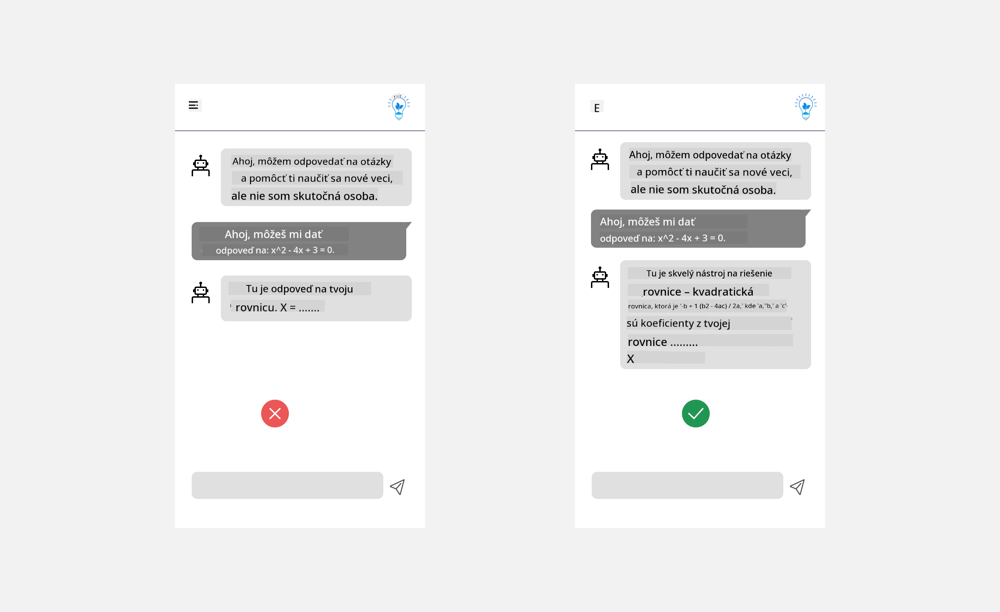
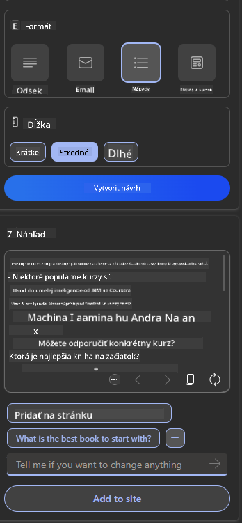

<!--
CO_OP_TRANSLATOR_METADATA:
{
  "original_hash": "78bbeed50fd4dc9fdee931f5daf98cb3",
  "translation_date": "2025-10-17T21:53:22+00:00",
  "source_file": "12-designing-ux-for-ai-applications/README.md",
  "language_code": "sk"
}
-->
# Navrhovanie UX pre AI aplikácie

> _(Kliknite na obrázok vyššie, aby ste si pozreli video k tejto lekcii)_

Používateľská skúsenosť je veľmi dôležitým aspektom pri tvorbe aplikácií. Používatelia musia byť schopní efektívne používať vašu aplikáciu na vykonávanie úloh. Efektivita je jedna vec, ale je tiež potrebné navrhnúť aplikácie tak, aby ich mohli používať všetci, čím sa stanú _prístupné_. Táto kapitola sa zameriava na túto oblasť, aby ste nakoniec navrhli aplikáciu, ktorú ľudia môžu a chcú používať.

## Úvod

Používateľská skúsenosť je spôsob, akým používateľ interaguje s konkrétnym produktom alebo službou, či už ide o systém, nástroj alebo dizajn. Pri vývoji AI aplikácií sa vývojári nielen zameriavajú na zabezpečenie efektívnej používateľskej skúsenosti, ale aj na jej etickosť. V tejto lekcii sa zaoberáme tým, ako vytvárať aplikácie umelej inteligencie (AI), ktoré riešia potreby používateľov.

Lekcia pokryje nasledujúce oblasti:

- Úvod do používateľskej skúsenosti a pochopenie potrieb používateľov
- Navrhovanie AI aplikácií pre dôveru a transparentnosť
- Navrhovanie AI aplikácií pre spoluprácu a spätnú väzbu

## Ciele učenia

Po absolvovaní tejto lekcie budete schopní:

- Pochopiť, ako vytvárať AI aplikácie, ktoré spĺňajú potreby používateľov.
- Navrhovať AI aplikácie, ktoré podporujú dôveru a spoluprácu.

### Predpoklad

Venujte čas a prečítajte si viac o [používateľskej skúsenosti a dizajnovom myslení.](https://learn.microsoft.com/training/modules/ux-design?WT.mc_id=academic-105485-koreyst)

## Úvod do používateľskej skúsenosti a pochopenie potrieb používateľov

V našom fiktívnom vzdelávacom startupe máme dvoch primárnych používateľov, učiteľov a študentov. Každý z týchto dvoch používateľov má jedinečné potreby. Dizajn orientovaný na používateľa uprednostňuje používateľa, čím zabezpečuje, že produkty sú relevantné a prospešné pre tých, pre ktorých sú určené.

Aplikácia by mala byť **užitočná, spoľahlivá, prístupná a príjemná**, aby poskytovala dobrú používateľskú skúsenosť.

### Použiteľnosť

Byť užitočný znamená, že aplikácia má funkcie, ktoré zodpovedajú jej zamýšľanému účelu, ako napríklad automatizácia procesu hodnotenia alebo generovanie kartičiek na opakovanie. Aplikácia, ktorá automatizuje proces hodnotenia, by mala byť schopná presne a efektívne priradiť skóre k práci študentov na základe preddefinovaných kritérií. Podobne aplikácia, ktorá generuje kartičky na opakovanie, by mala byť schopná vytvárať relevantné a rôznorodé otázky na základe svojich údajov.

### Spoľahlivosť

Byť spoľahlivý znamená, že aplikácia dokáže vykonávať svoju úlohu konzistentne a bez chýb. Avšak AI, rovnako ako ľudia, nie je dokonalá a môže byť náchylná na chyby. Aplikácie môžu naraziť na chyby alebo neočakávané situácie, ktoré si vyžadujú zásah alebo opravu zo strany človeka. Ako riešiť chyby? V poslednej časti tejto lekcie sa budeme zaoberať tým, ako sú AI systémy a aplikácie navrhnuté pre spoluprácu a spätnú väzbu.

### Prístupnosť

Byť prístupný znamená rozšíriť používateľskú skúsenosť na používateľov s rôznymi schopnosťami, vrátane osôb so zdravotným postihnutím, aby sa zabezpečilo, že nikto nebude vynechaný. Dodržiavaním zásad a usmernení prístupnosti sa AI riešenia stávajú inkluzívnejšími, použiteľnejšími a prospešnými pre všetkých používateľov.

### Príjemnosť

Byť príjemný znamená, že aplikácia je zábavná na používanie. Atraktívna používateľská skúsenosť môže mať pozitívny vplyv na používateľa, povzbudiť ho k návratu k aplikácii a zvýšiť príjmy podniku.

Nie každý problém sa dá vyriešiť pomocou AI. AI prichádza na pomoc pri zlepšovaní používateľskej skúsenosti, či už automatizáciou manuálnych úloh alebo personalizáciou používateľských skúseností.

## Navrhovanie AI aplikácií pre dôveru a transparentnosť

Budovanie dôvery je kľúčové pri navrhovaní AI aplikácií. Dôvera zabezpečuje, že používateľ je presvedčený, že aplikácia splní svoju úlohu, bude konzistentne poskytovať výsledky a výsledky budú zodpovedať potrebám používateľa. Rizikom v tejto oblasti je nedôvera a nadmerná dôvera. Nedôvera nastáva, keď používateľ má malú alebo žiadnu dôveru v AI systém, čo vedie k odmietnutiu vašej aplikácie. Nadmerná dôvera nastáva, keď používateľ preceňuje schopnosti AI systému, čo vedie k tomu, že používateľ dôveruje AI systému príliš. Napríklad automatizovaný systém hodnotenia v prípade nadmernej dôvery môže viesť k tomu, že učiteľ neprejde niektoré práce, aby sa uistil, že systém hodnotenia funguje správne. To by mohlo viesť k nespravodlivým alebo nepresným známkam pre študentov alebo k zmeškaným príležitostiam na spätnú väzbu a zlepšenie.

Dva spôsoby, ako zabezpečiť, že dôvera je umiestnená priamo do centra dizajnu, sú vysvetliteľnosť a kontrola.

### Vysvetliteľnosť

Keď AI pomáha informovať rozhodnutia, ako je odovzdávanie vedomostí budúcim generáciám, je kritické, aby učitelia a rodičia pochopili, ako sa rozhodnutia AI robia. Toto je vysvetliteľnosť - pochopenie, ako AI aplikácie robia rozhodnutia. Navrhovanie pre vysvetliteľnosť zahŕňa pridanie detailov, ktoré zdôrazňujú, ako AI dospela k výstupu. Publikum musí byť informované, že výstup je generovaný AI a nie človekom. Napríklad namiesto "Začnite chatovať so svojím tútorom teraz" povedzte "Použite AI tútora, ktorý sa prispôsobí vašim potrebám a pomôže vám učiť sa vlastným tempom."

Ďalším príkladom je, ako AI používa údaje používateľa a osobné údaje. Napríklad používateľ s personou študent môže mať obmedzenia na základe svojej persony. AI nemusí byť schopná odhaliť odpovede na otázky, ale môže pomôcť používateľovi premýšľať o tom, ako môže problém vyriešiť.

Poslednou kľúčovou časťou vysvetliteľnosti je zjednodušenie vysvetlení. Študenti a učitelia nemusia byť odborníkmi na AI, preto by vysvetlenia toho, čo aplikácia dokáže alebo nedokáže, mali byť zjednodušené a ľahko pochopiteľné.

### Kontrola

Generatívna AI vytvára spoluprácu medzi AI a používateľom, kde napríklad používateľ môže upraviť podnety pre rôzne výsledky. Okrem toho, keď je výstup generovaný, používatelia by mali byť schopní upraviť výsledky, čím získajú pocit kontroly. Napríklad pri používaní Bingu môžete prispôsobiť svoj podnet na základe formátu, tónu a dĺžky. Okrem toho môžete pridať zmeny do svojho výstupu a upraviť výsledok, ako je uvedené nižšie:

Ďalšou funkciou v Bingu, ktorá umožňuje používateľovi mať kontrolu nad aplikáciou, je možnosť zapnúť a vypnúť údaje, ktoré AI používa. Pre školskú aplikáciu môže študent chcieť použiť svoje poznámky, ako aj zdroje učiteľa ako materiál na opakovanie.

> Pri navrhovaní AI aplikácií je kľúčová úmyselnosť, aby sa zabezpečilo, že používatelia nebudú nadmerne dôverovať a nastavovať nerealistické očakávania voči jej schopnostiam. Jedným zo spôsobov, ako to dosiahnuť, je vytváranie trenia medzi podnetmi a výsledkami. Pripomínanie používateľovi, že ide o AI a nie o človeka.

## Navrhovanie AI aplikácií pre spoluprácu a spätnú väzbu

Ako už bolo spomenuté, generatívna AI vytvára spoluprácu medzi používateľom a AI. Väčšina interakcií spočíva v tom, že používateľ zadáva podnet a AI generuje výstup. Čo ak je výstup nesprávny? Ako aplikácia rieši chyby, ak sa vyskytnú? Obviňuje AI používateľa alebo si nájde čas na vysvetlenie chyby?

AI aplikácie by mali byť navrhnuté tak, aby prijímali a poskytovali spätnú väzbu. To nielen pomáha AI systému zlepšovať sa, ale tiež buduje dôveru s používateľmi. Spätnoväzobná slučka by mala byť zahrnutá do dizajnu, príkladom môže byť jednoduché palec hore alebo dole na výstupe.

Ďalším spôsobom, ako to riešiť, je jasne komunikovať schopnosti a obmedzenia systému. Keď používateľ urobí chybu pri požiadavke na niečo, čo presahuje schopnosti AI, malo by existovať aj spôsob, ako to riešiť, ako je uvedené nižšie.

Systémové chyby sú bežné pri aplikáciách, kde používateľ môže potrebovať pomoc s informáciami mimo rozsahu AI alebo aplikácia môže mať obmedzenie na počet otázok/predmetov, ktoré môže používateľ generovať. Napríklad AI aplikácia trénovaná na údajoch o obmedzených predmetoch, napríklad História a Matematika, nemusí byť schopná riešiť otázky týkajúce sa Geografie. Na zmiernenie tohto problému môže AI systém poskytnúť odpoveď ako: "Prepáčte, náš produkt bol trénovaný na údajoch z nasledujúcich predmetov....., nemôžem odpovedať na otázku, ktorú ste položili."

AI aplikácie nie sú dokonalé, preto sú náchylné na chyby. Pri navrhovaní vašich aplikácií by ste mali zabezpečiť, že vytvoríte priestor pre spätnú väzbu od používateľov a riešenie chýb spôsobom, ktorý je jednoduchý a ľahko vysvetliteľný.

## Zadanie

Vezmite akékoľvek AI aplikácie, ktoré ste doteraz vytvorili, a zvážte implementáciu nasledujúcich krokov vo vašej aplikácii:

- **Príjemnosť:** Zvážte, ako môžete svoju aplikáciu urobiť príjemnejšou. Pridávate vysvetlenia všade? Povzbudzujete používateľa k objavovaniu? Ako formulujete svoje chybové hlásenia?

- **Použiteľnosť:** Pri tvorbe webovej aplikácie sa uistite, že je vaša aplikácia ovládateľná pomocou myši aj klávesnice.

- **Dôvera a transparentnosť:** Neverte AI úplne a jej výstupu, zvážte, ako by ste pridali človeka do procesu na overenie výstupu. Zvážte a implementujte aj iné spôsoby, ako dosiahnuť dôveru a transparentnosť.

- **Kontrola:** Dajte používateľovi kontrolu nad údajmi, ktoré poskytuje aplikácii. Implementujte spôsob, ako môže používateľ zapnúť alebo vypnúť zber údajov v AI aplikácii.

<!-- ## [Kvíz po prednáške](../../../12-designing-ux-for-ai-applications/quiz-url) -->

## Pokračujte vo svojom vzdelávaní!

Po dokončení tejto lekcie si pozrite našu [kolekciu učenia o generatívnej AI](https://aka.ms/genai-collection?WT.mc_id=academic-105485-koreyst), aby ste pokračovali v rozširovaní svojich znalostí o generatívnej AI!

Prejdite na lekciu 13, kde sa pozrieme na [zabezpečenie AI aplikácií](../13-securing-ai-applications/README.md?WT.mc_id=academic-105485-koreyst)!

---

**Zrieknutie sa zodpovednosti**:  
Tento dokument bol preložený pomocou služby AI prekladu [Co-op Translator](https://github.com/Azure/co-op-translator). Hoci sa snažíme o presnosť, prosím, berte na vedomie, že automatizované preklady môžu obsahovať chyby alebo nepresnosti. Pôvodný dokument v jeho rodnom jazyku by mal byť považovaný za autoritatívny zdroj. Pre kritické informácie sa odporúča profesionálny ľudský preklad. Nenesieme zodpovednosť za akékoľvek nedorozumenia alebo nesprávne interpretácie vyplývajúce z použitia tohto prekladu.