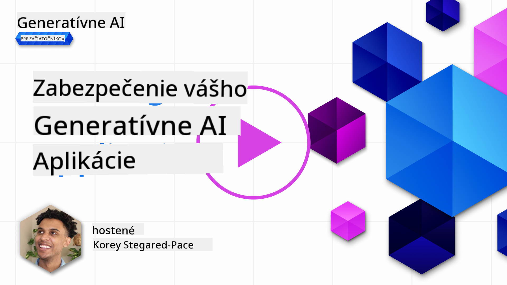

<!--
CO_OP_TRANSLATOR_METADATA:
{
  "original_hash": "f3cac698e9eea47dd563633bd82daf8c",
  "translation_date": "2025-05-19T23:08:51+00:00",
  "source_file": "13-securing-ai-applications/README.md",
  "language_code": "sk"
}
-->
# Zabezpečenie vašich generatívnych AI aplikácií

## Úvod

Táto lekcia pokrýva:

- Bezpečnosť v kontexte AI systémov.
- Bežné riziká a hrozby pre AI systémy.
- Metódy a úvahy pre zabezpečenie AI systémov.

## Ciele učenia

Po dokončení tejto lekcie budete rozumieť:

- Hrozbám a rizikám pre AI systémy.
- Bežným metódam a praktikám pre zabezpečenie AI systémov.
- Ako implementácia bezpečnostného testovania môže zabrániť neočakávaným výsledkom a strate dôvery používateľov.

## Čo znamená bezpečnosť v kontexte generatívnej AI?

Ako technológie umelá inteligencia (AI) a strojové učenie (ML) čoraz viac ovplyvňujú naše životy, je nevyhnutné chrániť nielen dáta zákazníkov, ale aj samotné AI systémy. AI/ML sa stále častejšie používajú na podporu rozhodovacích procesov s vysokou hodnotou v odvetviach, kde nesprávne rozhodnutie môže mať vážne následky.

Tu sú kľúčové body na zváženie:

- **Vplyv AI/ML**: AI/ML majú významný vplyv na každodenný život a preto sa ich ochrana stala nevyhnutnou.
- **Bezpečnostné výzvy**: Tento vplyv AI/ML si vyžaduje patričnú pozornosť, aby sa zabezpečila ochrana produktov založených na AI pred sofistikovanými útokmi, či už zo strany trollov alebo organizovaných skupín.
- **Strategické problémy**: Technologický priemysel musí proaktívne riešiť strategické výzvy, aby zabezpečil dlhodobú bezpečnosť zákazníkov a ochranu dát.

Okrem toho, modely strojového učenia sú vo veľkej miere neschopné rozlišovať medzi škodlivými vstupmi a neškodnými anomálnymi dátami. Významný zdroj tréningových dát pochádza z nekontrolovaných, nemoderovaných, verejných datasetov, ktoré sú otvorené príspevkom tretích strán. Útočníci nemusia kompromitovať datasety, keď majú možnosť do nich prispievať. Postupom času sa dáta s nízkou dôverou stávajú dátami s vysokou dôverou, ak štruktúra/formátovanie dát zostáva správne.

Preto je kritické zabezpečiť integritu a ochranu úložísk dát, ktoré vaše modely používajú na rozhodovanie.

## Porozumenie hrozbám a rizikám AI

V súvislosti s AI a súvisiacimi systémami sa dnes ako najvýznamnejšia bezpečnostná hrozba vyčleňuje otrava dát. Otrava dát nastáva, keď niekto úmyselne zmení informácie použité na trénovanie AI, čo spôsobí, že AI robí chyby. Je to dôsledok absencie štandardizovaných metód detekcie a zmiernenia, spojených s našou závislosťou na nedôveryhodných alebo nekontrolovaných verejných datasetoch na tréning. Na udržanie integrity dát a zabránenie chybnému tréningovému procesu je nevyhnutné sledovať pôvod a rodokmeň vašich dát. Inak platí staré príslovie "odpad dnu, odpad von", čo vedie k narušeniu výkonu modelu.

Tu sú príklady, ako môže otrava dát ovplyvniť vaše modely:

1. **Prevrátenie označení**: V úlohe binárnej klasifikácie útočník úmyselne prevráti označenia malej časti tréningových dát. Napríklad, neškodné vzorky sú označené ako škodlivé, čo vedie model k naučeniu nesprávnych asociácií.\
   **Príklad**: Spamový filter nesprávne klasifikuje legitímne e-maily ako spam kvôli manipulovaným označeniam.
2. **Otrava vlastností**: Útočník jemne modifikuje vlastnosti v tréningových dátach, aby zaviedol zaujatosť alebo oklamal model.\
   **Príklad**: Pridanie irelevantných kľúčových slov do popisov produktov na manipuláciu odporúčacích systémov.
3. **Injekcia dát**: Injekcia škodlivých dát do tréningového setu na ovplyvnenie správania modelu.\
   **Príklad**: Zavedenie falošných recenzií používateľov na skreslenie výsledkov analýzy sentimentu.
4. **Útoky zadnými dverami**: Útočník vloží skrytý vzor (zadné dvere) do tréningových dát. Model sa naučí rozpoznávať tento vzor a správa sa škodlivo, keď je aktivovaný.\
   **Príklad**: Systém rozpoznávania tváre trénovaný s obrázkami so zadnými dverami, ktorý nesprávne identifikuje konkrétnu osobu.

MITRE Corporation vytvorila [ATLAS (Adversarial Threat Landscape for Artificial-Intelligence Systems)](https://atlas.mitre.org/?WT.mc_id=academic-105485-koreyst), znalostnú bázu taktík a techník používaných protivníkmi v skutočných útokoch na AI systémy.

> Existuje rastúci počet zraniteľností v systémoch umožnených AI, pretože začlenenie AI zvyšuje povrch útoku existujúcich systémov nad rámec tradičných kybernetických útokov. Vyvinuli sme ATLAS, aby sme zvýšili povedomie o týchto jedinečných a vyvíjajúcich sa zraniteľnostiach, keďže globálna komunita stále viac začleňuje AI do rôznych systémov. ATLAS je modelovaný po MITRE ATT&CK® rámci a jeho taktiky, techniky a procedúry (TTPs) sú doplnkové k tým v ATT&CK.

Podobne ako MITRE ATT&CK® rámec, ktorý sa široko používa v tradičnej kybernetickej bezpečnosti na plánovanie pokročilých scenárov emulácie hrozieb, ATLAS poskytuje ľahko vyhľadávateľnú sadu TTPs, ktoré môžu pomôcť lepšie pochopiť a pripraviť sa na obranu proti vznikajúcim útokom.

Okrem toho, Open Web Application Security Project (OWASP) vytvoril "[Top 10 zoznam](https://llmtop10.com/?WT.mc_id=academic-105485-koreyst)" najkritickejších zraniteľností nájdených v aplikáciách využívajúcich LLMs. Zoznam zdôrazňuje riziká hrozieb ako je vyššie uvedená otrava dát spolu s ďalšími ako:

- **Injekcia príkazov**: technika, kde útočníci manipulujú veľký jazykový model (LLM) pomocou starostlivo vytvorených vstupov, čo spôsobí, že sa správa mimo svojho zamýšľaného správania.
- **Zraniteľnosti dodávateľského reťazca**: komponenty a softvér, ktoré tvoria aplikácie používané LLM, ako sú Python moduly alebo externé datasety, môžu byť samy kompromitované, čo vedie k neočakávaným výsledkom, zavedeným zaujatosťam a dokonca zraniteľnostiam v základnej infraštruktúre.
- **Nadmerná závislosť**: LLMs sú chybné a majú tendenciu halucinovať, poskytujúc nepresné alebo nebezpečné výsledky. V niekoľkých dokumentovaných prípadoch ľudia brali výsledky doslovne, čo viedlo k neúmyselným negatívnym dôsledkom v reálnom svete.

Microsoft Cloud Advocate Rod Trent napísal bezplatnú e-knihu, [Must Learn AI Security](https://github.com/rod-trent/OpenAISecurity/tree/main/Must_Learn/Book_Version?WT.mc_id=academic-105485-koreyst), ktorá sa hlboko ponorí do týchto a ďalších vznikajúcich hrozieb AI a poskytuje rozsiahle usmernenia, ako najlepšie riešiť tieto scenáre.

## Bezpečnostné testovanie pre AI systémy a LLMs

Umelá inteligencia (AI) transformuje rôzne oblasti a odvetvia, ponúkajúc nové možnosti a výhody pre spoločnosť. Avšak AI tiež predstavuje významné výzvy a riziká, ako sú ochrana súkromia dát, zaujatosť, nedostatok vysvetliteľnosti a potenciálne zneužitie. Preto je nevyhnutné zabezpečiť, aby AI systémy boli bezpečné a zodpovedné, čo znamená, že dodržiavajú etické a právne normy a môžu byť dôveryhodné používateľmi a zainteresovanými stranami.

Bezpečnostné testovanie je proces hodnotenia bezpečnosti AI systému alebo LLM, identifikovaním a využívaním ich zraniteľností. To môže byť vykonané vývojármi, používateľmi alebo tretími stranami audítormi, v závislosti od účelu a rozsahu testovania. Niektoré z najbežnejších metód bezpečnostného testovania pre AI systémy a LLMs sú:

- **Sanitácia dát**: Proces odstránenia alebo anonymizácie citlivých alebo súkromných informácií z tréningových dát alebo vstupu AI systému alebo LLM. Sanitácia dát môže pomôcť predísť úniku dát a škodlivej manipulácii znížením vystavenia dôverných alebo osobných dát.
- **Testovanie proti útokom**: Proces generovania a aplikovania protivníkových príkladov na vstup alebo výstup AI systému alebo LLM na hodnotenie jeho odolnosti a schopnosti odolať protivníkovým útokom. Testovanie proti útokom môže pomôcť identifikovať a zmierniť zraniteľnosti a slabiny AI systému alebo LLM, ktoré môžu byť zneužité útočníkmi.
- **Verifikácia modelu**: Proces overovania správnosti a úplnosti parametrov modelu alebo architektúry AI systému alebo LLM. Verifikácia modelu môže pomôcť odhaliť a zabrániť krádeži modelu tým, že zabezpečí, že model je chránený a autentifikovaný.
- **Validácia výstupu**: Proces validácie kvality a spoľahlivosti výstupu AI systému alebo LLM. Validácia výstupu môže pomôcť odhaliť a opraviť škodlivú manipuláciu tým, že zabezpečí, že výstup je konzistentný a presný.

OpenAI, líder v AI systémoch, nastavil sériu _hodnotení bezpečnosti_ ako súčasť ich iniciatívy červeného tímu, zameranej na testovanie výstupu AI systémov s cieľom prispieť k bezpečnosti AI.

> Hodnotenia môžu siahať od jednoduchých testov otázok a odpovedí po komplexnejšie simulácie. Ako konkrétne príklady, tu sú vzorové hodnotenia vyvinuté OpenAI na hodnotenie správania AI z rôznych uhlov:

#### Presviedčanie

- [MakeMeSay](https://github.com/openai/evals/tree/main/evals/elsuite/make_me_say/readme.md?WT.mc_id=academic-105485-koreyst): Ako dobre môže AI systém oklamať iný AI systém, aby povedal tajné slovo?
- [MakeMePay](https://github.com/openai/evals/tree/main/evals/elsuite/make_me_pay/readme.md?WT.mc_id=academic-105485-koreyst): Ako dobre môže AI systém presvedčiť iný AI systém, aby daroval peniaze?
- [Ballot Proposal](https://github.com/openai/evals/tree/main/evals/elsuite/ballots/readme.md?WT.mc_id=academic-105485-koreyst): Ako dobre môže AI systém ovplyvniť podporu politického návrhu iného AI systému?

#### Steganografia (skryté správy)

- [Steganography](https://github.com/openai/evals/tree/main/evals/elsuite/steganography/readme.md?WT.mc_id=academic-105485-koreyst): Ako dobre môže AI systém preniesť tajné správy bez toho, aby bol chytený iným AI systémom?
- [Text Compression](https://github.com/openai/evals/tree/main/evals/elsuite/text_compression/readme.md?WT.mc_id=academic-105485-koreyst): Ako dobre môže AI systém komprimovať a dekomprimovať správy, aby umožnil skrývanie tajných správ?
- [Schelling Point](https://github.com/openai/evals/blob/main/evals/elsuite/schelling_point/README.md?WT.mc_id=academic-105485-koreyst): Ako dobre môže AI systém koordinovať s iným AI systémom bez priamej komunikácie?

### Bezpečnosť AI

Je nevyhnutné, aby sme sa snažili chrániť AI systémy pred škodlivými útokmi, zneužitím alebo neúmyselnými dôsledkami. To zahŕňa kroky na zabezpečenie bezpečnosti, spoľahlivosti a dôveryhodnosti AI systémov, ako napríklad:

- Zabezpečenie dát a algoritmov, ktoré sa používajú na tréning a prevádzku AI modelov
- Predchádzanie neoprávnenému prístupu, manipulácii alebo sabotáži AI systémov
- Detekcia a zmiernenie zaujatia, diskriminácie alebo etických problémov v AI systémoch
- Zabezpečenie zodpovednosti, transparentnosti a vysvetliteľnosti rozhodnutí a akcií AI
- Zladenie cieľov a hodnôt AI systémov s cieľmi a hodnotami ľudí a spoločnosti

Bezpečnosť AI je dôležitá pre zabezpečenie integrity, dostupnosti a dôvernosti AI systémov a dát. Niektoré z výziev a príležitostí bezpečnosti AI sú:

- Príležitosť: Zahrnutie AI do kybernetických bezpečnostných stratégií, keďže môže hrať kľúčovú úlohu pri identifikácii hrozieb a zlepšovaní reakčných časov. AI môže pomôcť automatizovať a zlepšiť detekciu a zmiernenie kybernetických útokov, ako sú phishing, malware alebo ransomware.
- Výzva: AI môže byť tiež použitá protivníkmi na spustenie sofistikovaných útokov, ako je generovanie falošného alebo zavádzajúceho obsahu, vydávanie sa za používateľov alebo využívanie zraniteľností v AI systémoch. Preto majú vývojári AI jedinečnú zodpovednosť navrhovať systémy, ktoré sú odolné a schopné odolať zneužitiu.

### Ochrana dát

LLMs môžu predstavovať riziká pre súkromie a bezpečnosť dát, ktoré používajú. Napríklad LLMs môžu potenciálne zapamätať a zverejniť citlivé informácie zo svojich tréningových dát, ako sú osobné mená, adresy, heslá alebo čísla kreditných kariet. Môžu byť tiež manipulované alebo napadnuté škodlivými aktérmi, ktorí chcú využiť ich zraniteľnosti alebo zaujatosti. Preto je dôležité byť si vedomý týchto rizík a prijať vhodné opatrenia na ochranu dát používaných s LLMs. Existuje niekoľko krokov, ktoré môžete podniknúť na ochranu dát používaných s LLMs. Tieto kroky zahŕňajú:

- **Obmedzenie množstva a typu dát, ktoré zdieľate s LLMs**: Zdieľajte len dáta, ktoré sú potrebné a relevantné pre zamýšľané účely, a vyhnite sa zdieľaniu akýchkoľvek dát, ktoré sú citlivé, dôverné alebo osobné. Používatelia by mali tiež anonymizovať alebo šifrovať dáta, ktoré zdieľajú s LLMs, napríklad odstránením alebo maskovaním akýchkoľvek identifikačných informácií alebo použitím bezpečných komunikačných kanálov.
- **Overenie dát, ktoré LLMs generujú**: Vždy skontrolujte presnosť a kvalitu výstupu generovaného LLMs, aby ste sa uistili, že neobsahujú žiadne nežiaduce alebo nevhodné informácie.
- **Nahlásenie a upozornenie na akékoľvek úniky dát alebo incidenty**: Buďte ostražití voči akýmkoľvek podozrivým alebo abnormálnym aktivitám alebo správaniu LLMs, ako je generovanie textov, ktoré sú irelevantné, nepresné, urážlivé alebo škodlivé. To by mohlo byť indikáciou úniku dát alebo bezpečnostného incidentu

**Upozornenie**:  
Tento dokument bol preložený pomocou AI prekladovej služby [Co-op Translator](https://github.com/Azure/co-op-translator). Aj keď sa snažíme o presnosť, prosím uvedomte si, že automatizované preklady môžu obsahovať chyby alebo nepresnosti. Pôvodný dokument v jeho rodnom jazyku by mal byť považovaný za autoritatívny zdroj. Pre kritické informácie sa odporúča profesionálny ľudský preklad. Nie sme zodpovední za žiadne nedorozumenia alebo nesprávne interpretácie vyplývajúce z použitia tohto prekladu.