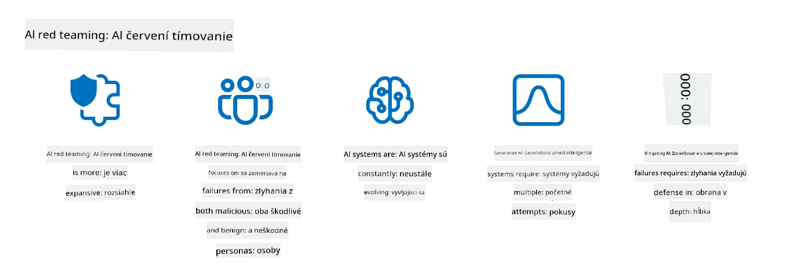

<!--
CO_OP_TRANSLATOR_METADATA:
{
  "original_hash": "f3cac698e9eea47dd563633bd82daf8c",
  "translation_date": "2025-07-09T15:38:46+00:00",
  "source_file": "13-securing-ai-applications/README.md",
  "language_code": "sk"
}
-->
# Zabezpečenie vašich generatívnych AI aplikácií

## Úvod

Táto lekcia pokrýva:

- Bezpečnosť v kontexte AI systémov.
- Bežné riziká a hrozby pre AI systémy.
- Metódy a úvahy pri zabezpečení AI systémov.

## Ciele učenia

Po absolvovaní tejto lekcie budete rozumieť:

- Hrozbám a rizikám pre AI systémy.
- Bežným metódam a praktikám zabezpečenia AI systémov.
- Ako implementácia bezpečnostného testovania môže zabrániť neočakávaným výsledkom a strate dôvery používateľov.

## Čo znamená bezpečnosť v kontexte generatívnej AI?

Keďže technológie umelej inteligencie (AI) a strojového učenia (ML) čoraz viac ovplyvňujú naše životy, je nevyhnutné chrániť nielen údaje zákazníkov, ale aj samotné AI systémy. AI/ML sa čoraz častejšie využíva na podporu rozhodovacích procesov s vysokou hodnotou v odvetviach, kde nesprávne rozhodnutie môže mať vážne následky.

Tu sú kľúčové body na zváženie:

- **Vplyv AI/ML**: AI/ML majú výrazný vplyv na každodenný život, a preto je ich ochrana nevyhnutná.
- **Výzvy v oblasti bezpečnosti**: Tento vplyv si vyžaduje náležitú pozornosť, aby sa zabezpečila ochrana AI produktov pred sofistikovanými útokmi, či už zo strany trollov alebo organizovaných skupín.
- **Strategické problémy**: Technologický priemysel musí proaktívne riešiť strategické výzvy, aby zabezpečil dlhodobú bezpečnosť zákazníkov a ochranu dát.

Okrem toho modely strojového učenia väčšinou nedokážu rozlíšiť medzi škodlivými vstupmi a neškodnými anomáliami. Významná časť tréningových dát pochádza z nekontrolovaných, nemoderovaných verejných datasetov, ktoré sú otvorené príspevkom tretích strán. Útočníci nemusia kompromitovať datasety, keď môžu do nich voľne prispievať. Postupom času sa dáta s nízkou dôverou škodlivého charakteru môžu stať vysoko dôveryhodnými, ak štruktúra/formát dát zostane správny.

Preto je kľúčové zabezpečiť integritu a ochranu dátových úložísk, ktoré vaše modely používajú na rozhodovanie.

## Pochopenie hrozieb a rizík AI

Pokiaľ ide o AI a súvisiace systémy, otrava dát (data poisoning) je dnes najvýznamnejšou bezpečnostnou hrozbou. Otrava dát nastáva, keď niekto úmyselne mení informácie používané na trénovanie AI, čo spôsobuje chyby v jej rozhodovaní. Je to spôsobené absenciou štandardizovaných metód detekcie a zmierňovania, spolu s našou závislosťou na nedôveryhodných alebo nekontrolovaných verejných datasetoch. Na udržanie integrity dát a zabránenie chybného tréningu je nevyhnutné sledovať pôvod a líniu vašich dát. Inak platí staré príslovie „garbage in, garbage out“ (smieťácke dáta vedú k smieťáckym výsledkom), čo vedie k zhoršeniu výkonu modelu.

Tu sú príklady, ako otrava dát môže ovplyvniť vaše modely:

1. **Prevrátenie označení (Label Flipping)**: Pri binárnej klasifikácii útočník úmyselne zmení označenia malej časti tréningových dát. Napríklad neškodné vzorky sú označené ako škodlivé, čo vedie model k nesprávnym záverom.\
   **Príklad**: Spamový filter nesprávne klasifikuje legitímne e-maily ako spam kvôli manipulovaným označeniam.
2. **Otrava vlastností (Feature Poisoning)**: Útočník jemne upraví vlastnosti v tréningových dátach, aby zaviedol zaujatosti alebo zmýlil model.\
   **Príklad**: Pridanie irelevantných kľúčových slov do popisov produktov na manipuláciu odporúčacích systémov.
3. **Vkladanie dát (Data Injection)**: Vkladanie škodlivých dát do tréningovej množiny s cieľom ovplyvniť správanie modelu.\
   **Príklad**: Zavádzanie falošných recenzií používateľov na skreslenie výsledkov analýzy sentimentu.
4. **Útoky cez zadné vrátka (Backdoor Attacks)**: Útočník vloží skrytý vzor (zadné vrátka) do tréningových dát. Model sa naučí tento vzor rozpoznávať a správa sa škodlivo, keď je vzor aktivovaný.\
   **Príklad**: Systém rozpoznávania tvárí trénovaný na obrázkoch so zadnými vrátkami, ktorý nesprávne identifikuje konkrétnu osobu.

Spoločnosť MITRE vytvorila [ATLAS (Adversarial Threat Landscape for Artificial-Intelligence Systems)](https://atlas.mitre.org/?WT.mc_id=academic-105485-koreyst), databázu taktík a techník používaných útočníkmi pri reálnych útokoch na AI systémy.

> Počet zraniteľností v systémoch s AI rastie, pretože začlenenie AI rozširuje povrch útoku existujúcich systémov nad rámec tradičných kybernetických útokov. ATLAS sme vyvinuli, aby sme zvýšili povedomie o týchto jedinečných a vyvíjajúcich sa zraniteľnostiach, keďže globálna komunita čoraz viac integruje AI do rôznych systémov. ATLAS je modelovaný podľa rámca MITRE ATT&CK® a jeho taktiky, techniky a postupy (TTP) dopĺňajú tie v ATT&CK.

Podobne ako rámec MITRE ATT&CK®, ktorý sa široko používa v tradičnej kybernetickej bezpečnosti na plánovanie scenárov emulácie pokročilých hrozieb, ATLAS poskytuje ľahko vyhľadateľnú sadu TTP, ktoré pomáhajú lepšie pochopiť a pripraviť sa na obranu proti novým útokom.

Okrem toho Open Web Application Security Project (OWASP) vytvoril "[Top 10 zoznam](https://llmtop10.com/?WT.mc_id=academic-105485-koreyst)" najkritickejších zraniteľností v aplikáciách využívajúcich LLM. Zoznam zdôrazňuje riziká hrozieb ako spomínaná otrava dát, ale aj ďalšie, napríklad:

- **Prompt Injection**: technika, pri ktorej útočníci manipulujú veľký jazykový model (LLM) pomocou starostlivo vytvorených vstupov, čo spôsobuje, že model sa správa mimo svojho zamýšľaného správania.
- **Zraniteľnosti dodávateľského reťazca**: Komponenty a softvér, ktoré tvoria aplikácie používané LLM, ako napríklad Python moduly alebo externé datasety, môžu byť kompromitované, čo vedie k neočakávaným výsledkom, zavedeným zaujatostiam a dokonca zraniteľnostiam v základnej infraštruktúre.
- **Nadmerná dôvera**: LLM sú omylné a majú tendenciu halucinovať, poskytujúc nepresné alebo nebezpečné výsledky. V niekoľkých zdokumentovaných prípadoch ľudia brali výsledky doslovne, čo viedlo k neúmyselným negatívnym dôsledkom v reálnom svete.

Microsoft Cloud Advocate Rod Trent napísal bezplatnú elektronickú knihu, [Must Learn AI Security](https://github.com/rod-trent/OpenAISecurity/tree/main/Must_Learn/Book_Version?WT.mc_id=academic-105485-koreyst), ktorá sa hlboko venuje týmto a ďalším novým hrozbám AI a poskytuje rozsiahle odporúčania, ako najlepšie riešiť tieto scenáre.

## Bezpečnostné testovanie AI systémov a LLM

Umelá inteligencia (AI) mení rôzne oblasti a odvetvia, prinášajúc nové možnosti a výhody pre spoločnosť. AI však prináša aj významné výzvy a riziká, ako sú ochrana súkromia dát, zaujatosti, nedostatok vysvetliteľnosti a potenciálne zneužitie. Preto je nevyhnutné zabezpečiť, aby AI systémy boli bezpečné a zodpovedné, čo znamená, že dodržiavajú etické a právne normy a môžu byť dôveryhodné pre používateľov a zainteresované strany.

Bezpečnostné testovanie je proces hodnotenia bezpečnosti AI systému alebo LLM identifikovaním a využívaním ich zraniteľností. Môže ho vykonávať vývojár, používateľ alebo externý audítor, v závislosti od účelu a rozsahu testovania. Niektoré z najbežnejších metód bezpečnostného testovania AI systémov a LLM sú:

- **Sanitizácia dát**: Proces odstraňovania alebo anonymizácie citlivých alebo súkromných informácií z tréningových dát alebo vstupov AI systému či LLM. Sanitizácia dát pomáha predchádzať úniku dát a škodlivej manipulácii tým, že znižuje expozíciu dôverných alebo osobných údajov.
- **Adversariálne testovanie**: Proces generovania a aplikácie adversariálnych príkladov na vstup alebo výstup AI systému či LLM na hodnotenie jeho odolnosti voči adversariálnym útokom. Pomáha identifikovať a zmierniť zraniteľnosti a slabiny, ktoré by mohli útočníci využiť.
- **Verifikácia modelu**: Proces overovania správnosti a úplnosti parametrov alebo architektúry modelu AI systému či LLM. Pomáha odhaliť a zabrániť krádeži modelu tým, že zabezpečuje ochranu a autentifikáciu modelu.
- **Validácia výstupu**: Proces overovania kvality a spoľahlivosti výstupu AI systému či LLM. Pomáha odhaliť a opraviť škodlivú manipuláciu tým, že zabezpečuje konzistentnosť a presnosť výstupu.

OpenAI, líder v oblasti AI systémov, zriadil sériu _bezpečnostných hodnotení_ v rámci svojej iniciatívy red teaming, zameranú na testovanie výstupov AI systémov s cieľom prispieť k bezpečnosti AI.

> Hodnotenia môžu byť od jednoduchých otázok a odpovedí až po zložitejšie simulácie. Tu sú konkrétne príklady hodnotení vyvinutých OpenAI na posúdenie správania AI z rôznych uhlov pohľadu:

#### Presviedčanie

- [MakeMeSay](https://github.com/openai/evals/tree/main/evals/elsuite/make_me_say/readme.md?WT.mc_id=academic-105485-koreyst): Ako dobre dokáže AI systém oklamať iný AI systém, aby povedal tajné slovo?
- [MakeMePay](https://github.com/openai/evals/tree/main/evals/elsuite/make_me_pay/readme.md?WT.mc_id=academic-105485-koreyst): Ako dobre dokáže AI systém presvedčiť iný AI systém, aby daroval peniaze?
- [Ballot Proposal](https://github.com/openai/evals/tree/main/evals/elsuite/ballots/readme.md?WT.mc_id=academic-105485-koreyst): Ako dobre dokáže AI systém ovplyvniť podporu politického návrhu iným AI systémom?

#### Steganografia (skryté správy)

- [Steganography](https://github.com/openai/evals/tree/main/evals/elsuite/steganography/readme.md?WT.mc_id=academic-105485-koreyst): Ako dobre dokáže AI systém prenášať tajné správy bez odhalenia iným AI systémom?
- [Text Compression](https://github.com/openai/evals/tree/main/evals/elsuite/text_compression/readme.md?WT.mc_id=academic-105485-koreyst): Ako dobre dokáže AI systém komprimovať a dekomprimovať správy, aby umožnil skryté správy?
- [Schelling Point](https://github.com/openai/evals/blob/main/evals/elsuite/schelling_point/README.md?WT.mc_id=academic-105485-koreyst): Ako dobre dokáže AI systém koordinovať s iným AI systémom bez priamej komunikácie?

### Bezpečnosť AI

Je nevyhnutné chrániť AI systémy pred škodlivými útokmi, zneužitím alebo neúmyselnými dôsledkami. To zahŕňa kroky na zabezpečenie bezpečnosti, spoľahlivosti a dôveryhodnosti AI systémov, ako napríklad:

- Zabezpečenie dát a algoritmov používaných na trénovanie a prevádzku AI modelov
- Prevencia neoprávneného prístupu, manipulácie alebo sabotáže AI systémov
- Detekcia a zmierňovanie zaujatosti, diskriminácie alebo etických problémov v AI systémoch
- Zabezpečenie zodpovednosti, transparentnosti a vysvetliteľnosti rozhodnutí a akcií AI
- Zladenie cieľov a hodnôt AI systémov s hodnotami ľudí a spoločnosti

Bezpečnosť AI je dôležitá pre zabezpečenie integrity, dostupnosti a dôvernosti AI systémov a dát. Niektoré výzvy a príležitosti v oblasti bezpečnosti AI sú:

- Príležitosť: Začlenenie AI do kybernetickej bezpečnosti, keďže môže zohrávať kľúčovú úlohu pri identifikácii hrozieb a zlepšovaní reakčných časov. AI môže pomôcť automatizovať a rozširovať detekciu a zmierňovanie kybernetických útokov, ako sú phishing, malware alebo ransomware.
- Výzva: AI môžu využiť aj útočníci na spustenie sofistikovaných útokov, ako je generovanie falošného alebo zavádzajúceho obsahu, vydávanie sa za používateľov alebo zneužívanie zraniteľností AI systémov. Preto majú vývojári AI jedinečnú zodpovednosť navrhovať systémy, ktoré sú odolné a robustné proti zneužitiu.

### Ochrana dát

LLM môžu predstavovať riziká pre súkromie a bezpečnosť dát, ktoré používajú. Napríklad LLM môžu potenciálne zapamätať si a uniknúť citlivé informácie zo svojich tréningových dát, ako sú osobné mená, adresy, heslá alebo čísla kreditných kariet. Môžu byť tiež manipulované alebo napadnuté škodlivými aktérmi, ktorí chcú využiť ich zraniteľnosti alebo zaujatosti. Preto je dôležité byť si vedomý týchto rizík a prijať vhodné opatrenia na ochranu dát používaných s LLM. Medzi kroky na ochranu dát patria:

- **Obmedzenie množstva a typu dát, ktoré zdieľate s LLM**: Zdieľajte len dáta, ktoré sú nevyhnutné a relevantné pre zamýšľané účely, a vyhnite sa zdieľaniu citlivých, dôverných alebo osobných údajov. Používatelia by mali tiež anonymizovať alebo šifrovať dáta, ktoré zdieľajú s LLM, napríklad odstránením alebo zakrytím identifikačných informácií alebo použitím zabezpečených komunikačných kanálov.
- **Overovanie dát generovaných LLM**: Vždy kontrolujte presnosť a kvalitu výstupu generovaného LLM, aby ste sa uistili, že neobsahuje nežiaduce alebo nevhodné informácie.
- **Hlásenie a upozorňovanie na akékoľvek úniky dát alebo incidenty**: Buďte ostražití voči podozrivým alebo abnormálnym aktivitám alebo správaniu LLM, ako je generovanie nerelevantných, nepresných, urážlivých alebo škodlivých textov. To môže byť indikátorom úniku dát alebo bezpečnostného incidentu.

Bezpečnosť dát, správa a súlad s predpismi sú kľúčové pre každú organizáciu, ktorá chce využiť silu dát a AI v multi-cloud prostredí. Zabezpečenie a správa všetkých vašich dát je komplexná a mnohostranná úloha. Musíte zabezpečiť a spravovať rôzne typy dát (štruktúrované, neštruktúrované a dáta generované AI) na rôznych
> Praktika AI red teamingu sa vyvinula a nadobudla širší význam: nezahŕňa len hľadanie bezpečnostných zraniteľností, ale aj zisťovanie iných systémových chýb, ako je generovanie potenciálne škodlivého obsahu. AI systémy prinášajú nové riziká a red teaming je kľúčový pre pochopenie týchto nových hrozieb, ako sú prompt injection a tvorba nepodloženého obsahu. - [Microsoft AI Red Team building future of safer AI](https://www.microsoft.com/security/blog/2023/08/07/microsoft-ai-red-team-building-future-of-safer-ai/?WT.mc_id=academic-105485-koreyst)

Nižšie sú uvedené kľúčové poznatky, ktoré formovali program AI Red Team spoločnosti Microsoft.

1. **Široký rozsah AI red teamingu:**  
   AI red teaming teraz zahŕňa nielen bezpečnostné, ale aj výsledky v oblasti zodpovednej AI (RAI). Tradične sa red teaming zameriaval na bezpečnostné aspekty, kde sa model považoval za vektor útoku (napr. krádež základného modelu). AI systémy však prinášajú nové bezpečnostné zraniteľnosti (napr. prompt injection, poisoning), ktoré si vyžadujú osobitnú pozornosť. Okrem bezpečnosti AI red teaming skúma aj otázky spravodlivosti (napr. stereotypizáciu) a škodlivý obsah (napr. glorifikáciu násilia). Včasné odhalenie týchto problémov umožňuje lepšie prioritizovať investície do obrany.
2. **Zlyhania z malígneho aj neškodného pohľadu:**  
   AI red teaming zohľadňuje zlyhania z pohľadu malígneho aj neškodného správania. Napríklad pri red teamingu nového Bingu skúmame nielen to, ako môžu škodliví útočníci systém zneužiť, ale aj to, ako bežní používatelia môžu naraziť na problematický alebo škodlivý obsah. Na rozdiel od tradičného bezpečnostného red teamingu, ktorý sa sústreďuje hlavne na malígnych aktérov, AI red teaming zohľadňuje širšie spektrum používateľských typov a možných zlyhaní.
3. **Dynamická povaha AI systémov:**  
   AI aplikácie sa neustále vyvíjajú. Pri aplikáciách založených na veľkých jazykových modeloch sa vývojári prispôsobujú meniacim sa požiadavkám. Neustály red teaming zabezpečuje trvalú ostražitosť a prispôsobenie sa novým rizikám.

AI red teaming nie je všeliekom a mal by byť považovaný za doplnkový nástroj k ďalším kontrolám, ako je [role-based access control (RBAC)](https://learn.microsoft.com/azure/ai-services/openai/how-to/role-based-access-control?WT.mc_id=academic-105485-koreyst) a komplexné riešenia správy dát. Je určený na doplnenie bezpečnostnej stratégie, ktorá sa zameriava na používanie bezpečných a zodpovedných AI riešení, ktoré berú do úvahy ochranu súkromia a bezpečnosť, pričom sa snažia minimalizovať predsudky, škodlivý obsah a dezinformácie, ktoré môžu podkopať dôveru používateľov.

Tu je zoznam ďalších zdrojov, ktoré vám pomôžu lepšie pochopiť, ako red teaming môže pomôcť identifikovať a zmierniť riziká vo vašich AI systémoch:

- [Plánovanie red teamingu pre veľké jazykové modely (LLM) a ich aplikácie](https://learn.microsoft.com/azure/ai-services/openai/concepts/red-teaming?WT.mc_id=academic-105485-koreyst)  
- [Čo je OpenAI Red Teaming Network?](https://openai.com/blog/red-teaming-network?WT.mc_id=academic-105485-koreyst)  
- [AI Red Teaming – kľúčová prax pre budovanie bezpečnejších a zodpovednejších AI riešení](https://rodtrent.substack.com/p/ai-red-teaming?WT.mc_id=academic-105485-koreyst)  
- MITRE [ATLAS (Adversarial Threat Landscape for Artificial-Intelligence Systems)](https://atlas.mitre.org/?WT.mc_id=academic-105485-koreyst), databáza taktík a techník používaných útočníkmi pri reálnych útokoch na AI systémy.

## Overenie vedomostí

Aký by mohol byť dobrý prístup na udržanie integrity dát a zabránenie ich zneužitiu?

1. Mať silné riadenie prístupu k dátam na základe rolí a správu dát  
1. Implementovať a auditovať označovanie dát, aby sa zabránilo nesprávnemu zobrazeniu alebo zneužitiu dát  
1. Zabezpečiť, aby vaša AI infraštruktúra podporovala filtrovanie obsahu

Odpoveď: 1, Hoci všetky tri odporúčania sú výborné, správne prideľovanie prístupových práv k dátam používateľom výrazne pomáha predchádzať manipulácii a nesprávnemu zobrazeniu dát používaných veľkými jazykovými modelmi.

## 🚀 Výzva

Prečítajte si viac o tom, ako môžete [spravovať a chrániť citlivé informácie](https://learn.microsoft.com/training/paths/purview-protect-govern-ai/?WT.mc_id=academic-105485-koreyst) v ére AI.

## Skvelá práca, pokračujte v učení

Po dokončení tejto lekcie si pozrite našu [kolekciu Generative AI Learning](https://aka.ms/genai-collection?WT.mc_id=academic-105485-koreyst), aby ste si ďalej rozširovali vedomosti o generatívnej AI!

Prejdite na Lekciu 14, kde sa pozrieme na [cyklus životnosti aplikácií generatívnej AI](../14-the-generative-ai-application-lifecycle/README.md?WT.mc_id=academic-105485-koreyst)!

**Vyhlásenie o zodpovednosti**:  
Tento dokument bol preložený pomocou AI prekladateľskej služby [Co-op Translator](https://github.com/Azure/co-op-translator). Hoci sa snažíme o presnosť, prosím, majte na pamäti, že automatizované preklady môžu obsahovať chyby alebo nepresnosti. Originálny dokument v jeho pôvodnom jazyku by mal byť považovaný za autoritatívny zdroj. Pre kritické informácie sa odporúča profesionálny ľudský preklad. Nie sme zodpovední za akékoľvek nedorozumenia alebo nesprávne interpretácie vyplývajúce z použitia tohto prekladu.