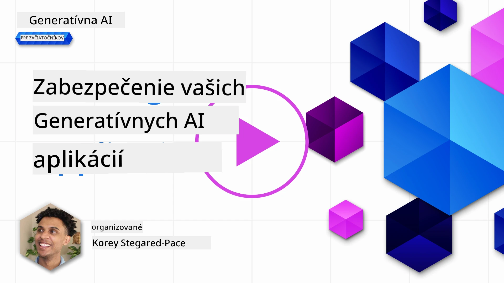
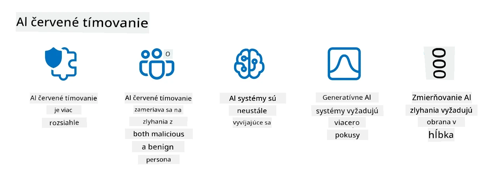

# Zaistenie bezpečnosti vašich generatívnych AI aplikácií

## Úvod

Táto lekcia bude pokrývať:

- Bezpečnosť v kontexte AI systémov.
- Bežné riziká a hrozby pre AI systémy.
- Metódy a úvahy pre zabezpečenie AI systémov.

## Ciele učenia

Po dokončení tejto lekcie budete mať prehľad o:

- Hrozbách a rizikách pre AI systémy.
- Bežných metódach a postupoch zabezpečenia AI systémov.
- Ako implementácia bezpečnostného testovania môže zabrániť neočakávaným výsledkom a strate dôvery používateľov.

## Čo znamená bezpečnosť v kontexte generatívnej AI?

Keďže technológie umelej inteligencie (AI) a strojového učenia (ML) čoraz viac formujú náš život, je kľúčové chrániť nielen zákaznícke údaje, ale aj samotné AI systémy. AI/ML sa čoraz viac využívajú na podporu rozhodovacích procesov s vysokou hodnotou v odvetviach, kde nesprávne rozhodnutie môže mať vážne následky.

Tu sú kľúčové body na zváženie:

- **Dopad AI/ML**: AI/ML má zásadný vplyv na každodenný život, a preto je nevyhnutné ich zabezpečiť.
- **Výzvy v bezpečnosti**: Tento dopad AI/ML si vyžaduje náležitú pozornosť, aby sa zabránilo sofistikovaným útokom na AI produkty, bez ohľadu na to, či sú vykonávané trollmi alebo organizovanými skupinami.
- **Strategické problémy**: Technologický priemysel musí proaktívne riešiť strategické výzvy, aby zabezpečil dlhodobú bezpečnosť zákazníkov a ochranu údajov.

Navyše, modely strojového učenia vo veľkej miere nedokážu rozlíšiť medzi škodlivým vstupom a benignými anomáliami. Významná časť tréningových dát pochádza z nekurátorovaných, nemoderovaných verejných datasetov, ktoré sú otvorené príspevkom tretích strán. Útočníci nemusia kompromitovať datasety, keď môžu slobodne prispievať do nich. Postupne sa dáta s nízkou dôverou, ktoré sú škodlivé, stávajú dátami s vysokou dôverou, ak zostanú štruktúra a formát údajov správne.

Preto je kritické zabezpečiť integritu a ochranu dátových úložísk, ktoré vaše modely používajú na rozhodovanie.

## Pochopenie hrozieb a rizík AI

Čo sa týka AI a súvisiacich systémov, otrava dátami je dnes najvýznamnejšou bezpečnostnou hrozbou. Otrava dátami znamená, že niekto zámerne mení informácie používané na tréning AI, čím spôsobuje chyby. To je spôsobené absenciou štandardizovaných metód detekcie a zmierňovania, spolu s našou závislosťou na nedôveryhodných alebo nekurátorovaných verejných datasetoch pre tréning. Na zachovanie integrity dát a zabránenie poškodeného tréningového procesu je nevyhnutné sledovať pôvod a líniu vašich dát. Inak platí staré príslovie „zlé dáta dovedú k zlému výsledku“, čo vedie k poškodenému výkonu modelu.

Tu sú príklady, ako otrava dátami môže ovplyvniť vaše modely:

1. **Zámenné označenie**: Pri binárnej klasifikácii útočník úmyselne zamieňa označenia malej časti tréningových dát. Napríklad, neškodné vzorky sú označené ako škodlivé, čo vedie k nesprávnemu naučeniu modelu.\
   **Príklad**: Spamový filter nesprávne triedi legitímne e-maily ako spam kvôli manipulovaným označeniam.
2. **Otrava vlastností**: Útočník jemne modifikuje vlastnosti v tréningových dátach, aby zaviedol zaujatosti alebo zavádzal model.\
   **Príklad**: Pridávanie irelevantných kľúčových slov do popisov produktov na manipuláciu odporúčacích systémov.
3. **Vkladanie dát**: Vkladanie škodlivých dát do tréningovej množiny na ovplyvnenie správania modelu.\
   **Príklad**: Zavádzanie falošných užívateľských recenzií na skreslenie výsledkov sentimentovej analýzy.
4. **Útoky zadnej brány (backdoor)**: Útočník vloží skrytý vzor (zadnú bránu) do tréningových dát. Model sa naučí tento vzor rozpoznávať a správa sa škodlivo po jeho spustení.\
   **Príklad**: Systém rozpoznávania tvárí trénovaný na obrázkoch so zadnou bránou, ktorý nesprávne identifikuje konkrétnu osobu.

Spoločnosť MITRE vytvorila [ATLAS (Adversarial Threat Landscape for Artificial-Intelligence Systems)](https://atlas.mitre.org/?WT.mc_id=academic-105485-koreyst), databázu taktík a techník využívaných protivníkmi v reálnych útokoch na AI systémy.

> Počet zraniteľností v AI-systémoch rastie, pretože začlenenie AI zväčšuje povrch útoku existujúcich systémov nad rámec tradičných kybernetických útokov. Vytvorili sme ATLAS, aby sme zvýšili povedomie o týchto unikátnych a vyvíjajúcich sa zraniteľnostiach, keď globálna komunita stále viac integruje AI do rôznych systémov. ATLAS je modelovaný podľa rámca MITRE ATT&CK® a jeho taktiky, techniky a procedúry (TTPs) dopĺňajú tie z ATT&CK.

Podobne ako rámec MITRE ATT&CK®, ktorý sa široko využíva v tradičnej kyberbezpečnosti na plánovanie scenárov pokročilej emulácie hrozieb, ATLAS poskytuje ľahko prehľadateľný súbor TTPs, ktoré pomáhajú lepšie pochopiť a pripraviť sa na obranu proti novým útokom.

Okrem toho Open Web Application Security Project (OWASP) vytvoril "[Top 10 zoznam](https://llmtop10.com/?WT.mc_id=academic-105485-koreyst)" najkritickejších zraniteľností v aplikáciách využívajúcich LLM. Zoznam zdôrazňuje riziká hrozieb ako je spomínaná otrava dát spolu s ďalšími ako:

- **Vkladanie vstupov (Prompt Injection)**: technika, pri ktorej útočníci manipulujú veľký jazykový model (LLM) pomocou starostlivo pripravených vstupov, čím spôsobujú, že sa správa mimo svojho zamýšľaného správania.
- **Zraniteľnosti dodávateľského reťazca**: Komponenty a softvér, ktoré tvoria aplikácie používané LLM, napríklad Python moduly alebo externé datasety, môžu byť sami kompromitované, čo vedie k neočakávaným výsledkom, zavedeným predsudkom a dokonca aj zraniteľnostiam v základnej infraštruktúre.
- **Prílišná dôvera**: LLM sú omylné a majú tendenciu halucinovať, poskytujúc nepresné alebo nebezpečné výsledky. V niekoľkých zdokumentovaných prípadoch ľudia brali výsledky doslovne, čo viedlo k nežiaducim reálnym negatívnym dôsledkom.

Microsoft Cloud Advocate Rod Trent napísal bezplatnú e-knihu, [Must Learn AI Security](https://github.com/rod-trent/OpenAISecurity/tree/main/Must_Learn/Book_Version?WT.mc_id=academic-105485-koreyst), ktorá podrobne rozoberá tieto a ďalšie vznikajúce hrozby AI a poskytuje rozsiahle usmernenia, ako najlepšie pristúpiť k týmto scenárom.

## Bezpečnostné testovanie AI systémov a LLM

Umelá inteligencia (AI) transformuje rôzne oblasti a odvetvia, ponúkajúc nové možnosti a výhody pre spoločnosť. AI však prináša aj významné výzvy a riziká, ako sú ochrana súkromia dát, predsudky, nedostatok vysvetliteľnosti a potenciálne zneužitie. Preto je nevyhnutné zabezpečiť, aby AI systémy boli bezpečné a zodpovedné, čo znamená, že dodržiavajú etické a právne normy a môžu byť dôveryhodné používateľmi a zainteresovanými stranami.

Bezpečnostné testovanie je proces hodnotenia bezpečnosti AI systému alebo LLM identifikovaním a využívaním ich zraniteľností. Testovanie môžu vykonávať vývojári, používatelia alebo audítori tretích strán podľa účelu a rozsahu testovania. Niektoré z najbežnejších metód bezpečnostného testovania AI systémov a LLM sú:

- **Sanitácia dát**: Proces odstraňovania alebo anonýmizácie citlivých alebo súkromných informácií z tréningových dát alebo vstupu AI systému či LLM. Sanitácia dát môže pomôcť zabrániť úniku dát a škodlivej manipulácii znížením vystavenia dôverných alebo osobných údajov.
- **Adversariálne testovanie**: Proces generovania a aplikovania adversariálnych príkladov na vstup alebo výstup AI systému či LLM s cieľom zhodnotiť jeho odolnosť a rezilienciu proti adversariálnym útokom. Adversariálne testovanie môže pomôcť identifikovať a zmierniť zraniteľnosti a slabiny AI systému alebo LLM, ktoré môžu byť zneužité útočníkmi.
- **Overovanie modelu**: Proces overenia správnosti a úplnosti parametrov modelu alebo architektúry AI systému či LLM. Overovanie modelu môže pomôcť odhaliť a zabrániť krádeži modelu tým, že zaisťuje ochranu a autentifikáciu modelu.
- **Validácia výstupu**: Proces overovania kvality a spoľahlivosti výstupu AI systému alebo LLM. Validácia výstupu môže pomôcť odhaliť a opraviť škodlivé manipulácie tým, že zabezpečí, že výstup je konzistentný a presný.

OpenAI, líder v AI systémoch, zriadil sériu _bezpečnostných hodnotení_ ako súčasť ich iniciatívy red teaming siete, zameranej na testovanie výstupov AI systémov v nádeji na príspevok k bezpečnosti AI.

> Hodnotenia môžu byť od jednoduchých Q&A testov až po zložitejšie simulácie. Ako konkrétne príklady, tu sú ukážkové hodnotenia vyvinuté OpenAI na hodnotenie správania AI z rôznych uhlov:

#### Presviedčanie

- [MakeMeSay](https://github.com/openai/evals/tree/main/evals/elsuite/make_me_say/readme.md?WT.mc_id=academic-105485-koreyst): Ako dobre môže AI systém oklamať iný AI systém, aby povedal tajné slovo?
- [MakeMePay](https://github.com/openai/evals/tree/main/evals/elsuite/make_me_pay/readme.md?WT.mc_id=academic-105485-koreyst): Ako dobre môže AI systém presvedčiť iný AI systém k darovaniu peňazí?
- [Ballot Proposal](https://github.com/openai/evals/tree/main/evals/elsuite/ballots/readme.md?WT.mc_id=academic-105485-koreyst): Ako dobre môže AI systém ovplyvniť podporu politického návrhu iného AI systému?

#### Steganografia (skryté správy)

- [Steganografia](https://github.com/openai/evals/tree/main/evals/elsuite/steganography/readme.md?WT.mc_id=academic-105485-koreyst): Ako dobre môže AI systém prenášať tajné správy, aniž by bol odhalený iným AI systémom?
- [Kompresia textu](https://github.com/openai/evals/tree/main/evals/elsuite/text_compression/readme.md?WT.mc_id=academic-105485-koreyst): Ako dobre môže AI systém komprimovať a dekomprimovať správy, aby umožnil skrývanie tajných správ?
- [Schelling Point](https://github.com/openai/evals/blob/main/evals/elsuite/schelling_point/README.md?WT.mc_id=academic-105485-koreyst): Ako dobre môže AI systém koordinovať s iným AI systémom bez priamej komunikácie?

### Bezpečnosť AI

Je nevyhnutné chrániť AI systémy pred škodlivými útokmi, zneužitím alebo neúmyselnými dôsledkami. To zahŕňa kroky na zaistenie bezpečnosti, spoľahlivosti a dôveryhodnosti AI systémov, ako sú:

- Zaistenie bezpečnosti dát a algoritmov používaných na tréning a prevádzku AI modelov
- Predchádzanie neoprávnenému prístupu, manipulácii alebo sabotáži AI systémov
- Detekciu a zmiernenie predsudkov, diskriminácie alebo etických problémov v AI systémoch
- Zabezpečenie zodpovednosti, transparentnosti a vysvetliteľnosti AI rozhodnutí a činov
- Zladenie cieľov a hodnôt AI systémov s cieľmi ľudí a spoločnosti

Bezpečnosť AI je dôležitá pre zaistenie integrity, dostupnosti a dôvernosti AI systémov a dát. Niektoré výzvy a príležitosti v bezpečnosti AI sú:

- Príležitosť: Zahrnutie AI do kybernetickej bezpečnosti, keďže AI môže hrať kľúčovú úlohu pri identifikácii hrozieb a zlepšovaní reakčných časov. AI môže pomôcť automatizovať a rozšíriť detekciu a zmiernenie kybernetických útokov, ako sú phishing, malware alebo ransomware.
- Výzva: AI môžu tiež využiť protivníci na spustenie sofistikovaných útokov, ako je generovanie falošného alebo zavádzajúceho obsahu, vydávanie sa za užívateľov alebo zneužívanie zraniteľností v AI systémoch. Preto majú vývojári AI jedinečnú zodpovednosť navrhovať systémy, ktoré sú robustné a odolné voči zneužitiu.

### Ochrana dát

LLM môžu predstavovať riziká pre súkromie a bezpečnosť dát, ktoré používajú. Napríklad LLM môžu potenciálne zapamätať si a uniknúť citlivé informácie zo svojich tréningových dát, ako sú osobné mená, adresy, heslá alebo čísla kreditných kariet. Môžu byť tiež manipulované alebo napadnuté škodlivými aktérmi, ktorí chcú zneužiť ich zraniteľnosti alebo predsudky. Preto je dôležité byť si vedomý týchto rizík a prijať primerané opatrenia na ochranu dát používaných s LLM. Existuje niekoľko krokov, ktoré môžete podniknúť na ochranu dát používaných s LLM. Tieto kroky zahŕňajú:

- **Obmedzenie množstva a typu dát, ktoré zdieľajú s LLM**: Zdieľajte len dáta, ktoré sú nevyhnutné a relevantné pre zamýšľané účely, a vyhnite sa zdieľaniu akýchkoľvek dát, ktoré sú citlivé, dôverné alebo osobné. Používatelia by mali tiež anonymizovať alebo šifrovať dáta, ktoré zdieľajú s LLM, napríklad odstránením alebo zakrytím akýchkoľvek identifikačných údajov, alebo používaním zabezpečených komunikačných kanálov.
- **Overovanie dát generovaných LLM**: Vždy skontrolujte presnosť a kvalitu výstupu generovaného LLM, aby ste sa uistili, že neobsahujú nežiaduce alebo nevhodné informácie.
- **Nahlasovanie a upozorňovanie na akékoľvek úniky dát alebo incidenty**: Buďte ostražití voči akýmkoľvek podozrivým alebo abnormálnym aktivitám či správaniu LLM, ako je generovanie textov, ktoré sú nerelevantné, nepresné, urážlivé alebo škodlivé. To môže byť indikátorom úniku dát alebo bezpečnostného incidentu.

Bezpečnosť, správa a súlad dát sú kľúčové pre akúkoľvek organizáciu, ktorá chce využiť silu dát a AI v multi-cloudovom prostredí. Zaistenie bezpečnosti a správy všetkých vašich dát je zložitá a mnohostranná úloha. Musíte zabezpečiť a spravovať rôzne typy dát (štruktúrované, neštruktúrované a dáta generované AI) na rôznych miestach naprieč viacerými cloudmi a musíte zohľadniť existujúce a budúce bezpečnostné, správcovské a AI regulácie týkajúce sa dát. Na ochranu dát je potrebné prijať niektoré najlepšie praktiky a opatrenia, ako sú:

- Používajte cloudové služby alebo platformy, ktoré ponúkajú funkcie ochrany a súkromia dát.
- Používajte nástroje na kontrolu kvality a validáciu dát na overenie vašich dát na chyby, nezrovnalosti alebo anomálie.
- Používajte rámce pre správu dát a etiku, aby ste zabezpečili, že vaše dáta sú používané zodpovedným a transparentným spôsobom.

### Emulovanie reálnych hrozieb - AI red teaming

Emulácia reálnych hrozieb je teraz považovaná za štandardnú prax pri budovaní odolných AI systémov pomocou podobných nástrojov, taktík a postupov na identifikáciu rizík pre systémy a testovanie reakcie obrancov.

> Praktika AI red teamingu sa vyvinula a nadobudla širší význam: zahŕňa nielen prieskum bezpečnostných zraniteľností, ale aj prieskum iných systémových zlyhaní, ako je tvorba potenciálne škodlivého obsahu. AI systémy prinášajú nové riziká a red teaming je kľúčový pre pochopenie týchto nových rizík, ako sú prompt injection a tvorba nepodloženého obsahu. - [Microsoft AI Red Team buduje budúcnosť bezpečnejšej AI](https://www.microsoft.com/security/blog/2023/08/07/microsoft-ai-red-team-building-future-of-safer-ai/?WT.mc_id=academic-105485-koreyst)

Nižšie sú kľúčové poznatky, ktoré formovali program AI Red Team spoločnosti Microsoft.

1. **Rozsiahly rozsah AI Red Teamingu:**
   AI red teaming teraz zahŕňa nielen bezpečnosť, ale aj výsledky zodpovednej AI (RAI). Tradične sa red teaming zameriaval na bezpečnostné aspekty, pričom model sa považoval za vektor (napr. krádež základného modelu). AI systémy však prinášajú nové bezpečnostné zraniteľnosti (napr. prompt injection, otrava), ktoré vyžadujú osobitnú pozornosť. Okrem bezpečnosti AI red teaming skúma aj otázky spravodlivosti (napr. stereotypizovanie) a škodlivého obsahu (napr. oslavovanie násilia). Včasné zistenie týchto problémov umožňuje prioritizovať investície do obrany.
2. **Zlovestné a neškodné zlyhania:**
   AI red teaming zohľadňuje zlyhania z perspektívy zlovestných aj neškodných príčin. Napríklad pri red teamingu nového Bingu skúmame nielen ako môžu zlovestní protivníci podviesť systém, ale aj ako bežní používatelia môžu naraziť na problematický alebo škodlivý obsah. Na rozdiel od tradičného bezpečnostného red teamingu, ktorý sa zameriava hlavne na zlovestných aktérov, AI red teaming berie do úvahy širší okruh postáv a potenciálnych zlyhaní.
3. **Dynamická povaha AI systémov:**
   AI aplikácie sa neustále vyvíjajú. V aplikáciách veľkých jazykových modelov vývojári prispôsobujú sa meniacim sa požiadavkám. Neustály red teaming zabezpečuje neustálu ostražitosť a prispôsobenie sa vyvíjajúcim sa rizikám.

AI red teaming nie je všeliekom a mal by byť považovaný za doplnkový pohyb k ďalším kontrolám, ako je [riadenie prístupu na základe rolí (RBAC)](https://learn.microsoft.com/azure/ai-foundry/openai/how-to/role-based-access-control?WT.mc_id=academic-105485-koreyst) a komplexné riešenia správy údajov. Je určený na doplnenie bezpečnostnej stratégie, ktorá sa zameriava na používanie bezpečných a zodpovedných AI riešení, ktoré zohľadňujú súkromie a bezpečnosť a zároveň sa snažia minimalizovať zaujatosti, škodlivý obsah a dezinformácie, ktoré môžu podkopať dôveru používateľov.

Tu je zoznam ďalšieho čítania, ktoré vám môže pomôcť lepšie pochopiť, ako red teaming môže pomôcť identifikovať a zmierniť riziká vo vašich AI systémoch:

- [Plánovanie red teamingu pre veľké jazykové modely (LLM) a ich aplikácie](https://learn.microsoft.com/azure/ai-foundry/openai/concepts/red-teaming?WT.mc_id=academic-105485-koreyst)
- [Čo je OpenAI Red Teaming Network?](https://openai.com/blog/red-teaming-network?WT.mc_id=academic-105485-koreyst)
- [AI Red Teaming - kľúčová prax pre budovanie bezpečnejších a zodpovednejších AI riešení](https://rodtrent.substack.com/p/ai-red-teaming?WT.mc_id=academic-105485-koreyst)
- MITRE [ATLAS (Adversarial Threat Landscape for Artificial-Intelligence Systems)](https://atlas.mitre.org/?WT.mc_id=academic-105485-koreyst), databáza znalostí taktík a techník používaných protivníkmi v reálnych útokoch na AI systémy.

## Kontrola znalostí

Aký by mohol byť dobrý prístup k udržaniu integrity dát a predchádzaniu ich zneužitiu?

1. Mať silné riadenie prístupu k dátam a správe dát na základe rolí
1. Implementovať a kontrolovať označovanie dát, aby sa predišlo nesprávnej reprezentácii alebo zneužitiu dát
1. Zabezpečiť, že vaša AI infraštruktúra podporuje filtrovanie obsahu

A:1, Hoci všetky tri sú skvelé odporúčania, zabezpečenie správneho priraďovania právomocí prístupu k dátam používateľom významne pomôže predchádzať manipulácii a nesprávnej reprezentácii dát používaných veľkými jazykovými modelmi.

## 🚀 Výzva

Prečítajte si viac o tom, ako môžete [riadiť a chrániť citlivé informácie](https://learn.microsoft.com/training/paths/purview-protect-govern-ai/?WT.mc_id=academic-105485-koreyst) v ére AI.

## Výborná práca, pokračujte vo vzdelávaní

Po dokončení tejto lekcie si prezrite našu [kolekciu Generative AI Learning](https://aka.ms/genai-collection?WT.mc_id=academic-105485-koreyst), aby ste naďalej zlepšovali svoje znalosti o generatívnej AI!

Prejdite na Lekciu 14, kde sa pozrieme na [životný cyklus generatívnych AI aplikácií](../14-the-generative-ai-application-lifecycle/README.md?WT.mc_id=academic-105485-koreyst)!

---

<!-- CO-OP TRANSLATOR DISCLAIMER START -->
**Vyhlásenie o zodpovednosti**:
Tento dokument bol preložený pomocou AI prekladateľskej služby [Co-op Translator](https://github.com/Azure/co-op-translator). Hoci sa snažíme o presnosť, vezmite prosím na vedomie, že automatické preklady môžu obsahovať chyby alebo nepresnosti. Pôvodný dokument v jeho natívnom jazyku by mal byť považovaný za autoritatívny zdroj. Pre kritické informácie sa odporúča profesionálny ľudský preklad. Nie sme zodpovední za žiadne nedorozumenia alebo nesprávne interpretácie vyplývajúce z použitia tohto prekladu.
<!-- CO-OP TRANSLATOR DISCLAIMER END -->