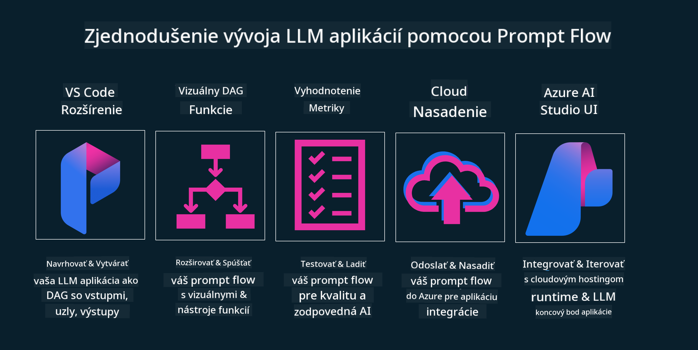

<!--
CO_OP_TRANSLATOR_METADATA:
{
  "original_hash": "df44972d5575ea8cef3c52ee31696d04",
  "translation_date": "2025-12-19T16:52:25+00:00",
  "source_file": "14-the-generative-ai-application-lifecycle/README.md",
  "language_code": "sk"
}
-->

# Životný cyklus aplikácie generatívnej AI

Dôležitou otázkou pre všetky AI aplikácie je relevantnosť AI funkcií, keďže AI je rýchlo sa vyvíjajúca oblasť, aby vaša aplikácia zostala relevantná, spoľahlivá a robustná, musíte ju neustále monitorovať, vyhodnocovať a zlepšovať. Práve tu prichádza na rad životný cyklus generatívnej AI.

Životný cyklus generatívnej AI je rámec, ktorý vás vedie cez etapy vývoja, nasadenia a údržby generatívnej AI aplikácie. Pomáha vám definovať vaše ciele, merať výkon, identifikovať výzvy a implementovať riešenia. Tiež vám pomáha zosúladiť vašu aplikáciu s etickými a právnymi normami vášho odvetvia a zainteresovaných strán. Dodržiavaním životného cyklu generatívnej AI môžete zabezpečiť, že vaša aplikácia vždy prináša hodnotu a uspokojuje vašich používateľov.

## Úvod

V tejto kapitole sa naučíte:

- Pochopiť paradigmatický posun z MLOps na LLMOps
- Životný cyklus LLM
- Nástroje pre životný cyklus
- Meranie a hodnotenie životného cyklu

## Pochopiť paradigmatický posun z MLOps na LLMOps

LLM sú nový nástroj v arzenáli umelej inteligencie, sú neuveriteľne silné v úlohách analýzy a generovania pre aplikácie, avšak táto sila má určité dôsledky na to, ako zefektívňujeme AI a klasické strojové učenie.

S týmto potrebujeme nový paradigmatický prístup, aby sme tento nástroj adaptovali dynamicky, s vhodnými stimulmi. Môžeme kategorizovať staršie AI aplikácie ako „ML aplikácie“ a novšie AI aplikácie ako „GenAI aplikácie“ alebo jednoducho „AI aplikácie“, čo odráža hlavný technologický a technický prístup používaný v danom čase. Toto posúva náš príbeh viacerými smermi, pozrite si nasledujúce porovnanie.

Všimnite si, že v LLMOps sa viac zameriavame na vývojárov aplikácií, používame integrácie ako kľúčový bod, využívame „Modely ako službu“ a uvažujeme o nasledujúcich bodoch pre metriky.

- Kvalita: Kvalita odpovede
- Škoda: Zodpovedná AI
- Pravdivosť: Základnosť odpovede (Dáva to zmysel? Je to správne?)
- Náklady: Rozpočet riešenia
- Latencia: Priemerný čas na odpoveď tokenu

## Životný cyklus LLM

Najprv, aby sme pochopili životný cyklus a jeho úpravy, pozrime sa na nasledujúcu infografiku.

Ako si možno všimnete, toto sa líši od bežných životných cyklov v MLOps. LLM majú mnoho nových požiadaviek, ako je promptovanie, rôzne techniky na zlepšenie kvality (doladenie, RAG, meta-promptovanie), rôzne hodnotenie a zodpovednosť v rámci zodpovednej AI, nakoniec nové hodnotiace metriky (kvalita, škoda, pravdivosť, náklady a latencia).

Napríklad, pozrite sa, ako vytvárame nápady. Používame prompt engineering na experimentovanie s rôznymi LLM, aby sme preskúmali možnosti a otestovali, či ich hypotéza môže byť správna.

Všimnite si, že to nie je lineárne, ale integrované slučky, iteratívne a s celkovým cyklom.

Ako by sme mohli preskúmať tieto kroky? Pozrime sa podrobnejšie, ako môžeme vytvoriť životný cyklus.

Môže to vyzerať trochu komplikovane, zamerajme sa najprv na tri veľké kroky.

1. Generovanie nápadov / preskúmavanie: Preskúmanie, tu môžeme skúmať podľa našich obchodných potrieb. Prototypovanie, vytváranie [PromptFlow](https://microsoft.github.io/promptflow/index.html?WT.mc_id=academic-105485-koreyst) a testovanie, či je dostatočne efektívny pre našu hypotézu.
1. Budovanie / rozširovanie: Implementácia, teraz začíname hodnotiť na väčších dátových súboroch, implementovať techniky ako doladenie a RAG, aby sme skontrolovali robustnosť nášho riešenia. Ak nie je, môže pomôcť jeho opätovná implementácia, pridanie nových krokov do nášho toku alebo reštrukturalizácia dát. Po otestovaní nášho toku a škálovania, ak to funguje a metriky sú v poriadku, je pripravené na ďalší krok.
1. Operacionalizácia: Integrácia, teraz pridávame monitorovanie a systém upozornení do nášho systému, nasadenie a integráciu aplikácie do našej aplikácie.

Potom máme celkový cyklus riadenia, zameraný na bezpečnosť, súlad a správu.

Gratulujeme, teraz máte svoju AI aplikáciu pripravenú na použitie a prevádzku. Pre praktickú skúsenosť si pozrite [Contoso Chat Demo.](https://nitya.github.io/contoso-chat/?WT.mc_id=academic-105485-koreys)

Teraz, aké nástroje môžeme použiť?

## Nástroje pre životný cyklus

Pre nástroje poskytuje Microsoft [Azure AI Platform](https://azure.microsoft.com/solutions/ai/?WT.mc_id=academic-105485-koreys) a [PromptFlow](https://microsoft.github.io/promptflow/index.html?WT.mc_id=academic-105485-koreyst), ktoré uľahčujú a zjednodušujú implementáciu vášho cyklu.

[Azure AI Platform](https://azure.microsoft.com/solutions/ai/?WT.mc_id=academic-105485-koreys) vám umožňuje používať [AI Studio](https://ai.azure.com/?WT.mc_id=academic-105485-koreys). AI Studio je webový portál, ktorý vám umožňuje preskúmavať modely, ukážky a nástroje. Spravovať vaše zdroje, vývojové toky UI a možnosti SDK/CLI pre vývoj založený na kóde.

Azure AI vám umožňuje používať viacero zdrojov na správu vašich operácií, služieb, projektov, vyhľadávania vektorov a databázových potrieb.

Vytvárajte od Proof-of-Concept (POC) až po veľkorozsahové aplikácie s PromptFlow:

- Navrhujte a budujte aplikácie z VS Code, s vizuálnymi a funkčnými nástrojmi
- Testujte a dolaďujte svoje aplikácie pre kvalitnú AI jednoducho.
- Používajte Azure AI Studio na integráciu a iteráciu s cloudom, push a nasadenie pre rýchlu integráciu.

## Skvelé! Pokračujte v učení!

Úžasné, teraz sa naučte viac o tom, ako štruktúrujeme aplikáciu na použitie konceptov s [Contoso Chat App](https://nitya.github.io/contoso-chat/?WT.mc_id=academic-105485-koreyst), aby ste videli, ako Cloud Advocacy pridáva tieto koncepty v ukážkach. Pre viac obsahu si pozrite našu [Ignite breakout session!
](https://www.youtube.com/watch?v=DdOylyrTOWg)

Teraz si pozrite Lekciu 15, aby ste pochopili, ako [Retrieval Augmented Generation a vektorové databázy](../15-rag-and-vector-databases/README.md?WT.mc_id=academic-105485-koreyst) ovplyvňujú generatívnu AI a ako vytvárať zaujímavejšie aplikácie!

---

<!-- CO-OP TRANSLATOR DISCLAIMER START -->
**Zrieknutie sa zodpovednosti**:
Tento dokument bol preložený pomocou AI prekladateľskej služby [Co-op Translator](https://github.com/Azure/co-op-translator). Aj keď sa snažíme o presnosť, majte prosím na pamäti, že automatizované preklady môžu obsahovať chyby alebo nepresnosti. Pôvodný dokument v jeho rodnom jazyku by mal byť považovaný za autoritatívny zdroj. Pre kritické informácie sa odporúča profesionálny ľudský preklad. Nie sme zodpovední za akékoľvek nedorozumenia alebo nesprávne interpretácie vyplývajúce z použitia tohto prekladu.
<!-- CO-OP TRANSLATOR DISCLAIMER END -->