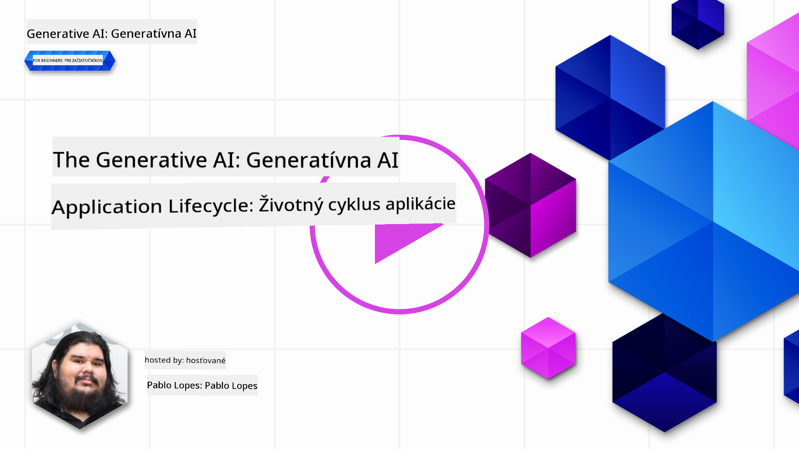
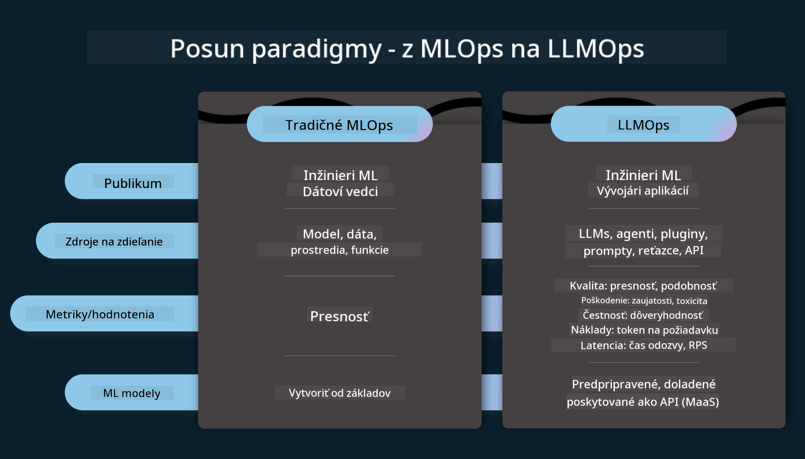
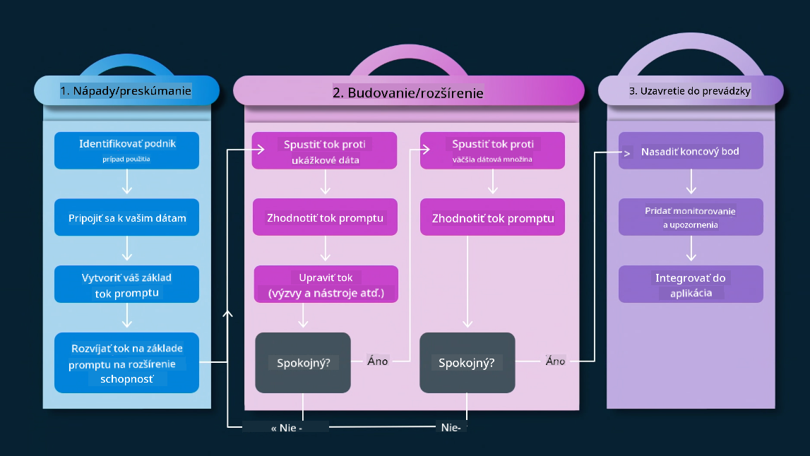
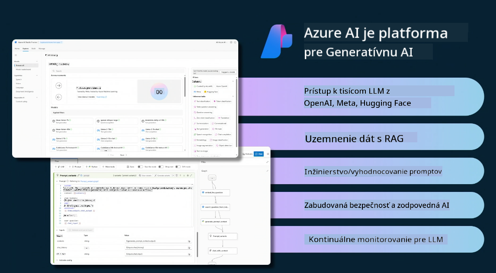
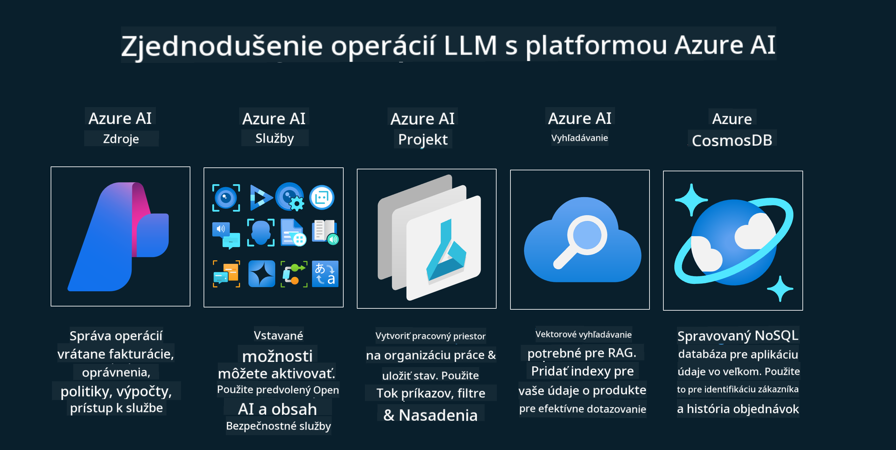
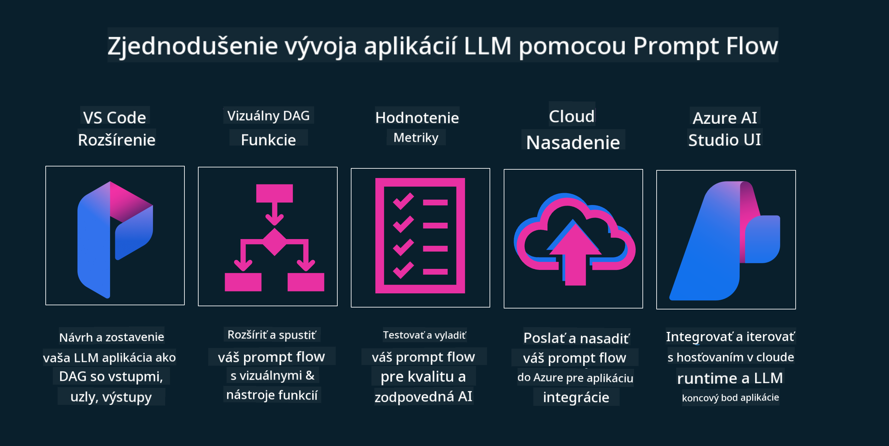

<!--
CO_OP_TRANSLATOR_METADATA:
{
  "original_hash": "27a5347a5022d5ef0a72ab029b03526a",
  "translation_date": "2025-05-20T00:55:44+00:00",
  "source_file": "14-the-generative-ai-application-lifecycle/README.md",
  "language_code": "sk"
}
-->

# Životný cyklus generatívnej AI aplikácie

Dôležitou otázkou pre všetky AI aplikácie je relevantnosť AI funkcií, pretože AI je rýchlo sa vyvíjajúce pole. Aby vaša aplikácia zostala relevantná, spoľahlivá a robustná, musíte ju neustále monitorovať, hodnotiť a zlepšovať. Tu vstupuje do hry životný cyklus generatívnej AI.

Životný cyklus generatívnej AI je rámec, ktorý vás prevedie fázami vývoja, nasadenia a údržby generatívnej AI aplikácie. Pomáha vám definovať vaše ciele, merať váš výkon, identifikovať vaše výzvy a implementovať vaše riešenia. Tiež vám pomáha zosúladiť vašu aplikáciu s etickými a právnymi normami vášho odvetvia a vašich zainteresovaných strán. Dodržiavaním životného cyklu generatívnej AI môžete zabezpečiť, že vaša aplikácia vždy prináša hodnotu a uspokojuje používateľov.

## Úvod

V tejto kapitole sa naučíte:

- Pochopiť posun paradigmy z MLOps na LLMOps
- Životný cyklus LLM
- Nástroje pre životný cyklus
- Metodika a hodnotenie životného cyklu

## Pochopiť posun paradigmy z MLOps na LLMOps

LLM sú nový nástroj v arzenáli umelej inteligencie, sú neuveriteľne silné v úlohách analýzy a generovania pre aplikácie, avšak táto sila má určité dôsledky na to, ako zefektívňujeme úlohy AI a klasického strojového učenia.

S týmto potrebujeme novú paradigmu, aby sme tento nástroj prispôsobili dynamicky, s korektnými stimulmi. Staršie AI aplikácie môžeme kategorizovať ako "ML aplikácie" a novšie AI aplikácie ako "GenAI aplikácie" alebo jednoducho "AI aplikácie", čo odráža hlavnú technológiu a techniky používané v danom čase. Tento posun mení náš príbeh v mnohých smeroch, pozrite sa na nasledujúce porovnanie.

Všimnite si, že v LLMOps sa viac sústreďujeme na vývojárov aplikácií, používame integrácie ako kľúčový bod, používame "Modely-ako-službu" a zameriavame sa na nasledujúce body pre metriky.

- Kvalita: Kvalita odpovede
- Škoda: Zodpovedná AI
- Úprimnosť: Opodstatnenosť odpovede (Dáva to zmysel? Je to správne?)
- Náklady: Rozpočet riešenia
- Latencia: Priemerný čas na odpoveď tokenu

## Životný cyklus LLM

Najprv, aby sme pochopili životný cyklus a jeho úpravy, pozrime sa na nasledujúcu infografiku.

Ako si môžete všimnúť, toto sa líši od obvyklých životných cyklov z MLOps. LLM majú mnoho nových požiadaviek, ako je Prompting, rôzne techniky na zlepšenie kvality (Fine-Tuning, RAG, Meta-Prompts), rôzne hodnotenie a zodpovednosť so zodpovednou AI, a nakoniec nové metriky hodnotenia (Kvalita, Škoda, Úprimnosť, Náklady a Latencia).

Napríklad, pozrite sa, ako generujeme nápady. Používame prompt engineering na experimentovanie s rôznymi LLM, aby sme preskúmali možnosti a overili, či ich hypotéza môže byť správna.

Všimnite si, že to nie je lineárne, ale integrované slučky, iteratívne a s celkovým cyklom.

Ako by sme mohli preskúmať tieto kroky? Poďme sa podrobne pozrieť na to, ako by sme mohli vytvoriť životný cyklus.

To môže vyzerať trochu komplikovane, zamerajme sa najprv na tri veľké kroky.

1. Generovanie nápadov/Prieskum: Prieskum, tu môžeme preskúmať podľa našich obchodných potrieb. Prototypovanie, vytváranie [PromptFlow](https://microsoft.github.io/promptflow/index.html?WT.mc_id=academic-105485-koreyst) a testovanie, či je dostatočne efektívne pre našu hypotézu.
2. Budovanie/Zväčšovanie: Implementácia, teraz začíname hodnotiť pre väčšie datasety a implementovať techniky, ako je Fine-tuning a RAG, aby sme overili robustnosť nášho riešenia. Ak to nefunguje, môže pomôcť preimplementovanie, pridanie nových krokov do nášho toku alebo reštrukturalizácia dát. Po otestovaní nášho toku a našej škály, ak to funguje a skontrolujeme naše metriky, je pripravené na ďalší krok.
3. Uvádzanie do prevádzky: Integrácia, teraz pridávame monitorovacie a výstražné systémy do nášho systému, nasadenie a integrácia aplikácie do našej aplikácie.

Potom máme celkový cyklus riadenia, zameraný na bezpečnosť, dodržiavanie predpisov a správu.

Gratulujeme, teraz máte svoju AI aplikáciu pripravenú a funkčnú. Pre praktické skúsenosti sa pozrite na [Contoso Chat Demo.](https://nitya.github.io/contoso-chat/?WT.mc_id=academic-105485-koreys)

Aké nástroje by sme mohli použiť?

## Nástroje pre životný cyklus

Pre nástroje Microsoft poskytuje [Azure AI Platform](https://azure.microsoft.com/solutions/ai/?WT.mc_id=academic-105485-koreys) a [PromptFlow](https://microsoft.github.io/promptflow/index.html?WT.mc_id=academic-105485-koreyst), aby uľahčili a zjednodušili implementáciu vášho cyklu.

[Azure AI Platform](https://azure.microsoft.com/solutions/ai/?WT.mc_id=academic-105485-koreys) vám umožňuje používať [AI Studio](https://ai.azure.com/?WT.mc_id=academic-105485-koreys). AI Studio je webový portál, ktorý vám umožňuje preskúmať modely, vzorky a nástroje. Spravovanie vašich zdrojov, vývoj UI tokov a SDK/CLI možnosti pre vývoj zameraný na kód.

Azure AI vám umožňuje používať viacero zdrojov na správu vašich operácií, služieb, projektov, vektorové vyhľadávanie a potreby databáz.

Vytvorte od Proof-of-Concept (POC) až po veľké aplikácie s PromptFlow:

- Navrhujte a vytvárajte aplikácie z VS Code s vizuálnymi a funkčnými nástrojmi
- Testujte a dolaďujte svoje aplikácie pre kvalitnú AI s ľahkosťou.
- Používajte Azure AI Studio na integráciu a iteráciu s cloudom, push a nasadenie pre rýchlu integráciu.

## Skvelé! Pokračujte vo svojom učení!

Úžasné, teraz sa naučte viac o tom, ako štruktúrujeme aplikáciu na použitie konceptov s [Contoso Chat App](https://nitya.github.io/contoso-chat/?WT.mc_id=academic-105485-koreyst), aby ste zistili, ako Cloud Advocacy pridáva tieto koncepty do demonštrácií. Pre viac obsahu si pozrite našu [Ignite breakout session!
](https://www.youtube.com/watch?v=DdOylyrTOWg)

Teraz si pozrite Lekciu 15, aby ste pochopili, ako [Retrieval Augmented Generation a Vektorové Databázy](../15-rag-and-vector-databases/README.md?WT.mc_id=academic-105485-koreyst) ovplyvňujú generatívnu AI a umožňujú vytvárať pútavejšie aplikácie!

**Upozornenie**:  
Tento dokument bol preložený pomocou služby prekladania AI [Co-op Translator](https://github.com/Azure/co-op-translator). Aj keď sa snažíme o presnosť, prosím, uvedomte si, že automatizované preklady môžu obsahovať chyby alebo nepresnosti. Pôvodný dokument v jeho rodnom jazyku by mal byť považovaný za autoritatívny zdroj. Pre kritické informácie sa odporúča profesionálny ľudský preklad. Nie sme zodpovední za žiadne nedorozumenia alebo nesprávne interpretácie vyplývajúce z použitia tohto prekladu.