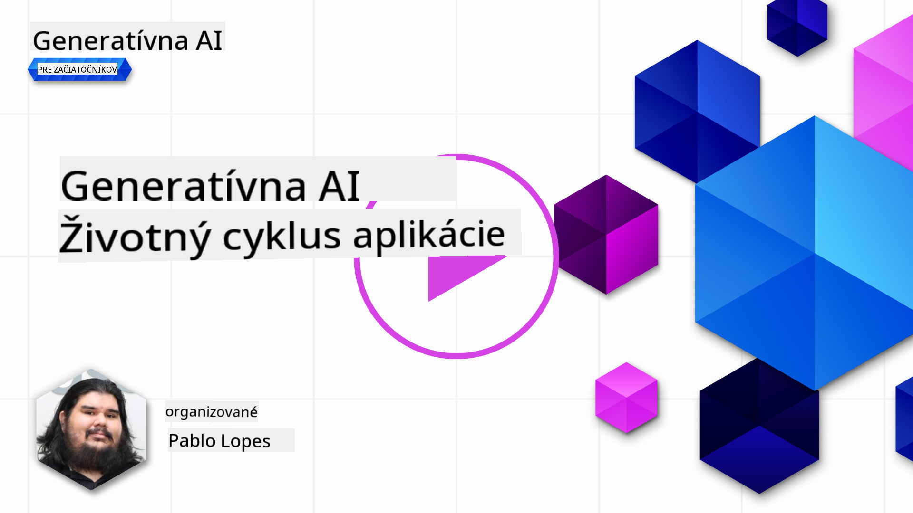
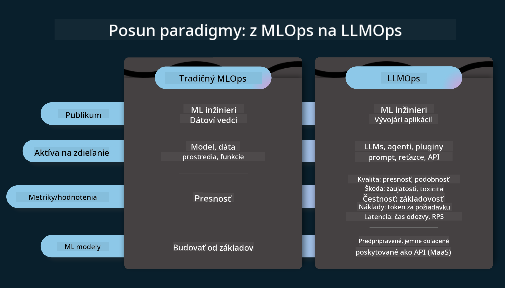
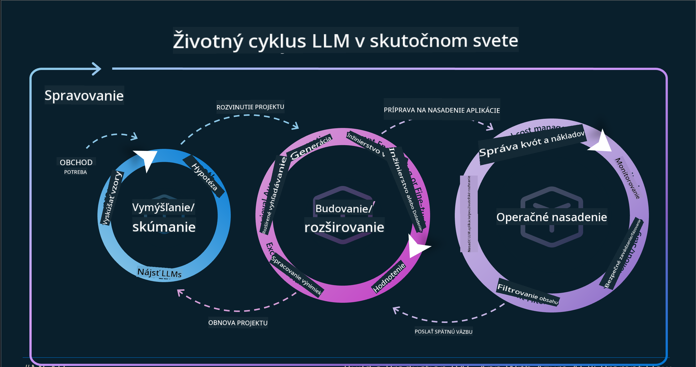
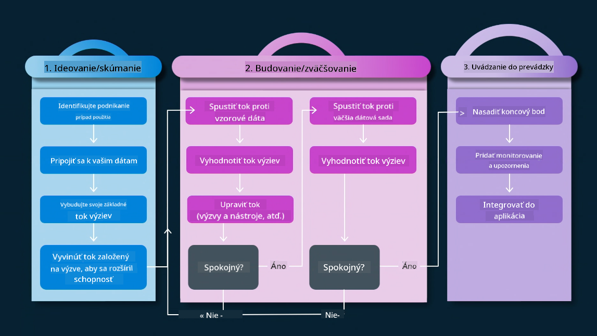
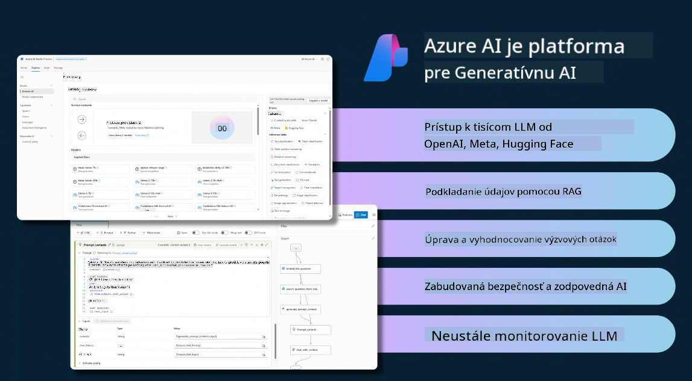
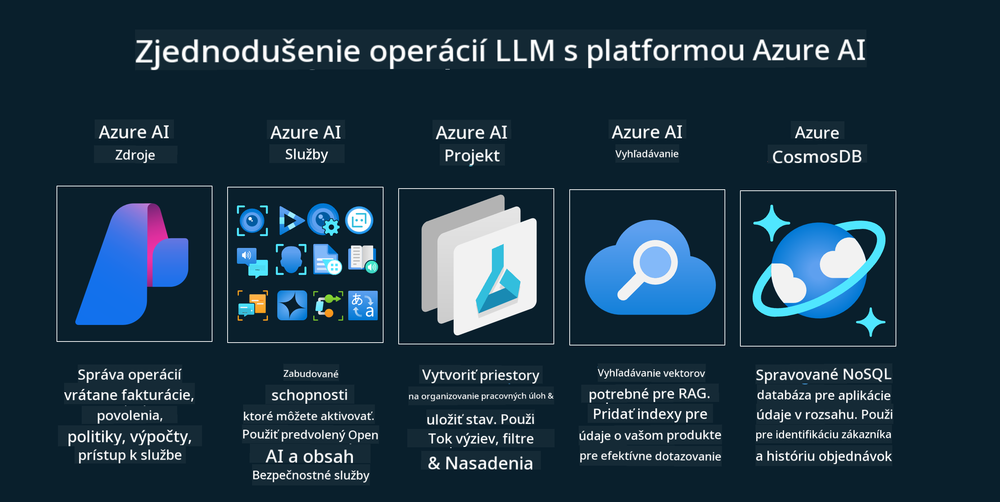
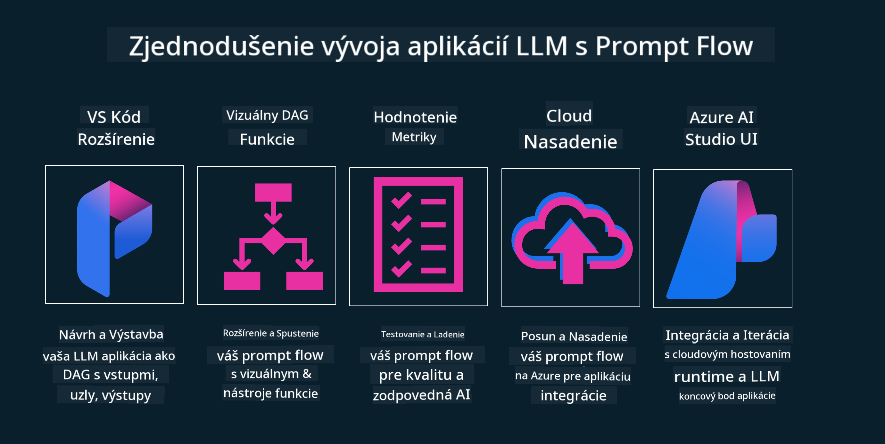

<!--
CO_OP_TRANSLATOR_METADATA:
{
  "original_hash": "27a5347a5022d5ef0a72ab029b03526a",
  "translation_date": "2025-06-25T22:10:07+00:00",
  "source_file": "14-the-generative-ai-application-lifecycle/README.md",
  "language_code": "sk"
}
-->

# Životný cyklus aplikácie generatívnej AI

Dôležitou otázkou pre všetky AI aplikácie je relevantnosť AI funkcií, keďže AI je rýchlo sa rozvíjajúca oblasť. Aby vaša aplikácia zostala relevantná, spoľahlivá a robustná, musíte ju neustále monitorovať, hodnotiť a zlepšovať. Tu prichádza na rad životný cyklus generatívnej AI.

Životný cyklus generatívnej AI je rámec, ktorý vás sprevádza fázami vývoja, nasadzovania a údržby generatívnej AI aplikácie. Pomáha vám definovať vaše ciele, merať váš výkon, identifikovať vaše výzvy a implementovať vaše riešenia. Tiež vám pomáha zosúladiť vašu aplikáciu s etickými a právnymi normami vášho odvetvia a vašich zainteresovaných strán. Dodržiavaním životného cyklu generatívnej AI môžete zabezpečiť, že vaša aplikácia vždy prináša hodnotu a uspokojuje vašich používateľov.

## Úvod

V tejto kapitole sa dozviete:

- Pochopiť posun paradigmy z MLOps na LLMOps
- Životný cyklus LLM
- Nástroje pre životný cyklus
- Metryfikácia a hodnotenie životného cyklu

## Pochopiť posun paradigmy z MLOps na LLMOps

LLM sú nový nástroj v arzenáli umelej inteligencie, sú neuveriteľne silné v úlohách analýzy a generovania pre aplikácie, avšak táto sila má určité dôsledky na to, ako zjednodušujeme úlohy AI a klasického strojového učenia.

S tým potrebujeme novú paradigmu, aby sme tento nástroj adaptovali dynamicky, so správnymi stimulmi. Staršie AI aplikácie môžeme kategorizovať ako "ML aplikácie" a novšie AI aplikácie ako "GenAI aplikácie" alebo len "AI aplikácie", čo odráža hlavný prúd technológií a techník používaných v danom čase. Toto posúva náš príbeh viacerými spôsobmi, pozrite sa na nasledujúce porovnanie.

Všimnite si, že v LLMOps sa viac zameriavame na vývojárov aplikácií, používame integrácie ako kľúčový bod, používame "Modely ako službu" a premýšľame o nasledujúcich bodoch pre metriky.

- Kvalita: Kvalita odpovede
- Škoda: Zodpovedná AI
- Čestnosť: Opodstatnenosť odpovede (Dáva to zmysel? Je to správne?)
- Náklady: Rozpočet riešenia
- Latencia: Priem. čas pre odpoveď tokenu

## Životný cyklus LLM

Najprv, aby sme pochopili životný cyklus a úpravy, pozrime sa na nasledujúcu infografiku.

Ako si môžete všimnúť, toto je odlišné od bežných životných cyklov MLOps. LLM majú mnoho nových požiadaviek, ako je Prompting, rôzne techniky na zlepšenie kvality (Fine-Tuning, RAG, Meta-Prompts), rôzne hodnotenie a zodpovednosť so zodpovednou AI, a nakoniec nové hodnotiace metriky (Kvalita, Škoda, Čestnosť, Náklady a Latencia).

Napríklad, pozrite sa, ako ideujeme. Používame inžinierstvo promptov na experimentovanie s rôznymi LLM na skúmanie možností, aby sme otestovali, či ich hypotéza môže byť správna.

Všimnite si, že toto nie je lineárne, ale integrované slučky, iteratívne a s celkovým cyklom.

Ako by sme mohli preskúmať tieto kroky? Poďme do detailu, ako by sme mohli vybudovať životný cyklus.

Toto môže vyzerať trochu komplikovane, zamerajme sa najprv na tri veľké kroky.

1. Ideácia/Preskúmavanie: Preskúmavanie, tu môžeme skúmať podľa našich obchodných potrieb. Prototypovanie, vytváranie [PromptFlow](https://microsoft.github.io/promptflow/index.html?WT.mc_id=academic-105485-koreyst) a testovanie, či je dostatočne efektívne pre našu hypotézu.
2. Budovanie/Posilňovanie: Implementácia, teraz začíname hodnotiť pre väčšie dátové sady, implementovať techniky ako Fine-tuning a RAG, aby sme skontrolovali robustnosť nášho riešenia. Ak nie, preimplementovanie, pridanie nových krokov do nášho toku alebo reštrukturalizácia dát môže pomôcť. Po testovaní nášho toku a našej škály, ak to funguje a skontrolujeme naše metriky, je pripravené na ďalší krok.
3. Operationalizácia: Integrácia, teraz pridávanie monitorovacích a výstražných systémov do nášho systému, nasadzovanie a integrácia aplikácií do našej aplikácie.

Potom máme celkový cyklus riadenia, zameraný na bezpečnosť, dodržiavanie predpisov a správu.

Gratulujeme, teraz máte svoju AI aplikáciu pripravenú a funkčnú. Pre praktickú skúsenosť sa pozrite na [Contoso Chat Demo.](https://nitya.github.io/contoso-chat/?WT.mc_id=academic-105485-koreys)

Aké nástroje by sme mohli použiť?

## Nástroje pre životný cyklus

Pre nástroje, Microsoft poskytuje [Azure AI Platform](https://azure.microsoft.com/solutions/ai/?WT.mc_id=academic-105485-koreys) a [PromptFlow](https://microsoft.github.io/promptflow/index.html?WT.mc_id=academic-105485-koreyst), ktoré uľahčujú a zjednodušujú implementáciu a sú pripravené na použitie.

[Azure AI Platform](https://azure.microsoft.com/solutions/ai/?WT.mc_id=academic-105485-koreys), vám umožňuje používať [AI Studio](https://ai.azure.com/?WT.mc_id=academic-105485-koreys). AI Studio je webový portál, ktorý vám umožňuje preskúmavať modely, vzorky a nástroje. Spravovať vaše zdroje, vývojové toky UI a možnosti SDK/CLI pre vývoj orientovaný na kód.

Azure AI vám umožňuje používať viacero zdrojov na správu vašich operácií, služieb, projektov, potrieb vyhľadávania vektorov a databáz.

Konstrukcia, od Proof-of-Concept (POC) až po veľké aplikácie s PromptFlow:

- Navrhovanie a budovanie aplikácií z VS Code, s vizuálnymi a funkčnými nástrojmi
- Testovanie a dolaďovanie vašich aplikácií pre kvalitnú AI, s ľahkosťou.
- Použitie Azure AI Studio na integráciu a iteráciu s cloudom, Push a nasadenie pre rýchlu integráciu.

## Skvelé! Pokračujte v učení!

Úžasné, teraz sa dozviete viac o tom, ako štruktúrujeme aplikáciu na použitie konceptov s [Contoso Chat App](https://nitya.github.io/contoso-chat/?WT.mc_id=academic-105485-koreyst), aby ste zistili, ako Cloud Advocacy pridáva tieto koncepty do ukážok. Pre viac obsahu, pozrite si náš [Ignite breakout session!](https://www.youtube.com/watch?v=DdOylyrTOWg)

Teraz si pozrite Lekciu 15, aby ste pochopili, ako [Retrieval Augmented Generation a Vektorové databázy](../15-rag-and-vector-databases/README.md?WT.mc_id=academic-105485-koreyst) ovplyvňujú generatívnu AI a ako vytvoriť pútavejšie aplikácie!

**Upozornenie**:  
Tento dokument bol preložený pomocou služby AI prekladu [Co-op Translator](https://github.com/Azure/co-op-translator). Aj keď sa snažíme o presnosť, uvedomte si, že automatizované preklady môžu obsahovať chyby alebo nepresnosti. Pôvodný dokument v jeho rodnom jazyku by mal byť považovaný za autoritatívny zdroj. Pre kritické informácie sa odporúča profesionálny ľudský preklad. Nezodpovedáme za akékoľvek nedorozumenia alebo nesprávne interpretácie vyplývajúce z použitia tohto prekladu.