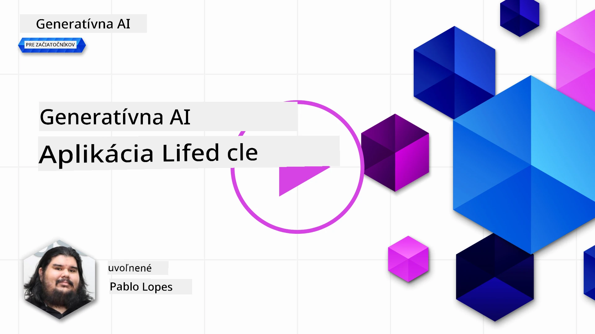
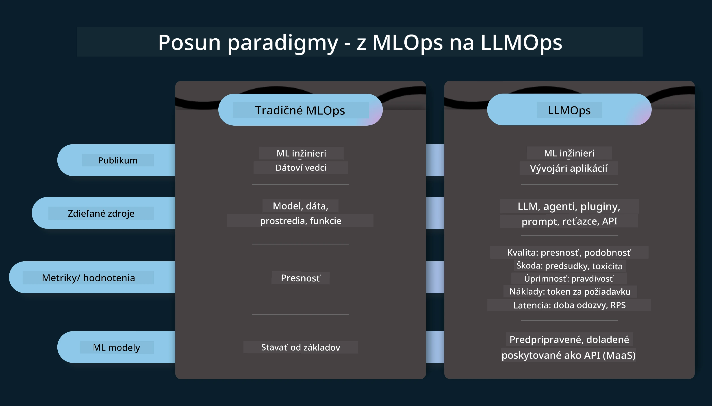
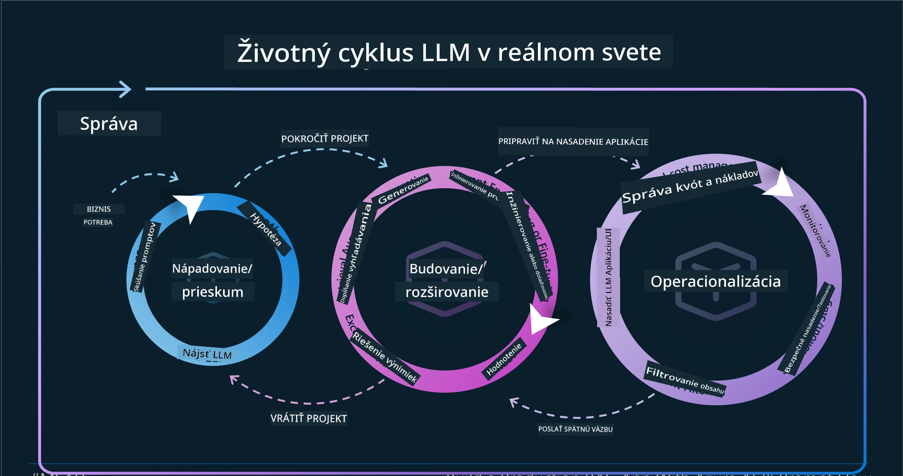
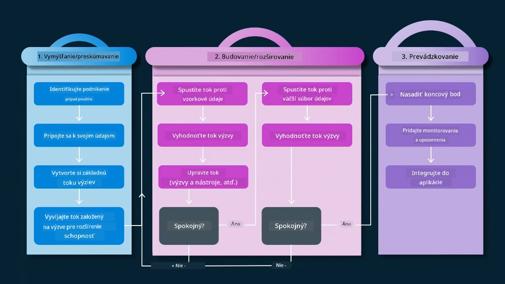
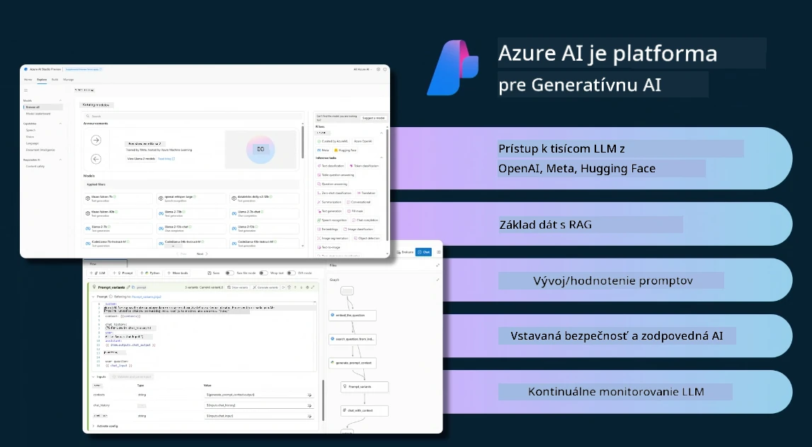
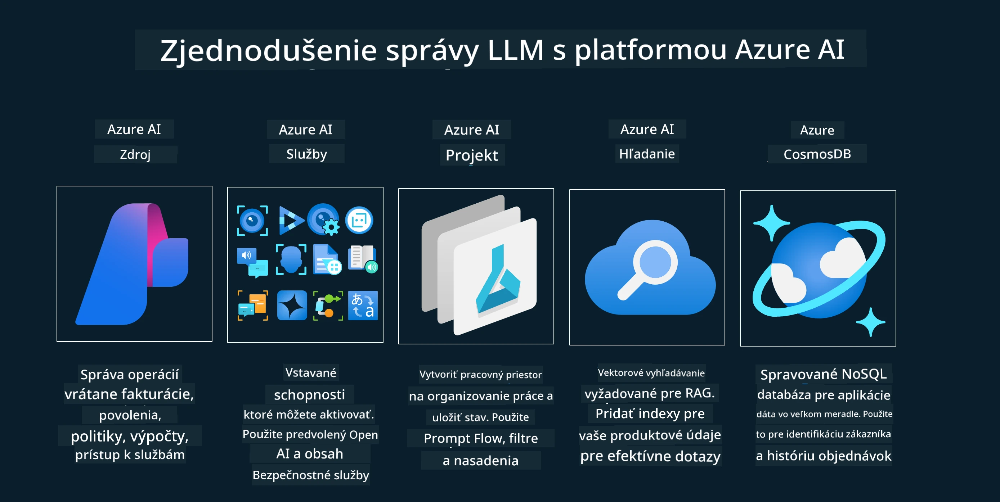
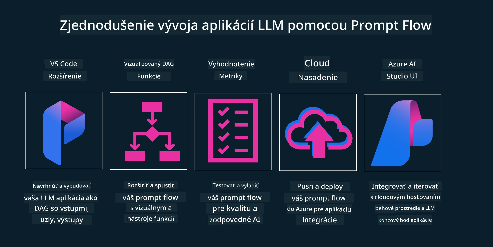

# Životný cyklus aplikácie Generatívnej AI

Dôležitou otázkou pre všetky AI aplikácie je relevantnosť AI funkcií, keďže AI je rýchlo sa vyvíjajúca oblasť. Aby vaša aplikácia zostala relevantná, spoľahlivá a robustná, musíte ju neustále sledovať, hodnotiť a zlepšovať. Tu prichádza na scénu životný cyklus generatívnej AI.

Životný cyklus generatívnej AI je rámec, ktorý vás vedie cez fázy vývoja, nasadenia a údržby generatívnej AI aplikácie. Pomáha vám definovať vaše ciele, merať váš výkon, identifikovať problémy a implementovať riešenia. Tiež pomáha zosúladiť vašu aplikáciu s etickými a právnymi normami vášho odvetvia a zainteresovaných strán. Nasledovaním životného cyklu generatívnej AI môžete zabezpečiť, že vaša aplikácia neustále prináša hodnotu a uspokojuje vašich používateľov.

## Úvod

V tejto kapitole sa naučíte:

- Pochopiť posun paradigmy od MLOps k LLMOps
- Životný cyklus LLM
- Nástroje na podporu životného cyklu
- Meranie a hodnotenie životného cyklu

## Pochopiť posun paradigmy od MLOps k LLMOps

LLM sú nový nástroj v arsenáli umelej inteligencie, sú mimoriadne silné pri úlohách analýzy a generovania pre aplikácie, avšak táto sila so sebou prináša určité dôsledky na to, ako zefektívniť AI a klasické úlohy strojového učenia.

Preto potrebujeme novú paradigmu, aby sme tento nástroj adaptovali dynamicky a s vhodnými motiváciami. Staršie AI aplikácie môžeme kategorizovať ako "ML Apps" a novšie ako "GenAI Apps" alebo jednoducho "AI Apps", čo odráža hlavné používané technológie a techniky v danom čase. Toto posúva náš príbeh viacerými spôsobmi, pozrite si nasledujúce porovnanie.

Všimnite si, že v LLMOps sa viac zameriavame na vývojárov aplikácií, pričom kľúčovým bodom sú integrácie, využívame „Modely ako službu“ a myslíme na nasledujúce metriky:

- Kvalita: Kvalita odpovede
- Škoda: Zodpovedná AI
- Pravdivosť: Základnosť odpovede (Dáva to zmysel? Je správna?)
- Náklady: Rozpočet riešenia
- Latencia: Priemerný čas odpovede na token

## Životný cyklus LLM

Najprv, aby sme pochopili životný cyklus a jeho modifikácie, pozrime sa na nasledujúcu infografiku.

Ako si možno všimnete, je to odlišné od bežných životných cyklov v MLOps. LLM majú mnoho nových požiadaviek, ako je promptovanie, rozličné techniky na zlepšenie kvality (doladenie, RAG, meta-promptovanie), rôzne hodnotenie a zodpovednosť pri zodpovednej AI a nakoniec nové hodnotiace metriky (Kvalita, Škoda, Pravdivosť, Náklady a Latencia).

Napríklad, pozrite sa, ako tvoríme nápady. Používame prompt engineering na experimentovanie s rôznymi LLM, aby sme preskúmali možnosti a otestovali, či by naša hypotéza mohla byť správna.

Upozorňujeme, že nejde o lineárny proces, ale o integrované slučky, iteratívne a s rozsiahlym hlavným cyklom.

Ako by sme mohli preskúmať tieto kroky? Poďme detailnejšie na to, ako môžeme vybudovať životný cyklus.

Môže sa to zdať trochu zložité, najprv sa zamerajme na tri hlavné kroky.

1. Generovanie nápadov / Preskúmavanie: Skúmanie, kde môžeme podľa našich obchodných potrieb skúmať. Prototypovanie, vytváranie [PromptFlow](https://microsoft.github.io/promptflow/index.html?WT.mc_id=academic-105485-koreyst) a testovanie, či je dostatočne efektívny pre našu hypotézu.
1. Budovanie / Rozširovanie: Implementácia, teraz začíname hodnotiť na väčších dátových sadách a zavádzať techniky ako doladenie a RAG, aby sme overili robustnosť nášho riešenia. Ak nie je dostatočné, môže pomôcť jeho opätovné zavedenie, pridanie nových krokov do nášho procesu alebo preštruktúrovanie dát. Po otestovaní nášho procesu a škálovania, ak to funguje a splňuje naše metriky, je pripravené na ďalší krok.
1. Prevádzkovanie: Integrácia, teraz pridávame monitorovanie a systém upozornení do nášho systému, nasadenie a integrácia aplikácie do našej aplikácie.

Potom tu máme hlavný cyklus manažmentu, ktorý sa zameriava na bezpečnosť, súlad a správu.

Gratulujeme, teraz máte svoju AI aplikáciu pripravenú a v prevádzke. Pre praktickú skúsenosť si pozrite [Contoso Chat Demo.](https://nitya.github.io/contoso-chat/?WT.mc_id=academic-105485-koreyst)

A aké nástroje môžeme použiť?

## Nástroje pre životný cyklus

Pre nástroje Microsoft poskytuje [Azure AI Platform](https://azure.microsoft.com/solutions/ai/?WT.mc_id=academic-105485-koreyst) a [PromptFlow](https://microsoft.github.io/promptflow/index.html?WT.mc_id=academic-105485-koreyst), ktoré uľahčujú a robia váš cyklus jednoduchým na implementáciu a plne pripraveným na použitie.

[Azure AI Platform](https://azure.microsoft.com/solutions/ai/?WT.mc_id=academic-105485-koreyst) vám umožňuje použiť [AI Studio](https://ai.azure.com/?WT.mc_id=academic-105485-koreyst). AI Studio je webový portál, ktorý vám umožní skúmať modely, ukážky a nástroje. Spravovať vaše zdroje, vývoj UI flow a možnosti SDK/CLI pre vývoj založený na kóde.

Azure AI vám umožňuje využiť rôzne zdroje na správu vašich operácií, služieb, projektov, vyhľadávania vektorov a databázových potrieb.

Stavajte od Proof-of-Concept (POC) až po aplikácie vo veľkom meradle pomocou PromptFlow:

- Navrhnite a vytvorte aplikácie vo VS Code s vizuálnymi a funkčnými nástrojmi
- Testujte a doladujte vaše aplikácie pre kvalitnú AI jednoducho
- Používajte Azure AI Studio na integráciu a iteráciu s cloudom, nasadenie a rýchlu integráciu.

## Skvelé! Pokračujte v učení!

Úžasné, teraz sa dozviete viac o tom, ako štruktúrujeme aplikáciu na použitie týchto konceptov s [Contoso Chat App](https://nitya.github.io/contoso-chat/?WT.mc_id=academic-105485-koreyst), aby ste videli, ako Cloud Advocacy zapája tieto koncepty v ukážkach. Pre viac obsahu si pozrite náš [Ignite breakout session!
](https://www.youtube.com/watch?v=DdOylyrTOWg)

Teraz si pozrite Lekciu 15, aby ste pochopili, ako [Retrieval Augmented Generation a vektorové databázy](../15-rag-and-vector-databases/README.md?WT.mc_id=academic-105485-koreyst) ovplyvňujú generatívnu AI a umožňujú vytvárať atraktívnejšie aplikácie!

---

<!-- CO-OP TRANSLATOR DISCLAIMER START -->
**Vylúčenie zodpovednosti**:  
Tento dokument bol preložený pomocou AI prekladateľskej služby [Co-op Translator](https://github.com/Azure/co-op-translator). Hoci sa snažíme o presnosť, berte prosím na vedomie, že automatické preklady môžu obsahovať chyby alebo nepresnosti. Pôvodný dokument v jeho rodnom jazyku by mal byť považovaný za autoritatívny zdroj. Pre kritické informácie sa odporúča profesionálny ľudský preklad. Nie sme zodpovední za akékoľvek nedorozumenia alebo nesprávne interpretácie vyplývajúce z použitia tohto prekladu.
<!-- CO-OP TRANSLATOR DISCLAIMER END -->