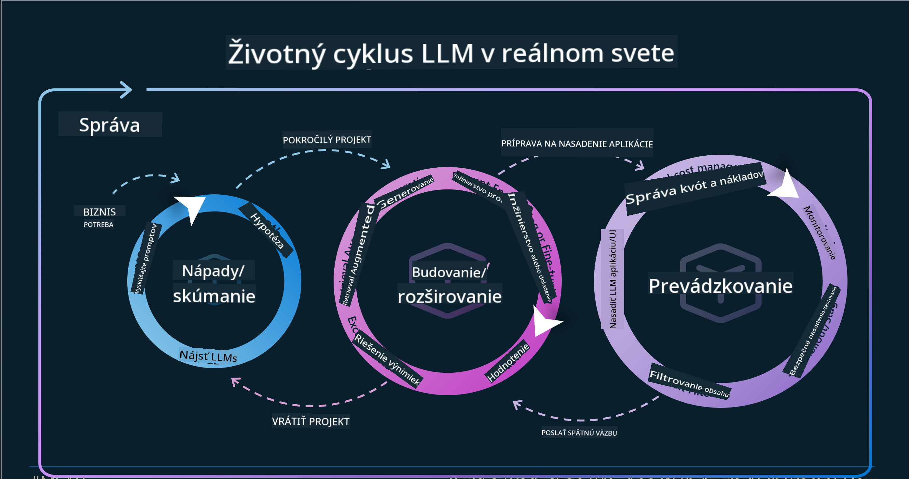

<!--
CO_OP_TRANSLATOR_METADATA:
{
  "original_hash": "27a5347a5022d5ef0a72ab029b03526a",
  "translation_date": "2025-07-09T15:58:16+00:00",
  "source_file": "14-the-generative-ai-application-lifecycle/README.md",
  "language_code": "sk"
}
-->

# Životný cyklus aplikácie generatívnej AI

Dôležitou otázkou pre všetky AI aplikácie je relevantnosť AI funkcií, keďže AI je rýchlo sa vyvíjajúca oblasť. Aby vaša aplikácia zostala relevantná, spoľahlivá a robustná, je potrebné ju neustále sledovať, vyhodnocovať a zlepšovať. Práve tu prichádza na rad životný cyklus generatívnej AI.

Životný cyklus generatívnej AI je rámec, ktorý vás prevedie jednotlivými fázami vývoja, nasadenia a údržby generatívnej AI aplikácie. Pomáha vám definovať ciele, merať výkonnosť, identifikovať výzvy a implementovať riešenia. Tiež zabezpečuje, že vaša aplikácia bude v súlade s etickými a právnymi normami vášho odvetvia a zainteresovaných strán. Dodržiavaním životného cyklu generatívnej AI môžete zabezpečiť, že vaša aplikácia bude vždy prinášať hodnotu a uspokojovať používateľov.

## Úvod

V tejto kapitole sa naučíte:

- Pochopiť posun paradigmy z MLOps na LLMOps
- Životný cyklus LLM
- Nástroje pre životný cyklus
- Meranie a hodnotenie životného cyklu

## Pochopiť posun paradigmy z MLOps na LLMOps

LLM sú novým nástrojom v arzenáli umelej inteligencie, sú mimoriadne silné pri analýze a generovaní pre aplikácie, avšak táto sila prináša určité dôsledky na to, ako zefektívňujeme úlohy AI a klasického strojového učenia.

Preto potrebujeme novú paradigmu, ktorá tento nástroj prispôsobí dynamicky a s vhodnými stimulmi. Staršie AI aplikácie môžeme kategorizovať ako „ML Apps“ a novšie AI aplikácie ako „GenAI Apps“ alebo jednoducho „AI Apps“, čo odráža aktuálne používané technológie a techniky. Tento posun mení náš pohľad viacerými spôsobmi, pozrite si nasledujúce porovnanie.

Všimnite si, že v LLMOps sa viac zameriavame na vývojárov aplikácií, využívame integrácie ako kľúčový prvok, používame „Models-as-a-Service“ a uvažujeme o nasledujúcich metrikách.

- Kvalita: Kvalita odpovede
- Škoda: Zodpovedná AI
- Pravdivosť: Základnosť odpovede (Dáva to zmysel? Je to správne?)
- Náklady: Rozpočet riešenia
- Latencia: Priemerný čas na odpoveď tokenu

## Životný cyklus LLM

Najprv, aby sme pochopili životný cyklus a jeho úpravy, pozrime sa na nasledujúcu infografiku.

Ako si možno všimnete, líši sa od bežných životných cyklov v MLOps. LLM majú množstvo nových požiadaviek, ako je promptovanie, rôzne techniky na zlepšenie kvality (Fine-Tuning, RAG, Meta-Prompts), odlišné hodnotenie a zodpovednosť v rámci zodpovednej AI, a nakoniec nové hodnotiace metriky (Kvalita, Škoda, Pravdivosť, Náklady a Latencia).

Napríklad, pozrite sa, ako generujeme nápady. Používame prompt engineering na experimentovanie s rôznymi LLM, aby sme preskúmali možnosti a otestovali, či by ich hypotéza mohla byť správna.

Upozorňujeme, že nejde o lineárny proces, ale o integrované slučky, iteratívne a s celkovým cyklom.

Ako by sme mohli preskúmať tieto kroky? Pozrime sa podrobnejšie, ako môžeme vytvoriť životný cyklus.

Môže to vyzerať trochu zložito, najskôr sa zamerajme na tri hlavné kroky.

1. Generovanie nápadov / Prieskum: Preskúmanie, tu môžeme skúmať podľa našich obchodných potrieb. Prototypovanie, vytváranie [PromptFlow](https://microsoft.github.io/promptflow/index.html?WT.mc_id=academic-105485-koreyst) a testovanie, či je dostatočne efektívny pre našu hypotézu.
1. Budovanie / Rozširovanie: Implementácia, teraz začíname hodnotiť na väčších dátových súboroch, implementovať techniky ako Fine-tuning a RAG, aby sme overili robustnosť nášho riešenia. Ak to nefunguje, môže pomôcť opätovná implementácia, pridanie nových krokov do nášho toku alebo reštrukturalizácia dát. Po otestovaní toku a škálovania, ak to funguje a metriky sú v poriadku, je pripravené na ďalší krok.
1. Prevádzkovanie: Integrácia, teraz pridávame monitorovanie a systém upozornení do nášho systému, nasadenie a integráciu aplikácie.

Následne máme celkový cyklus riadenia, zameraný na bezpečnosť, súlad a správu.

Gratulujeme, teraz máte svoju AI aplikáciu pripravenú na prevádzku. Pre praktickú skúsenosť si pozrite [Contoso Chat Demo.](https://nitya.github.io/contoso-chat/?WT.mc_id=academic-105485-koreys)

A aké nástroje môžeme použiť?

## Nástroje pre životný cyklus

Pre nástroje Microsoft poskytuje [Azure AI Platform](https://azure.microsoft.com/solutions/ai/?WT.mc_id=academic-105485-koreys) a [PromptFlow](https://microsoft.github.io/promptflow/index.html?WT.mc_id=academic-105485-koreyst), ktoré uľahčujú a zjednodušujú implementáciu vášho cyklu.

[Azure AI Platform](https://azure.microsoft.com/solutions/ai/?WT.mc_id=academic-105485-koreys) vám umožňuje používať [AI Studio](https://ai.azure.com/?WT.mc_id=academic-105485-koreys). AI Studio je webový portál, ktorý vám umožňuje preskúmavať modely, ukážky a nástroje. Spravovať vaše zdroje, vývojové toky UI a možnosti SDK/CLI pre vývoj s dôrazom na kód.

Azure AI vám umožňuje využívať rôzne zdroje na správu operácií, služieb, projektov, vyhľadávania vektorov a databázových potrieb.

Vytvárajte od Proof-of-Concept (POC) až po veľkorozsahové aplikácie s PromptFlow:

- Navrhujte a budujte aplikácie vo VS Code s vizuálnymi a funkčnými nástrojmi
- Testujte a dolaďujte svoje aplikácie pre kvalitnú AI jednoducho
- Používajte Azure AI Studio na integráciu a iteráciu s cloudom, push a nasadenie pre rýchlu integráciu

## Skvelé! Pokračujte v učení!

Úžasné, teraz sa naučte viac o tom, ako štruktúrujeme aplikáciu na použitie týchto konceptov s [Contoso Chat App](https://nitya.github.io/contoso-chat/?WT.mc_id=academic-105485-koreyst), aby ste videli, ako Cloud Advocacy pridáva tieto koncepty do ukážok. Pre viac obsahu si pozrite našu [Ignite breakout session!](https://www.youtube.com/watch?v=DdOylyrTOWg)

Teraz si pozrite Lekciu 15, kde pochopíte, ako [Retrieval Augmented Generation a vektorové databázy](../15-rag-and-vector-databases/README.md?WT.mc_id=academic-105485-koreyst) ovplyvňujú generatívnu AI a ako vytvárať ešte zaujímavejšie aplikácie!

**Vyhlásenie o zodpovednosti**:  
Tento dokument bol preložený pomocou AI prekladateľskej služby [Co-op Translator](https://github.com/Azure/co-op-translator). Aj keď sa snažíme o presnosť, prosím, majte na pamäti, že automatizované preklady môžu obsahovať chyby alebo nepresnosti. Originálny dokument v jeho pôvodnom jazyku by mal byť považovaný za autoritatívny zdroj. Pre kritické informácie sa odporúča profesionálny ľudský preklad. Nie sme zodpovední za akékoľvek nedorozumenia alebo nesprávne interpretácie vyplývajúce z použitia tohto prekladu.