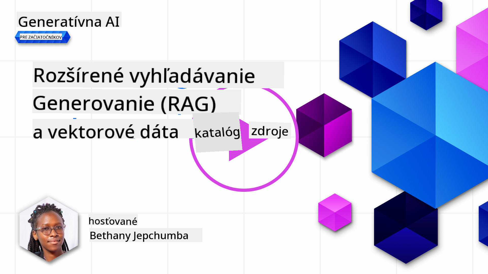
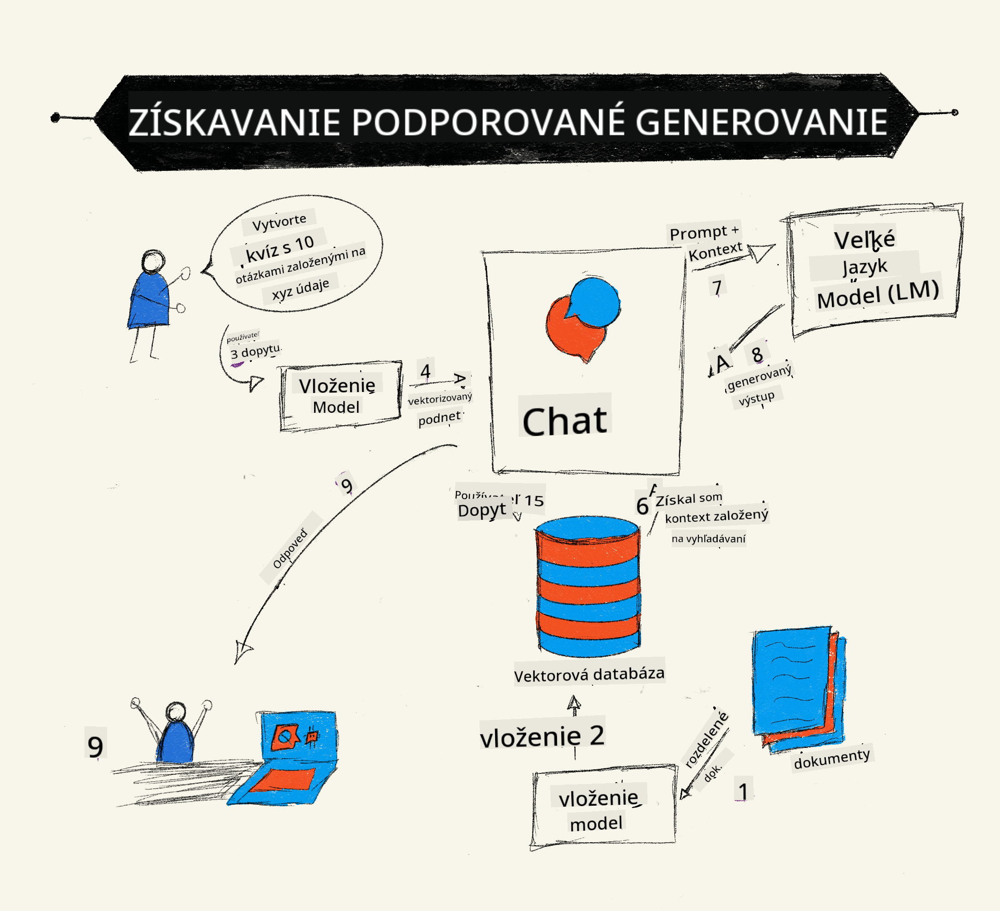
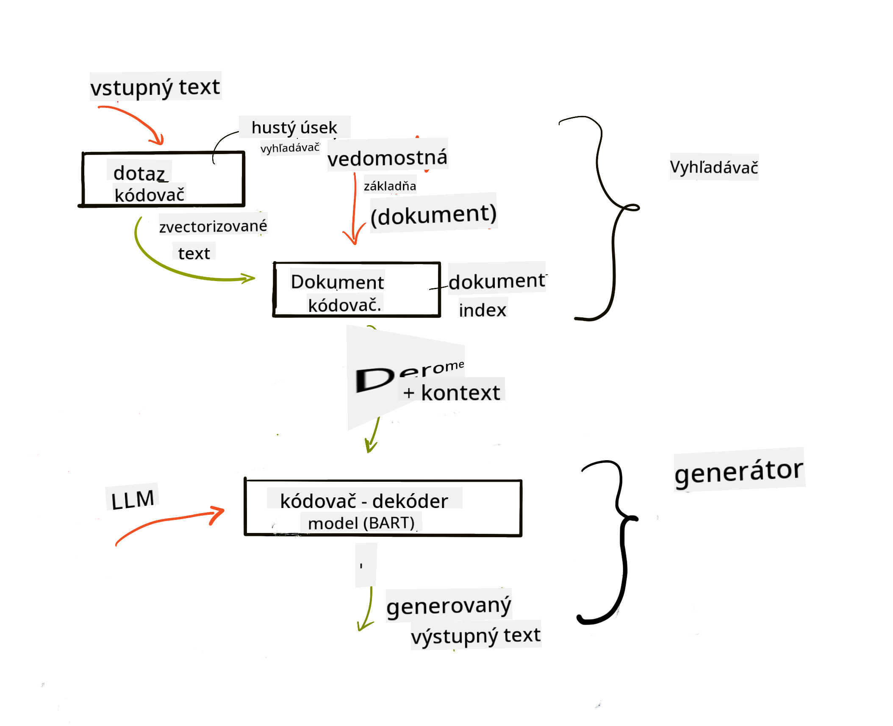
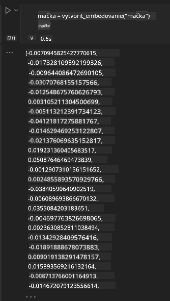

<!--
CO_OP_TRANSLATOR_METADATA:
{
  "original_hash": "e2861bbca91c0567ef32bc77fe054f9e",
  "translation_date": "2025-07-09T16:19:33+00:00",
  "source_file": "15-rag-and-vector-databases/README.md",
  "language_code": "sk"
}
-->
# Retrieval Augmented Generation (RAG) a vektorové databázy

[](https://aka.ms/gen-ai-lesson15-gh?WT.mc_id=academic-105485-koreyst)

V lekcii o vyhľadávacích aplikáciách sme si stručne ukázali, ako integrovať vlastné dáta do veľkých jazykových modelov (LLM). V tejto lekcii sa podrobnejšie pozrieme na koncept zakotvenia vašich dát v aplikácii LLM, mechanizmy tohto procesu a metódy ukladania dát, vrátane embeddingov aj textu.

> **Video čoskoro**

## Úvod

V tejto lekcii sa budeme venovať:

- Úvodu do RAG, čo to je a prečo sa používa v AI (umelej inteligencii).

- Pochopeniu, čo sú vektorové databázy a vytvoreniu takej pre našu aplikáciu.

- Praktickému príkladu, ako integrovať RAG do aplikácie.

## Ciele učenia

Po dokončení tejto lekcie budete schopní:

- Vysvetliť význam RAG pri vyhľadávaní a spracovaní dát.

- Nastaviť RAG aplikáciu a zakotviť svoje dáta v LLM.

- Efektívne integrovať RAG a vektorové databázy v LLM aplikáciách.

## Náš scenár: vylepšenie našich LLM vlastnými dátami

Pre túto lekciu chceme pridať vlastné poznámky do vzdelávacieho startupu, ktorý umožní chatbotovi získať viac informácií o rôznych predmetoch. Vďaka poznámkam, ktoré máme, budú študenti schopní lepšie študovať a pochopiť rôzne témy, čo im uľahčí prípravu na skúšky. Na vytvorenie nášho scenára použijeme:

- `Azure OpenAI:` LLM, ktorý použijeme na vytvorenie nášho chatbota

- `Lekcia AI pre začiatočníkov o neurónových sieťach:` toto budú dáta, na ktorých zakotvíme náš LLM

- `Azure AI Search` a `Azure Cosmos DB:` vektorová databáza na uloženie našich dát a vytvorenie vyhľadávacieho indexu

Používatelia budú môcť vytvárať cvičné kvízy zo svojich poznámok, opakovacie kartičky a zhrnutia do stručných prehľadov. Na začiatok si pozrime, čo je RAG a ako funguje:

## Retrieval Augmented Generation (RAG)

Chatbot poháňaný LLM spracováva používateľské požiadavky na generovanie odpovedí. Je navrhnutý tak, aby bol interaktívny a komunikoval s používateľmi na širokú škálu tém. Jeho odpovede sú však obmedzené na kontext, ktorý mu je poskytnutý, a na základné tréningové dáta. Napríklad, GPT-4 má znalosti len do septembra 2021, čo znamená, že nepozná udalosti, ktoré sa stali po tomto dátume. Okrem toho tréningové dáta LLM nezahŕňajú dôverné informácie, ako sú osobné poznámky alebo manuály spoločnosti.

### Ako fungujú RAG (Retrieval Augmented Generation)



Predstavte si, že chcete nasadiť chatbota, ktorý vytvára kvízy z vašich poznámok, budete potrebovať pripojenie k databáze znalostí. Tu prichádza na pomoc RAG. RAG funguje nasledovne:

- **Databáza znalostí:** Pred vyhľadávaním je potrebné tieto dokumenty načítať a predspracovať, zvyčajne rozdelením veľkých dokumentov na menšie časti, ich transformáciou na textové embeddingy a uložením do databázy.

- **Používateľský dopyt:** používateľ položí otázku

- **Vyhľadávanie:** Keď používateľ položí otázku, embeddingový model vyhľadá relevantné informácie v databáze znalostí, aby poskytol viac kontextu, ktorý sa zapracuje do promptu.

- **Rozšírená generácia:** LLM vylepší svoju odpoveď na základe získaných dát. Umožňuje, aby odpoveď nebola založená len na predtrénovaných dátach, ale aj na relevantných informáciách z pridaného kontextu. Získané dáta sa používajú na rozšírenie odpovedí LLM. LLM potom vráti odpoveď na otázku používateľa.



Architektúra RAG je implementovaná pomocou transformerov pozostávajúcich z dvoch častí: enkodéra a dekodéra. Napríklad, keď používateľ položí otázku, vstupný text sa „zakóduje“ do vektorov zachytávajúcich význam slov a tieto vektory sa „dekódujú“ do nášho dokumentového indexu a generujú nový text na základe používateľského dopytu. LLM používa model enkodér-dekodér na generovanie výstupu.

Dva prístupy pri implementácii RAG podľa navrhovaného článku: [Retrieval-Augmented Generation for Knowledge intensive NLP Tasks](https://arxiv.org/pdf/2005.11401.pdf?WT.mc_id=academic-105485-koreyst) sú:

- **_RAG-Sequence_** používa získané dokumenty na predpovedanie najlepšej možnej odpovede na používateľský dopyt

- **RAG-Token** používa dokumenty na generovanie ďalšieho tokenu, potom ich získava na odpoveď na otázku používateľa

### Prečo používať RAG?

- **Bohatosť informácií:** zabezpečuje, že textové odpovede sú aktuálne a relevantné. Tým zlepšuje výkon na úlohách špecifických pre danú doménu prístupom k internej databáze znalostí.

- Znižuje vymýšľanie odpovedí využitím **overiteľných dát** v databáze znalostí na poskytnutie kontextu k používateľským otázkam.

- Je **nákladovo efektívny**, pretože je ekonomickejší ako doladenie LLM.

## Vytvorenie databázy znalostí

Naša aplikácia je založená na našich osobných dátach, konkrétne na lekcii o neurónových sieťach z kurikula AI pre začiatočníkov.

### Vektorové databázy

Vektorová databáza, na rozdiel od tradičných databáz, je špecializovaná databáza navrhnutá na ukladanie, správu a vyhľadávanie vektorových embeddingov. Ukladá číselné reprezentácie dokumentov. Rozkladanie dát na číselné embeddingy uľahčuje nášmu AI systému pochopenie a spracovanie dát.

Embeddingy ukladáme do vektorových databáz, pretože LLM majú limit na počet tokenov, ktoré prijímajú ako vstup. Keďže nemôžete poslať celé embeddingy do LLM naraz, musíme ich rozdeliť na časti a keď používateľ položí otázku, vrátia sa embeddingy najviac zodpovedajúce otázke spolu s promptom. Rozdelenie tiež znižuje náklady na počet tokenov prechádzajúcich LLM.

Medzi populárne vektorové databázy patria Azure Cosmos DB, Clarifyai, Pinecone, Chromadb, ScaNN, Qdrant a DeepLake. Model Azure Cosmos DB môžete vytvoriť pomocou Azure CLI príkazom:

```bash
az login
az group create -n <resource-group-name> -l <location>
az cosmosdb create -n <cosmos-db-name> -r <resource-group-name>
az cosmosdb list-keys -n <cosmos-db-name> -g <resource-group-name>
```

### Od textu k embeddingom

Pred uložením dát ich musíme previesť na vektorové embeddingy. Ak pracujete s veľkými dokumentmi alebo dlhými textami, môžete ich rozdeliť podľa očakávaných dopytov. Rozdelenie môže byť na úrovni viet alebo odstavcov. Keďže rozdelenie vychádza zo slov okolo, môžete ku každej časti pridať ďalší kontext, napríklad názov dokumentu alebo nejaký text pred alebo za časťou. Dáta môžete rozdeliť takto:

```python
def split_text(text, max_length, min_length):
    words = text.split()
    chunks = []
    current_chunk = []

    for word in words:
        current_chunk.append(word)
        if len(' '.join(current_chunk)) < max_length and len(' '.join(current_chunk)) > min_length:
            chunks.append(' '.join(current_chunk))
            current_chunk = []

    # If the last chunk didn't reach the minimum length, add it anyway
    if current_chunk:
        chunks.append(' '.join(current_chunk))

    return chunks
```

Po rozdelení môžeme text zakódovať pomocou rôznych embedding modelov. Niektoré modely, ktoré môžete použiť, sú word2vec, ada-002 od OpenAI, Azure Computer Vision a mnoho ďalších. Výber modelu závisí od používaných jazykov, typu obsahu (text/obrázky/audio), veľkosti vstupu, ktorý dokáže zakódovať, a dĺžky výstupu embeddingu.

Príklad embeddingu textu pomocou modelu OpenAI `text-embedding-ada-002` je:


## Vyhľadávanie a vektorové vyhľadávanie

Keď používateľ položí otázku, retriever ju prevedie na vektor pomocou query enkodéra, potom vyhľadá v našom indexe dokumentov relevantné vektory súvisiace so vstupom. Po dokončení konvertuje vstupný vektor aj vektory dokumentov späť na text a posiela ich do LLM.

### Vyhľadávanie

Vyhľadávanie nastáva, keď systém rýchlo hľadá dokumenty v indexe, ktoré spĺňajú kritériá vyhľadávania. Cieľom retrievera je získať dokumenty, ktoré sa použijú na poskytnutie kontextu a zakotvenie LLM vo vašich dátach.

Existuje niekoľko spôsobov, ako vyhľadávať v databáze, napríklad:

- **Vyhľadávanie podľa kľúčových slov** – používa sa na textové vyhľadávanie

- **Sémantické vyhľadávanie** – využíva sémantický význam slov

- **Vektorové vyhľadávanie** – prevádza dokumenty z textu na vektorové reprezentácie pomocou embedding modelov. Vyhľadávanie prebieha dotazovaním dokumentov, ktorých vektorové reprezentácie sú najbližšie k otázke používateľa.

- **Hybridné** – kombinácia vyhľadávania podľa kľúčových slov a vektorového vyhľadávania.

Problém pri vyhľadávaní nastáva, keď v databáze nie je podobná odpoveď na dopyt, systém potom vráti najlepšie dostupné informácie. Môžete však použiť taktiky ako nastavenie maximálnej vzdialenosti pre relevantnosť alebo použiť hybridné vyhľadávanie kombinujúce kľúčové slová a vektorové vyhľadávanie. V tejto lekcii použijeme hybridné vyhľadávanie, teda kombináciu vektorového a kľúčového vyhľadávania. Dáta uložíme do dataframe s stĺpcami obsahujúcimi časti textu aj embeddingy.

### Vektorová podobnosť

Retriever vyhľadáva v databáze embeddingy, ktoré sú blízko seba, teda najbližších susedov, pretože ide o podobné texty. V scenári, keď používateľ položí otázku, tá sa najprv zakóduje a potom sa porovná s podobnými embeddingami. Bežnou metrikou na meranie podobnosti vektorov je kosínusová podobnosť, ktorá vychádza z uhla medzi dvoma vektormi.

Podobnosť môžeme merať aj inými metódami, napríklad euklidovskou vzdialenosťou, ktorá je priamkou medzi koncovými bodmi vektorov, alebo skalárnym súčinom, ktorý meria súčet súčinov zodpovedajúcich prvkov dvoch vektorov.

### Vyhľadávací index

Pri vyhľadávaní je potrebné najprv vytvoriť vyhľadávací index pre našu databázu znalostí. Index ukladá embeddingy a umožňuje rýchlo nájsť najpodobnejšie časti aj vo veľkej databáze. Index môžeme vytvoriť lokálne pomocou:

```python
from sklearn.neighbors import NearestNeighbors

embeddings = flattened_df['embeddings'].to_list()

# Create the search index
nbrs = NearestNeighbors(n_neighbors=5, algorithm='ball_tree').fit(embeddings)

# To query the index, you can use the kneighbors method
distances, indices = nbrs.kneighbors(embeddings)
```

### Pretriedenie výsledkov (re-ranking)

Po dotazovaní databázy môže byť potrebné zoradiť výsledky od najrelevantnejších. Re-ranking LLM využíva strojové učenie na zlepšenie relevantnosti výsledkov vyhľadávania ich zoradením od najrelevantnejších. Pri použití Azure AI Search sa pretriedenie vykonáva automaticky pomocou sémantického pretriediaceho modelu. Príklad, ako funguje pretriedenie pomocou najbližších susedov:

```python
# Find the most similar documents
distances, indices = nbrs.kneighbors([query_vector])

index = []
# Print the most similar documents
for i in range(3):
    index = indices[0][i]
    for index in indices[0]:
        print(flattened_df['chunks'].iloc[index])
        print(flattened_df['path'].iloc[index])
        print(flattened_df['distances'].iloc[index])
    else:
        print(f"Index {index} not found in DataFrame")
```

## Spojenie všetkého dohromady

Posledným krokom je pridať náš LLM, aby sme mohli získať odpovede zakotvené v našich dátach. Implementovať to môžeme takto:

```python
user_input = "what is a perceptron?"

def chatbot(user_input):
    # Convert the question to a query vector
    query_vector = create_embeddings(user_input)

    # Find the most similar documents
    distances, indices = nbrs.kneighbors([query_vector])

    # add documents to query  to provide context
    history = []
    for index in indices[0]:
        history.append(flattened_df['chunks'].iloc[index])

    # combine the history and the user input
    history.append(user_input)

    # create a message object
    messages=[
        {"role": "system", "content": "You are an AI assistant that helps with AI questions."},
        {"role": "user", "content": history[-1]}
    ]

    # use chat completion to generate a response
    response = openai.chat.completions.create(
        model="gpt-4",
        temperature=0.7,
        max_tokens=800,
        messages=messages
    )

    return response.choices[0].message

chatbot(user_input)
```

## Hodnotenie našej aplikácie

### Metódy hodnotenia

- Kvalita odpovedí – zabezpečiť, aby zneli prirodzene, plynulo a ľudsky

- Zakotvenie dát – hodnotiť, či odpoveď vychádza z poskytnutých dokumentov

- Relevantnosť – hodnotiť, či odpoveď zodpovedá a súvisí s položenou otázkou

- Plynulosť – či odpoveď dáva gramatický zmysel

## Príklady použitia RAG a vektorových databáz

Existuje mnoho rôznych prípadov použitia, kde môžu funkčné volania zlepšiť vašu aplikáciu, napríklad:

- Otázky a odpovede: zakotvenie firemných dát do chatu, ktorý môžu používať zamestnanci na kladenie otázok.

- Odporúčacie systémy: vytvorenie systému, ktorý nájde najpodobnejšie hodnoty, napríklad filmy, reštaurácie a podobne.

- Chatbot služby: ukladanie histórie chatu a personalizácia konverzácie na základe používateľských dát.

- Vyhľadávanie obrázkov na základe vektorových embeddingov, užitočné pri rozpoznávaní obrázkov a detekcii anomálií.

## Zhrnutie

Prešli sme základné oblasti RAG od pridania dát do aplikácie, cez používateľský dopyt až po výstup. Na zjednodušenie tvorby RAG môžete použiť frameworky ako Semantic Kernel, Langchain alebo Autogen.

## Zadanie

Na pokračovanie vo vzdelávaní o Retrieval Augmented Generation (RAG) môžete vytvoriť:

- Front-end aplikácie pomocou frameworku podľa vlastného výberu

- Využiť framework, buď LangChain alebo Semantic Kernel, a znovu vytvoriť svoju aplikáciu.

Gratulujeme k dokončeniu lekcie 👏.

## Učenie tu nekončí, pokračujte v ceste

Po dokončení tejto lekcie si pozrite našu [kolekciu Generatívneho AI](https://aka.ms/genai-collection?WT.mc_id=academic-105485-koreyst), aby ste naďalej rozvíjali svoje znalosti v oblasti Generatívnej AI!

**Vyhlásenie o zodpovednosti**:  
Tento dokument bol preložený pomocou AI prekladateľskej služby [Co-op Translator](https://github.com/Azure/co-op-translator). Aj keď sa snažíme o presnosť, prosím, majte na pamäti, že automatizované preklady môžu obsahovať chyby alebo nepresnosti. Originálny dokument v jeho pôvodnom jazyku by mal byť považovaný za autoritatívny zdroj. Pre kritické informácie sa odporúča profesionálny ľudský preklad. Nie sme zodpovední za akékoľvek nedorozumenia alebo nesprávne interpretácie vyplývajúce z použitia tohto prekladu.