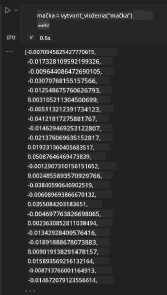

<!--
CO_OP_TRANSLATOR_METADATA:
{
  "original_hash": "e2861bbca91c0567ef32bc77fe054f9e",
  "translation_date": "2025-05-20T01:41:06+00:00",
  "source_file": "15-rag-and-vector-databases/README.md",
  "language_code": "sk"
}
-->
# Generácia rozšírená o vyhľadávanie (RAG) a vektorové databázy

V lekcii o aplikáciách na vyhľadávanie sme sa stručne naučili, ako integrovať vlastné dáta do veľkých jazykových modelov (LLM). V tejto lekcii sa hlbšie ponoríme do konceptov zakotvenia vašich dát vo vašej LLM aplikácii, mechaniky procesu a metód na ukladanie dát, vrátane embeddings a textu.

> **Video príde čoskoro**

## Úvod

V tejto lekcii sa budeme zaoberať nasledujúcim:

- Úvod do RAG, čo to je a prečo sa používa v AI (umelej inteligencii).

- Pochopenie toho, čo sú vektorové databázy a vytvorenie jednej pre našu aplikáciu.

- Praktický príklad, ako integrovať RAG do aplikácie.

## Ciele učenia

Po absolvovaní tejto lekcie budete schopní:

- Vysvetliť význam RAG pri vyhľadávaní a spracovaní dát.

- Nastaviť RAG aplikáciu a zakotviť vaše dáta do LLM

- Efektívna integrácia RAG a vektorových databáz do LLM aplikácií.

## Náš scenár: vylepšenie našich LLM vlastnými dátami

Pre túto lekciu chceme pridať naše vlastné poznámky do vzdelávacieho startupu, čo umožní chatbotu získať viac informácií o rôznych predmetoch. Pomocou poznámok, ktoré máme, budú študenti schopní lepšie študovať a pochopiť rôzne témy, čo im uľahčí prípravu na skúšky. Na vytvorenie nášho scenára použijeme:

- `Azure OpenAI:` LLM, ktorý použijeme na vytvorenie nášho chatbota

- `AI for beginners' lesson on Neural Networks`: toto budú dáta, na ktorých zakotvíme náš LLM

- `Azure AI Search` a `Azure Cosmos DB:` vektorová databáza na ukladanie našich dát a vytvorenie indexu vyhľadávania

Používatelia budú môcť vytvárať cvičné testy zo svojich poznámok, kartičky na opakovanie a zhrnúť ich do stručných prehľadov. Aby sme začali, pozrime sa na to, čo je RAG a ako funguje:

## Generácia rozšírená o vyhľadávanie (RAG)

Chatbot poháňaný LLM spracováva používateľské výzvy na generovanie odpovedí. Je navrhnutý tak, aby bol interaktívny a zapája sa do širokej škály tém. Avšak jeho odpovede sú obmedzené na kontext, ktorý je poskytnutý a na jeho základné tréningové dáta. Napríklad, GPT-4 má obmedzenie znalostí na september 2021, čo znamená, že nemá znalosti o udalostiach, ktoré sa udiali po tomto období. Okrem toho, dáta použité na tréning LLM vylučujú dôverné informácie, ako osobné poznámky alebo manuál produktu spoločnosti.

### Ako fungujú RAG (Generácia rozšírená o vyhľadávanie)

Predpokladajme, že chcete nasadiť chatbota, ktorý vytvára testy z vašich poznámok, budete potrebovať pripojenie k znalostnej báze. Tu prichádza na pomoc RAG. RAG funguje nasledovne:

- **Znalostná báza:** Pred vyhľadávaním musia byť tieto dokumenty spracované a predspracované, typicky rozdelením veľkých dokumentov na menšie časti, transformáciou na textové embeddings a ich uložením do databázy.

- **Dotaz používateľa:** používateľ položí otázku

- **Vyhľadávanie:** Keď používateľ položí otázku, embedding model vyhľadá relevantné informácie z našej znalostnej bázy, aby poskytol viac kontextu, ktorý bude začlenený do výzvy.

- **Rozšírená generácia:** LLM vylepšuje svoju odpoveď na základe získaných dát. Umožňuje, aby odpoveď generovaná nebola založená len na predtrénovaných dátach, ale aj na relevantných informáciách z pridaného kontextu. Získané dáta sa používajú na rozšírenie odpovedí LLM. LLM potom vráti odpoveď na otázku používateľa.

Architektúra pre RAG je implementovaná pomocou transformátorov pozostávajúcich z dvoch častí: kódovača a dekódovača. Napríklad, keď používateľ položí otázku, vstupný text je 'zakódovaný' do vektorov, ktoré zachytávajú význam slov a vektory sú 'dekódované' do nášho dokumentového indexu a generujú nový text na základe dotazu používateľa. LLM používa model kódovač-dekódovač na generovanie výstupu.

Dva prístupy pri implementácii RAG podľa navrhovaného článku: [Generácia rozšírená o vyhľadávanie pre úlohy NLP (softvér na spracovanie prirodzeného jazyka) náročné na znalosti](https://arxiv.org/pdf/2005.11401.pdf?WT.mc_id=academic-105485-koreyst) sú:

- **_RAG-Sequence_** používajúci získané dokumenty na predpovedanie najlepšej možnej odpovede na dotaz používateľa

- **RAG-Token** používajúci dokumenty na generovanie ďalšieho tokenu, potom ich získava na odpoveď na dotaz používateľa

### Prečo by ste používali RAG? 

- **Bohatstvo informácií:** zaisťuje, že textové odpovede sú aktuálne a aktuálne. Preto zlepšuje výkon pri úlohách špecifických pre doménu prístupom k interným znalostiam.

- Znižuje fabrikačné chyby využitím **overiteľných dát** v znalostnej báze na poskytnutie kontextu k dotazom používateľov.

- Je **nákladovo efektívny**, pretože sú ekonomickejšie v porovnaní s jemným doladením LLM.

## Vytvorenie znalostnej bázy

Naša aplikácia je založená na našich osobných dátach, tj. lekcia o neurónových sieťach v učebnom pláne AI pre začiatočníkov.

### Vektorové databázy

Vektorová databáza, na rozdiel od tradičných databáz, je špecializovaná databáza navrhnutá na ukladanie, správu a vyhľadávanie embedded vektorov. Ukladá číselné reprezentácie dokumentov. Rozdelenie dát na číselné embeddings uľahčuje nášmu AI systému pochopiť a spracovať dáta.

Ukladáme naše embeddings vo vektorových databázach, pretože LLM majú obmedzenie počtu tokenov, ktoré akceptujú ako vstup. Keďže nemôžete preniesť celé embeddings do LLM, budeme ich musieť rozdeliť na časti a keď používateľ položí otázku, embeddings najviac podobné otázke budú vrátené spolu s výzvou. Rozdelenie tiež znižuje náklady na počet tokenov prenesených cez LLM.

Niektoré populárne vektorové databázy zahŕňajú Azure Cosmos DB, Clarifyai, Pinecone, Chromadb, ScaNN, Qdrant a DeepLake. Môžete vytvoriť model Azure Cosmos DB pomocou Azure CLI s nasledujúcim príkazom:

```bash
az login
az group create -n <resource-group-name> -l <location>
az cosmosdb create -n <cosmos-db-name> -r <resource-group-name>
az cosmosdb list-keys -n <cosmos-db-name> -g <resource-group-name>
```

### Od textu k embeddings

Predtým, ako uložíme naše dáta, budeme ich musieť previesť na vektorové embeddings predtým, ako budú uložené v databáze. Ak pracujete s veľkými dokumentmi alebo dlhými textami, môžete ich rozdeliť na základe dotazov, ktoré očakávate. Rozdelenie môže byť vykonané na úrovni vety alebo na úrovni odstavca. Keďže rozdelenie odvádza významy z okolitých slov, môžete pridať nejaký ďalší kontext do časti, napríklad pridaním názvu dokumentu alebo zahrnutím textu pred alebo po časti. Dáta môžete rozdeliť nasledovne:

```python
def split_text(text, max_length, min_length):
    words = text.split()
    chunks = []
    current_chunk = []

    for word in words:
        current_chunk.append(word)
        if len(' '.join(current_chunk)) < max_length and len(' '.join(current_chunk)) > min_length:
            chunks.append(' '.join(current_chunk))
            current_chunk = []

    # If the last chunk didn't reach the minimum length, add it anyway
    if current_chunk:
        chunks.append(' '.join(current_chunk))

    return chunks
```

Keď sú rozdelené, môžeme potom embedovať náš text pomocou rôznych embedding modelov. Niektoré modely, ktoré môžete použiť, zahŕňajú: word2vec, ada-002 od OpenAI, Azure Computer Vision a mnoho ďalších. Výber modelu na použitie bude závisieť od jazykov, ktoré používate, typu kódovaného obsahu (text/obrázky/audio), veľkosti vstupu, ktorý môže kódovať a dĺžky výstupu embeddingu.

Príklad embedded textu pomocou modelu `text-embedding-ada-002` od OpenAI je:


## Vyhľadávanie a vektorové vyhľadávanie

Keď používateľ položí otázku, retriever ju transformuje na vektor pomocou kódovača dotazu, potom prehľadáva náš dokumentový index vyhľadávania pre relevantné vektory v dokumente, ktoré súvisia s vstupom. Keď je hotovo, konvertuje vstupný vektor aj vektory dokumentu na text a prechádza cez LLM.

### Vyhľadávanie

Vyhľadávanie sa uskutočňuje, keď systém sa snaží rýchlo nájsť dokumenty z indexu, ktoré spĺňajú kritériá vyhľadávania. Cieľom retrievera je získať dokumenty, ktoré budú použité na poskytnutie kontextu a zakotvenie LLM na vašich dátach.

Existuje niekoľko spôsobov, ako vykonávať vyhľadávanie v našej databáze, ako napríklad:

- **Vyhľadávanie podľa kľúčových slov** - používané pre textové vyhľadávania

- **Semantické vyhľadávanie** - používa semantický význam slov

- **Vektorové vyhľadávanie** - konvertuje dokumenty z textu na vektorové reprezentácie pomocou embedding modelov. Vyhľadávanie bude vykonané dotazovaním dokumentov, ktorých vektorové reprezentácie sú najbližšie k otázke používateľa.

- **Hybridné** - kombinácia vyhľadávania podľa kľúčových slov a vektorového vyhľadávania.

Výzva pri vyhľadávaní nastáva, keď v databáze nie je podobná odpoveď na dotaz, systém potom vráti najlepšie informácie, ktoré môže získať, avšak môžete použiť taktiky, ako nastavenie maximálnej vzdialenosti pre relevanciu alebo použitie hybridného vyhľadávania, ktoré kombinuje kľúčové slová a vektorové vyhľadávanie. V tejto lekcii použijeme hybridné vyhľadávanie, kombináciu vektorového a vyhľadávania podľa kľúčových slov. Naše dáta uložíme do dátového rámca so stĺpcami obsahujúcimi časti a embeddings.

### Vektorová podobnosť

Retriever prehľadá znalostnú databázu pre embeddings, ktoré sú blízko seba, najbližšieho suseda, pretože sú texty, ktoré sú podobné. V prípade, že používateľ položí dotaz, je najprv embedovaný a potom porovnaný s podobnými embeddings. Bežné meranie, ktoré sa používa na zistenie, ako podobné sú rôzne vektory, je kosínová podobnosť, ktorá je založená na uhle medzi dvoma vektormi.

Môžeme merať podobnosť pomocou iných alternatív, ktoré môžeme použiť, ako je Euklidovská vzdialenosť, ktorá je priamou čiarou medzi koncovými bodmi vektorov a skalárny súčin, ktorý meria súčet súčinov zodpovedajúcich prvkov dvoch vektorov.

### Index vyhľadávania

Pri vykonávaní vyhľadávania budeme potrebovať vytvoriť index vyhľadávania pre našu znalostnú bázu predtým, ako vykonáme vyhľadávanie. Index bude ukladať naše embeddings a môže rýchlo vyhľadať najpodobnejšie časti aj vo veľkej databáze. Môžeme vytvoriť náš index lokálne pomocou:

```python
from sklearn.neighbors import NearestNeighbors

embeddings = flattened_df['embeddings'].to_list()

# Create the search index
nbrs = NearestNeighbors(n_neighbors=5, algorithm='ball_tree').fit(embeddings)

# To query the index, you can use the kneighbors method
distances, indices = nbrs.kneighbors(embeddings)
```

### Pre-rankovanie

Keď dotazujete databázu, možno budete potrebovať zoradiť výsledky od najrelevantnejších. Pre-rankovací LLM využíva strojové učenie na zlepšenie relevancie výsledkov vyhľadávania ich zoradením od najrelevantnejších. Pomocou Azure AI Search sa pre-rankovanie vykonáva automaticky pomocou semantického pre-rankeru. Príklad, ako funguje pre-rankovanie pomocou najbližších susedov:

```python
# Find the most similar documents
distances, indices = nbrs.kneighbors([query_vector])

index = []
# Print the most similar documents
for i in range(3):
    index = indices[0][i]
    for index in indices[0]:
        print(flattened_df['chunks'].iloc[index])
        print(flattened_df['path'].iloc[index])
        print(flattened_df['distances'].iloc[index])
    else:
        print(f"Index {index} not found in DataFrame")
```

## Spojenie všetkého dohromady

Posledným krokom je pridať náš LLM do mixu, aby sme mohli získať odpovede, ktoré sú zakotvené na našich dátach. Môžeme to implementovať nasledovne:

```python
user_input = "what is a perceptron?"

def chatbot(user_input):
    # Convert the question to a query vector
    query_vector = create_embeddings(user_input)

    # Find the most similar documents
    distances, indices = nbrs.kneighbors([query_vector])

    # add documents to query  to provide context
    history = []
    for index in indices[0]:
        history.append(flattened_df['chunks'].iloc[index])

    # combine the history and the user input
    history.append(user_input)

    # create a message object
    messages=[
        {"role": "system", "content": "You are an AI assistant that helps with AI questions."},
        {"role": "user", "content": history[-1]}
    ]

    # use chat completion to generate a response
    response = openai.chat.completions.create(
        model="gpt-4",
        temperature=0.7,
        max_tokens=800,
        messages=messages
    )

    return response.choices[0].message

chatbot(user_input)
```

## Hodnotenie našej aplikácie

### Hodnotiace metriky

- Kvalita poskytnutých odpovedí, zabezpečenie, že znie prirodzene, plynulo a ľudsky

- Zakotvenie dát: hodnotenie, či odpoveď pochádza z poskytnutých dokumentov

- Relevancia: hodnotenie, či odpoveď zodpovedá a súvisí s položenou otázkou

- Plynulosť - či odpoveď dáva zmysel gramaticky

## Použitie RAG (Generácia rozšírená o vyhľadávanie) a vektorových databáz

Existuje mnoho rôznych použití, kde volania funkcií môžu zlepšiť vašu aplikáciu, ako napríklad:

- Otázky a odpovede: zakotvenie vašich firemných dát do chatu, ktorý môžu používať zamestnanci na kladenie otázok.

- Systémy odporúčania: kde môžete vytvoriť systém, ktorý zodpovedá najpodobnejšie hodnoty, napr. filmy, reštaurácie a mnoho ďalších.

- Služby chatbotov: môžete ukladať históriu chatov a personalizovať konverzáciu na základe dát používateľa.

- Vyhľadávanie obrázkov na základe vektorových embeddings, užitočné pri rozpoznávaní obrázkov a detekcii anomálií.

## Zhrnutie

Pokryli sme základné oblasti RAG od pridania našich dát do aplikácie, dotazu používateľa a výstupu. Na zjednodušenie tvorby RAG môžete použiť rámce ako Semanti Kernel, Langchain alebo Autogen.

## Zadanie

Aby ste pokračovali vo vašom učení o Generácii rozšírenej o vyhľadávanie (RAG), môžete vytvoriť:

- Vytvorte front-end pre aplikáciu pomocou rámca podľa vášho výberu

- Využite rámec, buď LangChain alebo Semantic Kernel, a znovu vytvorte svoju aplikáciu.

Gratulujeme k dokončeniu lekcie 👏.

## Učenie sa tu nekončí, pokračujte v ceste

Po dokončení tejto lekcie si pozrite našu [kolekciu učenia Generatívnej AI](https://aka.ms/genai-collection?WT.mc_id=academic-105485-koreyst), aby ste pokračovali v zvyšovaní vašich znalostí o Generatívnej AI!

**Zrieknutie sa zodpovednosti**:  
Tento dokument bol preložený pomocou služby AI prekladu [Co-op Translator](https://github.com/Azure/co-op-translator). Aj keď sa snažíme o presnosť, prosím uvedomte si, že automatizované preklady môžu obsahovať chyby alebo nepresnosti. Pôvodný dokument v jeho rodnom jazyku by mal byť považovaný za autoritatívny zdroj. Pre kritické informácie sa odporúča profesionálny ľudský preklad. Nie sme zodpovední za akékoľvek nedorozumenia alebo nesprávne interpretácie vyplývajúce z použitia tohto prekladu.