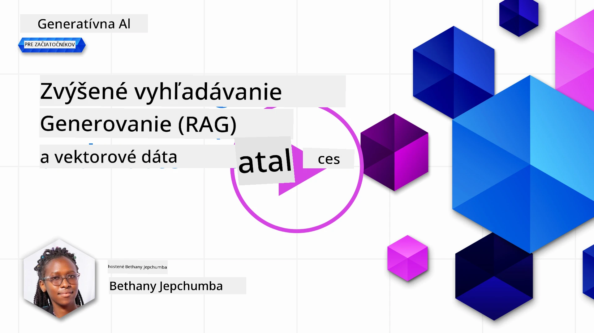
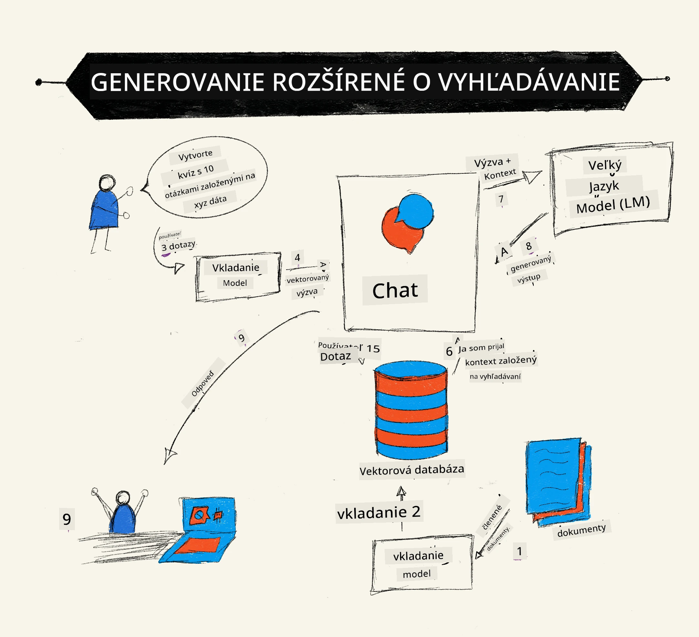
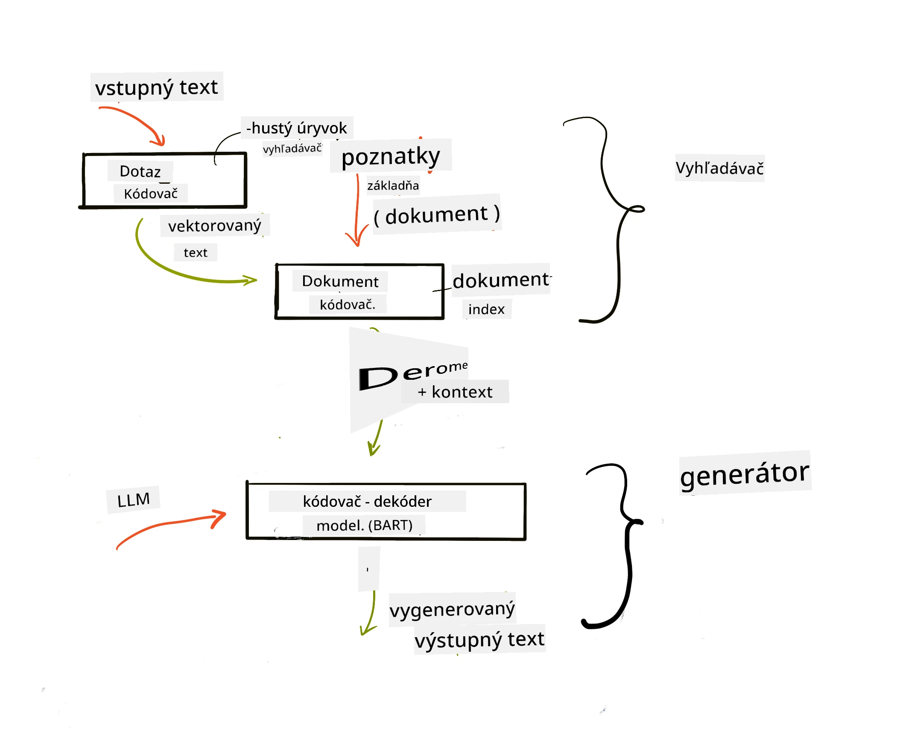

# Retrieval Augmented Generation (RAG) a vektorové databázy

[](https://youtu.be/4l8zhHUBeyI?si=BmvDmL1fnHtgQYkL)

V lekcii o vyhľadávacích aplikáciách sme stručne spoznali, ako integrovať vlastné dáta do veľkých jazykových modelov (LLM). V tejto lekcii sa budeme ďalej venovať konceptom ukotvenia vašich dát v aplikácii LLM, mechanike tohto procesu a spôsobom ukladania dát, vrátane embeddingov aj textu.

> **Video čoskoro k dispozícii**

## Úvod

V tejto lekcii preberieme nasledovné:

- Úvod do RAG, čo to je a prečo sa používa v AI (umiestnená inteligencia).

- Pochopenie, čo sú vektorové databázy a vytvorenie jednej pre našu aplikáciu.

- Praktický príklad, ako integrovať RAG do aplikácie.

## Ciele učenia

Po dokončení tejto lekcie budete vedieť:

- Vysvetliť význam RAG v získavaní a spracovaní dát.

- Nastaviť RAG aplikáciu a ukotviť vaše dáta v LLM

- Efektívnu integráciu RAG a vektorových databáz v LLM aplikáciách.

## Náš scenár: rozšírenie našich LLM o vlastné dáta

Pre túto lekciu chceme pridať vlastné poznámky do vzdelávacieho startupu, ktorý umožní chatbotovi získať viac informácií o rôznych predmetoch. Vďaka poznámkam, ktoré máme, budú študenti schopní lepšie študovať a pochopiť rôzne témy, čo uľahčí prípravu na skúšky. Na vytvorenie nášho scenára použijeme:

- `Azure OpenAI:` LLM, ktoré použijeme na vytvorenie nášho chatbota

- `AI for beginners' lekciu o neurónových sieťach`: na tejto lekcii ukotvíme náš LLM

- `Azure AI Search` a `Azure Cosmos DB:` vektorová databáza na uloženie našich dát a vytvorenie vyhľadávacieho indexu

Používatelia budú môcť vytvárať cvičné kvízy zo svojich poznámok, opakovacie flash karty a sumarizovať ich na stručné prehľady. Aby sme začali, pozrime sa, čo je RAG a ako funguje:

## Retrieval Augmented Generation (RAG)

Chatbot poháňaný LLM spracováva používateľské dotazy, aby generoval odpovede. Je navrhnutý tak, aby bol interaktívny a komunikoval s používateľmi o širokej škále tém. Jeho odpovede sú však obmedzené na kontext, ktorý mu bol poskytnutý a na základné trénovacie dáta. Napríklad vedomostný cutoff GPT-4 je september 2021, čo znamená, že nemá vedomosti o udalostiach, ktoré nastali po tomto období. Navyše, dáta používané na trénovanie LLM vylučujú dôverné informácie, ako napríklad osobné poznámky alebo produktový manuál spoločnosti.

### Ako fungujú RAG (Retrieval Augmented Generation)



Predstavte si, že chcete nasadiť chatbota, ktorý vytvára kvízy z vašich poznámok, budete potrebovať pripojenie k databáze znalostí. Práve tu prichádza na pomoc RAG. RAG funguje nasledovne:

- **Znalostná báza:** Pred získavaním je potrebné tieto dokumenty nahrať a predspracovať, zvyčajne rozbiť veľké dokumenty na menšie časti, transformovať ich na textové embeddingy a uložiť do databázy.

- **Používateľská otázka:** používateľ položí otázku

- **Získavanie:** Keď používateľ položí otázku, embedding model vyhľadá relevantné informácie v našej znalostnej báze, ktoré poskytnú ďalší kontext, ktorý bude zapracovaný do promptu.

- **Rozšírená generácia:** LLM zlepšuje svoju odpoveď na základe získaných dát. Umožňuje tak, aby odpoveď nebola založená len na predtrénovaných dátach, ale aj na relevantných informáciách z pridaného kontextu. Získané dáta sa používajú na rozšírenie odpovedí LLM. LLM potom vráti odpoveď na otázku používateľa.



Architektúra RAG je implementovaná pomocou transformerov pozostávajúcich z dvoch častí: enkodéra a dekodéra. Napríklad, keď používateľ položí otázku, vstupný text sa „zakóduje“ do vektorov zachytávajúcich význam slov a tieto vektory sa následne „dekódujú“ do nášho dokumentového indexu a generuje sa nový text založený na dopyte používateľa. LLM používa model enkodér-dekodér na generovanie výstupu.

Dva prístupy k implementácii RAG podľa navrhovanej práce: [Retrieval-Augmented Generation for Knowledge intensive NLP (softvér pre spracovanie prirodzeného jazyka)](https://arxiv.org/pdf/2005.11401.pdf?WT.mc_id=academic-105485-koreyst) sú:

- **_RAG-Sequence_** používa získané dokumenty na predikciu najlepšej možnej odpovede na otázku používateľa

- **RAG-Token** používa dokumenty na generovanie ďalšieho tokenu a následne ich získava na odpoveď používateľovho dotazu

### Prečo by ste použili RAG? 

- **Bohatstvo informácií:** zaručuje, že textové odpovede sú aktuálne a relevantné. Tým zvyšuje výkon pri doménovo špecifických úlohách prístupom k interným znalostiam.

- Znižuje výmysly využitím **overiteľných dát** v znalostnej báze na poskytnutie kontextu k používateľským dotazom.

- Je **nákladovo efektívny**, pretože je ekonomickejší ako dolaďovanie LLM.

## Vytváranie znalostnej bázy

Naša aplikácia je založená na našich osobných dátach, t.j. lekcii Neurónové siete v kurikule AI pre začiatočníkov.

### Vektorové databázy

Vektorová databáza, na rozdiel od tradičných databáz, je špecializovaná databáza navrhnutá na ukladanie, správu a vyhľadávanie vektorových embeddingov. Ukladá číselné reprezentácie dokumentov. Rozkladanie dát na numerické embeddingy umožňuje nášmu AI systému jednoduchšie porozumenie a spracovanie dát.

Embeddingy ukladajme vo vektorových databázach, pretože LLM má limit počtu tokenov, ktoré prijíma ako vstup. Keďže je nemožné zadať celý embedding naraz do LLM, musíme ich rozbiť na časti a keď používateľ položí otázku, vrátia sa embeddingy najviac podobné dopytu spolu s promptom. Rozdelenie na časti tiež znižuje náklady na počet tokenov spracovaných LLM.

Medzi populárne vektorové databázy patrí Azure Cosmos DB, Clarifyai, Pinecone, Chromadb, ScaNN, Qdrant a DeepLake. Môžete vytvoriť model Azure Cosmos DB pomocou Azure CLI s nasledujúcim príkazom:

```bash
az login
az group create -n <resource-group-name> -l <location>
az cosmosdb create -n <cosmos-db-name> -r <resource-group-name>
az cosmosdb list-keys -n <cosmos-db-name> -g <resource-group-name>
```

### Od textu k embeddingom

Pred uložením dát ich musíme previesť na vektorové embeddingy. Ak pracujete s veľkými dokumentmi alebo dlhými textami, môžete ich rozdeliť na časti podľa očakávaných dopytov. Členenie môže byť na úrovni viet alebo odstavcov. Keďže členenie vychádza zo slov v okolí, môžete k časti pridať ďalší kontext, napríklad názov dokumentu alebo text pred alebo po časti. Dáta môžete členit nasledovne:

```python
def split_text(text, max_length, min_length):
    words = text.split()
    chunks = []
    current_chunk = []

    for word in words:
        current_chunk.append(word)
        if len(' '.join(current_chunk)) < max_length and len(' '.join(current_chunk)) > min_length:
            chunks.append(' '.join(current_chunk))
            current_chunk = []

    # Ak posledný blok nedosiahol minimálnu dĺžku, aj tak ho pridajte
    if current_chunk:
        chunks.append(' '.join(current_chunk))

    return chunks
```

Po rozdelení môžeme text embedovať pomocou rôznych embedding modelov. Niektoré modely, ktoré môžete použiť, sú: word2vec, ada-002 od OpenAI, Azure Computer Vision a mnoho ďalších. Výber modelu závisí od používaných jazykov, typu kódovaného obsahu (text/obrázky/audio), veľkosti vstupu, ktorý dokáže zakódovať, a dĺžky výstupu embeddingu.

Príklad zahŕňa text zakódovaný modelom OpenAI `text-embedding-ada-002`:


## Získavanie a vektorové vyhľadávanie

Keď používateľ položí otázku, retriever ju prevedie na vektor pomocou query enkodéra, potom vyhľadá v indexe dokumentov relevantné vektory súvisiace so vstupom. Po dokončení konvertuje vstupný aj dokumentové vektory na text a pošle ich cez LLM.

### Získavanie

Získavanie nastáva, keď systém rýchlo hľadá dokumenty v indexe, ktoré spĺňajú kritériá vyhľadávania. Cieľom retrievera je nájsť dokumenty, ktoré poskytnú kontext a ukotvia LLM vo vašich dátach.

Existuje niekoľko spôsobov vyhľadávania v databáze, napríklad:

- **Vyhľadávanie podľa kľúčových slov** - používa sa pre textové vyhľadávanie

- **Vektorové vyhľadávanie** - prevádza dokumenty z textu na vektorové reprezentácie pomocou embedding modelov, čo umožňuje **semantické vyhľadávanie** využívajúce význam slov. Vyhľadávanie prebieha podľa dokumentov, ktorých vektorové reprezentácie sú najbližšie položenej otázke.

- **Hybridné vyhľadávanie** - kombinácia vyhľadávania podľa kľúčových slov a vektorového vyhľadávania.

Výzvou pri získavaní je, keď v databáze nie je žiadna podobná odpoveď na dotaz, systém vráti najlepšie dostupné informácie, avšak môžete použiť taktiku nastavením maximálnej vzdialenosti relevantnosti alebo použiť hybridné vyhľadávanie, ktoré kombinuje kľúčové slová aj vektorové vyhľadávanie. V tejto lekcii použijeme hybridné vyhľadávanie, kombináciu vektorového a kľúčového vyhľadávania. Dáta uložíme do dátového rámca so stĺpcami obsahujúcimi časti aj embeddingy.

### Vektorová podobnosť

Retriever prehľadá znalostnú databázu a hľadá embeddingy, ktoré sú blízko seba, teda najbližšie susedy, pretože sú to texty podobné. Keď používateľ položí dotaz, najskôr sa embeduje a potom sa porovná s podobnými embeddingami. Bežným meradlom podobnosti vektorov je kosínusová podobnosť založená na uhle medzi dvoma vektormi.

Alternatívami na meranie podobnosti sú Euklidovská vzdialenosť, ktorá je priamou čiarou medzi koncovými bodmi vektorov, a skalárny súčin, ktorý meria súčet súčinov odpovedajúcich prvkov dvoch vektorov.

### Vyhľadávací index

Pri získavaní je potrebné najprv vybudovať vyhľadávací index pre znalostnú databázu. Index ukladá embeddingy a dokáže rýchlo vyhľadať najpodobnejšie časti aj vo veľkej databáze. Index môžeme vytvoriť lokálne nasledovne:

```python
from sklearn.neighbors import NearestNeighbors

embeddings = flattened_df['embeddings'].to_list()

# Vytvorte vyhľadávací index
nbrs = NearestNeighbors(n_neighbors=5, algorithm='ball_tree').fit(embeddings)

# Na dotazovanie do indexu môžete použiť metódu kneighbors
distances, indices = nbrs.kneighbors(embeddings)
```

### Pretriedenie odpovedí

Po vyhľadaní v databáze možno budete chcieť zoradiť výsledky podľa najväčšej relevantnosti. LLM pretriedenia využíva strojové učenie na zlepšenie relevancie vyhľadávacích výsledkov ich zoradením od najrelevantnejších. Pri použití Azure AI Search sa pretriedenie vykonáva automaticky pomocou sémantického pretriediča. Príklad fungovania pretriedenia s najbližšími susedmi:

```python
# Nájdite najpodobnejšie dokumenty
distances, indices = nbrs.kneighbors([query_vector])

index = []
# Vytlačte najpodobnejšie dokumenty
for i in range(3):
    index = indices[0][i]
    for index in indices[0]:
        print(flattened_df['chunks'].iloc[index])
        print(flattened_df['path'].iloc[index])
        print(flattened_df['distances'].iloc[index])
    else:
        print(f"Index {index} not found in DataFrame")
```

## Spoločné nasadenie

Posledným krokom je pridanie nášho LLM do procesu, aby sme dostali odpovede zakotvené v našich dátach. Implementovať to môžeme nasledovne:

```python
user_input = "what is a perceptron?"

def chatbot(user_input):
    # Preveďte otázku na dotaz vektor
    query_vector = create_embeddings(user_input)

    # Nájdite najpodobnejšie dokumenty
    distances, indices = nbrs.kneighbors([query_vector])

    # pridajte dokumenty k dotazu, aby ste poskytli kontext
    history = []
    for index in indices[0]:
        history.append(flattened_df['chunks'].iloc[index])

    # skombinujte históriu a používateľský vstup
    history.append(user_input)

    # vytvorte objekt správy
    messages=[
        {"role": "system", "content": "You are an AI assistant that helps with AI questions."},
        {"role": "user", "content": "\n\n".join(history) }
    ]

    # použite Responses API na vytvorenie odpovede
    response = client.responses.create(
        model="gpt-4o-mini",
        temperature=0.7,
        max_output_tokens=800,
        input=messages,
        store=False,
    )

    return response.output_text

chatbot(user_input)
```

## Hodnotenie našej aplikácie

### Metódy hodnotenia

- Kvalita dodaných odpovedí – dbať na to, aby zneli prirodzene, plynule a ľudsky

- Ukotvenosť dát: hodnotenie, či odpoveď pochádza z dodaných dokumentov

- Relevantnosť: hodnotenie, či odpoveď zodpovedá a súvisí s položenou otázkou

- Plynulosť - či je odpoveď gramaticky správna a zrozumiteľná

## Použitie RAG a vektorových databáz

Existuje mnoho rôznych prípadov použitia, kde môžu funkčné volania zlepšiť vašu aplikáciu, napríklad:

- Otázky a odpovede: ukotvenie firemných dát do chatu, ktorý môžu používať zamestnanci na kladenie otázok.

- Doporučovacie systémy: môžete vytvoriť systém, ktorý nájde najviac podobné hodnoty napr. filmy, reštaurácie a mnoho ďalších.

- Chatbotové služby: možno ukladať históriu chatu a personalizovať konverzáciu podľa používateľských dát.

- Vyhľadávanie obrázkov na základe vektorových embeddingov, užitočné pri rozpoznávaní obrázkov a detekcii anomálií.

## Zhrnutie

Prešli sme základné oblasti RAG od pridania našich dát do aplikácie, používateľského dotazu až po výstup. Na zjednodušenie tvorby RAG môžete použiť frameworky ako Semanti Kernel, Langchain alebo Autogen.

## Zadanie

Aby ste mohli pokračovať v učení Retrieval Augmented Generation (RAG), môžete postaviť:

- Front-end aplikácie pomocou frameworku podľa vlastného výberu

- Využitie frameworku LangChain alebo Semantický Kernel a prestavanie vašej aplikácie.

Gratulujeme k dokončeniu lekcie 👏.

## Učenie tu nekončí, pokračujte na ďalšej ceste

Po dokončení tejto lekcie si pozrite našu [kolekciu Generative AI Learning](https://aka.ms/genai-collection?WT.mc_id=academic-105485-koreyst), aby ste naďalej zdokonaľovali svoje vedomosti o Generative AI!

---

<!-- CO-OP TRANSLATOR DISCLAIMER START -->
**Vyhlásenie o zodpovednosti**:
Tento dokument bol preložený pomocou AI prekladateľskej služby [Co-op Translator](https://github.com/Azure/co-op-translator). Hoci sa snažíme o presnosť, vezmite prosím na vedomie, že automatické preklady môžu obsahovať chyby alebo nepresnosti. Pôvodný dokument v jeho natívnom jazyku by mal byť považovaný za autoritatívny zdroj. Pre kritické informácie sa odporúča profesionálny ľudský preklad. Nie sme zodpovední za žiadne nedorozumenia alebo nesprávne interpretácie vyplývajúce z použitia tohto prekladu.
<!-- CO-OP TRANSLATOR DISCLAIMER END -->