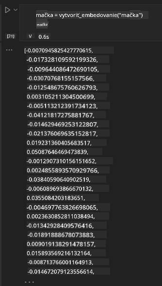

<!--
CO_OP_TRANSLATOR_METADATA:
{
  "original_hash": "e2861bbca91c0567ef32bc77fe054f9e",
  "translation_date": "2025-06-25T22:45:03+00:00",
  "source_file": "15-rag-and-vector-databases/README.md",
  "language_code": "sk"
}
-->
# Generovanie s rozšírením o vyhľadávanie (RAG) a vektorové databázy

V lekcii o vyhľadávacích aplikáciách sme sa stručne naučili, ako integrovať vlastné dáta do veľkých jazykových modelov (LLM). V tejto lekcii sa podrobnejšie pozrieme na koncepty ukotvenia vašich dát v aplikácii LLM, mechaniku procesu a metódy ukladania dát, vrátane vkladov a textu.

> **Video čoskoro dostupné**

## Úvod

V tejto lekcii sa zameriame na nasledujúce témy:

- Úvod do RAG, čo to je a prečo sa používa v AI (umelej inteligencii).

- Pochopenie, čo sú vektorové databázy a vytvorenie jednej pre našu aplikáciu.

- Praktický príklad, ako integrovať RAG do aplikácie.

## Ciele učenia

Po dokončení tejto lekcie budete schopní:

- Vysvetliť význam RAG pri vyhľadávaní a spracovaní dát.

- Nastaviť aplikáciu RAG a ukotviť vaše dáta do LLM

- Efektívna integrácia RAG a vektorových databáz v aplikáciách LLM.

## Naša situácia: obohatenie našich LLM vlastnými dátami

Pre túto lekciu chceme pridať naše vlastné poznámky do vzdelávacieho startupu, čo umožní chatbotovi získať viac informácií o rôznych predmetoch. Použitím poznámok, ktoré máme, budú študenti schopní lepšie sa učiť a chápať rôzne témy, čo uľahčí prípravu na skúšky. Na vytvorenie našej situácie použijeme:

- `Azure OpenAI:` LLM, ktorý použijeme na vytvorenie nášho chatbota

- `AI for beginners' lesson on Neural Networks`: toto budú dáta, na ktorých ukotvíme naše LLM

- `Azure AI Search` a `Azure Cosmos DB:` vektorová databáza na ukladanie našich dát a vytvorenie vyhľadávacieho indexu

Používatelia budú schopní vytvárať cvičné kvízy z ich poznámok, kartičky na opakovanie a zhrnúť ich do stručných prehľadov. Aby sme začali, pozrime sa na to, čo je RAG a ako funguje:

## Generovanie s rozšírením o vyhľadávanie (RAG)

Chatbot poháňaný LLM spracováva používateľské výzvy na generovanie odpovedí. Je navrhnutý tak, aby bol interaktívny a zapájal sa do rozhovorov s používateľmi na širokú škálu tém. Jeho odpovede sú však obmedzené na poskytnutý kontext a jeho základné tréningové dáta. Napríklad, znalosti GPT-4 sú obmedzené do septembra 2021, čo znamená, že nemá vedomosti o udalostiach, ktoré sa stali po tomto období. Okrem toho, dáta použité na trénovanie LLM nezahŕňajú dôverné informácie, ako sú osobné poznámky alebo príručka produktu spoločnosti.

### Ako fungujú RAG (Generovanie s rozšírením o vyhľadávanie)

Predpokladajme, že chcete nasadiť chatbota, ktorý vytvára kvízy z vašich poznámok, budete potrebovať pripojenie k databáze znalostí. Tu prichádza na pomoc RAG. RAG fungujú nasledovne:

- **Databáza znalostí:** Pred vyhľadávaním je potrebné tieto dokumenty spracovať a pripraviť, zvyčajne rozdelením veľkých dokumentov na menšie časti, ich transformáciou na textové vklady a uložením do databázy.

- **Používateľská otázka:** používateľ položí otázku

- **Vyhľadávanie:** Keď používateľ položí otázku, model vkladov vyhľadá relevantné informácie z našej databázy znalostí, aby poskytol viac kontextu, ktorý bude zahrnutý do výzvy.

- **Generovanie s rozšírením:** LLM vylepšuje svoju odpoveď na základe získaných dát. Umožňuje, aby bola odpoveď generovaná nielen na základe predtrénovaných dát, ale aj relevantných informácií z pridaného kontextu. Získané dáta sa používajú na rozšírenie odpovedí LLM. LLM potom vráti odpoveď na otázku používateľa.

Architektúra pre RAG je implementovaná pomocou transformátorov pozostávajúcich z dvoch častí: kódovača a dekodéra. Napríklad, keď používateľ položí otázku, vstupný text je "zakódovaný" do vektorov zachytávajúcich význam slov a vektory sú "dekódované" do nášho indexu dokumentov a generujú nový text na základe používateľskej otázky. LLM používa model kódovač-dekodér na generovanie výstupu.

Dva prístupy pri implementácii RAG podľa navrhovaného dokumentu: [Generovanie s rozšírením o vyhľadávanie pre úlohy NLP (softvér na spracovanie prirodzeného jazyka) náročné na znalosti](https://arxiv.org/pdf/2005.11401.pdf?WT.mc_id=academic-105485-koreyst) sú:

- **_RAG-Sequence_** používanie získaných dokumentov na predpovedanie najlepšej možnej odpovede na používateľskú otázku

- **RAG-Token** používanie dokumentov na generovanie ďalšieho tokenu, potom ich získanie na odpoveď na používateľskú otázku

### Prečo by ste použili RAG?

- **Bohatosť informácií:** zabezpečuje, že textové odpovede sú aktuálne a súčasné. Zvyšuje teda výkon na úlohách špecifických pre danú doménu prístupom k internej databáze znalostí.

- Znižuje fabrikačné údaje využitím **overiteľných dát** v databáze znalostí na poskytnutie kontextu k používateľským otázkam.

- Je **nákladovo efektívny**, pretože sú ekonomickejšie v porovnaní s jemným doladením LLM.

## Vytváranie databázy znalostí

Naša aplikácia je založená na našich osobných dátach, t.j. lekcii o neurónových sieťach v učebnom pláne AI pre začiatočníkov.

### Vektorové databázy

Vektorová databáza, na rozdiel od tradičných databáz, je špecializovaná databáza navrhnutá na ukladanie, správu a vyhľadávanie vložených vektorov. Ukladá číselné reprezentácie dokumentov. Rozdelenie dát na číselné vklady uľahčuje nášmu AI systému pochopiť a spracovať dáta.

Ukladáme naše vklady vo vektorových databázach, pretože LLM majú obmedzenie počtu tokenov, ktoré akceptujú ako vstup. Keďže nemôžete odovzdať celé vklady do LLM, budeme ich musieť rozdeliť na časti a keď používateľ položí otázku, vklady najviac podobné otázke budú vrátené spolu s výzvou. Rozdelenie tiež znižuje náklady na počet tokenov prechádzajúcich cez LLM.

Niektoré populárne vektorové databázy zahŕňajú Azure Cosmos DB, Clarifyai, Pinecone, Chromadb, ScaNN, Qdrant a DeepLake. Môžete vytvoriť model Azure Cosmos DB pomocou Azure CLI s nasledujúcim príkazom:

```bash
az login
az group create -n <resource-group-name> -l <location>
az cosmosdb create -n <cosmos-db-name> -r <resource-group-name>
az cosmosdb list-keys -n <cosmos-db-name> -g <resource-group-name>
```

### Od textu k vkladom

Pred uložením našich dát ich budeme musieť previesť na vektorové vklady pred uložením do databázy. Ak pracujete s veľkými dokumentmi alebo dlhými textami, môžete ich rozdeliť na základe očakávaných otázok. Rozdelenie môže byť vykonané na úrovni viet alebo odsekov. Pretože rozdelenie odvádza významy zo slov okolo nich, môžete pridať ďalší kontext k časti, napríklad pridaním názvu dokumentu alebo zahrnutím textu pred alebo po časti. Dáta môžete rozdeliť nasledovne:

```python
def split_text(text, max_length, min_length):
    words = text.split()
    chunks = []
    current_chunk = []

    for word in words:
        current_chunk.append(word)
        if len(' '.join(current_chunk)) < max_length and len(' '.join(current_chunk)) > min_length:
            chunks.append(' '.join(current_chunk))
            current_chunk = []

    # If the last chunk didn't reach the minimum length, add it anyway
    if current_chunk:
        chunks.append(' '.join(current_chunk))

    return chunks
```

Po rozdelení môžeme potom vložiť náš text pomocou rôznych modelov vkladov. Niektoré modely, ktoré môžete použiť, zahŕňajú: word2vec, ada-002 od OpenAI, Azure Computer Vision a mnoho ďalších. Výber modelu na použitie bude závisieť od jazykov, ktoré používate, typu kódovaného obsahu (text/obrázky/zvuk), veľkosti vstupu, ktorý môže kódovať, a dĺžky výstupu vkladu.

Príklad vloženého textu pomocou modelu `text-embedding-ada-002` od OpenAI je:


## Vyhľadávanie a vektorové vyhľadávanie

Keď používateľ položí otázku, vyhľadávač ju premení na vektor pomocou kódovača dotazu, potom prehľadá náš index dokumentov pre relevantné vektory v dokumente, ktoré súvisia so vstupom. Po dokončení prevedie vstupný vektor aj vektory dokumentov na text a prechádza cez LLM.

### Vyhľadávanie

Vyhľadávanie nastáva, keď sa systém snaží rýchlo nájsť dokumenty z indexu, ktoré spĺňajú kritériá vyhľadávania. Cieľom vyhľadávača je získať dokumenty, ktoré budú použité na poskytnutie kontextu a ukotvenie LLM na vašich dátach.

Existuje niekoľko spôsobov, ako vykonávať vyhľadávanie v našej databáze, ako napríklad:

- **Vyhľadávanie podľa kľúčových slov** - používa sa na textové vyhľadávanie

- **Sémantické vyhľadávanie** - používa sémantický význam slov

- **Vektorové vyhľadávanie** - prevádza dokumenty z textu na vektorové reprezentácie pomocou modelov vkladov. Vyhľadávanie bude vykonané dotazovaním dokumentov, ktorých vektorové reprezentácie sú najbližšie k otázke používateľa.

- **Hybridné** - kombinácia vyhľadávania podľa kľúčových slov a vektorového vyhľadávania.

Výzvou pri vyhľadávaní je, keď v databáze nie je podobná odpoveď na otázku, systém potom vráti najlepšie informácie, ktoré môžu získať, avšak môžete použiť taktiky ako nastavenie maximálnej vzdialenosti pre relevantnosť alebo použitie hybridného vyhľadávania, ktoré kombinuje vyhľadávanie podľa kľúčových slov a vektorové vyhľadávanie. V tejto lekcii použijeme hybridné vyhľadávanie, kombináciu vektorového a kľúčového vyhľadávania. Naše dáta uložíme do dátového rámca so stĺpcami obsahujúcimi časti aj vklady.

### Vektorová podobnosť

Vyhľadávač prehľadá databázu znalostí pre vklady, ktoré sú blízko seba, najbližšieho suseda, pretože sú to texty, ktoré sú podobné. V prípade, že používateľ položí otázku, je najprv vložená a potom spárovaná s podobnými vkladmi. Bežné meranie, ktoré sa používa na zistenie, ako sú podobné rôzne vektory, je kosínusová podobnosť, ktorá je založená na uhle medzi dvoma vektormi.

Na meranie podobnosti môžeme použiť iné alternatívy, ako je Euklidovská vzdialenosť, ktorá je priamkou medzi koncovými bodmi vektorov a skalárny súčin, ktorý meria súčet súčinov zodpovedajúcich prvkov dvoch vektorov.

### Vyhľadávací index

Pri vykonávaní vyhľadávania budeme musieť vytvoriť vyhľadávací index pre našu databázu znalostí pred vykonaním vyhľadávania. Index bude ukladať naše vklady a môže rýchlo získať najpodobnejšie časti aj vo veľkej databáze. Môžeme vytvoriť náš index lokálne pomocou:

```python
from sklearn.neighbors import NearestNeighbors

embeddings = flattened_df['embeddings'].to_list()

# Create the search index
nbrs = NearestNeighbors(n_neighbors=5, algorithm='ball_tree').fit(embeddings)

# To query the index, you can use the kneighbors method
distances, indices = nbrs.kneighbors(embeddings)
```

### Znovu hodnotenie

Keď dotazujete databázu, možno budete potrebovať zoradiť výsledky od najrelevantnejších. LLM na znovu hodnotenie využíva strojové učenie na zlepšenie relevantnosti výsledkov vyhľadávania ich zoradením od najrelevantnejších. Pomocou Azure AI Search je znovu hodnotenie automaticky vykonávané pomocou sémantického znovu hodnotiteľa. Príklad, ako znovu hodnotenie funguje pomocou najbližších susedov:

```python
# Find the most similar documents
distances, indices = nbrs.kneighbors([query_vector])

index = []
# Print the most similar documents
for i in range(3):
    index = indices[0][i]
    for index in indices[0]:
        print(flattened_df['chunks'].iloc[index])
        print(flattened_df['path'].iloc[index])
        print(flattened_df['distances'].iloc[index])
    else:
        print(f"Index {index} not found in DataFrame")
```

## Spojenie všetkého dohromady

Posledným krokom je pridanie nášho LLM do mixu, aby sme mohli získať odpovede, ktoré sú ukotvené na našich dátach. Môžeme to implementovať nasledovne:

```python
user_input = "what is a perceptron?"

def chatbot(user_input):
    # Convert the question to a query vector
    query_vector = create_embeddings(user_input)

    # Find the most similar documents
    distances, indices = nbrs.kneighbors([query_vector])

    # add documents to query  to provide context
    history = []
    for index in indices[0]:
        history.append(flattened_df['chunks'].iloc[index])

    # combine the history and the user input
    history.append(user_input)

    # create a message object
    messages=[
        {"role": "system", "content": "You are an AI assistant that helps with AI questions."},
        {"role": "user", "content": history[-1]}
    ]

    # use chat completion to generate a response
    response = openai.chat.completions.create(
        model="gpt-4",
        temperature=0.7,
        max_tokens=800,
        messages=messages
    )

    return response.choices[0].message

chatbot(user_input)
```

## Hodnotenie našej aplikácie

### Metódy hodnotenia

- Kvalita poskytnutých odpovedí zabezpečením, že znie prirodzene, plynule a ľudsky

- Ukotvenosť dát: hodnotenie, či odpoveď pochádza z dodaných dokumentov

- Relevantnosť: hodnotenie, či odpoveď zodpovedá a súvisí s položenou otázkou

- Plynulosť - či odpoveď dáva zmysel gramaticky

## Prípady použitia pre používanie RAG (Generovanie s rozšírením o vyhľadávanie) a vektorových databáz

Existuje mnoho rôznych prípadov použitia, kde funkčné volania môžu zlepšiť vašu aplikáciu, ako napríklad:

- Otázky a odpovede: ukotvenie firemných dát k chatu, ktorý môžu používať zamestnanci na kladenie otázok.

- Odporúčacie systémy: kde môžete vytvoriť systém, ktorý spája najpodobnejšie hodnoty, napr. filmy, reštaurácie a mnoho ďalších.

- Služby chatbotov: môžete ukladať históriu chatu a personalizovať konverzáciu na základe údajov používateľa.

- Vyhľadávanie obrázkov na základe vektorových vkladov, užitočné pri rozpoznávaní obrázkov a detekcii anomálií.

## Zhrnutie

Prešli sme základné oblasti RAG od pridania našich dát do aplikácie, používateľského dotazu a výstupu. Na zjednodušenie vytvorenia RAG môžete použiť rámce ako Semanti Kernel, Langchain alebo Autogen.

## Zadanie

Aby ste pokračovali vo svojom učení o Generovaní s rozšírením o vyhľadávanie (RAG), môžete vytvoriť:

- Vytvorte front-end pre aplikáciu pomocou rámca podľa vášho výberu

- Využite rámec, buď LangChain alebo Semantic Kernel, a znovu vytvorte svoju aplikáciu.

Gratulujeme k dokončeniu lekcie 👏.

## Učenie sa tu nekončí, pokračujte v ceste

Po dokončení tejto lekcie si pozrite našu [kolekciu učenia o Generatívnej AI](https://aka.ms/genai-collection?WT.mc_id=academic-105485-koreyst) a pokračujte v zvyšovaní svojich znalostí o Generatívnej AI!

**Upozornenie**:  
Tento dokument bol preložený pomocou AI prekladateľskej služby [Co-op Translator](https://github.com/Azure/co-op-translator). Aj keď sa snažíme o presnosť, uvedomte si, že automatizované preklady môžu obsahovať chyby alebo nepresnosti. Pôvodný dokument v jeho rodnom jazyku by sa mal považovať za autoritatívny zdroj. Pre kritické informácie sa odporúča profesionálny ľudský preklad. Nie sme zodpovední za žiadne nedorozumenia alebo nesprávne interpretácie vyplývajúce z použitia tohto prekladu.