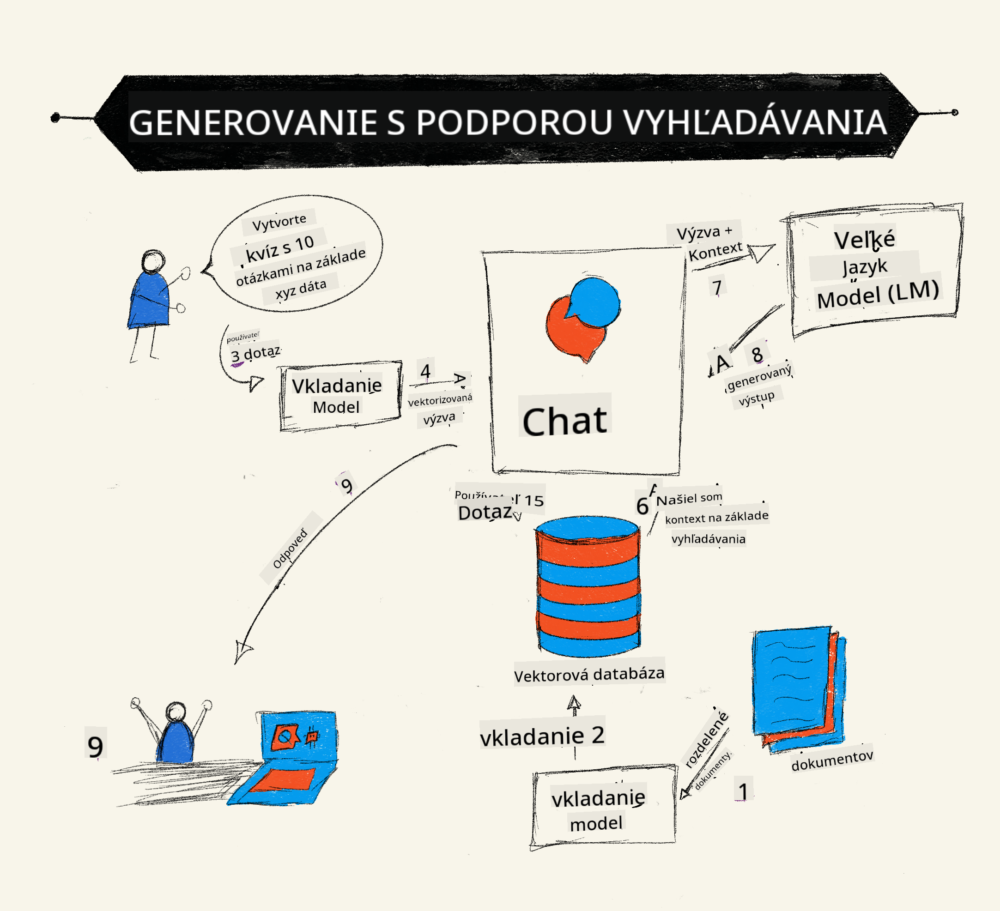
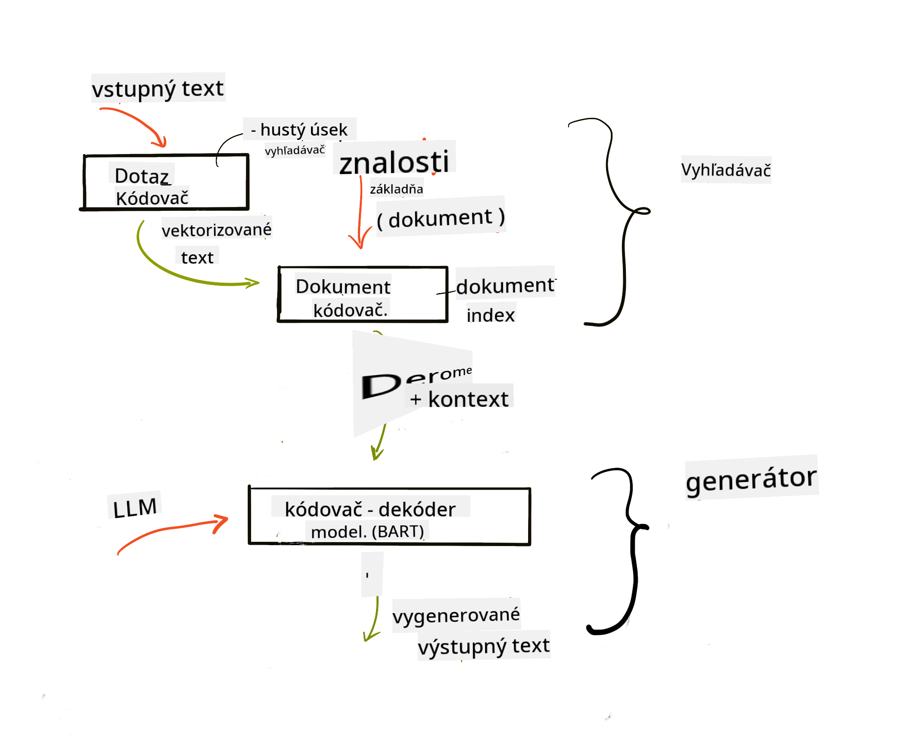

<!--
CO_OP_TRANSLATOR_METADATA:
{
  "original_hash": "b4b0266fbadbba7ded891b6485adc66d",
  "translation_date": "2025-10-17T21:56:15+00:00",
  "source_file": "15-rag-and-vector-databases/README.md",
  "language_code": "sk"
}
-->
# Generovanie s roz코칤ren칳m vyh쬬d치van칤m (RAG) a vektorov칠 datab치zy

[](https://youtu.be/4l8zhHUBeyI?si=BmvDmL1fnHtgQYkL)

V lekcii o vyh쬬d치vac칤ch aplik치ci치ch sme sa stru캜ne nau캜ili, ako integrova콘 vlastn칠 칰daje do ve쬶칳ch jazykov칳ch modelov (LLM). V tejto lekcii sa budeme podrobnej코ie zaobera콘 konceptmi zakotvenia va코ich 칰dajov vo va코ej aplik치cii LLM, mechanizmami procesu a met칩dami ukladania 칰dajov, vr치tane vektorov칳ch reprezent치ci칤 a textu.

> **Video 캜oskoro dostupn칠**

## 칔vod

V tejto lekcii sa budeme venova콘 nasleduj칰cim t칠mam:

- 칔vod do RAG, 캜o to je a pre캜o sa pou쮂셨a v AI (umelej inteligencii).

- Pochopenie, 캜o s칰 vektorov칠 datab치zy, a ich vytvorenie pre na코u aplik치ciu.

- Praktick칳 pr칤klad, ako integrova콘 RAG do aplik치cie.

## Ciele u캜enia

Po dokon캜en칤 tejto lekcie budete schopn칤:

- Vysvetli콘 v칳znam RAG pri vyh쬬d치van칤 a spracovan칤 칰dajov.

- Nastavi콘 aplik치ciu RAG a zakotvi콘 va코e 칰daje do LLM.

- Efekt칤vne integrova콘 RAG a vektorov칠 datab치zy do aplik치ci칤 LLM.

## N치코 scen치r: vylep코enie na코ich LLM vlastn칳mi 칰dajmi

V tejto lekcii chceme prida콘 na코e vlastn칠 pozn치mky do startupu zameran칠ho na vzdel치vanie, 캜o umo쬹칤 chatbotovi z칤ska콘 viac inform치ci칤 o r칪znych t칠mach. Pou쬴t칤m na코ich pozn치mok bud칰 m칪c콘 코tudenti lep코ie 코tudova콘 a pochopi콘 r칪zne t칠my, 캜o im u쬬h캜칤 pr칤pravu na sk칰코ky. Na vytvorenie n치코ho scen치ra pou쬴jeme:

- `Azure OpenAI:` LLM, ktor칳 pou쬴jeme na vytvorenie n치코ho chatbota.

- `Lekcia pre za캜iato캜n칤kov v AI o neur칩nov칳ch sie콘ach:` to bud칰 칰daje, na ktor칳ch zakotv칤me n치코 LLM.

- `Azure AI Search` a `Azure Cosmos DB:` vektorov치 datab치za na ukladanie na코ich 칰dajov a vytvorenie indexu vyh쬬d치vania.

Pou쮂셨atelia bud칰 m칪c콘 vytv치ra콘 cvi캜n칠 kv칤zy zo svojich pozn치mok, karti캜ky na opakovanie a zhrnutia do stru캜n칳ch preh쬬dov. Aby sme mohli za캜a콘, pozrime sa, 캜o je RAG a ako funguje:

## Generovanie s roz코칤ren칳m vyh쬬d치van칤m (RAG)

Chatbot poh치켿an칳 LLM spracov치va pou쮂셨ate쬽k칠 podnety na generovanie odpoved칤. Je navrhnut칳 tak, aby bol interakt칤vny a komunikoval s pou쮂셨ate쬸i na 코irokej 코k치le t칠m. Jeho odpovede s칰 v코ak obmedzen칠 na poskytnut칳 kontext a jeho z치kladn칠 tr칠ningov칠 칰daje. Napr칤klad, GPT-4 m치 hranicu znalost칤 k septembru 2021, 캜o znamen치, 쬰 nem치 inform치cie o udalostiach, ktor칠 sa stali po tomto obdob칤. Okrem toho 칰daje pou쬴t칠 na tr칠ning LLM nezah콋켿aj칰 d칪vern칠 inform치cie, ako s칰 osobn칠 pozn치mky alebo manu치l produktov spolo캜nosti.

### Ako funguje RAG (Generovanie s roz코칤ren칳m vyh쬬d치van칤m)



Predstavte si, 쬰 chcete nasadi콘 chatbota, ktor칳 vytv치ra kv칤zy z va코ich pozn치mok, budete potrebova콘 spojenie s datab치zou znalost칤. Tu prich치dza na pomoc RAG. RAG funguje nasledovne:

- **Datab치za znalost칤:** Pred vyh쬬d치van칤m je potrebn칠 tieto dokumenty spracova콘, zvy캜ajne rozdelen칤m ve쬶칳ch dokumentov na men코ie 캜asti, ich transform치ciou na vektorov칠 reprezent치cie a ulo쬰n칤m do datab치zy.

- **Dotaz pou쮂셨ate쬬:** Pou쮂셨ate polo쮂 ot치zku.

- **Vyh쬬d치vanie:** Ke캞 pou쮂셨ate polo쮂 ot치zku, model vektorovej reprezent치cie vyh쬬d치 relevantn칠 inform치cie v na코ej datab치ze znalost칤, aby poskytol viac kontextu, ktor칳 bude zahrnut칳 do podnetu.

- **Roz코칤ren칠 generovanie:** LLM vylep코칤 svoju odpove캞 na z치klade z칤skan칳ch 칰dajov. To umo쮄갓je, aby generovan치 odpove캞 nebola zalo쬰n치 len na predtr칠novan칳ch 칰dajoch, ale aj na relevantn칳ch inform치ci치ch z pridan칠ho kontextu. Z칤skan칠 칰daje sa pou쬴j칰 na roz코칤renie odpoved칤 LLM. LLM potom vr치ti odpove캞 na ot치zku pou쮂셨ate쬬.



Architekt칰ra RAG je implementovan치 pomocou transform치torov, ktor칠 pozost치vaj칰 z dvoch 캜ast칤: kod칠ra a dekod칠ra. Napr칤klad, ke캞 pou쮂셨ate polo쮂 ot치zku, vstupn칳 text sa 'zak칩duje' do vektorov, ktor칠 zachyt치vaj칰 v칳znam slov, a vektory sa 'dek칩duj칰' do indexu dokumentov a generuj칰 nov칳 text na z치klade pou쮂셨ate쬽k칠ho dotazu. LLM pou쮂셨a model kod칠r-dekod칠r na generovanie v칳stupu.

Dva pr칤stupy pri implement치cii RAG pod쬬 navrhovan칠ho 캜l치nku: [Generovanie s roz코칤ren칳m vyh쬬d치van칤m pre NLP 칰lohy n치ro캜n칠 na znalosti](https://arxiv.org/pdf/2005.11401.pdf?WT.mc_id=academic-105485-koreyst) s칰:

- **_RAG-Sequence_** pou쮂셨a z칤skan칠 dokumenty na predpovedanie najlep코ej mo쬹ej odpovede na pou쮂셨ate쬽k칳 dotaz.

- **RAG-Token** pou쮂셨a dokumenty na generovanie 캞al코ieho tokenu, potom ich z칤skava na odpove캞 na pou쮂셨ate쬽k칳 dotaz.

### Pre캜o pou쮂셨a콘 RAG?

- **Bohatstvo inform치ci칤:** zabezpe캜uje, 쬰 textov칠 odpovede s칰 aktu치lne a aktu치lne. Zlep코uje v칳kon pri 칰loh치ch 코pecifick칳ch pre dan칰 oblas콘 pr칤stupom k internej datab치ze znalost칤.

- Zni쬿je vym칳코쬬nie vyu쬴t칤m **overite쬹칳ch 칰dajov** v datab치ze znalost칤 na poskytnutie kontextu k pou쮂셨ate쬽k칳m dotazom.

- Je **n치kladovo efekt칤vny**, preto쬰 je ekonomickej코칤 v porovnan칤 s jemn칳m doladen칤m LLM.

## Vytvorenie datab치zy znalost칤

Na코a aplik치cia je zalo쬰n치 na na코ich osobn칳ch 칰dajoch, t.j. lekcii o neur칩nov칳ch sie콘ach z kurikula AI pre za캜iato캜n칤kov.

### Vektorov칠 datab치zy

Vektorov치 datab치za, na rozdiel od tradi캜n칳ch datab치z, je 코pecializovan치 datab치za navrhnut치 na ukladanie, spr치vu a vyh쬬d치vanie vektorov칳ch reprezent치ci칤. Uklad치 캜칤seln칠 reprezent치cie dokumentov. Rozdelenie 칰dajov na 캜칤seln칠 vektorov칠 reprezent치cie u쬬h캜uje n치코mu AI syst칠mu pochopenie a spracovanie 칰dajov.

Uklad치me na코e vektorov칠 reprezent치cie do vektorov칳ch datab치z, preto쬰 LLM maj칰 limit na po캜et tokenov, ktor칠 akceptuj칰 ako vstup. Ke캞쬰 nem칪쬰te posla콘 cel칠 vektorov칠 reprezent치cie do LLM, budeme ich musie콘 rozdeli콘 na 캜asti a ke캞 pou쮂셨ate polo쮂 ot치zku, vektorov칠 reprezent치cie najviac podobn칠 ot치zke bud칰 vr치ten칠 spolu s podnetom. Rozdelenie na 캜asti tie zni쬿je n치klady na po캜et tokenov prech치dzaj칰cich cez LLM.

Niektor칠 popul치rne vektorov칠 datab치zy zah콋켿aj칰 Azure Cosmos DB, Clarifyai, Pinecone, Chromadb, ScaNN, Qdrant a DeepLake. M칪쬰te vytvori콘 model Azure Cosmos DB pomocou Azure CLI s nasleduj칰cim pr칤kazom:

```bash
az login
az group create -n <resource-group-name> -l <location>
az cosmosdb create -n <cosmos-db-name> -r <resource-group-name>
az cosmosdb list-keys -n <cosmos-db-name> -g <resource-group-name>
```

### Od textu k vektorov칳m reprezent치ci치m

Predt칳m, ne ulo쮂셠e na코e 칰daje, budeme ich musie콘 konvertova콘 na vektorov칠 reprezent치cie pred ich ulo쬰n칤m do datab치zy. Ak pracujete s ve쬶칳mi dokumentmi alebo dlh칳mi textami, m칪쬰te ich rozdeli콘 na z치klade o캜ak치van칳ch dotazov. Rozdelenie na 캜asti m칪쬰 by콘 na 칰rovni vety alebo odseku. Ke캞쬰 rozdelenie na 캜asti odvodzuje v칳znamy zo slov okolo nich, m칪쬰te prida콘 nejak칳 캞al코칤 kontext k 캜asti, napr칤klad pridan칤m n치zvu dokumentu alebo zahrnut칤m nejak칠ho textu pred alebo po 캜asti. 칔daje m칪쬰te rozdeli콘 na 캜asti nasledovne:

```python
def split_text(text, max_length, min_length):
    words = text.split()
    chunks = []
    current_chunk = []

    for word in words:
        current_chunk.append(word)
        if len(' '.join(current_chunk)) < max_length and len(' '.join(current_chunk)) > min_length:
            chunks.append(' '.join(current_chunk))
            current_chunk = []

    # If the last chunk didn't reach the minimum length, add it anyway
    if current_chunk:
        chunks.append(' '.join(current_chunk))

    return chunks
```

Ke캞 s칰 rozdelen칠 na 캜asti, m칪쬰me potom text zak칩dova콘 pomocou r칪znych modelov vektorov칳ch reprezent치ci칤. Niektor칠 modely, ktor칠 m칪쬰te pou쬴콘, zah콋켿aj칰: word2vec, ada-002 od OpenAI, Azure Computer Vision a mnoho 캞al코칤ch. V칳ber modelu z치vis칤 od jazykov, ktor칠 pou쮂셨ate, typu obsahu, ktor칳 k칩dujete (text/obr치zky/audio), ve쬶osti vstupu, ktor칳 m칪쬰 k칩dova콘, a d컄쬶y v칳stupu vektorovej reprezent치cie.

Pr칤klad zak칩dovan칠ho textu pomocou modelu OpenAI `text-embedding-ada-002` je:


## Vyh쬬d치vanie a vektorov칠 vyh쬬d치vanie

Ke캞 pou쮂셨ate polo쮂 ot치zku, vyh쬬d치va캜 ju transformuje na vektor pomocou kod칠ra dotazov, potom preh쬬d치va n치코 index dokumentov pre relevantn칠 vektory v dokumente, ktor칠 s칰visia s vstupom. Ke캞 je hotovo, konvertuje vstupn칳 vektor aj vektory dokumentov na text a posiela ich cez LLM.

### Vyh쬬d치vanie

Vyh쬬d치vanie nast치va, ke캞 sa syst칠m sna쮂 r칳chlo n치js콘 dokumenty z indexu, ktor칠 sp컄켿aj칰 krit칠ri치 vyh쬬d치vania. Cie쬺m vyh쬬d치va캜a je z칤ska콘 dokumenty, ktor칠 bud칰 pou쬴t칠 na poskytnutie kontextu a zakotvenie LLM na va코ich 칰dajoch.

Existuje nieko쬶o sp칪sobov, ako vykona콘 vyh쬬d치vanie v na코ej datab치ze, ako napr칤klad:

- **Vyh쬬d치vanie pod쬬 k쮂줷꼂v칳ch slov** - pou쮂셨a sa na textov칠 vyh쬬d치vanie.

- **S칠mantick칠 vyh쬬d치vanie** - pou쮂셨a s칠mantick칳 v칳znam slov.

- **Vektorov칠 vyh쬬d치vanie** - konvertuje dokumenty z textu na vektorov칠 reprezent치cie pomocou modelov vektorov칳ch reprezent치ci칤. Vyh쬬d치vanie sa vykon치va dotazovan칤m dokumentov, ktor칳ch vektorov칠 reprezent치cie s칰 najbli쮄멸e k ot치zke pou쮂셨ate쬬.

- **Hybridn칠 vyh쬬d치vanie** - kombin치cia vyh쬬d치vania pod쬬 k쮂줷꼂v칳ch slov a vektorov칠ho vyh쬬d치vania.

V칳zvou pri vyh쬬d치van칤 je, ke캞 v datab치ze nie je 쬴adna podobn치 odpove캞 na dotaz, syst칠m potom vr치ti najlep코ie inform치cie, ktor칠 m칪쬰 z칤ska콘. M칪쬰te v코ak pou쬴콘 taktiky ako nastavenie maxim치lnej vzdialenosti pre relevantnos콘 alebo pou쬴tie hybridn칠ho vyh쬬d치vania, ktor칠 kombinuje vyh쬬d치vanie pod쬬 k쮂줷꼂v칳ch slov a vektorov칠 vyh쬬d치vanie. V tejto lekcii pou쬴jeme hybridn칠 vyh쬬d치vanie, kombin치ciu vektorov칠ho a vyh쬬d치vania pod쬬 k쮂줷꼂v칳ch slov. Na코e 칰daje ulo쮂셠e do d치tov칠ho r치mca so st컄pcami obsahuj칰cimi 캜asti a vektorov칠 reprezent치cie.

### Vektorov치 podobnos콘

Vyh쬬d치va캜 preh쬬d치va datab치zu znalost칤 pre vektorov칠 reprezent치cie, ktor칠 s칰 bl칤zko seba, najbli쮄멸e susedn칠, preto쬰 s칰 to texty, ktor칠 s칰 podobn칠. V pr칤pade, 쬰 pou쮂셨ate polo쮂 dotaz, najprv sa zak칩duje a potom sa porovn치 s podobn칳mi vektorov칳mi reprezent치ciami. Be쬹칠 meranie, ktor칠 sa pou쮂셨a na zistenie, ako s칰 si r칪zne vektory podobn칠, je kos칤nov치 podobnos콘, ktor치 je zalo쬰n치 na uhle medzi dvoma vektormi.

Na meranie podobnosti m칪쬰me pou쬴콘 aj alternat칤vy ako euklidovsk칰 vzdialenos콘, ktor치 je priamou 캜iarou medzi koncov칳mi bodmi vektorov, a skal치rny s칰캜in, ktor칳 meria s칰캜et s칰캜inov zodpovedaj칰cich prvkov dvoch vektorov.

### Index vyh쬬d치vania

Pri vyh쬬d치van칤 budeme potrebova콘 vytvori콘 index vyh쬬d치vania pre na코u datab치zu znalost칤 pred vykonan칤m vyh쬬d치vania. Index bude uklada콘 na코e vektorov칠 reprezent치cie a m칪쬰 r칳chlo vyh쬬da콘 najpodobnej코ie 캜asti aj vo ve쬶ej datab치ze. Index m칪쬰me vytvori콘 lok치lne pomocou:

```python
from sklearn.neighbors import NearestNeighbors

embeddings = flattened_df['embeddings'].to_list()

# Create the search index
nbrs = NearestNeighbors(n_neighbors=5, algorithm='ball_tree').fit(embeddings)

# To query the index, you can use the kneighbors method
distances, indices = nbrs.kneighbors(embeddings)
```

### Preusporiadanie

Ke캞 dotazujete datab치zu, mo쬹o budete potrebova콘 zoradi콘 v칳sledky od najrelevantnej코칤ch. LLM na preusporiadanie vyu쮂셨a strojov칠 u캜enie na zlep코enie relevantnosti v칳sledkov vyh쬬d치vania ich usporiadan칤m od najrelevantnej코칤ch. Pou쬴t칤m Azure AI Search sa preusporiadanie vykon치va automaticky pomocou s칠mantick칠ho preusporiadania. Pr칤klad, ako funguje preusporiadanie pomocou najbli쮄뫆셖h susedov:

```python
# Find the most similar documents
distances, indices = nbrs.kneighbors([query_vector])

index = []
# Print the most similar documents
for i in range(3):
    index = indices[0][i]
    for index in indices[0]:
        print(flattened_df['chunks'].iloc[index])
        print(flattened_df['path'].iloc[index])
        print(flattened_df['distances'].iloc[index])
    else:
        print(f"Index {index} not found in DataFrame")
```

## Spojenie v코etk칠ho dohromady

Posledn칳m krokom je pridanie n치코ho LLM do mixu, aby sme mohli z칤ska콘 odpovede, ktor칠 s칰 zakotven칠 na na코ich 칰dajoch. M칪쬰me to implementova콘 nasledovne:

```python
user_input = "what is a perceptron?"

def chatbot(user_input):
    # Convert the question to a query vector
    query_vector = create_embeddings(user_input)

    # Find the most similar documents
    distances, indices = nbrs.kneighbors([query_vector])

    # add documents to query  to provide context
    history = []
    for index in indices[0]:
        history.append(flattened_df['chunks'].iloc[index])

    # combine the history and the user input
    history.append(user_input)

    # create a message object
    messages=[
        {"role": "system", "content": "You are an AI assistant that helps with AI questions."},
        {"role": "user", "content": history[-1]}
    ]

    # use chat completion to generate a response
    response = openai.chat.completions.create(
        model="gpt-4",
        temperature=0.7,
        max_tokens=800,
        messages=messages
    )

    return response.choices[0].message

chatbot(user_input)
```

## Hodnotenie na코ej aplik치cie

### Met칩dy hodnotenia

- Kvalita poskytnut칳ch odpoved칤, zabezpe캜enie, 쬰 znej칰 prirodzene, plynulo a 쬿dsky.

- Zakotvenie 칰dajov: hodnotenie, 캜i odpove캞 poch치dza z poskytnut칳ch dokumentov.

- Relevantnos콘: hodnotenie, 캜i odpove캞 zodpoved치 a s칰vis칤 s polo쬰nou ot치zkou.

- Plynulos콘 - 캜i odpove캞 d치va zmysel gramaticky.

## Pr칤klady pou쬴tia RAG (Generovanie s roz코칤ren칳m vyh쬬d치van칤m) a vektorov칳ch datab치z

Existuje mnoho r칪znych pr칤kladov pou쬴tia, kde funk캜n칠 volania m칪쬿 zlep코i콘 va코u aplik치ciu, ako napr칤klad:

- Ot치zky a odpovede: zakotvenie 칰dajov va코ej spolo캜nosti do chatu, ktor칳 m칪쬿 zamestnanci pou쮂셨a콘 na kladenie ot치zok.

- Syst칠my odpor칰캜an칤: kde m칪쬰te vytvori콘 syst칠m, ktor칳 zodpoved치 najpodobnej코칤m hodnot치m, napr. filmy, re코taur치cie a mnoho 캞al코칤ch.

- Slu쬭y chatbotov: m칪쬰te uklada콘 hist칩riu chatu a personalizova콘 konverz치ciu na z치klade 칰dajov pou쮂셨ate쬬.

- Vyh쬬d치vanie obr치zkov na z치klade vektorov칳ch reprezent치ci칤, u쬴to캜n칠 pri rozpozn치van칤 obr치zkov a detekcii anom치li칤.

## Zhrnutie

Pokryli sme z치kladn칠 oblasti RAG od pridania na코ich 칰dajov do aplik치cie, pou쮂셨ate쬽k칠ho dotazu a po v칳stup. Na zjednodu코enie vytv치rania RAG m칪쬰te pou쬴콘 r치mce ako Semantic Kernel, Langchain alebo Autogen.

## Zadanie

Na pokra캜ovanie vo va코om u캜en칤 o Generovan칤 s roz코칤ren칳m vyh쬬d치van칤m (RAG) m칪쬰te:

- Vytvori콘 front-end pre aplik치ciu pomocou r치mca pod쬬 v치코ho v칳beru.

- Vyu쬴콘 r치mec, bu캞 LangChain alebo Semantic Kernel, a znovu vytvori콘 va코u aplik치ciu.

Gratulujeme k dokon캜eniu lekcie 游녪.

## U캜enie sa tu nekon캜칤, pokra캜ujte v ceste

Po dokon캜en칤 tejto lekcie si pozrite na코u [kolekciu u캜enia o generat칤vnej AI](https://aka.ms/genai-collection?WT.mc_id=academic-105485-koreyst), aby ste pokra캜ovali v zlep코ovan칤 svojich znalost칤 o generat칤vnej AI!

---

**Zrieknutie sa zodpovednosti**:  
Tento dokument bol prelo쬰n칳 pomocou slu쬭y AI prekladu [Co-op Translator](https://github.com/Azure/co-op-translator). Hoci sa sna쮂셠e o presnos콘, pros칤m, berte na vedomie, 쬰 automatizovan칠 preklady m칪쬿 obsahova콘 chyby alebo nepresnosti. P칪vodn칳 dokument v jeho rodnom jazyku by mal by콘 pova쬺van칳 za autoritat칤vny zdroj. Pre kritick칠 inform치cie sa odpor칰캜a profesion치lny 쬿dsk칳 preklad. Nenesieme zodpovednos콘 za ak칠ko쭀ek nedorozumenia alebo nespr치vne interpret치cie vypl칳vaj칰ce z pou쬴tia tohto prekladu.