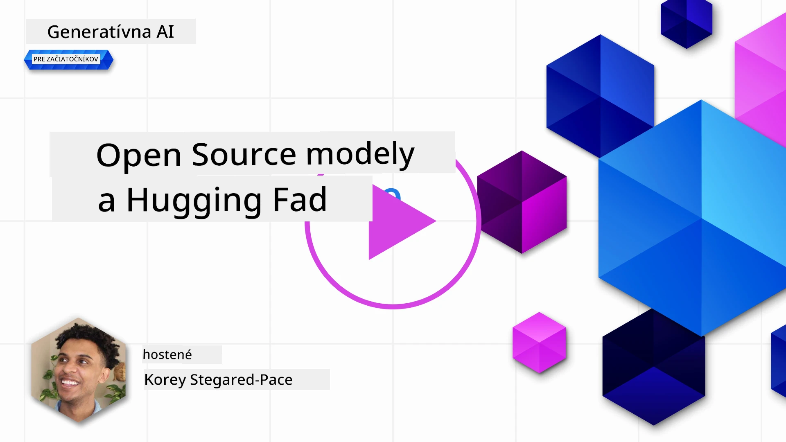
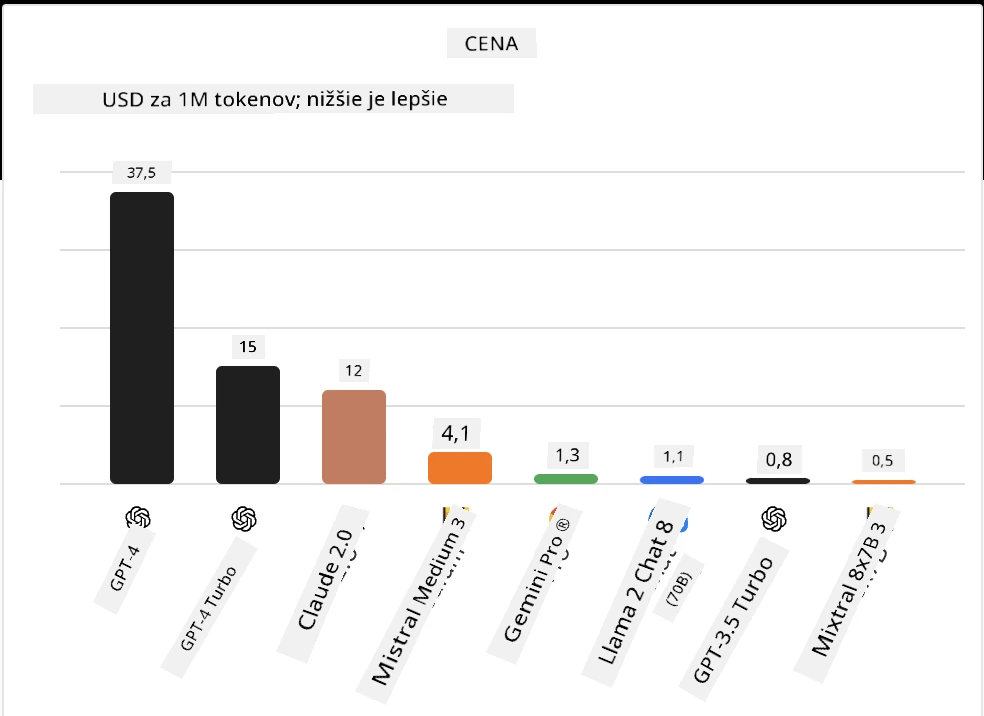
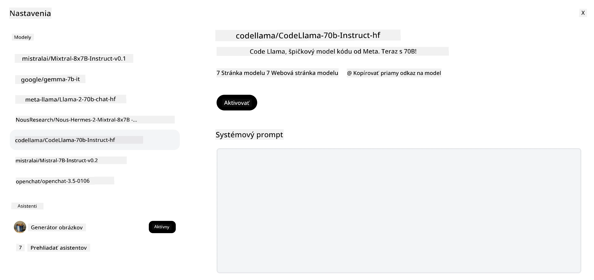
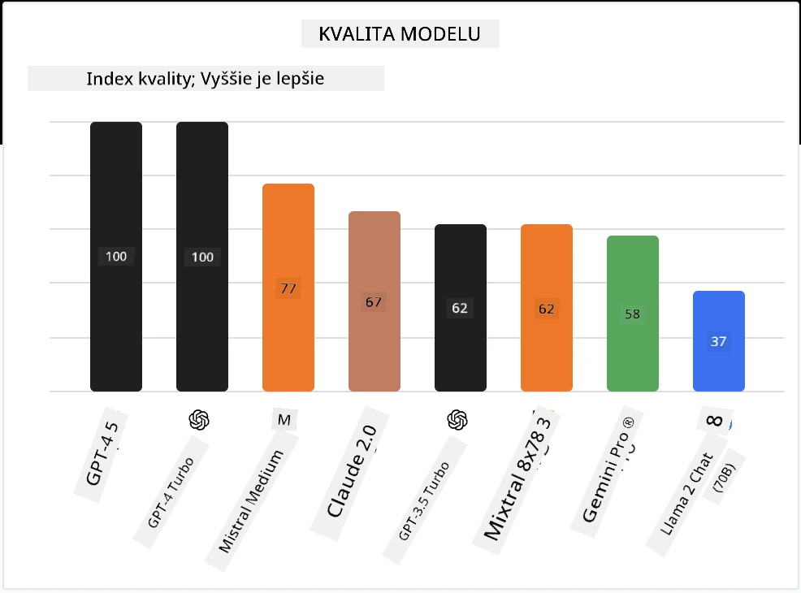

## Úvod

Svet open-source LLM je vzrušujúci a neustále sa vyvíja. Táto lekcia si kladie za cieľ poskytnúť podrobný pohľad na open source modely. Ak hľadáte informácie o tom, ako sa proprietárne modely porovnávajú s open source modelmi, prejdite na lekciu ["Preskúmanie a porovnanie rôznych LLM"](../02-exploring-and-comparing-different-llms/README.md?WT.mc_id=academic-105485-koreyst). Táto lekcia sa tiež bude venovať téme doladenia, ale podrobnejšie vysvetlenie nájdete v lekcii ["Doladenie LLM"](../18-fine-tuning/README.md?WT.mc_id=academic-105485-koreyst).

## Ciele učenia

- Získať pochopenie open source modelov
- Pochopenie výhod práce s open source modelmi
- Preskúmať dostupné open modely na Hugging Face a v Azure AI Studio

## Čo sú Open Source Modely?

Open source softvér zohral kľúčovú úlohu v raste technológií v rôznych oblastiach. Iniciatíva Open Source (OSI) definovala [10 kritérií pre softvér](https://web.archive.org/web/20241126001143/https://opensource.org/osd?WT.mc_id=academic-105485-koreyst), aby bol klasifikovaný ako open source. Zdrojový kód musí byť otvorene zdieľaný pod licenciou schválenou OSI.

Vývoj LLM má podobné prvky ako vývoj softvéru, ale proces nie je úplne rovnaký. To vyvolalo veľa diskusií v komunite o definícii open source v kontexte LLM. Aby model zodpovedal tradičnej definícii open source, mali by byť verejne dostupné nasledujúce informácie:

- Dátové sady použité na trénovanie modelu.
- Kompletné váhy modelu ako súčasť tréningu.
- Kód na vyhodnotenie.
- Kód na doladenie.
- Kompletné váhy modelu a metriky tréningu.

V súčasnosti existuje len niekoľko modelov, ktoré spĺňajú tieto kritériá. [OLMo model vytvorený Allen Institute for Artificial Intelligence (AllenAI)](https://huggingface.co/allenai/OLMo-7B?WT.mc_id=academic-105485-koreyst) je jedným z nich.

Pre túto lekciu budeme modely ďalej označovať ako "open modely", pretože v čase písania nemusia spĺňať vyššie uvedené kritériá.

## Výhody Open Modelov

**Vysoká prispôsobiteľnosť** – Keďže open modely sú zverejnené s podrobnými informáciami o tréningu, výskumníci a vývojári môžu upravovať vnútorné časti modelu. To umožňuje vytváranie vysoko špecializovaných modelov, ktoré sú doladené pre konkrétnu úlohu alebo oblasť štúdia. Príklady zahŕňajú generovanie kódu, matematické operácie a biológiu.

**Cena** – Cena za token pri používaní a nasadzovaní týchto modelov je nižšia ako u proprietárnych modelov. Pri budovaní aplikácií Generatívnej AI by ste mali zvážiť pomer výkon/cena pri práci s týmito modelmi pre váš prípad použitia.

Zdroj: Artificial Analysis

**Flexibilita** – Práca s open modelmi vám umožňuje byť flexibilný v používaní rôznych modelov alebo ich kombinovaní. Príkladom sú [HuggingChat asistenti](https://huggingface.co/chat?WT.mc_id=academic-105485-koreyst), kde si používateľ môže priamo v používateľskom rozhraní vybrať model, ktorý sa používa:

## Preskúmanie rôznych Open Modelov

### Llama 2

[LLama2](https://huggingface.co/meta-llama?WT.mc_id=academic-105485-koreyst), vyvinutý spoločnosťou Meta, je open model optimalizovaný pre chatové aplikácie. Je to vďaka jeho metóde doladenia, ktorá zahŕňala veľké množstvo dialógov a spätnú väzbu od ľudí. Touto metódou model produkuje výsledky viac zladené s očakávaniami ľudí, čo poskytuje lepší používateľský zážitok.

Príklady doladených verzií Llama zahŕňajú [Japanese Llama](https://huggingface.co/elyza/ELYZA-japanese-Llama-2-7b?WT.mc_id=academic-105485-koreyst), ktorý sa špecializuje na japončinu, a [Llama Pro](https://huggingface.co/TencentARC/LLaMA-Pro-8B?WT.mc_id=academic-105485-koreyst), čo je vylepšená verzia základného modelu.

### Mistral

[Mistral](https://huggingface.co/mistralai?WT.mc_id=academic-105485-koreyst) je open model so silným zameraním na vysoký výkon a efektivitu. Používa prístup Mixture-of-Experts, ktorý kombinuje skupinu špecializovaných expertných modelov do jedného systému, kde podľa vstupu sú vybrané určité modely na použitie. To robí výpočty efektívnejšími, pretože modely riešia len tie vstupy, na ktoré sú špecializované.

Príklady doladených verzií Mistral zahŕňajú [BioMistral](https://huggingface.co/BioMistral/BioMistral-7B?text=Mon+nom+est+Thomas+et+mon+principal?WT.mc_id=academic-105485-koreyst), ktorý sa zameriava na medicínsku oblasť, a [OpenMath Mistral](https://huggingface.co/nvidia/OpenMath-Mistral-7B-v0.1-hf?WT.mc_id=academic-105485-koreyst), ktorý vykonáva matematické výpočty.

### Falcon

[Falcon](https://huggingface.co/tiiuae?WT.mc_id=academic-105485-koreyst) je LLM vytvorený Technologickým inovačným inštitútom (**TII**). Falcon-40B bol trénovaný na 40 miliardách parametrov a preukázal lepší výkon ako GPT-3 pri nižšom výpočtovom rozpočte. Je to vďaka použitiu algoritmu FlashAttention a multiquery attention, ktoré umožňujú znížiť požiadavky na pamäť počas inferencie. Vďaka zníženému času inferencie je Falcon-40B vhodný pre chatové aplikácie.

Príklady doladených verzií Falcon sú [OpenAssistant](https://huggingface.co/OpenAssistant/falcon-40b-sft-top1-560?WT.mc_id=academic-105485-koreyst), asistent postavený na open modeloch, a [GPT4ALL](https://huggingface.co/nomic-ai/gpt4all-falcon?WT.mc_id=academic-105485-koreyst), ktorý poskytuje vyšší výkon ako základný model.

## Ako si vybrať

Neexistuje jednoznačná odpoveď na výber open modelu. Dobré miesto na začiatok je použiť funkciu filtrovania podľa úlohy v Azure AI Studio. Pomôže vám to pochopiť, na aké typy úloh bol model trénovaný. Hugging Face tiež udržiava LLM rebríček, ktorý zobrazuje najvýkonnejšie modely podľa určitých metrík.

Pri porovnávaní LLM naprieč rôznymi typmi je ďalším skvelým zdrojom [Artificial Analysis](https://artificialanalysis.ai/?WT.mc_id=academic-105485-koreyst):

Zdroj: Artificial Analysis

Ak pracujete na konkrétnom prípade použitia, môže byť efektívne hľadať doladené verzie zamerané na rovnakú oblasť. Experimentovanie s viacerými open modelmi, aby ste videli, ako sa správajú podľa vašich a používateľských očakávaní, je ďalšia dobrá prax.

## Ďalšie kroky

Najlepšie na open modeloch je, že s nimi môžete začať pracovať pomerne rýchlo. Pozrite si [Azure AI Foundry Model Catalog](https://ai.azure.com?WT.mc_id=academic-105485-koreyst), ktorý obsahuje špecifickú kolekciu Hugging Face s modelmi, o ktorých sme tu hovorili.

## Učenie tu nekončí, pokračujte v ceste

Po dokončení tejto lekcie si pozrite našu [kolekciu Generatívneho AI učenia](https://aka.ms/genai-collection?WT.mc_id=academic-105485-koreyst), aby ste naďalej zvyšovali svoje znalosti o Generatívnej AI!

---

<!-- CO-OP TRANSLATOR DISCLAIMER START -->
**Zrieknutie sa zodpovednosti**:
Tento dokument bol preložený pomocou AI prekladateľskej služby [Co-op Translator](https://github.com/Azure/co-op-translator). Aj keď sa snažíme o presnosť, prosím, majte na pamäti, že automatizované preklady môžu obsahovať chyby alebo nepresnosti. Pôvodný dokument v jeho rodnom jazyku by mal byť považovaný za autoritatívny zdroj. Pre kritické informácie sa odporúča profesionálny ľudský preklad. Nie sme zodpovední za akékoľvek nedorozumenia alebo nesprávne interpretácie vyplývajúce z použitia tohto prekladu.
<!-- CO-OP TRANSLATOR DISCLAIMER END -->