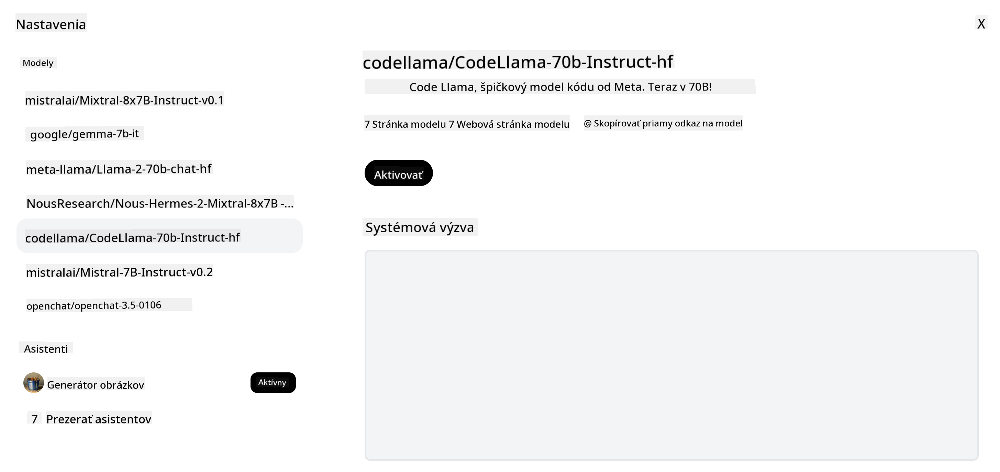
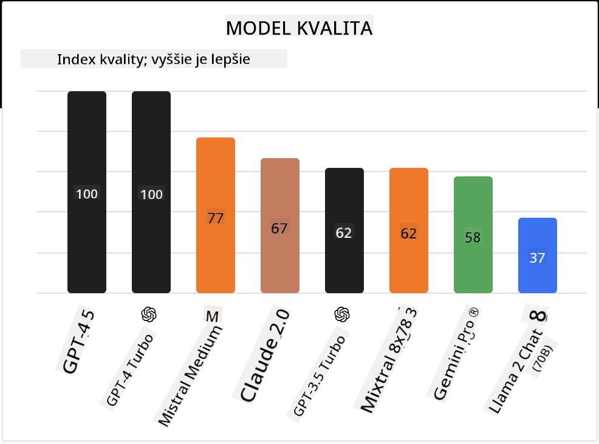

<!--
CO_OP_TRANSLATOR_METADATA:
{
  "original_hash": "0bba96e53ab841d99db731892a51fab8",
  "translation_date": "2025-07-09T17:14:32+00:00",
  "source_file": "16-open-source-models/README.md",
  "language_code": "sk"
}
-->

## Úvod

Svet open-source LLM je vzrušujúci a neustále sa vyvíja. Táto lekcia má za cieľ poskytnúť podrobný pohľad na open source modely. Ak hľadáte informácie o tom, ako sa proprietárne modely porovnávajú s open source modelmi, prejdite na lekciu ["Exploring and Comparing Different LLMs"](../02-exploring-and-comparing-different-llms/README.md?WT.mc_id=academic-105485-koreyst). Táto lekcia sa tiež dotkne témy doladenia modelov, podrobnejšie vysvetlenie nájdete v lekcii ["Fine-Tuning LLMs"](../18-fine-tuning/README.md?WT.mc_id=academic-105485-koreyst).

## Ciele učenia

- Získať pochopenie open source modelov  
- Pochopiť výhody práce s open source modelmi  
- Preskúmať dostupné open modely na Hugging Face a v Azure AI Studio  

## Čo sú Open Source Modely?

Open source softvér zohral kľúčovú úlohu v rozvoji technológií v rôznych oblastiach. Open Source Initiative (OSI) definovala [10 kritérií pre softvér](https://web.archive.org/web/20241126001143/https://opensource.org/osd?WT.mc_id=academic-105485-koreyst), aby mohol byť klasifikovaný ako open source. Zdrojový kód musí byť verejne zdieľaný pod licenciou schválenou OSI.

Vývoj LLM má podobné prvky ako vývoj softvéru, no proces nie je úplne rovnaký. To vyvolalo veľa diskusií v komunite o definícii open source v kontexte LLM. Aby model spĺňal tradičnú definíciu open source, mali by byť verejne dostupné tieto informácie:

- Dátové sady použité na trénovanie modelu  
- Kompletné váhy modelu ako súčasť tréningu  
- Kód na vyhodnotenie modelu  
- Kód na doladenie modelu  
- Kompletné váhy modelu a metriky tréningu  

V súčasnosti existuje len niekoľko modelov, ktoré tieto kritériá spĺňajú. [OLMo model vytvorený Allen Institute for Artificial Intelligence (AllenAI)](https://huggingface.co/allenai/OLMo-7B?WT.mc_id=academic-105485-koreyst) je jedným z nich.

V tejto lekcii budeme modely označovať ako „open modely“, pretože v čase písania nemusia úplne spĺňať vyššie uvedené kritériá.

## Výhody Open Modelov

**Vysoká prispôsobiteľnosť** – Keďže open modely sú zverejnené s podrobnými informáciami o tréningu, výskumníci a vývojári môžu upravovať vnútorné časti modelu. To umožňuje vytvárať vysoko špecializované modely doladené na konkrétnu úlohu alebo oblasť. Príkladmi sú generovanie kódu, matematické operácie alebo biológia.

**Náklady** – Cena za token pri používaní a nasadzovaní týchto modelov je nižšia ako pri proprietárnych modeloch. Pri budovaní generatívnych AI aplikácií je dôležité zvážiť pomer výkon/cena pre váš konkrétny prípad použitia.

  
Zdroj: Artificial Analysis

**Flexibilita** – Práca s open modelmi vám umožňuje byť flexibilný pri používaní rôznych modelov alebo ich kombinovaní. Príkladom sú [HuggingChat asistenti](https://huggingface.co/chat?WT.mc_id=academic-105485-koreyst), kde si používateľ môže priamo v používateľskom rozhraní vybrať model:

## Preskúmanie rôznych Open Modelov

### Llama 2

[LLama2](https://huggingface.co/meta-llama?WT.mc_id=academic-105485-koreyst), vyvinutý spoločnosťou Meta, je open model optimalizovaný pre chatové aplikácie. Je to vďaka jeho metóde doladenia, ktorá zahŕňala veľké množstvo dialógov a spätnú väzbu od ľudí. Vďaka tomu model generuje výsledky viac zodpovedajúce ľudským očakávaniam, čo zlepšuje používateľský zážitok.

Medzi doladené verzie Llama patria napríklad [Japanese Llama](https://huggingface.co/elyza/ELYZA-japanese-Llama-2-7b?WT.mc_id=academic-105485-koreyst), špecializovaný na japončinu, a [Llama Pro](https://huggingface.co/TencentARC/LLaMA-Pro-8B?WT.mc_id=academic-105485-koreyst), vylepšená verzia základného modelu.

### Mistral

[Mistral](https://huggingface.co/mistralai?WT.mc_id=academic-105485-koreyst) je open model so silným zameraním na vysoký výkon a efektivitu. Používa prístup Mixture-of-Experts, ktorý kombinuje skupinu špecializovaných expertných modelov do jedného systému, kde podľa vstupu sú vybrané určité modely na spracovanie. To robí výpočty efektívnejšími, pretože modely riešia len tie vstupy, na ktoré sú špecializované.

Medzi doladené verzie Mistral patria napríklad [BioMistral](https://huggingface.co/BioMistral/BioMistral-7B?text=Mon+nom+est+Thomas+et+mon+principal?WT.mc_id=academic-105485-koreyst), zameraný na medicínsku oblasť, a [OpenMath Mistral](https://huggingface.co/nvidia/OpenMath-Mistral-7B-v0.1-hf?WT.mc_id=academic-105485-koreyst), ktorý vykonáva matematické výpočty.

### Falcon

[Falcon](https://huggingface.co/tiiuae?WT.mc_id=academic-105485-koreyst) je LLM vytvorený Technology Innovation Institute (**TII**). Falcon-40B bol trénovaný na 40 miliardách parametrov a preukázal lepší výkon ako GPT-3 pri nižšom výpočtovom rozpočte. Je to vďaka použitiu algoritmu FlashAttention a multiquery attention, ktoré znižujú požiadavky na pamäť počas inferencie. Vďaka skrátenému času inferencie je Falcon-40B vhodný pre chatové aplikácie.

Medzi doladené verzie Falcon patria [OpenAssistant](https://huggingface.co/OpenAssistant/falcon-40b-sft-top1-560?WT.mc_id=academic-105485-koreyst), asistent postavený na open modeloch, a [GPT4ALL](https://huggingface.co/nomic-ai/gpt4all-falcon?WT.mc_id=academic-105485-koreyst), ktorý dosahuje vyšší výkon než základný model.

## Ako si vybrať

Neexistuje jednoznačná odpoveď na výber open modelu. Dobré miesto na začiatok je použiť filter podľa úlohy v Azure AI Studio. Pomôže vám to pochopiť, na aké typy úloh bol model trénovaný. Hugging Face tiež udržiava LLM Leaderboard, ktorý zobrazuje najvýkonnejšie modely podľa určitých metrík.

Ak chcete porovnávať LLM naprieč rôznymi typmi, [Artificial Analysis](https://artificialanalysis.ai/?WT.mc_id=academic-105485-koreyst) je ďalší skvelý zdroj:

  
Zdroj: Artificial Analysis

Pri práci na konkrétnom prípade použitia môže byť efektívne hľadať doladené verzie zamerané na rovnakú oblasť. Experimentovanie s viacerými open modelmi, aby ste videli, ako sa správajú podľa vašich a používateľských očakávaní, je tiež dobrá prax.

## Ďalšie kroky

Najlepšie na open modeloch je, že s nimi môžete začať pracovať veľmi rýchlo. Pozrite si [Azure AI Studio Model Catalog](https://ai.azure.com?WT.mc_id=academic-105485-koreyst), ktorý obsahuje špecifickú kolekciu Hugging Face s modelmi, o ktorých sme tu hovorili.

## Učenie tu nekončí, pokračujte v ceste

Po dokončení tejto lekcie si pozrite našu [Generative AI Learning collection](https://aka.ms/genai-collection?WT.mc_id=academic-105485-koreyst), aby ste naďalej rozvíjali svoje znalosti v oblasti generatívnej AI!

**Zrieknutie sa zodpovednosti**:  
Tento dokument bol preložený pomocou AI prekladateľskej služby [Co-op Translator](https://github.com/Azure/co-op-translator). Aj keď sa snažíme o presnosť, prosím, majte na pamäti, že automatizované preklady môžu obsahovať chyby alebo nepresnosti. Pôvodný dokument v jeho rodnom jazyku by mal byť považovaný za autoritatívny zdroj. Pre kritické informácie sa odporúča profesionálny ľudský preklad. Nie sme zodpovední za akékoľvek nedorozumenia alebo nesprávne interpretácie vyplývajúce z použitia tohto prekladu.