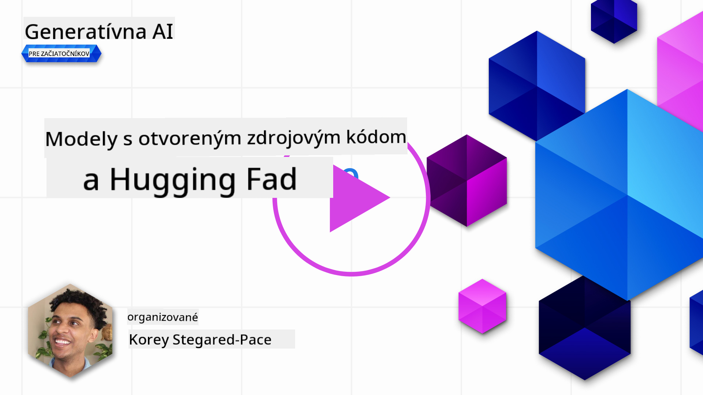

<!--
CO_OP_TRANSLATOR_METADATA:
{
  "original_hash": "0bba96e53ab841d99db731892a51fab8",
  "translation_date": "2025-05-20T07:03:07+00:00",
  "source_file": "16-open-source-models/README.md",
  "language_code": "sk"
}
-->

## Úvod

Svet open-source LLM je vzrušujúci a neustále sa vyvíja. Táto lekcia sa zameriava na podrobný pohľad na open source modely. Ak hľadáte informácie o tom, ako sa proprietárne modely porovnávajú s open source modelmi, prejdite na lekciu ["Preskúmanie a porovnávanie rôznych LLM"](../02-exploring-and-comparing-different-llms/README.md?WT.mc_id=academic-105485-koreyst). Táto lekcia sa tiež dotkne témy jemného ladenia, ale podrobnejšie vysvetlenie nájdete v lekcii ["Jemné ladenie LLM"](../18-fine-tuning/README.md?WT.mc_id=academic-105485-koreyst).

## Ciele učenia

- Získať pochopenie open source modelov
- Pochopiť výhody práce s open source modelmi
- Preskúmanie dostupných open modelov na Hugging Face a Azure AI Studio

## Čo sú Open Source Modely?

Open source softvér zohral kľúčovú úlohu v rozvoji technológie naprieč rôznymi oblasťami. Open Source Initiative (OSI) definovala [10 kritérií pre softvér](https://web.archive.org/web/20241126001143/https://opensource.org/osd?WT.mc_id=academic-105485-koreyst) na klasifikáciu ako open source. Zdrojový kód musí byť verejne zdieľaný pod licenciou schválenou OSI.

Aj keď vývoj LLM má podobné prvky ako vývoj softvéru, proces nie je úplne rovnaký. To vyvolalo veľa diskusií v komunite o definícii open source v kontexte LLM. Aby model zodpovedal tradičnej definícii open source, nasledujúce informácie by mali byť verejne dostupné:

- Datasety použité na tréning modelu.
- Úplné váhy modelu ako súčasť tréningu.
- Kód na vyhodnotenie.
- Kód na jemné ladenie.
- Úplné váhy modelu a metriky tréningu.

V súčasnosti existuje len málo modelov, ktoré spĺňajú tieto kritériá. [OLMo model vytvorený Allen Institute for Artificial Intelligence (AllenAI)](https://huggingface.co/allenai/OLMo-7B?WT.mc_id=academic-105485-koreyst) je jeden z nich.

Pre túto lekciu budeme odkazovať na modely ako "open modely", pretože v čase písania nemusia spĺňať vyššie uvedené kritériá.

## Výhody Open Modelov

**Vysoká prispôsobiteľnosť** - Keďže open modely sú vydávané s podrobnými informáciami o tréningu, výskumníci a vývojári môžu modifikovať vnútornosti modelu. To umožňuje vytváranie vysoko špecializovaných modelov, ktoré sú jemne naladené na konkrétnu úlohu alebo oblasť štúdia. Niektoré príklady zahŕňajú generovanie kódu, matematické operácie a biológiu.

**Náklady** - Náklady na token pri používaní a nasadení týchto modelov sú nižšie ako pri proprietárnych modeloch. Pri budovaní aplikácií Generative AI by sa malo zvažovať výkon vs cena pri práci s týmito modelmi pre váš prípad použitia.

Zdroj: Artificial Analysis

**Flexibilita** - Práca s open modelmi umožňuje flexibilitu v používaní rôznych modelov alebo ich kombinovaní. Príkladom je [HuggingChat Assistants](https://huggingface.co/chat?WT.mc_id=academic-105485-koreyst), kde si používateľ môže priamo v používateľskom rozhraní vybrať model, ktorý sa používa:

## Preskúmanie rôznych Open Modelov

### Llama 2

[LLama2](https://huggingface.co/meta-llama?WT.mc_id=academic-105485-koreyst), vyvinutý spoločnosťou Meta, je open model optimalizovaný pre chatovacie aplikácie. Je to vďaka jeho metóde jemného ladenia, ktorá zahŕňala veľké množstvo dialógov a spätnej väzby od ľudí. S touto metódou model produkuje viac výsledkov, ktoré sú v súlade s očakávaním človeka, čo poskytuje lepší používateľský zážitok.

Niektoré príklady jemne naladených verzií Llama zahŕňajú [Japanese Llama](https://huggingface.co/elyza/ELYZA-japanese-Llama-2-7b?WT.mc_id=academic-105485-koreyst), ktorý sa špecializuje na japončinu, a [Llama Pro](https://huggingface.co/TencentARC/LLaMA-Pro-8B?WT.mc_id=academic-105485-koreyst), ktorý je vylepšenou verziou základného modelu.

### Mistral

[Mistral](https://huggingface.co/mistralai?WT.mc_id=academic-105485-koreyst) je open model s dôrazom na vysoký výkon a efektívnosť. Používa prístup Mixture-of-Experts, ktorý kombinuje skupinu špecializovaných expertov modelov do jedného systému, kde sa v závislosti od vstupu vyberajú určité modely na použitie. To robí výpočet efektívnejším, pretože modely riešia len vstupy, na ktoré sú špecializované.

Niektoré príklady jemne naladených verzií Mistral zahŕňajú [BioMistral](https://huggingface.co/BioMistral/BioMistral-7B?text=Mon+nom+est+Thomas+et+mon+principal?WT.mc_id=academic-105485-koreyst), ktorý sa zameriava na medicínsku oblasť, a [OpenMath Mistral](https://huggingface.co/nvidia/OpenMath-Mistral-7B-v0.1-hf?WT.mc_id=academic-105485-koreyst), ktorý vykonáva matematické výpočty.

### Falcon

[Falcon](https://huggingface.co/tiiuae?WT.mc_id=academic-105485-koreyst) je LLM vytvorený Inštitútom technologických inovácií (**TII**). Falcon-40B bol trénovaný na 40 miliardách parametrov, čo sa ukázalo ako lepšie než GPT-3 s menším rozpočtom na výpočty. Je to vďaka jeho použitiu algoritmu FlashAttention a multiquery attention, ktoré mu umožňujú znížiť požiadavky na pamäť počas času inferencie. S týmto zníženým časom inferencie je Falcon-40B vhodný pre chatovacie aplikácie.

Niektoré príklady jemne naladených verzií Falcon sú [OpenAssistant](https://huggingface.co/OpenAssistant/falcon-40b-sft-top1-560?WT.mc_id=academic-105485-koreyst), asistent postavený na open modeloch, a [GPT4ALL](https://huggingface.co/nomic-ai/gpt4all-falcon?WT.mc_id=academic-105485-koreyst), ktorý poskytuje vyšší výkon než základný model.

## Ako si vybrať

Neexistuje jednoznačná odpoveď na výber open modelu. Dobré miesto na začatie je použitie funkcie Azure AI Studio na filtrovanie podľa úlohy. To vám pomôže pochopiť, na aké typy úloh bol model trénovaný. Hugging Face tiež udržiava LLM Leaderboard, ktorý vám ukáže najlepšie výkonné modely podľa určitých metrík.

Pri porovnávaní LLM naprieč rôznymi typmi je ďalším skvelým zdrojom [Artificial Analysis](https://artificialanalysis.ai/?WT.mc_id=academic-105485-koreyst):

Zdroj: Artifical Analysis

Ak pracujete na konkrétnom prípade použitia, hľadanie jemne naladených verzií zameraných na rovnakú oblasť môže byť efektívne. Experimentovanie s viacerými open modelmi, aby ste videli, ako fungujú podľa vašich očakávaní a očakávaní vašich používateľov, je ďalšou dobrou praxou.

## Ďalšie kroky

Najlepšia časť open modelov je, že s nimi môžete začať pracovať pomerne rýchlo. Pozrite si [Azure AI Studio Model Catalog](https://ai.azure.com?WT.mc_id=academic-105485-koreyst), ktorý obsahuje konkrétnu kolekciu Hugging Face s modelmi, o ktorých sme tu diskutovali.

## Učenie nekončí tu, pokračujte v ceste

Po dokončení tejto lekcie si pozrite našu [Generative AI Learning collection](https://aka.ms/genai-collection?WT.mc_id=academic-105485-koreyst), aby ste pokračovali vo zvyšovaní vašich znalostí o Generative AI!

**Upozornenie**:  
Tento dokument bol preložený pomocou AI prekladateľskej služby [Co-op Translator](https://github.com/Azure/co-op-translator). Aj keď sa snažíme o presnosť, uvedomte si, že automatizované preklady môžu obsahovať chyby alebo nepresnosti. Pôvodný dokument v jeho rodnom jazyku by mal byť považovaný za autoritatívny zdroj. Pre dôležité informácie sa odporúča profesionálny ľudský preklad. Nie sme zodpovední za žiadne nedorozumenia alebo nesprávne interpretácie vyplývajúce z použitia tohto prekladu.