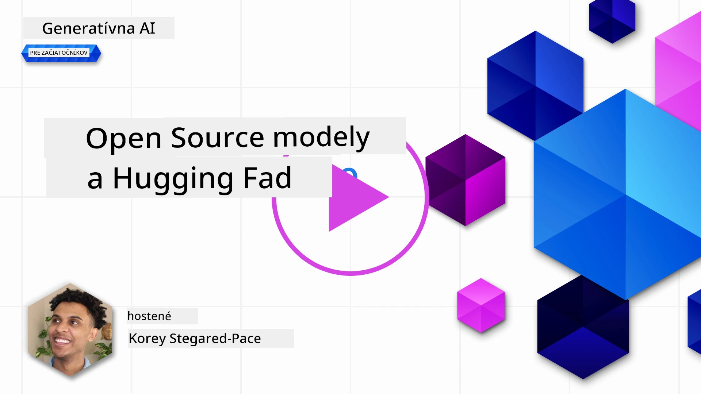
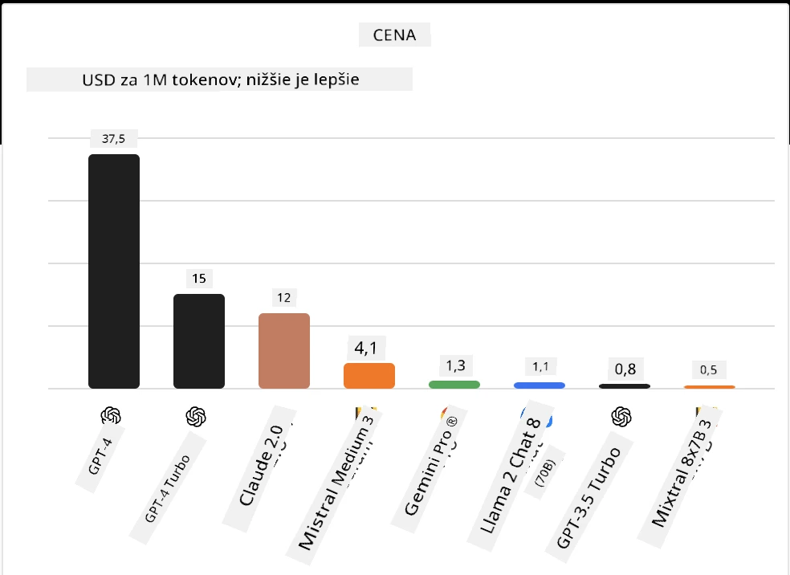
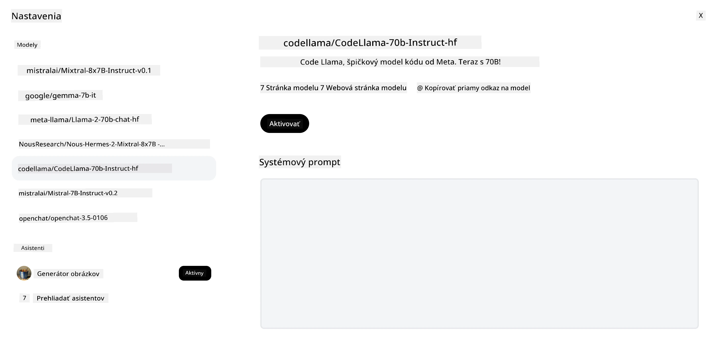
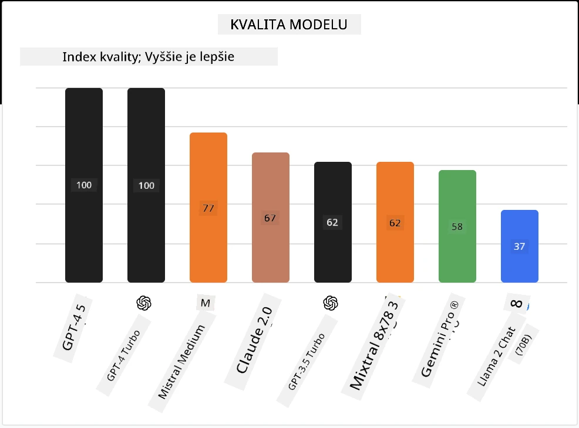

## Úvod

Svet open source LLM je vzrušujúci a neustále sa vyvíjajúci. Táto lekcia má za cieľ poskytnúť hlboký pohľad na open source modely. Ak hľadáte informácie o tom, ako sa vlastnícke modely porovnávajú s open source modelmi, prejdite na lekciu ["Preskúmanie a porovnanie rôznych LLM" ](../02-exploring-and-comparing-different-llms/README.md?WT.mc_id=academic-105485-koreyst). Táto lekcia sa tiež bude venovať téme doladenia, ale podrobnejšie vysvetlenie nájdete v lekcii ["Doladenie LLM" ](../18-fine-tuning/README.md?WT.mc_id=academic-105485-koreyst).

## Ciele učenia sa

- Získať pochopenie otvorených modelov
- Pochopenie výhod práce s open source modelmi
- Preskúmanie dostupných open modelov na Hugging Face a katalógu modelov Microsoft Foundry

## Čo sú Open Source modely?

Open source softvér zohral kľúčovú úlohu v raste technológií v rôznych oblastiach. Iniciatíva Open Source (OSI) definovala [10 kritérií pre softvér](https://web.archive.org/web/20241126001143/https://opensource.org/osd?WT.mc_id=academic-105485-koreyst), aby mohol byť klasifikovaný ako open source. Zdrojový kód musí byť verejne zdieľaný pod licenciou schválenou OSI.

Vývoj LLM má podobné prvky ako vývoj softvéru, no proces nie je presne rovnaký. To vyvolalo veľa diskusií v komunite o definícii open source v kontexte LLM. Pre to, aby bol model zosúladený s tradičnou definíciou open source, by mali byť verejne dostupné nasledujúce informácie:

- Dataset-y použité na tréning modelu.
- Plné váhy modelu ako súčasť tréningu.
- Kód pre hodnotenie.
- Kód pre doladenie.
- Plné váhy modelu a metriky tréningu.

Momentálne je len niekoľko modelov, ktoré spĺňajú tieto kritériá. [Model OLMo vytvorený Allen Institute for Artificial Intelligence (AllenAI)](https://huggingface.co/allenai/OLMo-7B?WT.mc_id=academic-105485-koreyst) je jedným z nich.

V tejto lekcii budeme na modely odkazovať ako na „open modely“, keďže nemusia v čase písania spĺňať vyššie uvedené kritériá.

## Výhody otvorených modelov

**Vysoká prispôsobiteľnosť** – Keďže open modely sú zverejnené s podrobnými informačkami o tréningu, výskumníci a vývojári môžu upravovať vnútornú štruktúru modelu. To umožňuje vytváranie vysoko špecializovaných modelov, ktoré sú doladené na konkrétnu úlohu alebo oblasť štúdia. Niektoré príklady sú generovanie kódu, matematické operácie a biológia.

**Cena** – Cena za token používania a nasadenia týchto modelov je nižšia ako pri vlastných modeloch. Pri budovaní generatívnych AI aplikácií by ste mali zvážiť pomer výkon/cena pri práci s týmito modelmi pre váš prípad použitia.

Zdroj: Artificial Analysis

**Flexibilita** – Práca s open modelmi umožňuje flexibilitu v používaní rôznych modelov alebo ich kombinácií. Príkladom sú [HuggingChat asistenti](https://huggingface.co/chat?WT.mc_id=academic-105485-koreyst), kde si používateľ môže priamo v používateľskom rozhraní vybrať model, ktorý sa používa:

## Preskúmanie rôznych open modelov

### Llama 2

[Llama2](https://huggingface.co/meta-llama?WT.mc_id=academic-105485-koreyst), vyvinutý spoločnosťou Meta, je open model optimalizovaný pre chatové aplikácie. Je to vďaka metóde doladenia, ktorá zahŕňala veľké množstvo dialógov a spätnoväzobných údajov od ľudí. Vďaka tomu model produkuje výsledky, ktoré viac zodpovedajú očakávaniam ľudí, čím poskytuje lepší používateľský zážitok.

Niektoré príklady doladených verzií Llama zahŕňajú [Japanese Llama](https://huggingface.co/elyza/ELYZA-japanese-Llama-2-7b?WT.mc_id=academic-105485-koreyst), ktorý sa špecializuje na japončinu, a [Llama Pro](https://huggingface.co/TencentARC/LLaMA-Pro-8B?WT.mc_id=academic-105485-koreyst), ktorý je vylepšenou verziou základného modelu.

### Mistral

[Mistral](https://huggingface.co/mistralai?WT.mc_id=academic-105485-koreyst) je open model so silným zameraním na vysoký výkon a efektívnosť. Používa prístup "Mixture-of-Experts", ktorý kombinuje skupinu špecializovaných expertných modelov do jedného systému, kde v závislosti od vstupu sú vybrané určité modely na použitie. To robí výpočty účinnejšími, pretože modely riešia len tie vstupy, na ktoré sú špecializované.

Niektoré príklady doladených verzií Mistral zahŕňajú [BioMistral](https://huggingface.co/BioMistral/BioMistral-7B?text=Mon+nom+est+Thomas+et+mon+principal?WT.mc_id=academic-105485-koreyst), ktorý sa zameriava na medicínsku oblasť a [OpenMath Mistral](https://huggingface.co/nvidia/OpenMath-Mistral-7B-v0.1-hf?WT.mc_id=academic-105485-koreyst), ktorý vykonáva matematické výpočty.

### Falcon

[Falcon](https://huggingface.co/tiiuae?WT.mc_id=academic-105485-koreyst) je LLM vytvorený Inštitútom technologických inovácií (**TII**). Falcon-40B bol trénovaný na 40 miliardách parametrov a preukázal lepší výkon ako GPT-3 pri nižšom výpočtovom rozpočte. Je to vďaka použitiu algoritmu FlashAttention a multiquery attention, ktoré znižujú požiadavky na pamäť pri vyhodnocovaní. Vďaka zníženému času vyhodnocovania je Falcon-40B vhodný pre chatové aplikácie.

Niektoré príklady doladených verzií Falcon zahŕňajú [OpenAssistant](https://huggingface.co/OpenAssistant/falcon-40b-sft-top1-560?WT.mc_id=academic-105485-koreyst), asistenta postaveného na open modeloch, a [GPT4ALL](https://huggingface.co/nomic-ai/gpt4all-falcon?WT.mc_id=academic-105485-koreyst), ktorý poskytuje vyšší výkon ako základný model.

## Ako vybrať

Neexistuje jednoznačná odpoveď na výber open modelu. Dobrou východiskovou bodom je použitie funkcie filtrov podľa úloh v katalógu modelov Microsoft Foundry. To vám pomôže pochopiť, na aké typy úloh bol model trénovaný. Hugging Face tiež udržiava rebríček LLM, ktorý vám ukáže najlepšie výkonné modely na základe určitých metrík.

Ak chcete porovnať LLM naprieč rôznymi typmi, [Artificial Analysis](https://artificialanalysis.ai/?WT.mc_id=academic-105485-koreyst) je ďalší skvelý zdroj:

Zdroj: Artificial Analysis

Pri práci na špecifickom prípade použitia môže byť efektívne hľadanie doladených verzií, ktoré sa zameriavajú na tú istú oblasť. Experimentovanie s viacerými open modelmi, aby ste zistili, ako fungujú podľa vašich a očakávaní vašich používateľov, je ďalšia dobrá prax.

## Ďalšie kroky

Najlepšie na open modeloch je, že s nimi môžete začať pracovať relatívne rýchlo. Prezrite si [katalóg modelov Microsoft Foundry](https://ai.azure.com?WT.mc_id=academic-105485-koreyst), ktorý obsahuje špecifickú kolekciu Hugging Face s modelmi, o ktorých sme tu hovorili.

## Učenie sa tu nekončí, pokračujte v ceste

Po dokončení tejto lekcie si pozrite našu [kolekciu učenia o generatívnej AI](https://aka.ms/genai-collection?WT.mc_id=academic-105485-koreyst), aby ste pokračovali v rozvíjaní svojich znalostí o generatívnej AI!

---

<!-- CO-OP TRANSLATOR DISCLAIMER START -->
**Vyhlásenie o zodpovednosti**:
Tento dokument bol preložený pomocou AI prekladateľskej služby [Co-op Translator](https://github.com/Azure/co-op-translator). Hoci sa snažíme o presnosť, vezmite prosím na vedomie, že automatické preklady môžu obsahovať chyby alebo nepresnosti. Pôvodný dokument v jeho natívnom jazyku by mal byť považovaný za autoritatívny zdroj. Pre kritické informácie sa odporúča profesionálny ľudský preklad. Nie sme zodpovední za žiadne nedorozumenia alebo nesprávne interpretácie vyplývajúce z použitia tohto prekladu.
<!-- CO-OP TRANSLATOR DISCLAIMER END -->