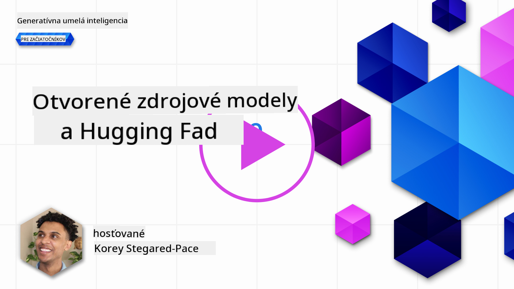
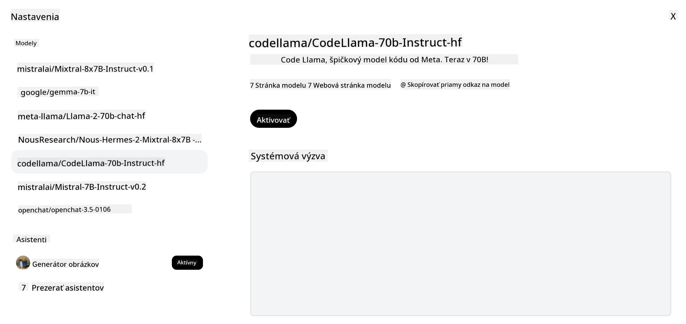
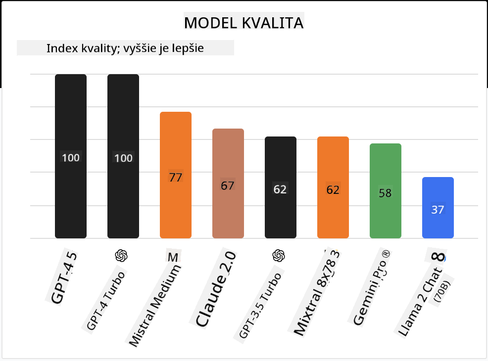

<!--
CO_OP_TRANSLATOR_METADATA:
{
  "original_hash": "0bba96e53ab841d99db731892a51fab8",
  "translation_date": "2025-06-26T00:03:18+00:00",
  "source_file": "16-open-source-models/README.md",
  "language_code": "sk"
}
-->

## Úvod

Svet open-source LLM je vzrušujúci a neustále sa vyvíja. Táto lekcia si kladie za cieľ poskytnúť podrobný pohľad na open source modely. Ak hľadáte informácie o tom, ako sa proprietárne modely porovnávajú s open source modelmi, prejdite na lekciu ["Preskúmanie a porovnanie rôznych LLM"](../02-exploring-and-comparing-different-llms/README.md?WT.mc_id=academic-105485-koreyst). Táto lekcia sa bude tiež zaoberať témou doladenia, ale podrobnejšie vysvetlenie nájdete v lekcii ["Doladenie LLM"](../18-fine-tuning/README.md?WT.mc_id=academic-105485-koreyst).

## Ciele učenia

- Získať porozumenie open source modelom
- Pochopiť výhody práce s open source modelmi
- Preskúmanie dostupných open modelov na Hugging Face a Azure AI Studio

## Čo sú Open Source Modely?

Open source softvér zohral kľúčovú úlohu v raste technológie v rôznych oblastiach. Open Source Initiative (OSI) definovala [10 kritérií pre softvér](https://web.archive.org/web/20241126001143/https://opensource.org/osd?WT.mc_id=academic-105485-koreyst), aby mohol byť klasifikovaný ako open source. Zdrojový kód musí byť otvorene zdieľaný pod licenciou schválenou OSI.

Hoci vývoj LLM má podobné prvky ako vývoj softvéru, proces nie je úplne rovnaký. To viedlo k mnohým diskusiám v komunite o definícii open source v kontexte LLM. Aby bol model v súlade s tradičnou definíciou open source, mali by byť verejne dostupné nasledujúce informácie:

- Dátové súbory použité na trénovanie modelu.
- Plné váhy modelu ako súčasť trénovania.
- Kód hodnotenia.
- Kód doladenia.
- Plné váhy modelu a metriky trénovania.

V súčasnosti existuje len niekoľko modelov, ktoré spĺňajú tieto kritériá. [Model OLMo vytvorený Allen Institute for Artificial Intelligence (AllenAI)](https://huggingface.co/allenai/OLMo-7B?WT.mc_id=academic-105485-koreyst) je jedným z nich.

Pre túto lekciu budeme modely nazývať "open modely", pretože v čase písania nemusia spĺňať vyššie uvedené kritériá.

## Výhody Open Modelov

**Vysoko prispôsobiteľné** - Keďže open modely sú vydané s podrobnými informáciami o trénovaní, výskumníci a vývojári môžu modifikovať vnútorné časti modelu. To umožňuje vytváranie vysoko špecializovaných modelov, ktoré sú doladené pre konkrétnu úlohu alebo oblasť štúdia. Niektoré príklady zahŕňajú generovanie kódu, matematické operácie a biológiu.

**Náklady** - Náklady na jeden token pri používaní a nasadzovaní týchto modelov sú nižšie ako pri proprietárnych modeloch. Pri budovaní aplikácií generatívnej AI by sa malo zvážiť porovnanie výkonu a ceny pri práci s týmito modelmi na vašom prípade použitia.

 Zdroj: Artificial Analysis

**Flexibilita** - Práca s open modelmi vám umožňuje byť flexibilný v používaní rôznych modelov alebo ich kombinovaní. Príkladom je [HuggingChat Assistants](https://huggingface.co/chat?WT.mc_id=academic-105485-koreyst), kde si používateľ môže priamo v používateľskom rozhraní vybrať používaný model:

## Preskúmanie rôznych open modelov

### Llama 2

[LLama2](https://huggingface.co/meta-llama?WT.mc_id=academic-105485-koreyst), vyvinutý spoločnosťou Meta, je open model optimalizovaný pre aplikácie založené na chate. Je to vďaka jeho metóde doladenia, ktorá zahrňovala veľké množstvo dialógov a spätnej väzby od ľudí. S touto metódou model produkuje viac výsledkov, ktoré sú v súlade s očakávaniami ľudí, čo poskytuje lepší používateľský zážitok.

Niektoré príklady doladených verzií Llama zahŕňajú [Japanese Llama](https://huggingface.co/elyza/ELYZA-japanese-Llama-2-7b?WT.mc_id=academic-105485-koreyst), ktorá sa špecializuje na japončinu a [Llama Pro](https://huggingface.co/TencentARC/LLaMA-Pro-8B?WT.mc_id=academic-105485-koreyst), čo je vylepšená verzia základného modelu.

### Mistral

[Mistral](https://huggingface.co/mistralai?WT.mc_id=academic-105485-koreyst) je open model so silným zameraním na vysoký výkon a efektívnosť. Používa prístup Mixture-of-Experts, ktorý kombinuje skupinu špecializovaných expertných modelov do jedného systému, kde v závislosti od vstupu sú vybrané určité modely na použitie. To robí výpočet efektívnejším, pretože modely sa zaoberajú iba vstupmi, na ktoré sú špecializované.

Niektoré príklady doladených verzií Mistral zahŕňajú [BioMistral](https://huggingface.co/BioMistral/BioMistral-7B?text=Mon+nom+est+Thomas+et+mon+principal?WT.mc_id=academic-105485-koreyst), ktorá sa zameriava na lekársku oblasť a [OpenMath Mistral](https://huggingface.co/nvidia/OpenMath-Mistral-7B-v0.1-hf?WT.mc_id=academic-105485-koreyst), ktorá vykonáva matematické výpočty.

### Falcon

[Falcon](https://huggingface.co/tiiuae?WT.mc_id=academic-105485-koreyst) je LLM vytvorený Inštitútom pre technologické inovácie (**TII**). Falcon-40B bol trénovaný na 40 miliardách parametrov, čo sa ukázalo byť lepšie ako GPT-3 s menším rozpočtom na výpočty. Je to vďaka použitiu algoritmu FlashAttention a multiquery attention, ktoré umožňujú znížiť pamäťové požiadavky pri čase inferencie. S týmto zníženým časom inferencie je Falcon-40B vhodný pre aplikácie založené na chate.

Niektoré príklady doladených verzií Falcon zahŕňajú [OpenAssistant](https://huggingface.co/OpenAssistant/falcon-40b-sft-top1-560?WT.mc_id=academic-105485-koreyst), asistenta postaveného na open modeloch a [GPT4ALL](https://huggingface.co/nomic-ai/gpt4all-falcon?WT.mc_id=academic-105485-koreyst), ktorý poskytuje vyšší výkon ako základný model.

## Ako vybrať

Neexistuje jednoznačná odpoveď na výber open modelu. Dobré miesto na začiatok je použitie filtra podľa úlohy v Azure AI Studio. To vám pomôže pochopiť, na aké typy úloh bol model trénovaný. Hugging Face tiež udržuje LLM Leaderboard, ktorý vám ukazuje najlepšie výkonné modely na základe určitých metrík.

Pri porovnávaní LLM naprieč rôznymi typmi je ďalším skvelým zdrojom [Artificial Analysis](https://artificialanalysis.ai/?WT.mc_id=academic-105485-koreyst):

 Zdroj: Artificial Analysis

Ak pracujete na konkrétnom prípade použitia, hľadanie doladených verzií zameraných na rovnakú oblasť môže byť efektívne. Experimentovanie s viacerými open modelmi, aby ste videli, ako sa správajú podľa vašich a očakávaní vašich používateľov, je ďalšou dobrou praxou.

## Ďalšie kroky

Najlepšou časťou open modelov je, že s nimi môžete začať pracovať pomerne rýchlo. Pozrite si [Azure AI Studio Model Catalog](https://ai.azure.com?WT.mc_id=academic-105485-koreyst), ktorý obsahuje špecifickú kolekciu Hugging Face s týmito modelmi, o ktorých sme tu diskutovali.

## Učenie sa tu nekončí, pokračujte v ceste

Po dokončení tejto lekcie si pozrite našu [Generative AI Learning collection](https://aka.ms/genai-collection?WT.mc_id=academic-105485-koreyst), aby ste pokračovali v zvyšovaní svojich znalostí o Generative AI!

**Upozornenie**:  
Tento dokument bol preložený pomocou služby AI prekladu [Co-op Translator](https://github.com/Azure/co-op-translator). Hoci sa snažíme o presnosť, prosím, berte na vedomie, že automatizované preklady môžu obsahovať chyby alebo nepresnosti. Pôvodný dokument v jeho rodnom jazyku by mal byť považovaný za autoritatívny zdroj. Pre kritické informácie sa odporúča profesionálny ľudský preklad. Nie sme zodpovední za žiadne nedorozumenia alebo nesprávne interpretácie vyplývajúce z použitia tohto prekladu.