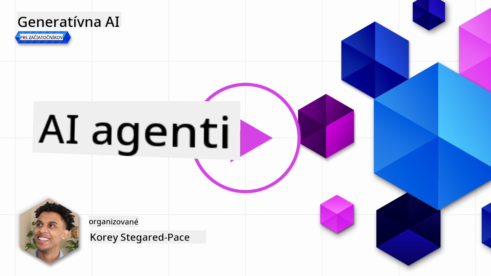
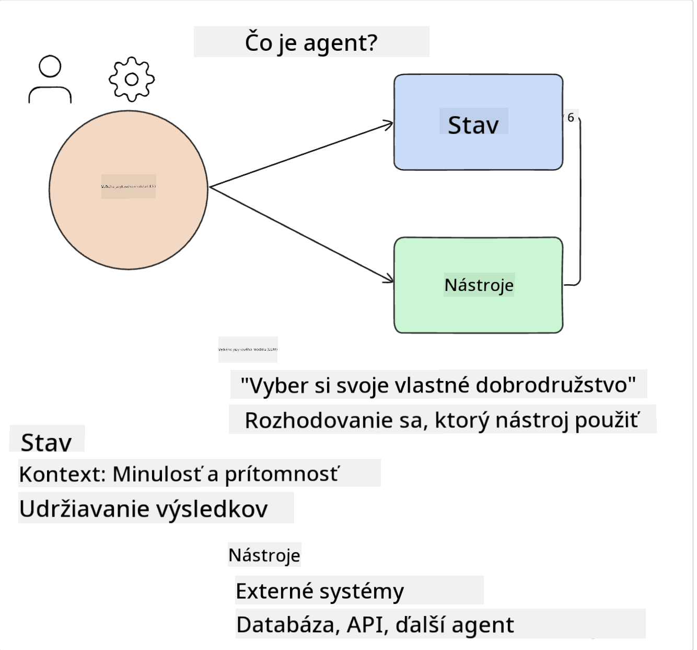
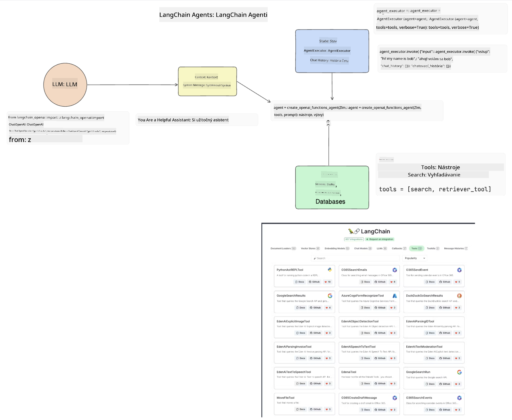
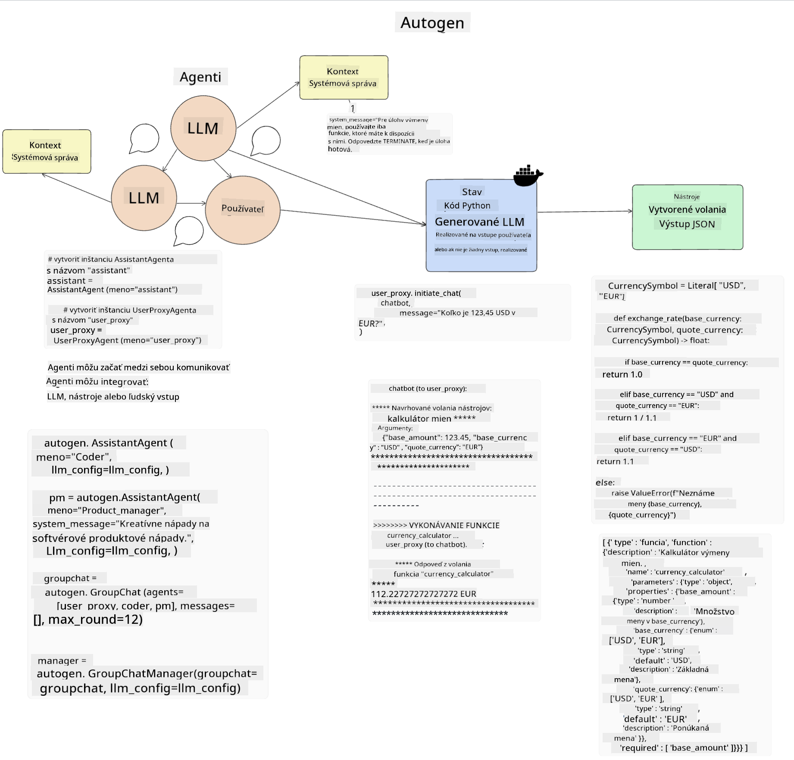
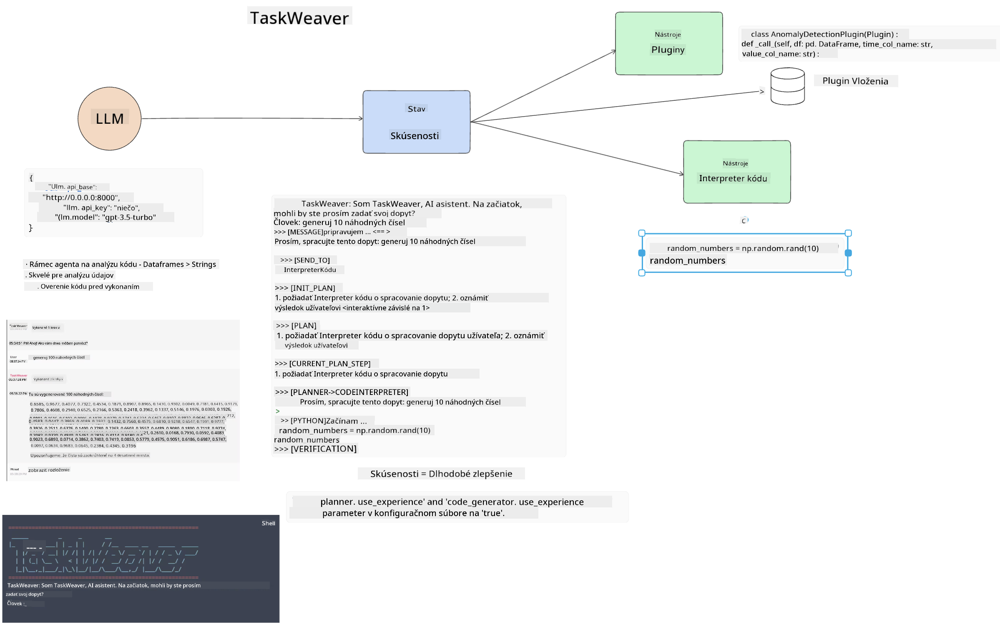
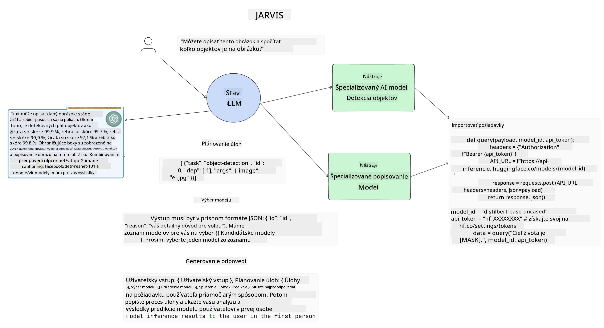

<!--
CO_OP_TRANSLATOR_METADATA:
{
  "original_hash": "11f03c81f190d9cbafd0f977dcbede6c",
  "translation_date": "2025-05-20T07:31:05+00:00",
  "source_file": "17-ai-agents/README.md",
  "language_code": "sk"
}
-->
[](https://aka.ms/gen-ai-lesson17-gh?WT.mc_id=academic-105485-koreyst)

## Úvod

AI agenti predstavujú vzrušujúci vývoj v oblasti generatívnej AI, umožňujúci veľkým jazykovým modelom (LLM) prejsť z asistentov na agentov schopných vykonávať akcie. Rámce AI agentov umožňujú vývojárom vytvárať aplikácie, ktoré poskytujú LLM prístup k nástrojom a správe stavu. Tieto rámce tiež zlepšujú viditeľnosť, čo umožňuje používateľom a vývojárom sledovať akcie plánované LLM, čím sa zlepšuje riadenie skúseností.

Lekcia pokryje nasledujúce oblasti:

- Pochopenie, čo je AI agent - Čo presne je AI agent?
- Preskúmanie štyroch rôznych rámcov AI agentov - Čo ich robí jedinečnými?
- Aplikácia týchto AI agentov na rôzne prípady použitia - Kedy by sme mali používať AI agentov?

## Ciele učenia

Po absolvovaní tejto lekcie budete schopní:

- Vysvetliť, čo sú AI agenti a ako sa dajú použiť.
- Porozumieť rozdielom medzi niektorými populárnymi rámcami AI agentov a ako sa líšia.
- Pochopiť, ako fungujú AI agenti, aby ste mohli s nimi vytvárať aplikácie.

## Čo sú AI agenti?

AI agenti sú veľmi vzrušujúca oblasť vo svete generatívnej AI. S týmto nadšením niekedy prichádza zmätok v termínoch a ich aplikácii. Aby sme veci zjednodušili a zahrnuli väčšinu nástrojov, ktoré sa odvolávajú na AI agentov, použijeme túto definíciu:

AI agenti umožňujú veľkým jazykovým modelom (LLM) vykonávať úlohy tým, že im poskytujú prístup k **stavu** a **nástrojom**.



Definujme tieto pojmy:

**Veľké jazykové modely** - Toto sú modely, na ktoré sa odkazuje počas celého kurzu, ako napríklad GPT-3.5, GPT-4, Llama-2, atď.

**Stav** - To sa týka kontextu, v ktorom LLM pracuje. LLM používa kontext svojich minulých akcií a aktuálny kontext, ktorý ho vedie pri rozhodovaní o nasledujúcich akciách. Rámce AI agentov umožňujú vývojárom ľahšie udržiavať tento kontext.

**Nástroje** - Aby LLM dokončil úlohu, ktorú používateľ požiadal a ktorú naplánoval, potrebuje prístup k nástrojom. Niektoré príklady nástrojov môžu byť databáza, API, externá aplikácia alebo dokonca iný LLM!

Tieto definície vám dúfajme poskytnú dobrý základ do budúcnosti, keď sa pozrieme na to, ako sú implementované. Preskúmajme niekoľko rôznych rámcov AI agentov:

## LangChain Agents

[LangChain Agents](https://python.langchain.com/docs/how_to/#agents?WT.mc_id=academic-105485-koreyst) je implementácia definícií, ktoré sme poskytli vyššie.

Na správu **stavu** používa vstavanú funkciu nazvanú `AgentExecutor`. Táto funkcia prijíma definovaný `agent` a `tools`, ktoré sú k dispozícii.

`Agent Executor` tiež uchováva históriu chatu, aby poskytoval kontext chatu.



LangChain ponúka [katalóg nástrojov](https://integrations.langchain.com/tools?WT.mc_id=academic-105485-koreyst), ktoré môžu byť importované do vašej aplikácie, kde LLM môže získať prístup. Tieto sú vytvorené komunitou a tímom LangChain.

Potom môžete definovať tieto nástroje a poskytnúť ich `Agent Executor`.

Viditeľnosť je ďalším dôležitým aspektom, keď hovoríme o AI agentoch. Je dôležité, aby vývojári aplikácií pochopili, ktorý nástroj LLM používa a prečo. Na to tím v LangChain vyvinul LangSmith.

## AutoGen

Ďalší rámec AI agentov, ktorý budeme diskutovať, je [AutoGen](https://microsoft.github.io/autogen/?WT.mc_id=academic-105485-koreyst). Hlavným zameraním AutoGen je konverzácia. Agenti sú **konverzační** a **prispôsobiteľní**.

**Konverzační -** LLM môže začať a pokračovať v konverzácii s iným LLM, aby dokončil úlohu. To sa dosiahne vytvorením `AssistantAgents` a poskytnutím konkrétnej systémovej správy.

```python

autogen.AssistantAgent( name="Coder", llm_config=llm_config, ) pm = autogen.AssistantAgent( name="Product_manager", system_message="Creative in software product ideas.", llm_config=llm_config, )

```

**Prispôsobiteľní** - Agenti môžu byť definovaní nielen ako LLM, ale aj ako používateľ alebo nástroj. Ako vývojár môžete definovať `UserProxyAgent`, ktorý je zodpovedný za interakciu s používateľom pre spätnú väzbu pri dokončovaní úlohy. Táto spätná väzba môže buď pokračovať v vykonávaní úlohy alebo ju zastaviť.

```python
user_proxy = UserProxyAgent(name="user_proxy")
```

### Stav a nástroje

Na zmenu a správu stavu asistent Agent generuje Python kód na dokončenie úlohy.

Tu je príklad procesu:



#### LLM definovaný so systémovou správou

```python
system_message="For weather related tasks, only use the functions you have been provided with. Reply TERMINATE when the task is done."
```

Táto systémová správa usmerňuje konkrétny LLM, ktoré funkcie sú relevantné pre jeho úlohu. Pamätajte, že s AutoGen môžete mať viacero definovaných AssistantAgents s rôznymi systémovými správami.

#### Chat je iniciovaný používateľom

```python
user_proxy.initiate_chat( chatbot, message="I am planning a trip to NYC next week, can you help me pick out what to wear? ", )

```

Táto správa od user_proxy (človek) je to, čo začne proces agenta skúmať možné funkcie, ktoré by mal vykonať.

#### Funkcia je vykonaná

```bash
chatbot (to user_proxy):

***** Suggested tool Call: get_weather ***** Arguments: {"location":"New York City, NY","time_periond:"7","temperature_unit":"Celsius"} ******************************************************** --------------------------------------------------------------------------------

>>>>>>>> EXECUTING FUNCTION get_weather... user_proxy (to chatbot): ***** Response from calling function "get_weather" ***** 112.22727272727272 EUR ****************************************************************

```

Keď je počiatočný chat spracovaný, agent pošle navrhnutý nástroj na volanie. V tomto prípade je to funkcia nazvaná `get_weather`. Depending on your configuration, this function can be automatically executed and read by the Agent or can be executed based on user input.

You can find a list of [AutoGen code samples](https://microsoft.github.io/autogen/docs/Examples/?WT.mc_id=academic-105485-koreyst) to further explore how to get started building.

## Taskweaver

The next agent framework we will explore is [Taskweaver](https://microsoft.github.io/TaskWeaver/?WT.mc_id=academic-105485-koreyst). It is known as a "code-first" agent because instead of working strictly with `strings` , it can work with DataFrames in Python. This becomes extremely useful for data analysis and generation tasks. This can be things like creating graphs and charts or generating random numbers.

### State and Tools

To manage the state of the conversation, TaskWeaver uses the concept of a `Planner`. The `Planner` is a LLM that takes the request from the users and maps out the tasks that need to be completed to fulfill this request.

To complete the tasks the `Planner` is exposed to the collection of tools called `Plugins`. Toto môžu byť Python triedy alebo všeobecný kódový interpret. Tieto pluginy sú uložené ako embeddings, aby LLM mohol lepšie hľadať správny plugin.



Tu je príklad pluginu na riešenie detekcie anomálií:

```python
class AnomalyDetectionPlugin(Plugin): def __call__(self, df: pd.DataFrame, time_col_name: str, value_col_name: str):
```

Kód je overený pred vykonaním. Ďalšou funkciou na správu kontextu v Taskweaver je `experience`. Experience allows for the context of a conversation to be stored over to the long term in a YAML file. This can be configured so that the LLM improves over time on certain tasks given that it is exposed to prior conversations.

## JARVIS

The last agent framework we will explore is [JARVIS](https://github.com/microsoft/JARVIS?tab=readme-ov-file?WT.mc_id=academic-105485-koreyst). What makes JARVIS unique is that it uses an LLM to manage the `state` konverzácie a `tools` sú iné AI modely. Každý z AI modelov sú špecializované modely, ktoré vykonávajú určité úlohy, ako napríklad detekcia objektov, prepis alebo popis obrázkov.



LLM, ako všeobecný model, prijíma požiadavku od používateľa a identifikuje konkrétnu úlohu a akékoľvek argumenty alebo údaje, ktoré sú potrebné na dokončenie úlohy.

```python
[{"task": "object-detection", "id": 0, "dep": [-1], "args": {"image": "e1.jpg" }}]
```

LLM potom formátuje požiadavku tak, aby ju špecializovaný AI model mohol interpretovať, napríklad ako JSON. Keď AI model vráti svoju predikciu na základe úlohy, LLM prijíma odpoveď.

Ak je potrebné na dokončenie úlohy viacero modelov, LLM tiež interpretuje odpovede z týchto modelov predtým, ako ich spoja do odpovede pre používateľa.

Príklad nižšie ukazuje, ako by to fungovalo, keď používateľ žiada popis a počet objektov na obrázku:

## Zadanie

Na pokračovanie v učení sa o AI agentoch môžete vytvoriť s AutoGen:

- Aplikáciu, ktorá simuluje obchodné stretnutie s rôznymi oddeleniami vzdelávacieho startupu.
- Vytvorte systémové správy, ktoré vedú LLM k pochopeniu rôznych osobností a priorít a umožnia používateľovi predstaviť nový produktový nápad.
- LLM by potom mal generovať následné otázky z každého oddelenia na zlepšenie prezentácie a produktového nápadu.

## Učenie nekončí tu, pokračujte v ceste

Po absolvovaní tejto lekcie si pozrite našu [Generative AI Learning collection](https://aka.ms/genai-collection?WT.mc_id=academic-105485-koreyst) a pokračujte v rozvíjaní vašich znalostí o generatívnej AI!

**Upozornenie**:  
Tento dokument bol preložený pomocou AI prekladateľskej služby [Co-op Translator](https://github.com/Azure/co-op-translator). Hoci sa snažíme o presnosť, prosím, berte na vedomie, že automatizované preklady môžu obsahovať chyby alebo nepresnosti. Pôvodný dokument v jeho rodnom jazyku by mal byť považovaný za autoritatívny zdroj. Pre kritické informácie sa odporúča profesionálny ľudský preklad. Nezodpovedáme za akékoľvek nedorozumenia alebo nesprávne interpretácie vyplývajúce z použitia tohto prekladu.