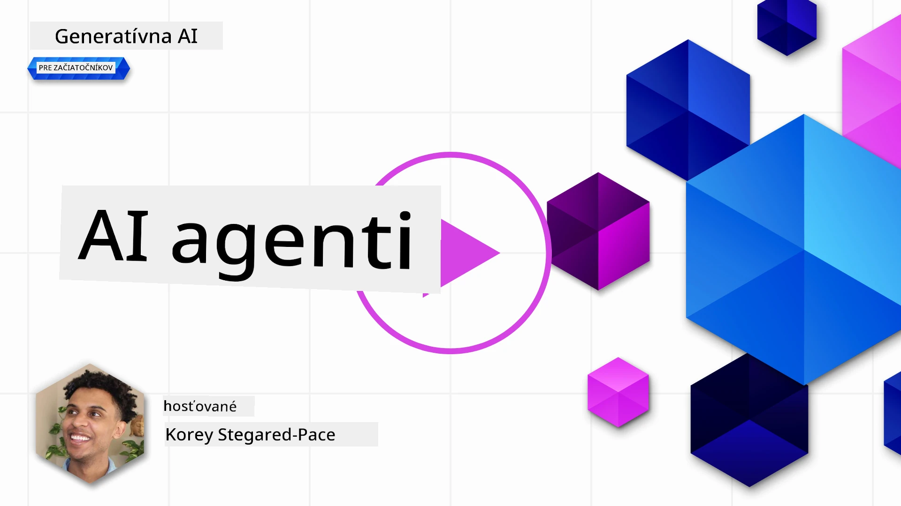
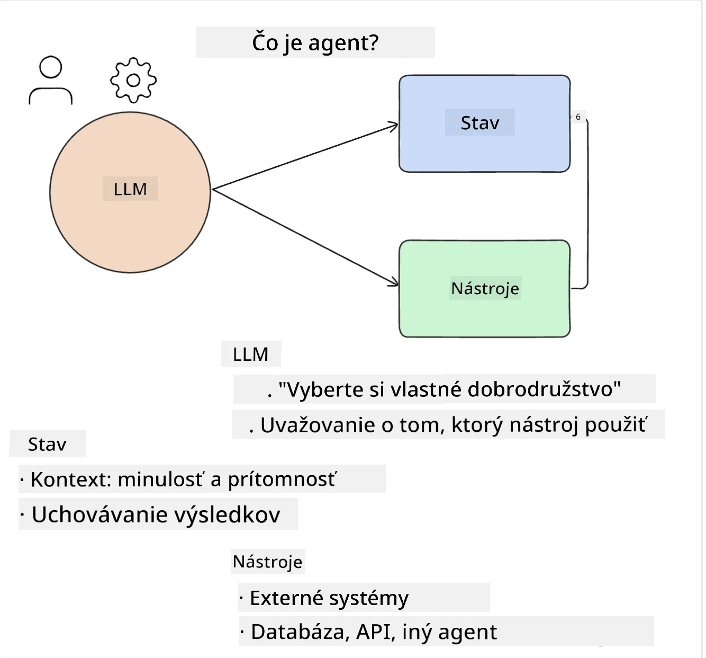
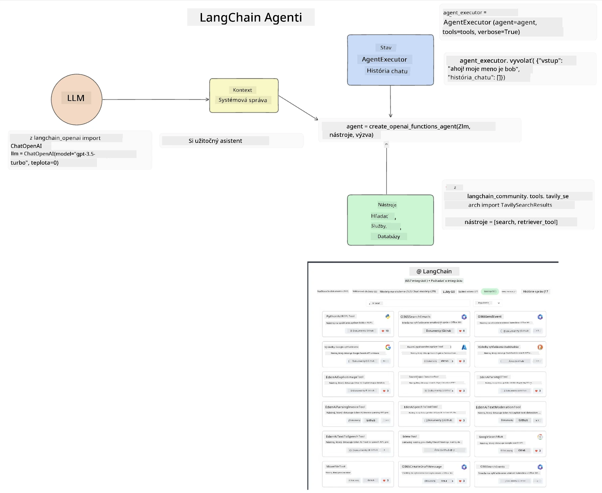
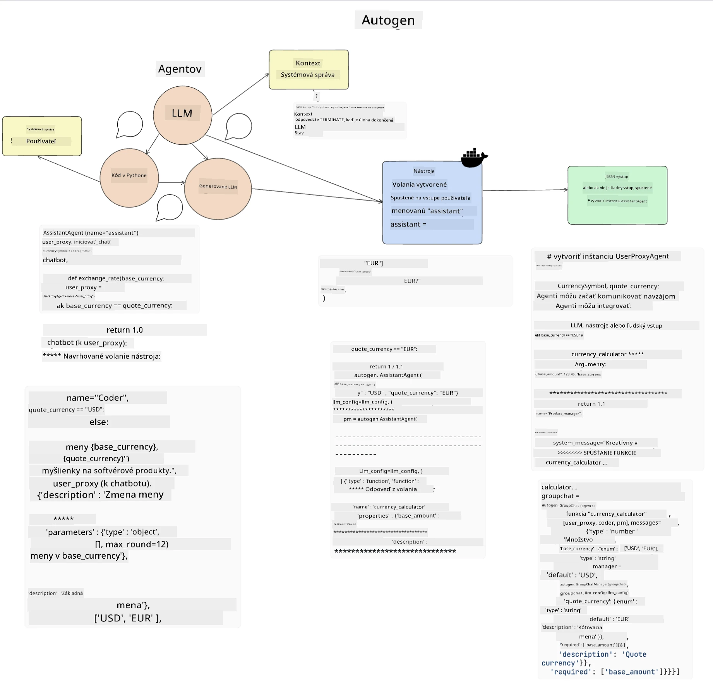
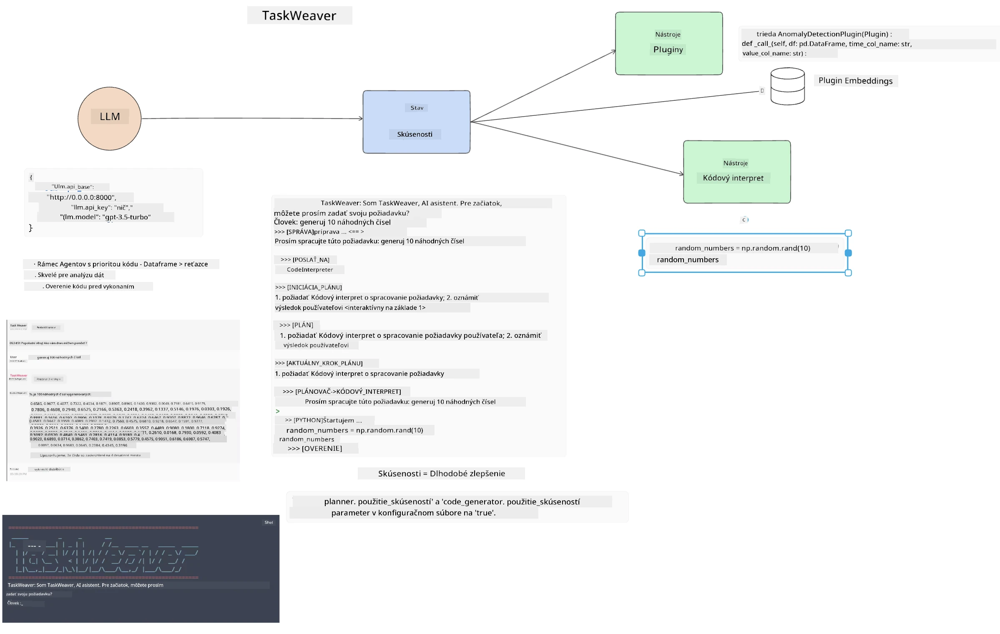

[](https://youtu.be/yAXVW-lUINc?si=bOtW9nL6jc3XJgOM)

## Úvod

AI Agenti predstavujú vzrušujúci vývoj v Generatívnej AI, ktorý umožňuje veľkým jazykovým modelom (LLM) vyvinúť sa z asistentov na agentov schopných vykonávať akcie. Rámce AI Agentov umožňujú vývojárom vytvárať aplikácie, ktoré poskytujú LLM prístup k nástrojom a správe stavu. Tieto rámce tiež zlepšujú viditeľnosť, čo umožňuje používateľom a vývojárom monitorovať akcie plánované LLM, čím sa zlepšuje správa používateľskej skúsenosti.

Lekcia pokryje nasledujúce oblasti:

- Pochopenie, čo je AI Agent - Čo presne je AI Agent?
- Preskúmanie štyroch rôznych rámcov AI Agentov - Čím sú jedinečné?
- Uplatnenie týchto AI Agentov na rôzne použitia - Kedy by sme mali používať AI Agentov?

## Ciele učenia

Po absolvovaní tejto lekcie budete schopní:

- Vysvetliť, čo sú AI Agenti a ako ich možno použiť.
- Pochopiť rozdiely medzi niektorými populárnymi rámcami AI Agentov a aké sú ich odlišnosti.
- Pochopiť, ako AI Agenti fungujú, aby ste s nimi mohli vytvárať aplikácie.

## Čo sú AI Agenti?

AI Agenti sú veľmi vzrušujúcou oblasťou v svete Generatívnej AI. S týmto vzrušením však niekedy prichádza zmätok v termínoch a ich použití. Aby sme to zjednodušili a zahrnuli väčšinu nástrojov, ktoré sa označujú ako AI Agenti, použijeme túto definíciu:

AI Agenti umožňujú veľkým jazykovým modelom (LLM) vykonávať úlohy tým, že im poskytujú prístup k **stavu** a **nástrojom**.



Definujme tieto pojmy:

**Veľké jazykové modely** - Tieto modely sú spomenuté v priebehu tohto kurzu, ako napríklad GPT-3.5, GPT-4, Llama-2 a pod.

**Stav** - Znamená to kontext, v ktorom LLM pracuje. LLM používa kontext svojich predchádzajúcich akcií a aktuálny kontext na vedenie svojho rozhodovania pri následných akciách. Rámce AI Agentov umožňujú vývojárom jednoduchšie udržiavať tento kontext.

**Nástroje** - Aby LLM dokončil úlohu, ktorú používateľ požiadal a ktorú LLM naplánoval, potrebuje prístup k nástrojom. Niektorými príkladmi nástrojov môžu byť databáza, API, externá aplikácia alebo dokonca ďalší LLM!

Tieto definície vám dúfame poskytnú dobrý základ pre ďalšie preskúmanie ich implementácie. Pozrime sa na niekoľko rôznych rámcov AI Agentov:

## LangChain Agenti

[LangChain Agents](https://python.langchain.com/docs/how_to/#agents?WT.mc_id=academic-105485-koreyst) sú implementáciou definícií, ktoré sme poskytli vyššie.

Na správu **stavu** používa vstavanú funkciu nazývanú `AgentExecutor`. Táto prijíma definovaného `agenta` a dostupné `nástroje`.

`AgentExecutor` tiež ukladá históriu chatu, aby poskytol kontext konverzácie.



LangChain ponúka [katalóg nástrojov](https://integrations.langchain.com/tools?WT.mc_id=academic-105485-koreyst), ktoré je možné importovať do vašej aplikácie, ku ktorým môže LLM získať prístup. Tieto vytvára komunita a tím LangChain.

Tieto nástroje môžete potom definovať a odovzdať ich `AgentExecutor`.

Viditeľnosť je ďalším dôležitým aspektom pri hovoroch o AI Agentocha. Je dôležité, aby vývojári aplikácií rozumeli, ktorý nástroj LLM používa a prečo. Preto tím LangChain vyvinul LangSmith.

## AutoGen

Ďalším rámcom AI Agentov, o ktorom budeme hovoriť, je [AutoGen](https://microsoft.github.io/autogen/?WT.mc_id=academic-105485-koreyst). Hlavným zameraním AutoGen sú konverzácie. Agenti sú **konverzační** a **prispôsobiteľní**.

**Konverzační** - LLM môžu začať a pokračovať v konverzácii s iným LLM, aby dokončili úlohu. To sa robí vytvorením `AssistantAgents` a priradením špecifickej systémovej správy.

```python

autogen.AssistantAgent( name="Coder", llm_config=llm_config, ) pm = autogen.AssistantAgent( name="Product_manager", system_message="Creative in software product ideas.", llm_config=llm_config, )

```

**Prispôsobiteľní** - Agentov možno definovať nielen ako LLM, ale môžu byť aj používateľmi alebo nástrojmi. Ako vývojár môžete definovať `UserProxyAgent`, ktorý je zodpovedný za interakciu s používateľom pre získanie spätnej väzby pri plnení úlohy. Táto spätná väzba môže pokračovať v vykonávaní úlohy alebo ju zastaviť.

```python
user_proxy = UserProxyAgent(name="user_proxy")
```

### Stav a Nástroje

Na zmenu a správu stavu generuje asistent Agent Python kód na dokončenie úlohy.

Tu je príklad procesu:



#### LLM definovaný systémovou správou

```python
system_message="For weather related tasks, only use the functions you have been provided with. Reply TERMINATE when the task is done."
```

Táto systémová správa usmerňuje tento konkrétny LLM, ktoré funkcie sú relevantné pre jeho úlohu. Pamätajte, že s AutoGen môžete mať niekoľko definovaných AssistantAgents so rôznymi systémovými správami.

#### Chat je iniciovaný používateľom

```python
user_proxy.initiate_chat( chatbot, message="I am planning a trip to NYC next week, can you help me pick out what to wear? ", )

```

Táto správa od user_proxy (človeka) spustí proces, v ktorom Agent skúma možné funkcie, ktoré by mal vykonať.

#### Funkcia je vykonaná

```bash
chatbot (to user_proxy):

***** Suggested tool Call: get_weather ***** Arguments: {"location":"New York City, NY","time_periond:"7","temperature_unit":"Celsius"} ******************************************************** --------------------------------------------------------------------------------

>>>>>>>> EXECUTING FUNCTION get_weather... user_proxy (to chatbot): ***** Response from calling function "get_weather" ***** 112.22727272727272 EUR ****************************************************************

```

Po spracovaní úvodného chatu Agent odošle navrhovaný nástroj na zavolanie. V tomto prípade je to funkcia nazvaná `get_weather`. V závislosti od konfigurácie môže byť táto funkcia automaticky vykonaná a interpretovaná Agentom, alebo vykonaná na základe vstupu používateľa.

Môžete nájsť zoznam [AutoGen ukážkových kódov](https://microsoft.github.io/autogen/docs/Examples/?WT.mc_id=academic-105485-koreyst), aby ste sa ďalej naučili, ako začať s tvorbou.

## Taskweaver

Ďalší rámec agentov, ktorý preskúmame, je [Taskweaver](https://microsoft.github.io/TaskWeaver/?WT.mc_id=academic-105485-koreyst). Je známy ako „code-first“ agent, pretože namiesto práce výlučne so `stringami` môže pracovať s DataFrames v Pythone. To je veľmi užitočné pri analýze dát a generovaní úloh. Môžu to byť veci ako tvorba grafov, diagramov alebo generovanie náhodných čísel.

### Stav a Nástroje

Na správu stavu konverzácie TaskWeaver používa koncept `Planner`. `Planner` je LLM, ktorý prijíma požiadavku používateľov a mapuje úlohy, ktoré treba vykonať na splnenie tejto požiadavky.

Na dokončenie úloh je `Planner` vystavený zbierke nástrojov nazývaných `Plugins`. Môžu to byť Python triedy alebo všeobecný kódový interpret. Tieto pluginy sú uložené ako embeddingy, aby LLM lepšie vyhľadával vhodný plugin.



Tu je príklad pluginu na detekciu anomálií:

```python
class AnomalyDetectionPlugin(Plugin): def __call__(self, df: pd.DataFrame, time_col_name: str, value_col_name: str):
```

Kód je overený pred vykonaním. Ďalšou funkciou na správu kontextu v Taskweaver je `experience`. Experience umožňuje, aby bol kontext konverzácie uložený dlhodobo v YAML súbore. Toto je možné konfigurovať tak, aby sa LLM časom zlepšoval pri určitých úlohách, keď je vystavený predchádzajúcim konverzáciám.

## JARVIS

Posledný rámec agentov, ktorý preskúmame, je [JARVIS](https://github.com/microsoft/JARVIS?tab=readme-ov-file&WT.mc_id=academic-105485-koreyst). Čo robí JARVIS jedinečným je, že používa LLM na správu `stavu` konverzácie a `nástroje` sú iné AI modely. Každý z týchto AI modelov je špecializovaný model, ktorý vykonáva určité úlohy, ako je detekcia objektov, prepis alebo tvorba popiskov obrázkov.


LLM, ako model všeobecného určenia, prijíme požiadavku od používateľa a identifikuje konkrétnu úlohu a akékoľvek argumenty/dáta potrebné na jej dokončenie.

```python
[{"task": "object-detection", "id": 0, "dep": [-1], "args": {"image": "e1.jpg" }}]
```

LLM potom formátuje požiadavku tak, aby ju špecializovaný AI model mohol interpretovať, napríklad vo formáte JSON. Po tom, čo AI model vráti svoje predpovede na základe úlohy, LLM prijíma odpoveď.

Ak je potrebných viac modelov na dokončenie úlohy, LLM tiež interpretuje odpovede týchto modelov, skombinuje ich a následne vygeneruje odpoveď pre používateľa.

Nižšie uvedený príklad ukazuje, ako by to fungovalo, keď používateľ žiada o popis a počet objektov na obrázku:

## Zadanie

Aby ste pokračovali vo svojom učení o AI Agentoch, môžete vytvoriť pomocou AutoGen:

- Aplikáciu, ktorá simuluje obchodné stretnutie s rôznymi oddeleniami vzdelávacieho startupu.
- Vytvorte systémové správy, ktoré vedú LLM k pochopeniu rôznych osobností a priorít, a umožnia používateľovi predstaviť nový produkt.
- LLM by mal následne generovať doplňujúce otázky od každého oddelenia, aby sa zlepšila a spresnila prezentácia a produktový nápad.

## Učenie tu nekončí, pokračujte na ďalšiu cestu

Po dokončení tejto lekcie si pozrite našu [kolekciu učenia o Generatívnej AI](https://aka.ms/genai-collection?WT.mc_id=academic-105485-koreyst), aby ste naďalej zvyšovali svoje vedomosti o Generatívnej AI!

---

<!-- CO-OP TRANSLATOR DISCLAIMER START -->
**Vyhlásenie o vylúčení zodpovednosti**:  
Tento dokument bol preložený pomocou AI prekladateľskej služby [Co-op Translator](https://github.com/Azure/co-op-translator). Aj keď sa snažíme o presnosť, majte prosím na pamäti, že automatizované preklady môžu obsahovať chyby alebo nepresnosti. Pôvodný dokument v jeho rodnom jazyku by mal byť považovaný za autoritatívny zdroj. Pre kritické informácie sa odporúča profesionálny ľudský preklad. Nie sme zodpovední za akékoľvek nedorozumenia alebo nesprávne výklady vyplývajúce z použitia tohto prekladu.
<!-- CO-OP TRANSLATOR DISCLAIMER END -->