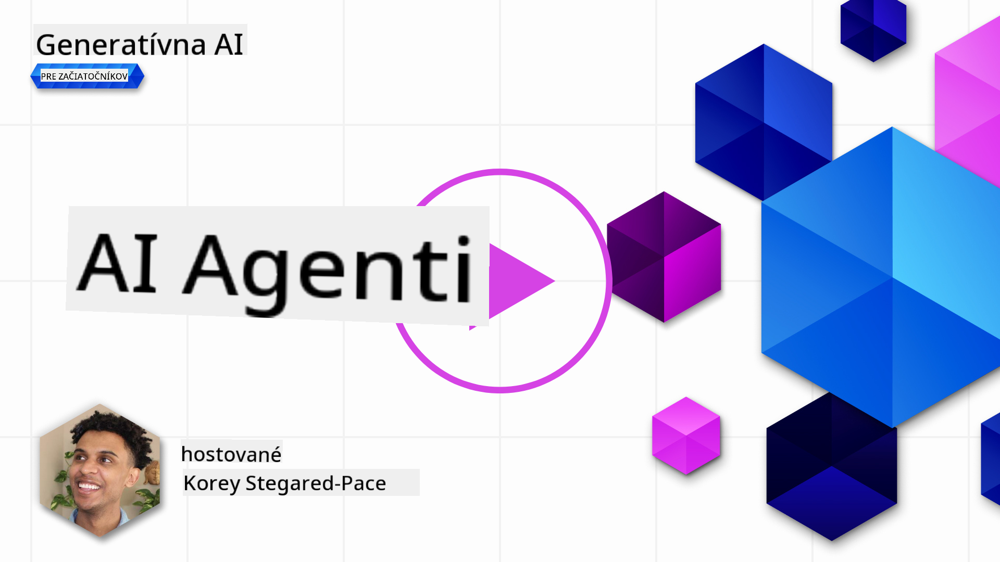
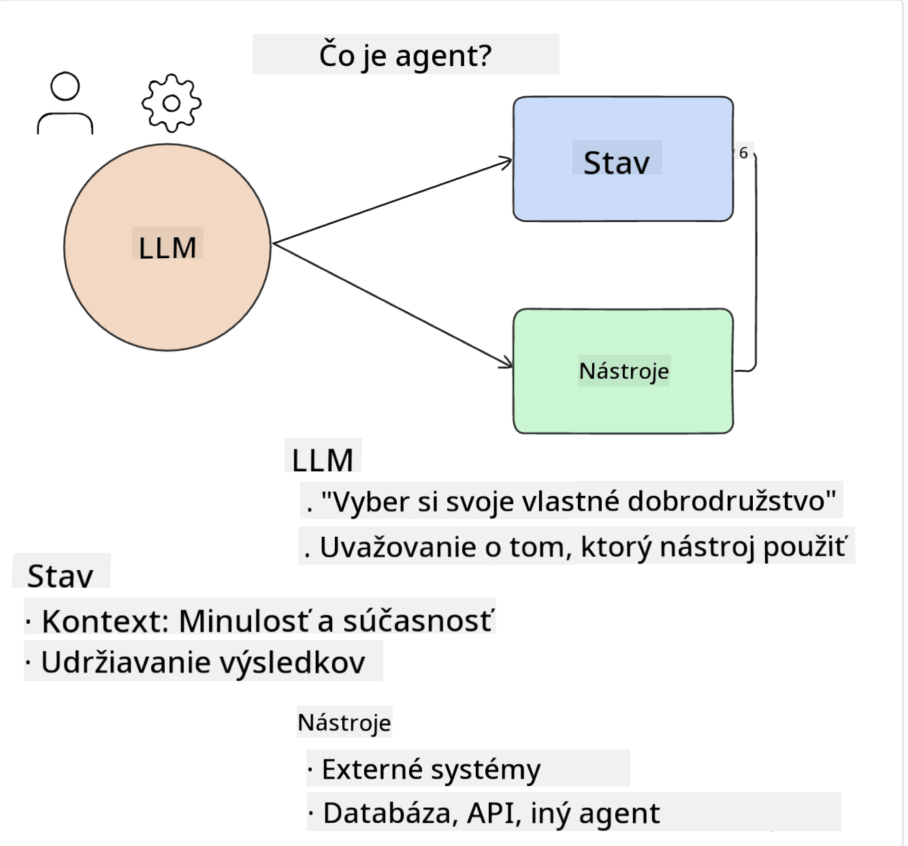
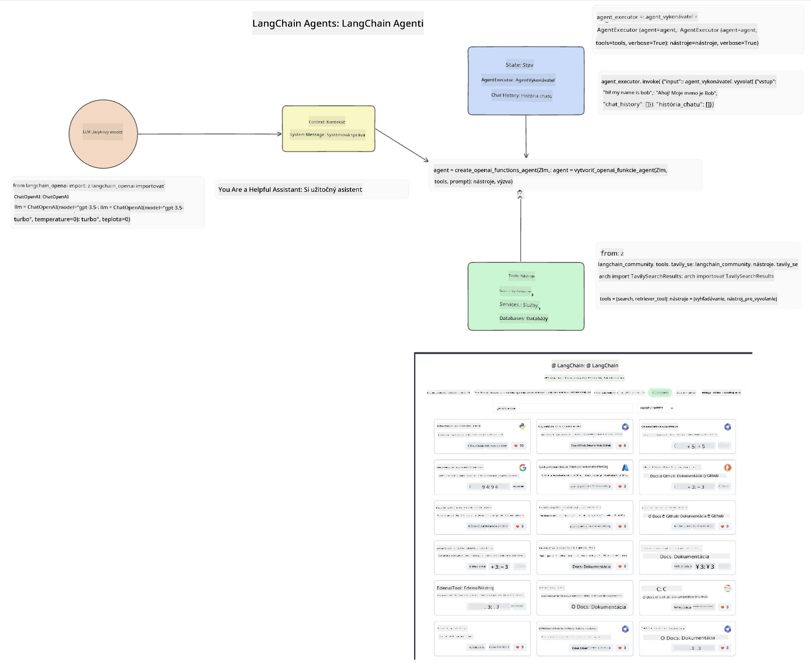
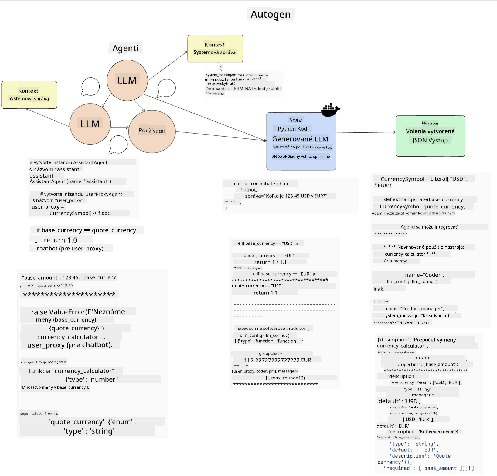
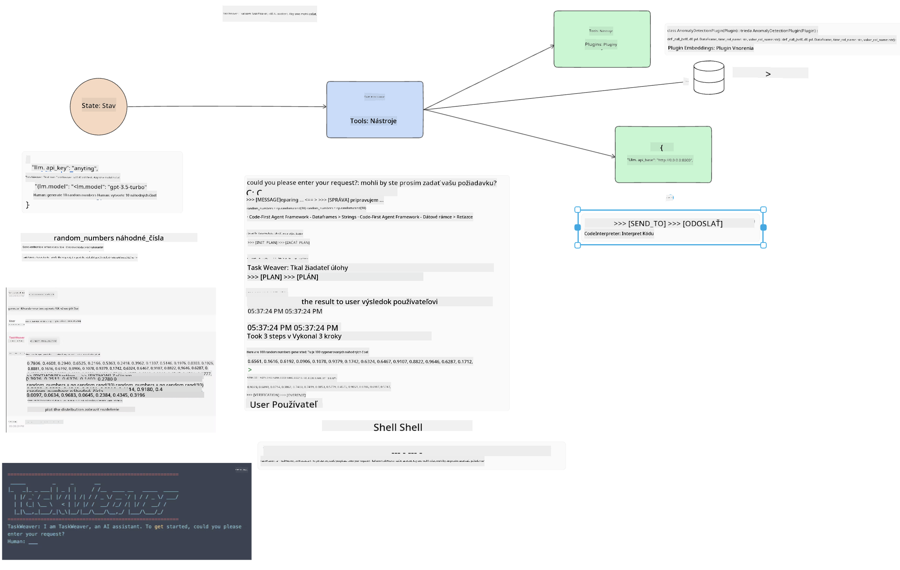
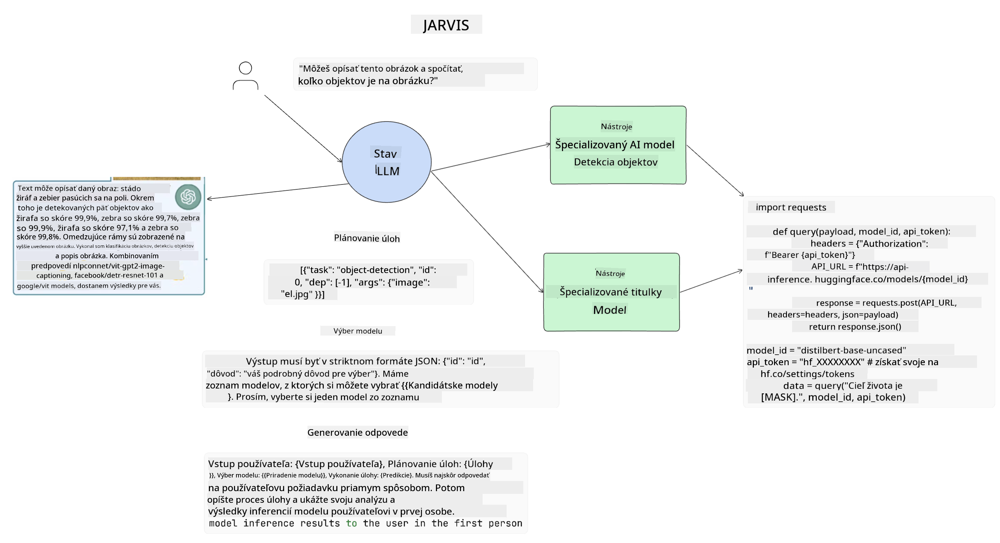

<!--
CO_OP_TRANSLATOR_METADATA:
{
  "original_hash": "11f03c81f190d9cbafd0f977dcbede6c",
  "translation_date": "2025-06-26T00:24:45+00:00",
  "source_file": "17-ai-agents/README.md",
  "language_code": "sk"
}
-->
[](https://aka.ms/gen-ai-lesson17-gh?WT.mc_id=academic-105485-koreyst)

## Úvod

AI agenti predstavujú vzrušujúci vývoj v oblasti generatívnej AI, umožňujúci veľkým jazykovým modelom (LLM) vyvinúť sa z asistentov na agentov schopných vykonávať akcie. Rámce AI agentov umožňujú vývojárom vytvárať aplikácie, ktoré dávajú LLM prístup k nástrojom a správe stavu. Tieto rámce tiež zvyšujú viditeľnosť, umožňujúc používateľom a vývojárom sledovať akcie plánované LLM, čím zlepšujú správu skúseností.

Lekcia pokryje nasledujúce oblasti:

- Porozumenie tomu, čo je AI agent - Čo presne je AI agent?
- Preskúmanie štyroch rôznych rámcov AI agentov - Čo ich robí jedinečnými?
- Použitie týchto AI agentov na rôzne prípady použitia - Kedy by sme mali používať AI agentov?

## Ciele učenia

Po absolvovaní tejto lekcie budete schopní:

- Vysvetliť, čo sú AI agenti a ako ich možno použiť.
- Mať pochopenie rozdielov medzi niektorými populárnymi rámcami AI agentov a ako sa líšia.
- Porozumieť tomu, ako AI agenti fungujú, aby ste mohli s nimi vytvárať aplikácie.

## Čo sú AI agenti?

AI agenti sú veľmi vzrušujúcou oblasťou vo svete generatívnej AI. S týmto vzrušením prichádza niekedy zmätok v termínoch a ich použití. Aby sme veci udržali jednoduché a zahrnuli väčšinu nástrojov, ktoré sa odkazujú na AI agentov, použijeme túto definíciu:

AI agenti umožňujú veľkým jazykovým modelom (LLM) vykonávať úlohy tým, že im poskytujú prístup k **stavu** a **nástrojom**.



Definujme tieto pojmy:

**Veľké jazykové modely** - Toto sú modely, na ktoré sa odkazuje v celom tomto kurze, ako napríklad GPT-3.5, GPT-4, Llama-2 atď.

**Stav** - Toto sa týka kontextu, v ktorom LLM pracuje. LLM používa kontext svojich minulých akcií a aktuálny kontext, ktorý vedie jeho rozhodovanie pre nasledujúce akcie. Rámce AI agentov umožňujú vývojárom ľahšie udržiavať tento kontext.

**Nástroje** - Na dokončenie úlohy, ktorú používateľ požiadal a ktorú LLM naplánoval, LLM potrebuje prístup k nástrojom. Niektoré príklady nástrojov môžu byť databáza, API, externá aplikácia alebo dokonca iný LLM!

Tieto definície vám dúfajme poskytnú dobrý základ do budúcnosti, keď sa pozrieme na ich implementáciu. Preskúmajme niekoľko rôznych rámcov AI agentov:

## LangChain Agents

[LangChain Agents](https://python.langchain.com/docs/how_to/#agents?WT.mc_id=academic-105485-koreyst) je implementácia definícií, ktoré sme poskytli vyššie.

Na správu **stavu** používa vstavanú funkciu nazvanú `AgentExecutor`. Táto akceptuje definované `agent` a `tools`, ktoré sú k dispozícii.

`Agent Executor` tiež uchováva históriu chatu, aby poskytla kontext chatu.



LangChain ponúka [katalóg nástrojov](https://integrations.langchain.com/tools?WT.mc_id=academic-105485-koreyst), ktoré môžu byť importované do vašej aplikácie, v ktorej LLM môže získať prístup. Tieto sú vytvorené komunitou a tímom LangChain.

Potom môžete definovať tieto nástroje a odovzdať ich `Agent Executor`.

Viditeľnosť je ďalším dôležitým aspektom, keď hovoríme o AI agentoch. Je dôležité, aby vývojári aplikácií pochopili, ktorý nástroj LLM používa a prečo. Na to tím v LangChain vyvinul LangSmith.

## AutoGen

Ďalším rámcom AI agentov, ktorý budeme diskutovať, je [AutoGen](https://microsoft.github.io/autogen/?WT.mc_id=academic-105485-koreyst). Hlavným zameraním AutoGen je konverzácia. Agenti sú **konverzovateľní** a **prispôsobiteľní**.

**Konverzovateľní -** LLM môžu začať a pokračovať v konverzácii s iným LLM, aby dokončili úlohu. To sa robí vytvorením `AssistantAgents` a poskytnutím im špecifickej systémovej správy.

```python

autogen.AssistantAgent( name="Coder", llm_config=llm_config, ) pm = autogen.AssistantAgent( name="Product_manager", system_message="Creative in software product ideas.", llm_config=llm_config, )

```

**Prispôsobiteľní** - Agenti môžu byť definovaní nielen ako LLM, ale aj ako používateľ alebo nástroj. Ako vývojár môžete definovať `UserProxyAgent`, ktorý je zodpovedný za interakciu s používateľom pre spätnú väzbu pri dokončovaní úlohy. Táto spätná väzba môže buď pokračovať v vykonávaní úlohy, alebo ju zastaviť.

```python
user_proxy = UserProxyAgent(name="user_proxy")
```

### Stav a nástroje

Na zmenu a správu stavu asistent Agent generuje Python kód na dokončenie úlohy.

Tu je príklad procesu:



#### LLM definovaný so systémovou správou

```python
system_message="For weather related tasks, only use the functions you have been provided with. Reply TERMINATE when the task is done."
```

Táto systémová správa smeruje tento konkrétny LLM k tomu, ktoré funkcie sú relevantné pre jeho úlohu. Pamätajte, že s AutoGen môžete mať viac definovaných AssistantAgents s rôznymi systémovými správami.

#### Chat iniciovaný používateľom

```python
user_proxy.initiate_chat( chatbot, message="I am planning a trip to NYC next week, can you help me pick out what to wear? ", )

```

Táto správa od user_proxy (človek) je to, čo začne proces agenta skúmať možné funkcie, ktoré by mal vykonať.

#### Funkcia je vykonaná

```bash
chatbot (to user_proxy):

***** Suggested tool Call: get_weather ***** Arguments: {"location":"New York City, NY","time_periond:"7","temperature_unit":"Celsius"} ******************************************************** --------------------------------------------------------------------------------

>>>>>>>> EXECUTING FUNCTION get_weather... user_proxy (to chatbot): ***** Response from calling function "get_weather" ***** 112.22727272727272 EUR ****************************************************************

```

Keď je počiatočný chat spracovaný, agent pošle navrhovaný nástroj na volanie. V tomto prípade ide o funkciu nazvanú `get_weather`. Depending on your configuration, this function can be automatically executed and read by the Agent or can be executed based on user input.

You can find a list of [AutoGen code samples](https://microsoft.github.io/autogen/docs/Examples/?WT.mc_id=academic-105485-koreyst) to further explore how to get started building.

## Taskweaver

The next agent framework we will explore is [Taskweaver](https://microsoft.github.io/TaskWeaver/?WT.mc_id=academic-105485-koreyst). It is known as a "code-first" agent because instead of working strictly with `strings` , it can work with DataFrames in Python. This becomes extremely useful for data analysis and generation tasks. This can be things like creating graphs and charts or generating random numbers.

### State and Tools

To manage the state of the conversation, TaskWeaver uses the concept of a `Planner`. The `Planner` is a LLM that takes the request from the users and maps out the tasks that need to be completed to fulfill this request.

To complete the tasks the `Planner` is exposed to the collection of tools called `Plugins`. Môže ísť o Python triedy alebo všeobecný interpret kódu. Tieto pluginy sú uložené ako embeddingy, aby LLM mohol lepšie hľadať správny plugin.



Tu je príklad pluginu na riešenie detekcie anomálií:

```python
class AnomalyDetectionPlugin(Plugin): def __call__(self, df: pd.DataFrame, time_col_name: str, value_col_name: str):
```

Kód je overený pred vykonaním. Ďalšou funkciou na správu kontextu v Taskweaver je `experience`. Experience allows for the context of a conversation to be stored over to the long term in a YAML file. This can be configured so that the LLM improves over time on certain tasks given that it is exposed to prior conversations.

## JARVIS

The last agent framework we will explore is [JARVIS](https://github.com/microsoft/JARVIS?tab=readme-ov-file?WT.mc_id=academic-105485-koreyst). What makes JARVIS unique is that it uses an LLM to manage the `state` konverzácie a `tools` sú iné AI modely. Každý z AI modelov sú špecializované modely, ktoré vykonávajú určité úlohy, ako je detekcia objektov, transkripcia alebo popis obrázkov.



LLM, ako všeobecný model, prijíma požiadavku od používateľa a identifikuje konkrétnu úlohu a akékoľvek argumenty/dáta, ktoré sú potrebné na dokončenie úlohy.

```python
[{"task": "object-detection", "id": 0, "dep": [-1], "args": {"image": "e1.jpg" }}]
```

LLM potom formátuje požiadavku spôsobom, ktorý špecializovaný AI model môže interpretovať, ako napríklad JSON. Keď AI model vráti svoju predikciu na základe úlohy, LLM prijíma odpoveď.

Ak je potrebné na dokončenie úlohy viac modelov, tiež interpretuje odpoveď z týchto modelov pred ich zjednotením, aby vytvoril odpoveď používateľovi.

Nižšie uvedený príklad ukazuje, ako by to fungovalo, keď používateľ požaduje popis a počet objektov na obrázku:

## Zadanie

Na pokračovanie vo vašom učení sa o AI agentoch môžete budovať s AutoGen:

- Aplikáciu, ktorá simuluje obchodné stretnutie s rôznymi oddeleniami startupu v oblasti vzdelávania.
- Vytvorte systémové správy, ktoré vedú LLM k pochopeniu rôznych osobností a priorít a umožnite používateľovi prezentovať nový produktový nápad.
- LLM by potom mal generovať následné otázky z každého oddelenia na zdokonalenie a zlepšenie prezentácie a produktového nápadu.

## Učenie sa nekončí tu, pokračujte v ceste

Po absolvovaní tejto lekcie si pozrite našu [zbierku učenia o generatívnej AI](https://aka.ms/genai-collection?WT.mc_id=academic-105485-koreyst), aby ste pokračovali v zvyšovaní svojich znalostí o generatívnej AI!

**Upozornenie**:  
Tento dokument bol preložený pomocou služby AI prekladania [Co-op Translator](https://github.com/Azure/co-op-translator). Aj keď sa snažíme o presnosť, uvedomte si, že automatizované preklady môžu obsahovať chyby alebo nepresnosti. Pôvodný dokument v jeho rodnom jazyku by mal byť považovaný za autoritatívny zdroj. Pre kritické informácie sa odporúča profesionálny ľudský preklad. Nie sme zodpovední za akékoľvek nedorozumenia alebo nesprávne interpretácie vyplývajúce z použitia tohto prekladu.