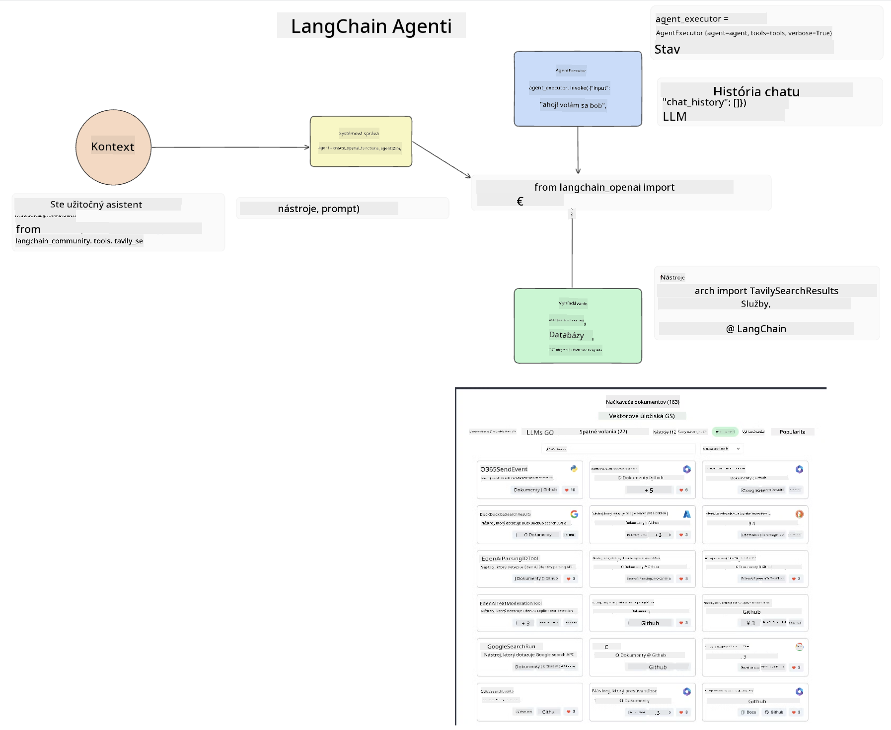

<!--
CO_OP_TRANSLATOR_METADATA:
{
  "original_hash": "11f03c81f190d9cbafd0f977dcbede6c",
  "translation_date": "2025-07-09T17:30:51+00:00",
  "source_file": "17-ai-agents/README.md",
  "language_code": "sk"
}
-->
[](https://aka.ms/gen-ai-lesson17-gh?WT.mc_id=academic-105485-koreyst)

## Úvod

AI Agentov predstavujú vzrušujúci vývoj v oblasti Generatívnej AI, ktorý umožňuje veľkým jazykovým modelom (LLM) prejsť z asistentov na agentov schopných vykonávať akcie. Rámce pre AI Agentov umožňujú vývojárom vytvárať aplikácie, ktoré dávajú LLM prístup k nástrojom a správe stavu. Tieto rámce tiež zlepšujú prehľadnosť, čo umožňuje používateľom a vývojárom sledovať plánované akcie LLM, čím sa zlepšuje správa používateľského zážitku.

Táto lekcia pokryje nasledujúce oblasti:

- Pochopenie, čo je AI Agent – Čo presne znamená AI Agent?
- Preskúmanie štyroch rôznych rámcov pre AI Agentov – Čím sú jedinečné?
- Aplikovanie týchto AI Agentov na rôzne prípady použitia – Kedy by sme mali používať AI Agentov?

## Ciele učenia

Po absolvovaní tejto lekcie budete schopní:

- Vysvetliť, čo sú AI Agenti a ako ich možno využiť.
- Pochopiť rozdiely medzi niektorými populárnymi rámcami pre AI Agentov a ich odlišnosti.
- Rozumieť fungovaniu AI Agentov, aby ste mohli s nimi vytvárať aplikácie.

## Čo sú AI Agenti?

AI Agenti sú veľmi vzrušujúcou oblasťou v svete Generatívnej AI. S týmto nadšením však niekedy prichádza zmätok v pojmoch a ich použití. Aby sme to zjednodušili a zahrnuli väčšinu nástrojov, ktoré sa označujú ako AI Agenti, použijeme túto definíciu:

AI Agenti umožňujú veľkým jazykovým modelom (LLM) vykonávať úlohy tým, že im poskytujú prístup k **stavu** a **nástrojom**.


Definujme si tieto pojmy:

**Veľké jazykové modely** – Sú to modely, o ktorých sa v tomto kurze hovorí, ako napríklad GPT-3.5, GPT-4, Llama-2 a podobne.

**Stav** – Označuje kontext, v ktorom LLM pracuje. LLM využíva kontext svojich predchádzajúcich akcií a aktuálny kontext, ktorý riadi jeho rozhodovanie pri ďalších krokoch. Rámce pre AI Agentov umožňujú vývojárom jednoduchšie udržiavať tento kontext.

**Nástroje** – Aby LLM mohol splniť úlohu, ktorú používateľ požaduje a ktorú si naplánoval, potrebuje prístup k nástrojom. Príkladmi nástrojov môžu byť databáza, API, externá aplikácia alebo dokonca iný LLM!

Tieto definície vám dúfame poskytnú dobrý základ na ďalšie štúdium implementácie. Pozrime sa na niekoľko rôznych rámcov pre AI Agentov:

## LangChain Agents

[LangChain Agents](https://python.langchain.com/docs/how_to/#agents?WT.mc_id=academic-105485-koreyst) sú implementáciou vyššie uvedených definícií.

Na správu **stavu** používa vstavanú funkciu nazvanú `AgentExecutor`. Tá prijíma definovaného `agenta` a dostupné `nástroje`.

`AgentExecutor` tiež uchováva históriu chatu, aby poskytol kontext konverzácie.



LangChain ponúka [katalóg nástrojov](https://integrations.langchain.com/tools?WT.mc_id=academic-105485-koreyst), ktoré je možné importovať do vašej aplikácie a ku ktorým môže LLM získať prístup. Tieto nástroje vytvára komunita aj tím LangChain.

Tieto nástroje potom môžete definovať a odovzdať do `AgentExecutor`.

Prehľadnosť je ďalším dôležitým aspektom pri AI Agento. Je dôležité, aby vývojári aplikácií rozumeli, ktorý nástroj LLM používa a prečo. Preto tím LangChain vyvinul LangSmith.

## AutoGen

Ďalším rámcom pre AI Agentov, ktorý si predstavíme, je [AutoGen](https://microsoft.github.io/autogen/?WT.mc_id=academic-105485-koreyst). Hlavným zameraním AutoGen sú konverzácie. Agenti sú zároveň **konverzační** a **prispôsobiteľní**.

**Konverzační** – LLM môžu začať a pokračovať v konverzácii s iným LLM, aby splnili úlohu. Toto sa dosahuje vytváraním `AssistantAgents` a priradením konkrétnej systémovej správy.

```python

autogen.AssistantAgent( name="Coder", llm_config=llm_config, ) pm = autogen.AssistantAgent( name="Product_manager", system_message="Creative in software product ideas.", llm_config=llm_config, )

```

**Prispôsobiteľní** – Agenti nemusia byť definovaní len ako LLM, ale môžu byť aj používateľ alebo nástroj. Ako vývojár môžete definovať `UserProxyAgent`, ktorý je zodpovedný za interakciu s používateľom a získavanie spätnej väzby pri plnení úlohy. Táto spätná väzba môže buď pokračovať v vykonávaní úlohy, alebo ju zastaviť.

```python
user_proxy = UserProxyAgent(name="user_proxy")
```

### Stav a nástroje

Na zmenu a správu stavu generuje asistent Agent Python kód na dokončenie úlohy.

Tu je príklad tohto procesu:


#### LLM definovaný systémovou správou

```python
system_message="For weather related tasks, only use the functions you have been provided with. Reply TERMINATE when the task is done."
```

Táto systémová správa usmerňuje konkrétny LLM, ktoré funkcie sú relevantné pre jeho úlohu. Pamätajte, že v AutoGen môžete mať viacero definovaných AssistantAgents s rôznymi systémovými správami.

#### Konverzácia je iniciovaná používateľom

```python
user_proxy.initiate_chat( chatbot, message="I am planning a trip to NYC next week, can you help me pick out what to wear? ", )

```

Táto správa od user_proxy (človeka) spustí proces, v ktorom Agent preskúma možné funkcie, ktoré by mal vykonať.

#### Funkcia je vykonaná

```bash
chatbot (to user_proxy):

***** Suggested tool Call: get_weather ***** Arguments: {"location":"New York City, NY","time_periond:"7","temperature_unit":"Celsius"} ******************************************************** --------------------------------------------------------------------------------

>>>>>>>> EXECUTING FUNCTION get_weather... user_proxy (to chatbot): ***** Response from calling function "get_weather" ***** 112.22727272727272 EUR ****************************************************************

```

Po spracovaní počiatočnej správy Agent navrhne nástroj na zavolanie. V tomto prípade ide o funkciu `get_weather`. Podľa vašej konfigurácie môže byť táto funkcia automaticky vykonaná a jej výsledok prečítaný Agentom, alebo sa vykoná na základe vstupu používateľa.

Pre ďalšie štúdium, ako začať s vývojom, nájdete zoznam [AutoGen ukážok kódu](https://microsoft.github.io/autogen/docs/Examples/?WT.mc_id=academic-105485-koreyst).

## Taskweaver

Ďalším rámcom, ktorý preskúmame, je [Taskweaver](https://microsoft.github.io/TaskWeaver/?WT.mc_id=academic-105485-koreyst). Je známy ako „code-first“ agent, pretože namiesto práce výhradne so `stringami` môže pracovať s DataFrames v Pythone. To je mimoriadne užitočné pre úlohy analýzy a generovania dát, ako napríklad tvorba grafov, diagramov alebo generovanie náhodných čísel.

### Stav a nástroje

Na správu stavu konverzácie používa TaskWeaver koncept `Planner`. `Planner` je LLM, ktorý prijíma požiadavky od používateľov a mapuje úlohy, ktoré je potrebné splniť na ich realizáciu.

Na dokončenie úloh má `Planner` prístup ku kolekcii nástrojov nazývaných `Plugins`. Môžu to byť Python triedy alebo všeobecný kódový interpret. Tieto pluginy sú uložené ako embeddingy, aby LLM mohol efektívnejšie vyhľadávať správny plugin.


Tu je príklad pluginu na detekciu anomálií:

```python
class AnomalyDetectionPlugin(Plugin): def __call__(self, df: pd.DataFrame, time_col_name: str, value_col_name: str):
```

Kód je overený pred vykonaním. Ďalšou funkciou na správu kontextu v Taskweaver je `experience`. Experience umožňuje dlhodobé ukladanie kontextu konverzácie do YAML súboru. Toto je možné nakonfigurovať tak, aby sa LLM časom zlepšoval v určitých úlohách na základe predchádzajúcich konverzácií.

## JARVIS

Posledným rámcom, ktorý preskúmame, je [JARVIS](https://github.com/microsoft/JARVIS?tab=readme-ov-file?WT.mc_id=academic-105485-koreyst). Čo robí JARVIS jedinečným, je to, že používa LLM na správu `stavu` konverzácie a `nástroje` sú iné AI modely. Každý z týchto AI modelov je špecializovaný na konkrétne úlohy, ako je detekcia objektov, prepis alebo popis obrázkov.


LLM, ako model všeobecného určenia, prijíma požiadavku od používateľa, identifikuje konkrétnu úlohu a akékoľvek argumenty alebo dáta potrebné na jej splnenie.

```python
[{"task": "object-detection", "id": 0, "dep": [-1], "args": {"image": "e1.jpg" }}]
```

LLM potom formátuje požiadavku tak, aby ju špecializovaný AI model vedel interpretovať, napríklad vo formáte JSON. Keď AI model vráti predikciu na základe úlohy, LLM prijme odpoveď.

Ak je na splnenie úlohy potrebných viac modelov, LLM tiež interpretuje odpovede týchto modelov, než ich spojí do finálnej odpovede pre používateľa.

Príklad nižšie ukazuje, ako by to fungovalo, keď používateľ žiada o popis a počet objektov na obrázku:

## Zadanie

Na pokračovanie vo vašom učení o AI Agento môžete s AutoGen vytvoriť:

- Aplikáciu, ktorá simuluje obchodné stretnutie rôznych oddelení vzdelávacieho startupu.
- Vytvoriť systémové správy, ktoré pomáhajú LLM pochopiť rôzne persony a priority a umožňujú používateľovi predstaviť nový produkt.
- LLM by mal potom generovať doplňujúce otázky od každého oddelenia na upresnenie a zlepšenie prezentácie a produktového nápadu.

## Učenie tu nekončí, pokračujte v ceste

Po dokončení tejto lekcie si pozrite našu [kolekciu Generatívnej AI](https://aka.ms/genai-collection?WT.mc_id=academic-105485-koreyst), aby ste naďalej rozvíjali svoje znalosti v oblasti Generatívnej AI!

**Vyhlásenie o zodpovednosti**:  
Tento dokument bol preložený pomocou AI prekladateľskej služby [Co-op Translator](https://github.com/Azure/co-op-translator). Hoci sa snažíme o presnosť, prosím, majte na pamäti, že automatizované preklady môžu obsahovať chyby alebo nepresnosti. Originálny dokument v jeho pôvodnom jazyku by mal byť považovaný za autoritatívny zdroj. Pre kritické informácie sa odporúča profesionálny ľudský preklad. Nie sme zodpovední za akékoľvek nedorozumenia alebo nesprávne interpretácie vyplývajúce z použitia tohto prekladu.