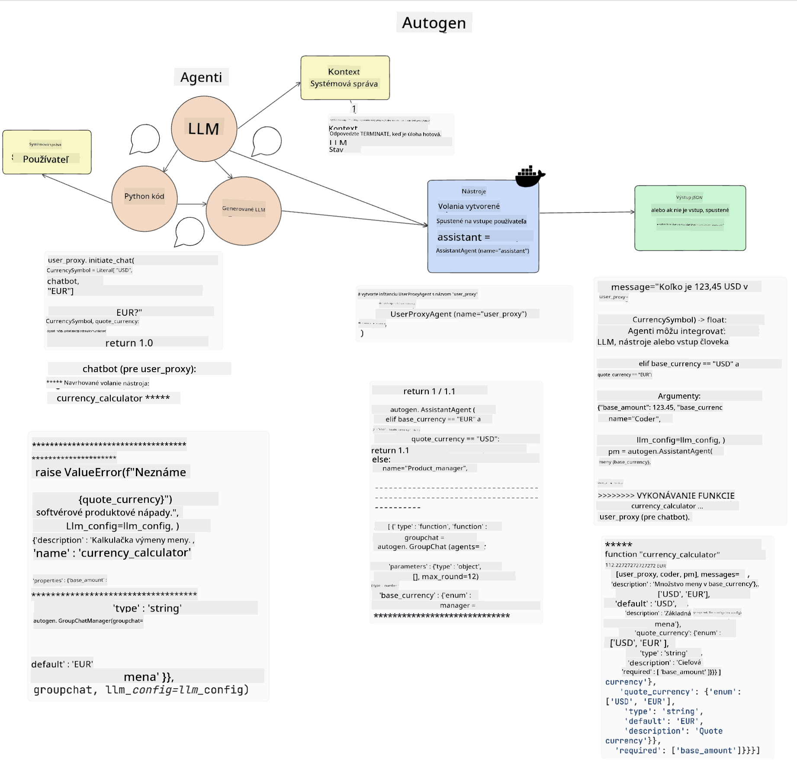
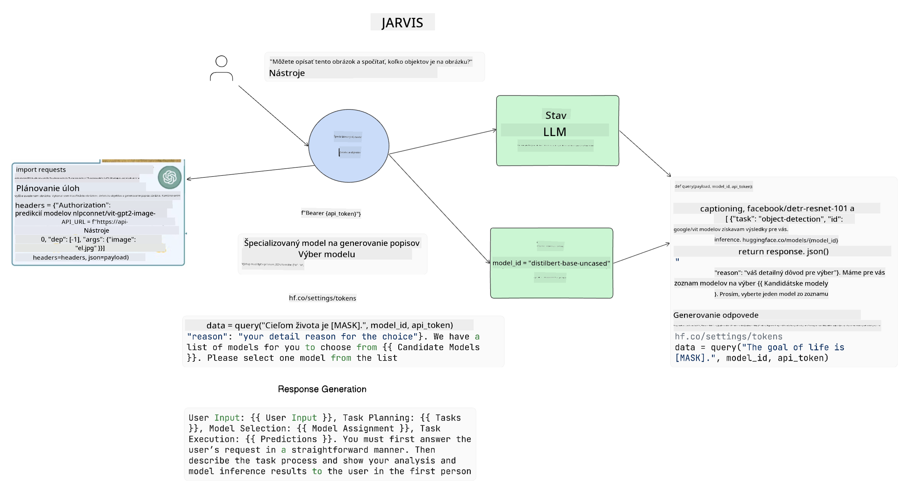

<!--
CO_OP_TRANSLATOR_METADATA:
{
  "original_hash": "8e8d1f6a63da606af7176a87ff8e92b6",
  "translation_date": "2025-10-17T22:01:55+00:00",
  "source_file": "17-ai-agents/README.md",
  "language_code": "sk"
}
-->
[](https://youtu.be/yAXVW-lUINc?si=bOtW9nL6jc3XJgOM)

## Úvod

AI agenti predstavujú vzrušujúci vývoj v oblasti generatívnej AI, ktorý umožňuje veľkým jazykovým modelom (LLM) vyvíjať sa z asistentov na agentov schopných vykonávať akcie. Rámce AI agentov umožňujú vývojárom vytvárať aplikácie, ktoré poskytujú LLM prístup k nástrojom a správe stavu. Tieto rámce tiež zlepšujú viditeľnosť, umožňujú používateľom a vývojárom sledovať akcie plánované LLM, čím sa zlepšuje správa skúseností.

Táto lekcia pokryje nasledujúce oblasti:

- Pochopenie, čo je AI agent - Čo presne je AI agent?
- Preskúmanie štyroch rôznych rámcov AI agentov - Čo ich robí jedinečnými?
- Použitie týchto AI agentov na rôzne prípady použitia - Kedy by sme mali používať AI agentov?

## Ciele učenia

Po absolvovaní tejto lekcie budete schopní:

- Vysvetliť, čo sú AI agenti a ako ich možno použiť.
- Porozumieť rozdielom medzi niektorými populárnymi rámcami AI agentov a ich odlišnosťami.
- Pochopiť, ako AI agenti fungujú, aby ste mohli s nimi vytvárať aplikácie.

## Čo sú AI agenti?

AI agenti sú veľmi vzrušujúcou oblasťou vo svete generatívnej AI. S týmto nadšením však niekedy prichádza zmätok v pojmoch a ich aplikácii. Aby sme veci zjednodušili a zahrnuli väčšinu nástrojov, ktoré sa odvolávajú na AI agentov, použijeme túto definíciu:

AI agenti umožňujú veľkým jazykovým modelom (LLM) vykonávať úlohy tým, že im poskytujú prístup k **stavu** a **nástrojom**.


Definujme si tieto pojmy:

**Veľké jazykové modely** - Ide o modely, ktoré sa spomínajú v celom tomto kurze, ako napríklad GPT-3.5, GPT-4, Llama-2, atď.

**Stav** - Týka sa kontextu, v ktorom LLM pracuje. LLM využíva kontext svojich minulých akcií a aktuálny kontext, aby usmernil svoje rozhodovanie pre nasledujúce akcie. Rámce AI agentov umožňujú vývojárom jednoduchšie udržiavať tento kontext.

**Nástroje** - Na splnenie úlohy, ktorú používateľ požaduje a ktorú LLM naplánoval, potrebuje LLM prístup k nástrojom. Niektoré príklady nástrojov môžu byť databáza, API, externá aplikácia alebo dokonca iný LLM!

Tieto definície by vám mali poskytnúť dobrý základ na ďalšie skúmanie ich implementácie. Poďme preskúmať niekoľko rôznych rámcov AI agentov:

## LangChain Agents

[LangChain Agents](https://python.langchain.com/docs/how_to/#agents?WT.mc_id=academic-105485-koreyst) je implementácia definícií, ktoré sme uviedli vyššie.

Na správu **stavu** používa zabudovanú funkciu nazývanú `AgentExecutor`. Táto funkcia prijíma definovaného `agenta` a dostupné `nástroje`.

`AgentExecutor` tiež uchováva históriu chatu, aby poskytol kontext chatu.


LangChain ponúka [katalóg nástrojov](https://integrations.langchain.com/tools?WT.mc_id=academic-105485-koreyst), ktoré je možné importovať do vašej aplikácie, v ktorej LLM môže získať prístup. Tieto nástroje sú vytvorené komunitou a tímom LangChain.

Potom môžete definovať tieto nástroje a odovzdať ich `AgentExecutor`.

Viditeľnosť je ďalším dôležitým aspektom pri diskusii o AI agentoch. Je dôležité, aby vývojári aplikácií pochopili, ktorý nástroj LLM používa a prečo. Na tento účel tím LangChain vyvinul LangSmith.

## AutoGen

Ďalší rámec AI agentov, ktorý budeme diskutovať, je [AutoGen](https://microsoft.github.io/autogen/?WT.mc_id=academic-105485-koreyst). Hlavným zameraním AutoGen je komunikácia. Agenti sú zároveň **komunikatívni** a **prispôsobiteľní**.

**Komunikatívni -** LLM môžu začať a pokračovať v konverzácii s iným LLM, aby splnili úlohu. To sa dosahuje vytvorením `AssistantAgents` a poskytnutím konkrétnej systémovej správy.

```python

autogen.AssistantAgent( name="Coder", llm_config=llm_config, ) pm = autogen.AssistantAgent( name="Product_manager", system_message="Creative in software product ideas.", llm_config=llm_config, )

```

**Prispôsobiteľní** - Agenti môžu byť definovaní nielen ako LLM, ale aj ako používateľ alebo nástroj. Ako vývojár môžete definovať `UserProxyAgent`, ktorý je zodpovedný za interakciu s používateľom na získanie spätnej väzby pri plnení úlohy. Táto spätná väzba môže buď pokračovať v vykonávaní úlohy, alebo ju zastaviť.

```python
user_proxy = UserProxyAgent(name="user_proxy")
```

### Stav a nástroje

Na zmenu a správu stavu generuje asistent Agent kód v jazyku Python na splnenie úlohy.

Tu je príklad procesu:



#### LLM definovaný systémovou správou

```python
system_message="For weather related tasks, only use the functions you have been provided with. Reply TERMINATE when the task is done."
```

Táto systémová správa usmerňuje konkrétny LLM, ktoré funkcie sú relevantné pre jeho úlohu. Pamätajte, že s AutoGen môžete mať viacero definovaných AssistantAgents s rôznymi systémovými správami.

#### Chat iniciovaný používateľom

```python
user_proxy.initiate_chat( chatbot, message="I am planning a trip to NYC next week, can you help me pick out what to wear? ", )

```

Táto správa od user_proxy (človeka) je to, čo začne proces agenta skúmať možné funkcie, ktoré by mal vykonať.

#### Funkcia je vykonaná

```bash
chatbot (to user_proxy):

***** Suggested tool Call: get_weather ***** Arguments: {"location":"New York City, NY","time_periond:"7","temperature_unit":"Celsius"} ******************************************************** --------------------------------------------------------------------------------

>>>>>>>> EXECUTING FUNCTION get_weather... user_proxy (to chatbot): ***** Response from calling function "get_weather" ***** 112.22727272727272 EUR ****************************************************************

```

Keď je počiatočný chat spracovaný, agent navrhne nástroj na vykonanie. V tomto prípade ide o funkciu nazvanú `get_weather`. V závislosti od vašej konfigurácie môže byť táto funkcia automaticky vykonaná a prečítaná agentom alebo vykonaná na základe vstupu používateľa.

Môžete nájsť zoznam [AutoGen ukážok kódu](https://microsoft.github.io/autogen/docs/Examples/?WT.mc_id=academic-105485-koreyst), aby ste mohli ďalej preskúmať, ako začať s budovaním.

## Taskweaver

Ďalší rámec agenta, ktorý preskúmame, je [Taskweaver](https://microsoft.github.io/TaskWeaver/?WT.mc_id=academic-105485-koreyst). Je známy ako agent "najprv kód", pretože namiesto práce výlučne s `reťazcami` dokáže pracovať s DataFrames v Pythone. To sa stáva mimoriadne užitočným pre úlohy analýzy a generovania dát. Môže ísť o veci ako vytváranie grafov a diagramov alebo generovanie náhodných čísel.

### Stav a nástroje

Na správu stavu konverzácie TaskWeaver používa koncept `Plánovača`. `Plánovač` je LLM, ktorý prijíma požiadavku od používateľov a mapuje úlohy, ktoré je potrebné splniť na splnenie tejto požiadavky.

Na splnenie úloh je `Plánovač` vystavený kolekcii nástrojov nazývaných `Pluginy`. Môžu to byť triedy v Pythone alebo všeobecný interpret kódu. Tieto pluginy sú uložené ako embeddings, aby LLM mohol lepšie vyhľadávať správny plugin.


Tu je príklad pluginu na detekciu anomálií:

```python
class AnomalyDetectionPlugin(Plugin): def __call__(self, df: pd.DataFrame, time_col_name: str, value_col_name: str):
```

Kód je overený pred vykonaním. Ďalšou funkciou na správu kontextu v Taskweaver je `skúsenosť`. Skúsenosť umožňuje uchovávanie kontextu konverzácie dlhodobo v súbore YAML. To môže byť nakonfigurované tak, aby sa LLM zlepšoval v určitých úlohách, keďže je vystavený predchádzajúcim konverzáciám.

## JARVIS

Posledný rámec agenta, ktorý preskúmame, je [JARVIS](https://github.com/microsoft/JARVIS?tab=readme-ov-file?WT.mc_id=academic-105485-koreyst). Čo robí JARVIS jedinečným, je to, že používa LLM na správu `stavu` konverzácie a `nástroje` sú iné AI modely. Každý z AI modelov je špecializovaný model, ktorý vykonáva určité úlohy, ako je detekcia objektov, prepis alebo popis obrázkov.



LLM, ako všeobecný model, prijíma požiadavku od používateľa a identifikuje konkrétnu úlohu a akékoľvek argumenty/dáta, ktoré sú potrebné na splnenie úlohy.

```python
[{"task": "object-detection", "id": 0, "dep": [-1], "args": {"image": "e1.jpg" }}]
```

LLM potom formátuje požiadavku spôsobom, ktorý špecializovaný AI model dokáže interpretovať, napríklad vo forme JSON. Keď AI model vráti svoju predikciu na základe úlohy, LLM prijme odpoveď.

Ak je na splnenie úlohy potrebných viacero modelov, LLM tiež interpretuje odpovede od týchto modelov predtým, než ich spojí a vygeneruje odpoveď pre používateľa.

Nasledujúci príklad ukazuje, ako by to fungovalo, keď používateľ žiada popis a počet objektov na obrázku:

## Úloha

Na pokračovanie vo vašom učení o AI agentoch môžete vytvoriť aplikáciu s AutoGen:

- Aplikáciu, ktorá simuluje obchodné stretnutie rôznych oddelení vzdelávacieho startupu.
- Vytvorte systémové správy, ktoré usmernia LLM v pochopení rôznych osobností a priorít, a umožnia používateľovi predstaviť nový produktový nápad.
- LLM by potom mal generovať následné otázky od každého oddelenia na zdokonalenie a zlepšenie návrhu a nápadu na produkt.

## Učenie nekončí tu, pokračujte v ceste

Po dokončení tejto lekcie si pozrite našu [zbierku Generative AI Learning](https://aka.ms/genai-collection?WT.mc_id=academic-105485-koreyst), aby ste pokračovali v rozširovaní svojich vedomostí o generatívnej AI!

---

**Zrieknutie sa zodpovednosti**:  
Tento dokument bol preložený pomocou služby AI prekladu [Co-op Translator](https://github.com/Azure/co-op-translator). Hoci sa snažíme o presnosť, prosím, berte na vedomie, že automatizované preklady môžu obsahovať chyby alebo nepresnosti. Pôvodný dokument v jeho rodnom jazyku by mal byť považovaný za autoritatívny zdroj. Pre kritické informácie sa odporúča profesionálny ľudský preklad. Nenesieme zodpovednosť za akékoľvek nedorozumenia alebo nesprávne interpretácie vyplývajúce z použitia tohto prekladu.