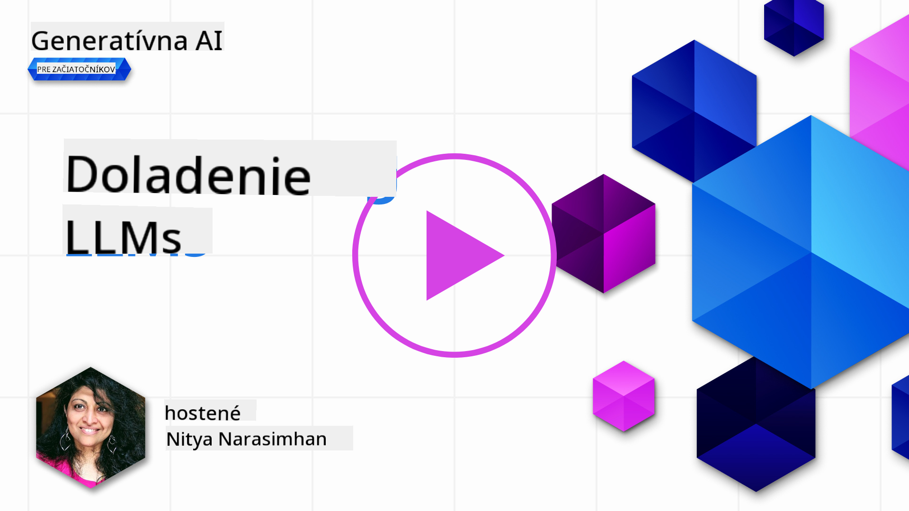
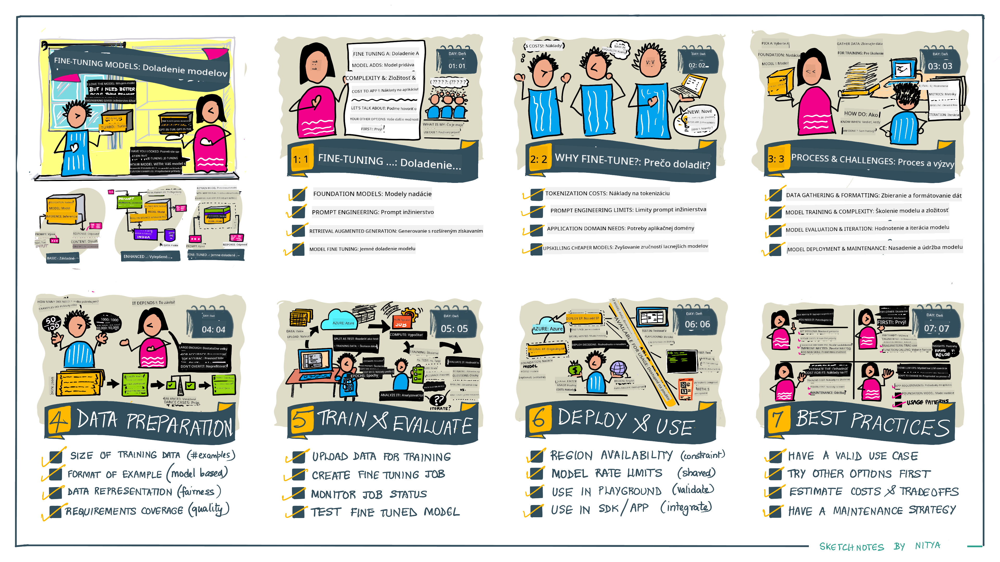

<!--
CO_OP_TRANSLATOR_METADATA:
{
  "original_hash": "68664f7e754a892ae1d8d5e2b7bd2081",
  "translation_date": "2025-05-20T07:57:44+00:00",
  "source_file": "18-fine-tuning/README.md",
  "language_code": "sk"
}
-->

# Doladenie vášho LLM

Používanie veľkých jazykových modelov na vytváranie aplikácií generatívnej AI prináša nové výzvy. Kľúčovým problémom je zabezpečenie kvality odpovedí (presnosť a relevantnosť) v obsahu generovanom modelom pre danú požiadavku používateľa. V predchádzajúcich lekciách sme diskutovali o technikách, ako je prompt engineering a retrieval-augmented generation, ktoré sa snažia vyriešiť problém _úpravou vstupu promptu_ do existujúceho modelu.

V dnešnej lekcii sa venujeme tretej technike, **doladeniu**, ktorá sa snaží riešiť výzvu _pretrénovaním samotného modelu_ s ďalšími dátami. Poďme sa ponoriť do detailov.

## Ciele učenia

Táto lekcia predstavuje koncept doladenia pre predtrénované jazykové modely, skúma výhody a výzvy tohto prístupu a poskytuje rady, kedy a ako použiť doladenie na zlepšenie výkonu vašich generatívnych AI modelov.

Na konci tejto lekcie by ste mali byť schopní odpovedať na nasledujúce otázky:

- Čo je doladenie pre jazykové modely?
- Kedy a prečo je doladenie užitočné?
- Ako môžem doladiť predtrénovaný model?
- Aké sú obmedzenia doladenia?

Pripravení? Poďme začať.

## Ilustrovaný sprievodca

Chcete získať celkový obraz o tom, čo budeme pokrývať, než sa ponoríme do detailov? Pozrite si tento ilustrovaný sprievodca, ktorý popisuje cestu učenia sa pre túto lekciu - od učenia sa základných konceptov a motivácie pre doladenie, po pochopenie procesu a najlepších praktík pre vykonanie úlohy doladenia. Toto je fascinujúca téma na preskúmanie, takže nezabudnite si pozrieť stránku [Resources](./RESOURCES.md?WT.mc_id=academic-105485-koreyst) pre ďalšie odkazy na podporu vašej samostatnej cesty učenia!

## Čo je doladenie pre jazykové modely?

Podľa definície sú veľké jazykové modely _predtrénované_ na veľkom množstve textov získaných z rôznych zdrojov vrátane internetu. Ako sme sa naučili v predchádzajúcich lekciách, potrebujeme techniky ako _prompt engineering_ a _retrieval-augmented generation_, aby sme zlepšili kvalitu odpovedí modelu na otázky používateľa ("prompty").

Populárna technika prompt engineeringu zahŕňa poskytnutie modelu viac pokynov o tom, čo sa očakáva v odpovedi, buď poskytnutím _inštrukcií_ (explicitné vedenie) alebo _poskytnutím niekoľkých príkladov_ (implicitné vedenie). Toto sa nazýva _few-shot learning_, ale má dve obmedzenia:

- Limity tokenov modelu môžu obmedziť počet príkladov, ktoré môžete poskytnúť, a obmedziť účinnosť.
- Náklady na tokeny modelu môžu byť drahé, ak pridávate príklady ku každému promptu, a obmedzujú flexibilitu.

Doladenie je bežnou praxou v systémoch strojového učenia, kde vezmeme predtrénovaný model a pretrénujeme ho s novými dátami, aby sme zlepšili jeho výkon na konkrétnu úlohu. V kontexte jazykových modelov môžeme doladiť predtrénovaný model _s kurátorskou sadou príkladov pre danú úlohu alebo aplikačnú doménu_, aby sme vytvorili **vlastný model**, ktorý môže byť presnejší a relevantnejší pre túto konkrétnu úlohu alebo doménu. Vedľajším prínosom doladenia je, že môže tiež znížiť počet potrebných príkladov pre few-shot learning - čím sa znižuje použitie tokenov a súvisiace náklady.

## Kedy a prečo by sme mali doladiť modely?

V _tomto_ kontexte, keď hovoríme o doladení, máme na mysli **supervízované** doladenie, kde sa pretrénovanie vykonáva **pridaním nových dát**, ktoré neboli súčasťou pôvodného tréningového datasetu. To sa líši od nesupervízovaného doladenia, kde je model pretrénovaný na pôvodných dátach, ale s rôznymi hyperparametrami.

Kľúčová vec, ktorú si treba pamätať, je, že doladenie je pokročilá technika, ktorá vyžaduje určitú úroveň odbornosti na dosiahnutie požadovaných výsledkov. Ak je vykonané nesprávne, nemusí poskytnúť očakávané zlepšenia a môže dokonca zhoršiť výkon modelu pre vašu cieľovú doménu.

Takže predtým, než sa naučíte "ako" doladiť jazykové modely, musíte vedieť "prečo" by ste mali ísť touto cestou a "kedy" začať proces doladenia. Začnite tým, že si položíte tieto otázky:

- **Použitie**: Aké je vaše _použitie_ pre doladenie? Aký aspekt súčasného predtrénovaného modelu chcete zlepšiť?
- **Alternatívy**: Skúšali ste _iné techniky_, aby ste dosiahli požadované výsledky? Použite ich na vytvorenie základného porovnania.
  - Prompt engineering: Skúste techniky ako few-shot prompting s príkladmi relevantných odpovedí na prompt. Vyhodnoťte kvalitu odpovedí.
  - Retrieval Augmented Generation: Skúste augmentovať prompty s výsledkami dotazov získanými vyhľadávaním vašich dát. Vyhodnoťte kvalitu odpovedí.
- **Náklady**: Identifikovali ste náklady na doladenie?
  - Doladiteľnosť - je predtrénovaný model dostupný na doladenie?
  - Úsilie - na prípravu tréningových dát, hodnotenie a doladenie modelu.
  - Výpočtová kapacita - na spustenie úloh doladenia a nasadenie doladeného modelu
  - Dáta - prístup k dostatočnému množstvu kvalitných príkladov na ovplyvnenie doladenia
- **Výhody**: Potvrdili ste výhody doladenia?
  - Kvalita - prekonal doladený model základné porovnanie?
  - Náklady - znižuje to použitie tokenov zjednodušením promptov?
  - Rozšíriteľnosť - môžete opätovne použiť základný model pre nové domény?

Zodpovedaním týchto otázok by ste mali byť schopní rozhodnúť, či je doladenie správnym prístupom pre váš prípad použitia. Ideálne je, že prístup je platný len vtedy, ak výhody prevažujú nad nákladmi. Keď sa rozhodnete pokračovať, je čas premýšľať o _tom, ako_ môžete doladiť predtrénovaný model.

Chcete získať viac informácií o procese rozhodovania? Sledujte [Doladiť alebo nedoladiť](https://www.youtube.com/watch?v=0Jo-z-MFxJs)

## Ako môžeme doladiť predtrénovaný model?

Na doladenie predtrénovaného modelu potrebujete:

- predtrénovaný model na doladenie
- dataset na použitie pri doladení
- tréningové prostredie na spustenie úlohy doladenia
- hostingové prostredie na nasadenie doladeného modelu

## Doladenie v praxi

Nasledujúce zdroje poskytujú podrobné tutoriály, ktoré vás prevedú skutočným príkladom pomocou vybraného modelu s kurátorským datasetom. Aby ste mohli prejsť týmito tutoriálmi, potrebujete účet u konkrétneho poskytovateľa spolu s prístupom k relevantným modelom a datasetom.

| Poskytovateľ | Tutoriál                                                                                                                                                                       | Popis                                                                                                                                                                                                                                                                                                                                                                                                                        |
| ------------ | ------------------------------------------------------------------------------------------------------------------------------------------------------------------------------ | ---------------------------------------------------------------------------------------------------------------------------------------------------------------------------------------------------------------------------------------------------------------------------------------------------------------------------------------------------------------------------------------------------------------------------------- |
| OpenAI       | [Ako doladiť chatovacie modely](https://github.com/openai/openai-cookbook/blob/main/examples/How_to_finetune_chat_models.ipynb?WT.mc_id=academic-105485-koreyst)                | Naučte sa doladiť `gpt-35-turbo` pre konkrétnu doménu ("asistent receptov") prípravou tréningových dát, spustením úlohy doladenia a použitím doladeného modelu na inferenciu.                                                                                                                                                                                                                                              |
| Azure OpenAI | [GPT 3.5 Turbo doladenie tutoriál](https://learn.microsoft.com/azure/ai-services/openai/tutorials/fine-tune?tabs=python-new%2Ccommand-line?WT.mc_id=academic-105485-koreyst) | Naučte sa doladiť `gpt-35-turbo-0613` model **na Azure** vykonaním krokov na vytvorenie a nahranie tréningových dát, spustenie úlohy doladenia. Nasadenie a použitie nového modelu.                                                                                                                                                                                                                                                                 |
| Hugging Face | [Doladenie LLMs s Hugging Face](https://www.philschmid.de/fine-tune-llms-in-2024-with-trl?WT.mc_id=academic-105485-koreyst)                                               | Tento blogový príspevok vás prevedie doladením _open LLM_ (napr. `CodeLlama 7B`) pomocou knižnice [transformers](https://huggingface.co/docs/transformers/index?WT.mc_id=academic-105485-koreyst) a [Transformer Reinforcement Learning (TRL)](https://huggingface.co/docs/trl/index?WT.mc_id=academic-105485-koreyst]) s otvorenými [datasets](https://huggingface.co/docs/datasets/index?WT.mc_id=academic-105485-koreyst) na Hugging Face. |
|              |                                                                                                                                                                                |                                                                                                                                                                                                                                                                                                                                                                                                                                    |
| 🤗 AutoTrain | [Doladenie LLMs s AutoTrain](https://github.com/huggingface/autotrain-advanced/?WT.mc_id=academic-105485-koreyst)                                                         | AutoTrain (alebo AutoTrain Advanced) je python knižnica vyvinutá Hugging Face, ktorá umožňuje doladenie pre mnoho rôznych úloh vrátane doladenia LLM. AutoTrain je riešenie bez kódu a doladenie môže byť vykonané vo vašom vlastnom cloude, na Hugging Face Spaces alebo lokálne. Podporuje webové rozhranie, CLI a tréning pomocou yaml konfiguračných súborov.                                                                               |
|              |                                                                                                                                                                                |                                                                                                                                                                                                                                                                                                                                                                                                                                    |

## Zadanie

Vyberte jeden z vyššie uvedených tutoriálov a prejdite ho. _Môžeme replikovať verziu týchto tutoriálov v Jupyter Notebooks v tomto repozitári len na referenciu. Použite pôvodné zdroje priamo na získanie najnovších verzií_.

## Skvelá práca! Pokračujte vo svojom učení.

Po dokončení tejto lekcie si pozrite našu [Generative AI Learning collection](https://aka.ms/genai-collection?WT.mc_id=academic-105485-koreyst), aby ste pokračovali v zvyšovaní svojich znalostí o Generatívnej AI!

Gratulujeme!! Dokončili ste poslednú lekciu z v2 série pre tento kurz! Neprestávajte sa učiť a budovať. \*\*Pozrite si stránku [RESOURCES](RESOURCES.md?WT.mc_id=academic-105485-koreyst) pre zoznam ďalších návrhov práve pre túto tému.

Naša v1 séria lekcií bola tiež aktualizovaná s viacerými úlohami a konceptmi. Takže si chvíľu osviežte svoje vedomosti - a prosím [podeľte sa o svoje otázky a spätnú väzbu](https://github.com/microsoft/generative-ai-for-beginners/issues?WT.mc_id=academic-105485-koreyst), aby sme mohli zlepšiť tieto lekcie pre komunitu.

**Upozornenie**:  
Tento dokument bol preložený pomocou AI prekladateľskej služby [Co-op Translator](https://github.com/Azure/co-op-translator). Hoci sa snažíme o presnosť, prosím, berte na vedomie, že automatizované preklady môžu obsahovať chyby alebo nepresnosti. Pôvodný dokument v jeho rodnom jazyku by mal byť považovaný za autoritatívny zdroj. Pre kritické informácie sa odporúča profesionálny ľudský preklad. Nie sme zodpovední za žiadne nedorozumenia alebo nesprávne interpretácie vyplývajúce z použitia tohto prekladu.