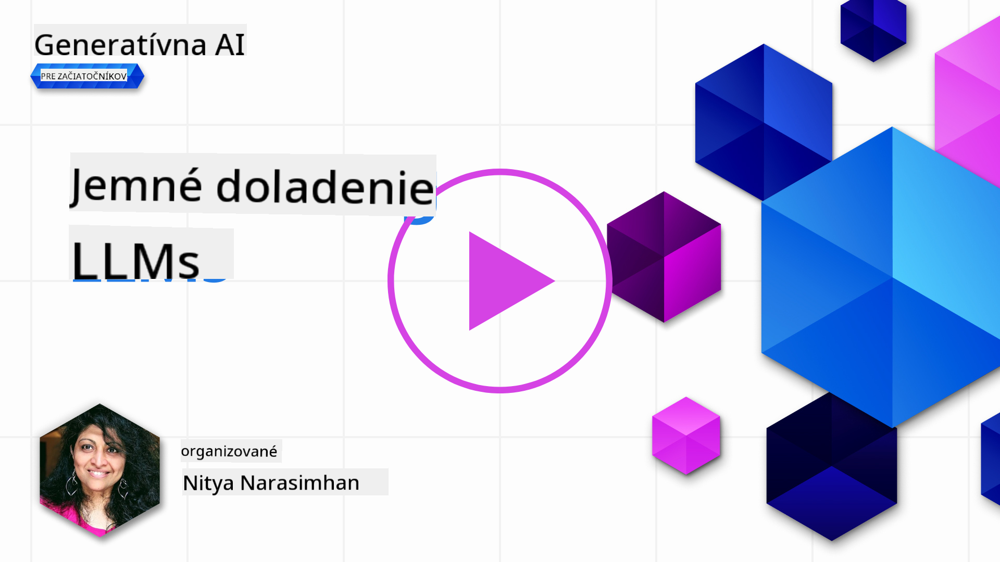

<!--
CO_OP_TRANSLATOR_METADATA:
{
  "original_hash": "68664f7e754a892ae1d8d5e2b7bd2081",
  "translation_date": "2025-07-09T17:49:08+00:00",
  "source_file": "18-fine-tuning/README.md",
  "language_code": "sk"
}
-->

# Doladenie vášho LLM

Používanie veľkých jazykových modelov na tvorbu generatívnych AI aplikácií prináša nové výzvy. Kľúčovým problémom je zabezpečiť kvalitu odpovedí (presnosť a relevantnosť) v obsahu generovanom modelom na základe požiadavky používateľa. V predchádzajúcich lekciách sme diskutovali techniky ako prompt engineering a retrieval-augmented generation, ktoré sa snažia vyriešiť tento problém _úpravou vstupného promptu_ pre existujúci model.

V dnešnej lekcii sa pozrieme na tretiu techniku, **doladenie (fine-tuning)**, ktorá sa snaží vyriešiť túto výzvu _preškolením samotného modelu_ s použitím dodatočných dát. Poďme sa pozrieť na detaily.

## Ciele učenia

Táto lekcia predstavuje koncept doladenia predtrénovaných jazykových modelov, skúma výhody a výzvy tohto prístupu a poskytuje usmernenie, kedy a ako použiť doladenie na zlepšenie výkonu vašich generatívnych AI modelov.

Na konci tejto lekcie by ste mali vedieť odpovedať na tieto otázky:

- Čo je doladenie jazykových modelov?
- Kedy a prečo je doladenie užitočné?
- Ako môžem doladiť predtrénovaný model?
- Aké sú obmedzenia doladenia?

Pripravení? Poďme na to.

## Ilustrovaný sprievodca

Chcete získať celkový prehľad o tom, čo budeme preberať, ešte predtým, než sa do toho pustíme? Pozrite si tento ilustrovaný sprievodca, ktorý popisuje vzdelávaciu cestu pre túto lekciu – od pochopenia základných konceptov a motivácie pre doladenie až po pochopenie procesu a najlepších praktík pri vykonávaní doladenia. Je to fascinujúca téma na preskúmanie, tak nezabudnite navštíviť stránku [Resources](./RESOURCES.md?WT.mc_id=academic-105485-koreyst) pre ďalšie odkazy, ktoré podporia vaše samostatné štúdium!

## Čo je doladenie jazykových modelov?

Veľké jazykové modely sú podľa definície _predtrénované_ na veľkých množstvách textu získaného z rôznych zdrojov vrátane internetu. Ako sme sa naučili v predchádzajúcich lekciách, potrebujeme techniky ako _prompt engineering_ a _retrieval-augmented generation_, aby sme zlepšili kvalitu odpovedí modelu na otázky používateľa („prompty“).

Populárna technika prompt engineeringu spočíva v tom, že modelu poskytneme viac usmernení, čo sa očakáva v odpovedi, buď prostredníctvom _inštrukcií_ (explicitné usmernenie) alebo _poskytnutím niekoľkých príkladov_ (implicitné usmernenie). Toto sa nazýva _few-shot learning_, ale má dve obmedzenia:

- Limit tokenov modelu môže obmedziť počet príkladov, ktoré môžete poskytnúť, a tým aj efektivitu.
- Náklady na tokeny môžu spôsobiť, že pridávanie príkladov ku každému promptu bude drahé a obmedzí flexibilitu.

Doladenie je bežná prax v systémoch strojového učenia, kde vezmeme predtrénovaný model a preškolíme ho s novými dátami, aby sme zlepšili jeho výkon na konkrétnu úlohu. V kontexte jazykových modelov môžeme doladiť predtrénovaný model _s vybranou sadou príkladov pre danú úlohu alebo aplikačnú doménu_, aby sme vytvorili **vlastný model**, ktorý môže byť presnejší a relevantnejší pre túto konkrétnu úlohu alebo doménu. Vedľajšou výhodou doladenia je, že môže tiež znížiť počet príkladov potrebných pre few-shot learning – čím sa zníži spotreba tokenov a súvisiace náklady.

## Kedy a prečo by sme mali doladiť modely?

V _tomto_ kontexte, keď hovoríme o doladení, máme na mysli **supervidované** doladenie, kde sa preškolenie vykonáva **pridaním nových dát**, ktoré neboli súčasťou pôvodného tréningového datasetu. To sa líši od nesupervidovaného doladenia, kde sa model preškolí na pôvodných dátach, ale s inými hyperparametrami.

Dôležité je si uvedomiť, že doladenie je pokročilá technika, ktorá vyžaduje určitú úroveň odbornosti, aby priniesla želané výsledky. Ak sa vykoná nesprávne, nemusí priniesť očakávané zlepšenia a môže dokonca zhoršiť výkon modelu pre vašu cieľovú doménu.

Predtým, než sa naučíte „ako“ doladiť jazykové modely, musíte vedieť „prečo“ by ste mali ísť touto cestou a „kedy“ začať proces doladenia. Začnite tým, že si položíte tieto otázky:

- **Použitie**: Aký je váš _prípad použitia_ pre doladenie? Ktorý aspekt súčasného predtrénovaného modelu chcete zlepšiť?
- **Alternatívy**: Skúsili ste _iné techniky_ na dosiahnutie požadovaných výsledkov? Použite ich na vytvorenie základnej línie pre porovnanie.
  - Prompt engineering: Vyskúšajte techniky ako few-shot prompting s príkladmi relevantných odpovedí. Vyhodnoťte kvalitu odpovedí.
  - Retrieval Augmented Generation: Vyskúšajte doplniť prompty výsledkami vyhľadávania vo vašich dátach. Vyhodnoťte kvalitu odpovedí.
- **Náklady**: Identifikovali ste náklady spojené s doladením?
  - Možnosť doladenia – je predtrénovaný model dostupný na doladenie?
  - Námaha – príprava tréningových dát, hodnotenie a dolaďovanie modelu.
  - Výpočtové zdroje – na spustenie doladiacich úloh a nasadenie doladeného modelu.
  - Dáta – prístup k dostatočne kvalitným príkladom na dosiahnutie efektu doladenia.
- **Výhody**: Potvrdili ste si výhody doladenia?
  - Kvalita – prekonal doladený model základnú líniu?
  - Náklady – znižuje spotrebu tokenov zjednodušením promptov?
  - Rozšíriteľnosť – môžete základný model použiť pre nové domény?

Odpoveďami na tieto otázky by ste mali vedieť rozhodnúť, či je doladenie správnym prístupom pre váš prípad použitia. Ideálne je, ak sú výhody vyššie ako náklady. Ak sa rozhodnete pokračovať, je čas premýšľať o tom, _ako_ môžete doladiť predtrénovaný model.

Chcete získať viac informácií o rozhodovacom procese? Pozrite si [To fine-tune or not to fine-tune](https://www.youtube.com/watch?v=0Jo-z-MFxJs)

## Ako môžeme doladiť predtrénovaný model?

Na doladenie predtrénovaného modelu potrebujete:

- predtrénovaný model na doladenie
- dataset na doladenie
- tréningové prostredie na spustenie doladiacej úlohy
- hostingové prostredie na nasadenie doladeného modelu

## Doladenie v praxi

Nasledujúce zdroje poskytujú krok za krokom návody, ktoré vás prevedú reálnym príkladom s vybraným modelom a vybraným datasetom. Na prácu s týmito tutoriálmi potrebujete účet u konkrétneho poskytovateľa, ako aj prístup k relevantnému modelu a datasetom.

| Poskytovateľ | Tutoriál                                                                                                                                                                      | Popis                                                                                                                                                                                                                                                                                                                                                                                                                             |
| ------------ | ----------------------------------------------------------------------------------------------------------------------------------------------------------------------------- | --------------------------------------------------------------------------------------------------------------------------------------------------------------------------------------------------------------------------------------------------------------------------------------------------------------------------------------------------------------------------------------------------------------------------------- |
| OpenAI       | [How to fine-tune chat models](https://github.com/openai/openai-cookbook/blob/main/examples/How_to_finetune_chat_models.ipynb?WT.mc_id=academic-105485-koreyst)               | Naučte sa doladiť `gpt-35-turbo` pre konkrétnu doménu („asistent na recepty“) prípravou tréningových dát, spustením doladiacej úlohy a použitím doladeného modelu na inferenciu.                                                                                                                                                                                                                                                  |
| Azure OpenAI | [GPT 3.5 Turbo fine-tuning tutorial](https://learn.microsoft.com/azure/ai-services/openai/tutorials/fine-tune?tabs=python-new%2Ccommand-line?WT.mc_id=academic-105485-koreyst) | Naučte sa doladiť model `gpt-35-turbo-0613` **na Azure** krok za krokom – vytvorenie a nahranie tréningových dát, spustenie doladiacej úlohy, nasadenie a použitie nového modelu.                                                                                                                                                                                                                                                |
| Hugging Face | [Fine-tuning LLMs with Hugging Face](https://www.philschmid.de/fine-tune-llms-in-2024-with-trl?WT.mc_id=academic-105485-koreyst)                                              | Tento blogový príspevok vás prevedie doladením _otvoreného LLM_ (napr. `CodeLlama 7B`) pomocou knižnice [transformers](https://huggingface.co/docs/transformers/index?WT.mc_id=academic-105485-koreyst) a [Transformer Reinforcement Learning (TRL)](https://huggingface.co/docs/trl/index?WT.mc_id=academic-105485-koreyst) s otvorenými [datasetmi](https://huggingface.co/docs/datasets/index?WT.mc_id=academic-105485-koreyst) na Hugging Face. |
|              |                                                                                                                                                                               |                                                                                                                                                                                                                                                                                                                                                                                                                                   |
| 🤗 AutoTrain | [Fine-tuning LLMs with AutoTrain](https://github.com/huggingface/autotrain-advanced/?WT.mc_id=academic-105485-koreyst)                                                        | AutoTrain (alebo AutoTrain Advanced) je python knižnica vyvinutá Hugging Face, ktorá umožňuje doladenie pre rôzne úlohy vrátane doladenia LLM. AutoTrain je riešenie bez kódu a doladenie môžete vykonať vo vlastnom cloude, na Hugging Face Spaces alebo lokálne. Podporuje webové GUI, CLI a tréning cez yaml konfiguračné súbory.                                                                                                   |
|              |                                                                                                                                                                               |                                                                                                                                                                                                                                                                                                                                                                                                                                   |

## Zadanie

Vyberte si jeden z vyššie uvedených tutoriálov a prejdite si ho. _Môžeme vytvoriť verziu týchto tutoriálov v Jupyter Notebooks v tomto repozitári len na referenciu. Pre najnovšie verzie však používajte priamo pôvodné zdroje_.

## Výborná práca! Pokračujte v učení.

Po dokončení tejto lekcie si pozrite našu [kolekciu Generative AI Learning](https://aka.ms/genai-collection?WT.mc_id=academic-105485-koreyst), aby ste naďalej rozvíjali svoje znalosti o generatívnej AI!

Gratulujeme!! Dokončili ste poslednú lekciu z verzie v2 tohto kurzu! Nezastavujte sa v učení a tvorbe. \*\*Pozrite si stránku [RESOURCES](RESOURCES.md?WT.mc_id=academic-105485-koreyst) pre zoznam ďalších odporúčaní práve k tejto téme.

Naša séria lekcií v1 bola tiež aktualizovaná o viac zadania a konceptov. Tak si dajte chvíľu na osvieženie vedomostí – a prosím, [zdieľajte svoje otázky a spätnú väzbu](https://github.com/microsoft/generative-ai-for-beginners/issues?WT.mc_id=academic-105485-koreyst), aby sme mohli tieto lekcie pre komunitu ešte vylepšiť.

**Vyhlásenie o zodpovednosti**:  
Tento dokument bol preložený pomocou AI prekladateľskej služby [Co-op Translator](https://github.com/Azure/co-op-translator). Hoci sa snažíme o presnosť, prosím, majte na pamäti, že automatizované preklady môžu obsahovať chyby alebo nepresnosti. Originálny dokument v jeho pôvodnom jazyku by mal byť považovaný za autoritatívny zdroj. Pre kritické informácie sa odporúča profesionálny ľudský preklad. Nie sme zodpovední za akékoľvek nedorozumenia alebo nesprávne interpretácie vyplývajúce z použitia tohto prekladu.