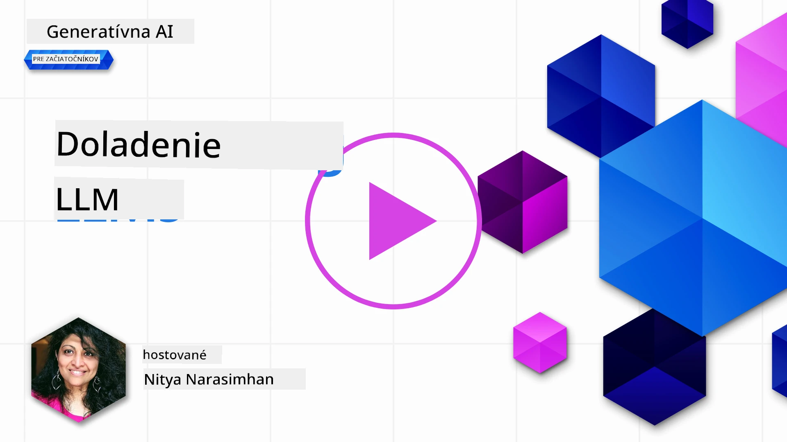
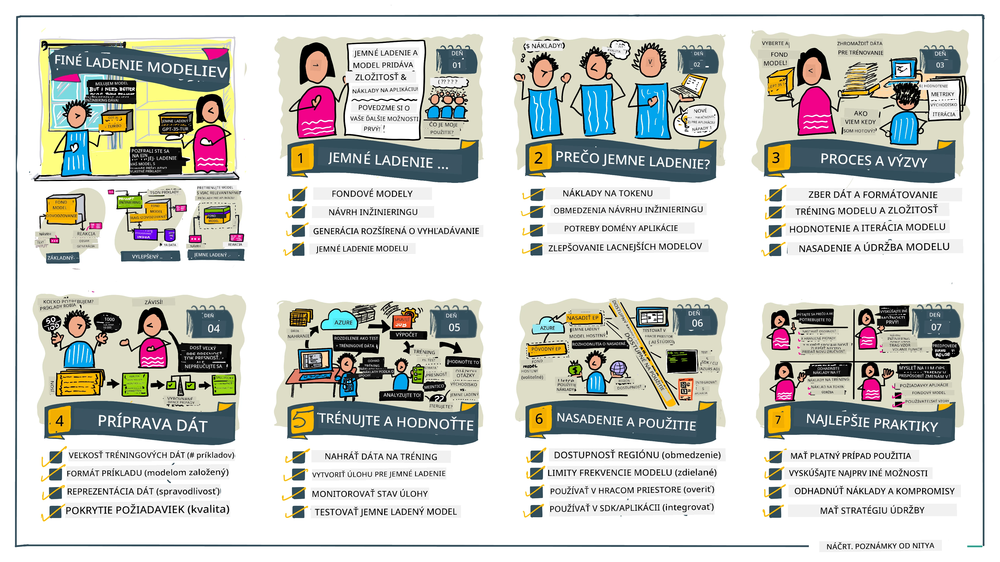

# Doladenie vášho LLM

Používanie veľkých jazykových modelov na vytváranie generatívnych AI aplikácií prináša nové výzvy. Kľúčovým problémom je zabezpečiť kvalitu odpovedí (presnosť a relevantnosť) v obsahu generovanom modelom pre daný požiadavok používateľa. V predchádzajúcich lekciách sme diskutovali techniky ako prompt engineering a retrieval-augmented generation, ktoré sa snažia vyriešiť problém _úpravou vstupného promptu_ do existujúceho modelu.

V dnešnej lekcii sa budeme zaoberať tretou technikou, **doladením (fine-tuning)**, ktorá sa snaží vyriešiť túto výzvu _prepoučením samotného modelu_ pomocou dodatočných dát. Poďme sa pozrieť na detaily.

## Ciele učenia

Táto lekcia predstavuje koncept doladenia predtrénovaných jazykových modelov, skúma výhody a výzvy tohto prístupu a poskytuje usmernenie, kedy a ako použiť doladenie na zlepšenie výkonu vašich generatívnych AI modelov.

Na konci tejto lekcie by ste mali byť schopní odpovedať na nasledujúce otázky:

- Čo je doladenie jazykových modelov?
- Kedy a prečo je doladenie užitočné?
- Ako môžem doladiť predtrénovaný model?
- Aké sú obmedzenia doladenia?

Ste pripravení? Poďme na to.

## Ilustrovaný sprievodca

Chcete získať celkový obraz toho, čo pokryjeme, ešte predtým, než sa do toho pustíme? Pozrite si tento ilustrovaný sprievodca, ktorý popisuje vzdelávaciu cestu pre túto lekciu - od štúdia základných konceptov a motivácie pre doladenie, cez pochopenie procesu a najlepších praktík pri vykonávaní úlohy doladenia. Je to fascinujúca téma na skúmanie, preto nezabudnite navštíviť stránku [Resources](./RESOURCES.md?WT.mc_id=academic-105485-koreyst) pre ďalšie odkazy na podporu vášho samostatného vzdelávacieho procesu!

## Čo je doladenie jazykových modelov?

Veľké jazykové modely sú podľa definície _predtrénované_ na veľkých množstvách textu získaného z rôznych zdrojov vrátane internetu. Ako sme sa naučili v predchádzajúcich lekciách, na zlepšenie kvality odpovedí modelu na otázky používateľa ("prompty") potrebujeme techniky ako _prompt engineering_ a _retrieval-augmented generation_.

Populárna technika prompt engineeringu zahŕňa poskytnutie modelu viac usmernenia o tom, čo sa očakáva v odpovedi, buď tým, že mu dáte _inštrukcie_ (explicitné usmernenie) alebo _pár príkladov_ (implicitné usmernenie). Toto sa nazýva _few-shot learning_, ale má dve obmedzenia:

- Limit počtu tokenov modelu môže obmedziť počet príkladov, ktoré môžete poskytnúť, a tým aj účinnosť.
- Náklady na tokeny modelu môžu spraviť pridávanie príkladov do každého promptu drahým a obmedziť flexibilitu.

Doladenie je bežná prax v strojovom učení, kde vezmeme predtrénovaný model a prepoučíme ho s novými dátami, aby sme zlepšili jeho výkon na konkrétnu úlohu. V kontexte jazykových modelov môžeme doladiť predtrénovaný model _s vybranou množinou príkladov pre danú úlohu alebo aplikačnú oblasť_, aby sme vytvorili **vlastný model**, ktorý môže byť presnejší a relevantnejší pre túto konkrétnu úlohu alebo doménu. Vedľajšou výhodou doladenia je, že môže tiež znížiť počet príkladov potrebných pre few-shot learning - tým sa zníži použitie tokenov a súvisiace náklady.

## Kedy a prečo by sme mali doladiť modely?

V _tomto_ kontexte, keď hovoríme o doladení, máme na mysli **supervidované** doladenie, kde sa prepoučenie vykonáva **pridávaním nových dát**, ktoré neboli súčasťou pôvodného tréningového datasetu. To sa líši od nesupervidovaného doladenia, kde sa model prepúčuje na pôvodných dátach, ale s inými hyperparametrami.

Dôležité si zapamätať je, že doladenie je pokročilá technika, ktorá vyžaduje určitú úroveň odbornosti na dosiahnutie požadovaných výsledkov. Ak sa vykoná nesprávne, nemusí priniesť očakávané zlepšenia a dokonca môže zhoršiť výkon modelu pre vašu cieľovú doménu.

Takže predtým, než sa naučíte "ako" doladiť jazykové modely, musíte vedieť "prečo" by ste sa touto cestou mali vybrať a "kedy" začať proces doladenia. Začnite tým, že si položíte tieto otázky:

- **Použitie**: Aký je váš _prípad použitia_ pre doladenie? Ktorý aspekt súčasného predtrénovaného modelu chcete zlepšiť?
- **Alternatívy**: Vyskúšali ste _iné techniky_ na dosiahnutie požadovaných výsledkov? Použite ich ako základ pre porovnanie.
  - Prompt engineering: Vyskúšajte techniky ako few-shot prompting s príkladmi relevantných odpovedí. Vyhodnoťte kvalitu odpovedí.
  - Retrieval augmented generation: Vyskúšajte rozšíriť prompt o výsledky vyhľadávania vo vašich dátach. Vyhodnoťte kvalitu odpovedí.
- **Náklady**: Identifikovali ste náklady na doladenie?
  - Možnosť doladenia - je predtrénovaný model dostupný na doladenie?
  - Námaha - príprava tréningových dát, hodnotenie a zdokonaľovanie modelu.
  - Výpočtové zdroje - na spustenie úloh doladenia a nasadenie doladeného modelu.
  - Dáta - prístup k dostatočne kvalitným príkladom pre efekt doladenia.
- **Výhody**: Potvrdili ste výhody doladenia?
  - Kvalita - prekročil výkon doladený model základný model?
  - Náklady - znižuje použitý počet tokenov zjednodušením promptov?
  - Rozšíriteľnosť - môžete základný model použiť pre nové domény?

Ak odpoviete na tieto otázky, mali by ste byť schopní rozhodnúť sa, či je doladenie správnym prístupom pre váš prípad použitia. Ideálne je prístup platný len ak výhody prevýšia náklady. Ak sa rozhodnete pokračovať, je čas premýšľať o tom, _ako_ môžete doladiť predtrénovaný model.

Chcete viac informácií o rozhodovacom procese? Pozrite si [Doladiť alebo nedoladiť](https://www.youtube.com/watch?v=0Jo-z-MFxJs)

## Ako môžeme doladiť predtrénovaný model?

Na doladenie predtrénovaného modelu potrebujete:

- predtrénovaný model na doladenie
- dataset na použitie pri doladení
- tréningové prostredie na spustenie úlohy doladenia
- hosťovacie prostredie na nasadenie doladeného modelu

## Doladenie v praxi

Nasledujúce zdroje poskytujú návod krok za krokom, ako vás prevedú reálnym príkladom s vybraným modelom a vybraným datasetom. Na prácu s týmito návodmi potrebujete účet u konkrétneho poskytovateľa, spolu s prístupom k relevantným modelom a datasetom.

| Poskytovateľ | Návod                                                                                                                                                                         | Popis                                                                                                                                                                                                                                                                                                                                                                                                                             |
| ------------ | ---------------------------------------------------------------------------------------------------------------------------------------------------------------------------- | -------------------------------------------------------------------------------------------------------------------------------------------------------------------------------------------------------------------------------------------------------------------------------------------------------------------------------------------------------------------------------------------------------------------------------- |
| OpenAI       | [Ako doladiť chat modely](https://github.com/openai/openai-cookbook/blob/main/examples/How_to_finetune_chat_models.ipynb?WT.mc_id=academic-105485-koreyst)                  | Naučte sa doladiť `gpt-35-turbo` pre konkrétnu doménu ("asistent receptov") tým, že pripravíte tréningové dáta, spustíte doladenie a použijete doladený model na inferenciu.                                                                                                                                                                                                                                                       |
| Azure OpenAI | [Návod na doladenie GPT 3.5 Turbo](https://learn.microsoft.com/azure/ai-services/openai/tutorials/fine-tune?tabs=python-new%2Ccommand-line?WT.mc_id=academic-105485-koreyst) | Naučte sa doladiť model `gpt-35-turbo-0613` **na Azure** krokmi, ktoré zahŕňajú vytvorenie a nahranie tréningových dát, spustenie doladenia, nasadenie a použitie nového modelu.                                                                                                                                                                                                                                                 |
| Hugging Face | [Doladenie LLM s Hugging Face](https://www.philschmid.de/fine-tune-llms-in-2024-with-trl?WT.mc_id=academic-105485-koreyst)                                                 | Tento blogový príspevok vás prevedie doladením _otvoreného LLM_ (napr. `CodeLlama 7B`) pomocou knižnice [transformers](https://huggingface.co/docs/transformers/index?WT.mc_id=academic-105485-koreyst) & [Transformer Reinforcement Learning (TRL)](https://huggingface.co/docs/trl/index?WT.mc_id=academic-105485-koreyst]) s otvorenými [datasetmi](https://huggingface.co/docs/datasets/index?WT.mc_id=academic-105485-koreyst) na Hugging Face.                        |
|              |                                                                                                                                                                              |                                                                                                                                                                                                                                                                                                                                                                                                                                   |
| 🤗 AutoTrain | [Doladenie LLM s AutoTrain](https://github.com/huggingface/autotrain-advanced/?WT.mc_id=academic-105485-koreyst)                                                             | AutoTrain (alebo AutoTrain Advanced) je python knižnica vyvinutá spoločnosťou Hugging Face, ktorá umožňuje doladenie pre rôzne úlohy vrátane doladenia LLM. AutoTrain je riešenie bez kódu, doladenie sa môže vykonať vo vlastnom cloude, na Hugging Face Spaces alebo lokálne. Podporuje webové GUI, CLI aj tréning cez yaml konfiguračné súbory.                                                                                                   |
|              |                                                                                                                                                                              |                                                                                                                                                                                                                                                                                                                                                                                                                                   |
| 🦥 Unsloth | [Doladenie LLM s Unsloth](https://github.com/unslothai/unsloth)                                                                                                     | Unsloth je open-source framework, ktorý podporuje doladenie LLM a reinforcement learning (RL). Unsloth zjednodušuje lokálny tréning, hodnotenie a nasadzovanie pomocou pripravených [notebookov](https://github.com/unslothai/notebooks). Tiež podporuje text-to-speech (TTS), BERT a multimodálne modely. Začnite tým, že si prečítate ich podrobný [Návod na doladenie LLM](https://docs.unsloth.ai/get-started/fine-tuning-llms-guide).                                  |
|              |                                                                                                                                                                              |                                                                                                                                                                                                                                                                                                                                                                                                                                   |
## Zadanie

Vyberte jeden z vyššie uvedených návodov a prejdite si ho. _Môžeme zopakovať verziu týchto návodov v Jupyter Notebooks v tomto repozitári len ako referenciu. Pre aktuálne verzie používajte prosím priamo pôvodné zdroje_.

## Výborne! Pokračujte vo svojom učení.

Po dokončení tejto lekcie si pozrite náš [Generative AI Learning collection](https://aka.ms/genai-collection?WT.mc_id=academic-105485-koreyst), aby ste pokračovali v rozširovaní svojich vedomostí o generatívnej AI!

Gratulujeme!! Dokončili ste poslednú lekciu zo série v2 tohto kurzu! Neprestávajte sa učiť a tvoriť. \*\*Pozrite si stránku [RESOURCES](RESOURCES.md?WT.mc_id=academic-105485-koreyst) pre zoznam ďalších tipov iba k tejto téme.

Naša séria lekcií v1 bola tiež aktualizovaná s viac zadaniami a konceptmi. Tak si na chvíľu osviežte vedomosti - a prosím [zdieľajte svoje otázky a spätnú väzbu](https://github.com/microsoft/generative-ai-for-beginners/issues?WT.mc_id=academic-105485-koreyst), aby sme mohli tieto lekcie zlepšiť pre komunitu.

---

<!-- CO-OP TRANSLATOR DISCLAIMER START -->
**Zásadné upozornenie**:  
Tento dokument bol preložený pomocou AI prekladateľskej služby [Co-op Translator](https://github.com/Azure/co-op-translator). Aj keď sa snažíme o presnosť, prosím, majte na pamäti, že automatizované preklady môžu obsahovať chyby alebo nepresnosti. Považuje sa, že originálny dokument v jeho pôvodnom jazyku predstavuje autoritatívny zdroj. Pre kritické informácie sa odporúča profesionálny ľudský preklad. Nie sme zodpovední za akékoľvek nedorozumenia alebo nesprávne výklady vyplývajúce z použitia tohto prekladu.
<!-- CO-OP TRANSLATOR DISCLAIMER END -->