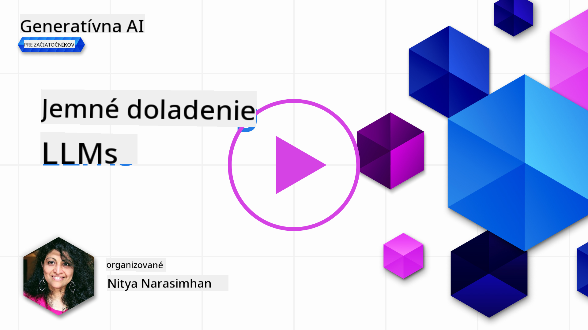
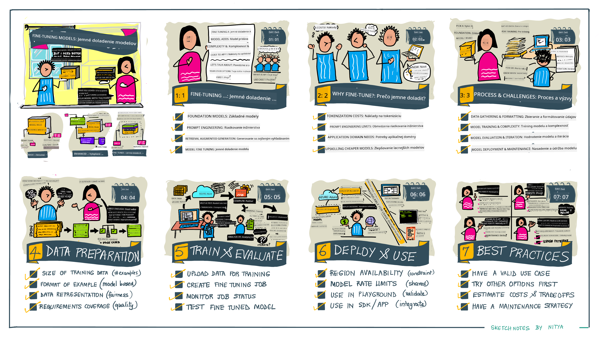

<!--
CO_OP_TRANSLATOR_METADATA:
{
  "original_hash": "68664f7e754a892ae1d8d5e2b7bd2081",
  "translation_date": "2025-06-26T00:50:47+00:00",
  "source_file": "18-fine-tuning/README.md",
  "language_code": "sk"
}
-->

# Doladenie vášho LLM

Používanie veľkých jazykových modelov na vytváranie generatívnych AI aplikácií prináša nové výzvy. Kľúčovým problémom je zabezpečenie kvality odpovedí (presnosť a relevantnosť) v obsahu generovanom modelom pre konkrétnu požiadavku používateľa. V predchádzajúcich lekciách sme diskutovali o technikách ako prompt engineering a retrieval-augmented generation, ktoré sa snažia riešiť problém _upravovaním vstupu promptu_ do existujúceho modelu.

V dnešnej lekcii diskutujeme o tretej technike, **doladení**, ktorá sa snaží riešiť výzvu _pretrénovaním samotného modelu_ s ďalšími údajmi. Poďme sa ponoriť do detailov.

## Ciele učenia

Táto lekcia predstavuje koncept doladenia pre predtrénované jazykové modely, skúma výhody a výzvy tohto prístupu a poskytuje usmernenia o tom, kedy a ako používať doladenie na zlepšenie výkonu vašich generatívnych AI modelov.

Na konci tejto lekcie by ste mali byť schopní odpovedať na nasledujúce otázky:

- Čo je doladenie jazykových modelov?
- Kedy a prečo je doladenie užitočné?
- Ako môžem doladiť predtrénovaný model?
- Aké sú obmedzenia doladenia?

Pripravení? Poďme začať.

## Ilustrovaný sprievodca

Chcete získať celkový obraz o tom, čo pokryjeme, predtým než sa ponoríme do detailov? Pozrite si tento ilustrovaný sprievodca, ktorý popisuje cestu učenia pre túto lekciu - od učenia sa základných konceptov a motivácie pre doladenie až po pochopenie procesu a najlepších praktík pre vykonanie úlohy doladenia. Toto je fascinujúca téma na skúmanie, takže nezabudnite pozrieť stránku [Resources](./RESOURCES.md?WT.mc_id=academic-105485-koreyst) pre ďalšie odkazy na podporu vašej samostatne riadenej cesty učenia!

## Čo je doladenie jazykových modelov?

Veľké jazykové modely sú podľa definície _predtrénované_ na veľkých množstvách textu získaných z rôznych zdrojov vrátane internetu. Ako sme sa naučili v predchádzajúcich lekciách, potrebujeme techniky ako _prompt engineering_ a _retrieval-augmented generation_ na zlepšenie kvality odpovedí modelu na otázky používateľa ("prompty").

Populárna technika prompt engineering zahŕňa poskytnutie modelu viac usmernení o tom, čo sa očakáva v odpovedi, buď poskytovaním _inštrukcií_ (explicitné usmernenie) alebo _poskytnutím niekoľkých príkladov_ (implicitné usmernenie). Toto sa nazýva _few-shot learning_, ale má dve obmedzenia:

- Limity tokenov modelu môžu obmedziť počet príkladov, ktoré môžete poskytnúť, a obmedziť efektívnosť.
- Náklady na tokeny modelu môžu spôsobiť, že pridanie príkladov ku každému promptu bude drahé a obmedziť flexibilitu.

Doladenie je bežná prax v systémoch strojového učenia, kde vezmeme predtrénovaný model a pretrénujeme ho s novými údajmi na zlepšenie jeho výkonu na konkrétnej úlohe. V kontexte jazykových modelov môžeme doladiť predtrénovaný model _s vybranou sadou príkladov pre danú úlohu alebo aplikačnú doménu_, aby sme vytvorili **vlastný model**, ktorý môže byť presnejší a relevantnejší pre túto konkrétnu úlohu alebo doménu. Vedľajšou výhodou doladenia je, že môže tiež znížiť počet potrebných príkladov pre few-shot learning - čím sa znižuje použitie tokenov a súvisiace náklady.

## Kedy a prečo by sme mali doladiť modely?

V _tomto_ kontexte, keď hovoríme o doladení, máme na mysli **supervízované** doladenie, kde sa pretrénovanie vykonáva **pridaním nových údajov**, ktoré neboli súčasťou pôvodnej tréningovej sady údajov. To je odlišné od nesupervízovaného prístupu doladenia, kde sa model pretrénuje na pôvodných údajoch, ale s rôznymi hyperparametrami.

Kľúčovou vecou, ktorú si treba pamätať, je, že doladenie je pokročilá technika, ktorá vyžaduje určitú úroveň odbornosti na dosiahnutie požadovaných výsledkov. Ak sa vykoná nesprávne, nemusí poskytnúť očakávané zlepšenia a môže dokonca zhoršiť výkon modelu pre vašu cieľovú doménu.

Takže, predtým než sa naučíte "ako" doladiť jazykové modely, musíte vedieť "prečo" by ste mali zvoliť túto cestu a "kedy" začať proces doladenia. Začnite položením týchto otázok:

- **Použitie**: Aký je váš _prípad použitia_ pre doladenie? Ktorý aspekt súčasného predtrénovaného modelu chcete vylepšiť?
- **Alternatívy**: Skúšali ste _iné techniky_ na dosiahnutie požadovaných výsledkov? Použite ich na vytvorenie základnej línie pre porovnanie.
  - Prompt engineering: Skúste techniky ako few-shot prompting s príkladmi relevantných odpovedí na prompt. Vyhodnoťte kvalitu odpovedí.
  - Retrieval Augmented Generation: Skúste rozšíriť prompty s výsledkami dopytu získanými vyhľadávaním vo vašich údajoch. Vyhodnoťte kvalitu odpovedí.
- **Náklady**: Identifikovali ste náklady na doladenie?
  - Možnosť doladenia - je predtrénovaný model dostupný na doladenie?
  - Úsilie - na prípravu tréningových údajov, vyhodnotenie a doladenie modelu.
  - Výpočtový výkon - na spustenie úloh doladenia a nasadenie doladeného modelu.
  - Údaje - prístup k dostatočne kvalitným príkladom pre vplyv doladenia.
- **Výhody**: Potvrdili ste výhody doladenia?
  - Kvalita - prekonal doladený model základnú líniu?
  - Náklady - znižuje použitie tokenov zjednodušením promptov?
  - Rozšíriteľnosť - môžete znovu použiť základný model pre nové domény?

Odpovedaním na tieto otázky by ste mali byť schopní rozhodnúť sa, či je doladenie správnym prístupom pre váš prípad použitia. Ideálne je, ak prístup platí len vtedy, keď výhody prevažujú nad nákladmi. Keď sa rozhodnete pokračovať, je čas premýšľať o _tom, ako_ môžete doladiť predtrénovaný model.

Chcete získať viac informácií o rozhodovacom procese? Sledujte [To fine-tune or not to fine-tune](https://www.youtube.com/watch?v=0Jo-z-MFxJs)

## Ako môžeme doladiť predtrénovaný model?

Na doladenie predtrénovaného modelu potrebujete mať:

- predtrénovaný model na doladenie
- dataset na použitie pri doladení
- tréningové prostredie na spustenie úlohy doladenia
- hosťovacie prostredie na nasadenie doladeného modelu

## Doladenie v praxi

Nasledujúce zdroje poskytujú podrobné návody, ktoré vás prevedú skutočným príkladom s použitím vybraného modelu a vybraného datasetu. Aby ste mohli prejsť týmito návodmi, potrebujete účet u konkrétneho poskytovateľa, spolu s prístupom k relevantnému modelu a datasetom.

| Poskytovateľ | Návod                                                                                                                                                                       | Popis                                                                                                                                                                                                                                                                                                                                                                                                                        |
| ------------ | --------------------------------------------------------------------------------------------------------------------------------------------------------------------------- | ---------------------------------------------------------------------------------------------------------------------------------------------------------------------------------------------------------------------------------------------------------------------------------------------------------------------------------------------------------------------------------------------------------------------------------- |
| OpenAI       | [Ako doladiť chatovacie modely](https://github.com/openai/openai-cookbook/blob/main/examples/How_to_finetune_chat_models.ipynb?WT.mc_id=academic-105485-koreyst)                | Naučte sa doladiť `gpt-35-turbo` pre konkrétnu doménu ("asistent receptov") prípravou tréningových údajov, spustením úlohy doladenia a použitím doladeného modelu na inferenciu.                                                                                                                                                                                                                                              |
| Azure OpenAI | [Návod na doladenie GPT 3.5 Turbo](https://learn.microsoft.com/azure/ai-services/openai/tutorials/fine-tune?tabs=python-new%2Ccommand-line?WT.mc_id=academic-105485-koreyst) | Naučte sa doladiť model `gpt-35-turbo-0613` **na Azure** vykonaním krokov na vytvorenie a nahranie tréningových údajov, spustenie úlohy doladenia. Nasadenie a použitie nového modelu.                                                                                                                                                                                                                                                                 |
| Hugging Face | [Doladenie LLMs s Hugging Face](https://www.philschmid.de/fine-tune-llms-in-2024-with-trl?WT.mc_id=academic-105485-koreyst)                                               | Tento blogový príspevok vás prevedie doladením _open LLM_ (napr. `CodeLlama 7B`) pomocou knižnice [transformers](https://huggingface.co/docs/transformers/index?WT.mc_id=academic-105485-koreyst) a [Transformer Reinforcement Learning (TRL)](https://huggingface.co/docs/trl/index?WT.mc_id=academic-105485-koreyst]) s otvorenými [datasets](https://huggingface.co/docs/datasets/index?WT.mc_id=academic-105485-koreyst) na Hugging Face. |
|              |                                                                                                                                                                                |                                                                                                                                                                                                                                                                                                                                                                                                                                    |
| 🤗 AutoTrain | [Doladenie LLMs s AutoTrain](https://github.com/huggingface/autotrain-advanced/?WT.mc_id=academic-105485-koreyst)                                                         | AutoTrain (alebo AutoTrain Advanced) je python knižnica vyvinutá Hugging Face, ktorá umožňuje doladenie pre mnoho rôznych úloh vrátane doladenia LLM. AutoTrain je riešenie bez kódu a doladenie môže byť vykonané vo vašom vlastnom cloude, na Hugging Face Spaces alebo lokálne. Podporuje webové GUI, CLI a tréning pomocou yaml konfiguračných súborov.                                                                               |
|              |                                                                                                                                                                                |                                                                                                                                                                                                                                                                                                                                                                                                                                    |

## Úloha

Vyberte si jeden z vyššie uvedených návodov a prejdite nimi. _Môžeme replikovať verziu týchto návodov v Jupyter Notebooks v tomto repozitári len na referenčné účely. Prosím, použite pôvodné zdroje priamo, aby ste získali najnovšie verzie_.

## Skvelá práca! Pokračujte vo svojom učení.

Po dokončení tejto lekcie si pozrite našu [Generative AI Learning collection](https://aka.ms/genai-collection?WT.mc_id=academic-105485-koreyst), aby ste pokračovali v zvyšovaní úrovne svojich znalostí o generatívnej AI!

Gratulujeme!! Dokončili ste poslednú lekciu zo série v2 pre tento kurz! Neprestávajte sa učiť a budovať. **Pozrite si stránku [RESOURCES](RESOURCES.md?WT.mc_id=academic-105485-koreyst) pre zoznam ďalších návrhov len pre túto tému.

Naša séria lekcií v1 bola tiež aktualizovaná s viacerými úlohami a konceptmi. Takže si dajte chvíľku na osvieženie vašich znalostí - a prosím [zdieľajte svoje otázky a spätnú väzbu](https://github.com/microsoft/generative-ai-for-beginners/issues?WT.mc_id=academic-105485-koreyst), aby ste nám pomohli zlepšiť tieto lekcie pre komunitu.

**Upozornenie**:  
Tento dokument bol preložený pomocou AI prekladovej služby [Co-op Translator](https://github.com/Azure/co-op-translator). Aj keď sa snažíme o presnosť, prosím berte na vedomie, že automatizované preklady môžu obsahovať chyby alebo nepresnosti. Pôvodný dokument v jeho rodnom jazyku by mal byť považovaný za autoritatívny zdroj. Pre kritické informácie sa odporúča profesionálny ľudský preklad. Nie sme zodpovední za akékoľvek nedorozumenia alebo nesprávne interpretácie vyplývajúce z použitia tohto prekladu.