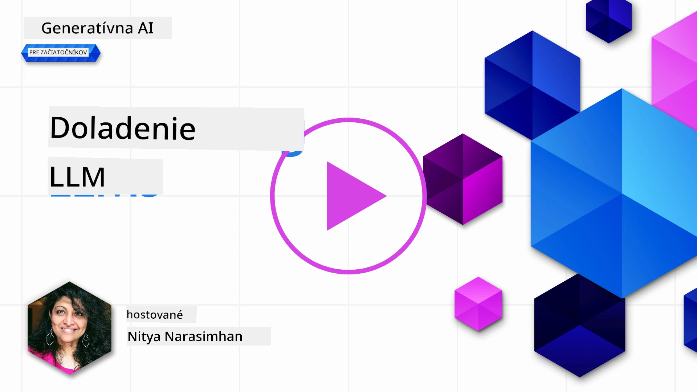
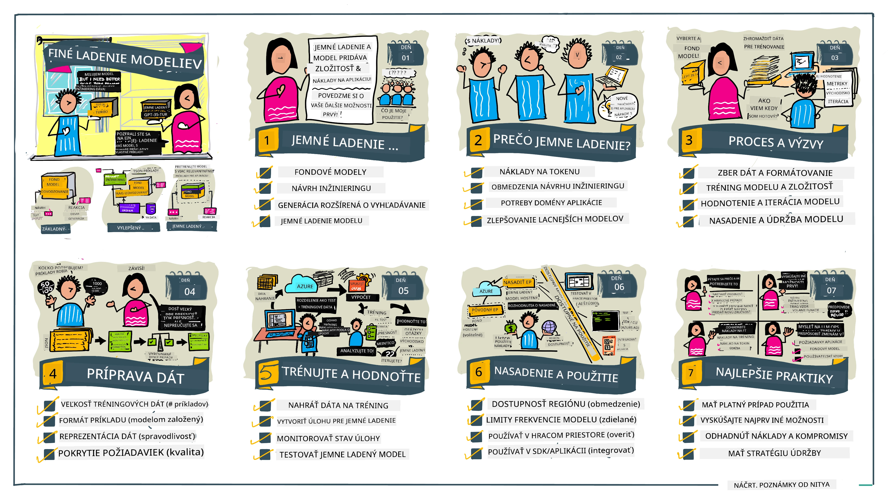

# Doladenie vášho LLM

Používanie veľkých jazykových modelov na vytváranie generatívnych AI aplikácií prináša nové výzvy. Kľúčovou otázkou je zabezpečiť kvalitu odpovedí (presnosť a relevantnosť) v obsahu generovanom modelom pre danú používateľskú požiadavku. V predchádzajúcich lekciách sme diskutovali techniky ako návrh promptov a generovanie podmienené načítaním, ktoré sa snažia vyriešiť problém úpravou vstupného promptu do existujúceho modelu.

V dnešnej lekcii rozoberáme tretiu techniku, **doladenie**, ktorá sa snaží vyriešiť výzvu _znovuvyškolením samotného modelu_ pomocou ďalších dát. Poďme sa pozrieť na detaily.

## Ciele učenia

Táto lekcia predstavuje koncept doladenia predtrénovaných jazykových modelov, skúma výhody a výzvy tohto prístupu a poskytuje usmernenie, kedy a ako doladiť model, aby sa zlepšil výkon vašich generatívnych AI modelov.

Na konci tejto lekcie by ste mali vedieť odpovedať na nasledujúce otázky:

- Čo je doladenie pre jazykové modely?
- Kedy a prečo je doladenie užitočné?
- Ako môžem doladiť predtrénovaný model?
- Aké sú obmedzenia doladenia?

Pripraveni? Poďme začať.

## Ilustrovaný sprievodca

Chcete získať prehľad o tom, čo pokryjeme, skôr ako sa do toho pustíme? Pozrite si tento ilustrovaný sprievodca, ktorý popisuje učebnú cestu tejto lekcie – od osvojenia si základných konceptov a motivácie pre doladenie až po pochopenie procesu a najlepších postupov vykonávania úlohy doladenia. Toto je fascinujúca téma na preskúmanie, takže nezabudnite navštíviť stránku [Zdroje](./RESOURCES.md?WT.mc_id=academic-105485-koreyst) pre ďalšie odkazy na podporu vášho samostatného študijného dobrodružstva!

## Čo je doladenie pre jazykové modely?

Podľa definície sú veľké jazykové modely _predtrénované_ na veľkých množstvách textu získaného z rôznych zdrojov vrátane internetu. Ako sme sa naučili v predchádzajúcich lekciách, potrebujeme techniky ako _návrh promptov_ a _generovanie podmienené načítaním_, aby sme zlepšili kvalitu odpovedí modelu na používateľské otázky („prompty“).

Populárna technika návrhu promptov zahŕňa poskytnutie modelu väčšieho usmernenia, čo sa očakáva v odpovedi, buď poskytnutím _inštrukcií_ (explicitné usmernenie) alebo _poskytnutím niekoľkých príkladov_ (implicitné usmernenie). Toto sa nazýva _few-shot learning_, ale má dve obmedzenia:

- Tokenové limity modelu môžu obmedziť počet príkladov, ktoré môžete poskytnúť, a tým aj efektivitu.
- Náklady na tokeny môžu spôsobiť, že pridávanie príkladov do každého promptu bude drahé a obmedzí flexibilitu.

Doladenie je bežná prax v strojovom učení, pri ktorej vezmeme predtrénovaný model a znovu ho trénujeme na nových dátach, aby sme zlepšili jeho výkon pre konkrétnu úlohu. V kontexte jazykových modelov môžeme doladiť predtrénovaný model _pomocou vybranej množiny príkladov pre danú úlohu alebo aplikačnú doménu_ a vytvoriť tak **vlastný model**, ktorý môže byť presnejší a relevantnejší pre túto konkrétnu úlohu alebo doménu. Vedľajšou výhodou doladenia je, že môže tiež znížiť počet príkladov potrebných pre few-shot learning – čím zníži používanie tokenov a súvisiace náklady.

## Kedy a prečo by sme mali doladiť modely?

V _tomto_ kontexte, keď hovoríme o doladení, máme na mysli **dozorované** doladenie, kde sa znovuvyškolenie vykonáva **pridaním nových dát**, ktoré neboli súčasťou pôvodnej tréningovej dátovej sady. To sa líši od nedozorovaného doladenia, kde sa model znovu trénuje na pôvodných dátach, ale s inými hyperparametrami.

Kľúčové je, že doladenie je pokročilá technika, ktorá vyžaduje určitú úroveň odbornosti, aby sa dosiahli želané výsledky. Ak sa vykoná nesprávne, nemusí priniesť očakávané zlepšenia a môže dokonca zhoršiť výkon modelu pre vašu cieľovú doménu.

Takže predtým, než sa naučíte "ako" doladiť jazykové modely, musíte vedieť "prečo" by ste mali ísť týmto smerom a "kedy" začať proces doladenia. Začnite tým, že si položíte tieto otázky:

- **Použitie**: Aký je váš _používateľský prípad_ pre doladenie? Ktorý aspekt existujúceho predtrénovaného modelu chcete zlepšiť?
- **Alternatívy**: Skúsili ste _iné techniky_ na dosiahnutie želaných výsledkov? Použite ich ako referenciu na porovnanie.
  - Návrh promptov: Skúste techniky ako few-shot prompting s príkladmi relevantných odpovedí na prompt. Vyhodnoťte kvalitu odpovedí.
  - Generovanie s načítaním: Skúste doplniť prompty výsledkami vyhľadávania vo vašich dátach. Vyhodnoťte kvalitu odpovedí.
- **Náklady**: Identifikovali ste náklady na doladenie?
  - Možnosť ladenia – je predtrénovaný model dostupný na doladenie?
  - Úsilie – na prípravu tréningových dát, hodnotenie a dolaďovanie modelu.
  - Výpočtový výkon – na spustenie doladenia a nasadenie doladeného modelu.
  - Dáta – prístup k dostatočnej kvalite príkladov pre efekt doladenia.
- **Výhody**: Potvrdili ste výhody doladenia?
  - Kvalita – prekonal doladený model základnú verziu?
  - Náklady – znižuje používanie tokenov zjednodušením promptov?
  - Rozšíriteľnosť – môžete základný model použiť pre nové domény?

Odpovedaním na tieto otázky by ste mali vedieť rozhodnúť, či je doladenie správny prístup pre váš prípad použitia. Optimálne je použitie platné len vtedy, ak výhody prevyšujú náklady. Akonáhle sa rozhodnete pokračovať, je čas premýšľať o tom, _ako_ doladiť predtrénovaný model.

Chcete získať viac poznatkov o rozhodovacom procese? Pozrite si [Doladiť alebo nedoladiť](https://www.youtube.com/watch?v=0Jo-z-MFxJs)

## Ako môžeme doladiť predtrénovaný model?

Na doladenie predtrénovaného modelu potrebujete:

- predtrénovaný model na doladenie
- dátovú sadu na doladenie
- tréningové prostredie na spustenie úlohy doladenia
- hostingové prostredie na nasadenie doladeného modelu

## Doladenie v praxi

Nasledujúce zdroje poskytujú tutoriály krok za krokom, ktoré vás prevedú reálnym príkladom využitia vybraného modelu s vybranou dátovou sadou. Na prácu s týmito tutoriálmi potrebujete účet u konkrétneho poskytovateľa spolu s prístupom k relevantnému modelu a dátam.

| Poskytovateľ | Tutoriál                                                                                                                                                         | Popis                                                                                                                                                                                                                                                                                                                                                                                                                             |
| ------------ | ---------------------------------------------------------------------------------------------------------------------------------------------------------------- | -------------------------------------------------------------------------------------------------------------------------------------------------------------------------------------------------------------------------------------------------------------------------------------------------------------------------------------------------------------------------------------------------------------------------------- |
| OpenAI       | [Ako doladiť chat modely](https://github.com/openai/openai-cookbook/blob/main/examples/How_to_finetune_chat_models.ipynb?WT.mc_id=academic-105485-koreyst)        | Naučte sa doladiť `gpt-35-turbo` pre konkrétnu doménu ("asistent receptov") prípravou tréningových dát, spustením úlohy doladenia a použitím doladeného modelu na inferenciu.                                                                                                                                                                                                                                                   |
| Azure OpenAI | [Tutoriál doladenia GPT 3.5 Turbo](https://learn.microsoft.com/azure/ai-services/openai/tutorials/fine-tune?tabs=python-new%2Ccommand-line&WT.mc_id=academic-105485-koreyst) | Naučte sa doladiť model `gpt-35-turbo-0613` **na Azure** krokmi vytvárania a nahrávania tréningových dát, spustením úlohy doladenia. Nasadíte a použijete nový model.                                                                                                                                                                                                                                                          |
| Hugging Face | [Doladenie LLM s Hugging Face](https://www.philschmid.de/fine-tune-llms-in-2024-with-trl?WT.mc_id=academic-105485-koreyst)                                         | Tento blogový príspevok vás prevedie doladením _open LLM_ (napr.: `CodeLlama 7B`) pomocou knižnice [transformers](https://huggingface.co/docs/transformers/index?WT.mc_id=academic-105485-koreyst) a [Transformer Reinforcement Learning (TRL)](https://huggingface.co/docs/trl/index?WT.mc_id=academic-105485-koreyst) s otvorenými [datasetmi](https://huggingface.co/docs/datasets/index?WT.mc_id=academic-105485-koreyst) na Hugging Face. |
|              |                                                                                                                                                                  |                                                                                                                                                                                                                                                                                                                                                                                                                                   |
| 🤗 AutoTrain | [Doladenie LLM s AutoTrain](https://github.com/huggingface/autotrain-advanced/?WT.mc_id=academic-105485-koreyst)                                                   | AutoTrain (alebo AutoTrain Advanced) je python knižnica vyvinutá Hugging Face, ktorá umožňuje doladenie pre mnohé úlohy vrátane doladenia LLM. AutoTrain je riešenie bez kódu a doladenie môže byť vykonané vo vašom vlastnom cloude, na Hugging Face Spaces alebo lokálne. Podporuje webové GUI, CLI a tréning cez yaml konfiguračné súbory.                                                                               |
|              |                                                                                                                                                                  |                                                                                                                                                                                                                                                                                                                                                                                                                                   |
| 🦥 Unsloth   | [Doladenie LLM s Unsloth](https://github.com/unslothai/unsloth)                                                                                                  | Unsloth je open-source framework, ktorý podporuje doladenie LLM a reinforcement learning (RL). Unsloth uľahčuje lokálny tréning, hodnotenie a nasadenie pomocou pripravených [notebookov](https://github.com/unslothai/notebooks). Podporuje tiež text-to-speech (TTS), BERT a multimodálne modely. Na začiatok si prečítajte ich krok za krokom [Sprievodcu doladením LLM](https://docs.unsloth.ai/get-started/fine-tuning-llms-guide).               |
|              |                                                                                                                                                                  |                                                                                                                                                                                                                                                                                                                                                                                                                                   |
## Zadanie

Vyberte si jeden z vyššie uvedených tutoriálov a prejdite si ho. _Môžeme replikovať verziu týchto tutoriálov v Jupyter Notebookoch v tomto repozitári iba na referenciu. Pre najnovšie verzie prosím používajte priamo pôvodné zdroje_.

## Skvelá práca! Pokračujte v učení.

Po dokončení tejto lekcie si prezrite našu [kolekciu vzdelávania o generatívnej AI](https://aka.ms/genai-collection?WT.mc_id=academic-105485-koreyst), aby ste naďalej zvyšovali svoje znalosti o generatívnej AI!

Gratulujeme!! Dokončili ste poslednú lekciu zo série v2 tohto kurzu! Nezastavujte sa v učení a tvorbe. \*\*Prezrite si stránku [ZDROJE](RESOURCES.md?WT.mc_id=academic-105485-koreyst) pre zoznam ďalších odporúčaní k tejto téme.

Naša séria lekcií v1 bola tiež aktualizovaná o ďalšie zadania a koncepty. Tak si dajte minútu na obnovenie svojich znalostí – a prosím [zdieľajte svoje otázky a pripomienky](https://github.com/microsoft/generative-ai-for-beginners/issues?WT.mc_id=academic-105485-koreyst), aby sme mohli tieto lekcie pre komunitu vylepšiť.

---

<!-- CO-OP TRANSLATOR DISCLAIMER START -->
**Odporúčanie**:  
Tento dokument bol preložený pomocou AI prekladateľskej služby [Co-op Translator](https://github.com/Azure/co-op-translator). Aj keď sa snažíme o presnosť, majte prosím na pamäti, že automatizované preklady môžu obsahovať chyby alebo nepresnosti. Originálny dokument v jeho pôvodnom jazyku by mal byť považovaný za autoritatívny zdroj. Pre dôležité informácie sa odporúča profesionálny ľudský preklad. Nezodpovedáme za akékoľvek nedorozumenia alebo nesprávne výklady vyplývajúce z použitia tohto prekladu.
<!-- CO-OP TRANSLATOR DISCLAIMER END -->