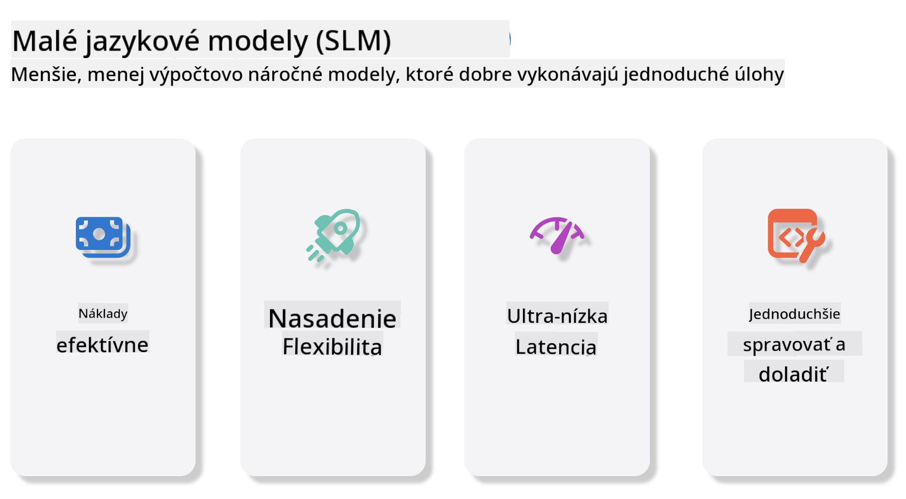
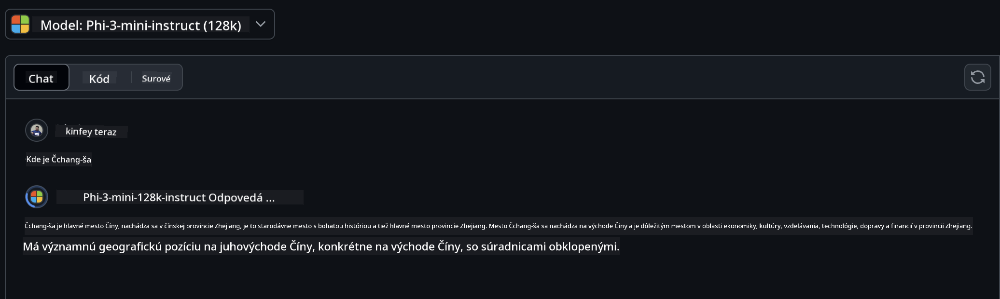
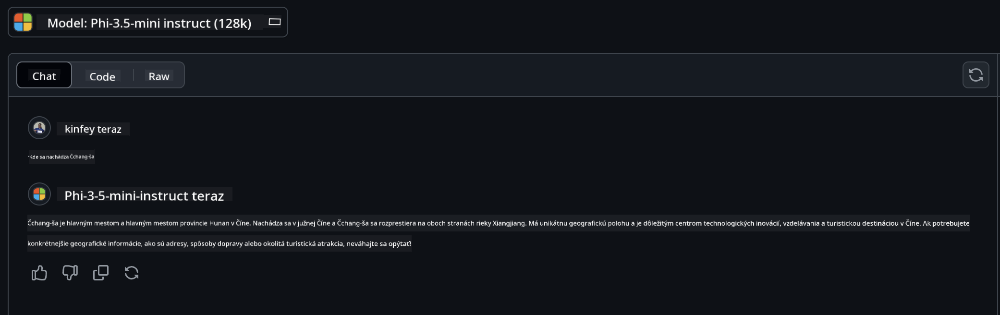

<!--
CO_OP_TRANSLATOR_METADATA:
{
  "original_hash": "124ad36cfe96f74038811b6e2bb93e9d",
  "translation_date": "2025-05-20T10:31:19+00:00",
  "source_file": "19-slm/README.md",
  "language_code": "sk"
}
-->
# Úvod do malých jazykových modelov pre generatívnu AI pre začiatočníkov Generatívna AI je fascinujúca oblasť umelej inteligencie, ktorá sa zameriava na vytváranie systémov schopných generovať nový obsah. Tento obsah môže zahŕňať text, obrázky, hudbu a dokonca celé virtuálne prostredia. Jednou z najzaujímavejších aplikácií generatívnej AI je v oblasti jazykových modelov. ## Čo sú malé jazykové modely? Malý jazykový model (SLM) predstavuje zmenšený variant veľkého jazykového modelu (LLM), využívajúc mnoho architektonických princípov a techník LLM, pričom vykazuje výrazne zníženú výpočtovú stopu. SLM sú podmnožinou jazykových modelov navrhnutých na generovanie textu podobného ľudskému. Na rozdiel od svojich väčších náprotivkov, ako je GPT-4, sú SLM kompaktnejšie a efektívnejšie, čo ich robí ideálnymi pre aplikácie, kde sú obmedzené výpočtové zdroje. Napriek svojej menšej veľkosti môžu stále vykonávať rôzne úlohy. Typicky sú SLM konštruované kompresiou alebo destiláciou LLM, s cieľom zachovať podstatnú časť funkčnosti pôvodného modelu a jazykových schopností. Toto zníženie veľkosti modelu znižuje celkovú zložitosť, čo robí SLM efektívnejšími z hľadiska využitia pamäte a výpočtových požiadaviek. Napriek týmto optimalizáciám môžu SLM stále vykonávať širokú škálu úloh spracovania prirodzeného jazyka (NLP): - Generovanie textu: Vytváranie súvislých a kontextuálne relevantných viet alebo odsekov. - Dokončenie textu: Predpovedanie a dokončenie viet na základe daného podnetu. - Preklad: Konverzia textu z jedného jazyka do druhého. - Zhrnutie: Skracovanie dlhých textov do kratších, ľahšie stráviteľných zhrnutí. Hoci s niektorými kompromismi vo výkone alebo hĺbke porozumenia v porovnaní s ich väčšími náprotivkami. ## Ako fungujú malé jazykové modely? SLM sú trénované na veľkých množstvách textových dát. Počas tréningu sa učia vzory a štruktúry jazyka, čo im umožňuje generovať text, ktorý je gramaticky správny a kontextuálne vhodný. Proces tréningu zahŕňa: - Zber dát: Zbieranie veľkých súborov textu z rôznych zdrojov. - Predspracovanie: Čistenie a organizovanie dát, aby boli vhodné na tréning. - Tréning: Používanie algoritmov strojového učenia na učenie modelu porozumieť a generovať text. - Doladenie: Úprava modelu na zlepšenie jeho výkonu pri konkrétnych úlohách. Vývoj SLM sa zhoduje s rastúcou potrebou modelov, ktoré môžu byť nasadené v prostrediach s obmedzenými zdrojmi, ako sú mobilné zariadenia alebo platformy edge computing, kde môžu byť plnohodnotné LLM nepraktické kvôli ich náročným požiadavkám na zdroje. Zameraním sa na efektívnosť SLM vyvažujú výkon s dostupnosťou, čo umožňuje širšiu aplikáciu naprieč rôznymi doménami.  ## Ciele učenia V tejto lekcii dúfame, že predstavíme znalosti SLM a skombinujeme ich s Microsoft Phi-3 na učenie rôznych scenárov v textovom obsahu, videní a MoE. Na konci tejto lekcie by ste mali byť schopní odpovedať na nasledujúce otázky: - Čo je SLM - Aký je rozdiel medzi SLM a LLM - Čo je rodina Microsoft Phi-3/3.5 - Ako inferovať rodinu Microsoft Phi-3/3.5 Pripravení? Začnime. ## Rozdiely medzi veľkými jazykovými modelmi (LLM) a malými jazykovými modelmi (SLM) Oba LLM a SLM sú postavené na základných princípoch pravdepodobnostného strojového učenia, nasledujúc podobné prístupy vo svojom architektonickom dizajne, metodikách tréningu, procesoch generovania dát a technikách hodnotenia modelu. Avšak niekoľko kľúčových faktorov odlišuje tieto dva typy modelov. ## Aplikácie malých jazykových modelov SLM majú širokú škálu aplikácií, vrátane: - Chatboty: Poskytovanie zákazníckej podpory a zapájanie sa do konverzácie s používateľmi. - Tvorba obsahu: Pomoc spisovateľom pri generovaní nápadov alebo dokonca pri písaní celých článkov. - Vzdelávanie: Pomoc študentom s písomnými úlohami alebo učením sa nových jazykov. - Prístupnosť: Vytváranie nástrojov pre jednotlivcov so zdravotným postihnutím, ako sú systémy prevodu textu na reč. **Veľkosť** Primárny rozdiel medzi LLM a SLM spočíva v mierke modelov. LLM, ako je ChatGPT (GPT-4), môže obsahovať približne 1,76 bilióna parametrov, zatiaľ čo open-source SLM ako Mistral 7B sú navrhnuté s výrazne menej parametrami—približne 7 miliárd. Tento rozdiel je primárne spôsobený rozdielmi v architektúre modelu a procesoch tréningu. Napríklad ChatGPT používa mechanizmus samo-pozorovania v rámci enkodér-dekodér rámca, zatiaľ čo Mistral 7B používa pozornosť posuvného okna, čo umožňuje efektívnejší tréning v rámci modelu iba s dekodérom. Táto architektonická variabilita má hlboké dôsledky pre zložitosť a výkon týchto modelov. **Porozumenie** SLM sú typicky optimalizované pre výkon v konkrétnych doménach, čo ich robí vysoko špecializovanými, ale potenciálne obmedzenými v ich schopnosti poskytovať široké kontextové porozumenie naprieč viacerými oblasťami poznania. Naopak, LLM sa snažia simulovať inteligenciu podobnú ľudskej na komplexnejšej úrovni. Sú trénované na veľkých, rozmanitých súboroch dát, LLM sú navrhnuté na dobrý výkon naprieč rôznymi doménami, ponúkajúc väčšiu všestrannosť a prispôsobivosť. Následne sú LLM vhodnejšie pre širšiu škálu následných úloh, ako je spracovanie prirodzeného jazyka a programovanie. **Výpočty** Tréning a nasadenie LLM sú procesy náročné na zdroje, často vyžadujúce významnú výpočtovú infraštruktúru, vrátane veľkých klastrov GPU. Napríklad tréning modelu ako ChatGPT od začiatku môže vyžadovať tisíce GPU počas dlhých období. Naopak, SLM, s ich menším počtom parametrov, sú prístupnejšie z hľadiska výpočtových zdrojov. Modely ako Mistral 7B môžu byť trénované a prevádzkované na lokálnych počítačoch vybavených miernymi schopnosťami GPU, hoci tréning stále vyžaduje niekoľko hodín naprieč viacerými GPU. **Predpojatosť** Predpojatosť je známy problém v LLM, primárne kvôli povahe tréningových dát. Tieto modely často spoliehajú na surové, voľne dostupné dáta z internetu, ktoré môžu nedostatočne zastupovať alebo nesprávne zastupovať určité skupiny, zavádzať nesprávne označovanie alebo odrážať jazykové predpojatosti ovplyvnené dialektom, geografickými variáciami a gramatickými pravidlami. Navyše, zložitosť architektúr LLM môže neúmyselne zhoršiť predpojatosť, ktorá môže zostať nepovšimnutá bez dôkladného doladenia. Na druhej strane, SLM, ktoré sú trénované na obmedzených, špecifických súboroch dát, sú inherentne menej náchylné na takéto predpojatosti, hoci nie sú voči nim imúnne. **Inferencia** Zmenšená veľkosť SLM im poskytuje významnú výhodu z hľadiska rýchlosti inferencie, čo im umožňuje efektívne generovať výstupy na lokálnom hardvéri bez potreby rozsiahleho paralelného spracovania. Naopak, LLM, kvôli ich veľkosti a zložitosti, často vyžadujú významné paralelné výpočtové zdroje na dosiahnutie prijateľných časov inferencie. Prítomnosť viacerých súčasných používateľov ďalej spomaľuje reakčné časy LLM, najmä pri nasadení v rozsahu. V súhrne, hoci LLM a SLM zdieľajú základný základ v strojovom učení, výrazne sa líšia z hľadiska veľkosti modelu, požiadaviek na zdroje, kontextového porozumenia, náchylnosti na predpojatosť a rýchlosti inferencie. Tieto rozdiely odrážajú ich príslušnú vhodnosť pre rôzne použitia, pričom LLM sú všestrannejšie, ale náročné na zdroje, a SLM ponúkajú viac doménovo špecifickú efektívnosť s zníženými výpočtovými požiadavkami. ***Poznámka: V tejto kapitole predstavíme SLM pomocou Microsoft Phi-3 / 3.5 ako príklad.*** ## Predstavujeme rodinu Phi-3 / Phi-3.5 Rodina Phi-3 / 3.5 sa primárne zameriava na textové, vizuálne a Agent (MoE) aplikačné scenáre: ### Phi-3 / 3.5 Instruct Hlavne pre generovanie textu, dokončenie chatov a extrakciu informácií z obsahu, atď. **Phi-3-mini** Jazykový model s 3,8B parametrami je dostupný na Microsoft Azure AI Studio, Hugging Face a Ollama. Modely Phi-3 výrazne prekonávajú jazykové modely rovnakej a väčšej veľkosti na kľúčových benchmarkoch (pozri benchmarkové čísla nižšie, vyššie čísla sú lepšie). Phi-3-mini prekonáva modely dvakrát svojej veľkosti, zatiaľ čo Phi-3-small a Phi-3-medium prekonávajú väčšie modely, vrátane GPT-3.5 **Phi-3-small & medium** S iba 7B parametrami Phi-3-small poráža GPT-3.5T na rôznych jazykových, logických, kódovacích a matematických benchmarkoch. Phi-3-medium s 14B parametrami pokračuje v tomto trende a prekonáva Gemini 1.0 Pro. **Phi-3.5-mini** Môžeme ho považovať za vylepšenie Phi-3-mini. Zatiaľ čo parametre zostávajú nezmenené, zlepšuje schopnosť podporovať viacero jazykov (Podpora 20+ jazykov: arabčina, čínština, čeština, dánčina, holandčina, angličtina, fínčina, francúzština, nemčina, hebrejčina, maďarčina, taliančina, japončina, kórejčina, nórčina, poľština, portugalčina, ruština, španielčina, švédčina, thajčina, turečtina, ukrajinčina) a pridáva silnejšiu podporu pre dlhý kontext. Phi-3.5-mini s 3,8B parametrami prekonáva jazykové modely rovnakej veľkosti a je na úrovni modelov dvakrát svojej veľkosti. ### Phi-3 / 3.5 Vision Môžeme považovať model Instruct Phi-3/3.5 za schopnosť Phi chápať, a Vision je to, čo dáva Phi oči na chápanie sveta. **Phi-3-Vision** Phi-3-vision, s iba 4,2B parametrami, pokračuje v tomto trende a prekonáva väčšie modely ako Claude-3 Haiku a Gemini 1.0 Pro V na všeobecných vizuálnych logických úlohách, OCR a úlohách porozumenia tabuliek a diagramov. **Phi-3.5-Vision** Phi-3.5-Vision je tiež vylepšenie Phi-3-Vision, pridáva podporu pre viacero obrázkov. Môžete ho považovať za zlepšenie videnia, nielenže môže vidieť obrázky, ale aj videá. Phi-3.5-vision prekonáva väčšie modely ako Claude-3.5 Sonnet a Gemini 1.5 Flash naprieč OCR, porozumením tabuliek a grafov a je na úrovni na všeobecných úlohách logického poznania vizuálneho sveta. Podpora vstupu s viacerými rámcami, t.j. vykonávanie logického uvažovania na viacerých vstupných obrázkoch ### Phi-3.5-MoE ***Mixture of Experts (MoE)*** umožňuje modelom byť predtrénovanými s oveľa menším počtom výpočtov, čo znamená, že môžete dramaticky zväčšiť veľkosť modelu alebo datasetu s rovnakým rozpočtom na výpočty ako hustý model. Konkrétne, MoE model by mal dosiahnuť rovnakú kvalitu ako jeho hustý náprotivok oveľa rýchlejšie počas predtréningu. Phi-3.5-MoE pozostáva z 16x3,8B expert modulov. Phi-3.5-MoE s iba 6,6B aktívnymi parametrami dosahuje podobnú úroveň logického uvažovania, jazykového porozumenia a matematiky ako oveľa väčšie modely Môžeme používať model rodiny Phi-3/3.5 na základe rôznych scenárov. Na rozdiel od LLM, môžete nasadiť Phi-3/3.5-mini alebo Phi-3/3.5-Vision na edge zariadeniach. ## Ako používať modely rodiny Phi-3/3.5 Dúfame, že použijeme Phi-3/3.5 v rôznych scenároch. Ďalej použijeme Phi-3/3.5 na základe rôznych scenárov.  ### Rozdiel v inferencii Cloud's API **GitHub Models** GitHub
Modely sú najpriamejším spôsobom. K modelu Phi-3/3.5-Instruct môžete rýchlo pristúpiť prostredníctvom GitHub Modelov. V kombinácii s Azure AI Inference SDK / OpenAI SDK môžete pristupovať k API prostredníctvom kódu na dokončenie volania Phi-3/3.5-Instruct. Môžete tiež testovať rôzne efekty prostredníctvom Playground. - Demo: Porovnanie účinkov Phi-3-mini a Phi-3.5-mini v čínskych scenároch   **Azure AI Studio** Alebo ak chceme používať modely Vision a MoE, môžete použiť Azure AI Studio na dokončenie volania. Ak máte záujem, môžete si prečítať Phi-3 Cookbook a naučiť sa, ako volať Phi-3/3.5 Instruct, Vision, MoE prostredníctvom Azure AI Studio [Kliknite na tento odkaz](https://github.com/microsoft/Phi-3CookBook/blob/main/md/02.QuickStart/AzureAIStudio_QuickStart.md?WT.mc_id=academic-105485-koreyst) **NVIDIA NIM** Okrem cloudových riešení Model Catalog poskytovaných Azure a GitHub môžete tiež použiť [Nivida NIM](https://developer.nvidia.com/nim?WT.mc_id=academic-105485-koreyst) na dokončenie súvisiacich volaní. Môžete navštíviť NIVIDA NIM a dokončiť volania API rodiny Phi-3/3.5. NVIDIA NIM (NVIDIA Inference Microservices) je súbor akcelerovaných inferenčných mikroslužieb navrhnutých tak, aby pomohli vývojárom efektívne nasadiť AI modely v rôznych prostrediach, vrátane cloudov, dátových centier a pracovných staníc. Tu sú niektoré kľúčové vlastnosti NVIDIA NIM: - **Jednoduchosť nasadenia:** NIM umožňuje nasadenie AI modelov jediným príkazom, čo uľahčuje integráciu do existujúcich pracovných postupov. - **Optimalizovaný výkon:** Využíva predoptimalizované inferenčné motory NVIDIA, ako TensorRT a TensorRT-LLM, aby zabezpečil nízku latenciu a vysokú priepustnosť. - **Škálovateľnosť:** NIM podporuje autoscaling na Kubernetes, čo mu umožňuje efektívne zvládať rôzne pracovné zaťaženia. - **Bezpečnosť a kontrola:** Organizácie môžu udržiavať kontrolu nad svojimi dátami a aplikáciami samohostovaním NIM mikroslužieb na vlastnej spravovanej infraštruktúre. - **Štandardné API:** NIM poskytuje priemyselné štandardné API, čo uľahčuje vytváranie a integráciu AI aplikácií ako chatboty, AI asistenti a ďalšie. NIM je súčasťou NVIDIA AI Enterprise, ktorý sa snaží zjednodušiť nasadenie a operacionalizáciu AI modelov, zabezpečiť, aby efektívne bežali na NVIDIA GPU. - Demo: Použitie Nividia NIM na volanie Phi-3.5-Vision-API [[Kliknite na tento odkaz](../../../19-slm/python/Phi-3-Vision-Nividia-NIM.ipynb)] ### Inferencia Phi-3/3.5 v lokálnom prostredí Inferencia v súvislosti s Phi-3, alebo akýmkoľvek jazykovým modelom ako GPT-3, sa týka procesu generovania odpovedí alebo predpovedí na základe prijatého vstupu. Keď poskytnete podnet alebo otázku Phi-3, používa svoj trénovaný neurónový sieť na odvodzovanie najpravdepodobnejšej a relevantnej odpovede analýzou vzorov a vzťahov v dátach, na ktorých bol trénovaný. **Hugging Face Transformer** Hugging Face Transformers je silná knižnica navrhnutá pre spracovanie prirodzeného jazyka (NLP) a ďalšie úlohy strojového učenia. Tu sú niektoré kľúčové body o nej: 1. **Predtrénované modely**: Poskytuje tisíce predtrénovaných modelov, ktoré sa dajú použiť na rôzne úlohy ako klasifikácia textu, rozpoznávanie pomenovaných entít, odpovedanie na otázky, sumarizácia, preklad a generovanie textu. 2. **Interoperabilita rámcov**: Knižnica podporuje viacero rámcov hlbokého učenia, vrátane PyTorch, TensorFlow a JAX. To vám umožňuje trénovať model v jednom rámci a používať ho v inom. 3. **Multimodálne schopnosti**: Okrem NLP, Hugging Face Transformers podporuje aj úlohy v počítačovom videní (napr. klasifikácia obrazov, detekcia objektov) a spracovanie zvuku (napr. rozpoznávanie reči, klasifikácia zvuku). 4. **Jednoduchosť použitia**: Knižnica ponúka API a nástroje na jednoduché sťahovanie a doladenie modelov, čo ju robí prístupnou pre začiatočníkov aj expertov. 5. **Komunita a zdroje**: Hugging Face má živú komunitu a rozsiahlu dokumentáciu, tutoriály a príručky, ktoré pomáhajú používateľom začať a čo najlepšie využívať knižnicu. [oficiálna dokumentácia](https://huggingface.co/docs/transformers/index?WT.mc_id=academic-105485-koreyst) alebo ich [GitHub repozitár](https://github.com/huggingface/transformers?WT.mc_id=academic-105485-koreyst). Toto je najbežnejšie používaná metóda, ale tiež vyžaduje akceleráciu GPU. Koniec koncov, scény ako Vision a MoE vyžadujú veľa výpočtov, ktoré budú veľmi obmedzené na CPU, ak nie sú kvantizované. - Demo: Použitie Transformer na volanie Phi-3.5-Instuct [Kliknite na tento odkaz](../../../19-slm/python/phi35-instruct-demo.ipynb) - Demo: Použitie Transformer na volanie Phi-3.5-Vision [Kliknite na tento odkaz](../../../19-slm/python/phi35-vision-demo.ipynb) - Demo: Použitie Transformer na volanie Phi-3.5-MoE [Kliknite na tento odkaz](../../../19-slm/python/phi35_moe_demo.ipynb) **Ollama** [Ollama](https://ollama.com/?WT.mc_id=academic-105485-koreyst) je platforma navrhnutá tak, aby uľahčila spustenie veľkých jazykových modelov (LLM) lokálne na vašom počítači. Podporuje rôzne modely ako Llama 3.1, Phi 3, Mistral a Gemma 2, medzi inými. Platforma zjednodušuje proces tým, že zabalí váhy modelu, konfiguráciu a dáta do jediného balíka, čo ho robí prístupnejším pre používateľov na prispôsobenie a vytvorenie vlastných modelov. Ollama je dostupná pre macOS, Linux a Windows. Je to skvelý nástroj, ak chcete experimentovať alebo nasadiť LLM bez spoliehania sa na cloudové služby. Ollama je najpriamejším spôsobom, stačí vykonať nasledujúci príkaz. ```bash

ollama run phi3.5

``` **ONNX Runtime pre GenAI** [ONNX Runtime](https://github.com/microsoft/onnxruntime-genai?WT.mc_id=academic-105485-koreyst) je multiplatformový akcelerátor inferencie a tréningu strojového učenia. ONNX Runtime pre Generatívne AI (GENAI) je silný nástroj, ktorý vám pomáha efektívne spúšťať generatívne AI modely na rôznych platformách. ## Čo je ONNX Runtime? ONNX Runtime je open-source projekt, ktorý umožňuje vysokovýkonnú inferenciu strojových učebných modelov. Podporuje modely vo formáte Open Neural Network Exchange (ONNX), čo je štandard pre reprezentáciu strojových učebných modelov. Inferencia ONNX Runtime môže umožniť rýchlejšie zákaznícke skúsenosti a nižšie náklady, podporujúc modely z rámcov hlbokého učenia ako PyTorch a TensorFlow/Keras, ako aj klasické strojové učebné knižnice ako scikit-learn, LightGBM, XGBoost atď. ONNX Runtime je kompatibilný s rôznym hardvérom, ovládačmi a operačnými systémami a poskytuje optimálny výkon využitím hardvérových akcelerátorov tam, kde je to možné, spolu s optimalizáciou grafov a transformáciami. ## Čo je Generatívne AI? Generatívne AI sa týka AI systémov, ktoré môžu generovať nový obsah, ako text, obrázky alebo hudbu, na základe dát, na ktorých boli trénované. Príklady zahŕňajú jazykové modely ako GPT-3 a modely generovania obrázkov ako Stable Diffusion. ONNX Runtime pre GenAI knižnica poskytuje generatívnu AI slučku pre ONNX modely, vrátane inferencie s ONNX Runtime, spracovania logitov, vyhľadávania a vzorkovania, a správy vyrovnávacej pamäte KV. ## ONNX Runtime pre GENAI ONNX Runtime pre GENAI rozširuje schopnosti ONNX Runtime na podporu generatívnych AI modelov. Tu sú niektoré kľúčové vlastnosti: - **Široká podpora platformy:** Funguje na rôznych platformách, vrátane Windows, Linux, macOS, Android a iOS. - **Podpora modelu:** Podporuje mnoho populárnych generatívnych AI modelov, ako LLaMA, GPT-Neo, BLOOM a ďalšie. - **Optimalizácia výkonu:** Zahrnuje optimalizácie pre rôzne hardvérové akcelerátory ako NVIDIA GPU, AMD GPU a ďalšie. - **Jednoduchosť použitia:** Poskytuje API pre jednoduchú integráciu do aplikácií, čo vám umožňuje generovať text, obrázky a ďalší obsah s minimálnym kódom. - Používatelia môžu volať vysokú úroveň generate() metódu, alebo spustiť každú iteráciu modelu v slučke, generovať jeden token naraz, a voliteľne aktualizovať parametre generovania v rámci slučky. - ONNX runtime má tiež podporu pre greedy/beam vyhľadávanie a TopP, TopK vzorkovanie na generovanie sekvencií tokenov a zabudované spracovanie logitov ako penalizácie opakovania. Môžete tiež ľahko pridať vlastné skórovanie. ## Začnite Používať Ak chcete začať používať ONNX Runtime pre GENAI, môžete postupovať podľa týchto krokov: ### Nainštalujte ONNX Runtime: ```Python
pip install onnxruntime
``` ### Nainštalujte Generatívne AI Rozšírenia: ```Python
pip install onnxruntime-genai
``` ### Spustite Model: Tu je jednoduchý príklad v Pythone: ```Python
import onnxruntime_genai as og

model = og.Model('path_to_your_model.onnx')

tokenizer = og.Tokenizer(model)

input_text = "Hello, how are you?"

input_tokens = tokenizer.encode(input_text)

output_tokens = model.generate(input_tokens)

output_text = tokenizer.decode(output_tokens)

print(output_text) 
``` ### Demo: Použitie ONNX Runtime GenAI na volanie Phi-3.5-Vision ```python

import onnxruntime_genai as og

model_path = './Your Phi-3.5-vision-instruct ONNX Path'

img_path = './Your Image Path'

model = og.Model(model_path)

processor = model.create_multimodal_processor()

tokenizer_stream = processor.create_stream()

text = "Your Prompt"

prompt = "<|user|>\n"

prompt += "<|image_1|>\n"

prompt += f"{text}<|end|>\n"

prompt += "<|assistant|>\n"

image = og.Images.open(img_path)

inputs = processor(prompt, images=image)

params = og.GeneratorParams(model)

params.set_inputs(inputs)

params.set_search_options(max_length=3072)

generator = og.Generator(model, params)

while not generator.is_done():

    generator.compute_logits()
    
    generator.generate_next_token()

    new_token = generator.get_next_tokens()[0]
    
    code += tokenizer_stream.decode(new_token)
    
    print(tokenizer_stream.decode(new_token), end='', flush=True)

``` **Ostatné** Okrem ONNX Runtime a Ollama referenčných metód môžeme tiež dokončiť referenciu kvantitatívnych modelov na základe metód referencie modelov poskytovaných rôznymi výrobcami. Ako napríklad Apple MLX rámec s Apple Metal, Qualcomm QNN s NPU, Intel OpenVINO s CPU/GPU atď. Môžete tiež získať viac obsahu z [Phi-3 Cookbook](https://github.com/microsoft/phi-3cookbook?WT.mc_id=academic-105485-koreyst) ## Viac Naučili sme sa základy rodiny Phi-3/3.5, ale na to, aby sme sa naučili viac o SLM potrebujeme viac znalostí. Odpovede nájdete v Phi-3 Cookbook. Ak sa chcete dozvedieť viac, navštívte prosím [Phi-3 Cookbook](https://github.com/microsoft/phi-3cookbook?WT.mc_id=academic-105485-koreyst).

**Zrieknutie sa zodpovednosti**:  
Tento dokument bol preložený pomocou služby pre automatizované preklady [Co-op Translator](https://github.com/Azure/co-op-translator). Aj keď sa snažíme o presnosť, prosíme, berte na vedomie, že automatizované preklady môžu obsahovať chyby alebo nepresnosti. Pôvodný dokument v jeho rodnom jazyku by mal byť považovaný za autoritatívny zdroj. Pre kritické informácie sa odporúča profesionálny ľudský preklad. Nie sme zodpovední za žiadne nedorozumenia alebo nesprávne interpretácie vzniknuté z používania tohto prekladu.